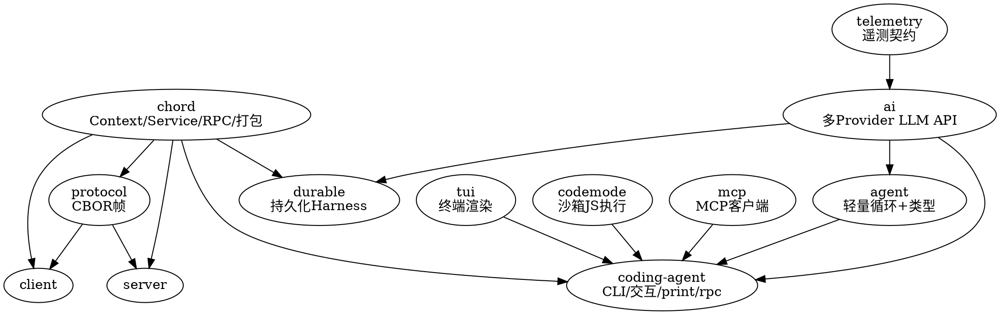

## Introduction

Pi 是跑在终端的 AI 编程 agent，使用指南见其姐妹笔记 Pi.md（位于 AI/LLM 枢纽下）。本文是其 **v1.0.0 内部实现**的架构拆解，基于 `git tag v1.0.0`（提交 `a13d35a74`）对实际代码核对：根 `package.json` 是私有 monorepo 元包（版本 `0.0.3`，不随发布走），**13 个 workspace 包锁步发布 `1.0.0`**。

Pi 的运行时正是 [Agent](/docs/CS/AI/LLM/Agent/Theory/Agent.md)（Loop / Tools / Memory / Harness 四构成）与 [Harness](/docs/CS/AI/LLM/Agent/Theory/Harness.md)（对模型能力缺口的补偿面）这两个抽象在 TypeScript 工程里的具体实现——读本文时可与那两篇对照。

> 结论以代码为准、非以文档为准：旧文档多处与 v1.0.0 实际代码打架，本文所有事实均来自对仓库的核对，关键差异见下文「包与分层」下的对照说明。

### Packages and Layering

| 包 | npm 名 | 职责 | 内部依赖 |
| --- | --- | --- | --- |
| `chord` | @earendil-works/chord | 应用组合运行时：Context、Service、RPC、facet 打包 | — |
| `telemetry` | @earendil-works/pi-telemetry | 厂商中立的遥测契约与类型化 schema | — |
| `tui` | @earendil-works/pi-tui | 终端 UI：差分渲染、布局、编辑器、markdown、按键 | — |
| `codemode` | @earendil-works/pi-codemode | 沙箱化 JavaScript 执行（唯一能力是调用注入的工具） | — |
| `mcp` | @earendil-works/pi-mcp | 独立的 Model Context Protocol 客户端 | — |
| `ai` | @earendil-works/pi-ai | 统一多 Provider LLM API、模型发现、鉴权 | telemetry |
| `agent` | @earendil-works/pi-agent-core | **轻量** Agent 循环 + 共享类型（不含持久化 Harness） | ai |
| `durable` | @earendil-works/pi-durable | 持久化对话/任务/文档运行时，含新一代 Harness 与 SQLite 后端 | chord, ai |
| `protocol` | @earendil-works/pi-protocol | 传输中立的 CBOR 帧协议（远程会话） | chord |
| `client` / `server` | @earendil-works/pi-client / pi-server | 远程会话客户端 / 服务器（实验性） | chord, protocol |
| `coding-agent` | @earendil-works/pi-coding-agent | 交互式编码 Agent CLI，最终产品（组装层） | chord, agent, ai, codemode, mcp, tui |
| `evals` | @earendil-works/pi-evals | 评测工具 | — |

> v1.0.0 与旧文档的关键差异：旧文档漏了 `codemode`/`mcp`，还列了一个已不存在的 `session-backends/sqlite-node` 包；SQLite 后端现并入 `pi-durable`（`@earendil-works/pi-durable/storage/sqlite/node`，导出 `openNodeSqliteStorage`）。

### Dependencies

边 `X → Y` 表示 **Y 依赖 X**（消费者在上、依赖在下）：



要点：

- `ai` 只依赖 `telemetry` 与各厂 SDK，不依赖 `agent` 或 `tui`。
- `agent`（pi-agent-core）是**纯轻量层**：只提供 Agent 循环与共享类型，不持有会话/工具/压缩/持久化 Harness，**不依赖 `chord`**。
- `coding-agent` 是唯一同时依赖全部基础包（含 `codemode`、`mcp`）的组装层。
- `durable` 内含新一代持久化 Harness，但**生产路径的 `coding-agent` 并不直接依赖它**——目前仅被 `experimental/`（vacation 规划器、client-tui-chat）试用。

### Layered Responsibilities (Key Points)

- **chord**：让"本地函数调用"与"跨进程 RPC"走同一套契约（Context 隐式传播 AbortSignal；Service 支持本地 loopback 与远程 wire；facet bundle 经 esbuild 隔离加载扩展）。
- **ai**：三层结构——API 适配层（`openai-*`/`anthropic-*`/`google-*`/`bedrock-*` 等，`.lazy.ts` 惰性注册）、Provider 层（**90+ Provider 定义**）、模型与鉴权（生成的 `models.generated.ts` 不可手改）。流式统一为 `EventStream` / `AssistantMessageEventStream`。
- **agent**（pi-agent-core）：v1.0.0 起精简为 `agent-loop.ts` / `agent.ts` / `proxy.ts` / `stream-fn.ts` / `types.ts`；`agentLoop()` 全程用 `AgentMessage`，只在调 LLM 边界转成 `Message[]`。旧的 `harness/`、`session/`、`tools/`、`compaction/`、`pico3/` 已全部移除。
- **durable**：文档/任务模型（`AgentDoc` rewindable + fork、`UserEntry`/`AssistantEntry`/`ToolResultEntry`… 不可变条目）；`Harness` + `GenerationTask`/`CompactionTask`/`ToolTask`（各带 checkpoint）+ `TaskGraph` + scheduler；`openNodeSqliteStorage` 后端。
- **tui / codemode / mcp**：终端渲染 / 沙箱 JS / MCP 客户端，均为可单独复用的基础能力。
- **coding-agent**：组装层。`core/` 内嵌生产路径的全部"重"能力——`AgentSession`、`compaction/`、`tools/`、会话/设置/技能/系统提示、信任机制。

### Core Request Chain: Two-Layer Collaboration Loop

生产路径 = `coding-agent/core` 的 `AgentSession` 驱动 `pi-agent-core` 的 `Agent`（内层 `runLoop`）。旧文档的 `driveOperation` / `lane` / `reducer` 持久化状态机已随精简被移除，换成下面这套：

- **内层 `runLoop`**（`agent-loop.ts`）：外层 `while(true)` + 内层 `while(hasMoreToolCalls || pendingMessages.length > 0)`。每个内层迭代即一个 turn：
  1. `prepareNextTurn`：轮间准备（可触发压缩、更新 context/model/thinkingLevel、拾取 steering 消息）
  2. `prepareRequest` 钩子：LLM 请求前的最后一次 context/model 裁决（含虚拟模型路由 + 阈值压缩）
  3. `streamAssistantResponse`：`transformContext` → `convertToLlm` → `streamSimple`（pi-ai），发射 `message_*` 事件
  4. 解析 toolCall → `executeToolCalls`（parallel/sequential）→ `finishTurn` 钩子（`action: end` 结束 / `continue` 续跑）
  5. 轮边界接入 steering / follow-up 队列
- **外层 `_runAgentPrompt`**（`AgentSession`）：驱动 `this.agent.prompt/continue`，每次运行结束按 `_handlePostAgentRun` 判定续跑或结算，最后过 `_runBeforeSettleBoundary`（扩展的 `agent_before_settle` 钩子）。

```sequence
Title: Pi 核心请求链路（两层循环交互）

participant U as 调用方(CLI/RPC)
participant S as AgentSession._runAgentPrompt
participant H as 钩子(prepareRequest/finishTurn/prepareNextTurn)
participant A as Agent(agent.ts)
participant L as runLoop(agent-loop.ts)
participant P as Provider(streamSimple)
participant T as 工具执行(executeToolCalls)
participant C as 压缩/重试/结算(_handlePostAgentRun)

U->>S: prompt(messages)
S->>A: agent.prompt(messages)
A->>L: runLoop()
loop 内层 while(还有 toolCall 或 pending/steering 消息)
  L->>H: prepareNextTurnWithContext(拾 steering/轮间压缩/重建系统提示)
  L->>H: prepareRequest(虚拟模型路由+阈值压缩)
  L->>A: streamAssistantResponse
  A->>P: streamSimple(transformContext→convertToLlm)
  P-->>A: AssistantMessage(toolCalls?/stopReason)
  A-->>L: AssistantMessage
  alt stopReason == error / aborted
    L->>L: finishTurn+turn_end+agent_end→break 内层
  else 含 toolCall
    L->>T: executeToolCalls(parallel/sequential)
    T-->>L: toolResults(terminate? 早停)
    L->>H: finishTurn(turn_end 边界, 可 continue/end)
  else 无 toolCall
    L->>H: finishTurn(end)
  end
  L->>L: turn_end; 轮询 steering 消息
end
L-->>A: agent_end(本轮 turn 序列结束)
A-->>S: 一次 agent 运行结束(runResult)
S->>C: _handlePostAgentRun(message)
alt 可重试错误(_isRetryableError)
  C->>C: _prepareRetry(omit attempt+指数退避)
  S->>A: agent.continue() 重试
  A->>L: runLoop() 重跑
else 压缩命中(_checkCompaction)
  C->>C: _runAutoCompaction/compact
  S->>A: agent.continue() 续跑
  A->>L: runLoop() 续跑
else 有排队消息(hasQueuedMessages)
  S->>A: agent.continue() 消费队列
  A->>L: runLoop() 续跑
else 进入结算
  S->>C: _runBeforeSettleBoundary(agent_before_settle 钩子)
  alt 钩子返回 true
    S->>A: agent.continue()
    A->>L: runLoop() 续跑
  else false
    S->>S: emit agent_settled
  end
end
Note over S: finally 中清理重试/flush bash+custom/emit agent_settled
```

读图要点：

- **续跑是无状态从头续**：外层每次 `agent.continue()` 重新进入 `runLoop`，后者从 agent 当前消息列表尾部继续生成，而非重启对话。
- **续跑 vs 结算的唯一裁决点是 `_handlePostAgentRun`**：只看上一次运行的结束态（错误可重试 / 压缩命中 / 队列非空），三者皆否才走 `_runBeforeSettleBoundary`——所以压缩/重试都发生在 turn 边界之后、下一轮生成之前，不会切到一半的生成里。
- **`agent_end` ≠ `agent_settled`**：`agent_end` 只是内层 `runLoop` 跑完，外层还要过一遍裁决；只有 `_runBeforeSettleBoundary` 返回 false 才真正结算。

### Tool Batches and Event Persistence

一个 assistant 消息里的多个 toolCall 组成一个 **tool batch**，由 `runLoop` 的 `executeToolCalls` 执行：

```sequence
Title: 单 tool batch 执行时序(生产路径)

participant L as runLoop
participant P as prepareToolCall
participant B as beforeToolCall 钩子
participant E as executePreparedToolCall
participant A as afterToolCall 钩子
participant M as SessionManager/事件总线

L->>P: 对每个 toolCall 走准备
P->>P: 工具查找→prepareArguments→validateToolArguments
P->>B: beforeToolCall(权限检查/改写)
alt block 或 terminate
  B-->>L: 拦截结果(可终止整批)
else 放行
  B->>E: 执行(可 onUpdate 推送 tool_execution_update 增量)
  E-->>A: result
  A->>A: 改写结果/置 terminate?
  A-->>L: toolResult
end
L->>M: tool_execution_start/_update/_end
L->>M: Promise.all 按源顺序物化 toolResult
L->>M: message_start/message_end(物化进 context+历史)
Note over L: 全批 terminate===true → hasMoreToolCalls=false → 本轮 turn 早停
```

- `beforeToolCall` / `afterToolCall` **贯穿嵌套调用**：工具内部再调子工具（`runToolCall`）时也过这两道钩子，权限检查不漏底。
- 事件持久化顺序固定：扩展先看到事件（`_emitExtensionEvent`）→ 通知外部监听器 → `SessionManager` 落盘（`message_end` 时 `appendMessage`）。保证"看到的即已持久化"。
- **压缩 3 类触发**：阈值（`shouldCompact` 命中）、溢出（`isContextOverflow`，可恢复时走"压缩+重试"且 `_overflowRecoveryAttempted` 仅允许一次）、手动（`/compact`/RPC，永不续跑被打断的 turn）。生产路径在 `core/compaction/`，与 `pi-durable` 的 `CompactionTask` 是两套并行实现。
- **取消**经 `AbortSignal` 向生成与工具传播；运行中 `abort()` 置 `_agentRunAbortRequested`，外层在下一判定点退出结算，不伪造结果。

### Run Mode and Remote Sessions

同一份 `AgentSession`，不同 I/O 外壳（`modes/`）：

| 模式 | 触发 | I/O | 用途 |
| --- | --- | --- | --- |
| interactive | TTY 直接运行 | pi-tui 全屏（v1.0.0 起默认 fullscreen）/主屏 | 人机交互 |
| print | `-p`、管道、非 TTY | stdin 输入，stdout 纯文本或 `--mode json` | 脚本、一次性提问 |
| rpc | `--mode rpc` | stdin/stdout 上的 JSON Lines 命令/事件 | 嵌入其他应用 |

- **rpc 协议**：stdin 每行一个 `RpcCommand`（`type`/`id`），`handleCommand` 按 `type` 分派，响应带 correlation id；`AgentSessionEvent` 作为事件流式输出；扩展可发起 `extension_ui` 请求由宿主应答。命令集覆盖 `steer`/`fork`/`set_model`/`compact`/`bash` 等。
- **远程会话（实验性）**：`protocol` + `client` + `server` 走 CBOR 帧（`PROTOCOL_VERSION = 8`），握手校验版本/`serverId` 实现多租户围栏，传输可换 Unix socket；链路 `Client → CBOR 帧 → Server → SessionRouter → chord service → AgentSession`。这与上面的进程内 RPC 是两套通道。

### Extension Loading (complementary to the Extension section of Pi.md)

- **加载与隔离**：`core/extensions/loader.ts` + `jiti-loader.ts` 用 jiti 在运行时加载 TS 扩展；复杂扩展可经 chord / esbuild 打成 facet bundle 隔离加载。内置扩展 `llama-cpp` / `codemode` / `mcp`（后者见 [MCP](/docs/CS/AI/LLM/Protocol/MCP.md)）。
- **非代码扩展点**：Skills（`SKILL.md`，可由模型自动触发）、Prompt Templates、Themes、Pi Packages——Pi.md 的 "Extension" 章节已展开，这里不再重复。

### Build, Quality and Configuration

- **构建顺序**（v1.0.0 实际）：`chord → tui → telemetry → codemode → mcp → ai → durable → agent → protocol → client → server → coding-agent`（旧文档把 `sqlite` 当包、漏了 `codemode`/`mcp`，已修正）。
- **质量门禁**：Biome（lint/format，warning 即失败）+ 原生 TypeScript 类型检查 + 入口图检查（防止分层被破坏）；`npm run check` 改代码后必跑。
- **数据/配置位置**：`~/.pi/agent/{settings.json,auth.json,trust.json}`、会话仓库 `~/.pi/agent/sessions/`（JSONL，可选用 SQLite 后端）；项目侧 `.pi/{settings.json,extensions,skills,prompt templates}`。格式升级经 `migrations.ts`。

## Links

- [Pi](/docs/CS/AI/LLM/Agent/Product/Pi.md)
- [LLM](/docs/CS/AI/LLM/LLM.md)

## References

- [Pi 上下文压缩](https://pi.dev/docs/latest/compaction)
- [Pi Extensions 文档](https://pi.dev/docs/latest/extensions)
- [Pi Packages 文档](https://pi.dev/docs/latest/pi-packages)
