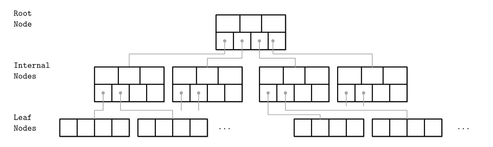
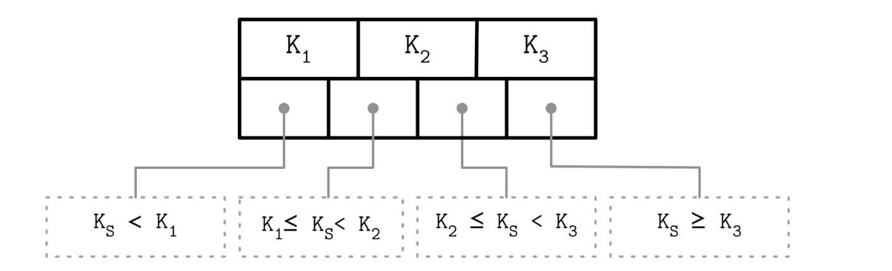

## Introduction

As B-trees have been around for so long, it’s not surprising that many optimizations have been developed over the years.
To mention just a few:

- Instead of overwriting pages and maintaining a WAL for crash recovery, some databases (like LMDB) use a copy-on-write scheme.
  A modified page is written to a different location, and a new version of the parent pages in the tree is created, pointing at the new location. This approach is also useful for concurrency control.
- We can save space in pages by not storing the entire key, but abbreviating it.
  Especially in pages on the interior of the tree, keys only need to provide enough information to act as boundaries between key ranges.
  Packing more keys into a page allows the tree to have a higher branching factor, and thus fewer levels.
- In general, pages can be positioned anywhere on disk; there is nothing requiring pages with nearby key ranges to be nearby on disk.
  If a query needs to scan over a large part of the key range in sorted order, that page-by-page layout can be inefficient, because a disk seek may be required for every page that is read.
  Many Btree implementations therefore try to lay out the tree so that leaf pages appear in sequential order on disk.
  However, it’s difficult to maintain that order as the tree grows.
  By contrast, since LSM-trees rewrite large segments of the storage in one go during merging, it’s easier for them to keep sequential keys close to each other on disk.
- Additional pointers have been added to the tree.
  For example, each leaf page may have references to its sibling pages to the left and right, which allows scanning keys in order without jumping back to parent pages.
- B-tree variants such as fractal trees borrow some log-structured ideas to reduce disk seeks (and they have nothing to do with fractals).

B-Trees are sorted: keys inside the B-Tree nodes are stored in order. 
Because of that, to locate a searched key, we can use an algorithm like binary search. 
This also implies that lookups in B-Trees have logarithmic complexity. For example, finding a searched key among 4 billion (4 × 109) items takes about 32 comparisons. 
If we had to make a disk seek for each one of these comparisons, it would significantly slow us down, but since B-Tree nodes store dozens or even hundreds of items, we only have to make one disk seek per level jump. 

B-Trees consist of multiple nodes. Each node holds up to N keys and N + 1 pointers to the child nodes. These nodes are logically grouped into three groups:

- Root node This has no parents and is the top of the tree.
- Leaf nodes These are the bottom layer nodes that have no child nodes.
- Internal nodes These are all other nodes, connecting root with leaves. There is usually more than one level of internal nodes.

This hierarchy is shown in Figure 9.

Fig.7. B-Tree node hierarchy.

Since B-Trees are a page organization technique (i.e., they are used to organize and navigate fixed-size pages), we often use terms node and page interchangeably.

The relation between the node capacity and the number of keys it actually holds is called occupancy.

B-Trees are characterized by their fanout: the number of keys stored in each node. Higher fanout helps to amortize the cost of structural changes required to keep the tree balanced and to reduce the number of seeks by storing keys and pointers to child nodes in a single block or multiple consecutive blocks. Balancing operations (namely, splits and merges) are triggered when the nodes are full or nearly empty.

>[!NOTE]
>We’re using the term B-Tree as an umbrella for a family of data structures that share all or most of the mentioned properties. A more precise name for the described data structure is B+-Tree. [KNUTH98] refers to trees with a high fanout as multiway trees.
>
> B-Trees allow storing values on any level: in root, internal, and leaf nodes. B+-Trees store values only in leaf nodes. Internal nodes store only separator keys used to guide the search algorithm to the associated value stored on the leaf level.
> 
> Since values in B+-Trees are stored only on the leaf level, all operations (inserting, updating, removing, and retrieving data records) affect only leaf nodes and propagate to higher levels only during splits and merges.
> 
> B+-Trees became widespread, and we refer to them as B-Trees, similar to other literature the subject. For example, MySQL InnoDB refers to its B+-Tree implementation as B-tree.

### Separator Keys

Keys stored in B-Tree nodes are called index entries, separator keys, or divider cells. They split the tree into subtrees (also called branches or subranges), holding corresponding key ranges. Keys are stored in sorted order to allow binary search. A subtree is found by locating a key and following a corresponding pointer from the higher to the lower level.

The first pointer in the node points to the subtree holding items less than the first key, and the last pointer in the node points to the subtree holding items greater than or equal to the last key. Other pointers are reference subtrees between the two keys: Ki-1 ≤ Ks < Ki, where K is a set of keys, and Ks is a key that belongs to the subtree. Figure 2-10 shows these invariants.

Fig.7. How separator keys split a tree into subtrees.

Some B-Tree variants also have sibling node pointers, most often on the leaf level, to simplify range scans. These pointers help avoid going back to the parent to find the next sibling. Some implementations have pointers in both directions, forming a double-linked list on the leaf level, which makes the reverse iteration possible.

What sets B-Trees apart is that, rather than being built from top to bottom (as binary search trees), they’re constructed the other way around—from bottom to top. The number of leaf nodes grows, which increases the number of internal nodes and tree height.

Since B-Trees reserve extra space inside nodes for future insertions and updates, tree storage utilization can get as low as 50%, but is usually considerably higher. Higher occupancy does not influence B-Tree performance negatively.

### B-Tree Lookup Complexity

B-Tree lookup complexity can be viewed from two standpoints: the number of block transfers and the number of comparisons done during the lookup.

In terms of number of transfers, the logarithm base is N (number of keys per node). There are K times more nodes on each new level, and following a child pointer reduces the search space by the factor of N. During lookup, at most logK M (where M is a total number of items in the B-Tree) pages are addressed to find a searched key. The number of child pointers that have to be followed on the root-to-leaf pass is also equal to the number of levels, in other words, the height h of the tree.

From the perspective of number of comparisons, the logarithm base is 2, since searching a key inside each node is done using binary search. Every comparison halves the search space, so complexity is log2 M.
In textbooks and articles,2 B-Tree lookup complexity is generally referenced as log M.

To find an item in a B-Tree, we have to perform a single traversal from root to leaf. The objective of this search is to find a searched key or its predecessor. Finding an exact match is used for point queries, updates, and deletions; finding its predecessor is useful for range scans and inserts.

The algorithm starts from the root and performs a binary search, comparing the searched key with the keys stored in the root node until it finds the first separator key that is greater than the searched value. This locates a searched subtree. As we’ve discussed previously, index keys split the tree into subtrees with boundaries between two neighboring keys. As soon as we find the subtree, we follow the pointer that corresponds to it and continue the same search process (locate the separator key, follow the pointer) until we reach a target leaf node, where we either find the searched key or conclude it is not present by locating its predecessor.

On each level, we get a more detailed view of the tree: we start on the most coarse-grained level (the root of the tree) and descend to the next level where keys represent more precise, detailed ranges, until we finally reach leaves, where the data records are located.

During the point query, the search is done after finding or failing to find the searched key. During the range scan, iteration starts from the closest found key-value pair and continues by following sibling pointers until the end of the range is reached or the range predicate is exhausted.

### Node Splits and Merges

To insert the value into a B-Tree, we first have to locate the target leaf and find the insertion point. After the leaf is located, the key and value are appended to it. Updates in B-Trees work by locating a target leaf node using a lookup algorithm and associating a new value with an existing key.

If the target node doesn’t have enough room available, we say that the node has overflowed [NICHOLS66] and has to be split in two to fit the new data. More precisely, the node is split if the following conditions hold:
- For leaf nodes: if the node can hold up to N key-value pairs, and inserting one more key-value pair brings it over its maximum capacity N.
- For nonleaf nodes: if the node can hold up to N + 1 pointers, and inserting one more pointer brings it over its maximum capacity N + 1.

Splits are done by allocating the new node, transferring half the elements from the splitting node to it, and adding its first key and pointer to the parent node. In this case, we say that the key is promoted. The index at which the split is performed is called the split point (also called the midpoint). All elements after the split point (including split point in the case of nonleaf node split) are transferred to the newly created sibling node, and the rest of the elements remain in the splitting node.

If the parent node is full and does not have space available for the promoted key and pointer to the newly created node, it has to be split as well. This operation might propagate recursively all the way to the root.

As soon as the tree reaches its capacity (i.e., split propagates all the way up to the root), we have to split the root node. When the root node is split, a new root, holding a split point key, is allocated. The old root (now holding only half the entries) is demoted to the next level along with its newly created sibling, increasing the tree height by one. The tree height changes when the root node is split and the new root is allocated, or when two nodes are merged to form a new root. On the leaf and internal node levels, the tree only grows horizontally.

To summarize, node splits are done in four steps:

1. Allocate a new node.
2. Copy half the elements from the splitting node to the new one.
3. Place the new element into the corresponding node.
4. At the parent of the split node, add a separator key and a pointer to the new node.

Deletions are also done by first locating the target leaf. When the leaf is located, the key and the value associated with it are removed.

If neighboring nodes have too few values (i.e., their occupancy falls under a threshold), the sibling nodes are merged. This situation is called underflow. [BAYER72] describes two underflow scenarios: if two adjacent nodes have a common parent and their contents fit into a single node, their contents should be merged (concatenated); if their contents do not fit into a single node, keys are redistributed between them to restore balance (see “Rebalancing”). More precisely, two nodes are merged if the following conditions hold:

- For leaf nodes: if a node can hold up to N key-value pairs, and a combined number of key-value pairs in two neighboring nodes is less than or equal to N.
- For nonleaf nodes: if a node can hold up to N + 1 pointers, and a combined number of pointers in two neighboring nodes is less than or equal to N + 1.

To summarize, node merges are done in three steps, assuming the element is already removed:

1. Copy all elements from the right node to the left one.
2. Remove the right node pointer from the parent (or demote it in the case of a nonleaf merge).
3. Remove the right node.

One of the techniques often implemented in B-Trees to reduce the number of splits and merges is rebalancing.

## Rebalancing

Some B-Tree implementations attempt to postpone split and merge operations to amortize their costs by rebalancing elements within the level, or moving elements from more occupied nodes to less occupied ones for as long as possible before finally performing a split or merge. This helps to improve node occupancy and may reduce the number of levels within the tree at a potentially higher maintenance cost of rebalancing.

Load balancing can be performed during insert and delete operations.
To improve space utilization, instead of splitting the node on overflow, we can transfer some of the elements to one of the sibling nodes and make space for the insertion. Similarly, during delete, instead of merging the sibling nodes, we may choose to move some of the elements from the neighboring nodes to ensure the node is at least half full.

B*-Trees keep distributing data between the neighboring nodes until both siblings are full. 
Then, instead of splitting a single node into two half-empty ones, the algorithm splits two nodes into three nodes, each of which is two-thirds full.
SQLite uses this variant in the implementation. 
This approach improves an average occupancy by postponing splits, but requires additional tracking and balancing logic. 
Higher utilization also means more efficient searches, because the height of the tree is smaller and fewer pages have to be traversed on the path to the searched leaf.

Figure 4-9 shows distributing elements between the neighboring nodes, where the left sibling contains more elements than the right one. 
Elements from the more occupied node are moved to the less occupied one. 
Since balancing changes the min/max invariant of the sibling nodes, we have to update keys and pointers at the parent node to preserve it.

Fig.7. B-Tree balancing: Distributing elements between the more occupied node and the less occupied one.

Contained in each interior node are pointers p1, p2, . . . , pm to the children, and values k1, k2, . . . , km - 1, representing the smallest key found in the subtrees p2, p3, . . . , pm respectively.
Of course, some of these pointers might be NULL, and the corresponding ki would then be undefined. For every node, all the keys in subtree p1 are smaller than the keys in subtree p2, and so on.
The leaves contain all the actual data, which is either the keys themselves or pointers to records containing the keys. We will assume the former to keep our examples simple.
There are various definitions of B-trees that change this structure in mostly minor ways, but this definition is one of the popular forms.
We will also insist (for now) that the number of keys in a leaf is also between m/2 and m.

A B-tree of order 4 is more popularly known as a 2-3-4 tree, and a B-tree of order 3 is known as a 2-3 tree.

With general B-trees of order m, when a key is inserted, the only difficulty arises when the node that is to accept the key already has m keys.
This key gives the node m + 1 keys, which we can split into two nodes with  (m + 1) / 2  and  (m + 1) / 2  keys respectively.
As this gives the parent an extra node, we have to check whether this node can be accepted by the parent and split the parent if it already has m children.
We repeat this until we find a parent with less than m children. If we split the root, we create a new root with two children.

The depth of a B-tree is at most $\log_{[M/2]}{N}$.

The real use of B-trees lies in database systems, where the tree is kept on a physical disk instead of main memory.
Accessing a disk is typically several orders of magnitude slower than any main memory operation.
If we use a B-tree of order m, then the number of disk accesses is O(logm n).
Although each disk access carries the overhead of O(log m) to determine the direction to branch, the time to perform this computation is typically much smaller than the time to read a block of memory and can thus be considered inconsequential (as long as m is chosen reasonably).
Even if updates are performed and O(m) computing time is required at each node, this too is generally not significant.
The value of m is then chosen to be the largest value that still allows an interior node to fit into one disk block, and is typically in the range 32  m  256.
The maximum number of elements that are stored in a leaf is chosen so that if the leaf is full, it fits in one block.
This means that a record can always be found in very few disk accesses, since a typical B-tree will have a depth of only 2 or 3, and the root (and possibly the first level) can be kept in main memory.

Analysis suggests that a B-tree will be ln 2 = 69 percent full.
Better space utilization can be obtained if, instead of always splitting a node when the tree obtains its (m + 1)th entry, the routine searches for a sibling that can take the extra child.

## Links

- [Trees](/docs/CS/Algorithms/tree.md?id=B-Trees)

## References

1. [Performance of B+ tree concurrency control algorithms](https://minds.wisconsin.edu/bitstream/handle/1793/59428/TR999.pdf)
2. [Concurrency of operations on B-trees]()
3. [Concurrent B-trees with Lock-free Techniques](http://www.cs.umanitoba.ca/~hacamero/Research/BtreeTechrpt2011.pdf)
4. [Efficient Locking for Concurrent Operations on B-Trees](https://www.cs.utexas.edu/users/dsb/cs386d/Readings/ConcurrencyControl/Lehman-Yao.pdf)
