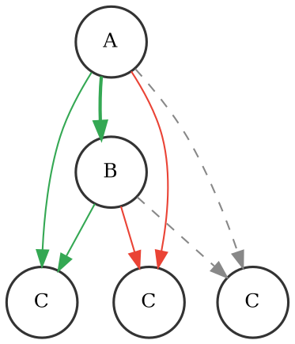
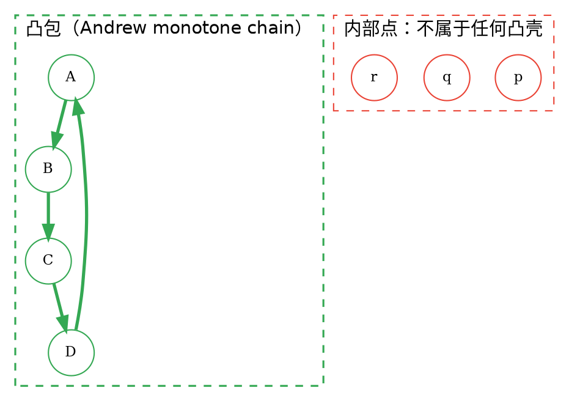

## Introduction

**计算几何**（*computational geometry*）是计算机科学的一个分支，研究**如何把几何问题算法化**：给定点、线、多边形等几何对象，设计算法高效地回答「它们相交吗」「最远的点对是谁」「凸包是什么」「这两条线段有没有公共点」这类问题。

它的独特之处在于**输入是连续量**。在图论里顶点与边是离散的、可以直接比较相等与否；而在计算几何里坐标是实数，算法必须处理「浮点误差」「退化情形（共线、重合、零长度）」「$O(n^2)$ 的朴素枚举是否够用」这些问题。因此本域的算法普遍带有**坐标变换、排序 + 扫描、旋转卡壳、分治**等套路。

**应用领域**：

- **计算机图形学**：碰撞检测（两个物体是否相交）、光线追踪（求交点）、多边形裁剪、三角网格的凸包与 Delaunay 三角剖分。
- **GIS**（地理信息系统）：地图上的「两点间距离」「点在多边形内吗」「行政区域相邻关系」，本质就是欧氏距离、点在多边形内判定、多边形求交。
- **机器人学**：运动规划中的自由空间建模、栅格地图下的最短路径、机械臂的碰撞检测。
- **CAD / 制造**：凸包用于「切掉毛刺」（凸包算法在数控加工中就有直接用途）、多边形布尔运算、3D 打印的支撑结构生成。
- **计算生物学**：DNA 序列的凸包与聚类、蛋白质结构的分子表面计算。

**与其它算法分支的关系**：

- 计算几何与**图论**彼此渗透：几何对象离散化之后常变成图问题（例如 Delaunay 邻接图本身就是平面图），最短路径在点集上就是几何问题（欧拉图笔记中的中国邮递员问题就同时用到两者）。
- 不少计算几何算法本质是**分治**（Andrew 凸包、$kd$-tree、最近点对）——正是分治框架「分解 → 递归 → 合并」的直接套用。
- 与**凸优化 / 线性规划**同源：半平面交、闵可夫斯基和的凸包计算都会用到凸集的性质。

本笔记只覆盖入门所需的**基础工具与两个经典算法**（凸包、线段相交判定），更进阶的旋转卡壳、半平面交、三维计算几何等另见文末链接。

### Vectors and Cross Product
把一个点视为从原点出发的**向量**。对于两个向量 $u = (u_x, u_y)$ 与 $v = (v_x, v_y)$，定义它们的**二维叉积**（cross product，又称行列式）为

$$u \times v = u_x v_y - u_y v_x$$

从 $u$ **逆时针旋转到** $v$ 所扫过的**有向角**若在 $(0, \pi)$ 内，叉积为正；在 $(-\pi, 0)$ 内为负；若两向量平行（共线）则为 0。

> **orientation 判据**：设三点 $A, B, C$，令 $u = B - A$、$v = C - A$，计算 $u \times v$：
>
> - $u \times v > 0$ ⇒ $C$ 在有向直线 $A \to B$ 的**左侧**（$A \to B \to C$ **逆时针转向**，turn counter-clockwise）
> - $u \times v < 0$ ⇒ $C$ 在**右侧**（**顺时针**转向，turn clockwise）
> - $u \times v = 0$ ⇒ 三点**共线**（collinear）

注意这里减的是**同一个起点** $A$：判断「$C$ 在 $AB$ 哪一侧」必须用 $\overrightarrow{AB} \times \overrightarrow{AC}$，混用 $\overrightarrow{BA}$ 会让符号整体翻转。

叉积还有一个等价的**几何解释**：$u \times v$ 的绝对值等于以 $u, v$ 为邻边的平行四边形的**面积**，符号表示旋向。这个解释是「浮点求面积」类做法的来源（$2S = u \times v$），也是下文「鲁棒性」一节要处理的隐患所在。

**叉积是本域一切算法的基础**：凸包靠它判断转向，线段相交靠它判断上下，Andrew 扫描线靠它决定栈顶弹不弹出，扫描线求面积靠它累加有向面积。下面这个 dot 图给出了三种判据的对照。

上图中三条绿色/红色实线是三个不同的 $C$ 各自相对同一条 $A \to B$ 的位置：$C$ 在上方则叉积为正，在下方则为负，落在 $AB$ 上则为 0。

### Dot Product and Projection
与叉积互补，**点积**（dot product）定义为

$$u \cdot v = u_x v_x + u_y v_y$$

点积的**符号**给出**同向 / 反向**的判据（因为 $u \cdot v = |u||v|\cos\theta$）：

- $u \cdot v > 0$ ⇒ 夹角为锐角，$u$ 与 $v$ **同向**趋势
- $u \cdot v = 0$ ⇒ $u \perp v$，**正交**（这就是「垂直」的标准判定）
- $u \cdot v < 0$ ⇒ 夹角为钝角，$u$ 与 $v$ **反向**趋势

同时点积给出**长度投影**：向量 $u$ 在 $v$ 方向上的**有向投影长度**为

$$\operatorname{proj}_v(u) = \frac{u \cdot v}{|v|}$$

若 $|v| = 1$（$v$ 是单位向量），则直接等于 $u \cdot v$。这一形式是「判断点在直线哪一侧」「判断点是否落在线段的投影范围上」「计算重心坐标」的基础。

> **判断点在有向直线 $A \to B$ 的哪一侧**：用点积 $\overrightarrow{AB} \cdot \overrightarrow{AC}$，其符号表示 $C$ 在直线 $A \to B$ 的**正向投影**方向上。叉积判「侧」（上下），点积判「前 / 后」（左右），二者解决的是不同维度的问题。

## Distance
### Euclidean Distance
欧氏距离，一般也称作欧几里得距离。在平面直角坐标系中，设点 $[A,B$  的坐标分别为 $[A(x_1,y_1),B(x_2,y_2)$，则两点间的欧氏距离为：

 $\left | AB \right | = \sqrt{\left ( x_2 - x_1 \right )^2 + \left ( y_2 - y_1 \right )^2}$

在多维空间中，欧氏距离推广为

$$d(A, B) = \sqrt{\sum_{i=1}^{n} (a_i - b_i)^2}$$

**其他常用度量**（竞赛中按题面选用）：

| 度量 | 公式（$n$ 维） | 几何意义 | 特点 |
| --- | --- | --- | --- |
| 欧氏距离 | $\sqrt{\sum (a_i-b_i)^2}$ | 直线距离 | 满足三角不等式，各向同性，最常用 |
| **曼哈顿距离**（$L_1$、出租车距离） | $\sum \lvert a_i-b_i\rvert$ | 沿坐标轴行走的距离 | 计算只需加减、无平方根；度量的是「各维独立累加」 |
| **切比雪夫距离**（$L_\infty$） | $\max_i \lvert a_i-b_i\rvert$ | 各维最大值 | 对应「同时沿各轴以同一速度移动」 |
| **平方欧氏距离** | $\sum (a_i-b_i)^2$ | 无（不是度量） | 见下 |

三者构成 Minkowski 距离的特例：$L_p$ 距离为 $\left(\sum \lvert a_i-b_i\rvert^p\right)^{1/p}$，$p=1$ 为曼哈顿、$p=2$ 为欧氏、$p=\infty$ 为切比雪夫。

**平方欧氏距离**是竞赛中最实用的一个「优化版」：它**不满足三角不等式**（所以不是度量），但**完全保持大小关系**——因为 $d \ge 0$，有 $d_1^2 \le d_2^2 \iff d_1 \le d_2$。因此：

- **只比较大小时**（找最近点、判断是否在半径 $r$ 内）一律比较平方值，**省掉 `sqrt` 也避免了一次舍入误差**。判断点 $P$ 是否在以 $O$ 为心、半径 $r$ 的圆内，用 $|P-O|^2 \le r^2$ 即可。
- **需要累加时必须小心**：它只能用于比较，不能直接代入需要三角不等式的算法（如 Dijkstra）中。
- **KD-tree、动态点集最近邻**等数据结构普遍以平方距离为关键字。

### Segment Intersection Test
给定线段 $A_1A_2$ 与 $B_1B_2$，最朴素的做法是**参数方程法**。点在线段 $A_1A_2$ 上可写作

$$P = A_1 + t(A_2 - A_1), \quad t \in [0, 1]$$

两线段相交当且仅当存在 $t, s \in [0, 1]$ 使得

$$A_1 + t(A_2 - A_1) = B_1 + s(B_2 - B_1)$$

这是一个 2 元一次方程组，用**叉积**解出 $t, s$ 后判断它们是否都落在 $[0,1]$ 内。

但工程上更常用、更稳健的经典方法是**叉积符号法 + 包围盒（bounding box）判定 + 共线重叠特判**，分两步：

**第一步（包围盒快速排除）**：若两个线段在 $x$ 轴或 $y$ 轴上的投影区间**不相交**，则两线段必不相交。这一步 $O(1)$ 且能过滤掉绝大多数情况。

**第二步（叉积跨立判断）**：记

$$\begin{aligned}c_1 &= (A_2 - A_1) \times (B_1 - A_1) \\
c_2 &= (A_2 - A_1) \times (B_2 - A_1) \\
c_3 &= (B_2 - B_1) \times (A_1 - B_1) \\
c_4 &= (B_2 - B_1) \times (A_2 - B_1)
\end{aligned}$$

若 $c_1, c_2$ **异号**（即 $(c_1 \le 0 \le c_2)$ 或 $c_2 \le 0 \le c_1$），说明 $B_1, B_2$ 分居直线 $A_1A_2$ 两侧；同理若 $c_3, c_4$ 异号，说明 $A_1, A_2$ 分居直线 $B_1B_2$ 两侧。**两者同时成立时，两线段必相交**（交点唯一，为真交叉）。

**第三步（共线重叠的特判）**：叉积全为 0 时无法用「异号」判断——因为「异号」此时退化成「全 0」，与「相交」混淆。这是**最容易写错的地方**：两线段共线时，叉积方法返回的判定是无效的，必须单独处理：

- 先确认 $A_1, A_2, B_1$ 共线且 $A_1, A_2, B_2$ 共线（同一条件，验一次即可）；
- 再判断区间 $[B_1, B_2]$ 是否与 $[A_1, A_2]$ **在数轴上有公共点**。常用做法是把叉积判据加强为「**异号或为零**」（用 `(c1 <= 0 && c2 >= 0) || (c1 >= 0 && c2 <= 0)`），并配合参数 $t$ 的区间检查 $[0,1]$——后者可统一处理「端点接触」「完全包含」「部分重叠」三种共线情形。

总结成判定逻辑：

| 情形 | 判定 |
| --- | --- |
| 包围盒不相交 | 不相交 |
| 叉积跨立（两对均异号） | 相交（真交叉） |
| 全部共线 | 用投影区间 / 参数 $t \in [0,1]$ 判断重叠 |
| 端点恰好落在对方线段上 | 相交（需在上述两种判定中一并覆盖） |

**复杂度 $O(1)$**。在算法竞赛中，处理$n$ 条线段两两相交、或判断「某条线段与所有线段是否相交」时，常先按 $x$ 坐标排序以批量排除（见下节扫描线）。

### Convex Hull
**凸包**是一个点集的**最小凸集合**，包含该点集的全部点。等价地，它是「套住所有点的最紧的凸多边形」。二维点集的凸包一定是一个**凸多边形**（点集退化时可能退化成线段或单点）。

> **重要性质：凸包顶点 = 「删不掉的点」。** 对点集中任一点 $P$，若 $P$ **不在**凸包顶点集合中，则 $P$ 一定处在由其它点张成的凸包**内部或边界上**。换言之，**凸包上的点集恰好是那些无法被表示为其它点凸组合的点**（极点）。许多题目的「求最简/最少的点以覆盖其余点」本质上就是在求凸包。

**Andrew monotone chain 算法**，$O(n\log n)$：

1. 把所有点按 $x$ 坐标升序排序，$x$ 相同时按 $y$ 升序；
2. 从左到右扫描，维护一个**下凸壳**的栈：每次把新点 $p$ 入栈前，若栈顶两点与 $p$ 构成的转向**不是**右转（即构成左转或共线），就弹出栈顶，重复直到栈空或可以入栈；
3. 从右到左对称扫描，得到**上凸壳**；
4. 合并上下凸壳。

复杂度来自第 1 步的排序（$O(n\log n)$）；扫描时每个点最多入栈、出栈各一次，故为 $O(n)$。总空间 $O(n)$。

图中虚线内 4 个绿色点是凸包顶点，3 个红点位于凸包内部——它们永远无法成为凸包顶点，这正是「删不掉的点」性质的直观体现。

**Graham scan** 是另一个经典算法：先找**极点**（通常取 $y$ 最小、若相同取 $x$ 最小的点）作为**极点（pivot）**，其余点按**极角**排序，然后用栈做与 Andrew 相同的单调栈维护（转向判定换成「相对极角是否单调」）。复杂度同为 $O(n\log n)$。

两者的取舍：Andrew 只需按 $x$ 排序、**不需要处理极角计算与象限分类**，实现更稳健、代码更短，因此竞赛中通常优先选 Andrew；Graham scan 的优势在于**可以增量地扩展凸包**，且与旋转卡壳（rotating calipers）天然衔接。

**应用**：求一组点的最小包围形状、图像处理中的**凸包拟合**（去噪、提取轮廓）、凸包上求直径（旋转卡壳，$O(n)$）、以及上文「删不掉的点」支撑的「最简覆盖 / 极点求解」类题目。

### Sweep Line
一句话概括思想：**把二维问题退化成一维**——用一条沿 $x$ 轴（或其他方向）平移的**扫描线**，让几何对象按坐标顺序一个个「事件」进入与离开，从而把二维的交叠关系转化为一维的区间重叠关系，再由一维的「区间覆盖 / 优先级队列 / 已排序结构」高效维护。

典型流程是「**排序 + 扫描 + 维护**」：

1. 构造**事件序列**：线段的两个端点各成为一个事件（按 $x$ 坐标排序，同 $x$ 时需约定先入后出的处理顺序）。
2. 扫描过程中遇到「进入」事件就把对象加入数据结构（如平衡树、优先队列），遇到「退出」事件就删除。
3. 「求最近点对」「求线段交点」「求区间覆盖长度」等二维问题都在这个过程中被解决或过滤。

**扫描线是几何「分治 / 交换论证」这一典型思路的化身**：与分治一样，它把一个不好整体处理的问题**沿某个方向切割**，让每个子问题在切割后变得容易；与交换论证一样，它靠**「交换」一对错综复杂的对象来消除逆序**——线段相交检测里经典的**两线段交换引理**（两条相交线段必然在「进入顺序」与「离开顺序」上呈现逆序）正是交换论证的标准范例，也是 $O((n+k)\log n)$ 输敏线段交点算法的基础。

它同时为后续算法准备了工具：最近点对分治的 $O(n\log n)$、区间覆盖、以及旋转卡壳都建立在「沿某方向排序后顺序处理」的同一套思路上。

### Floating Point and Robustness
几何算法的一切正确性都建立在**精确的符号判断**（如「叉积是正还是负」）之上，而浮点运算会引入舍入误差——这会让本该为 0 的叉积算出一个极小的非零值（如 $10^{-12}$），进而让**整个分支走向错误的一侧**，算法静默地给出错误答案。这类 bug 极难调试，因为小规模数据往往测试不出来。

**三类典型问题**：

1. **符号判错**：共线判成不共线，或反之。后果是凸包多算一个点、线段相交判定错误。
2. **坐标放大导致精度丢失**：大坐标（如 $10^9$ 级）叠加小差值时，差值在浮点表示下被「吃掉」，同一坐标的不同算法路径给出不同结果。经典案例是**整数斜率 vs 浮点斜率**在大坐标下判定不一致。
3. **退化与重复**：重合点、零长度线段、多条三点共线——这些情形在理论中合法，但会让大量「特判」分支变得不完备。

**应对手段**：

- **用整数替代浮点**：若输入坐标都是整数，则**全程用整数运算**，只在最后需要实际长度时才算一次 `sqrt`。许多几何题特意保证整数坐标，正是为了避开浮点问题。
- **精确谓词（exact / robust predicate）**：把 orientation 判定改成「算两次」的形式——先用 `double` 快速算出叉积 $u \times v$ 及其误差上界 $\text{err}$，若 $|u \times v| > \text{err}$ 则直接采用该符号；否则**改用更高精度**（`long double` 或精确的有理数 / 大整数运算）重算。这就是**自适应精度谓词**的核心思想。
- **整数谓词库**：工业级几何库（如 CGAL）实现 orientation 时使用**过滤（filtering）技术**——底层用一个保证精确的整数谓词（如通过展开到更高精度实现的 `incircle`、`orient2d`），上层用浮点做快速过滤，从而既快又精确。这也是「为何工业库用整数谓词」的答案：浮点只用来「排除那些显然安全的情况」，一旦存疑就回退到精确整数运算。

## Links

- [Algorithms](/docs/CS/Algorithms/Algorithms.md)
- [Divide and Conquer](/docs/CS/Algorithms/Divide-and-Conquer.md)
- [Monotonic Stack](/docs/CS/Algorithms/struct/MonotonicStack.md)
- [Greedy](/docs/CS/Algorithms/Greedy.md)

## References

1. [计算几何部分简介 - OI Wiki](https://oi-wiki.org/geometry/)
2. [二维计算几何基础 - OI Wiki](https://oi-wiki.org/geometry/2d/)
3. [凸包 - OI Wiki](https://oi-wiki.org/geometry/convex-hull/)