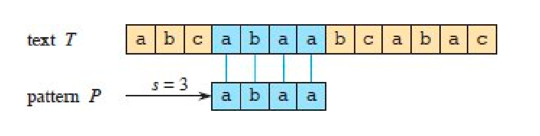
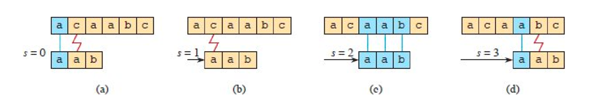

## Introduction

The string-matching problem can be stated formally as follows.
The text is given as an array T[1 : n] of length n, and the pattern is an array P[1 : m] of length m ≤ n.
The elements of P and T are characters drawn from an alphabet ∑, which is a finite set of characters.
For example, ∑ could be the set {0, 1}, or it could be the set {a, b, …, z}.
The character arrays P and T are often called strings of characters.

As Figure 1 shows, pattern P occurs with shift s in text T (or, equivalently, that pattern P occurs beginning at position s + 1 in text T)
if 0 ≤ s ≤ n – m and $T[s + 1:s + m] = P[1:m]$, that is, if T[s + j] = P[j], for 1 ≤ j ≤ m.
If P occurs with shift s in T, then s is a valid shift, and otherwise, s is an invalid shift.
The string-matching problem is the problem of finding all valid shifts with which a given pattern P occurs in a given text T.

<div style="text-align: center;">



</div>

<p style="text-align: center;">
Figure 1 An example of the string-matching problem to find all occurrences of the pattern P = abaa in the text T = abcabaabcabac.
<br/>
The pattern occurs only once in the text, at shift s = 3, which is a valid shift.
<br/>
A vertical line connects each character of the pattern to its matching character in the text, and all matched characters are shaded blue.
</p>

Except for the naive brute-force algorithm, each string-matching algorithm in this chapter performs some preprocessing based on the pattern and then finds all valid shifts.
We call this latter phase “matching.”
Here are the preprocessing and matching times for each of the string-matching algorithms.

The total running time of each algorithm is the sum of the preprocessing and matching times:


| Algorithm          | Preprocessing time | Matching time      |
| -------------------- | -------------------- | -------------------- |
| Naive              | $0$                | $O((n – m + 1)m)$ |
| Rabin-Karp         | $O(m)$             | $O((n – m + 1)m)$ |
| Finite automaton   | $O(m$              | $∑$               |
| Knuth-Morris-Pratt | $O(m)$             | $O(n)$             |
| Suffix array1      | $O(n1gn)$          | $O(m 1g n + km)$   |

We present an interesting string-matching algorithm, due to Rabin and Karp.
Although the Θ((n – m + 1)m) worst-case running time of this algorithm is no better than that of the naive method, it works much better on average and in practice.
It also generalizes nicely to other pattern-matching problems.
Then describes a string-matching algorithm that begins by constructing a finite automaton specifically designed to search for occurrences of the given pattern P in a text.
This algorithm takes $O(m |∑|)$ preprocessing time, but only Θ(n) matching time.
We present the similar, but much cleverer, [Knuth-Morris-Pratt (or KMP) algorithm](/docs/CS/Algorithms/KMP.md?id=KMP), which has the same $O(n)$ matching time, but it reduces the preprocessing time to only $O(m)$.

A completely different approach appears which examines suffix arrays and the longest common prefix array.
You can use these arrays not only to find a pattern in a text, but also to answer other questions,
such as what is the longest repeated substring in the text and what is the longest common substring between two texts.
The algorithm to form the suffix array takes $O(n 1g n)$ time and, given the suffix array, shows how to compute the longest common prefix array in $O(n)$ time.

## The naive string-matching algorithm

The *Naive-String-Matcher* procedure finds all valid shifts using a loop that checks the condition $P[1:m] = T[s+1:s+m]$ for each of the n−m+1 possible values of s.

Naive-String-Matcher(T, P, n, m)

```
for s = 0 to n – m
    if P[1:m] == T[s + 1:s + m]
        print “Pattern occurs with shift” s
```

Figure 3 portrays the naive string-matching procedure as sliding a “template” containing the pattern over the text,
noting for which shifts all of the characters on the template equal the corresponding characters in the text.
The for loop of lines 1–3 considers each possible shift explicitly.
The test in line 2 determines whether the current shift is valid.
This test implicitly loops to check corresponding character positions until all positions match successfully or a mismatch is found.
Line 3 prints out each valid shift s.

<div style="text-align: center;">



</div>

<p style="text-align: center;">
Figure 2 
The operation of the Naive-String-Matcher procedure for the pattern P = aab and the text T = acaabc.
<br/>
Imagine the pattern P as a template that slides next to the text. (a)–(d) 
The four successive alignments tried by the naive string matcher. 
In each part, vertical lines connect corresponding regions found to match (shown in blue), and a red jagged line connects the first mismatched character found, if any. 
<br/>
The algorithm finds one occurrence of the pattern, at shift s = 2, shown in part (c).
</p>

Procedure Naive-String-Matcher takes $O((n – m + 1)m)$ time, and this bound is tight in the worst case.
For example, consider the text string an (a string of na’s) and the pattern am.
For each of the n−m+1 possible values of the shift s, the implicit loop on line 2 to compare corresponding characters must execute m times to validate the shift.
The worst-case running time is thus $O((n − m + 1)m)$, which is $Θ(n^2)$ if $m = [n/2]$.
Because it requires no preprocessing, Naive-String-Matcher’s running time equals its matching time.

Naive-String-Matcher is far from an optimal procedure for this problem.
The naive string matcher is inefficient because it entirely ignores information gained about the text for one value of s when it considers other values of s.
Such information can be quite valuable, however. For example, if P = aaab and s = 0 is valid, then none of the shifts 1, 2, or 3 are valid, since T[4] = b.
The following sections examine several ways to make effective use of this sort of information.

## The Rabin-Karp algorithm

## BF

Brute-force substring search requires ~NM character compares to search for a pattern of length M in a text of length N, in the worst case.

## MP

## KMP

Temp array

Knuth-Morris-Pratt substring search accesses no more than M+N characters to search for a pattern of length M in a text of length N.

space complexity O(N)

```java
public class KMPSearch {
    public static void main(String[] args) {
        String str = "abcxabcdabcdabcy";
        String subString = "abcdabcy";
        KMPSearch ss = new KMPSearch();
        boolean result = ss.KMP(str.toCharArray(), subString.toCharArray());
        System.out.print(result);
    }

    public boolean KMP(char[] text, char[] pattern) {
        int[] lps = computeTemporaryArray(pattern);
        int i = 0;
        int j = 0;
        while (i < text.length && j < pattern.length) {
            if (text[i] == pattern[j]) {
                i++;
                j++;
            } else {
                if (j != 0) {
                    j = lps[j - 1]; // return the latest matched index
                } else {
                    i++;
                }
            }
        }
        return j == pattern.length;
    }

    /**
     * index, i
     * 1. if equals, lps[i] = index + 1, index++ i++
     * 2. else 
     *      1. if index != 0, index = lps[index - 1]
     *      2. else lps[i] = 0, i++
     */
    private int[] computeTemporaryArray(char[] pattern) {
        int[] lps = new int[pattern.length];
        int index = 0;
        for (int i = 1; i < pattern.length; ) {
            if (pattern[i] == pattern[index]) {
                lps[i] = index + 1;
                index++;
                i++;
            } else {
                if (index != 0) {
                    index = lps[index - 1];
                } else {
                    lps[i] = 0;
                    i++;
                }
            }
        }
        return lps;
    }
}
```

## BM

## BMH

## RK

## Links

- [algorithm analysis](/docs/CS/Algorithms/Algorithms.md?id=algorithm-analysis)
