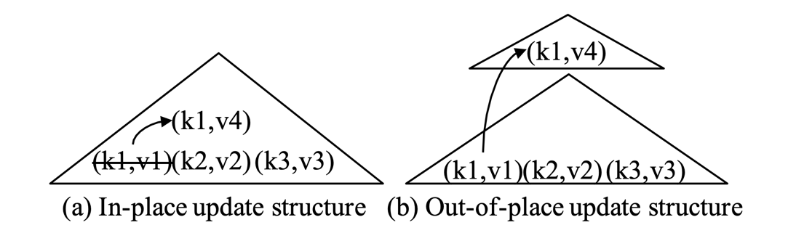
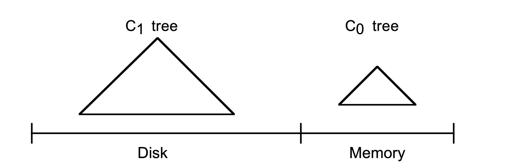
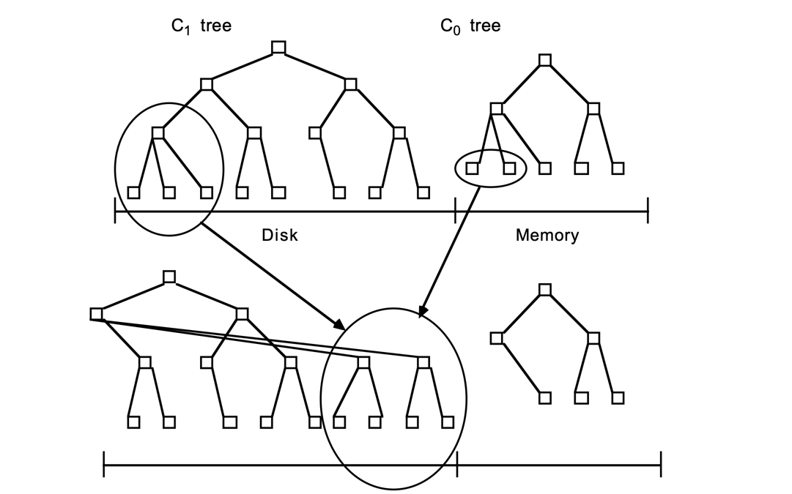
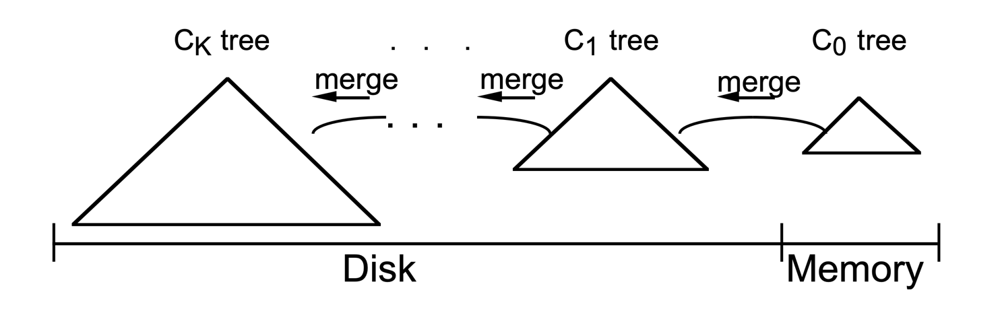
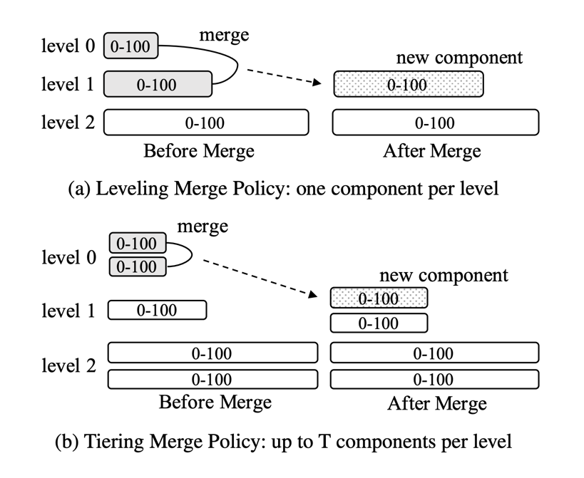
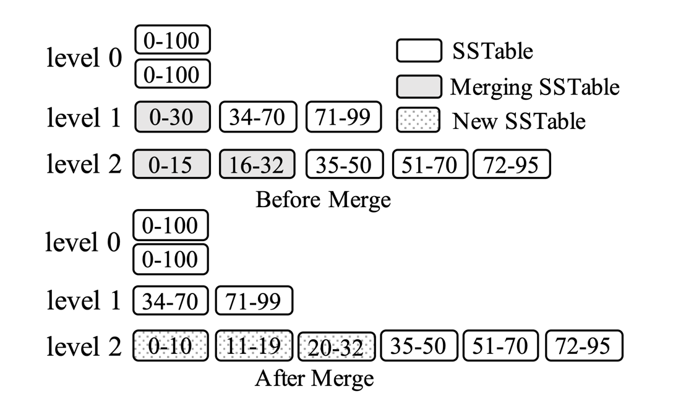
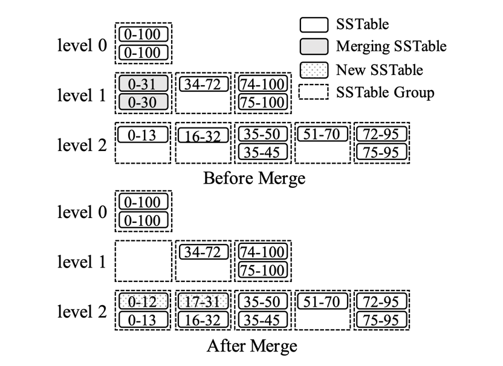
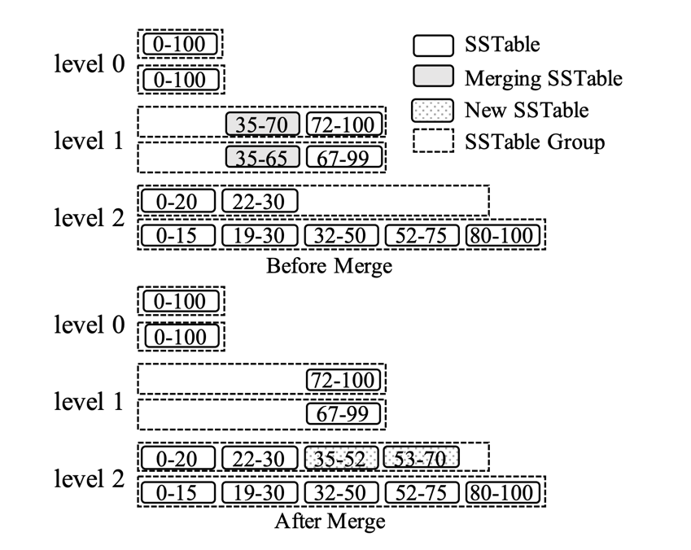

## Introduction

The Log-Structured Merge-tree (LSM-tree) has been widely adopted in the storage layers of modern NoSQL systems,
including [BigTable](/docs/CS/Distributed/Bigtable.md), [Dynamo](/docs/CS/Distributed/Dynamo.md), [HBase](/docs/CS/DB/HBase.md), [Cassandra](/docs/CS/DB/Cassandra.md), [LevelDB](/docs/CS/DB/LevelDB/LevelDB.md), [RocksDB](/docs/CS/DB/RocksDB/RocksDB.md), and AsterixDB.
Different from traditional index structures that apply in-place updates, the LSM-tree first buffers all writes in memory and subsequently flushes them to disk and merges them using sequential I/Os.
This design brings a number of advantages, including superior write performance, high space utilization, tunability, and simplification of concurrency control and recovery.
These advantages have enabled LSM-trees to serve a large variety of workloads.

The Log-Structured Merge-tree (LSM-tree) is a disk-based data structure designed to provide low-cost indexing for a file experiencing a high rate of record inserts (and deletes) over an extended period.
The LSM-tree uses an algorithm that defers and batches index changes, cascading the changes from a memory-based component through one or more disk components in an efficient manner reminiscent of merge sort.
During this process all index values are continuously accessible to retrievals (aside from very short locking periods), either through the memory component or one of the disk components.
The algorithm has greatly reduced disk arm movements compared to a traditional access methods such as B-trees, and will improve costperformance in domains where disk arm costs for inserts with traditional access methods overwhelm storage media costs.
The LSM-tree approach also generalizes to operations other than insert and delete.
However, indexed finds requiring immediate response will lose I/O efficiency in some cases, so the LSM-tree is most useful in applications where index inserts are more common than finds that retrieve the entries.

## History

In general, an index structure can choose one of two strategies to handle updates, that is, in-place updates and out-ofplace updates.
An in-place update structure, such as a $B^+$-tree, directly overwrites old records to store new updates.
For example in Figure 1a, to update the value associated with key k1 from v1 to v4, the index entry (k1, v1) is directly modified to apply this update.
These structures are often read-optimized since only the most recent version of each record is stored.
However, this design sacrifices write performance, as updates incur random I/Os.
Moreover, index pages can be fragmented by updates and deletes, thus reducing the space utilization.

In contrast, an **out-of-place update** structure, such as an LSM-tree, always stores updates into new locations instead of overwriting old entries.
For example in Figure 1b, the update (k1, v4) is stored into a new place instead of updating the old entry (k1, v1) directly.
This design improves write performance since it can exploit sequential I/Os to handle writes.
It can also simplify the recovery process by not overwriting old data.
However, the major problem of this design is that read performance is sacrificed since a record may be stored in any of multiple locations.
Furthermore, these structures generally require a separate data reorganization process to improve storage and query efficiency continuously.

Fig.1. Examples of in-place and out-of-place update structures: each entry contains a key (denoted as “k”) and a value (denoted as “v”)

## Components

An LSM-tree is composed of two or more tree-like component data structures.

- A two component LSM-tree has a smaller component which is entirely memory resident, known as the C0 tree (or C0 component),
- and a larger component which is resident on disk, known as the C1 tree (or C1 component).

Although the C1 component is disk resident, frequently referenced page nodes in C1 will remain in memory buffers as usual (buffers not shown), so that popular high level directory nodes of C1 can be counted on to be memory resident.

Fig.2. Two Components

As each new History row is generated, a log record to recover this insert is first written to the sequential log file in the usual way.
The index entry for the History row is then inserted into the memory resident C0 tree, after which it will in time migrate out to the C1 tree on disk; any search for an index entry will look first in C0 and then in C1.
There is a certain amount of latency (delay) before entries in the C0 tree migrate out to the disk resident C1 tree, implying a need for recovery of index entries that don't get out to disk prior to a crash.

Recovery is discussed in Section 4, but for now we simply note that the log records that allow us to recover new inserts of History rows can be treated as logical logs;
during recovery we can reconstruct the History rows that have been inserted and simultaneously recreate any needed entries to index these rows to recapture the lost content of C0.

The C1 tree has a comparable directory structure to a B-tree, but is optimized for sequential disk access, with nodes 100% full,
and sequences of single-page nodes on each level below the root packed together in contiguous multi-page disk blocks for efficient arm use; this optimization was also used in the SB-tree.
Multi-page block I/O is used during the rolling merge and for long range retrievals, while single-page nodes are used for matching indexed finds to minimize buffering requirements.

The rolling merge acts in a series of merge steps.
A read of a multi-page block containing leaf nodes of the C1 tree makes a range of entries in C1 buffer resident.
Each merge step then reads a disk page sized leaf node of the C1 tree buffered in this block, merges entries from the leaf node with entries taken from the leaf level of the C0 tree,
thus decreasing the size of C0, and creates a newly merged leaf node of the C1 tree.

The buffered multi-page block containing old C1 tree nodes prior to merge is called the emptying block, and new leaf nodes are written to a different buffered multi-page block called the filling block.
When this filling block has been packed full with newly merged leaf nodes of C1, the block is written to a new free area on disk.
The new multi-page block containing merged results is pictured in below figure as lying on the right of the former nodes.
Subsequent merge steps bring together increasing index value segments of the C0 and C1 components until the maximum values are reached and the rolling merge starts again from the smallest values.

Fig.3.

Newly merged blocks are written to new disk positions, so that the old blocks will not be overwritten and will be available for recovery in case of a crash.
The parent directory nodes in C1, also buffered in memory, are updated to reflect this new leaf structure, but usually remain in buffer for longer periods to minimize I/O;
the old leaf nodes from the C1 component are invalidated after the merge step is complete and are then deleted from the C1 directory.
In general, there will be leftover leaf-level entries for the merged C1 component following each merge step, since a merge step is unlikely to result in a new node just as the old leaf node empties.
The same consideration holds for multi-page blocks, since in general when the filling block has filled with newly merged nodes, there will be numerous nodes containing entries still in the shrinking block.
These leftover entries, as well as updated directory node information, remain in block memory buffers for a time without being written to disk.
To reduce reconstruction time in recovery, checkpoints of the merge process are taken periodically, forcing all buffered information to disk.

Unlike the C1 tree, the C0 tree is not expected to have a B-tree-like structure.
For one thing, the nodes could be any size: there is no need to insist on disk page size nodes since the C0 tree never sits on disk, and so we need not sacrifice CPU efficiency to minimize depth.
Thus a (2-3) tree or AVL-tree are possible alternative structures for a C0 tree.
When the growing C0 tree first reaches its threshold size, a leftmost sequence of entries is deleted from the C0 tree (this should be done in an efficient batch manner rather than one entry at a time) and reorganized into a C1 tree leaf node packed 100% full.
Successive leaf nodes are placed left-to-right in the initial pages of a buffer resident multi-page block until the block is full; then this block is written out to disk to become the first part of the C1 tree disk-resident leaf level.
A directory node structure for the C1 tree is created in memory buffers as successive leaf nodes are added.

Successive multi-page blocks of the C1 tree leaf level in ever increasing key-sequence order are written out to disk to keep the C0 tree threshold size from exceeding its threshold.
Upper level C1 tree directory nodes are maintained in separate multi-page block buffers, or else in single page buffers, whichever makes more sense from a standpoint of total memory and disk arm cost;
entries in these directory nodes contain separators that channel access to individual single-page nodes below, as in a B-tree.
The intention is to provide efficient exact-match access along a path of single page index nodes down to the leaf level, avoiding multi-page block reads in such a case to minimize memory buffer requirements.
Thus we read and write multipage blocks for the rolling merge or for long range retrievals, and single-page nodes for indexed find (exact-match) access.
Partially full multi-page blocks of C1 directory nodes are usually allowed to remain in buffer while a sequence of leaf node blocks are written out.
C1 directory nodes are forced to new positions on disk when:

- A multi-page block buffer containing directory nodes becomes full
- The root node splits, increasing the depth of the C1 tree (to a depth greater than two)
- A checkpoint is performed

In the first case, the single multi-page block which has filled is written out to disk.
In the latter two cases, all multi-page block buffers and directory node buffers are flushed to disk.

After the rightmost leaf entry of the C0 tree is written out to the C1 tree for the first time, the process starts over on the left end of the two trees,
except that now and with successive passes multi-page leaf-level blocks of the C1 tree must be read into buffer and merged with the entries in the C0 tree,
thus creating new multi-page leaf blocks of C1 to be written to disk.

### Merge

In general, an LSM-tree of K+1 components has components $C_0$, $C_1$, $C_2$, . . ., $C_{K-1}$ and $C_K$, which are indexed tree structures of increasing size;
the C0 component tree is memory resident and all other components are disk resident (but with popular pages buffered in memory as with any disk resident access tree).
Under pressure from inserts, there are asynchronous rolling merge processes in train between all component pairs (Ci-1, Ci), that move entries out from the smaller to the larger component each time the smaller component, Ci-1, exceeds its threshold size.
During the life of a long-lived entry inserted in an LSM-tree, it starts in the C0 tree and eventually migrates out to the CK, through a series of K asynchronous rolling merge steps.

Fig.4. Rolling merge

The LSM-tree, proposed in 1996, addressed these problems by designing a merge process which is integrated into the structure itself,
providing high write performance with bounded query performance and space utilization.
The original LSM-tree design contains a sequence of components $C_0$, $C_1$, ···, $C_k$ , as shown in Figure 4.
Each component is structured as a B+-tree.
$C_0$ resides in memory and serves incoming writes, while all remaining components $C_1$, ···, $C_k$ reside on disk.
When $C_i$ is full, a rolling merge process is triggered to merge a range of leaf pages from $C_i$ into $C_{i+1}$.
This design is often referred to as the leveling merge policy today.
However, as we shall see later, the originally proposed rolling merge process is not used by today’s LSM-based storage systems due to its implementation complexity.
The original paper on LSM-trees further showed that under a stable workload, where the number of levels remains static,
write performance is optimized when the size ratios $T_i = |C_{i+1}|/|C_i|$ between all adjacent components are the same.
This principle has impacted all subsequent implementations and improvements of LSM-trees

In parallel to the LSM-tree, Jagadish et al. proposed a similar structure with the stepped-merge policy to achieve better write performance.
It organizes the components into levels, and when level L is full with T components, these T components are merged together into a new component at level L+1.
This policy become the tiering merge policy used in today’s LSM-tree implementations.

Fig.5. LSM-tree merge policies

Once the merge starts, the situation is more complex.
We picture the rolling merge process in a two component LSM-tree as having a conceptual cursor which slowly circulates in quantized steps through equal key values of the C0 tree and C1 tree components, drawing indexing data out from the C0 tree to the C1 tree on disk.
The rolling merge cursor has a position at the leaf level of the C1 tree and within each higher directory level as well.
At each level, all currently merging multi-page blocks of the C1 tree will in general be split into two blocks:
the "emptying" block whose entries have been depleted but which retains information not yet reached by the merge cursor, and the "filling" block which reflects the result of the merge up to this moment.
There will be an analogous "filling node" and "emptying node" defining the cursor which will certainly be buffer resident.
For concurrent access purposes, both the emptying block and the filling block on each level contain an integral number of page-sized nodes of the C1 tree,
which simply happen to be buffer resident. (During the merge step that restructures individual nodes, other types of concurrent access to the entries on those nodes are blocked.)
Whenever a complete flush of all buffered nodes to disk is required, all buffered information at each level must be written to new positions on disk (with positions reflected in superior directory information, and a sequential log entry for recovery purposes).
At a later point, when the filling block in buffer on some level of the C1 tree fills and must be flushed again, it goes to a new position.
Old information that might still be needed during recovery is never overwritten on disk, only invalidated as new writes succeed with more up-to-date information.

Today’s LSM-tree implementations still apply updates outof-place to reduce random I/Os.
All incoming writes are appended into a memory component.
An insert or update operation simply adds a new entry, while a delete operation adds an anti-matter entry indicating that a key has been deleted.
However, today’s LSM-tree implementations commonly exploit the immutability of disk components1 to simplify concurrency control and recovery.
Multiple disk components are merged together into a new one without modifying existing components.
This is different from the rolling merge process proposed by the original LSM-tree.

Internally, an LSM-tree component can be implemented using any index structure.
Today’s LSM-tree implementations typically organize their memory components using a concurrent data structure such as a skip-list or a B+-tree, while they organize their disk components using B+-trees or sorted-string tables (SSTables).
An SSTable contains a list of data blocks and an index block; a data block stores key-value pairs ordered by keys, and the index block stores the key ranges of all data blocks.
A query over an LSM-tree has to search multiple components to perform reconciliation, that is, to find the latest version of each key.
A point lookup query, which fetches the value for a specific key, can simply search all components one by one, from newest to oldest, and stop immediately after the first match is found.
A range query can search all components at the same time, feeding the search results into a priority queue to perform reconciliation.

As disk components accumulate over time, the query performance of an LSM-tree tends to degrade since more components must be examined.
To address this, disk components are gradually merged to reduce the total number of components.
Two types of merge policies are typically used in practice.
As shown in Figure 3, both policies organize disk components into logical levels (or tiers) and are controlled by a size ratio T.
Each component is labeled with its potential key range in the figure.
In the leveling merge policy (Figure 3a), each level only maintains one component, but the component at level L is T times larger than the component at level L−1.
As a result, the component at level L will be merged multiple times with incoming components at level L − 1 until it fills up, and it will then be merged into level L+1.
For example in the figure, the component at level 0 is merged with the component at level 1, which will result in a bigger component at level 1.
In contrast, the tiering merge policy (Figure 3b) maintains up to T components per level.
When level L is full, its T components are merged together into a new component at level L +1. In the figure, the two components at level 0 are merged together to form a new component at level 1.
It should be noted that if level L is already the configured maximum level, then the resulting component remains at level L.
In practice, for a stable workload where the volume of inserts equal the volume of deletes, the total number of levels remains static.
In general, the leveling merge policy optimizes for query performance since there are fewer components to search in the LSM-tree.
The tiering merge policy is more write optimized since it reduces the merge frequency.

### Tiering Merge Policy

## Concurrency

For concurrency control, an LSM-tree needs to handle concurrent reads and writes and to take care of concurrent flush and merge operations.

Ensuring correctness for concurrent reads and writes is a general requirement for access methods in a database system.
Depending on the transactional isolation requirement, today’s LSM-tree implementations either use a locking scheme or a multi-version scheme.
A multi-version scheme works well with an LSM-tree since obsolete versions of a key can be naturally garbage-collected during merges.
Concurrent flush and merge operations, however, are unique to LSM-trees.
These operations modify the metadata of an LSM-tree, e.g., the list of active components.
Thus, accesses to the component metadata must be properly synchronized.
To prevent a component in use from being deleted, each component can maintain a reference counter.
Before accessing the components of an LSM-tree, a query can first obtain a snapshot of active components and increment their in-use counters.

Since all writes are first appended into memory, writeahead logging (WAL) can be performed to ensure their durability.
To simplify the recovery process, existing systems typically employ a no-steal buffer management policy.
That is, a memory component can only be flushed when all active write transactions have terminated.
During recovery for an LSM-tree, the transaction log is replayed to redo all successful transactions, but no undo is needed due to the no-steal policy.
Meanwhile, the list of active disk components must also be recovered in the event of a crash.
For unpartitioned LSM-trees, this can be accomplished by adding a pair of timestamps to each disk component that indicate the range of timestamps of the stored entries.
This timestamp can be simply generated using local wall-clock time or a monotonic sequence number.
To reconstruct the component list, the recovery process can simply find all components with disjoint timestamps.
In the event that multiple components have overlapping timestamps, the component with the largest timestamp range is chosen and the rest can simply be deleted since they will have been merged to form the selected component.
For partitioned LSM-trees, this timestamp-based approach does not work anymore since each component is further range-partitioned.
To address this, a typical approach, used in LevelDB and RocksDB, is to maintain a separate metadata log to store all changes to the structural metadata, such as adding or deleting SSTables.
The state of the LSM-tree structure can then be reconstructed by replaying the metadata log during recovery.

In general, we are given an LSM-tree of K+1 components, C0, C1, C2, . . ., CK-1 and CK, of increasing size, where the C0 component tree is memory resident and all other components are disk resident.
There are asynchronous rolling merge processes in train between all component pairs (Ci-1, Ci) that move entries out from the smaller to the larger component each time the smaller component, Ci-1, exceeds its threshold size.
Each disk resident component is constructed of page-sized nodes in a B-tree type structure, except that multiple nodes in key sequence order at all levels below the root sit on multi-page blocks.
Directory information in upper levels of the tree channels access down through single page nodes and also indicates which sequence of nodes sits on a multi-page block, so that a read or write of such a block can be performed all at once.
Under most circumstances, each multi-page block is packed full with single page nodes, but as we will see there are a few situations where a smaller number of nodes exist in such a block.
In that case, the active nodes of the LSM-tree will fall on a contiguous set of pages of the multi-page block, though not necessarily the initial pages of the block.
Apart from the fact that such contiguous pages are not necessarily the initial pages on the multi-page block, the structure of an LSM-tree component is identical to the structure of the SB-tree presented in, to which the reader is referred for supporting details.

A node of a disk-based component Ci can be individually resident in a single page memory buffer, as when equal match finds are performed, or it can be memory resident within its containing multi-page block.
A multi-page block will be buffered in memory as a result of a long range find or else because the rolling merge cursor is passing through the block in question at a high rate.
In any event, all non-locked nodes of the Ci component are accessible to directory lookup at all times, and disk access will perform lookaside to locate any node in memory, even if it is resident as part of a multi-page block taking part in the rolling merge.
Given these considerations, a concurrency approach for the LSM-tree must mediate three distinct types of physical conflict.

1. A find operation should not access a node of a disk-based component at the same time that a different process performing a rolling merge is modifying the contents of the node.
2. A find or insert into the C0 component should not access the same part of the tree that a different process is simultaneously altering to perform a rolling merge out to C1.
3. The cursor for the rolling merge from Ci-1 out to Ci will sometimes need to move past the cursor for the rolling merge from Ci out to Ci+1,
   since the rate of migration out from the component Ci-1 is always at least as great as the rate of migration out from Ci and this implies a faster rate of circulation of the cursor attached to the smaller component Ci-1.
   Whatever concurrency method is adopted must permit this passage to take place without one process (migration out to Ci) being blocked behind the other at the point of intersection (migration out from Ci).

Nodes are the unit of locking used in the LSM-tree to avoid physical conflict during concurrent access to disk based components.
Nodes being updated because of rolling merge are locked in write mode and nodes being read during a find are locked in read mode; methods of directory locking to avoid deadlocks are well understood.
The locking approach taken in C0 is dependent on the data structure used.
In the case of a (2-3)-tree, for example, we could write lock a subtree falling below a single (2-3)-directory node that contains all entries in the range affected during a merge to a node of C1; simultaneously,
find operations would lock all (2-3)-nodes on their access path in read mode so that one type of access will exclude another.
Note that we are only considering concurrency at the lowest physical level of multi-level locking.
We leave to others the question of more abstract locks, such as key range locking to preserve transactional isolation, and avoid for now the problem of phantom updates.
Thus read-locks are released as soon as the entries being sought at the leaf level have been scanned.
Write locks for (all) nodes under the cursor are released following each node merged from the larger component.
This gives an opportunity for a long range find or for a faster cursor to pass a relatively slower cursor position, and thus addresses point (iii) above..

## Recovery

As new entries are inserted into the C0 component of the LSM-tree, and the rolling merge processes migrates entry information out to successively larger components, this work takes place in memory buffered multi-page blocks.
As with any such memory buffered changes, the work is not resistant to system failure until it has been written to disk.
We are faced with a classical recovery problem: to reconstruct work that has taken place in memory after a crash occurs and memory is lost.
We don't need to create special logs to recover index entries on newly created records: transactional insert logs for these new records are written out to a sequential log file in the normal course of events,
and it is a simple matter to treat these insert logs (which normally contain all field values together with the RID where the inserted record has been placed) as a logical base for reconstructing the index entries.
This new approach to recover an index must be built into the system recovery algorithm, and may have the effect of extending the time before storage reclamation for such transactional History insert logs can take place, but this is a minor consideration.

To demonstrate recovery of the LSM-tree index, it is important that we carefully define the form of a checkpoint and demonstrate that we know where to start in the sequential log file,
and how to apply successive logs, so as to deterministically replicate updates to the index that need to be recovered.
The scheme we use is as follows.
When a checkpoint is requested at time T0, we complete all merge steps in operation so that node locks are released, then postpone all new entry inserts to the LSM-tree until the checkpoint completes;
at this point we create an LSMtree checkpoint with the following actions.

- We write the contents of component C0 to a known disk location; following this, entry inserts to C0 can begin again, but merge steps continue to be deferred.
- We flush to disk all dirty memory buffered nodes of disk based components.
- We create a special checkpoint log with the following information:
  - The Log Sequence Number, LSN0, of the last inserted indexed row at time T0
  - The disk addresses of the roots of all components
  - The location of all merge cursors in the various components
  - The current information for dynamic allocation of new multi-page blocks.

Once this checkpoint information has been placed on disk, we can resume regular operations of the LSM-tree.
In the event of a crash and subsequent restart, this checkpoint can be located and the saved component C0 loaded back into memory, together with the buffered blocks of other components needed to continue rolling merges.
Then logs starting with the first LSN after LSN0 are read into memory and have their associated index entries entered into the LSM-tree.
As of the time of the checkpoint, the positions of all disk-based components containing all indexing information were recorded in component directories starting at the roots, whose locations are known from the checkpoint log.
None of this information has been wiped out by later writes of multi-page disk blocks since these writes are always to new locations on disk until subsequent checkpoints make outmoded multi-page blocks unnecessary.
As we recover logs of inserts for indexed rows, we place new entries into the C0 component; now the rolling merge starts again, overwriting any multi-page blocks written since the checkpoint,
but recovering all new index entries, until the most recently inserted row has been indexed and recovery is complete.

## Optimizations

There are two well-known optimizations that are used by most LSM-tree implementations today.

### Bloom Filter

A Bloom filter is a space-efficient probabilistic data structure designed to aid in answering set membership queries.
It supports two operations, i.e., inserting a key and testing the membership of a given key.
To insert a key, it applies multiple hash functions to map the key into multiple locations in a bit vector and sets the bits at these locations to 1.
To check the existence of a given key, the key is again hashed to multiple locations.
If all of the bits are 1, then the Bloom filter reports that the key probably exists.
By design, the Bloom filter can report false positives but not false negatives.

Bloom filters can be built on top of disk components to greatly improve point lookup performance.
To search a disk component, a point lookup query can first check its Bloom filter and then proceed to search its B+-tree only if its associated Bloom filter reports a positive answer.
Alternatively, a Bloom filter can be built for each leaf page of a disk component.
In this design, a point lookup query can first search the non-leaf pages of a B+-tree to locate the leaf page, where the non-leaf pages are assumed to be small enough to be cached, and then check the associated Bloom filter before fetching the leaf page to reduce disk I/Os.
Note that the false positives reported by a Bloom filter do not impact the correctness of a query, but a query may waste some I/O searching for non-existent keys.
The false positive rate of a Bloom filter can be computed as $(1−e^{−kn/m})k$ , where k is the number of hash functions, n is the number of keys, and m is the total number of bits.
Furthermore, the optimal number of hash functions that minimizes the false positive rate is $k = \frac{m}{n}\ln{2}$.
In practice, most systems typically use 10 bits/key as a default configuration, which gives a 1% false positive rate.
Since Bloom filters are very small and can often be cached in memory, the number of disk I/Os for point lookups is greatly reduced by their use.

### Partitioning

Another commonly adopted optimization is to range-partition the disk components of LSM-trees into multiple (usually fixed-size) small partitions.
To minimize the potential confusion caused by different terminologies, we use the term SSTable to denote such a partition, following the terminology from LevelDB.
This optimization has several advantages.

- First, partitioning breaks a large component merge operation into multiple smaller ones, bounding the processing time of each merge operation as well as the temporary disk space needed to create new components.
- Moreover, partitioning can optimize for workloads with sequentially created keys or skewed updates by only merging components with overlapping key ranges.

For sequentially created keys, essentially no merge is performed since there are no components with overlapping key ranges.
For skewed updates, the merge frequency of the components with cold update ranges can be greatly reduced.
It should be noted that the original LSM-tree automatically takes advantage of partitioning because of its rolling merges.
However, due to the implementation complexity of its rolling merges, today’s LSM-tree implementations typically opt for actual physical partitioning rather than rolling merges.

An early proposal that applied partitioning to LSM-trees is the partitioned exponential file (PE-file).
A PE-file contains multiple partitions, where each partition can be logically viewed as a separate LSM-tree.
A partition can be further split into two partitions when it becomes too large.
However, this design enforces strict key range boundaries
among partitions, which reduces the flexibility of merges.

**It should be noted that partitioning is orthogonal to merge policies; both leveling and tiering (as well as other emerging merge policies) can be adapted to support partitioning.**
To the best of our knowledge, only the partitioned leveling policy has been fully implemented by industrial LSM-based storage systems, such as LevelDB and RocksDB.

In the partitioned leveling merge policy, pioneered by LevelDB, the disk component at each level is rangepartitioned into multiple fixed-size SSTables, as shown in Figure 4.
Each SSTable is labeled with its key range in the figure.
Note that the disk components at level 0 are not partitioned since they are directly flushed from memory.
This design can also help the system to absorb write bursts since it can tolerate multiple unpartitioned components at level 0.
To merge an SSTable from level L into level L+1, all of its overlapping SSTables at level L + 1 are selected, and these SSTables are merged with it to produce new SSTables still at level L +1.
For example, in the figure, the SSTable labeled 0-30 at level 1 is merged with the SSTables labeled 0-15 and 16-32 at level 2.
This merge operation produces new SSTables labeled 0-10, 11-19, and 20-32 at level 2, and the old SSTables will then be garbage-collected.
Different policies can be used to select which SSTable to merge next at each level.
For example, LevelDB uses a round-robin policy (to minimize the total write cost).

Fig.6. Partitioned leveling merge policy

The partitioning optimization can also be applied to the tiering merge policy.
However, one major issue in doing so is that each level can contain multiple SSTables with overlapping key ranges.
These SSTables must be ordered properly based on their recency to ensure correctness.
Two possible schemes can be used to organize the SSTables at each level, namely vertical grouping and horizontal grouping.
In both schemes, the SSTables at each level are organized into groups.
The vertical grouping scheme groups SSTables with overlapping key ranges together so that the groups have disjoint key ranges.
Thus, it can be viewed as an extension of partitioned leveling to support tiering.
Alternatively, under the horizontal grouping scheme, each logical disk component, which is range-partitioned into a set of SSTables, serves as a group directly.
This allows a disk component to be formed incrementally based on the unit of SSTables.
We will discuss these two schemes in detail below.

Fig.7. Partitioned tiering with vertical grouping

An example of the vertical grouping scheme is shown in Figure 7.
In this scheme, SSTables with overlapping key
ranges are grouped together so that the groups have disjoint key ranges.
During a merge operation, all of the SSTables in a group are merged together to produce the resulting SSTables based on the key ranges of the overlapping groups at the next level, which are then added to these overlapping groups.
For example in the figure, the SSTables labeled 0-30 and 0-31 at level 1 are merged together to produce the SSTables labeled 0-12 and 17-31, which are then added to the overlapping groups at level 2.
Note the difference between the SSTables before and after this merge operation.

Before the merge operation, the SSTables labeled 0-30 and 0-31 have overlapping key ranges and both must be examined together by a point lookup query.
However, after the merge operation, the SSTables labeled 0-12 and 17-31 have disjoint key ranges and only one of them needs to be examined by a point lookup query.
It should also be noted that under this scheme SSTables are no longer fixed-size since they are produced based on the key ranges of the overlapping groups at the next level.

Fig.8. Partitioned tiering with horizontal grouping

Figure 6 shows an example of the horizontal grouping scheme.
In this scheme, each component, which is rangepartitioned into a set of fixed-size SSTables, serves as a logical group directly.
Each level L further maintains an active group, which is also the first group, to receive new SSTables merged from the previous level.
This active group can be viewed as a partial component being formed by merging the components at level L − 1 in the unpartitioned case.
A merge operation selects the SSTables with overlapping key ranges from all of the groups at a level, and the resulting SSTables are added to the active group at the next level.
For example in the figure, the SSTables labeled 35-70 and 35-65 at level 1 are merged together, and the resulting SSTables labeled 35-52 and 53-70 are added to the first group at level 2.
However, although SSTables are fixed-size under the horizontal grouping scheme, it is still possible that one SSTable from a group may overlap a large number of SSTables in the remaining groups.

## Links

- [Trees](/docs/CS/Algorithms/tree.md)

## References

1. [The Log-Structured Merge-Tree (LSM-Tree)](https://www.cs.umb.edu/~poneil/lsmtree.pdf)
2. [LSM-based Storage Techniques: A Survey](https://arxiv.org/pdf/1812.07527.pdf)
3. [KernelMaker: Paper笔记 The Log structured Merge-Tree](https://kernelmaker.github.io/lsm-tree)
4. [Dostoevsky: Better Space-Time Trade-Offs for LSM-Tree Based Key-Value Stores via Adaptive Removal of Superfluous Merging](https://stratos.seas.harvard.edu/files/stratos/files/dostoyevski.pdf)
5. [The SB-tree: An Index-Sequential Structure for High-Performance Sequential Access](https://www.researchgate.net/profile/Patrick-Oneil-7/publication/227199016_TheSB-tree_an_index-sequential_structure_for_high-performance_sequential_access/links/00b49520567eb2dbbc000000/TheSB-tree-an-index-sequential-structure-for-high-performance-sequential-access.pdf)
6. [Monkey: Optimal Navigable Key-Value Store](https://stratos.seas.harvard.edu/files/stratos/files/monkeykeyvaluestore.pdf)
7. [Towards Accurate and Fast Evaluation of Multi-Stage Log-Structured Designs](https://www.usenix.org/system/files/conference/fast16/fast16-papers-lim.pdf)
