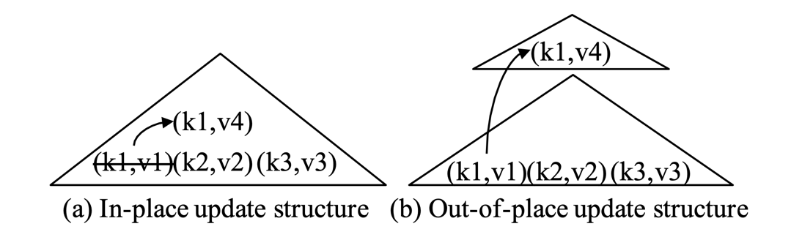
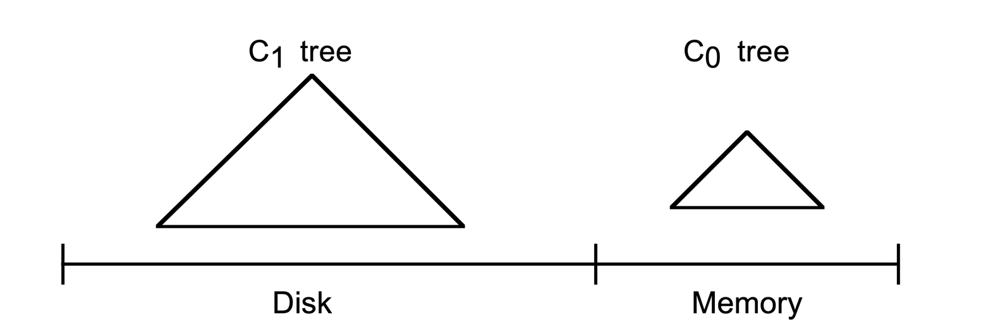
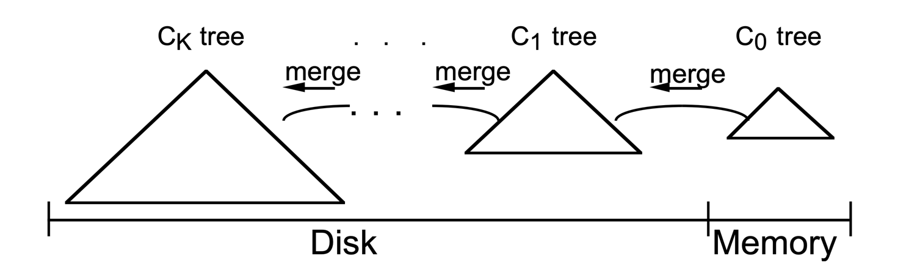
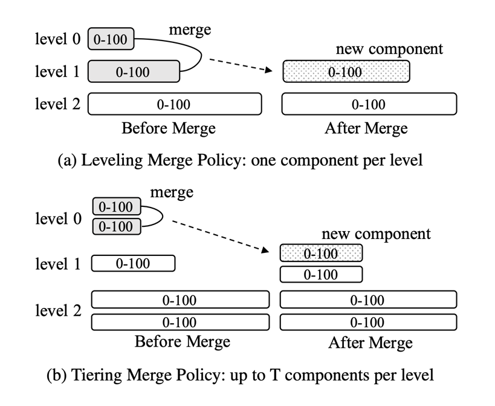
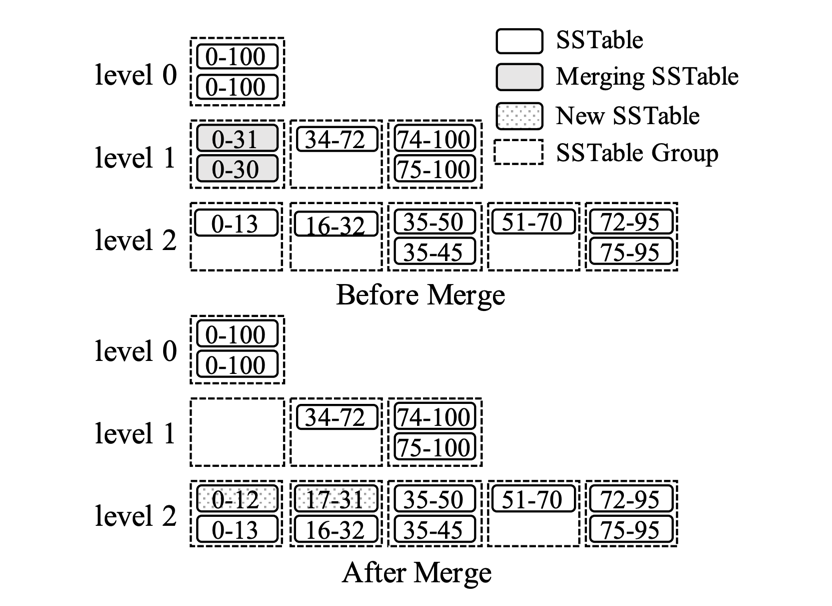
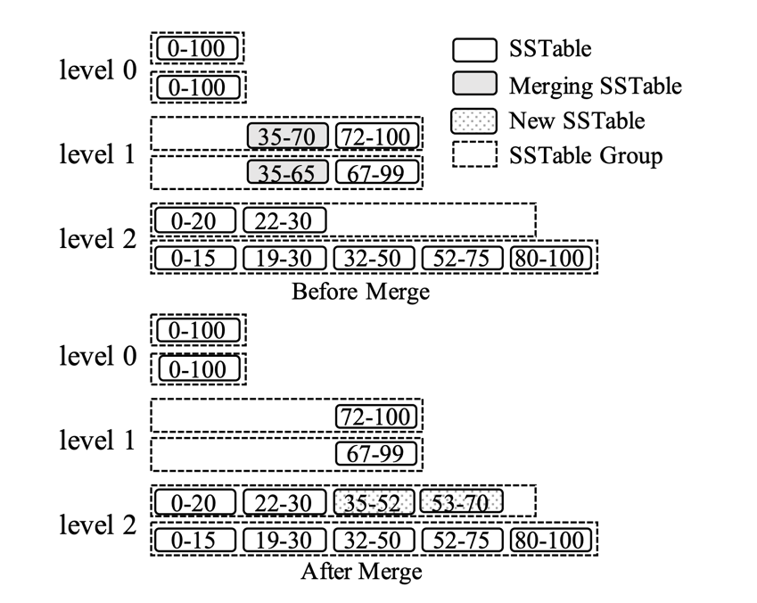
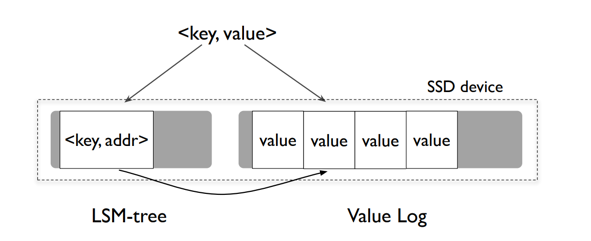
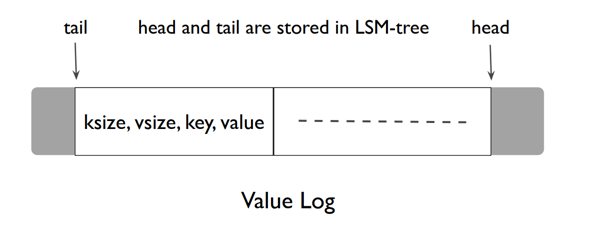

## Introduction

The Log-Structured Merge-tree (LSM-tree) has been widely adopted in the storage layers of modern NoSQL systems,
including [BigTable](/docs/CS/Distributed/Bigtable.md), [Dynamo](/docs/CS/Distributed/Dynamo.md), [HBase](/docs/CS/DB/HBase.md), [Cassandra](/docs/CS/DB/Cassandra.md), [LevelDB](/docs/CS/DB/LevelDB/LevelDB.md), [RocksDB](/docs/CS/DB/RocksDB/RocksDB.md), and AsterixDB.

The Log-Structured Merge-tree (LSM-tree) is a disk-based data structure designed to provide low-cost indexing for a file experiencing a high rate of record inserts (and deletes) over an extended period.
The LSM-tree uses an algorithm that defers and batches index changes, cascading the changes from a memory-based component through one or more disk components in an efficient manner reminiscent of merge sort.
During this process all index values are continuously accessible to retrievals (aside from very short locking periods), either through the memory component or one of the disk components.
Different from traditional index structures that apply in-place updates, the LSM-tree first buffers all writes in memory and subsequently flushes them to disk and merges them using sequential I/Os,
and will improve cost performance in domains where disk arm costs for inserts with traditional access methods overwhelm storage media costs.

This design brings a number of advantages, including superior write performance, high space utilization, tunability, and simplification of concurrency control and recovery.
These advantages have enabled LSM-trees to serve a large variety of workloads.
However, indexed finds requiring immediate response will lose I/O efficiency in some cases, so the LSM-tree is most useful in applications where index inserts are more common than finds that retrieve the entries.

## Basics

In general, an index structure can choose one of two strategies to handle updates, that is, *in-place updates* and *out-of-place updates*.

An **in-place update** structure, such as a B+-tree, directly overwrites old records to store new updates.
For example in Figure 1a, to update the value associated with key k1 from v1 to v4, the index entry `(k1, v1)` is directly modified to apply this update.
These structures are often read-optimized since only the most recent version of each record is stored.
However, this design sacrifices write performance, as updates incur random I/Os.
Moreover, index pages can be fragmented by updates and deletes, thus reducing the space utilization.

In contrast, an **out-of-place update** structure, such as an LSM-tree, always stores updates into new locations instead of overwriting old entries.
For example in Figure 1b, the update `(k1, v4)` is stored into a new place instead of updating the old entry `(k1, v1)` directly.
This design improves write performance since it can exploit sequential I/Os to handle writes.
It can also simplify the recovery process by not overwriting old data.
However, the major problem of this design is that read performance is sacrificed since a record may be stored in any of multiple locations.
Furthermore, these structures generally require a separate data reorganization process to improve storage and query efficiency continuously.

Fig.1. Examples of in-place and out-of-place update structures: each entry contains a key (denoted as “k”) and a value (denoted as “v”)

## Components

An LSM-tree is composed of two or more tree-like component data structures.
A two component LSM-tree has

- a smaller component which is entirely memory resident, known as the $C_0$ tree (or $C_0$ component),
- and a larger component which is resident on disk, known as the $C_1$ tree (or $C_1$ component).

Although the $C_1$ component is disk resident, frequently referenced page nodes in $C_1$ will remain in memory buffers as usual (buffers not shown), so that popular high level directory nodes of $C_1$ can be counted on to be memory resident.

Fig.2. Two Components

As each new History row is generated, a log record to recover this insert is first written to the sequential log file in the usual way.
The index entry for the History row is then inserted into the memory resident $C_0$ tree, after which it will in time migrate out to the $C_1$ tree on disk; any search for an index entry will look first in $C_0$ and then in $C_1$.
There is a certain amount of latency (delay) before entries in the $C_0$ tree migrate out to the disk resident $C_1$ tree, implying a need for recovery of index entries that don't get out to disk prior to a crash.

The log records that allow us to recover new inserts of History rows can be treated as logical logs;
during recovery we can reconstruct the History rows that have been inserted and simultaneously recreate any needed entries to index these rows to recapture the lost content of $C_0$.

The $C_1$ tree has a comparable directory structure to a B-tree, but is optimized for sequential disk access, with nodes 100% full,
and sequences of single-page nodes on each level below the root packed together in contiguous multi-page disk blocks for efficient arm use; this optimization was also used in the SB-tree.
Multi-page block I/O is used during the rolling merge and for long range retrievals, while single-page nodes are used for matching indexed finds to minimize buffering requirements.

The rolling merge acts in a series of merge steps.
A read of a multi-page block containing leaf nodes of the $C_1$ tree makes a range of entries in $C_1$ buffer resident.
Each merge step then reads a disk page sized leaf node of the $C_1$ tree buffered in this block, merges entries from the leaf node with entries taken from the leaf level of the $C_0$ tree,
thus decreasing the size of $C_0$, and creates a newly merged leaf node of the $C_1$ tree.

The buffered multi-page block containing old $C_1$ tree nodes prior to merge is called the emptying block, and new leaf nodes are written to a different buffered multi-page block called the filling block.
When this filling block has been packed full with newly merged leaf nodes of $C_1$, the block is written to a new free area on disk.
The new multi-page block containing merged results is pictured in below figure as lying on the right of the former nodes.
Subsequent merge steps bring together increasing index value segments of the $C_0$ and $C_1$ components until the maximum values are reached and the rolling merge starts again from the smallest values.

Fig.3. Rolling Merge 

Newly merged blocks are written to new disk positions, so that the old blocks will not be overwritten and will be available for recovery in case of a crash.
The parent directory nodes in $C_1$, also buffered in memory, are updated to reflect this new leaf structure, but usually remain in buffer for longer periods to minimize I/O;
the old leaf nodes from the $C_1$ component are invalidated after the merge step is complete and are then deleted from the $C_1$ directory.
In general, there will be leftover leaf-level entries for the merged $C_1$ component following each merge step, since a merge step is unlikely to result in a new node just as the old leaf node empties.
The same consideration holds for multi-page blocks, since in general when the filling block has filled with newly merged nodes, there will be numerous nodes containing entries still in the shrinking block.
These leftover entries, as well as updated directory node information, remain in block memory buffers for a time without being written to disk.
To reduce reconstruction time in recovery, checkpoints of the merge process are taken periodically, forcing all buffered information to disk.

Unlike the $C_1$ tree, the $C_0$ tree is not expected to have a B-tree-like structure.
For one thing, the nodes could be any size: there is no need to insist on disk page size nodes since the $C_0$ tree never sits on disk, and so we need not sacrifice CPU efficiency to minimize depth.
Thus a skip-list or a B+-tree are possible alternative structures for a $C_0$ tree.
When the growing $C_0$ tree first reaches its threshold size, a leftmost sequence of entries is deleted from the $C_0$ tree (this should be done in an efficient batch manner rather than one entry at a time) and reorganized into a $C_1$ tree leaf node packed 100% full.
Successive leaf nodes are placed left-to-right in the initial pages of a buffer resident multi-page block until the block is full; then this block is written out to disk to become the first part of the $C_1$ tree disk-resident leaf level.
A directory node structure for the $C_1$ tree is created in memory buffers as successive leaf nodes are added.

An SSTable contains a list of data blocks and an index block; a data block stores key-value pairs ordered by keys, and the index block stores the key ranges of all data blocks.

A query over an LSM-tree has to search multiple components to perform reconciliation, that is, to find the latest version of each key.
A point lookup query, which fetches the value for a specific key, can simply search all components one by one, from newest to oldest, and stop immediately after the first match is found.
A range query can search all components at the same time, feeding the search results into a priority queue to perform reconciliation.

Successive multi-page blocks of the $C_1$ tree leaf level in ever increasing key-sequence order are written out to disk to keep the $C_0$ tree threshold size from exceeding its threshold.
Upper level $C_1$ tree directory nodes are maintained in separate multi-page block buffers, or else in single page buffers, whichever makes more sense from a standpoint of total memory and disk arm cost;
entries in these directory nodes contain separators that channel access to individual single-page nodes below, as in a B-tree.
The intention is to provide efficient exact-match access along a path of single page index nodes down to the leaf level, avoiding multi-page block reads in such a case to minimize memory buffer requirements.
Thus we read and write multipage blocks for the rolling merge or for long range retrievals, and single-page nodes for indexed find (exact-match) access.
Partially full multi-page blocks of $C_1$ directory nodes are usually allowed to remain in buffer while a sequence of leaf node blocks are written out.
$C_1$ directory nodes are forced to new positions on disk when:

- A multi-page block buffer containing directory nodes becomes full
- The root node splits, increasing the depth of the $C_1$ tree (to a depth greater than two)
- A checkpoint is performed

In the first case, the single multi-page block which has filled is written out to disk.
In the latter two cases, all multi-page block buffers and directory node buffers are flushed to disk.

After the rightmost leaf entry of the $C_0$ tree is written out to the $C_1$ tree for the first time, the process starts over on the left end of the two trees,
except that now and with successive passes multi-page leaf-level blocks of the $C_1$ tree must be read into buffer and merged with the entries in the $C_0$ tree,
thus creating new multi-page leaf blocks of $C_1$ to be written to disk.

### Multi-Component

In general, an LSM-tree of K+1 components has components $C_0$, $C_1$, $C_2$, . . ., $C_{K-1}$ and $C_K$, which are indexed tree structures of increasing size;
the $C_0$ component tree is memory resident and all other components are disk resident (but with popular pages buffered in memory as with any disk resident access tree).
Under pressure from inserts, there are asynchronous rolling merge processes in train between all component pairs ($C_{i-1}$, $C_i$), that move entries out from the smaller to the larger component each time the smaller component, $C_{i-1}$, exceeds its threshold size.
During the life of a long-lived entry inserted in an LSM-tree, it starts in the $C_0$ tree and eventually migrates out to the CK, through a series of K asynchronous rolling merge steps.

Fig.4. An LSM-tree of K+1 components

### Component Sizes

## Merge

An LSM-tree consists of a number of components of exponentially increasing sizes, C0 to Ck.
The C0 component is a memory-resident update-in-place sorted tree, while the other components C1 to Ck are disk-resident append-only B-trees.
During an insert in an LSM-tree, the inserted keyvalue pair is appended to an on-disk sequential log file, so as to enable recovery in case of a crash.
Then, the key-value pair is added to the in-memory C0, which is sorted by keys; C0 allows efficient lookups and scans on recently inserted key-value pairs.
Once C0 reaches its size limit, it will be merged with the on-disk C1 in an approach similar to merge sort; this process is known as compaction.
The newly merged tree will be written to disk sequentially, replacing the old version of C1. Compaction (i.e., merge sorting) also happens for on-disk components, when each Ci reaches its size limit.
Note that compactions are only performed between adjacent levels (Ci and Ci+1), and they can be executed asynchronously in the background.

To serve a lookup operation, LSM-trees may need to search multiple components.
Note that C0 contains the freshest data, followed by C1, and so on.
Therefore, to retrieve a key-value pair, the LSM-tree searches components starting from C0 in a cascading fashion until it locates the desired data in the smallest component Ci.
Compared with B-trees, LSM-trees may need multiple reads for a point lookup. Hence, LSM-trees are most useful when inserts are more common than lookups.

As disk components accumulate over time, the query performance of an LSM-tree tends to degrade since more components must be examined.
To address this, disk components are gradually merged to reduce the total number of components.
Two types of merge policies are typically used in practice.
As shown in Figure 3, both policies organize disk components into logical levels (or tiers) and are controlled by a size ratio T.
Each component is labeled with its potential key range in the figure.

The LSM-tree, proposed in 1996, addressed these problems by designing a merge process which is integrated into the structure itself,
providing high write performance with bounded query performance and space utilization.
The original LSM-tree design contains a sequence of components $C_0$, $C_1$, ···, $C_k$ , as shown in Figure 4.
Each component is structured as a B+-tree.
$C_0$ resides in memory and serves incoming writes, while all remaining components $C_1$, ···, $C_k$ reside on disk.
When $C_i$ is full, a rolling merge process is triggered to merge a range of leaf pages from $C_i$ into $C_{i+1}$.
This design is often referred to as the leveling merge policy today.
However, as we shall see later, the originally proposed rolling merge process is not used by today’s LSM-based storage systems due to its implementation complexity.
**The original paper on LSM-trees further showed that under a stable workload, where the number of levels remains static,
write performance is optimized when the size ratios $T_i = |C_{i+1}|/|C_i|$ between all adjacent components are the same.**

In the leveling merge policy (Figure 3a), each level only maintains one component, but the component at level L is T times larger than the component at level L−1.
As a result, the component at level L will be merged multiple times with incoming components at level L − 1 until it fills up, and it will then be merged into level L+1.
For example in the figure, the component at level 0 is merged with the component at level 1, which will result in a bigger component at level 1.

### Tiering

In parallel to the LSM-tree, Jagadish et al. proposed a similar structure with the **stepped-merge policy** to achieve better write performance.
It organizes the components into levels, and when level L is full with T components, these T components are merged together into a new component at level L+1.
This policy become the **tiering merge policy** used in today’s LSM-tree implementations.

In contrast, the tiering merge policy (Figure 3b) maintains up to T components per level.
When level L is full, its T components are merged together into a new component at level L +1. In the figure, the two components at level 0 are merged together to form a new component at level 1.
It should be noted that if level L is already the configured maximum level, then the resulting component remains at level L.
In practice, for a stable workload where the volume of inserts equal the volume of deletes, the total number of levels remains static.
In general, the leveling merge policy optimizes for query performance since there are fewer components to search in the LSM-tree.
The tiering merge policy is more write optimized since it reduces the merge frequency.

Fig.5. LSM-tree merge policies

Once the merge starts, the situation is more complex.
We picture the rolling merge process in a two component LSM-tree as having a conceptual cursor which slowly circulates in quantized steps through equal key values of the $C_0$ tree and $C_1$ tree components, drawing indexing data out from the $C_0$ tree to the $C_1$ tree on disk.
The rolling merge cursor has a position at the leaf level of the $C_1$ tree and within each higher directory level as well.
At each level, all currently merging multi-page blocks of the $C_1$ tree will in general be split into two blocks:
the "emptying" block whose entries have been depleted but which retains information not yet reached by the merge cursor, and the "filling" block which reflects the result of the merge up to this moment.
There will be an analogous "filling node" and "emptying node" defining the cursor which will certainly be buffer resident.
For concurrent access purposes, both the emptying block and the filling block on each level contain an integral number of page-sized nodes of the $C_1$ tree,
which simply happen to be buffer resident. (During the merge step that restructures individual nodes, other types of concurrent access to the entries on those nodes are blocked.)
Whenever a complete flush of all buffered nodes to disk is required, all buffered information at each level must be written to new positions on disk (with positions reflected in superior directory information, and a sequential log entry for recovery purposes).
At a later point, when the filling block in buffer on some level of the $C_1$ tree fills and must be flushed again, it goes to a new position.
Old information that might still be needed during recovery is never overwritten on disk, only invalidated as new writes succeed with more up-to-date information.

Today’s LSM-tree implementations still apply updates out-of-place to reduce random I/Os.
All incoming writes are appended into a memory component.
An insert or update operation simply adds a new entry, while a delete operation adds an anti-matter entry indicating that a key has been deleted.
**However, today’s LSM-tree implementations commonly exploit the immutability of disk components1 to simplify concurrency control and recovery.
Multiple disk components are merged together into a new one without modifying existing components.
This is different from the rolling merge process proposed by the original LSM-tree.**

### Partitioning

A commonly adopted optimization is to range-partition the disk components of LSM-trees into multiple (usually fixed-size) small partitions.
To minimize the potential confusion caused by different terminologies, we use the term SSTable to denote such a partition, following the terminology from LevelDB.
This optimization has several advantages.

- First, partitioning breaks a large component merge operation into multiple smaller ones, bounding the processing time of each merge operation as well as the temporary disk space needed to create new components.
- Moreover, partitioning can optimize for workloads with sequentially created keys or skewed updates by only merging components with overlapping key ranges.
  For sequentially created keys, essentially no merge is performed since there are no components with overlapping key ranges.
  For skewed updates, the merge frequency of the components with cold update ranges can be greatly reduced.

It should be noted that the original LSM-tree automatically takes advantage of partitioning because of its rolling merges.
However, due to the implementation complexity of its rolling merges, today’s LSM-tree implementations typically opt for actual physical partitioning rather than rolling merges.

An early proposal that applied partitioning to LSM-trees is the partitioned exponential file (PE-file).
A PE-file contains multiple partitions, where each partition can be logically viewed as a separate LSM-tree.
A partition can be further split into two partitions when it becomes too large.
However, this design enforces strict key range boundaries
among partitions, which reduces the flexibility of merges.

**It should be noted that partitioning is orthogonal to merge policies; both leveling and tiering (as well as other emerging merge policies) can be adapted to support partitioning.**
To the best of our knowledge, only the partitioned leveling policy has been fully implemented by industrial LSM-based storage systems, such as LevelDB and RocksDB.

#### Partitioned Leveling

In the partitioned leveling merge policy, pioneered by LevelDB, the disk component at each level is rangepartitioned into multiple fixed-size SSTables, as shown in Figure 6.
**Each SSTable is labeled with its key range in the figure.**
Note that the disk components at level 0 are not partitioned since they are directly flushed from memory.
This design can also help the system to absorb write bursts since it can tolerate multiple unpartitioned components at level 0.
To merge an SSTable from level L into level L+1, all of its overlapping SSTables at level L+1 are selected, and these SSTables are merged with it to produce new SSTables still at level L+1.
 
For example, in the figure, the SSTable labeled 0-30 at level 1 is merged with the SSTables labeled 0-15 and 16-32 at level 2.
This merge operation produces new SSTables labeled 0-10, 11-19, and 20-32 at level 2, and the old SSTables will then be garbage-collected.
Different policies can be used to select which SSTable to merge next at each level.
For example, LevelDB uses a round-robin policy (to minimize the total write cost).

Fig.6. Partitioned leveling merge policy

#### Partitioned Tiering

The partitioning optimization can also be applied to the tiering merge policy.
However, one major issue in doing so is that each level can contain multiple SSTables with overlapping key ranges.
These SSTables must be ordered properly based on their recency to ensure correctness.
Two possible schemes can be used to organize the SSTables at each level, namely vertical grouping and horizontal grouping.
In both schemes, the SSTables at each level are organized into groups.
The vertical grouping scheme groups SSTables with overlapping key ranges together so that the groups have disjoint key ranges.
Thus, it can be viewed as an extension of partitioned leveling to support tiering.
Alternatively, under the horizontal grouping scheme, each logical disk component, which is range-partitioned into a set of SSTables, serves as a group directly.
This allows a disk component to be formed incrementally based on the unit of SSTables.

Fig.7. Partitioned tiering with vertical grouping

An example of the vertical grouping scheme is shown in Figure 7.
In this scheme, SSTables with overlapping key ranges are grouped together so that the groups have disjoint key ranges.
During a merge operation, all of the SSTables in a group are merged together to produce the resulting SSTables based on the key ranges of the overlapping groups at the next level, which are then added to these overlapping groups.
 
For example in the figure, the SSTables labeled 0-30 and 0-31 at level 1 are merged together to produce the SSTables labeled 0-12 and 17-31, which are then added to the overlapping groups at level 2.
Note the difference between the SSTables before and after this merge operation.

Before the merge operation, the SSTables labeled 0-30 and 0-31 have overlapping key ranges and both must be examined together by a point lookup query.
However, after the merge operation, the SSTables labeled 0-12 and 17-31 have disjoint key ranges and only one of them needs to be examined by a point lookup query.
It should also be noted that under this scheme SSTables are no longer fixed-size since they are produced based on the key ranges of the overlapping groups at the next level.

Fig.8. Partitioned tiering with horizontal grouping

Figure 8 shows an example of the horizontal grouping scheme.
In this scheme, each component, which is rangepartitioned into a set of fixed-size SSTables, serves as a logical group directly.
Each level L further maintains an active group, which is also the first group, to receive new SSTables merged from the previous level.
This active group can be viewed as a partial component being formed by merging the components at level L − 1 in the unpartitioned case.
A merge operation selects the SSTables with overlapping key ranges from all of the groups at a level, and the resulting SSTables are added to the active group at the next level.
For example in the figure, the SSTables labeled 35-70 and 35-65 at level 1 are merged together, and the resulting SSTables labeled 35-52 and 53-70 are added to the first group at level 2.
However, although SSTables are fixed-size under the horizontal grouping scheme, it is still possible that one SSTable from a group may overlap a large number of SSTables in the remaining groups.

### Cost Analysis

The I/O cost of a query depends on the number of components in an LSM-tree.
Without Bloom filters, the I/O cost of a point lookup will be O(L) for leveling and O(T · L) for tiering.

Table.1. Summary of Cost Complexity of LSM-trees

| Merge Policy | Write              | Point Lookup(Zero-Result/ Non-Zero-Result) | Short Range Query | Long Range Query | Space Amplification |
| -------------- | -------------------- | -------------------------------------------- | ------------------- | ------------------ | --------------------- |
| Leveling     | $O(T*\frac{L}{B})$ | $O(L*e^{-\frac{M}{N}}/O(1)$                | $O(L)$            |                  |                     |
| Tiering      | $O(\frac{L}{B})$   |                                            | $O(T-L)$          |                  | $O(T)$              |

## Concurrency

For concurrency control, an LSM-tree needs to handle concurrent reads and writes and to take care of concurrent flush and merge operations.

Ensuring correctness for concurrent reads and writes is a general requirement for access methods in a database system.
Depending on the transactional isolation requirement, today’s LSM-tree implementations either use a locking scheme or a multi-version scheme.
A multi-version scheme works well with an LSM-tree since obsolete versions of a key can be naturally garbage-collected during merges.
Concurrent flush and merge operations, however, are unique to LSM-trees.
These operations modify the metadata of an LSM-tree, e.g., the list of active components.
Thus, accesses to the component metadata must be properly synchronized.
To prevent a component in use from being deleted, each component can maintain a reference counter.
Before accessing the components of an LSM-tree, a query can first obtain a snapshot of active components and increment their in-use counters.

Since all writes are first appended into memory, writeahead logging (WAL) can be performed to ensure their durability.
To simplify the recovery process, existing systems typically employ a no-steal buffer management policy.
That is, a memory component can only be flushed when all active write transactions have terminated.
During recovery for an LSM-tree, the transaction log is replayed to redo all successful transactions, but no undo is needed due to the no-steal policy.
Meanwhile, the list of active disk components must also be recovered in the event of a crash.

- For unpartitioned LSM-trees, this can be accomplished by adding a pair of timestamps to each disk component that indicate the range of timestamps of the stored entries.
  This timestamp can be simply generated using local wall-clock time or a monotonic sequence number.
  To reconstruct the component list, the recovery process can simply find all components with disjoint timestamps.
  In the event that multiple components have overlapping timestamps, the component with the largest timestamp range is chosen and the rest can simply be deleted since they will have been merged to form the selected component.
- For partitioned LSM-trees, this timestamp-based approach does not work anymore since each component is further range-partitioned.
  To address this, a typical approach, used in LevelDB and RocksDB, is to maintain a separate metadata log to store all changes to the structural metadata, such as adding or deleting SSTables.
  The state of the LSM-tree structure can then be reconstructed by replaying the metadata log during recovery.

In general, we are given an LSM-tree of K+1 components, $C_0$, $C_1$, $C_2$, . . ., $C_{K-1}$ and $C_K$, of increasing size, where the $C_0$ component tree is memory resident and all other components are disk resident.
There are asynchronous rolling merge processes in train between all component pairs ($C_{i-1}$, $C_i$) that move entries out from the smaller to the larger component each time the smaller component, $C_{i-1}$, exceeds its threshold size.
Each disk resident component is constructed of page-sized nodes in a B-tree type structure, except that multiple nodes in key sequence order at all levels below the root sit on multi-page blocks.
Directory information in upper levels of the tree channels access down through single page nodes and also indicates which sequence of nodes sits on a multi-page block, so that a read or write of such a block can be performed all at once.
Under most circumstances, each multi-page block is packed full with single page nodes, but as we will see there are a few situations where a smaller number of nodes exist in such a block.
In that case, the active nodes of the LSM-tree will fall on a contiguous set of pages of the multi-page block, though not necessarily the initial pages of the block.
Apart from the fact that such contiguous pages are not necessarily the initial pages on the multi-page block, the structure of an LSM-tree component is identical to the structure of the SB-tree presented in, to which the reader is referred for supporting details.

A node of a disk-based component $C_i$ can be individually resident in a single page memory buffer, as when equal match finds are performed, or it can be memory resident within its containing multi-page block.
A multi-page block will be buffered in memory as a result of a long range find or else because the rolling merge cursor is passing through the block in question at a high rate.
In any event, all non-locked nodes of the $C_i$ component are accessible to directory lookup at all times, and disk access will perform lookaside to locate any node in memory, even if it is resident as part of a multi-page block taking part in the rolling merge.
Given these considerations, a concurrency approach for the LSM-tree must mediate three distinct types of physical conflict.

1. A find operation should not access a node of a disk-based component at the same time that a different process performing a rolling merge is modifying the contents of the node.
2. A find or insert into the $C_0$ component should not access the same part of the tree that a different process is simultaneously altering to perform a rolling merge out to $C_1$.
3. The cursor for the rolling merge from $C_{i-1}$ out to $C_i$ will sometimes need to move past the cursor for the rolling merge from $C_i$ out to $C_{i+1}$,
   since the rate of migration out from the component $C_{i-1}$ is always at least as great as the rate of migration out from $C_i$ and this implies a faster rate of circulation of the cursor attached to the smaller component $C_{i-1}$.
   Whatever concurrency method is adopted must permit this passage to take place without one process (migration out to $C_i$) being blocked behind the other at the point of intersection (migration out from $C_i$).

Nodes are the unit of locking used in the LSM-tree to avoid physical conflict during concurrent access to disk based components.
Nodes being updated because of rolling merge are locked in write mode and nodes being read during a find are locked in read mode; methods of directory locking to avoid deadlocks are well understood.
The locking approach taken in $C_0$ is dependent on the data structure used.
In the case of a (2-3)-tree, for example, we could write lock a subtree falling below a single (2-3)-directory node that contains all entries in the range affected during a merge to a node of $C_1$; simultaneously,
find operations would lock all (2-3)-nodes on their access path in read mode so that one type of access will exclude another.
Note that we are only considering concurrency at the lowest physical level of multi-level locking.
We leave to others the question of more abstract locks, such as key range locking to preserve transactional isolation, and avoid for now the problem of phantom updates.
Thus read-locks are released as soon as the entries being sought at the leaf level have been scanned.
Write locks for (all) nodes under the cursor are released following each node merged from the larger component.
This gives an opportunity for a long range find or for a faster cursor to pass a relatively slower cursor position, and thus addresses point (3) above.

## Recovery

As new entries are inserted into the $C_0$ component of the LSM-tree, and the rolling merge processes migrates entry information out to successively larger components, this work takes place in memory buffered multi-page blocks.
As with any such memory buffered changes, the work is not resistant to system failure until it has been written to disk.
We are faced with a classical recovery problem: to reconstruct work that has taken place in memory after a crash occurs and memory is lost.
We don't need to create special logs to recover index entries on newly created records: transactional insert logs for these new records are written out to a sequential log file in the normal course of events,
and it is a simple matter to treat these insert logs (which normally contain all field values together with the RID where the inserted record has been placed) as a logical base for reconstructing the index entries.
This new approach to recover an index must be built into the system recovery algorithm, and may have the effect of extending the time before storage reclamation for such transactional History insert logs can take place, but this is a minor consideration.

To demonstrate recovery of the LSM-tree index, it is important that we carefully define the form of a checkpoint and demonstrate that we know where to start in the sequential log file,
and how to apply successive logs, so as to deterministically replicate updates to the index that need to be recovered.
The scheme we use is as follows.
When a checkpoint is requested at time T0, we complete all merge steps in operation so that node locks are released, then postpone all new entry inserts to the LSM-tree until the checkpoint completes;
at this point we create an LSMtree checkpoint with the following actions.

- We write the contents of component $C_0$ to a known disk location; following this, entry inserts to $C_0$ can begin again, but merge steps continue to be deferred.
- We flush to disk all dirty memory buffered nodes of disk based components.
- We create a special checkpoint log with the following information:
    - The Log Sequence Number, LSN0, of the last inserted indexed row at time T0
    - The disk addresses of the roots of all components
    - The location of all merge cursors in the various components
    - The current information for dynamic allocation of new multi-page blocks.

Once this checkpoint information has been placed on disk, we can resume regular operations of the LSM-tree.
In the event of a crash and subsequent restart, this checkpoint can be located and the saved component $C_0$ loaded back into memory, together with the buffered blocks of other components needed to continue rolling merges.
Then logs starting with the first LSN after LSN0 are read into memory and have their associated index entries entered into the LSM-tree.
As of the time of the checkpoint, the positions of all disk-based components containing all indexing information were recorded in component directories starting at the roots, whose locations are known from the checkpoint log.
None of this information has been wiped out by later writes of multi-page disk blocks since these writes are always to new locations on disk until subsequent checkpoints make outmoded multi-page blocks unnecessary.
As we recover logs of inserts for indexed rows, we place new entries into the $C_0$ component; now the rolling merge starts again, overwriting any multi-page blocks written since the checkpoint,
but recovering all new index entries, until the most recently inserted row has been indexed and recovery is complete.

## Optimizations

We now identify the major issues of the basic LSM-tree design, and further present a taxonomy of LSM-tree improvements based on these drawbacks.

Write and read amplification are major problems in LSM-trees such as LevelDB.
Write (read) amplification is defined as the ratio between the amount of data written to (read from) the underlying storage device and the amount of data requested by the user.

To achieve mostly-sequential disk access, LevelDB writes more data than necessary (although still sequentially), i.e., LevelDB has high write amplification.
Since the size limit of Li is 10 times that of Li−1, when merging a file from Li−1 to Li during compaction, LevelDB may read up to 10 files from Li in the worst case, and write back these files to Li after sorting.
Therefore, the write amplification of moving a file across two levels can be up to 10.
For a large dataset, since any newly generated table file can eventually migrate from L0 to L6 through a series of compaction steps, write amplification can be over 50 (10 for each gap between L1 to L6).

Read amplification has been a major problem for LSM-trees due to trade-offs made in the design. There are two sources of read amplification in LevelDB.
First, to lookup a key-value pair, LevelDB may need to check multiple levels. In the worst case, LevelDB needs to check eight files in L0, and one file for each of the remaining six levels: a total of 14 files.
Second, to find a key-value pair within a SSTable file, LevelDB needs to read multiple metadata blocks within the file.
Specifically, the amount of data actually read is given by (index block + bloom-filter blocks + data block).
For example, to lookup a 1-KB key-value pair, LevelDB needs to read a 16-KB index block, a 4- KB bloom-filter block, and a 4-KB data block; in total, 24 KB.
Therefore, considering the 14 SSTable files in the worst case, the read amplification of LevelDB is 24 × 14 = 336. Smaller key-value pairs will lead to an even higher read amplification.

### Write Amplification

Even though LSM-trees can pro- vide much better write throughput than in-place update structures such as B+-trees by reducing random I/Os, the leveling merge policy, which has been adopted by modern key-value stores such as LevelDB and RocksDB, still in- curs relatively high write amplification.
High write amplifi- cation not only limits the write performance of an LSM-tree but also reduces the lifespan of SSDs due to frequent disk writes.
A large body of research has been conducted to re- duce the write amplification of LSM-trees.

#### Tiering

One way to optimize write amplification is to apply tiering since it has much lower write amplification than leveling.
This will lead to worse query performance and space utilization.
The improvements in this category can all be viewed as some variants of the partitioned [tiering design with vertical or horizontal grouping](/docs/CS/Algorithms/LSM.md?id=Tiering-Merge_Policy).

The WriteBuffer (WB) Tree can be viewed as a vari- ant of the partitioned tiering design with vertical grouping.
It has made the following modifications.
First, it relies on hash-partitioning to achieve workload balance so that each SSTable group roughly stores the same amount of data.
Furthermore, it organizes SSTable groups into a B+-tree-like structure to enable self-balancing to minimize the total number of levels.
Specifically, each SSTable group is treated like a node in a B+-tree.
When a non-leaf node becomes full with T SSTables, these T SSTables are merged together to form new SSTables that are added into its child nodes.
When a leaf node becomes full with T SSTables, it is split into two leaf nodes by merging all of its SSTables into two leaf nodes with smaller key ranges so that each new node receives about T /2 SSTables.

#### Merge Skipping

The skip-tree proposes a merge skipping idea to im- prove write performance.
The observation is that each entry must be merged from level 0 down to the largest level.
If some entries can be directly pushed to a higher level by skip- ping some level-by-level merges, then the total write cost will be reduced.

#### Exploiting Data Skew

TRIAD reduces write amplification for skewed update workloads where some hot keys are updated frequently

### Merge Operations

Merge operations are critical to the performance of LSM-trees and must therefore be carefully implemented.
Moreover, merge operations can have nega- tive impacts on the system, including buffer cache misses after merges and write stalls during large merges.
Several improvements have been proposed to optimize merge oper- ations to address these problems.

Hardware. In order to maximize performance, LSM- trees must be carefully implemented to fully utilize the un- derling hardware platforms.
The original LSM-tree has been designed for hard disks, with the goal being reducing ran- dom I/Os.
In recent years, new hardware platforms have pre- sented new opportunities for database systems to achieve better performance.
A significant body of recent research has been devoted to improving LSM-trees to fully exploit the underling hardware platforms, including large memory, multi-core, SSD/NVM, and native storage.

Special Workloads. In addition to hardware opportu- nities, certain special workloads can also be considered to achieve better performance in those use cases.
In this case, the basic LSM-tree implementation must be adapted and customized to exploit the unique characteristics exhibited by these special workloads.

Auto-Tuning. Based on the RUM conjecture, no ac- cess method can be read-optimal, write-optimal, and space- optimal at the same time.
The tunability of LSM-trees is a promising solution to achieve optimal trade-offs for a given workload.
However, LSM-trees can be hard to tune because of too many tuning knobs, such as memory allocation, merge policy, size ratio, etc.
To address this issue, several auto- tuning techniques have been proposed in the literature.

Secondary Indexing. A given LSM-tree only provides a simple key-value interface.
To support the efficient processing of queries on non-key attributes, secondary indexes must be maintained.
One issue in this area is how to maintain a set of related secondary indexes efficiently with a small overhead on write performance.
Various LSM-based secondary indexing structures and techniques have been designed and evaluated as well.

There are two well-known optimizations that are used by most LSM-tree implementations today.

### Hardware

#### Wisckey

The storage landscape is quickly changing, and modern solid-state storage devices (SSDs) are supplanting HDDs in many important use cases.
As compared to HDDs, SSDs are fundamentally different in their performance and reliability characteristics; when considering key-value storage system design, we believe the following three differences are of paramount importance.

- First, the difference between random and sequential performance is not nearly as large as with HDDs; thus, an LSM-tree that performs a large number of sequential I/Os to reduce later random I/Os may be wasting bandwidth needlessly.
- Second, SSDs have a large degree of internal parallelism; an LSM built atop an SSD must be carefully designed to harness said parallelism.
- Third, SSDs can wear out through repeated writes; the high write amplification in LSMtrees can significantly reduce device lifetime.
  The combination of these factors greatly impacts LSM-tree performance on SSDs, reducing throughput by 90% and increasing write load by a factor over 10.
  While replacing an HDD with an SSD underneath an LSM-tree does improve performance, with current LSM-tree technology, the SSD’s true potential goes largely unrealized.

The central idea behind WiscKey is the **separation of keys and values**; only keys are kept sorted in the LSM-tree, while values are stored separately in a log. In other words, we decouple key sorting and garbage collection in WiscKey while LevelDB bundles them together.
This simple technique can significantly reduce write amplification by avoiding the unnecessary movement of values while sorting.
Furthermore, the size of the LSM-tree is noticeably decreased, leading to fewer device reads and better caching during lookups.
WiscKey retains the benefits of LSMtree technology, including excellent insert and lookup performance, but without excessive I/O amplification.

Separating keys from values introduces a number of challenges and optimization opportunities.

- First, range query (scan) performance may be affected because values are not stored in sorted order anymore.
  WiscKey solves this challenge by using the abundant internal parallelism of SSD devices.
- Second, WiscKey needs garbage collection to reclaim the free space used by invalid values.
  WiscKey proposes an online and lightweight garbage collector which only involves sequential I/Os and impacts the foreground workload minimally.
- Third, separating keys and values makes crash consistency challenging; WiscKey leverages an interesting property in modern file systems, that appends never result in garbage data on a crash.
  WiscKey optimizes performance while providing the same consistency guarantees as found in modern LSM-based systems.

WiscKey’s performance is not always better than standard LSM-trees; if small values are written in random order, and a large dataset is range-queried sequentially, WiscKey performs worse than LevelDB.
However, this workload does not reflect real-world use cases (which primarily use shorter range queries) and can be improved by log reorganization.

WiscKey’s architecture is shown in Figure 9. Keys are
stored in an LSM-tree while values are stored in a separate value-log file, the vLog. The artificial value stored
along with the key in the LSM-tree is the address of the
actual value in the vLog.
When the user inserts a key-value pair in WiscKey, the
value is first appended to the vLog, and the key is then
inserted into the LSM tree along with the value’s address
(<vLog-offset, value-size>). Deleting a key simply
deletes it from the LSM tree, without touching the vLog.
All valid values in the vLog have corresponding keys in
the LSM-tree; the other values in the vLog are invalid
and will be garbage collected later.

When the user queries for a key, the key is first
searched in the LSM-tree, and if found, the corresponding value’s address is retrieved. Then, WiscKey reads the
value from the vLog. Note that this process is applied to both point queries and range queries.
Although the idea behind key-value separation is simple, it leads to many challenges and optimization opportunities described in the following subsections.

Fig.9. WiscKey Data Layout on SSD. 
This figureshows the data layout of WiscKey on a single SSD device. 
Keys and value’s locations are stored in LSM-tree while values areappended to a separate value log file.

To realize an SSD-optimized key-value store, WiscKey includes four critical ideas.

- First, WiscKey separates keys from values, keeping only keys in the LSM-tree and the values in a separate log file.
- Second, to deal with unsorted values (which necessitate random access during range queries), WiscKey uses the parallel random-read characteristic of SSD devices.
- Third, WiscKey utilizes unique crash-consistency and garbagecollection techniques to efficiently manage the value log.
- Finally, WiscKey optimizes performance by removing the LSM-tree log without sacrificing consistency, thus reducing system-call overhead from small writes.

WiscKey is motivated by a simple revelation. Compaction only needs to sort keys, while values can be managed separately.
Since keys are usually smaller than values, compacting only keys could significantly reduce the amount of data needed during the sorting.
In WiscKey, only the location of the value is stored in the LSM-tree with the key, while the actual values are stored elsewhere in an SSD-friendly fashion.
With this design, for a database with a given size, the size of the LSM-tree of WiscKey is much smaller than that of LevelDB.
The smaller LSM-tree can remarkably reduce the write amplification for modern workloads that have a moderately large value size.

WiscKey’s smaller read amplification improves lookup performance.
During lookup, WiscKey first searches the LSM-tree for the key and the value’s location; once found, another read is issued to retrieve the value.
Readers might assume that WiscKey will be slower than LevelDB for lookups, due to its extra I/O to retrieve the value.
However, since the LSM-tree of WiscKey is much smaller than LevelDB (for the same database size), a lookup may search fewer levels of table files in the LSM-tree and a significant portion of the LSM-tree can be easily cached in memory.
Hence, each lookup only requires a single random read (for retrieving the value) and thus achieves a lookup performance better than LevelDB.

To make range queries efficient, WiscKey leverages the parallel I/O characteristic of SSD devices to prefetch values from the vLog during range queries.
The underlying idea is that, with SSDs, only keys require special attention for efficient retrieval.
So long as keys are retrieved efficiently, range queries can use parallel random reads for efficiently retrieving values.
The prefetching framework can easily fit with the current range query interface.
In the current interface, if the user requests a range query, an iterator is returned to the user.
For each Next() or Prev() requested on the iterator, WiscKey tracks the access pattern of the range query.
Once a contiguous sequence of key-value pairs is requested, WiscKey starts reading a number of following keys from the LSM-tree sequentially.
The corresponding value addresses retrieved from the LSM-tree are inserted into a queue; multiple threads will fetch these addresses from the vLog concurrently in the background.

Fig.10. WiscKey New Data Layout for Garbage Collection. 
This figure shows the new data layout of WiscKey to support an efficient garbage collection. 
A head and tail pointer are maintained in memory and stored persistently in the LSM-tree.
Only the garbage collection thread changes thetail, while all writes to the vLog are append to the head.

Key-value stores based on standard LSM-trees do not immediately reclaim free space when a key-value pair is deleted or overwritten.
Rather, during compaction, if data relating to a deleted or overwritten key-value pair is found, the data is discarded and space is reclaimed.
In WiscKey, only invalid keys are reclaimed by the LSMtree compaction.
Since WiscKey does not compact values, it needs a special garbage collector to reclaim free space in the vLog.

WiscKey targets a lightweight and online garbage collector.
To make this possible, we introduce a small change to WiscKey’s basic data layout: while storing values in the vLog, we also store the corresponding key along with the value.
The new data layout is shown in Figure 10: the tuple `(key size, value size, key, value)` is stored in the vLog.
WiscKey’s garbage collection aims to keep valid values (that do not correspond to deleted keys) in a contiguous range of the vLog, as shown in Figure 9.
One end of this range, the head, always corresponds to the end of the vLog where new values will be appended.
The other end of this range, known as the tail, is where garbage collection starts freeing space whenever it is triggered.
Only the part of the vLog between the head and the tail contains valid values and will be searched during lookups.
During garbage collection, WiscKey first reads a chunk of key-value pairs (e.g., several MBs) from the tail of the vLog, then finds which of those values are valid (not yet overwritten or deleted) by querying the LSM-tree.
WiscKey then appends valid values back to the head of the vLog.
Finally, it frees the space occupied previously by the chunk, and updates the tail accordingly.

To avoid losing any data if a crash happens during garbage collection, WiscKey has to make sure that the newly appended valid values and the new tail are persistent on the device before actually freeing space.
WiscKey achieves this using the following steps. After appending the valid values to the vLog, the garbage collection calls a fsync() on the vLog.
Then, it adds these new value’s addresses and current tail to the LSMtree in a synchronous manner; the tail is stored in the LSM-tree as <‘‘tail’’, tail-vLog-offset>.
Finally, the free space in the vLog is reclaimed.
WiscKey can be configured to initiate and continue garbage collection periodically or until a particular threshold is reached.
The garbage collection can also run in offline mode for maintenance.
Garbage collection can be triggered rarely for workloads with few deletes and for environments with overprovisioned storage space.

On a system crash, LSM-tree implementations usually guarantee atomicity of inserted key-value pairs and inorder recovery of inserted pairs.
Since WiscKey’s architecture stores values separately from the LSM-tree, obtaining the same crash guarantees can appear complicated.
However, WiscKey provides the same crash guarantees by using an interesting property of modern file systems (such as ext4, btrfs, and xfs).
Consider a file that contains the sequence of bytes�b1b2b3...bn�, and the user appends the sequence �bn+1bn+2bn+3...bn+m� to it.
If a crash happens, after file-system recovery in modern file systems, the file will be observed to contain the sequence of bytes �b1b2b3...bnbn+1bn+2bn+3...bn+x� ∃ x<m, i.e., only some prefix of the appended bytes will be added to the end of the file during file-system recovery.
It is not possible for random bytes or a non-prefix subset of the appended bytes to be added to the file.
Since values are appended sequentially to the end of the vLog file in WiscKey, the aforementioned property conveniently translates as follows: if a value X in the vLog is lost in a crash, all future values (inserted after X) are lost too.

When the user queries a key-value pair, if WiscKey cannot find the key in the LSM-tree because the key had been lost during a system crash,
WiscKey behaves exactly like traditional LSM-trees: even if the value had been written in vLog before the crash, it will be garbage collected later.
If the key could be found in the LSM tree, however, an additional step is required to maintain consistency.
In this case, WiscKey first verifies whether the value address retrieved from the LSM-tree falls within the current valid range of the vLog, and then whether the value found corresponds to the queried key.
If the verifications fail, WiscKey assumes that the value was lost during a system crash, deletes the key from the LSMtree, and informs the user that the key was not found.

Since each value added to the vLog has a header including the corresponding key, verifying whether the key and the value match is straightforward; if necessary, a magic number or checksum can be easily added to the header.

LSM-tree implementations also guarantee the user durability of key value pairs after a system crash if the user specifically requests synchronous inserts.
WiscKey implements synchronous inserts by flushing the vLog before performing a synchronous insert into its LSM-tree.

For each Put(), WiscKey needs to append the value to the vLog by using a write() system call.
However, for an insert-intensive workload, issuing a large number of small writes to a file system can introduce a noticeable overhead, especially on a fast storage device.
Figure 10 shows the total time to sequentially write a 10GB file in ext4 (Linux 3.14).
For small writes, the overhead of each system call aggregates significantly, leading to a long run time. With large writes (larger than 4 KB), the device throughput is fully utilized.

To reduce overhead, WiscKey buffers values in a userspace buffer, and flushes the buffer only when the buffer size exceeds a threshold or when the user requests a synchronous insertion.
Thus, WiscKey only issues large writes and reduces the number of write() system calls.
For a lookup, WiscKey first searches the vLog buffer, and if not found there, actually reads from the vLog.
Obviously, this mechanism might result in some data (that is buffered) to be lost during a crash; the crash consistency guarantee obtained is similar to LevelDB.

The LSM-tree tracks inserted key-value pairs in the log file so that, if the user requests synchronous inserts and there is a crash, the log can be scanned after reboot and the inserted key-value pairs recovered.
In WiscKey, the LSM-tree is only used for keys and value addresses.
Moreover, the vLog also records inserted keys to support garbage collection.
Hence, writes to the LSM-tree log file can be avoided without affecting correctness.

If a crash happens before the keys are persistent in the LSM-tree, they can be recovered by scanning the vLog.
However, a naive algorithm would require scanning the entire vLog for recovery.
So as to require scanning only a small portion of the vLog, WiscKey records the head of the vLog periodically in the LSM-tree, as a key-value pair <‘‘head’’, head-vLog-offset>.
When a database is opened, WiscKey starts the vLog scan from the most recent head position stored in the LSM-tree, and continues scanning until the end of the vLog.
Since the head is stored in the LSM-tree, and the LSM-tree inherently guarantees that keys inserted into the LSM-tree will be recovered in the inserted order, this optimization is crash consistent.
Therefore, removing the LSM-tree log of WiscKey is a safe optimization, and improves performance especially when there are many small insertions.

### Special Workloads

### Auto Tuning

#### Bloom Filter

A Bloom filter is a space-efficient probabilistic data structure designed to aid in answering set membership queries.
It supports two operations, i.e., inserting a key and testing the membership of a given key.
To insert a key, it applies multiple hash functions to map the key into multiple locations in a bit vector and sets the bits at these locations to 1.z
To check the existence of a given key, the key is again hashed to multiple locations.
If all of the bits are 1, then the Bloom filter reports that the key probably exists.
By design, the Bloom filter can report false positives but not false negatives.

Bloom filters can be built on top of disk components to greatly improve point lookup performance.
To search a disk component, a point lookup query can first check its Bloom filter and then proceed to search its B+-tree only if its associated Bloom filter reports a positive answer.
Alternatively, a Bloom filter can be built for each leaf page of a disk component.
In this design, a point lookup query can first search the non-leaf pages of a B+-tree to locate the leaf page, where the non-leaf pages are assumed to be small enough to be cached, and then check the associated Bloom filter before fetching the leaf page to reduce disk I/Os.
Note that the false positives reported by a Bloom filter do not impact the correctness of a query, but a query may waste some I/O searching for non-existent keys.
The false positive rate of a Bloom filter can be computed as $(1−e^{−kn/m})k$ , where k is the number of hash functions, n is the number of keys, and m is the total number of bits.
Furthermore, the optimal number of hash functions that minimizes the false positive rate is $k = \frac{m}{n}\ln{2}$.
In practice, most systems typically use 10 bits/key as a default configuration, which gives a 1% false positive rate.
Since Bloom filters are very small and can often be cached in memory, the number of disk I/Os for point lookups is greatly reduced by their use.

### Secondary Indexing

## Links

- [Trees](/docs/CS/Algorithms/tree.md?id=LSM)

## References

1. [The Log-Structured Merge-Tree (LSM-Tree)](https://www.cs.umb.edu/~poneil/lsmtree.pdf)
2. [LSM-based Storage Techniques: A Survey](https://arxiv.org/pdf/1812.07527.pdf)
3. [KernelMaker: Paper Note: The Log structured Merge-Tree](https://kernelmaker.github.io/lsm-tree)
4. [Dostoevsky: Better Space-Time Trade-Offs for LSM-Tree Based Key-Value Stores via Adaptive Removal of Superfluous Merging](https://stratos.seas.harvard.edu/files/stratos/files/dostoyevski.pdf)
5. [The SB-tree: An Index-Sequential Structure for High-Performance Sequential Access](https://www.researchgate.net/profile/Patrick-Oneil-7/publication/227199016_TheSB-tree_an_index-sequential_structure_for_high-performance_sequential_access/links/00b49520567eb2dbb$C_0$00000/TheSB-tree-an-index-sequential-structure-for-high-performance-sequential-access.pdf)
6. [Monkey: Optimal Navigable Key-Value Store](https://stratos.seas.harvard.edu/files/stratos/files/monkeykeyvaluestore.pdf)
7. [Towards Accurate and Fast Evaluation of Multi-Stage Log-Structured Designs](https://www.usenix.org/system/files/conference/fast16/fast16-papers-lim.pdf)
8. [WiscKey: Separating Keys from Values in SSD-conscious Storage](https://www.usenix.org/system/files/conference/fast16/fast16-papers-lu.pdf)
9. [LSM-trie: An LSM-tree-based Ultra-Large Key-Value Store for Small Data](https://www.usenix.org/system/files/conference/atc15/atc15-paper-wu.pdf)
10. [PebblesDB: Building Key-Value Stores using Fragmented Log-Structured Merge Trees](https://www.cs.utexas.edu/~vijay/papers/sosp17-pebblesdb.pdf)
11. [SILK: Preventing Latency Spikes in Log-Structured Merge Key-Value Stores](https://www.usenix.org/system/files/atc19-balmau.pdf)
