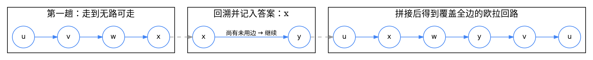

## Introduction

在图论中，欧拉路径（Eulerian path）是经过图中每条边恰好一次的路径，欧拉回路（Eulerian circuit）是经过图中每条边恰好一次的回路。 
如果一个图中存在欧拉回路，则这个图被称为欧拉图（Eulerian graph）；如果一个图中不存在欧拉回路但是存在欧拉路径，则这个图被称为半欧拉图（semi-Eulerian graph）

我们假设所讨论的图 G 中不存在孤立顶点。该假设不失一般性，因为对于存在孤立顶点的图 G ，以下性质对从 G 中删除孤立顶点后得到的图 G' 仍然成立。

对于连通图 G ，以下三个性质是互相等价的：

- G 是欧拉图；
- G 中所有顶点的度数都是偶数（对于有向图，每个顶点的入度等于出度）；
- G 可被分解为若干条不共边回路的并


### Existence Conditions
判定的前提是**非零度顶点互相连通**（无向图为连通；有向图为「忽略方向后连通」，若要求欧拉回路则更强，需**强连通**）。孤立顶点既不影响存在性，也不影响下表的成立。

**无向图**

| 奇度顶点个数 | 结论 |
| --- | --- |
| 0 | **欧拉回路**（此时 G 是欧拉图），任意顶点均可作起点 |
| 2 | **欧拉路径**（G 是半欧拉图），必须以两个奇度顶点之一为起点、另一个为终点 |
| 其他（$\ge 4$） | 不存在欧拉路径 |

「恰 2 个奇度点」这个限制是**连通性推出来的**：一次经过所有边的走法，除起点与终点外每个顶点都是「进一次出一次」，度数为偶数；起点多一次出、终点多一次进，故恰为两个奇度点。

**有向图**

| 度数差情况 | 结论 |
| --- | --- |
| 所有顶点 $d^+(v) = d^-(v)$ | **欧拉回路**，任意顶点均可作起点 |
| 恰一点 $d^+-d^- = 1$，恰一点 $d^--d^+ = 1$，其余相等 | **欧拉路径**，起点是 $d^+-d^-=1$ 的那个点，终点是反之的那个点 |
| 其他 | 不存在欧拉路径 |

对照要点：

- 无向图只看**度数** $d(v)$，有向图看**入度与出度之差** $d^+(v)-d^-(v)$——「度数」在有向图里被拆成了两个方向，因此判据形式不同。
- 有向图中 $d^+(v)-d^-(v)$ 的**和恒为 0**（每条边各贡献一个入、一个出），所以「一个 $+1$」必然配一个「一个 $-1$」，不可能只出现单侧的 $+1$。
- 无向图的奇度点**必然为偶数个**（握手定理 $\sum_v d(v) = 2|E|$ 为偶数），所以「其他」情形实际只会是 $4, 6, \dots$。
- **半欧拉图与欧拉图可互相转化**：把两个奇度顶点连一条边（赋予任意权值）即得欧拉图；反之从欧拉图中删去任意一条边即得半欧拉图。

### Hierholzer's Algorithm
核心思想直接来自上文等价性中的第三条：**欧拉图可被拆解为若干条不共边回路的并**。于是先找出若干条回路，再把它们「拼」成一条完整的欧拉回路。

维护一个栈。从任一顶点 $v$ 出发，每次沿着一条未使用的边走过去，直到无路可走；此时把栈顶顶点**弹出并记入答案**，再从它出发继续；直到栈空。答案序列是**逆序**的，输出时反转（或利用栈后进先出的性质直接输出）。



伪代码：

```text
Hierholzer(start):
    stack = [start]
    circuit = []                     # 逆序答案
    ptr[v] = 0 for all v             # 每个顶点邻接表的扫描指针
    while stack not empty:
        v = stack.top()
        while ptr[v] < len(adj[v]) and adj[v][ptr[v]] already used:
            ptr[v] += 1              # 跳过已用边
        if ptr[v] == len(adj[v]):    # 无未用边可走 → 死路，回溯
            circuit.push(stack.pop())
        else:
            e = adj[v][ptr[v]]; ptr[v] += 1
            mark e as used           # 关键：边只能用一次
            stack.push(e.to)
    return reverse(circuit)
```

**复杂度 $O(V+E)$**：每条边被取到一次、标记为已用一次，共 $O(E)$；每个顶点入栈出栈各至多一次（有向图中某点可多次入栈，但入栈次数等于其出边被走的次数，仍为 $O(E)$），合计 $O(V+E)$。注意必须用**邻接表**存图：若用邻接矩阵，每次寻边耗时 $O(V)$，总复杂度退化为 $O(VE)$。

两个必须强调的点：

1. **边只能用一次。** 已走的边要立即标记（或从邻接表删除），否则会反复走同一条边而永不终止。有向图中尤其要注意：每条**有向边**只能沿其方向走一次，若数据结构把 $(u,v)$ 与 $(v,u)$ 当作同一条记录，会导致有向图的边被错误地双向使用。
2. **「入度出度差」决定了首尾的对称性。** 走完的最终答案序列之所以自然满足欧拉路径的端点要求，正是因为度数差在统计上保证了起点多一次出边、终点多一次入边；代码里**不需要**（也不应该）手工去修补首尾。算法只在**选择起点**时需要依据度数：欧拉回路随便挑一个非零度顶点，半欧拉图必须挑奇度（无向）或 $d^+-d^-=1$（有向）的那个点。

半欧拉图的做法与欧拉回路完全相同，只是起点换成那个特定的奇度点，且最终答案**不需要反转**（它本来就是一条路径而非回路）。

若要求**字典序最小**的欧拉路，需要先把每个顶点的邻接边按终点编号升序排序，复杂度升至 $O(E\log E)$（用基数排序可降到 $O(E)$）。

### Eulerian Circuit vs Graph Traversal
一个自然的错误想法是：欧拉回路不就是「把所有边走一遍」吗？直接 DFS/BFS 遍历，把访问顺序记下来不就行了？

**不行。** 原因是**遍历与「迹」的语义不匹配**：

- **遍历关心的是「顶点有没有被访问过」**。DFS/BFS 允许重复到达顶点，但通过 `visited` 数组保证每个顶点只处理一次。这对求连通性、求无权最短路径是**正确**的抽象。
- **欧拉回路关心的是「边有没有被用过」**。它允许重复经过顶点（这正是它能存在的前提），但要求**每条边恰好一次**。用 `visited[v]` 记账，会在第一次到达 $v$ 后禁止再次进入 $v$，从而**永远走不完**那些必须重访顶点的边。

举个最小反例：三角形加一条悬挂边 $x - v$（$v$ 是三角形的一个顶点）。要覆盖这条悬挂边，就必须**两次经过 $v$**（去一次、回一次）。而 DFS 一旦标记 $v$ 已访问，就再也不会第二次进入 $v$，悬挂边永远走不到。

**回溯走过的那条边仍然属于回路** —— 这是理解 Hierholzer 的关键。朴素 DFS 中「从 $v$ 退回到 $u$」的那一步，在 Hierholzer 语义下**不是撤销**，而是**回溯到 $u$ 继续找另一条尚未使用的边**：如果 $u$ 还有未用边，就接着走成一个**新的回路**；这个新回路与先前那条在 $u$ 处**共用顶点但不共用边**，两条回路在 $u$ 处**拼接**成一条更长的回路，重复直到所有边都被覆盖。栈结构正是用来承载这种「嵌套的回路拼接」过程的——这也说明为什么算法叫 Hierholzer（一条回路一条回路地「串」起来），而不是简单的路径枚举。

用前面 dot 图中的过程来说明：先走出 $u \to v \to w \to x$ 这条**死路**并回溯记下 $x$；接着从 $y$ 出发又走出一条回路；两条回路最终被拼成 $u \to x \to w \to y \to v \to u$ 这一条覆盖全部边的欧拉回路。

### Chinese Postman Problem
**问题**：给定一个连通无向加权图 $G$，求一条**起终点相同**的闭合游走，使得**每条边至少走一次**且总代价最小。

这个问题与欧拉回路的关系一目了然：如果所有顶点度数都是偶数，那么闭合游走本身就是一条欧拉回路，答案就是边权总和（对应上文性质中的第三条）。困难恰恰出在**存在奇度顶点**时——闭合游走中每个顶点的进出必须配对，所以**不可能恰好覆盖每条边一次**，只能重复走若干条边来「配平」奇度顶点。

因此最优解的结构是：

$$\text{ans} = \sum_{e\in E} w(e) + \min_{\text{配对方案 } M} \ \sum_{(u,v)\in M} \operatorname{dist}(u,v)$$

其中 $M$ 是把所有**奇度顶点**两两配对的方案，而 $\operatorname{dist}(u,v)$ 是 $u$ 到 $v$ 的**最短路长度**。

直觉：重复走的那些边构成若干条路径，每条路径的两个端点就是被「补上了一次出入」的奇度顶点，从而让它们的度数变为偶数。

**关键结论：被重复的部分可以取为若干条最短路的并。** 因为任何多余的绕行都可以替换成最短路而不增加代价。于是问题归约为：

> 在**奇度顶点导出的完全图**上，以 $\operatorname{dist}(u,v)$ 为边权求**最小权完美匹配**（min-weight perfect matching）。

设奇度顶点个数为 $2k$，则完全图有 $k$ 个点对要配，用 Edmonds「开花算法」（Blossom algorithm）可在 $O(k^3)$ 内解决。由于 $2k$ 为偶数（握手定理），完美匹配一定存在。

需要注意：

- 「至少走一次」与「恰好走一次」的区别正是本问题相对欧拉回路的全部额外代价来源。若允许某些边**不走**，问题退化为**乡村邮差问题**（Rural Postman Problem），NP-难。
- 各 $\operatorname{dist}(u,v)$ 可用一次**多源 Dijkstra**（把所有奇度顶点同时入堆、初始距离为 0）批量求出，$O(E\log V)$，避免对每个奇度点各跑一遍最短路。

### Applications
- **地图一笔画（Königsberg 问题）**：莱布尼茨 1715 年的「七桥问题」正是欧拉回路的雏形——能否不重复、不遗漏地一次走完七座桥。抽象成「街道为边、路口为顶点」，判定条件即上文表格：奇度顶点为 0 才能一笔画。这是欧拉图理论最经典的起源。
- **房间巡检与安防巡逻**：把走廊、门、通道建模为边，要求保安走一遍所有区域且不必重复经过同一通道。此时路径代价与巡检顺序无关，问题简化为「是否存在欧拉回路」，只需 $O(V+E)$ 判定；若有奇度顶点，则必须重复部分通道，最小重复代价即中国邮递员问题。
- **电路布线与 PCB 走线**：印刷电路的导线、芯片引脚连线要求「每条连接都接通且总线长尽量短」。当连接关系构成欧拉图时，可保证每段导线只走一次（无冗余）；否则需按中国邮递员问题补足重复段以最小化总长度。
- **DNA 序列重组（Overlap Assembly）**：这是有向欧拉图最著名的应用。把一个基因组拆成若干读段（reads），把**碱基**作为顶点、**读段**作为有向边（边从读段的首碱基指向末碱基）。若读段来自同一个环状基因组且无测序错误，则每个顶点（碱基）的入度等于出度，图恰是有向欧拉图——沿欧拉回路读边即可把全部读段首尾相接拼回原始序列。这也是 OI Wiki 提到的「有向欧拉图可用于计算机译码」（把 $m$ 个字母编码成 $m^n$ 个不同码字）的同源思想。

## Links

- [graph](/docs/CS/Algorithms/graph/graph.md)
- [Shortest Path](/docs/CS/Algorithms/question/Shortest-Path.md)

## References

1. [欧拉图 - OI Wiki](https://oi-wiki.org/graph/euler/)
2. [二分图最大匹配 - OI Wiki](https://oi-wiki.org/graph/graph-matching/bigraph-match/)
