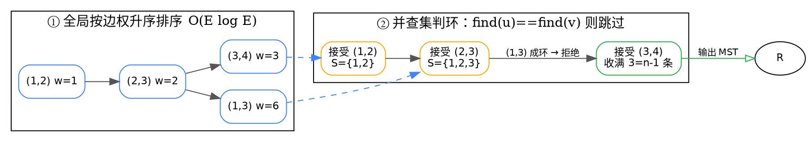

## Introduction


无向连通图的 **最小生成树**（*Minimum Spanning Tree，MST*）为边权和最小的生成树


Prim算法是以顶点为基础,一点一点向外延申,直到所有的顶点都便利完成,算法结束,得到最小生成树,而Kruskal是以边为基础向外扩展,知道有n-1条边,算法结束,得到最小生成树.所以我们可以得到(**假如有两棵顶点树相同的树**)Prim更适用于边数较多的图(稠密图),而Kruskal更适用于边数较少的图 (稀疏图)

> **关于上面这段描述的勘误。** 上文原句保留不动，但其中「Prim 更适用于**边数**较多的图，Kruskal 更适用于**边数**较少的图」这一措辞不准确，需要澄清：
>
> 决定两者效率的并不是「整张图边数的多少」，而是各自的**关键参数**不同。
>
> - **Prim 是基于顶点的**：每轮从已加入集合 $S$ 中取一个顶点，扫描**该顶点的邻接边**，代价正比于 $|V|$ 与该顶点的度数 $\deg(v)$。它的开销发生在**顶点及其邻接表**上。
> - **Kruskal 是基于边的**：把**全部** $|E|$ 条边按权值升序排序后依次考察，开销主要来自**排序**这一步，正比于 $|E|$。它的时间下界是 $\Omega(|E|\log |E|)$。
>
> 之所以仍要引出「稠密 / 稀疏」，是因为在简单图中 $|E|$ 与 $|V|$ 本来就存在量级关系：稀疏图 $E=O(V)$、稠密图 $E=\Theta(V^2)$。于是同一句「稠密图用 Prim、稀疏图用 Kruskal」在结论上是对的，只是**理由应当落在 $O(E\log E)$ 与 $O(E\log V)$ 的比较、以及各自触及的数据结构上**，而不是落在字面上的「边数多少」。下文「稠密图用 Prim、稀疏图用 Kruskal」一节给出严格对照。


### 生成树的性质

生成树（spanning tree）是原图的一个子图，满足：

1. **连通**：包含原图全部 $|V|$ 个顶点，且任意两点之间有路径；
2. **无环**（acyclic）：不含任何回路。

由此直接得到一个基本计数结论：

- **$n$ 个顶点的生成树恰好有 $n-1$ 条边。** 一方面由无环性：任取一个根，每条边唯一地对应一个非根顶点，故边数为 $n-1$；另一方面由连通性：树中任意两点间路径唯一，从根到其余 $n-1$ 个顶点各需一条边，故边数至少为 $n-1$。两者夹逼得边数恰为 $n-1$。

由此可知，**找一棵生成树等价于在「不破坏连通性」的前提下恰好选出 $n-1$ 条边**。这正是 Kruskal 用并查集「拒绝成环」的依据——不回头路地把边一条条接上，直到边数达标。

关于 MST 的唯一性，需要区分两件事：

- **MST 可能不唯一，但权值唯一。** 也就是说，最小生成树的**形态**（具体是哪棵子树）可能有多棵，但它们的**边权和一定相同**。也正因为权值唯一，「最小权值」才有确定答案。
- **MST 是「瓶颈最小」的。** 对任意两点 $s,t$，设 $T$ 为任意一棵 MST，则 $T$ 上 $s$ 到 $t$ 的路径 $P_{s,t}$ 就是一条**瓶颈路径（bottleneck path）**：其路径上最大边权 $\max_{e \in P_{s,t}} w(e)$ 已在所有 $s\to t$ 路径中达到最小可能值。详见下文「最小瓶颈生成树 vs 最小生成树」一节。

### 割性质（cut property）与环性质（cycle property）

这两条性质是 MST 全部正确性论证的基石：Kruskal 与 Prim 虽然形态差异很大，但它们**每一步的贪心选择都可以归结到割性质上**，因此都被割性质「担保」为正确。

**割性质（cut property）**

把 $V$ 任意划分为两个非空集合 $S$ 与 $V - S$，这个划分称为一个**割（cut）**，跨越两个集合的边称为**跨割边**。

> **割性质**：对任意一个割而言，**权值最小的跨割边一定是某棵 MST 的边**。

更实用的表述是：**当前森林中连接 $S$ 与 $V-S$ 的边里，权值最小的那条边是「安全边」（safe edge），加入它不会破坏「已选边仍可扩展为某棵 MST」这一不变式。**

注意「最小」是在**跨割边这个子集内部**取的，而不是全局最小边——这正是 Prim 的「取跨割最小边」与 Kruskal 的「取全局最小的不成环边」能同时正确的原因：Prim 天然在考察某个特定的割；而 Kruskal 取的全局最小边必然也是当前所在割的跨割最小边（否则它在更小权值处就已被成环而拒绝），所以 Kruskal 的选择同样满足割性质。

**环性质（cycle property）**

> **环性质**：对任意一个简单环而言，**环上权值最大的边一定不可能出现在任何一棵 MST 中**（等价说法：MST 中不包含「在该环上严格最重」的边）。

推论（更常用）：若一条边 $e$ 是其所在环中权值**唯一**最大的边，则 $e$ **必然不属于** MST；若只是「不严格最大」（存在并列），则 $e$ 只是「可能不属于」，不能断定必须舍弃——这正是并列权值下 MST 可能不唯一的来源。

割性质与环性质互为对偶：割性质告诉你「哪条边可以放心加进去」，环性质告诉你「哪条边可以放心扔掉」。把「拒绝成环」翻译过来就是环性质——当 Kruskal 拒绝一条边 $(u,v)$ 时，是因为 $u$ 与 $v$ 之间已有一条路径，该路径加上 $(u,v)$ 构成一个环；若 $(u,v)$ 权值更小则本该更早被接受，故它必是该环上最重的边之一，于是被环性质判为「不必选入」。**两条性质合起来就构成了 MST 的完备正确性证明。**

### Kruskal 算法

思路极其直接：**按边权升序扫全部边，凡是不成环就收下**，收满 $n-1$ 条边为止。



伪代码：

```text
Kruskal(V, E):
    for v in V: make_set(v)            # 并查集，每个顶点自成一个集合
    sort E by weight ascending         # O(E log E)
    ans = []                           # 已选边
    for (u, v, w) in E:                # O(E) 次扫描
        if find(u) != find(v):         # 不成环 → 接受
            union(u, v)
            ans.push((u, v, w))
            if len(ans) == |V| - 1:     # 边数达标，提前结束
                break
    return ans
```

**正确性**：每一步接受的边都是「当前森林的某个割上的最小跨割边」，由割性质保证安全；被拒绝的边必是其所在环上最重的边，由环性质保证不必选入。集合增长到 $|V|-1$ 条边时恰好构成生成树。

**复杂度**：排序 $O(E\log E)$ 主导；每条边的并查集操作为 $O(\alpha(V))$（反阿克曼函数，实践中可视为常数），共 $O(E\alpha(V))$。合计 **$O(E\log E)$**，空间 $O(V+E)$（存边 + 并查集）。

**适用**：稀疏图。排序全部边是大头，而稀疏图的边少，代价就小。

### Prim 算法

与 Kruskal 相反，Prim 从**单个顶点**出发不断长出一个连通块。每轮**取一个割 $(S, V-S)$ 上的最小跨割边**，把新顶点并入 $S$——所以 Prim 每一步都在直接应用割性质，论证比 Kruskal 更贴近定理本身。

```dot
digraph prim_steps {
  rankdir=LR; bgcolor="transparent";
  node [shape=circle, fixedsize=true, width=0.55, height=0.55,
        fontname="Helvetica", fontsize=11, fillcolor="#e8f0fe", color="#4285f4"];
  edge [fontname="Helvetica", fontsize=10];

  subgraph cluster_g1 {
    label="选起点 1";
    v1 [label="1"]; v2 [label="2"]; v3 [label="3"]; v4 [label="4"];
    v1 -> v2 [label="1"]; v1 -> v3 [label="6"];
    v2 -> v3 [label="2"]; v3 -> v4 [label="3"];
  }

  subgraph cluster_g2 {
    label="割 (S={1,2}, V\\S) 上最小跨割边 = (2,3)";
    v5 [label="1"]; v6 [label="2"]; v7 [label="3"]; v8 [label="4"];
    v5 -> v6 [label="1", color="#34a853", penwidth=2.5];
    v6 -> v7 [label="2", color="#34a853", penwidth=2.5];
    v5 -> v7 [label="6"];
    v7 -> v8 [label="3"];
  }

  subgraph cluster_g3 {
    label="收满 3=n-1 条，得 MST";
    v9 [label="1"]; v10 [label="2"]; v11 [label="3"]; v12 [label="4"];
    v9 -> v10 [label="1", color="#34a853", penwidth=2.5];
    v10 -> v11 [label="2", color="#34a853", penwidth=2.5];
    v11 -> v12 [label="3", color="#34a853", penwidth=2.5];
    v9 -> v11 [label="6", style=dashed, color="#999999"];
  }

  v1 -> v5 [style=dashed, color="#999999"];
  v7 -> v9 [style=dashed, color="#999999"];
}
```

伪代码（优先队列版本）：

```text
Prim(V, E, s):                        # s 为任意起始顶点
    key[v] = +INF for all v;  key[s] = 0
    parent[v] = NIL for all v
    Q = min-heap containing all (key[v], v)
    while Q not empty:
        (k, u) = extract_min(Q)
        if u already in tree: continue      # 过期堆元素，跳过
        add u to tree
        for each (u, v, w) in adj[u]:       # 只扫 u 的邻接边
            if v not in tree and w < key[v]:
                key[v] = w
                parent[v] = u
                decrease_key(Q, key[v], v)   # O(log V)
    return parent
```

伪代码（邻接矩阵版本，适合稠密图）：

```text
Prim_matrix(W, n):                # W 为 n×n 权值矩阵，不存在边为 +INF
    inTree = [false] * n;  dist = [+INF] * n
    dist[0] = 0
    for i in 1..n:
        u = argmin over v not in tree of dist[v]   # O(n)
        inTree[u] = true
        for v in 1..n:                # 扫一整行
            if not inTree[v] and W[u][v] < dist[v]:
                dist[v] = W[u][v]         # O(n)
    return dist
```

**复杂度**：

- **优先队列版本 $O(E\log V)$**：每个顶点只真正入树一次，总松弛次数为 $O(E)$，每次 `decrease_key` 为 $O(\log V)$。对**稀疏图**可用，因为只访问真实存在的边。
- **邻接矩阵版本 $O(V^2)$**：外层 $n$ 轮，每轮一次 $O(n)$ 选最小、一次 $O(n)$ 更新，与边数无关。对**稠密图**可用，因为此时 $E=\Theta(V^2)$，$O(V^2)\le O(E\log V)$，且避免了堆的常数开销与 $O(E)$ 的空间。

**适用**：稠密图。矩阵版不排序全部边，只反复扫顶点，代价被 $V^2$ 封顶，绕开了 Kruskal 排序 $E=\Theta(V^2)$ 条边的开销。

### 稠密图用 Prim、稀疏图用 Kruskal

对照如下（结论与开头原句一致，但「关键参数」一列才是真正的理由）：

| 对比项 | Kruskal | Prim（优先队列） | Prim（邻接矩阵） |
| --- | --- | --- | --- |
| 关键参数 | 边数 $E$ | 顶点数 $V$、松弛次数 $O(E)$ | 顶点数 $V$ |
| 时间 | $O(E\log E)$ | $O(E\log V)$ | $O(V^2)$ |
| 空间 | $O(V+E)$ | $O(V+E)$ | $O(V^2)$ |
| 增量方式 | 按权值升序**全局**扫边 | 每轮沿**当前割**扩张 | 每轮沿**当前割**扩张 |
| 依赖邻接结构 | 否（只需边集） | 是（邻接表） | 是（邻接矩阵） |
| 适用图型 | 稀疏图 $E=O(V)$ | 稀疏图 | 稠密图 $E=\Theta(V^2)$ |

判定口诀：**「要不要给全部边排序」是分水岭。** 边少时排序便宜，Kruskal 简单省事；边多时排序成为瓶颈，此时 Prim 只需把每个顶点扫常数遍，故更优。

### 变体

**最小生成森林（minimum spanning forest）**

原图不连通时，MST 不复存在（各连通分量的生成树边数之和达不到 $n-1$）。正确做法是**对每个连通分量分别求 MST**。

实现上几乎零成本：**Kruskal 原封不动地跑完即可**——它扫完所有边时，每个连通分量内部自然形成一棵 MST。若要求恰好 $k$ 个连通分量，则在收满 $n-k$ 条边后停止。

**含负权边**

- **Kruskal 完全不受影响**。排序对负数一样成立，割性质与环性质的证明也不依赖非负性，直接可用。
- **Prim 需要预处理**。朴素 Prim 在选「下一个加入 $S$ 的顶点」时，比较的是**到 $S$ 的边权**，负权边会让比较语义变得脆弱（一条极小的负权边可能在顶点还没就绪时就反复被松弛）。标准做法是：先把每个**尚未到达**的顶点连向 $S$ 的最小边记为 $key[v]=+\infty$，而在**第一轮**就把 $key[v]$ 直接设为与起点 $s$ 相连的**所有**边的权值（包括负数）：

  $$key[v] = \min_{e \in (s,v)} w(e)$$

  若 $v$ 与 $s$ 无边相连则仍取 $+\infty$。这样初始化之后，后续每一步跨割边的权值都严格是「$S$ 到 $V-S$ 的真实边权」，不再是「占位值与真实值混合」，割性质的语义即被恢复，负权也照样正确。另一种等价做法是把负权边全部预先收进生成树，再对其余边跑 Prim。

**MST 与单链聚类（single-linkage clustering）**

把 $n$ 个对象两两之间的距离当作边权，MST 中**删掉最长的若干条边**，剩下的连通分量就是一种聚类结果——这正是层次聚类（hierarchical clustering）中的**单链法 / UPGMA**：两个簇合并的准则是「两簇之间的最小距离」，而 MST 保留了所有点对距离中最小的那些结构。

关键性质是：**单链聚类的层次结构可以直接由 MST 按边权升序删边的过程读出**——因为 MST 保证了任意两点在树上的路径是瓶颈路径，「最小距离」准则下应当最先合并的那一对，一定恰好是某条 MST 边被加回去的位置。（相对的**全链法**用簇间最大距离，此类情形 MST 不再适用。）

**最小瓶颈生成树 vs 最小生成树**

这是两个**不同**的目标，虽然在无向图中最优解重合，但概念必须分清：

- **最小生成树 MST**：最小化**所有边的权值总和** $\sum_{e \in T} w(e)$。
- **最小瓶颈生成树（minimum bottleneck spanning tree, MBST）**：最小化树上**最大边权**，即 $\min_T \max_{e \in T} w(e)$。

关系：**任何 MST 都是一个 MBST**，反之**不成立**——MBST 未必是 MST。

一个清晰的反例：设某图有两棵生成树，$T_1$ 的总权为 200 但最大边权仅 1，$T_2$ 的总权为 50 但最大边权为 10。此时 $T_2$ 是最小生成树（总权更小），却不是最小瓶颈生成树（最大边更大）；而 $T_1$ 是 MBST 却不含于任何 MST。反过来，「总权更小」和「最大边更小」是两个独立诉求——**只有当所有边权都相等时，二者才必然同时最优**。

因为 MST 必是 MBST，若只要求「最小化最大边」，跑一次 MST 再取其最大边即可，无需独立求解。

### 实现细节

**并查集（`Disjoint_Set`）用 union by rank + path compression**

判环效率完全取决于并查集实现，两项优化叠加后单次操作摊还 $O(\alpha(V))$：

- **path compression（路径压缩）**：`find` 时把访问过的节点直接挂到根上，使树高趋于常数；
- **union by rank（按秩合并）**：不总是把 $y$ 挂到 $x$ 下，而是把**秩较小**的根挂到**秩较大**的根下。单独用其中任一项已可达摊还 $O(\log V)$，**两者同时使用**才能达到理论最优的 $O(\alpha(V))$。

```text
find(x):                             # 路径压缩（迭代版，避免深递归爆栈）
    r = x
    while parent[r] != r: r = parent[r]
    while parent[x] != r:            # 边走边压
        nxt = parent[x]; parent[x] = r; x = nxt
    return r

union(x, y):
    rx, ry = find(x), find(y)
    if rx == ry: return false
    if rank[rx] < rank[ry]: rx, ry = ry, rx   # 秩小者挂秩大者
    parent[ry] = rx
    if rank[rx] == rank[ry]: rank[rx] += 1
    return true
```

**注意重边与自环**：Kruskal 通常按**边**（而非顶点对）建堆，自环 $(v,v)$ 天然成环会被并查集拒绝；平行边（重边）需要允许多条记录共存，不要用 `map` 把同一对顶点压成一条，否则会丢边。

**边排序的稳定性**

`std::sort` **不稳定**，但对本算法**正确性无影响**：MST 的权值唯一，并列权值的边选哪一条都不改变最优权值（差异只在树形）。若题目要求**输出字典序最小**的 MST，就不能依赖排序的偶然顺序，而要**显式按二元组 `(weight, u, v)` 排序**。

若边权为浮点数，注意 `sort` 所需的严格弱序在存在 NaN 时会失效；工程上应先剔除非法值或改用显式比较器。

**大图上用邻接表而非邻接矩阵**

- Prim 的堆版本必须用**邻接表**：它只遍历真实存在的边，用矩阵会为了找 $V$ 条边而付出 $V^2$ 的空间与扫描代价。
- Prim 的矩阵版本用矩阵**不是因为它更省**，而是因为稠密图上 $V^2$ 的空间与 $E=\Theta(V^2)$ 的边集本身体量相当，且免去了堆的对数因子；一旦图变稀疏，矩阵立刻失控（$E=O(V)$ 时空间浪费 $O(V^2)$，且 $O(V^2)$ 远超 $O(E\log V)$）。
- Kruskal **完全不需要邻接结构**，只需一个边集数组——这是它在大图上最省内存的原因。

### Prim's Algorithm

prim算法的思想和Dijkstra很相似 适合稠密图


### Kruskal's Algorithm

Kruskal算法的做法是：每次都从剩余边中选取权值最小的 是个贪心算法，当然，这条边不能使已有的边产生回路


## Links

- [graph](/docs/CS/Algorithms/graph/graph.md)
- [Disjoint Set](/docs/CS/Algorithms/tree/Disjoint_Set.md)
- [Algorithms](/docs/CS/Algorithms/Algorithms.md)

## References

1. [最小生成树 - OI Wiki](https://oi-wiki.org/graph/mst/)
2. [并查集 - OI Wiki](https://oi-wiki.org/ds/dsu/)
