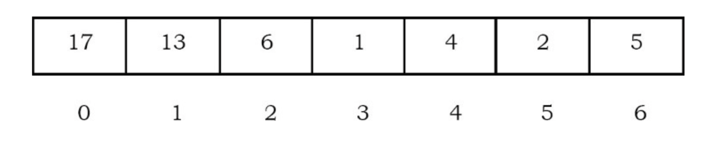

## Introduction

In some situations we may need to find the minimum/maximum element among a collection of elements. We can do this with the help of Priority Queue ADT.
A priority queue ADT is a data structure that supports the operations Insert and DeleteMin (which returns and removes the minimum element) or DeleteMax (which returns and removes the maximum element).
These operations are equivalent to EnQueue and DeQueue operations of a queue. The difference is that, in priority queues, the order in which the elements enter the queue may not be the same in which they were processed.
An example application of a priority queue is job scheduling, which is prioritized instead of serving in first come first serve.

A priority queue is called an *ascending – priority* queue, if the item with the smallest key has the highest priority (that means, delete the smallest element always).
Similarly, a priority queue is said to be a *descending – priority* queue if the item with the largest key has the highest priority (delete the maximum element always).
Since these two types are symmetric we will be concentrating on one of them: ascending-priority queue.

Priority queues are also important in the implementation of  [*greedy algorithms*](/docs/CS/Algorithms/Greedy.md) , which operate by repeatedly finding a minimum.

## Priority Queue ADT

The following operations make priority queues an ADT.

**Main Priority Queues Operations**

A priority queue is a container of elements, each having an associated key.

- Insert (key, data): Inserts data with key to the priority queue. Elements are ordered based on key.
- DeleteMin/DeleteMax: Remove and return the element with the smallest/largest key.
- GetMinimum/GetMaximum: Return the element with the smallest/largest key without deleting it.

**Auxiliary Priority Queues Operations**

- kth – Smallest/kth – Largest: Returns the kth –Smallest/kth –Largest key in priority queue.
- Size: Returns number of elements in priority queue.
- Heap Sort: Sorts the elements in the priority queue based on priority (key)

## Priority Queue Applications

Priority queues have many applications - a few of them are listed below:

- Data compression: Huffman Coding algorithm
- Shortest path algorithms: Dijkstra’s algorithm
- Minimum spanning tree algorithms: Prim’s algorithm
- Event-driven simulation: customers in a line
- Selection problem: Finding kth- smallest element

## Priority Queue Implementations

Before discussing the actual implementation, let us enumerate the possible options.

Unordered Array Implementation
Elements are inserted into the array without bothering about the order. Deletions (DeleteMax) are performed by searching the key and then deleting.
Insertions complexity: O(1). DeleteMin complexity: O(n).

Unordered List Implementation
It is very similar to array implementation, but instead of using arrays, linked lists are used. Insertions complexity: O(1). DeleteMin complexity: O(n).

Ordered Array Implementation
Elements are inserted into the array in sorted order based on key field. Deletions are performed at only one end.
Insertions complexity: O(n). DeleteMin complexity: O(1).

Ordered List Implementation
Elements are inserted into the list in sorted order based on key field. Deletions are performed at only one end, hence preserving the status of the priority queue. All other functionalities associated with a linked list ADT are performed without modification.
Insertions complexity: O(n). DeleteMin complexity: O(1).

Binary Search Trees Implementation
Both insertions and deletions take O(logn) on average if insertions are random (refer to Trees chapter).

Balanced Binary Search Trees Implementation
Both insertions and deletion take O(logn) in the worst case (refer to Trees chapter).

Binary Heap Implementation
In subsequent sections we will discuss this in full detail. For now, assume that binary heap implementation gives O(logn) complexity for search, insertions and deletions and O(1) for finding the maximum or minimum element.

Comparing Implementations

| Implementation               | Insertion       | Deletion(DeleteMax) | Find Min        |
| ---------------------------- | --------------- | ------------------- | --------------- |
| Unordered Array              | 1               | n                   | n               |
| Unordered List               | 1               | n                   | n               |
| Ordered Array                | n               | 1                   | 1               |
| Ordered List                 | n               | 1                   | 1               |
| Binary Search Trees          | $logn(average)$ | $logn(average)$     | $logn(average)$ |
| Balanced Binary Search Trees | $logn$          | $logn$              | $logn$          |
| Binary Heap                  | $logn$          | $logn$              | 1               |

## Heaps and Binary Heaps

A heap is a tree with some special properties.
The basic requirement of a heap is that the value of a node must be ≥ (or ≤) than the values of its children.
This is called heap property.
A heap also has the additional property that all leaves should be at h or h – 1 levels (where h is the height of the tree) for some h > 0 (complete binary trees).
That means heap should form a complete binary tree.

Based on the property of a heap we can classify heaps into two types:

- **Min heap:** The value of a node must be less than or equal to the values of its children
- **Max heap:** The value of a node must be greater than or equal to the values of its children

### Binary Heaps

In binary heap each node may have up to two children. In practice, binary heaps are enough and we concentrate on binary min heaps and binary max heaps for the remaining discussion.

**Representing Heaps:**
Before looking at heap operations, let us see how heaps can be represented. One possibility is using arrays.
Since heaps are forming complete binary trees, there will not be any wastage of locations.
For the discussion below let us assume that elements are stored in arrays, which starts at index 0. The previous max heap can be represented as:

## d-Heaps

Binary heaps are so simple that they are almost always used when priority queues are needed.
A simple generalization is a  *d-heap* , which is exactly like a binary heap except that all nodes have *d *children (thus, a binary heap is a 2-heap).

## Leftist Heaps

## Skew Heaps

A *skew heap* is a self-adjusting version of a leftist heap that is incredibly simple to implement.
The relationship of skew heaps to leftist heaps is analogous to the relation between splay trees and AVL trees.
Skew heaps are binary trees with heap order, but there is no structural constraint on these trees.
Unlike leftist heaps, no information is maintained about the null path length of any node.
The right path of a skew heap can be arbitrarily long at any time, so the worst-case running time of all operations is  *O* ( *n* ).
However, as with splay trees, it can be shown that for any *m* consecutive operations, the total worst-case running time is  *O* (*m *log  *n* ).
Thus, skew heaps have  *O* (log  *n* ) amortized cost per operation.

As with leftist heaps, the fundamental operation on skew heaps is merging.

## Binomial Queues

## Summary

The standard binary heap implementation is elegant because of its simplicity and speed. It requires no pointers and only a constant amount of extra space, yet supports the priority queue operations efficiently.

We considered the additional *merge* operation and developed three implementations, each of which is unique in its own way.
The leftist heap is a wonderful example of the power of recursion. The skew heap represents a remarkable data structure because of the lack of balance criteria.
The binomial queue shows how a simple idea can be used to achieve a good time bound.

## Links

- [data structures](/docs/CS/Algorithms/Algorithms.md?id=data-structures)

## References
