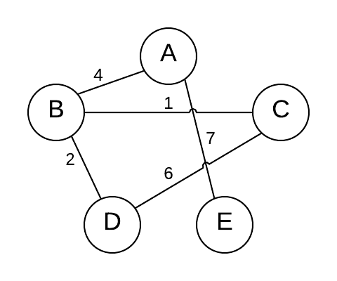

## Introduction

最短路径算法是一系列旨在解决最短路径问题的算法
最短路径问题是大多数人对此有一定直观熟悉的：给定两个点，A和B，它们之间的最短路径是什么？
然而，在计算机科学中，最短路径问题可以有不同的形式，因此需要不同的算法来解决所有问题

为了简化和通用，最短路径算法通常运行在某个输入图 G 上, 该图由一组顶点 ( V ) 组成,，以及边 E 连接它们。如果边有权重，则该图称为加权图。有时这些边是双向的，因此该图称为无向的。有时图表中甚至存在循环。这些细微的差异正是某些算法在某些图类型下表现更好的原因。下面展示了一个图表的示例

<div style="text-align: center;">



</div>

<p style="text-align: center;">一个无向加权图</p>

最短路径算法也有不同类型。也许你需要找到点A到B之间的最短路径，但也许你需要找到点A到图中所有其他点之间的最短路径

最短路径算法有许多应用。如前所述，像谷歌或苹果地图这样的地图软件使用最短路径算法
它们对道路网络、运营和后勤研究也非常重要。最短路径算法对计算机网络（如互联网）也非常重要
任何帮助你选择路线的软件都会使用某种最短路径算法。比如谷歌地图，你可以输入起点和终点，帮你解决最短路径问题

## Type

最短路径算法主要有两种类型：单源(Single Source)算法和全对(All Pair)算法。这两种类型的算法都有各自表现最好的方式。
全对算法因复杂性增加而运行时间更长。所有最短路径算法都会返回可用于寻找最短路径的值，即使这些返回值在不同算法的类型或形式上有所不同

最短路径的4个常用算法是Floyd、Bellman-Ford、SPFA、Dijkstra

## Dijkstra

Dijkstra 算法是用于计算单源最短路径算法

基本思想是: 设置两个顶点集 S 和 T, S 中存放已确定最短路径的顶点, T 中存放待确定最短路径的顶点
初始时 S 中仅有一个起始的节点, T 中包含除起始顶点之外的其余顶点

Dijkstra 的流程如下:

1. 初始化dis[start]=0, 其余节点的dis值为无穷大.
2. 找一个dis值最小的蓝点x, 把节点x变成白点.
3. 遍历x的所有出边(x,y,z), 若dis[y]>dis[x]+z,则令dis[y]=dis[x]+z
4. 重复2,3两步,直到所有点都成为白点. 时间复杂度为 $O(n^2)$

Dijkstra 是一种贪心算法 每一步都做出局部最优的选择 最终达到全局最优的结果 该算法只适用于权重非负的图
如果图中包含负权重的边 Dijkstra 可能无法正确计算最短路径 在包含负权重的情况下 通常使用 `Bellman-Ford` 算法

```c++
class Solution {
    public:
    int networkDelayTime(vector<vector<int>>& times, int n, int k) {
        // 标记未被探索的节点距离
        const int inf = INT
        _
        MAX / 2;
        // 邻接表
        vector<vector<int>> g(n, vector<int>(n, inf));
        // 构图
        for (auto time: times) {
        g[time[0] - 1][time[1] - 1] = time[2];
        }
        vector<int> dist(n, inf); // 所有节点未被探索时距离都初始化为无穷
        vector<bool> used(n, false); // 标记是否已经被加入树中
        dist[k - 1] = 0; // 记录原点距离为0
        for (int i = 0; i < n; ++i) {
        int x = -1;
        // 找出候选集中到S距离最短的节点
        for (int y = 0; y < n; ++y) {
            if (!used[y] && (x == -1 || dist[y] < dist[x])) {
            x = y;
            }
            }
            // 加入树中
            used[x] = true;
            // 基于x 对所有x的邻节点进行松弛操作
            for (int y = 0; y < n; ++y) {
                dist[y] = min(dist[y], dist[x] + g[x][y]);
            }
        }
        // 取出最短路中的最大值
        int ans = *max

        element(dist.begin(), dist.end());
        return ans == inf ? -1 : ans;
    }
};
```

时间复杂度上限为O(n^2)(朴素),在实际应用中较为稳定;加上堆优化之后更是具有O((n+m)log 2 n)的时间复杂度,在稠密图中有不俗的表现

Dijkstra 算法是逐步构建最短路径树，树中的节点的最短距离不依赖于树外节点，这样才可以一个节点加入最短路径树之后，距离不再改变。
负权节点的存在会让加入最短路径树的节点的真实最短路径会因为不在树中的节点而改变，整个算法也就无效了

动态路由算法中基于 Dijkstra 算法的链路状态算法，核心思路就是通过节点间的通信，获得每个节点到邻居的链路成本信息，进而在每个节点里都各自独立地绘制出全局路由图，之后就可以基于Dijkstra 算法构建出路由表了

Dijkstra 算法的优化

我们可以用堆对dis数组进行维护,用 $O(logn)$ 的时间取出堆顶元素并删除,用 $O(logn)$ 遍历每条边,总复杂度 $O((n+m)logn)$

## Floyd-Warshall

Floyd 算法一次性求所有结点之间的最短路径，它用到了动态规划的思想：求两点i、j之间的最短距离，可以分两种情况考虑，即经过图中某个点k的路径和不经过点k的路径，取两者中的最短路径

Floyd 算法使用邻接矩阵来处理 依次将每个点作为“中心点”去更新最短路径信息


## A*


## Bellman-Ford

和 Dijkstra 用到的贪心思想不同，Bellman-Ford 算法采用的是动态规划的思想

Bellman-Ford 的整体时间复杂度是 $O(V*E)$，大部分实际场景下，边的数量比节点数量大的多，所以时间复杂度要比 Dijkstra 算法差很多。当然好处在于可以处理图中有负边的情况


全点对最短路径算法用于计算图中所有顶点两两之间的最短路径 常见算法有 `Floyd-Warshall` 算法和 `Jonson's` 算法

`Floyd-Warshall` 算法适用于稠密图 时间复杂度为 $O(V^3)$ 核心思想为动态规划

`Jonson's` 算法适用于稀疏图 时间复杂度近似为 $O(V^3logV+VE)$ 是Dijkstra算法的变种 利用重新加权的技巧 允许在可能存在负权重边的图上使用 Dijkstra 算法

[洛谷P3385 【模板】负环](https://www.luogu.com.cn/problem/P3385)

## A*

A star算法最早可追溯到1968年，在IEEE Transactions on Systems Science and Cybernetics中的论文A Formal Basis for the Heuristic Determination of Minimum Cost Paths中首次提出
A*算法是把启发式方法（heuristic approaches）如BFS（完全使用贪心策略），和常规方法如 Dijsktra 算法结合在一起的算法
有点不同的是，类似BFS的启发式方法经常给出一个近似解而不是保证最佳解。然而，尽管A star基于无法保证最佳解的启发式方法，A star却能保证找到一条最短路径


## Links
