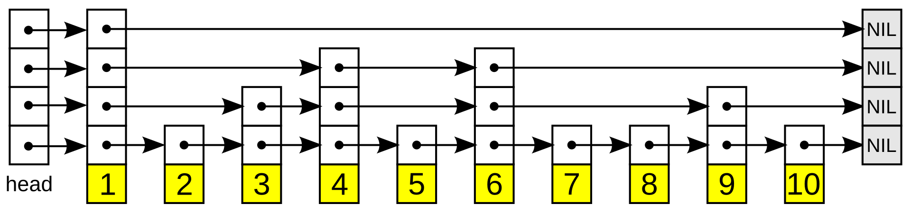

## Introduction

有序数组的好处是可以通过二分实现O(lgn)的高效查找，然而插入元素时，为了保证有序性，时间复杂度是O(n)的。链表则刚好相反，插入数据是$O(1)$，查找元素则是O(n)的。即使链表数据是有序的，查找元素仍然是O(n)的，因为本质上，链表不支持random access

In computer science, a skip list (or skiplist) is a probabilistic data structure that allows O(logn) average complexity for search as well as O(logn) average complexity for insertion within an ordered sequence of n elements. Thus it can get the best features of a sorted [array](https://en.wikipedia.org/wiki/Array_data_structure) (for searching) while maintaining a [linked list](https://en.wikipedia.org/wiki/Linked_list)-like structure that allows insertion, which is not possible with a static array.

|   -   |   平均   | 最差情况下 |
| :----: | :-------: | :--------: |
| Space |  $O(n)$  | $O(nlogn)$ |
| Search | $O(logn)$ |   $O(n)$   |
| Insert | $O(logn)$ |   $O(n)$   |
| Delete | $O(logn)$ |   $O(n)$   |

A skip list is built in layers.
The bottom layer 1 is an ordinary ordered [linked list](/docs/CS/Algorithms/linked-list.md).
Each higher layer acts as an "express lane" for the lists below, where an element in layer 𝑖 appears in layer 𝑖+1 with some fixed probability 𝑝 (two commonly used values for 𝑝 are 1/2 or 1/4).
On average, each element appears in 1/(1−𝑝) lists, and the tallest element (usually a special head element at the front of the skip list) appears in all the lists. The skip list contains $log_{1/𝑝}⁡n$ (i.e. logarithm base 1/𝑝 of 𝑛) lists.

Figure 1 Skip list

A search for a target element begins at the head element in the top list, and proceeds horizontally until the current element is greater than or equal to the target.
If the current element is equal to the target, it has been found.
If the current element is greater than the target, or the search reaches the end of the linked list, the procedure is repeated after returning to the previous element and dropping down vertically to the next lower list.
The expected number of steps in each linked list is at most 1/𝑝, which can be seen by tracing the search path backwards from the target until reaching an element that appears in the next higher list or reaching the beginning of the current list.
Therefore, the total *expected* cost of a search is $1/𝑝log_{1/p}n$ which is $O(logn)$, when 𝑝 is a constant.
By choosing different values of 𝑝, it is possible to trade search costs against storage costs.

skiplist 相比 balanced trees的优势

For many applications, skip lists are a more natural representation than trees, also leading to simpler algorithms.
The simplicity of skip list algorithms makes them easier to implement and provides significant constant factor speed improvements over balanced tree and self-adjusting tree algorithms. Skip lists are also very space efficient.
They can easily be configured to require an average of 1 1/3 pointers per element (or even less) and do not require balance or priority information to be stored with each node.
建议同时设置一个 MaxLevel

Determining MaxLevel Since we can safely cap levels at L(n), we should choose MaxLevel = L(N) (where N is an upper bound on the number of elements in a skip list).
If p = 1/2, using MaxLevel = 16 is appropriate for data structures containing up to 216 elements.

## Links

## References

1. [Skip List(跳表) - Torch-Fan](https://www.torch-fan.site/2023/04/08/%E6%95%B0%E6%8D%AE%E7%BB%93%E6%9E%84-Skip-List-%E8%B7%B3%E8%A1%A8/)
2. [Skip Lists: A Probabilistic Alternative to Balanced Trees](https://15721.courses.cs.cmu.edu/spring2018/papers/08-oltpindexes1/pugh-skiplists-cacm1990.pdf)
