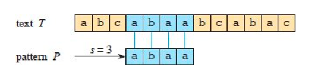
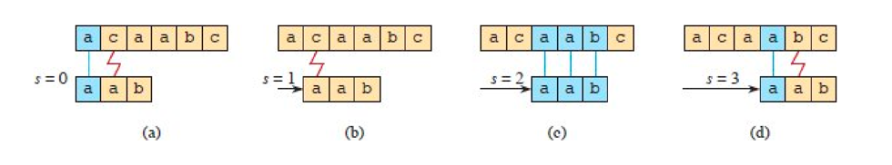

## Introduction

字符串匹配问题可以正式定义如下。
文本以数组 T[1:n] 形式给出，长度为 n，模式以数组 P[1:m] 形式给出，长度为 m ≤ n。
P 和 T 的元素都是从字母表 ∑ 中抽取的字符，∑ 是一个有限的字符集。
例如，∑ 可以是集合 {0, 1}，也可以是集合 {a, b, …, z}。
字符数组 P 和 T 通常称为字符串。

如图 1 所示，模式 P 在文本 T 中以偏移 s 出现（或者等价地，模式 P 从位置 s + 1 开始在文本 T 中出现），
如果 0 ≤ s ≤ n – m 且 $T[s + 1:s + m] = P[1:m]$，即如果 T[s + j] = P[j]，对于 1 ≤ j ≤ m。
如果 P 在 T 中以偏移 s 出现，则 s 是有效偏移，否则 s 是无效偏移。
字符串匹配问题就是找出给定模式 P 在给定文本 T 中出现的所有有效偏移。

<div style="text-align: center;">



</div>

<p style="text-align: center;">
Figure 1 字符串匹配问题的示例：找出模式 P = abaa 在文本 T = abcabaabcabac 中的所有出现位置。
<br/>
该模式在文本中只出现一次，偏移为 s = 3，这是一个有效偏移。
<br/>
竖线连接模式中每个字符与文本中匹配的字符，所有匹配字符以蓝色阴影标出。
</p>

除了朴素暴力算法之外，本章中的每个字符串匹配算法都会基于模式进行一些预处理，然后找出所有有效偏移。
我们将后一个阶段称为"匹配"。
以下是每种字符串匹配算法的预处理和匹配时间。

每个算法的总运行时间是预处理时间和匹配时间之和：

| Algorithm          | Preprocessing time | Matching time      |
| -------------------- | -------------------- | -------------------- |
| Naive              | $0$                | $O((n – m + 1)m)$ |
| Rabin-Karp         | $O(m)$             | $O((n – m + 1)m)$ |
| Finite automaton   | $O(m$              | $∑$               |
| Knuth-Morris-Pratt | $O(m)$             | $O(n)$             |
| Suffix array1      | $O(n1gn)$          | $O(m 1g n + km)$   |

我们介绍一种有趣的字符串匹配算法，由 Rabin 和 Karp 提出。
尽管该算法的 Θ((n – m + 1)m) 最坏情况运行时间并不优于朴素方法，但它在平均情况下和实践中表现好得多。
它也能很好地推广到其他模式匹配问题。
然后我们描述一种字符串匹配算法，该算法首先构建一个有限自动机，专门用于在文本中搜索给定模式 P。
该算法的预处理时间为 $O(m |∑|)$，但匹配时间仅为 Θ(n)。
我们介绍类似但更巧妙的 [Knuth-Morris-Pratt（或 KMP）算法](/docs/CS/Algorithms/string-search?id=KMP)，它具有相同的 $O(n)$ 匹配时间，但将预处理时间减少到仅 $O(m)$。

另一种完全不同的方法涉及后缀数组和最长公共前缀数组。
你可以使用这些数组不仅在文本中查找模式，还可以回答其他问题，
例如文本中最长的重复子串是什么，以及两个文本之间最长的公共子串是什么。
构建后缀数组的算法需要 $O(n \log n)$ 时间，并且在给定后缀数组的情况下，展示了如何在 $O(n)$ 时间内计算最长公共前缀数组。

## The naive string-matching algorithm

*Naive-String-Matcher* 过程通过一个循环实现所有有效偏移的查找，该循环检查对于 n−m+1 个可能的 s 值中的每一个，条件 $P[1:m] = T[s+1:s+m]$ 是否成立。

Naive-String-Matcher(T, P, n, m)

```
for s = 0 to n – m
    if P[1:m] == T[s + 1:s + m]
        print "Pattern occurs with shift" s
```

图 3 将朴素字符串匹配过程描述为在文本上滑动包含模式的"模板"，
记录在哪些偏移下，模板上的所有字符与文本中对应的字符相等。
第 1-3 行的 for 循环显式地考虑每个可能的偏移。
第 2 行的测试确定当前偏移是否有效。
该测试隐式地循环检查对应的字符位置，直到所有位置匹配成功或发现不匹配。
第 3 行打印出每个有效偏移 s。

<div style="text-align: center;">



</div>

<p style="text-align: center;">
Figure 2 
Naive-String-Matcher 过程处理模式 P = aab 和文本 T = acaabc 的操作。
<br/>
将模式 P 想象为在文本旁边滑动的模板。(a)–(d) 
朴素字符串匹配器尝试的四种连续对齐方式。 
在每个部分中，竖线连接发现匹配的对应区域（以蓝色显示），红色锯齿线连接找到的第一个不匹配字符（如果有的话）。 
<br/>
该算法在偏移 s = 2 处找到了模式的一个出现，如图 (c) 部分所示。
</p>

Naive-String-Matcher 过程的时间复杂度为 $O((n – m + 1)m)$，这个界在最坏情况下是紧的。
例如，考虑文本字符串 a^n（连续 n 个 a 组成的字符串）和模式 a^m。
对于 n−m+1 个可能的偏移 s 值中的每一个，第 2 行的隐式循环比较对应字符需要执行 m 次来验证偏移。
因此最坏情况运行时间为 $O((n − m + 1)m)$，当 $m = [n/2]$ 时为 $Θ(n^2)$。
由于不需要预处理，Naive-String-Matcher 的运行时间等于其匹配时间。

Naive-String-Matcher 对于这个问题远非最优过程。
朴素字符串匹配器效率低下的原因是，它在考虑其他 s 值时完全忽略了从一个 s 值获得的关于文本的信息。
然而，这些信息可能非常有价值。例如，如果 P = aaab 且 s = 0 有效，则偏移 1、2 或 3 都无效，因为 T[4] = b。
接下来的几节将探讨如何有效利用这类信息的几种方法。

## The Rabin-Karp algorithm

Rabin 和 Karp 提出了一种字符串匹配算法，该算法在实践中表现良好，并且也可以推广到其他相关问题的算法，例如二维模式匹配。
Rabin-Karp 算法需要 Θ(m) 的预处理时间，其最坏情况运行时间为 Θ((n−m+1)m)。
然而，基于某些假设，其平均情况运行时间更好。

该算法使用了初等数论的概念，例如两个数模第三个数的等价性。

为了便于说明，假设 ∑ = {0, 1, 2, …, 9}，这样每个字符都是一个十进制数字。
（在一般情况下，你可以假设每个字符是 d 进制表示中的一位数字，因此其数值范围在 0 到 d-1 之间，其中 d = |∑|。）
然后你可以将 k 个连续字符的字符串视为一个长度为 k 的十进制数。
例如，字符串 31415 对应十进制数字 31,415。
因为我们将输入字符既解释为图形符号又解释为数字，所以在本节中将它们表示为标准字体中的数字会更方便。

给定一个模式 P[1:m]，令 p 表示其对应的十进制值。
类似地，给定一个文本 T[1:n]，令 t_s 表示长度 m 的子串 T[s + 1:s + m] 的十进制值，对于 s = 0, 1, …, n – m。
显然，t_s = p 当且仅当 T [s + 1:s + m] = P[1:m]，因此 s 是有效偏移当且仅当 t_s = p。
如果你能在 Θ(m) 时间内计算 p，并且在总共 Θ(n – m + 1) 时间内计算所有 t_s 值，那么你可以通过将 p 与每个 t_s 值进行比较，在 Θ(m)+Θ(n − m + 1) = Θ(n) 时间内确定所有有效偏移 s。
（目前，我们先不担心 p 和 t_s 值可能是非常大的数的问题。）

## BF

暴力子串搜索在最坏情况下需要对长度为 M 的模式在长度为 N 的文本中进行 ~N·M 次字符比较。

## MP

## KMP

Knuth、Morris 和 Pratt 开发了一种线性时间字符串匹配算法，该算法避免了显式计算转移函数 δ。
相反，KMP 算法使用一个辅助函数 π，该函数在 Θ(m) 时间内从模式预计算得到，并存储在数组 π[1:m] 中。
数组 π 允许算法（按摊还意义）在需要时"即时"高效地计算转移函数 δ。
粗略地说，对于任何状态 q = 0, 1, …, m 和任何字符 a ∈ ∑，π[q] 包含计算 δ(q, a) 所需的信息，但不依赖于 a。
由于数组 π 只有 m 个条目，而 δ 有 Θ(m |∑|) 个条目，KMP 算法通过计算 π 而不是 δ，在预处理时间上节省了 |∑| 因子。
与 FINITE-AUTOMATON-MATCHER 过程一样，一旦预处理完成，KMP 算法使用 Θ(n) 的匹配时间。

模式的前缀函数 π 封装了关于模式如何与自身的偏移匹配的知识。
KMP 算法利用这些信息来避免朴素模式匹配算法中无用的偏移测试，并避免预计算字符串匹配自动机的完整转移函数 δ。

Knuth-Morris-Pratt 子串搜索在长度为 N 的文本中搜索长度为 M 的模式时，最多访问 M+N 个字符。

空间复杂度 O(N)

```java
public class KMPSearch {
    public static void main(String[] args) {
        String str = "abcxabcdabcdabcy";
        String subString = "abcdabcy";
        KMPSearch ss = new KMPSearch();
        boolean result = ss.KMP(str.toCharArray(), subString.toCharArray());
        System.out.print(result);
    }

    public boolean KMP(char[] text, char[] pattern) {
        int[] lps = computeTemporaryArray(pattern);
        int i = 0;
        int j = 0;
        while (i < text.length && j < pattern.length) {
            if (text[i] == pattern[j]) {
                i++;
                j++;
            } else {
                if (j != 0) {
                    j = lps[j - 1];
                } else {
                    i++;
                }
            }
        }
        return j == pattern.length;
    }

    private int[] computeTemporaryArray(char[] pattern) {
        int[] lps = new int[pattern.length];
        int index = 0;
        for (int i = 1; i < pattern.length; ) {
            if (pattern[i] == pattern[index]) {
                lps[i] = index + 1;
                index++;
                i++;
            } else {
                if (index != 0) {
                    index = lps[index - 1];
                } else {
                    lps[i] = 0;
                    i++;
                }
            }
        }
        return lps;
    }
}
```

## BM

Boyer Moore算法是目前已知的在大多数工业级应用场景中最快的字符串匹配算法，因而被广泛应用在各种需要搜索关键词的软件中，GNU grep, 许多文档编辑器快捷键 ctrl+f 对应的搜索功能都是基于这个算法实现的

BM 算法，最大的特点就是利用了对目标串的预处理，用空间换时间，避免了许多不必要的比较，预处理的方式主要来自于对"坏字符"和"好后缀"两条规则的观察，因为这两个规则和主串都没有关系，只和模式串自身有关，显然可以通过预处理得到两个规则的偏移表，来加速整个模式匹配的过程。

## BMH

## RK

## Suffix arrays

到目前为止，我们在本章中看到的算法可以高效地找到模式在文本中的所有出现。
但这就是它们能做的全部。
本节介绍一种不同的方法——后缀数组——使用它你不仅可以找到模式在文本中的所有出现，还可以做更多的事情。
后缀数组不会像 Knuth-Morris-Pratt 算法那样快速地找到模式的所有出现，但它的额外灵活性使其值得学习。

后缀数组是一种简洁的方式，用于表示长度为 n 的文本的所有 n 个后缀的字典序排序顺序。
给定一个文本 $T[1:n]$，令 $T[i:]$ 表示后缀 $T[i:n]$。
T 的**后缀数组** $SA[1:n]$ 定义为：如果 $SA[i] = j$，则 $T[j:]$ 是 T 的第 i 个字典序最小后缀。
也就是说，T 的第 i 个字典序最小后缀是 T[SA[i]:]。
与后缀数组一起使用的另一个有用数组是**最长公共前缀数组** $LCP[1:n]$。
条目 $LCP[i]$ 给出了排序顺序中第 i 个和第 (i – 1) 个后缀之间的最长公共前缀的长度（$LCP[SA[1]]$ 定义为 0，
因为没有比 $T[SA[1]:]$ 字典序更小的前缀）。
图 32.11 显示了 7 字符文本 ratatat 的后缀数组和最长公共前缀数组。

给定文本的后缀数组，你可以通过对后缀数组进行二分搜索来搜索模式。
模式在文本中的每次出现都起始于文本的某个后缀，并且由于后缀数组是按字典序排序的，
模式的所有出现将出现在后缀数组的连续条目开头。
例如，在图 32.11 中，ratatat 中 at 的三个出现出现在后缀数组的第 1 到第 3 个条目。
如果你通过二分搜索在后缀数组中找到长度为 m 的模式（需要 O(m log n) 时间，因为每次比较需要 O(m) 时间），
那么你可以通过从该位置向前和向后搜索，直到找到不以该模式开头的后缀（或超出后缀数组的边界），从而在文本中找到模式的所有出现。
如果模式出现 k 次，则找到所有 k 次出现的时间为 $O(m \log n + km)$。

使用最长公共前缀数组，你可以找到最长的重复子串，即在文本中出现不止一次的最长子串。
如果 LCP[i] 包含 LCP 数组中的最大值，则最长重复子串出现在 $T[SA[i]:SA[i] + LCP[i] – 1]$ 中。
在图 32.11 的示例中，LCP 数组有一个最大值：LCP[3] = 4。
因此，由于 SA[3] = 2，最长重复子串是 T[2:5] = atat。
练习 32.5-3 要求你使用后缀数组和最长公共前缀数组来找出两个文本之间的最长公共子串。
接下来，我们将看到如何在 $O(n \log n)$ 时间内计算 n 字符文本的后缀数组，以及如何在给定后缀数组和文本后，在 $O(n)$ 时间内计算最长公共前缀数组。

```
COMPUTE-SUFFIX-ARRAY(T, n)
// 分配数组 substr-rank[1:n]、rank[1:n] 和 SA[1:n]
for i = 1 to n
    substr-rank[i].left-rank = ord(T[i])
    if i < n
        substr-rank[i].right-rank = ord(T[i + 1])
    else substr-rank[i].right-rank = 0
    substr-rank[i].index = i
// 对数组 substr-rank 进行排序，基于 left-rank 属性（升序），使用 right-rank 属性来打破平局；如果仍然平局，顺序无关紧要
l = 2
while l < n
    MAKE-RANKS(substr-rank, rank, n)
    for i = 1 to n
        substr-rank[i].left-rank = rank[i]
        if i + l ≤ n
            substr-rank[i].right-rank = rank[i + l]
        else substr-rank[i].right-rank = 0
        substr-rank[i].index = i
    // 对数组 substr-rank 进行排序，基于 left-rank 属性（升序），使用 right-rank 属性来打破平局；如果仍然平局，顺序无关紧要
    l = 2l
for i = 1 to n
    SA[i] = substr-rank[i].index
return SA

MAKE-RANKS(substr-rank, rank, n)
r = 1
rank[substr-rank[1].index] = r
for i = 2 to n
    if substr-rank[i].left-rank ≠ substr-rank[i – 1].left-rank or substr-rank[i].right-rank ≠ substr-rank[i – 1].rightrank
        r = r + 1
    rank[substr-rank[i].index] = r
```

COMPUTE-SUFFIX-ARRAY 过程内部使用对象来跟踪子串的相对顺序，通过它们的排名进行。
当考虑给定长度的子串时，该过程创建并排序一个包含 n 个对象的数组 substr-rank[1:n]，每个对象具有以下属性：

- left-rank 包含子串左部分的排名。
- right-rank 包含子串右部分的排名。
- index 包含子串在文本 T 中的起始索引。

在深入探讨该过程的工作细节之前，先看看它在输入文本 ratatat（n = 7）上的操作。
假设 ord 函数返回字符的 ASCII 码，图 32.12 显示了第 2-7 行 for 循环之后以及第 8 行排序步骤之后的 substr-rank 数组。
第 2-7 行之后的 left-rank 和 right-rank 值是位置 i 和 i + 1 处长度为 1 的子串的排名，其中 i = 1, 2, …, n。
这些初始排名是字符的 ASCII 值。
此时，left-rank 和 right-rank 值给出了每个长度为 2 的子串的左部分和右部分的排名。
由于从索引 7 开始的子串只包含一个字符，其右部分为空，因此其 right-rank 为 0。
在第 8 行的排序步骤之后，substr-rank 数组给出了所有长度为 2 的子串的字典序相对顺序，这些子串的起始点记录在 index 属性中。
例如，字典序最小的长度为 2 的子串是 at，它起始于位置 substr-rank[1].index，即 2。
该子串也出现在位置 substr-rank[2].index = 4 和 substr-rank[3].index = 6。

## Links

- [algorithm analysis](/docs/CS/Algorithms/Algorithms.md?id=algorithm-analysis)

## References

- [Fast Pattern Matching in Strings](https://www.cs.jhu.edu/~misha/ReadingSeminar/Papers/Knuth77.pdf)
