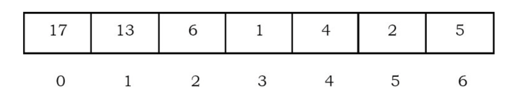
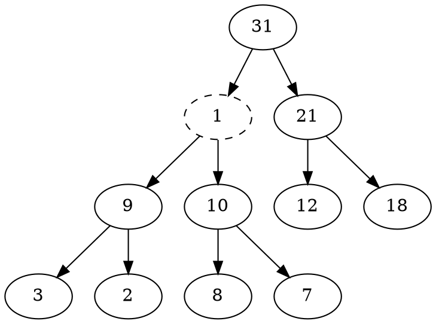
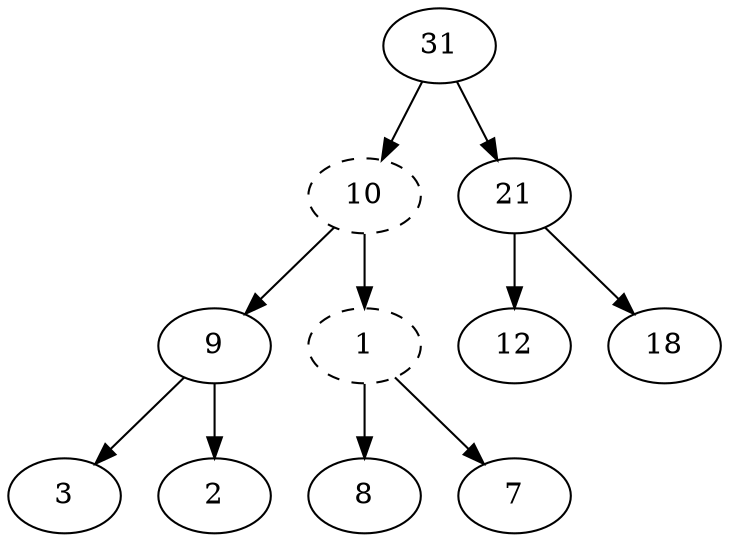
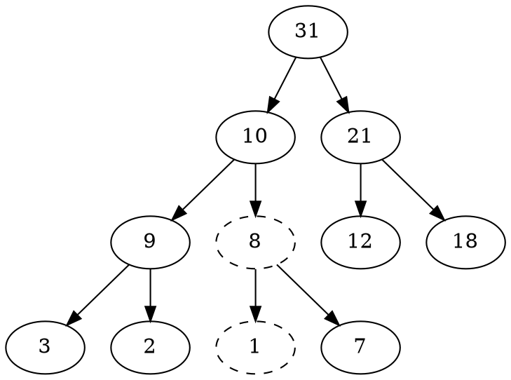

## Introduction

在某些情况下，我们可能需要在一组元素中找到最小/最大的元素。我们可以借助优先队列 ADT 来实现这一点。
优先队列 ADT 是一种支持 Insert（插入）和 DeleteMin（删除并返回最小元素）或 DeleteMax（删除并返回最大元素）操作的数据结构。
这些操作等同于队列的 EnQueue 和 DeQueue 操作。区别在于，在优先队列中，元素进入队列的顺序可能与它们被处理的顺序不同。
优先队列的一个示例应用是作业调度，它基于优先级而不是先来先服务。

如果具有最小键的元素具有最高优先级（即总是删除最小元素），则称为*升序优先队列*。
类似地，如果具有最大键的元素具有最高优先级（总是删除最大元素），则称为*降序优先队列*。
由于这两种类型是对称的，我们将重点讨论其中一种：升序优先队列。

优先队列在实现[*贪心算法*](/docs/CS/Algorithms/Greedy.md)中也很重要，贪心算法通过重复寻找最小值来运作。

## Priority Queue ADT

以下操作使优先队列成为一个 ADT。

**主要优先队列操作**

优先队列是元素的容器，每个元素都有一个关联的键。

- Insert(key, data)：将具有键 key 的数据插入优先队列。元素基于键进行排序。
- DeleteMin/DeleteMax：移除并返回具有最小/最大键的元素。
- GetMinimum/GetMaximum：返回具有最小/最大键的元素但不删除。

**辅助优先队列操作**

- kth – Smallest/kth – Largest：返回优先队列中第 k 小/第 k 大的键。
- Size：返回优先队列中的元素数量。
- Heap Sort：基于优先级（键）对优先队列中的元素进行排序。

## Priority Queue Applications

优先队列有许多应用——下面列出其中一些：

- 数据压缩：哈夫曼编码算法
- 最短路径算法：Dijkstra 算法
- 最小生成树算法：Prim 算法
- 事件驱动模拟：排队等待的客户
- 选择问题：查找第 k 小的元素

## Priority Queue Implementations

在讨论实际实现之前，让我们先列举可能的选项。

无序数组实现
元素插入数组时不考虑顺序。删除（DeleteMax）通过搜索键然后删除来执行。
插入复杂度：O(1)。DeleteMin 复杂度：O(n)。

无序链表实现
与数组实现非常相似，但使用链表而不是数组。插入复杂度：O(1)。DeleteMin 复杂度：O(n)。

有序数组实现
元素基于键字段按排序顺序插入数组。删除仅在一端进行。
插入复杂度：O(n)。DeleteMin 复杂度：O(1)。

有序链表实现
元素基于键字段按排序顺序插入链表。删除仅在一端进行，从而保持优先队列的状态。所有其他与链表 ADT 相关的功能无需修改即可执行。
插入复杂度：O(n)。DeleteMin 复杂度：O(1)。

二叉搜索树实现
如果插入是随机的，插入和删除平均都需要 O(logn)（参见树章节）。

平衡二叉搜索树实现
插入和删除在最坏情况下都需要 O(logn)（参见树章节）。

二叉堆实现
在后续章节中我们将详细讨论这一点。目前，假设二叉堆实现为搜索、插入和删除提供 O(logn) 的复杂度，为查找最大或最小元素提供 O(1) 的复杂度。

实现对比

| Implementation               | Insertion       | Deletion(DeleteMax) | Find Min        |
| ---------------------------- | --------------- | ------------------- | --------------- |
| Unordered Array              | 1               | n                   | n               |
| Unordered List               | 1               | n                   | n               |
| Ordered Array                | n               | 1                   | 1               |
| Ordered List                 | n               | 1                   | 1               |
| Binary Search Trees          | $logn(average)$ | $logn(average)$     | $logn(average)$ |
| Balanced Binary Search Trees | $logn$          | $logn$              | $logn$          |
| Binary Heap                  | $logn$          | $logn$              | 1               |

## Heaps and Binary Heaps

堆是一种具有某些特殊属性的树。
堆的基本要求是节点的值必须 ≥（或 ≤）其子节点的值。
这称为堆属性。
堆还有一个额外属性，即所有叶子节点应位于 h 或 h-1 层（其中 h 是树的高度），对于某个 h > 0（完全二叉树）。
这意味着堆应形成一棵完全二叉树。

基于堆的属性，我们可以将堆分为两种类型：

- **最小堆：** 节点的值必须小于或等于其子节点的值
- **最大堆：** 节点的值必须大于或等于其子节点的值

### Binary Heaps

在二叉堆中，每个节点最多可以有两个子节点。在实践中，二叉堆就足够了，我们将重点讨论二叉最小堆和二叉最大堆。

**堆的表示：**
在查看堆操作之前，让我们看看堆如何表示。一种可能性是使用数组。
由于堆形成完全二叉树，不会有空间的浪费。
对于下面的讨论，假设元素存储在从索引 0 开始的数组中。之前的最大堆可以表示为：

#### Heapifying

向堆中插入元素后，它可能不满足堆属性。
在这种情况下，我们需要调整堆的位置，使其再次成为堆。
这个过程称为 heapifying。
在最大堆中，要 heapify 一个元素，我们必须找到其子节点中的最大值，并与当前元素交换，然后继续这个过程，直到每个节点都满足堆属性。

观察：堆的一个重要属性是，如果一个元素不满足堆属性，那么从该元素到根的所有元素都会有同样的问题。
在下面的例子中，元素 1 不满足堆属性，其父节点 31 也有问题。
类似地，如果我们 heapify 一个元素，那么从该元素到根的所有元素也会自动满足堆属性。
让我们看一个例子。在上面的堆中，元素 1 不满足堆属性。让我们尝试 heapify 这个元素。

要 heapify 1，找到其子节点中的最大值并与之交换。

我们需要继续这个过程，直到元素满足堆属性。现在，将 1 与 8 交换。

现在树满足堆属性。在上面的 heapify 过程中，由于我们是从上到下移动，这个过程有时称为 percolate down（向下渗透）。
类似地，如果我们从任何其他节点到根开始 heapify，我们可以称该过程为 percolate up（向上渗透），因为是从下到上移动。

##### Deleting an Element

要从堆中删除元素，我们只需要删除根元素。
这是标准堆支持的唯一操作（最大元素）。
删除根元素后，复制堆（树）的最后一个元素并删除该最后一个元素。

替换最后一个元素后，树可能不满足堆属性。为了使其再次成为堆，调用 PercolateDown 函数。
- 将第一个元素复制到某个变量
- 将最后一个元素复制到第一个元素的位置
- 对第一个元素执行 PercolateDown

时间复杂度：与 Heapify 函数相同，为 O(logn)。

##### Inserting an Element

插入元素类似于 heapify 和删除过程。
- 增加堆大小
- 将新元素放在堆（树）的末尾
- 从底部到顶部（根）heapify 该元素

## HeapSort

堆 ADT 的一个主要应用是排序（堆排序）。
堆排序算法将所有元素（来自未排序数组）插入堆中，然后从堆根中移除它们，直到堆为空。
注意，堆排序可以在待排序数组上就地完成。
不是删除元素，而是将第一个元素（最大）与最后一个元素交换，并减小堆大小（数组大小）。
然后，我们 heapify 第一个元素。继续这个过程，直到剩余元素的数量为 1。

## d-Heaps

二叉堆非常简单，以至于在需要优先队列时几乎总是使用它们。
一个简单的泛化是 *d-heap*，它与二叉堆完全一样，只是所有节点都有 d 个子节点（因此，二叉堆是 2-heap）。

## Leftist Heaps

## Skew Heaps

*Skew heap*（斜堆）是左偏堆的自调整版本，实现起来极其简单。
斜堆与左偏堆的关系类似于伸展树与 AVL 树的关系。
斜堆是具有堆顺序的二叉树，但树上没有结构约束。
与左偏堆不同，不维护任何节点的空路径长度信息。
斜堆的右路径可能在任何时候任意长，因此所有操作的最坏情况运行时间为 *O*(*n*)。
然而，与伸展树一样，可以证明对于任意 m 次连续操作，总的最坏情况运行时间为 *O*(*m* log *n*)。
因此，斜堆每次操作的摊还成本为 *O*(log *n*)。

与左偏堆一样，斜堆的基本操作是合并。

## Binomial Queues

## Summary

标准的二叉堆实现因其简单和快速而优雅。它不需要指针，只需常量级别的额外空间，同时高效地支持优先队列操作。

我们考虑了额外的*合并*操作，并开发了三种实现，每种都有其独特之处。
左偏堆是递归威力的极好示例。斜堆因缺乏平衡标准而成为一种非凡的数据结构。
二项队列展示了如何使用简单的想法来实现良好的时间界。

## Links

- [data structures](/docs/CS/Algorithms/Algorithms.md?id=data-structures)

## References
