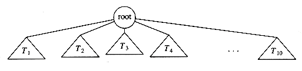
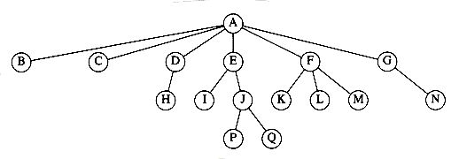

## Introduction

A *tree* can be defined in several ways. One natural way to define a tree is recursively.
A tree is a collection of nodes. The collection can be empty, which is sometimes denoted as A. 
Otherwise, a tree consists of a distinguished node r, called the root, and zero or more (sub)trees T1, T2, . . . , Tk, each of whose roots are connected by a directed edge to r.

The root of each subtree is said to be a child of r, and r is the parent of each subtree root.



From the recursive definition, we find that a tree is a collection of n nodes, one of which is the root, and n - 1 edges. 
That there are n - 1 edges follows from the fact that each edge connects some node to its parent, and every node except the root has one parent.



Each node may have an arbitrary number of children, possibly zero.
- Nodes with no children are known as leaves.
- Nodes with the same parent are siblings.
- Grandparent and grandchild relations can be defined in a similar manner.


> [!NOTE]
> 
> Notice that in a tree there is exactly one path from the root to each node.

For any node ni, the depth of ni is the length of the unique path from the root to ni. 
Thus, the root is at depth 0. The height of ni is the longest path from ni to a leaf. 
Thus all leaves are at height 0. 
The height of a tree is equal to the height of the root.
The depth of a tree is equal to the depth of the deepest leaf; this is always equal to the height of the tree.

If there is a path from n1 to n2, then n1 is an ancestor of n2 and n2 is a descendant of n1. 
If n1 != n2, then n1 is a proper ancestor of n2 and n2 is a proper descendant of n1.

## Implementation

The typical declaration: keep the children of each node in a linked list of tree nodes.

```c
typedef struct tree_node *tree_ptr;

struct tree_node
{
    element_type element;
    tree_ptr first_child;
    tree_ptr next_sibling;
};
```

### Tree Traversals
> [!NOTE]
> 
> The UNIX file system is not a tree, but is treelike.


- In a preorder traversal, work at a node is performed before (pre) its children are processed.
- In a postorder traversal, the work at a node is performed after (post) its children are evaluated.
 
## Binary Trees

A binary tree is a tree in which no node can have more than two children.


## Links
- [data structures](/docs/CS/Algorithms/Algorithms.md?id=data-structures)