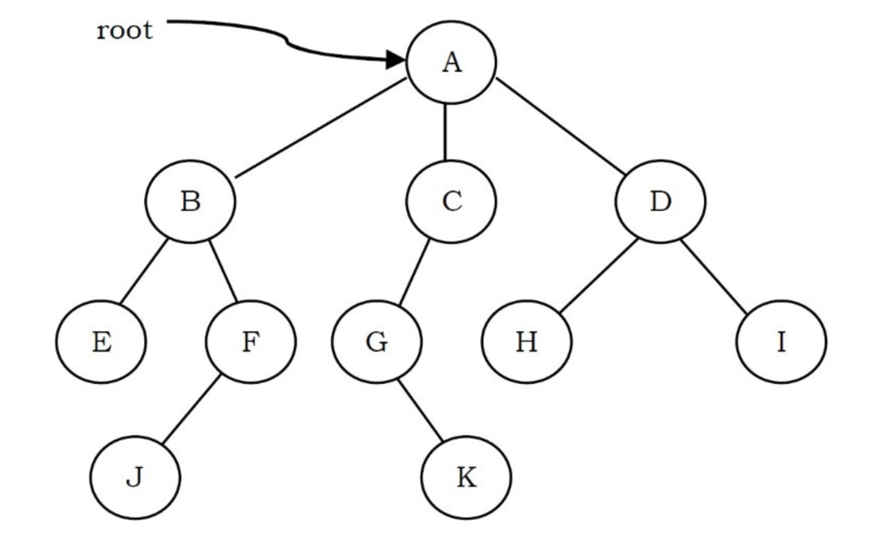
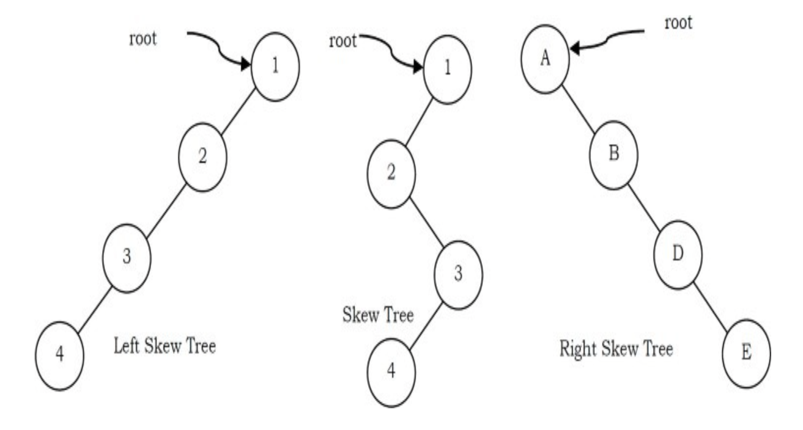
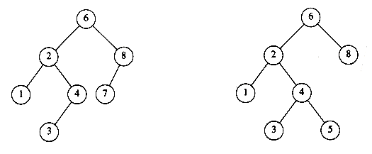

## Introduction

A tree is a data structure similar to a linked list but instead of each node pointing simply to the next node in a linear fashion, each node points to a number of nodes. Tree is an example of non- linear data structures. A tree structure is a way of representing the hierarchical nature of a structure in a graphical form.
In trees ADT (Abstract Data Type), the order of the elements is not important. If we need ordering information, linear data structures like linked lists, stacks, queues, etc. can be used.

<div style="text-align: center;">



</div>

- The root of a tree is the node with no parents. There can be at most one root node in a tree (node A in the above example).
- An edge refers to the link from parent to child (all links in the figure).
- A node with no children is called leaf node (E,J, K, H and I).
- Children of same parent are called siblings (B, C, D are siblings of A, and E, F are the siblings of B).
- A node p is an ancestor of node q if there exists a path from root to q and p appears on the
  path. The node q is called a descendant of p. For example, A, C and G are the ancestors of K.
- The depth of a node is the length of the path from the root to the node(depth of G is 2,A– C – G).
- The height of a node is the length of the path from that node to the deepest node. The height of a tree is the length of the path from the root to the deepest node in the tree. 
  A (rooted) tree with only one node (the root) has a height of zero. In the previous example, the height of B is 2 (B – F – J).
- Height of the tree is the maximum height among all the nodes in the tree and depth of the tree is the maximum depth among all the nodes in the tree. For a given tree, depth and height returns the same value. But for individual nodes we may get different results.
- The size of a node is the number of descendants it has including itself (the size of the subtree C is 3).
- The set of all nodes at a given depth is called the level of the tree (B, C and D are at the same level). The root node is at level zero.


- The root of a tree is the node with no parents. There can be at most one root node in a tree (node A in the above example).
- An edge refers to the link from parent to child (all links in the figure).
- A node with no children is called leaf node (E,J, K, H and I).
- Children of same parent are called siblings (B, C, D are siblings of A, and E, F are the
  siblings of B).
- A node p is an ancestor of node q if there exists a path from root to q and p appears on the path. The node q is called a descendant of p. For example, A, C and G are the ancestors of K.
- The depth of a node is the length of the path from the root to the node(depth of G is 2,A– C – G).
- The height of a node is the length of the path from that node to the deepest node. The height
  of a tree is the length of the path from the root to the deepest node in the tree. A (rooted) tree with only one node (the root) has a height of zero. In the previous example, the height of B is 2 (B – F – J).
- Height of the tree is the maximum height among all the nodes in the tree and depth of the tree is the maximum depth among all the nodes in the tree. For a given tree, depth and height returns the same value. But for individual nodes we may get different results.
- The size of a node is the number of descendants it has including itself (the size of the subtree C is 3).
- The set of all nodes at a given depth is called the level of the tree (B, C and D are at the same level). The root node is at level zero.If every node in a tree has only one child (except leaf nodes) then we call such trees skew trees. If every node has only left child then we call them left skew trees. Similarly, if every node has only right child then we call them right skew trees.

<div style="text-align: center;">



</div>

> [!NOTE]
>
> Notice that in a tree there is exactly one path from the root to each node.


> [!NOTE]
>
> Notice that in a tree there is exactly one path from the root to each node.For any node ni, the depth of ni is the length of the unique path from the root to ni.
Thus, the root is at depth 0. The height of ni is the longest path from ni to a leaf.
Thus all leaves are at height 0.
The height of a tree is equal to the height of the root.
The depth of a tree is equal to the depth of the deepest leaf; this is always equal to the height of the tree.

If there is a path from n1 to n2, then n1 is an ancestor of n2 and n2 is a descendant of n1.
If n1 != n2, then n1 is a proper ancestor of n2 and n2 is a proper descendant of n1.

## Implementation

The typical declaration: keep the children of each node in a linked list of tree nodes.

```c
typedef struct tree_node *tree_ptr;

struct tree_node
{
    element_type element;
    tree_ptr first_child;
    tree_ptr next_sibling;
};
```

## Tree Traversals

> [!NOTE]
>
> The UNIX file system is not a tree, but is treelike.

- In a preorder traversal, work at a node is performed before (pre) its children are processed.
- In a postorder traversal, the work at a node is performed after (post) its children are evaluated.

## Binary Trees

A tree is called binary tree if each node has zero child, one child or two children. Empty tree is also a valid binary tree.
We can visualize a binary tree as consisting of a root and two disjoint binary trees, called the left and right subtrees of the root.

Strict Binary Tree: A binary tree is called strict binary tree if each node has exactly two children or no children.

Full Binary Tree: A binary tree is called full binary tree if each node has exactly two children and all leaf nodes are at the same level.

Complete Binary Tree: Before defining the complete binary tree, let us assume that the height of the binary tree is h.
In complete binary trees, if we give numbering for the nodes by starting at the root (let us say the root node has 1) then we get a complete sequence from 1 to the number of nodes in the tree.
While traversing we should give numbering for NULL pointers also.
A binary tree is called complete binary tree if all leaf nodes are at height h or h – 1 and also without any missing number in the sequence

### Applications of Binary Trees

Following are the some of the applications where binary trees play an important role:

- Expression trees are used in compilers.
- Huffman coding trees that are used in data compression algorithms.
- Binary Search Tree (BST), which supports search, insertion and deletion on a
  collection of items in O(logn) (average).
- Priority Queue (PQ), which supports search and deletion of minimum (or maximum)
  on a collection of items in logarithmic time (in worst case).

### Operations on Binary Trees

Basic Operations

- Inserting an element into a tree
- Deleting an element from a tree
- Searching for an element
- Traversing the tree

Auxiliary Operations

- Finding the size of the tree
- Finding the height of the tree
- Finding the level which has maximum sum
- Finding the least common ancestor (LCA) for a given pair of nodes, and many more.

### Implementation

Because a binary tree has at most two children, we can keep direct pointers to them.
The declaration of tree nodes is similar in structure to that for doubly linked lists, in that a node is a structure consisting of the *key* information plus two pointers (*left* and  *right* ) to other nodes.

```c
typedef struct tree_node *tree_ptr;
struct tree_node

{
    element_type element;
    tree_ptr left;
    tree_ptr right;

};

typedef tree_ptr TREE;
```

We could draw the binary trees using the rectangular boxes that are customary for linked lists, but trees are generally drawn as circles connected by lines, because they are actually graphs. We also do not explicitly draw *NULL* pointers when referring to trees, because every binary tree with *n* nodes would require *n + *1* NULL* pointers.

This general strattegy ( left, node, right ) is known as an *inorder* traversal.

Full binary  Tree

Complete Binary Tree

Heap

### Binary Search Tree (BSTs)

An important application of binary trees is their use in searching.

The property that makes a binary tree into a binary search tree is that for every node,  *X* ,
in the tree, the values of all the keys in the left subtree are smaller than the key value in  *X* , and the values of all the keys in the right subtree are larger than the key value in  *X* .
Notice that this implies that all the elements in the tree can be ordered in some consistent manner.

In below figure, the tree on the left is a binary search tree, but the tree on the right is not.
The tree on the right has a node with key 7 in the left subtree of a node with key 6 (which happens to be the root).

<div style="text-align: center;">


</div>

Because the average depth of a binary search tree is $O(\log{n})$, we generally do not need to worry about running out of stack space.


Because the average depth of a binary search tree is $O(\log{n})$, we generally do not need to worry about running out of stack space.The average depth over all nodes in a tree is $O(\log{n})$, on the assumption that all trees are equally likely.

The sum of the depths of all nodes in a tree is known as the  *internal path length* .

If the input comes into a tree presorted, then a series of *inserts* will take quadratic time and give a very expensive implementation of a linked list, since the tree will consist only of nodes with no left children. One solution to the problem is to insist on an extra structural condition called *balance:* no node is allowed to get too deep.

### Binary Tree Traversals

Tree traversal is like searching the tree, except that in traversal the goal is to move through the tree in a particular order. In addition, all nodes are processed in the traversal but searching stops when the required node is found.

#### Traversal Possibilities

Starting at the root of a binary tree, there are three main steps that can be performed and the order in which they are performed defines the traversal type.
These steps are: performing an action on the current node (referred to as “visiting” the node and denoted with “D”), traversing to the left child node (denoted with “L”), and traversing to the right child node (denoted with “R”).
This process can be easily described through recursion. Based on the above definition there are 6 possibilities:

1. LDR: Process left subtree, process the current node data and then process right subtree
2. LRD: Process left subtree, process right subtree and then process the current node data
3. DLR: Process the current node data, process left subtree and then process right subtree
4. DRL: Process the current node data, process right subtree and then process left subtree
5. RDL: Process right subtree, process the current node data and then process left subtree
6. RLD: Process right subtree, process left subtree and then process the current node data

Classifying the Traversals

The sequence in which these entities (nodes) are processed defines a particular traversal method.
The classification is based on the order in which current node is processed.
That means, if we are classifying based on current node (D) and if D comes in the middle then it does not matter whether L is on left side of D or R is on left side of D. Similarly, it does not matter whether L is
on right side of D or R is on right side of D.
Due to this, the total 6 possibilities are reduced to 3 and these are:

- Preorder (DLR) Traversal
- Inorder (LDR) Traversal
- Postorder (LRD) Traversal

There is another traversal method which does not depend on the above orders and it is:

- Level Order Traversal: This method is inspired from Breadth First Traversal (BFS of Graph algorithms).

## Generic Trees (N-ary Trees)

## Red-Black Trees

## AVL Trees

An AVL (Adelson-Velskii and Landis) tree is a binary search tree with a *balance* condition.
The balance condition must be easy to maintain, and it ensures that the depth of the tree is  $O(\log{n})$.
The simplest idea is to require that the left and right subtrees have the same height.

An AVL tree is identical to a binary search tree, except that for every node in the tree, the height of the left and right subtrees can differ by at most 1.
(The height of an empty tree is defined to be -1.)

In below figure the tree on the left is an AVL tree, but the tree on the right is not.



### Single Rotation

### Double Rotation

## Splay Trees

We now describe a relatively simple data structure, known as a  *splay tree* , that guarantees that any *m* consecutive tree operations take at most  $O(m\log{n})$ time.

Although this guarantee does not preclude the possibility that any *single* operation might take  $O(n)$ time,
and thus the bound is not as strong as an  $O(\log{n})$ worst-case bound per operation,
the net effect is the same: There are no bad input sequences.
Generally, when a sequence of *m* operations has total worst-case running time of  $O(mf(n))$, we say that the *amortized* running time is  *O* ( *f* ( *n* )).
Thus, a splay tree has  $O(\log{n})$ amortized cost per operation. Over a long sequence of operations, some may take more, some less.

Splay trees are based on the fact that the  $O(n)$ worst-case time per operation for binary search trees is not bad, as long at it occurs relatively infrequently.
Any one access, even if it takes  $O(n)$, is still likely to be extremely fast.
The problem with binary search trees is that it is possible, and not uncommon, for a whole sequence of bad accesses to take place.
The cumulative running time then becomes noticeable.
A search tree data structure with  $O(n)$ worst-case time, but a *guarantee* of at most  $O(m\log{n})$ for any *m* consecutive operations, is certainly satisfactory, because there are no bad sequences.

If any particular operation is allowed to have an  $O(n)$ worst-case time bound, and we still want an  $O(\log{n})$ amortized time bound, then it is clear that **whenever a node is accessed, it must be moved**.
Otherwise, once we find a deep node, we could keep performing *finds* on it.
If the node does not change location, and each access costs  $O(n)$, then a sequence of *m* accesses will cost $O(M*N)$.

The basic idea of the splay tree is that after a node is accessed, it is pushed to the root by a series of AVL tree rotations.
Notice that if a node is deep, there are many nodes on the path that are also relatively deep, and by restructuring we can make future accesses cheaper on all these nodes.
Thus, if the node is unduly deep, then we want this restructuring to have the side effect of balancing the tree (to some extent).
Besides giving a good time bound in theory, this method is likely to have practical utility, because in many applications when a node is accessed, it is likely to be accessed again in the near future.
Studies have shown that this happens much more often than one would expect.
Splay trees also do not require the maintenance of height or balance information, thus saving space and simplifying the code to some extent (especially when careful implementations are written).

### Traversals

In a level-order traveresal, all nodes at depth d are processed before any node at depth d + 1.
Level-order traversal differs from the other traversals in that it is not done recursively; a queue is used, instead of the implied stack of recursion.

## B-Trees

A [B-tree](/docs/CS/Algorithms/B-tree.md) of order m is a tree with the following structural properties:

- The root is either a leaf or has between 2 and m children.
- All nonleaf nodes (except the root) have between m/2 and m children.
- All leaves are at the same depth.

All data is stored at the leaves.
Contained in each interior node are pointers p1, p2, . . . , pm to the children, and values k1, k2, . . . , km - 1, representing the smallest key found in the subtrees p2, p3, . . . , pm respectively.
Of course, some of these pointers might be NULL, and the corresponding ki would then be undefined. For every node, all the keys in subtree p1 are smaller than the keys in subtree p2, and so on.
The leaves contain all the actual data, which is either the keys themselves or pointers to records containing the keys. We will assume the former to keep our examples simple.
There are various definitions of B-trees that change this structure in mostly minor ways, but this definition is one of the popular forms.
We will also insist (for now) that the number of keys in a leaf is also between m/2 and m.

A B-tree of order 4 is more popularly known as a 2-3-4 tree, and a B-tree of order 3 is known as a 2-3 tree.

With general B-trees of order m, when a key is inserted, the only difficulty arises when the node that is to accept the key already has m keys.
This key gives the node m + 1 keys, which we can split into two nodes with  (m + 1) / 2  and  (m + 1) / 2  keys respectively.
As this gives the parent an extra node, we have to check whether this node can be accepted by the parent and split the parent if it already has m children.
We repeat this until we find a parent with less than m children. If we split the root, we create a new root with two children.

The depth of a B-tree is at most $\log_{[M/2]}{N}$.

The real use of B-trees lies in database systems, where the tree is kept on a physical disk instead of main memory.
Accessing a disk is typically several orders of magnitude slower than any main memory operation.
If we use a B-tree of order m, then the number of disk accesses is O(logm n).
Although each disk access carries the overhead of O(log m) to determine the direction to branch, the time to perform this computation is typically much smaller than the time to read a block of memory and can thus be considered inconsequential (as long as m is chosen reasonably).
Even if updates are performed and O(m) computing time is required at each node, this too is generally not significant.
The value of m is then chosen to be the largest value that still allows an interior node to fit into one disk block, and is typically in the range 32  m  256.
The maximum number of elements that are stored in a leaf is chosen so that if the leaf is full, it fits in one block.
This means that a record can always be found in very few disk accesses, since a typical B-tree will have a depth of only 2 or 3, and the root (and possibly the first level) can be kept in main memory.

Analysis suggests that a B-tree will be ln 2 = 69 percent full.
Better space utilization can be obtained if, instead of always splitting a node when the tree obtains its (m + 1)th entry, the routine searches for a sibling that can take the extra child.

## LSM-trees

The [LSM-tree](/docs/CS/Algorithms/LSM.md) uses an algorithm that defers and batches index changes, migrating the changes out to disk in a particularly efficient way reminiscent of merge sort.

## Summary

We have seen uses of trees in operating systems, compiler design, and searching.
Expression trees are a small example of a more general structure known as a parse tree, which is a central data structure in compiler design.
Parse trees are not binary, but are relatively simple extensions of expression trees (although the algorithms to build them are not quite so simple).

Search trees are of great importance in algorithm design.
They support almost all the useful operations, and the logarithmic average cost is very small.
The problem with search trees is that their performance depends heavily on the input being random.
If this is not the case, the running time increases significantly, to the point where search trees become expensive linked lists.

We saw several ways to deal with this problem.
AVL trees work by insisting that all nodes' left and right subtrees differ in heights by at most one.
This ensures that the tree cannot get too deep.
The operations that do not change the tree, as insertion does, can all use the standard binary search tree code.
Operations that change the tree must restore the tree. This can be somewhat complicated, especially in the case of deletion.
We showed how to restore the tree after insertions in O(log n) time.

We also examined the splay tree.
Nodes in splay trees can get arbitrarily deep, but after every access the tree is adjusted in a somewhat mysterious manner.
The net effect is that any sequence of m operations takes O(m log n) time, which is the same as a balanced tree would take.

B-trees are balanced m-way (as opposed to 2-way or binary) trees, which are well suited for disks; a special case is the 2-3 tree, which is another common method of implementing balanced search trees.

In practice, the running time of all the balanced tree schemes is worse (by a constant factor) than the simple binary search tree,
but this is generally acceptable in view of the protection being given against easily obtained worst-case input.

> [!NOTE]
>
> A final note: By inserting elements into a search tree and then performing an inorder traversal, we obtain the elements in sorted order.
> This gives an $O(n\log{n})$ algorithm to sort, which is a worst-case bound if any sophisticated search tree is used.

## Links

- [data structures](/docs/CS/Algorithms/Algorithms.md?id=data-structures)
