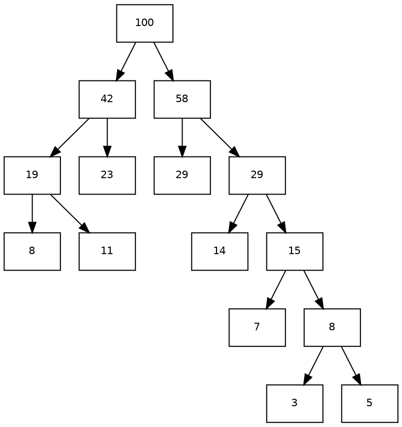

## Introduction

哈夫曼树 是一种最优树,是一类带权路径长度最短的二叉树,通过哈夫曼算法可以构建一棵哈夫曼树,利用哈夫曼树可以构造一种不等长的二进制编码,并且构造所得的哈夫曼编码是一种最优前缀码.

通俗来讲 : n 个带权节点均作为叶子节点,构造出的一棵带权路径长度最短的二叉树,则把这棵树称为"哈夫曼树" 、“赫夫曼树” 、“最佳判定树” 或者 “最优二叉树” .

### 带权路径长度 WPL

给定 $n$ 个带权叶子（权值通常取符号出现频率，或压缩后的预估概率），权值为 $w_i$，$d_i$ 为该叶子到根的路径长度（根的深度记为 0，故叶子深度即路径上的边数）。定义树的带权路径长度：

$$WPL(T) = \sum_{i=1}^{n} w_i \, d_i$$

$WPL$ 也就是这棵树编码后的**带权编码总长度**：把每个叶子权值看作其出现次数，$w_i \cdot d_i$ 恰是该符号在全文中占用的总比特数。

哈夫曼树的定义性结论是：**在所有以这 $n$ 个权值为叶子的二叉树中，$WPL$ 最小的那一棵即哈夫曼树**。注意最优性只在"给定叶子集合与固定叶子权值"的前提下成立 —— 树的形状（哪些叶子在哪层）由算法决定，权值本身不能改。

以经典 Quicksort 频率表 $\{5, 29, 7, 8, 14, 23, 3, 11\}$（合计 100）为例，算得最优 $WPL = 271$，即这 100 个符号编出来的总比特数。作为对照，这组权值的香农熵为 $H \approx 2.681$ 比特/符号，下界 $100H \approx 268.1$比特 —— 哈夫曼编码距信息论下界只差约 3 比特，这也解释了它为何实践中足够好（尽管不是最优）。

### 构造算法

核心是**自底向上合并**：把每棵子树看成一个整体，其权值为子树内所有叶子权值之和。

用小顶堆维护当前所有子树，每轮取出权值最小的两棵，合并成一棵新子树，其新根权值为二者之和。$n$ 个叶子经过 $n-1$ 次合并后只剩一棵树，即为哈夫曼树。

```text
Huffman(weights):
    Q ← 小顶堆，堆中每个元素是一棵只有一个节点的子树
    while Q.size() > 1:
        a ← Q.extractMin()      # 权值最小的子树
        b ← Q.extractMin()      # 次小的子树
        Q.insert(Node(val = a.val + b.val, left = a, right = b))
    return Q.extractMin()        # 唯一的根，即哈夫曼树
```

仍以上面那组权值为例，7 次合并依次是 $(3,5)\to8$、$(7,8)\to15$、$(8,11)\to19$、$(14,15)\to29$、$(19,23)\to42$、$(29,29)\to58$、$(42,58)\to100$，得到：



实现上每轮 `extractMin` 两次、`insert` 一次，共 $O(n \log n)$；若权值已排序，可以退化成一次线性扫描加队列的 $O(n)$ 做法，这也是 Huffman 编码能在线流式建表的原因。

### 正确性

贪心策略是「**权值最小的两个叶子，一定互为最深兄弟**」。它由交换论证（exchange argument）支撑。

设某棵最优树 $T$。在所有叶子中取最深的一对兄弟叶子 $x, y$（$T$ 是满二叉树，最深处的叶子其兄弟必为叶子，否则深度还更大）。令 $w_1 \le w_2$ 是全部叶子中最小的两个权值。

- 若 $x, y$ 的权值都不小于 $w_1, w_2$，可以证明不必交换：把更小的权值放到更深的位子上，$WPL$ 只会不变或变小，故存在一棵最优树使 $w_1$ 落在最深的一对兄弟位上。
- 具体地，交换两个叶子的位置时 $WPL$ 的变化为 $(w_a - w_b)(d_b - d_a)$。要**不增大** $WPL$，就必须让更小的权值配更深的深度；因为 $T$ 已最优，交换不能变好，因此可以选取一组交换使 $w_1$ 占据最深兄弟位之一。剩下 $w_2$ 同理占据另一个（可再交换一次，且保持最优）。

于是存在一棵最优树使 $w_1, w_2$ 互为兄弟。把这两个兄弟**收缩成一个叶子**，权值为 $w_1 + w_2$，就得到一个规模为 $n-1$ 的同类问题。

关键在于收缩不损失最优性：设收缩后的最优子问题的最小 $WPL$ 为 $WPL'$，则

$$WPL' + (w_1 + w_2) = WPL(T)$$

而任何 $n$ 叶子树都能唯一地拆成「$w_1,w_2$ 兄弟」的形式吗？不能 —— 但我们不需要任何树都能拆，只需要**存在一个最优树能拆**（上面已证）。这就完成了归约：对 $n-1$ 个（合并后的）权值递归求最优树，再把叶子展开回两片，即得 $n$ 叶子的最优树。

归纳法即得算法正确。另有一条更工程化的等价理解：每轮合并时，被合并的子树中每个叶子的深度都 +1，对 $WPL$ 的增量恰好等于两棵子树的权值之和，于是

$$WPL = \sum_{\text{每轮合并}} (\text{本次合并的两个权值之和})$$

这也解释了为什么"每次合并最小的两个"是对的 —— 它直接最小化了上面这个求和，而交换论证保证最优树一定在贪心选择的分支上。

### 哈夫曼编码

约定左分支记 `0`、右分支记 `1`，则从根到某个叶子的路径上的边标号序列，就是该叶子上符号的**码字**。

**前缀码性质（为什么不需要分隔符）**：任取两个不同的叶子 $u, v$，设 $p$ 是它们的最近公共祖先。到达 $u$ 和 $v$ 的路径必然在 $p$ 处一分两叉，一个走左、一个走右，因此 $u$ 与 $v$ 的码字在对应 $p$ 的那一位上取值不同（一个是 `0` 一个是 `1`）。两者在这个位置之前完全一致、之后分道扬镳，所以谁也不可能成为谁的**前缀**。这正是前缀码（prefix code / instantaneous code）：解码器可以从左往右读，读到一个叶子就立即确定符号，无需额外的分隔符或码长表。

**为什么是最优前缀码**：把每个符号的码长 $d_i$ 与其出现频率 $f_i$ 相乘求和，得到的期望码长正比于前面定义的 $WPL$：

$$L = \frac{1}{|S|}\sum_{i=1}^{n} f_i \, d_i = \frac{WPL(T)}{|S|}$$

所以"最小化期望码长"与"最小化 $WPL$"是同一个问题。哈夫曼树给出 $WPL$ 最小的树，因此其导出的前缀码在**逐符号编码**这一类方法中最优（给定符号字母表）。

需要注意的边界：只有一个符号时 $n=1$，构造算法的循环体一次都不执行，码字长度为 0，这在数学上成立（该符号无需编码）但不是合法码表，实现上通常要特殊处理为 1 位。

### 限制与变体

**k 叉哈夫曼树**：每个内部节点有 $k$ 个孩子（对应 $k$ 元字母表）。要使树恰好长满且叶子数为 $n$，需要满足 $(n-1) \bmod (k-1) = 0$；不满足时补若干个**权值为 0 的虚拟叶子**把数量凑齐（虚拟叶子不影响 $WPL$）。注意 $k$ 不能取得太大：当 $k$ 大到接近甚至超过 $n$ 时，退化成一条链，每个叶子都极深，$WPL$ 急剧变大，完全失去压缩收益。实用中 $k$ 取 2（位流）或 4（半字节打包）最常见。

**限制码长（length-limited coding）**：哈夫曼树不保证最大码长有界，某些情况下码长会退化得很长。限制最大码长为 $L$ 的最优前缀码问题是 NP-难的，实用解法是 **Package-Merge 算法**（$O(nL)$）。

**与算术编码的关系**：哈夫曼编码在"逐符号、每次对齐到整数比特"的框架内最优，因此短符号多时浪费明显；**算术编码**与 **ANS（Asymmetric Numeral Systems）** 直接在符号的概率分布上编码、不做比特对齐，能突破这个上限，压缩率往往更高。哈夫曼树在其中仍可作为符号概率估计的入口。

### 应用与工程落点

- **JPEG**：基线流程中量化系数经游程编码后，接的就是哈夫曼编码，见 [JPEG](/docs/CS/Algorithms/JPEG.md) 的 Pipeline 一节。
- **DEFLATE（zlib / gzip / PNG）**：LZ77 之后接熵编码，deflate 同时支持**固定哈夫曼表**（静态表，随标准写死，省空间）与**动态哈夫曼表**（把码表本身也压一遍，代价是额外头信息）两种模式，按数据块的可压缩性择优使用。PNG 的 IDAT 数据块即 `滤波输出 + Deflate`。
- **HTTP 内容编码协商**：客户端在 `Accept-Encoding` 中声明可接受的 `gzip` / `deflate` / `br`，服务端据此选择编码，属于典型的"按内容分布选择编码方案"。
- **通用压缩格式**：许多格式的表头都带一张内嵌的静态哈夫曼表（如 PNG 的 zlib/deflate 固定树），本质是"表随格式定死，数据不压缩表"。

按熵编码在压缩管线中的位置，可回看 [Algorithms](/docs/CS/Algorithms/Algorithms.md) 的 Compression Algorithms 一节。

## Links

- [Tree](/docs/CS/Algorithms/tree/tree.md)
- [heap](/docs/CS/Algorithms/struct/heap.md)
- [Compress](/docs/CS/compress/Compress.md)

## References

1. [Huffman coding - Wikipedia](https://en.wikipedia.org/wiki/Huffman_coding)
2. [堆简介 - OI Wiki](https://oi-wiki.org/ds/heap/)

