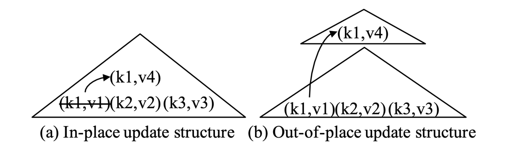
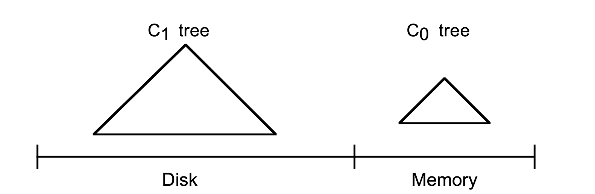
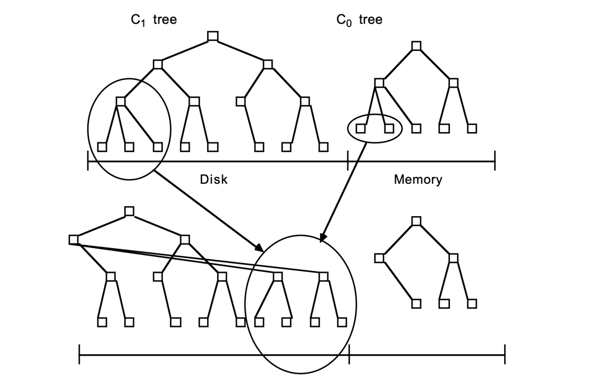
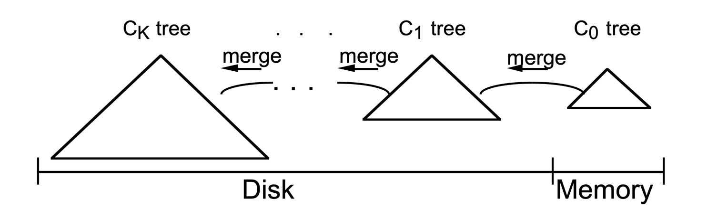
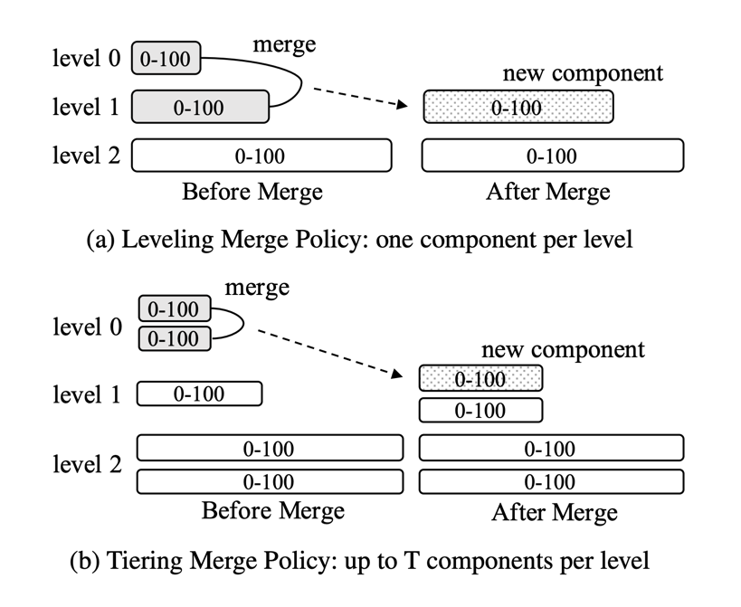
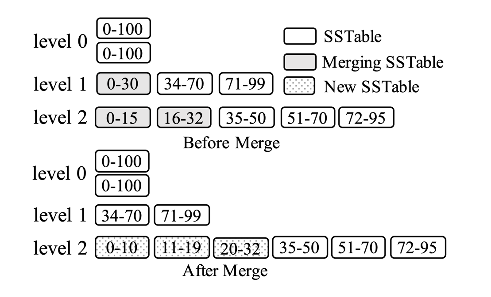
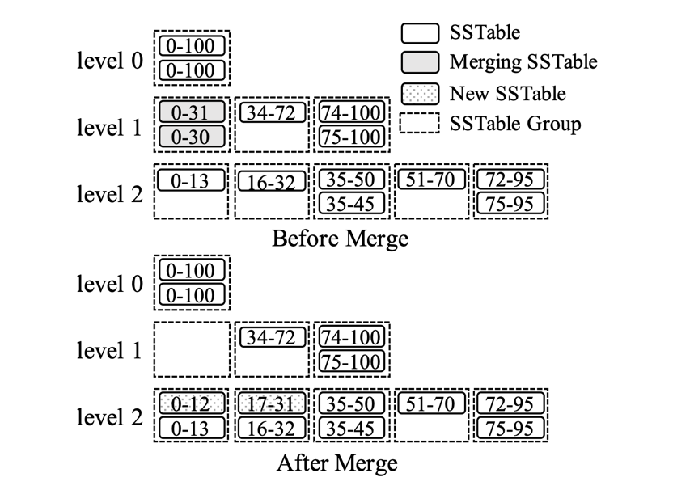
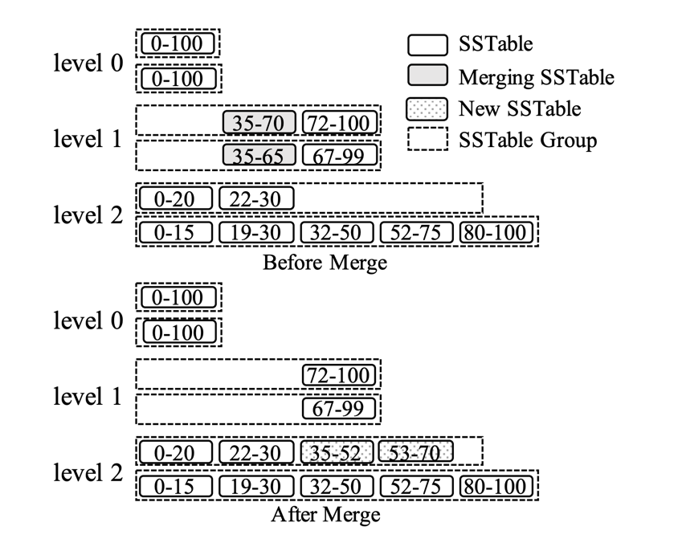
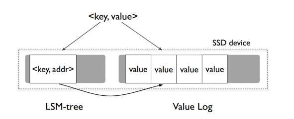
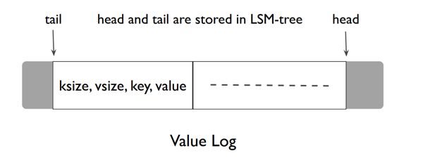

## Introduction

日志结构合并树（LSM-tree）已被广泛应用于现代 NoSQL 系统的存储层，
包括 [BigTable](/docs/CS/Distributed/Bigtable.md)、[Dynamo](/docs/CS/Distributed/Dynamo.md)、[HBase](/docs/CS/DB/HBase.md)、[Cassandra](/docs/CS/DB/Cassandra.md)、[LevelDB](/docs/CS/DB/LevelDB/LevelDB.md)、[RocksDB](/docs/CS/DB/RocksDB/RocksDB.md) 和 AsterixDB。

日志结构合并树（LSM-tree）是一种基于磁盘的数据结构，旨在为长时间内经历高频率记录插入（和删除）的文件提供低成本的索引。
LSM-tree 使用一种算法来延迟和批量处理索引更改，以一种类似于归并排序的高效方式，将更改从基于内存的组件级联到一个或多个磁盘组件。
在此过程中，所有索引值都可以通过内存组件或某个磁盘组件持续可检索（除非常短的锁定期间外）。
与采用就地更新的传统索引结构不同，LSM-tree 首先将所有写入缓冲在内存中，随后将其刷新到磁盘并使用顺序 I/O 进行合并，
在传统访问方法的插入操作中磁盘臂成本超过存储介质成本的领域中，将提高成本性能。

这种设计带来了许多优势，包括卓越的写入性能、高空间利用率、可调性以及简化的并发控制和恢复。
这些优势使 LSM-tree 能够服务于各种工作负载。
然而，需要即时响应的索引查找在某些情况下会失去 I/O 效率，因此 LSM-tree 在插入操作比检索条目的查找操作更常见的应用中最为有用。

> [!NOTE]
> LSM 树写入不可变文件，并随着时间的推移将它们合并。这些文件通常包含自己的索引，以帮助读取者高效定位数据。尽管 LSM 树通常被呈现为 B 树的替代品，但 B 树常被用作 LSM 树不可变文件的内部索引结构。

## Basics

通常，索引结构可以选择两种策略之一来处理更新，即*就地更新*和*异地更新*。

**就地更新**结构（如 B+ 树）直接覆盖旧记录以存储新更新。
例如在图 1a 中，要将键 k1 关联的值从 v1 更新为 v4，索引条目 `(k1, v1)` 被直接修改以应用此更新。
这些结构通常针对读取进行了优化，因为只存储每条记录的最新版本。
然而，这种设计牺牲了写入性能，因为更新会产生随机 I/O。
此外，索引页面可能因更新和删除而碎片化，从而降低空间利用率。

相比之下，**异地更新**结构（如 LSM-tree）始终将更新存储到新位置，而不是直接覆盖旧条目。
例如在图 1b 中，更新 `(k1, v4)` 被存储到新位置，而不是直接更新旧条目 `(k1, v1)`。
这种设计提高了写入性能，因为它可以利用顺序 I/O 来处理写入。
它还可以通过不覆盖旧数据来简化恢复过程。
然而，这种设计的主要问题是读取性能被牺牲，因为一条记录可能存储在多个位置中的任何一个。
此外，这些结构通常需要单独的数据重组过程来持续提高存储和查询效率。

Fig.1. 就地更新和异地更新结构的示例：每个条目包含一个键（记为"k"）和一个值（记为"v"）

## Components

LSM-tree 由两个或多个类似树形的组件数据结构组成。
一个双组件 LSM-tree 具有

- 一个完全常驻内存的较小组件，称为 $C_0$ 树（或 $C_0$ 组件），
- 以及一个驻留在磁盘上的较大组件，称为 $C_1$ 树（或 $C_1$ 组件）。

尽管 $C_1$ 组件驻留在磁盘上，$C_1$ 中经常被引用的页面节点通常仍会保留在内存缓冲区中（缓冲区未显示），因此可以预期 $C_1$ 的热门高层目录节点会常驻内存。

Fig.2. 双组件

每当生成新的 History 行时，首先以常规方式将用于恢复此插入的日志记录写入顺序日志文件。
然后将 History 行的索引条目插入到常驻内存的 $C_0$ 树中，之后它将随时间迁移到磁盘上的 $C_1$ 树；任何对索引条目的搜索都将首先在 $C_0$ 中查找，然后在 $C_1$ 中查找。
$C_0$ 树中的条目迁移到磁盘驻留的 $C_1$ 树存在一定的延迟（时间差），这意味着在崩溃之前未能迁移到磁盘的索引条目需要恢复。

允许我们恢复新插入的 History 行的日志记录可以视为逻辑日志；
在恢复期间，我们可以重建已插入的 History 行，同时重新创建索引这些行所需的任何条目，以恢复丢失的 $C_0$ 内容。

$C_1$ 树具有与 B 树类似的目录结构，但针对顺序磁盘访问进行了优化，节点 100% 满，
并且根以下每个层级上的单页面节点序列被紧密打包在连续的多页面磁盘块中，以实现高效的磁头使用；此优化也用于 SB-tree。
在滚动合并和长距离检索期间使用多页面块 I/O，而单页面节点用于匹配的索引查找，以最小化缓冲需求。

滚动合并通过一系列合并步骤进行。
读取包含 $C_1$ 树叶子节点的多页面块会使 $C_1$ 中的一系列条目变为缓冲区常驻。
然后每个合并步骤读取在该块中缓冲的 $C_1$ 树的磁盘页面大小叶子节点，将该叶子节点中的条目与从 $C_0$ 树叶子层级获取的条目合并，
从而减小 $C_0$ 的大小，并创建新的 $C_1$ 树叶子节点。

合并前的包含旧 $C_1$ 树节点的缓冲多页面块称为清空块，而新叶子节点被写入另一个称为填充块的缓冲多页面块。
当此填充块已满，被新合并的 $C_1$ 叶子节点填满时，该块被写入磁盘上的新空闲区域。
包含合并结果的新多页面块如下图所示，位于原节点的右侧。
后续的合并步骤将不断合并 $C_0$ 和 $C_1$ 组件中递增的索引值段，直到达到最大值，然后滚动合并从最小值重新开始。

Fig.3. 滚动合并

新合并的块被写入新的磁盘位置，因此旧块不会被覆盖，在发生崩溃时可用于恢复。
$C_1$ 中的父目录节点（也缓冲在内存中）被更新以反映新的叶子结构，但通常会在缓冲区中保留更长时间以最小化 I/O；
来自 $C_1$ 组件的旧叶子节点在合并步骤完成后失效，然后从 $C_1$ 目录中删除。
通常，每次合并步骤后，合并的 $C_1$ 组件会剩余一些叶子层级条目，因为一个合并步骤不太可能恰好在新节点生成时刚好使旧叶子节点清空。
多页面块也是如此，因为通常当填充块已充满新合并的节点时，收缩块中仍会有许多包含条目的节点。
这些剩余条目以及更新的目录节点信息会在块内存缓冲区中保留一段时间，而不会被写入磁盘。
为了减少恢复时的重建时间，会定期对合并过程进行检查点操作，强制将所有缓冲信息写入磁盘。

与 $C_1$ 树不同，$C_0$ 树不期望具有类似 B 树的结构。
首先，节点可以是任意大小：由于 $C_0$ 树从不驻留磁盘，无需坚持磁盘页面大小，因此我们不必牺牲 CPU 效率来最小化深度。
因此，跳跃表或 B+ 树是 $C_0$ 树的可能备选结构。
当增长的 $C_0$ 树首次达到其阈值大小时，一系列最左边的条目将从 $C_0$ 树中删除（应以高效的批量方式而非逐条进行）并重新组织成 100% 填满的 $C_1$ 树叶子节点。
连续的叶子节点在缓冲区的多页面块的初始页面中从左到右放置，直到块满；然后此块被写入磁盘，成为 $C_1$ 树磁盘驻留叶子层级的第一部分。
随着连续叶子节点的添加，在内存缓冲区中创建 $C_1$ 树的目录节点结构。

SSTable 包含一个数据块列表和一个索引块；数据块按键排序存储键值对，索引块存储所有数据块的键范围。

对 LSM-tree 的查询必须搜索多个组件以执行 reconciliation（调和），即找到每个键的最新版本。
点查找查询（获取特定键的值）可以简单地逐一搜索所有组件，从最新到最旧，并在找到第一个匹配项后立即停止。
范围查询可以同时搜索所有组件，将搜索结果送入优先队列以执行调和。

按递增键顺序排列的 $C_1$ 树叶子层级的连续多页面块被写入磁盘，以保持 $C_0$ 树的阈值大小不超过其阈值。
上层的 $C_1$ 树目录节点维护在单独的多页面块缓冲区或单页面缓冲区中，以总内存和磁盘臂成本的角度选择更合理的方式；
这些目录节点中的条目包含分隔符，用于将访问引导到下面的单个单页面节点，类似于 B 树。
这样做的目的是提供高效的精确匹配访问，沿着单页面索引节点的路径向下到达叶子层级，在这种情况下避免多页面块读取以最小化内存缓冲需求。
因此，我们为滚动合并或长距离检索读写多页面块，为索引查找（精确匹配）访问使用单页面节点。
部分填满的 $C_1$ 目录节点多页面块通常允许在缓冲区中保留，同时写入一系列叶子节点块。
$C_1$ 目录节点在以下情况下被强制写入磁盘上的新位置：

- 包含目录节点的多页面块缓冲区变满
- 根节点分裂，增加了 $C_1$ 树的深度（超过 2）
- 执行检查点

在第一种情况下，已填满的单个多页面块被写入磁盘。
在后两种情况下，所有多页面块缓冲区和目录节点缓冲区都被刷新到磁盘。

在 $C_0$ 树的最右边叶子条目首次写入 $C_1$ 树后，该过程在两棵树的最左端重新开始，
只是此时以及后续的遍历中，$C_1$ 树的多页面叶子层级块必须读入缓冲区并与 $C_0$ 树中的条目合并，
从而创建要写入磁盘的新 $C_1$ 多页面叶子块。

### Multi-Component

通常，具有 K+1 个组件的 LSM-tree 包含组件 $C_0$, $C_1$, $C_2$, ..., $C_{K-1}$ 和 $C_K$，它们是大小递增的索引树结构；
$C_0$ 组件树常驻内存，所有其他组件驻留在磁盘上（但热门页面与任何磁盘驻留访问树一样缓存在内存中）。
在插入的压力下，所有组件对 ($C_{i-1}$, $C_i$) 之间存在异步的滚动合并过程，每次较小的组件 $C_{i-1}$ 超过其阈值大小时，就将条目从较小的组件移出到较大的组件。
在 LSM-tree 中插入的一个长期条目的生命周期中，它从 $C_0$ 树开始，最终通过一系列 K 个异步滚动合并步骤迁移到 CK。

Fig.4. 具有 K+1 个组件的 LSM-tree

### Component Sizes

## Merge

LSM-tree 由多个大小呈指数级增长的组件 C0 到 Ck 组成。
C0 组件是内存驻留的就地更新排序树，而其他组件 C1 到 Ck 是磁盘驻留的只追加 B 树。
在 LSM-tree 中插入时，插入的键值对被追加到磁盘上的顺序日志文件中，以便在发生崩溃时进行恢复。
然后，键值对被添加到内存中的 C0，该组件按键排序；C0 允许对最近插入的键值对进行高效的查找和扫描。
一旦 C0 达到其大小限制，它将与磁盘上的 C1 以类似于归并排序的方式进行合并；这个过程称为压缩。
新合并的树将顺序写入磁盘，替换旧版本的 C1。对于磁盘上的组件，当每个 Ci 达到其大小限制时，也会进行压缩（即归并排序）。
注意，压缩仅在相邻层级（Ci 和 Ci+1）之间执行，并且可以在后台异步执行。

为了服务查找操作，LSM-tree 可能需要搜索多个组件。
注意，C0 包含最新鲜的数据，其次是 C1，依此类推。
因此，要检索一个键值对，LSM-tree 从 C0 开始以级联方式搜索组件，直到在最小的组件 Ci 中找到所需数据。
与 B 树相比，LSM-tree 对于点查找可能需要多次读取。因此，当插入比查找更常见时，LSM-tree 最为有用。

随着磁盘组件随时间积累，LSM-tree 的查询性能往往下降，因为需要检查更多组件。
为了解决这个问题，磁盘组件被逐渐合并以减少组件总数。
实践中通常使用两种合并策略。
如图 3 所示，两种策略都将磁盘组件组织成逻辑层级（或层），并由大小比率 T 控制。
图中每个组件都标有其潜在的键范围。

LSM-tree 于 1996 年提出，通过设计一个集成到结构本身中的合并过程来解决这些问题，
提供了高写入性能以及有界的查询性能和空间利用率。
原始的 LSM-tree 设计包含一系列组件 $C_0$, $C_1$, ..., $C_k$，如图 4 所示。
每个组件都结构化为 B+ 树。
$C_0$ 驻留在内存中并处理传入的写入，而所有其余组件 $C_1$, ..., $C_k$ 驻留在磁盘上。
当 $C_i$ 满时，触发滚动合并过程，将一系列叶子页面从 $C_i$ 合并到 $C_{i+1}$。
这种设计通常被称为 leveling 合并策略。
然而，正如我们稍后将看到的，由于实现复杂性，最初提出的滚动合并过程并未被当今基于 LSM 的存储系统所使用。
**关于 LSM-tree 的原始论文进一步表明，在稳定的工作负载下（层级数保持不变），
当所有相邻组件之间的大小比率 $T_i = |C_{i+1}|/|C_i|$ 相同时，写入性能达到最优。**

在 leveling 合并策略（图 3a）中，每个层级只维护一个组件，但层级 L 的组件比层级 L-1 的组件大 T 倍。
因此，层级 L 的组件将与来自层级 L-1 的传入组件多次合并，直到它填满，然后合并到层级 L+1。
例如在图中，层级 0 的组件与层级 1 的组件合并，这将产生层级 1 的一个更大组件。

### Tiering

与 LSM-tree 并行，Jagadish 等人提出了一种具有**阶梯合并策略**的类似结构，以实现更好的写入性能。
它将组件组织成层级，当层级 L 满（有 T 个组件）时，这 T 个组件合并在一起，形成层级 L+1 的新组件。
该策略成为了当今 LSM-tree 实现中使用的 **tiering 合并策略**。

相比之下，tiering 合并策略（图 3b）每个层级维护最多 T 个组件。
当层级 L 满时，其 T 个组件合并在一起，形成层级 L+1 的新组件。在图中，层级 0 的两个组件合并在一起，形成层级 1 的新组件。
应注意，如果层级 L 已经是配置的最大层级，则结果组件停留在层级 L。
在实践中，对于插入量等于删除量的稳定工作负载，总层级数保持不变。
通常，leveling 合并策略针对查询性能进行了优化，因为 LSM-tree 中需要搜索的组件更少。
Tiering 合并策略更针对写入进行了优化，因为它减少了合并频率。

Fig.5. LSM-tree 合并策略

一旦合并开始，情况就更加复杂。
我们将双组件 LSM-tree 中的滚动合并过程描述为具有一个概念性的游标，该游标以量子化的步长缓慢循环经过 $C_0$ 树和 $C_1$ 树组件的相等键值，将索引数据从 $C_0$ 树提取到磁盘上的 $C_1$ 树。
滚动合并游标在 $C_1$ 树的叶子层级以及每个更高目录层级都有一个位置。
在每个层级，当前正在合并的 $C_1$ 树多页面块通常会被分成两个块：
一个是"清空"块，其条目已被耗尽，但保留了合并游标尚未到达的信息，另一个是"填充"块，反映了截至当前的合并结果。
在每一级上，将有一个类似的"填充节点"和"清空节点"定义游标，它们必然缓冲常驻。
出于并发访问的目的，每个层级上的清空块和填充块都包含整数个页面大小的 $C_1$ 树节点，
这些节点恰好是缓冲常驻的。（在重组单个节点的合并步骤期间，对这些节点上的条目的其他类型的并发访问被阻塞。）
每当需要将所有缓冲节点完整刷新到磁盘时，每个层级上的所有缓冲信息必须写入磁盘上的新位置（位置反映在上级目录信息中，并有一条用于恢复目的的顺序日志条目）。
稍后，当 $C_1$ 树某个层级的填充块在缓冲区中填满并必须再次刷新时，它将被写入新位置。
恢复期间仍可能需要的旧信息永远不会在磁盘上被覆盖，只会随着新写入成功并包含更新信息而失效。

当今的 LSM-tree 实现仍然应用异地更新来减少随机 I/O。
所有传入的写入都被追加到内存组件中。
插入或更新操作只是添加一个新条目，而删除操作则添加一个反物质条目，指示某个键已被删除。
**然而，当今的 LSM-tree 实现通常利用磁盘组件的不可变性来简化并发控制和恢复。
多个磁盘组件被合并成一个新组件，而不修改现有组件。
这与原始 LSM-tree 提出的滚动合并过程不同。**

### Partitioning

一种常用的优化是将 LSM-tree 的磁盘组件范围分区为多个（通常是固定大小的）小分区。
为了尽量减少不同术语可能造成的混淆，我们沿用 LevelDB 的术语，使用 SSTable 来表示这样的分区。
这种优化有几个优点。

- 首先，分区将一个大组件的合并操作分解为多个较小的操作，限制了每个合并操作的处理时间以及创建新组件所需的临时磁盘空间。
- 此外，分区可以通过仅合并具有重叠键范围的组件，来优化具有顺序创建键或倾斜更新的工作负载。
  对于顺序创建的键，由于没有重叠键范围的组件，基本上不需要执行合并。
  对于倾斜更新，冷更新范围的组件的合并频率可以大大降低。

应注意，由于其滚动合并的特点，原始的 LSM-tree 自动利用了分区的优势。
然而，由于其滚动合并的实现复杂性，当今的 LSM-tree 实现通常选择实际物理分区而不是滚动合并。

一个早期将分区应用于 LSM-tree 的提议是分区指数文件（PE-file）。
PE-file 包含多个分区，每个分区可以逻辑上视为一个单独的 LSM-tree。
当一个分区变得太大时，可以进一步拆分为两个分区。
然而，这种设计在分区之间强制执行严格的键范围边界，
这降低了合并的灵活性。

**应注意，分区与合并策略是正交的；leveling 和 tiering（以及其他新兴的合并策略）都可以适配以支持分区。**
据我们所知，只有分区 leveling 策略已被工业级基于 LSM 的存储系统完全实现，如 LevelDB 和 RocksDB。

#### Partitioned Leveling

在由 LevelDB 首创的分区 leveling 合并策略中，每个层级的磁盘组件被范围分区为多个固定大小的 SSTable，如图 6 所示。
**图中每个 SSTable 都标有其键范围。**
注意，层级 0 的磁盘组件未分区，因为它们是直接从内存刷新的。
这种设计还可以帮助系统吸收写入突发，因为它可以容忍层级 0 有多个未分区的组件。
要将一个 SSTable 从层级 L 合并到层级 L+1，选择其在层级 L+1 的所有重叠 SSTable，并与这些 SSTable 一起合并，生成仍在层级 L+1 的新 SSTable。
 
例如，在图中，层级 1 中标为 0-30 的 SSTable 与层级 2 中标为 0-15 和 16-32 的 SSTable 合并。
此合并操作在层级 2 生成标为 0-10、11-19 和 20-32 的新 SSTable，旧 SSTable 随后将被垃圾回收。
可以使用不同策略来选择每个层级下一个要合并的 SSTable。
例如，LevelDB 使用轮询策略（以最小化总写入成本）。

Fig.6. 分区 leveling 合并策略

#### Partitioned Tiering

分区优化也可以应用于 tiering 合并策略。
然而，这样做的一个主要问题是每个层级可能包含多个具有重叠键范围的 SSTable。
这些 SSTable 必须基于其新近程度正确排序以确保正确性。
有两种可能的方案来组织每个层级的 SSTable，即垂直分组和水平分组。
在两种方案中，每个层级的 SSTable 都被组织成组。
垂直分组方案将具有重叠键范围的 SSTable 分组在一起，使组具有不相交的键范围。
因此，它可以被视为分区 leveling 对 tiering 的扩展。
或者，在水平分组方案下，每个逻辑磁盘组件（范围分区为一组 SSTable）直接作为一个组。
这允许基于 SSTable 的单元逐步形成磁盘组件。

Fig.7. 带垂直分组的分区 tiering

垂直分组方案的示例如图 7 所示。
在该方案中，具有重叠键范围的 SSTable 被分组在一起，使得各组具有不相交的键范围。
在合并操作期间，一个组中的所有 SSTable 被合并在一起，基于下一层级重叠组的键范围生成结果 SSTable，然后这些结果 SSTable 被添加到这些重叠组中。
 
例如在图中，层级 1 中标为 0-30 和 0-31 的 SSTable 被合并在一起，生成标为 0-12 和 17-31 的 SSTable，然后添加到层级 2 的重叠组中。
注意此合并操作前后 SSTable 的差异。

在合并操作之前，标为 0-30 和 0-31 的 SSTable 具有重叠键范围，点查找查询必须同时检查两者。
然而，在合并操作之后，标为 0-12 和 17-31 的 SSTable 具有不相交的键范围，点查找查询只需检查其中之一。
还应注意，在此方案下 SSTable 不再是固定大小的，因为它们是基于下一层级重叠组的键范围生成的。

Fig.8. 带水平分组的分区 tiering

图 8 显示了水平分组方案的示例。
在该方案中，每个组件（范围分区为一组固定大小的 SSTable）直接作为一个逻辑组。
每个层级 L 进一步维护一个活动组，即第一个组，用于接收从上一层级合并的新 SSTable。
此活动组可以视为在未分区情况下通过合并层级 L-1 的组件而形成的部分组件。
合并操作从层级的所有组中选择具有重叠键范围的 SSTable，并将结果 SSTable 添加到下一层级的活动组中。
例如在图中，层级 1 中标为 35-70 和 35-65 的 SSTable 被合并在一起，结果标为 35-52 和 53-70 的 SSTable 被添加到层级 2 的第一个组中。
然而，尽管在水平分组方案下 SSTable 是固定大小的，一个组中的某个 SSTable 仍可能重叠剩余组中的大量 SSTable。

### Cost Analysis

查询的 I/O 成本取决于 LSM-tree 中的组件数量。
在没有布隆过滤器的情况下，点查找的 I/O 成本对于 leveling 为 O(L)，对于 tiering 为 O(T·L)。

Table.1. LSM-tree 成本复杂度总结

| Merge Policy | Write              | Point Lookup (Zero-Result/ Non-Zero-Result) | Short Range Query | Long Range Query   | Space Amplification |
| -------------- | -------------------- | -------------------------------------------------- | ------------------- | -------------------- | --------------------- |
| Leveling     | $O(T*\frac{L}{B})$ | $O(L*e^{-\frac{M}{N}})/O(1)$                     | $O(L)$            | $O(\frac{s}{B})$   | $O(\frac{T+1}{T})$  |
| Tiering      | $O(\frac{L}{B})$   | $O(L*T*e^{-\frac{M}{N}})/O(1)$                   | $O(T*L)$          | $O(T*\frac{s}{B})$ | $O(T)$              |

## Concurrency

对于并发控制，LSM-tree 需要处理并发的读取和写入，并处理并发的刷新和合并操作。

确保并发读取和写入的正确性是数据库系统中访问方法的通用需求。
根据事务隔离要求，当今的 LSM-tree 实现要么使用锁定方案，要么使用多版本方案。
多版本方案与 LSM-tree 配合良好，因为过期的键版本可以在合并期间自然地被垃圾回收。
然而，并发的刷新和合并操作是 LSM-tree 特有的。
这些操作会修改 LSM-tree 的元数据，例如活动组件列表。
因此，对组件元数据的访问必须正确同步。
为防止正在使用的组件被删除，每个组件可以维护一个引用计数器。
在访问 LSM-tree 的组件之前，查询可以首先获取活动组件的快照并递增它们的使用计数器。

由于所有写入首先被追加到内存中，可以执行预写日志（WAL）来确保其持久性。
为了简化恢复过程，现有系统通常采用无窃取缓冲管理策略。
也就是说，只有当所有活动写入事务都已终止时，才能刷新内存组件。
在 LSM-tree 的恢复过程中，重放事务日志以重做所有成功的事务，但由于无窃取策略，不需要撤销。
同时，活动磁盘组件的列表也必须在崩溃后恢复。

- 对于未分区的 LSM-tree，可以通过向每个磁盘组件添加一对时间戳来实现，这些时间戳表示存储条目时间戳的范围。
  这个时间戳可以简单地使用本地挂钟时间或单调序列号生成。
  要重建组件列表，恢复过程只需找到所有具有不重叠时间戳的组件。
  如果有多个组件具有重叠的时间戳，则选择具有最大时间戳范围的组件，其余组件可以直接删除，因为它们已被合并到所选组件中。
- 对于分区的 LSM-tree，这种基于时间戳的方法不再适用，因为每个组件进一步按范围分区。
  为了解决这个问题，LevelDB 和 RocksDB 等系统采用了一种典型方法，即维护一个单独的元数据日志来存储对结构元数据的所有更改，例如添加或删除 SSTable。
  然后，可以通过在恢复期间重放元数据日志来重建 LSM-tree 结构的状态。

通常，我们有一个具有 K+1 个组件的 LSM-tree：$C_0$, $C_1$, $C_2$, ..., $C_{K-1}$ 和 $C_K$，大小递增，其中 $C_0$ 组件树常驻内存，所有其他组件驻留在磁盘上。
所有组件对 ($C_{i-1}$, $C_i$) 之间存在异步的滚动合并过程，每次较小的组件 $C_{i-1}$ 超过其阈值大小时，就将条目从较小的组件移出到较大的组件。
每个磁盘驻留组件由 B 树类型的页面大小节点构成，但根以下所有层级上的多个节点按键顺序位于多页面块上。
树的上层目录信息将访问引导到单页面节点，并指示哪些节点序列位于多页面块上，以便可以一次完成对该块的读取或写入。
在大多数情况下，每个多页面块都充满了单页面节点，但正如我们将看到的，有些情况下此类块中存在较少节点。
在这种情况下，LSM-tree 的活动节点将落在多页面块的一组连续页面上，尽管不一定是块的初始页面。
除了这些连续页面不一定是多页面块上的初始页面之外，LSM-tree 组件的结构与 SB-tree 的结构相同，读者可以参考该结构以获取支持的细节。

基于磁盘的组件 $C_i$ 的节点可以单独驻留在单页面内存缓冲区中（如执行等值匹配查找时），或者驻留在其包含的多页面块中。
多页面块将因为长距离查找或因为滚动合并游标正高速通过该块而在内存中缓冲。
无论如何，$C_i$ 组件的所有未锁定节点都可以随时通过目录查找访问，磁盘访问将执行旁路查找以定位内存中的任何节点，即使它是作为参与滚动合并的多页面块的一部分驻留。
考虑到这些因素，LSM-tree 的并发方法必须调解三种不同类型的物理冲突。

1. 查找操作不应在另一个执行滚动合并的进程同时修改节点内容时访问基于磁盘的组件的节点。
2. 对 $C_0$ 组件的查找或插入不应访问另一个进程同时正在修改以执行向 $C_1$ 滚动合并的同一树部分。
3. 从 $C_{i-1}$ 到 $C_i$ 的滚动合并游标有时需要越过从 $C_i$ 到 $C_{i+1}$ 的滚动合并游标，
   因为从组件 $C_{i-1}$ 迁移的速率总是至少与从 $C_i$ 迁移的速率一样大，这意味着附加到较小组件 $C_{i-1}$ 的游标循环速度更快。
   无论采用何种并发方法，都必须允许这种穿越发生，而不会使一个进程（向 $C_i$ 迁移）在交叉点被另一个进程（从 $C_i$ 迁移）阻塞。

节点是 LSM-tree 中用于避免并发访问基于磁盘的组件时发生物理冲突的锁定单位。
由于滚动合并而正在更新的节点以写模式锁定，在查找期间正在读取的节点以读模式锁定；避免死锁的目录锁定方法是众所周知的。
$C_0$ 中采用的锁定方法取决于所使用的数据结构。
例如，在 (2-3)-tree 的情况下，我们可以写锁定一个 (2-3)-目录节点下的子树，该节点包含在合并到 $C_1$ 节点期间受影响范围内的所有条目；同时，
查找操作将以读模式锁定其访问路径上的所有 (2-3)-节点，使得一种访问排除另一种访问。
注意，我们仅考虑多级锁定中最低物理级别的并发性。
更抽象的锁的问题（如键范围锁定以保持事务隔离）留给其他人处理，我们暂时避免幻影更新的问题。
因此，一旦在叶子层级找到的条目被扫描完成，读锁就会被释放。
游标下（所有）节点的写锁在每次从较大组件合并一个节点后释放。
这为长距离查找或更快的游标超越相对较慢的游标位置提供了机会，从而解决了上述第 (3) 点。

## Recovery

随着新条目插入到 LSM-tree 的 $C_0$ 组件中，以及滚动合并过程将条目信息迁移到相继更大的组件，这项工作发生在内存缓冲的多页面块中。
与任何此类内存缓冲更改一样，在写入磁盘之前，这些工作对系统故障不具备抵抗力。
我们面临一个经典的恢复问题：在崩溃发生且内存丢失后，重建在内存中进行的工作。
我们不需要创建特殊的日志来恢复新创建记录的索引条目：这些新记录的事务性插入日志在正常情况下会被写入顺序日志文件，
将这些插入日志（通常包含所有字段值以及插入记录放置位置的 RID）视为重建索引条目的逻辑基础是简单的。
这种恢复索引的新方法必须嵌入到系统恢复算法中，并可能延长此类事务性历史插入日志的存储回收时间，但这是一个次要考虑因素。

为了演示 LSM-tree 索引的恢复，重要的是精确定义检查点的形式，并演示我们知道在顺序日志文件中从哪里开始，
以及如何依次应用日志，以确定性地复制需要恢复的索引更新。
我们使用的方案如下。
当在时间 T0 请求检查点时，我们完成所有正在进行的合并步骤（释放节点锁），然后将所有新条目的插入推迟到 LSM-tree，直到检查点完成；
此时我们通过以下操作创建 LSM-tree 检查点。

- 将组件 $C_0$ 的内容写入已知的磁盘位置；之后，可以重新开始向 $C_0$ 插入条目，但合并步骤继续推迟。
- 刷新磁盘组件的所有脏内存缓冲节点到磁盘。
- 创建包含以下信息的特殊检查点日志：
  - 在时间 T0 最后插入的索引行的日志序列号 LSN0
  - 所有组件的根节点的磁盘地址
  - 各个组件中所有合并游标的位置
  - 新多页面块动态分配的当前信息。

一旦此检查点信息已放置在磁盘上，我们可以恢复 LSM-tree 的正常操作。
在发生崩溃和随后的重启时，可以定位此检查点，并将保存的组件 $C_0$ 加载回内存，以及其他组件继续滚动合并所需的缓冲块。
然后读取从 LSN0 之后的第一个 LSN 开始的日志，并将其关联的索引条目输入到 LSM-tree 中。
在检查点时刻，包含所有索引信息的所有基于磁盘的组件的位置已在以根开始的组件目录中记录，根的位置可从检查点日志获知。
这些信息不会被后续的多页面磁盘块写入抹去，因为这些写入总是写入磁盘上的新位置，直到后续的检查点使过时的多页面块变得不必要。
当我们恢复索引行的插入日志时，将新条目放入 $C_0$ 组件中；现在滚动合并重新开始，覆盖自检查点以来写入的任何多页面块，
但恢复所有新的索引条目，直到最近插入的行已被索引，恢复完成。

## Optimizations

我们现在确定基本 LSM-tree 设计的主要问题，并基于这些缺点进一步提出 LSM-tree 改进的分类。

写入和读取放大是 LSM-tree（如 LevelDB）中的主要问题。
写入（读取）放大定义为写入（读取）到底层存储设备的数据量与用户请求的数据量之间的比率。

为了实现大部分顺序磁盘访问，LevelDB 写入的数据量超过必要量（尽管仍然是顺序的），即 LevelDB 具有高写入放大。
由于 Li 的大小限制是 Li-1 的 10 倍，在压缩期间将文件从 Li-1 合并到 Li 时，LevelDB 在最坏情况下可能从 Li 读取最多 10 个文件，并在排序后将这些文件写回 Li。
因此，将文件跨越两个层级移动的写入放大可能高达 10。
对于大型数据集，由于任何新生成的表文件都可以通过一系列压缩步骤从 L0 迁移到 L6，写入放大可能超过 50（L1 到 L6 之间每个间隙为 10）。

由于设计中的权衡，读取放大一直是 LSM-tree 的主要问题。LevelDB 中读取放大的来源有两个。
首先，要查找一个键值对，LevelDB 可能需要检查多个层级。在最坏情况下，LevelDB 需要检查 L0 中的 8 个文件，以及其余六个层级中各一个文件：共 14 个文件。
其次，要在 SSTable 文件中找到一个键值对，LevelDB 需要读取文件内的多个元数据块。
具体来说，实际读取的数据量为（索引块 + 布隆过滤器块 + 数据块）。
例如，要查找一个 1 KB 的键值对，LevelDB 需要读取 16 KB 的索引块、4 KB 的布隆过滤器块和 4 KB 的数据块；共 24 KB。
因此，考虑到最坏情况下的 14 个 SSTable 文件，LevelDB 的读取放大为 24 × 14 = 336。更小的键值对会导致更高的读取放大。

### Write Amplification

尽管 LSM-tree 可以通过减少随机 I/O 提供比就地更新结构（如 B+ 树）更好的写入吞吐量，但现代键值存储（如 LevelDB 和 RocksDB）采用的 leveling 合并策略仍然会导致相对较高的写入放大。
高写入放大不仅限制了 LSM-tree 的写入性能，还因频繁的磁盘写入而降低 SSD 的寿命。
已经有大量研究致力于减少 LSM-tree 的写入放大。

#### Tiering

优化写入放大的一种方法是应用 tiering，因为它具有比 leveling 低得多的写入放大。
这会导致较差的查询性能和空间利用率。
此类别的改进都可以视为分区 [tiering 设计（垂直或水平分组）](/docs/CS/Algorithms/tree/LSM.md?id=Tiering-Merge_Policy)的某些变体。

WriteBuffer（WB）树可以视为具有垂直分组的分区 tiering 设计的变体。
它做了以下修改。
首先，它依赖哈希分区来实现工作负载平衡，使每个 SSTable 组大致存储相同数量的数据。
此外，它将 SSTable 组组织成类似 B+ 树的结构以实现自平衡，从而最小化总层级数。
具体来说，每个 SSTable 组被视为 B+ 树中的一个节点。
当非叶子节点满（有 T 个 SSTable）时，这 T 个 SSTable 合并在一起形成新的 SSTable，添加到其子节点中。
当叶子节点满（有 T 个 SSTable）时，它被分成两个叶子节点，通过将其所有 SSTable 合并到两个具有更小键范围的叶子节点中，使每个新节点接收约 T/2 个 SSTable。

#### Merge Skipping

Skip-tree 提出了一种合并跳过思想以提高写入性能。
其观察是每个条目必须从层级 0 向下合并到最大层级。
如果某些条目可以通过跳过一些逐层合并直接推送到更高层级，那么总写入成本将降低。

#### Exploiting Data Skew

TRIAD 减少了倾斜更新工作负载的写入放大，其中一些热键频繁更新

### Merge Operations

合并操作对 LSM-tree 的性能至关重要，因此必须仔细实现。
此外，合并操作可能对系统产生负面影响，包括合并后的缓冲区缓存未命中和大型合并期间的写入停顿。
已经提出了一些改进来优化合并操作以解决这些问题。

接下来我们回顾一些改进合并操作实现的现有工作，包括提高合并性能、最小化缓冲区缓存未命中和消除写入停顿。

#### Merge Performance

VT-tree 提出了一种拼接操作以提高合并性能。
其基本思想是，在合并多个 SSTable 时，如果来自输入 SSTable 的页面的键范围与任何其他 SSTable 的页面的键范围不重叠，则结果 SSTable 可以直接指向该页面，而无需再次读取和复制它。
尽管拼接可以提高某些工作负载的合并性能，但它有许多缺点。

- 首先，它可能导致碎片化，因为页面不再连续存储在磁盘上。
  为了缓解这个问题，VT-tree 引入了拼接阈值 K，以便仅在输入 SSTable 中至少有 K 个连续页面时才触发拼接操作。
- 此外，由于拼接页面中的键在合并操作期间未被扫描，因此无法生成布隆过滤器。

为了解决这个问题，VT-tree 使用商过滤器，因为多个商过滤器可以直接组合，无需访问原始键。

#### Caching

合并操作可能干扰系统的缓存行为。
新组件启用后，查询可能会遇到大量缓冲区缓存未命中，因为新组件尚未被缓存。
简单的写通缓存维护策略无法解决这个问题。
如果在合并操作期间缓存了新组件的所有页面，则许多其他工作页面将被驱逐，这又会导致缓冲区缓存未命中。

#### Write Stalls

尽管 LSM-tree 提供了比传统 B+ 树高得多的写入吞吐量，但它经常表现出写入停顿和不可预测的写入延迟，因为繁重的操作（如刷新和合并）在后台运行。
bLSM 提出了一种弹簧齿轮合并调度器，以最小化未分区 leveling 合并策略的写入停顿。
其基本思想是容忍每个层级有一个额外组件，以便不同层级的合并可以并行进行。
此外，合并调度器控制合并操作的进度，以确保层级 L 仅在层级 L+1 的先前合并操作完成后才在层级 L+1 生成新组件。
这最终级联以限制内存组件的最大写入速度，并消除大的写入停顿。
然而，bLSM 本身有几个局限性。
bLSM 仅针对未分区 leveling 合并策略设计。
此外，它仅限制了写入内存组件的最大延迟，而队列延迟（通常是性能变化的主要来源）被忽略。

### Hardware

为了最大化性能，必须仔细实现 LSM-tree 以充分利用底层硬件平台。
原始的 LSM-tree 是为硬盘设计的，目标是减少随机 I/O。
近年来，新的硬件平台为数据库系统提供了实现更好性能的新机会。
大量最新的研究致力于改进 LSM-tree，以充分利用底层硬件平台，包括大内存、多核、SSD/NVM 和原生存储。

#### Large Memory

LSM-tree 拥有大内存组件是有益的，因为它可以减少总层级数，从而改善写入性能和查询性能。
然而，管理大内存组件带来了几个新的挑战。
如果内存组件直接使用堆上数据结构实现，大内存可能导致大量小对象，从而产生显著的 GC 开销。
相反，如果内存组件使用堆外结构（如并发 B+ 树）实现，大内存仍然可能导致更高的搜索成本（由于树的高度）和更多的 CPU 缓存未命中，因为写入必须首先在结构中搜索其位置。

#### Multi-Core

cLSM 针对多核机器进行了优化，并为各种 LSM-tree 操作提出了新的并发控制算法。
它将 LSM 组件组织成并发链表，以最小化同步引起的阻塞。
刷新和合并操作被精心设计，使得它们仅导致链表的原子修改，永远不会阻塞查询。
当内存组件变满时，分配新的内存组件，而旧组件将被刷新。
为避免写入者插入旧的内存组件，写入者在修改前获取共享锁，刷新线程在刷新前获取排他锁。
cLSM 还通过多版本化支持快照扫描，并使用乐观并发控制方法支持原子读-修改-写操作，该方法利用了所有写入（从而所有冲突）涉及内存组件的事实。

#### SSD/NVM

FD-tree 使用与 LSM-tree 类似的设计来减少 SSD 上的随机写入。
一个主要区别是 FD-tree 利用分数级联来提高查询性能，而不是布隆过滤器。
对于每个层级的组件，FD-tree 额外存储指向下一层级每个页面的栅栏指针。

由于 SSD 支持高效的随机读取，将值和键分离成为提高 LSM-tree 写入性能的可行解决方案。
这种方法首先由 WiscKey 实现，随后被 HashKV 和 SifrDB 采用。

#### Wisckey

存储格局正在迅速变化，现代固态存储设备（SSD）正在许多重要使用场景中取代 HDD。
与 HDD 相比，SSD 在性能和可靠性特性上有根本性不同；在考虑键值存储系统设计时，我们认为以下三个差异至关重要。

- 首先，随机和顺序性能之间的差异不像 HDD 那样大；因此，执行大量顺序 I/O 以减少后续随机 I/O 的 LSM-tree 可能不必要地浪费带宽。
- 其次，SSD 具有很大程度的内并行性；构建在 SSD 之上的 LSM 必须精心设计以利用这种并行性。
- 第三，SSD 可能因重复写入而磨损；LSM-tree 中的高写入放大可能显著缩短设备寿命。
  这些因素的组合极大影响了 LSM-tree 在 SSD 上的性能，吞吐量降低 90%，写入负载增加 10 倍以上。
  虽然在 LSM-tree 下用 SSD 替换 HDD 确实可以提高性能，但使用当前的 LSM-tree 技术，SSD 的真正潜力大部分尚未实现。

WiscKey 的核心思想是**键值分离**；只有键在 LSM-tree 中保持排序，而值单独存储在日志中。换句话说，我们在 WiscKey 中解耦了键排序和垃圾回收，而 LevelDB 将它们捆绑在一起。
这种简单的技术可以通过避免在排序过程中不必要地移动值来显著减少写入放大。
此外，LSM-tree 的大小显着减小，从而减少设备读取并在查找期间实现更好的缓存。

WiscKey 保留了 LSM-tree 技术的优势，包括出色的插入和查找性能，但没有过度的 I/O 放大。

将键与值分离引入了一系列挑战和优化机会。

- 首先，范围查询（扫描）性能可能受到影响，因为值不再按排序顺序存储。
  WiscKey 通过利用 SSD 设备丰富的内并行性来解决这一挑战。
- 其次，WiscKey 需要垃圾回收来回收无效值占用的空间。
  WiscKey 提出了一种在线轻量级垃圾回收器，仅涉及顺序 I/O，对前台工作负载影响最小。
- 第三，键值分离使崩溃一致性变得具有挑战性；WiscKey 利用了现代文件系统的一个有趣特性，即追加操作绝不会在崩溃时产生垃圾数据。
  WiscKey 在提供与现代基于 LSM 的系统相同的一致性保证的同时优化了性能。

WiscKey 的性能并不总是优于标准 LSM-tree；如果小值以随机顺序写入，并且对大数据集进行顺序范围查询，WiscKey 的性能比 LevelDB 差。
然而，这种工作负载并不反映现实世界的用例（主要使用较短的范围查询），并且可以通过日志重组来改善。

WiscKey 的架构如图 9 所示。键
存储在 LSM-tree 中，而值存储在单独的值日志文件 vLog 中。与 LSM-tree 中键一起存储的人造值是实际值在 vLog 中的地址。
当用户在 WiscKey 中插入键值对时，值首先被追加到 vLog，然后键与值的地址（<vLog-offset, value-size>）一起插入到 LSM-tree 中。
删除键只需从 LSM-tree 中删除它，而无需触及 vLog。
vLog 中的所有有效值在 LSM-tree 中都有对应的键；vLog 中的其他值无效，稍后将被垃圾回收。

当用户查询键时，首先在 LSM-tree 中搜索该键，如果找到，则检索对应的值地址。然后，WiscKey 从 vLog 中读取该值。
注意，此过程适用于点查询和范围查询。
虽然键值分离背后的思想很简单，但它导致了许多挑战和优化机会，在以下子节中描述。

Fig.9. WiscKey 在 SSD 上的数据布局。
该图显示了 WiscKey 在单个 SSD 设备上的数据布局。
 
键和值的位置存储在 LSM-tree 中，而值被追加到单独的值日志文件中。

为了实现 SSD 优化的键值存储，WiscKey 包含四个关键思想。

- 首先，WiscKey 将键与值分离，仅在 LSM-tree 中保留键，值保留在单独的日志文件中。
- 其次，为了处理未排序的值（这需要在范围查询期间进行随机访问），WiscKey 利用了 SSD 设备的并行随机读取特性。
- 第三，WiscKey 利用独特的崩溃一致性和垃圾回收技术来高效管理值日志。
- 最后，WiscKey 通过在不牺牲一致性的情况下移除 LSM-tree 日志来优化性能，从而减少小写入的系统调用开销。

WiscKey 的动机源于一个简单的启示。压缩只需要排序键，而值可以单独管理。
由于键通常比值小，仅压缩键可以显著减少排序过程中需要处理的数据量。
在 WiscKey 中，只有值的位置与键一起存储在 LSM-tree 中，而实际值以 SSD 友好的方式存储在其他地方。
通过这种设计，对于给定大小的数据库，WiscKey 的 LSM-tree 大小远小于 LevelDB 的 LSM-tree 大小。
较小的 LSM-tree 可以显著减少现代工作负载（具有中等大小的值）的写入放大。

WiscKey 较小的读取放大提高了查找性能。
在查找期间，WiscKey 首先在 LSM-tree 中搜索键和值的位置；一旦找到，就会发出另一次读取来检索该值。
读者可能认为 WiscKey 将比 LevelDB 慢，因为它需要额外的 I/O 来检索值。
然而，由于 WiscKey 的 LSM-tree 远小于 LevelDB（对于相同的数据库大小），查找可能搜索 LSM-tree 中较少的表文件层级，并且 LSM-tree 的很大一部分可以轻松缓存在内存中。
因此，每次查找仅需要一次随机读取（用于检索值），从而实现比 LevelDB 更好的查找性能。

为了使范围查询高效，WiscKey 利用 SSD 设备的并行 I/O 特性，在范围查询期间从 vLog 预取值。
其基本思想是，对于 SSD，只需对键给予特殊关注以实现高效检索。
只要键被高效检索，范围查询就可以使用并行随机读取来高效检索值。
预取框架可以轻松适应当前的范围查询接口。
在当前接口中，如果用户请求范围查询，则向用户返回一个迭代器。
对于每次在迭代器上请求的 Next() 或 Prev()，WiscKey 跟踪范围查询的访问模式。
一旦请求了连续的键值对序列，WiscKey 开始从 LSM-tree 顺序读取后续的键。
从 LSM-tree 检索到的对应值地址被插入到队列中；多个线程将在后台从 vLog 并发地获取这些地址。

Fig.10. WiscKey 用于垃圾回收的新数据布局。
该图显示了 WiscKey 支持高效垃圾回收的新数据布局。
 
在内存中维护头指针和尾指针，并持久存储在 LSM-tree 中。
 
只有垃圾回收线程更改尾指针，而所有对 vLog 的写入都追加到头指针。

基于标准 LSM-tree 的键值存储在键值对被删除或覆盖时不会立即回收空间。
相反，在压缩期间，如果找到与被删除或覆盖的键值对相关的数据，则丢弃该数据并回收空间。
在 WiscKey 中，只有无效键被 LSM-tree 压缩回收。
由于 WiscKey 不压缩值，它需要专门的垃圾回收器来回收 vLog 中的空间。

WiscKey 的目标是轻量级在线垃圾回收器。
为了实现这一点，我们对 WiscKey 的基本数据布局做了一个小改动：在将值存储到 vLog 的同时，我们也沿着值存储对应的键。
新的数据布局如图 10 所示：元组 `(key size, value size, key, value)` 存储在 vLog 中。
WiscKey 的垃圾回收旨在将有效值（不对应于已删除键的值）保留在 vLog 的连续范围内，如图 9 所示。
此范围的一端，即头指针，始终对应于 vLog 的末尾，新值将被追加到此处。
此范围的另一端，即尾指针，是垃圾回收在触发时开始释放空间的位置。
只有 vLog 中头指针和尾指针之间的部分包含有效值，将在查找期间被搜索。
在垃圾回收期间，WiscKey 首先从 vLog 的尾部读取一块键值对（例如，几 MB），然后通过查询 LSM-tree 找出哪些值是有效的（尚未被覆盖或删除）。
WiscKey 然后将有效值追加回 vLog 的头部。
最后，它释放该块先前占用的空间，并相应地更新尾指针。

如图 13 所示，WiscKey 将键值对存储到只追加日志中，而 LSM-tree 仅作为将每个键映射到其在日志中位置的主索引。
虽然这可以通过仅合并键来大大降低写入成本，但范围查询性能将受到显著影响，因为值不再排序。
此外，值日志必须高效地进行垃圾回收以回收存储空间。
在 WiscKey 中，垃圾回收分三步执行。

- 首先，WiscKey 扫描日志尾部，通过对 LSM-tree 执行点查找来验证每个条目，以确定每个键的位置是否已更改。
- 其次，位置尚未更改的有效条目被追加到日志，其位置也相应更新到 LSM-tree 中。
- 最后，日志尾部被截断以回收存储空间。

然而，这种垃圾回收过程已被证明是一个新的性能瓶颈，因为它需要进行昂贵的随机点查找。

Fig.11. WiscKey 将值存储到只追加日志中以减少 LSM-tree 的写入放大。

为了避免在垃圾回收期间发生崩溃时丢失数据，WiscKey 必须确保在释放空间之前，新追加的有效值和新的尾指针已持久化到设备上。
WiscKey 通过以下步骤实现这一点。将有效值追加到 vLog 后，垃圾回收在 vLog 上调用 fsync()。
然后，它以同步方式将这些新值的地址和当前尾指针添加到 LSM-tree 中；尾指针作为 <"tail", tail-vLog-offset> 存储在 LSM-tree 中。
最后，回收 vLog 中的空间。
WiscKey 可以配置为定期启动和继续垃圾回收，或直到达到特定阈值。
垃圾回收也可以在离线模式下用于维护。
对于删除很少的工作负载和具有超额配置存储空间的环境，垃圾回收可以很少触发。

在系统崩溃时，LSM-tree 实现通常保证插入的键值对的原子性和有序恢复。
由于 WiscKey 的架构将值与 LSM-tree 分开存储，获得相同的崩溃保证可能看起来很复杂。
然而，WiscKey 通过利用现代文件系统（如 ext4、btrfs 和 xfs）的一个有趣属性来提供相同的崩溃保证。
考虑一个包含字节序列 $b1b2b3...bn$ 的文件，用户追加了序列 $bn+1bn+2bn+3...bn+m$。
如果发生崩溃，在现代文件系统的文件系统恢复后，该文件将包含字节序列 $b1b2b3...bnbn+1bn+2bn+3...bn+x$，其中 ∃ x<m，即只有追加字节的某个前缀在文件系统恢复期间被添加到文件末尾。
不可能将随机字节或追加字节的非前缀子集添加到文件中。
由于在 WiscKey 中值被顺序追加到 vLog 文件的末尾，上述属性方便地转化为：如果 vLog 中的值 X 在崩溃中丢失，则所有在 X 之后插入的未来值也会丢失。

当用户查询一个键值对时，如果 WiscKey 因系统崩溃期间键已丢失而无法在 LSM-tree 中找到该键，
WiscKey 的行为与传统的 LSM-tree 完全相同：即使该值在崩溃前已写入 vLog，它也会稍后被垃圾回收。
然而，如果键可以在 LSM-tree 中找到，则需要额外步骤来维护一致性。
在这种情况下，WiscKey 首先验证从 LSM-tree 检索到的值地址是否落在 vLog 的当前有效范围内，然后验证找到的值是否对应于查询的键。
如果验证失败，WiscKey 假定该值在系统崩溃期间丢失，从 LSM-tree 中删除该键，并通知用户未找到该键。

由于添加到 vLog 的每个值都有一个包含对应键的头部，验证键和值是否匹配很简单；如果需要，可以轻松向头部添加幻数或校验和。

LSM-tree 实现还保证，如果用户特别请求同步插入，在系统崩溃后键值对具有持久性。
WiscKey 通过在将值同步插入其 LSM-tree 之前刷新 vLog 来实现同步插入。

对于每个 Put()，WiscKey 需要通过 write() 系统调用将值追加到 vLog。
然而，对于插入密集型工作负载，向文件系统发出大量小写入可能会产生显著的额外开销，尤其是在快速存储设备上。
图 10 显示了在 ext4（Linux 3.14）中顺序写入 10GB 文件所需的总时间。
对于小写入，每次系统调用的开销显著累积，导致运行时间长。对于大写入（大于 4 KB），设备吞吐量被充分利用。

为了减少开销，WiscKey 在用户空间缓冲区中缓冲值，并且仅在缓冲区大小超过阈值或用户请求同步插入时才刷新缓冲区。
因此，WiscKey 只发出大写入，并减少 write() 系统调用的数量。
对于查找，WiscKey 首先搜索 vLog 缓冲区，如果未找到，则实际从 vLog 读取。
显然，这种机制可能导致某些数据（已缓冲）在崩溃期间丢失；获得的崩溃一致性保证与 LevelDB 类似。

LSM-tree 在日志文件中跟踪插入的键值对，以便如果用户请求同步插入并且发生崩溃，可以在重启后扫描日志并恢复插入的键值对。
在 WiscKey 中，LSM-tree 仅用于键和值地址。
此外，vLog 也记录插入的键以支持垃圾回收。
因此，可以避免对 LSM-tree 日志文件的写入而不影响正确性。

如果在键持久化到 LSM-tree 之前发生崩溃，可以通过扫描 vLog 来恢复它们。
然而，朴素算法需要扫描整个 vLog 来进行恢复。
为了只需扫描 vLog 的一小部分，WiscKey 定期将 vLog 的头指针记录在 LSM-tree 中，作为键值对 <"head", head-vLog-offset>。
当打开数据库时，WiscKey 从存储在 LSM-tree 中的最近头位置开始扫描 vLog，并继续扫描直到 vLog 末尾。
由于头指针存储在 LSM-tree 中，并且 LSM-tree 本质保证按插入顺序恢复插入到 LSM-tree 的键，因此这种优化是崩溃一致的。
因此，移除 WiscKey 的 LSM-tree 日志是一种安全的优化，并且能提高性能，特别是在有很多小插入时。

#### Native Storage

最后，此类中的最后一项工作尝试对存储设备（如 HDD 和 SSD）进行原生管理，以优化 LSM-tree 实现的性能。
基于 LSM-tree 的直接存储系统（LDS）绕过文件系统，以更好地利用 LSM-tree 表现出的顺序和聚合 I/O 模式。
LDS 的磁盘布局包含三部分：块、版本日志和备份日志。
块存储 LSM-tree 的磁盘组件。
版本日志存储每次刷新和合并后 LSM-tree 的元数据更改。
例如，版本日志记录可以记录合并产生的过时块和新块。
版本日志定期进行检查点操作，以聚合所有更改，从而可以截断日志。
最后，备份日志通过预写日志为内存写入提供持久性。

### Special Workloads

除了硬件机会之外，某些特殊工作负载也可以考虑在这些用例中实现更好的性能。
在这种情况下，必须调整和定制基本的 LSM-tree 实现，以利用这些特殊工作负载展现的独特特性。

### Auto Tuning

基于 RUM 猜想，没有一种访问方法可以同时实现读最优、写最优和空间最优。
LSM-tree 的可调性对于在给定工作负载下实现最优权衡是一个有前景的解决方案。
然而，LSM-tree 可能难以调优，因为存在太多调优参数，如内存分配、合并策略、大小比率等。
为了解决这个问题，文献中已提出几种自动调优技术。

#### Parameter Tuning

#### Tuning Merge Policies

#### Bloom Filter

布隆过滤器是一种节省空间的概率性数据结构，旨在帮助回答集合成员查询。
它支持两个操作：插入键和测试给定键的成员资格。
要插入一个键，它应用多个哈希函数将键映射到位向量中的多个位置，并将这些位置的位设置为 1。
要检查给定键的存在性，再次将键哈希到多个位置。
如果所有位都是 1，则布隆过滤器报告该键可能存在。
根据设计，布隆过滤器可能产生假阳性，但不会产生假阴性。

布隆过滤器可以建立在磁盘组件之上，以极大提高点查找性能。
要搜索一个磁盘组件，点查找查询可以首先检查其布隆过滤器，然后仅在其关联的布隆过滤器报告阳性结果时才继续搜索其 B+ 树。
或者，可以为磁盘组件的每个叶子页面构建一个布隆过滤器。
在这种设计中，点查找查询可以首先搜索 B+ 树的非叶子页面以定位叶子页面（假设非叶子页面足够小可以被缓存），然后在获取叶子页面之前检查关联的布隆过滤器，以减少磁盘 I/O。
注意，布隆过滤器的假阳性不会影响查询的正确性，但查询可能会浪费一些 I/O 来搜索不存在的键。
布隆过滤器的假阳性率可以计算为 $(1−e^{−kn/m})^k$，其中 k 是哈希函数的数量，n 是键的数量，m 是总位数。
此外，最小化假阳性率的最优哈希函数数量为 $k = \frac{m}{n}\ln{2}$。
在实践中，大多数系统通常使用 10 位/键作为默认配置，这提供了 1% 的假阳性率。
由于布隆过滤器非常小且通常可以缓存在内存中，点查找的磁盘 I/O 数量通过使用它们大大减少。

#### Data Placement

Mutant 优化了 LSM-tree 在云存储上的数据放置。
云供应商通常提供多种具有不同性能特性和货币成本的存储选项。
在给定的货币预算下，适当地将 SSTable 放置在不同的存储设备上以最大化系统性能可能很重要。
Mutant 通过监控每个 SSTable 的访问频率并找到要放置在快速存储中的 SSTable 子集来解决这个问题，目标是最大化对快速存储的总访问次数，同时所选 SSTable 的数量受限于预算。
这个优化问题等价于 0/1 背包问题，是 N/P 难的，可以使用贪心算法近似求解。

### Secondary Indexing

给定的 LSM-tree 仅提供简单的键值接口。
为了支持对非键属性的高效查询处理，必须维护二级索引。
这个领域的一个问题是如何高效地维护一组相关的二级索引，同时减少对写入性能的开销。
各种基于 LSM 的二级索引结构和技术也已经被设计和评估。

#### Index Structures

#### Index Maintenance

维护基于 LSM 的二级索引的一个关键挑战是处理更新。
对于主 LSM-tree，更新可以盲目地将新条目（具有相同的键）添加到内存组件中，以便旧条目自动被删除。
然而，这种机制不适用于二级索引，因为二级键值在更新期间可能发生变化。
必须执行额外的工作来清理更新期间二级索引中的过时条目。

#### Statistics Collection

Absalyamov 等人提出了一种用于基于 LSM 的系统的轻量级统计信息收集框架。
其基本思想是将统计信息收集任务集成到刷新和合并操作中，以最小化统计信息维护开销。
在刷新和合并操作期间，统计概要（如直方图和小波）被即时创建并发送回系统目录。
由于 LSM-tree 的多组件特性，系统目录为一个数据集存储多个统计信息。
为了减少查询优化期间的开销，可合并的统计信息（如等宽直方图）会预先合并。
对于不可合并的统计信息，保留多个概要以提高基数估计的准确性。

#### Distributed Indexing

## Links

- [Trees](/docs/CS/Algorithms/tree/tree.md?id=LSM)

## References

1. [The Log-Structured Merge-Tree (LSM-Tree)](https://www.cs.umb.edu/~poneil/lsmtree.pdf)
2. [LSM-based Storage Techniques: A Survey](https://arxiv.org/pdf/1812.07527.pdf)
3. [KernelMaker: Paper Note: The Log structured Merge-Tree](https://kernelmaker.github.io/lsm-tree)
4. [Dostoevsky: Better Space-Time Trade-Offs for LSM-Tree Based Key-Value Stores via Adaptive Removal of Superfluous Merging](https://stratos.seas.harvard.edu/files/stratos/files/dostoyevski.pdf)
5. [The SB-tree: An Index-Sequential Structure for High-Performance Sequential Access](https://www.researchgate.net/profile/Patrick-Oneil-7/publication/227199016_TheSB-tree_an_index-sequential_structure_for_high-performance_sequential_access/links/00b49520567eb2dbbC000000/TheSB-tree-an-index-sequential-structure-for-high-performance-sequential-access.pdf)
6. [Monkey: Optimal Navigable Key-Value Store](https://stratos.seas.harvard.edu/files/stratos/files/monkeykeyvaluestore.pdf)
7. [Towards Accurate and Fast Evaluation of Multi-Stage Log-Structured Designs](https://www.usenix.org/system/files/conference/fast16/fast16-papers-lim.pdf)
8. [WiscKey: Separating Keys from Values in SSD-conscious Storage](https://www.usenix.org/system/files/conference/fast16/fast16-papers-lu.pdf)
9. [LSM-trie: An LSM-tree-based Ultra-Large Key-Value Store for Small Data](https://www.usenix.org/system/files/conference/atc15/atc15-paper-wu.pdf)
10. [PebblesDB: Building Key-Value Stores using Fragmented Log-Structured Merge Trees](https://www.cs.utexas.edu/~vijay/papers/sosp17-pebblesdb.pdf)
11. [SILK: Preventing Latency Spikes in Log-Structured Merge Key-Value Stores](https://www.usenix.org/system/files/atc19-balmau.pdf)
