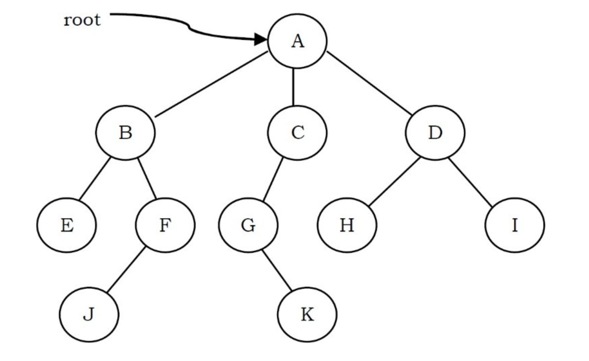
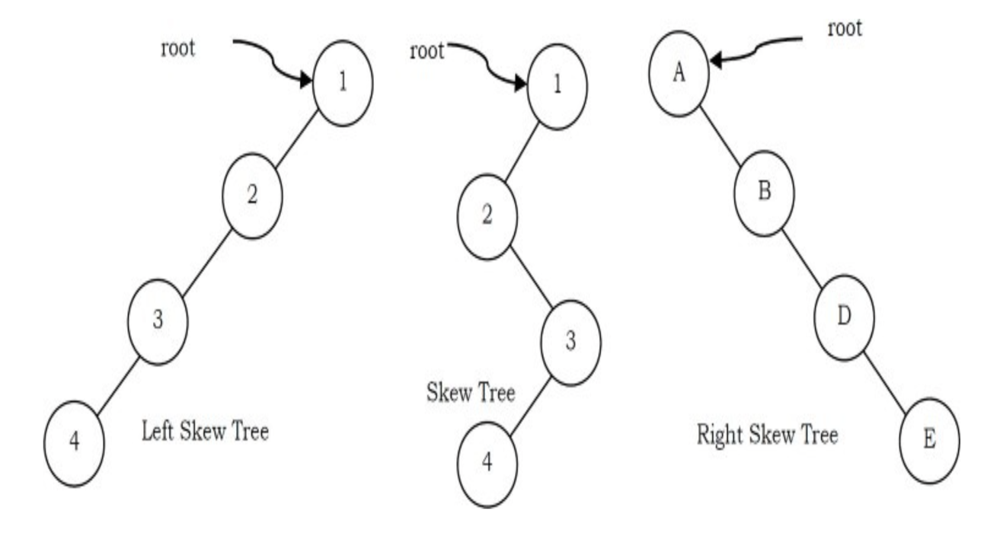
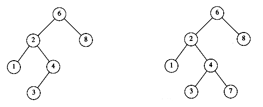
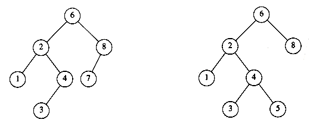
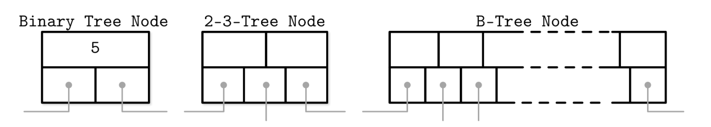

## Introduction

树是一种类似于链表的数据结构，但每个节点不是线性地指向下一个节点，而是指向多个节点。
树是非线性数据结构的示例。
树结构是以图形形式表示结构层次的一种方式。
在树 ADT（抽象数据类型）中，元素的顺序并不重要。
如果需要排序信息，可以使用线性数据结构，如链表、栈、队列等。

<div style="text-align: center;">



</div>

- 树的根是没有父节点的节点。一棵树中最多有一个根节点（上例中的节点 A）。
- 边是指从父节点到子节点的链接（图中所有链接）。
- 没有子节点的节点称为叶子节点（E, J, K, H 和 I）。
- 同一父节点的子节点称为兄弟节点（B, C, D 是 A 的兄弟节点，E, F 是 B 的兄弟节点）。
- 如果存在从根到 q 的路径且 p 出现在该路径上，则节点 p 是节点 q 的祖先。节点 q 称为 p 的后代。例如，A、C 和 G 是 K 的祖先。
- 节点的深度是从根到该节点的路径长度（G 的深度为 2，A–C–G）。
- 节点的高度是从该节点到最深节点的路径长度。树的高度是从根到树中最深节点的路径长度。只有一个节点（根）的（有根）树的高度为 0。在前面的例子中，B 的高度为 2（B–F–J）。
- 树的高度是树中所有节点中的最大高度，树的深度是树中所有节点中的最大深度。对于给定的树，深度和高度返回相同的值。但对于单个节点，我们可能会得到不同的结果。
- 节点的大小是其拥有的后代数量（包括自身）（子树 C 的大小为 3）。
- 给定深度的所有节点的集合称为树的层（B、C 和 D 在同一层）。根节点在第 0 层。

<div style="text-align: center;">



</div>

- 树的根是没有父节点的节点。一棵树中最多有一个根节点（上例中的节点 A）。
- 边是指从父节点到子节点的链接（图中所有链接）。
- 没有子节点的节点称为叶子节点（E, J, K, H 和 I）。
- 同一父节点的子节点称为兄弟节点（B, C, D 是 A 的兄弟节点，E, F 是 B 的兄弟节点）。
- 如果存在从根到 q 的路径且 p 出现在该路径上，则节点 p 是节点 q 的祖先。节点 q 称为 p 的后代。例如，A、C 和 G 是 K 的祖先。
- 节点的深度是从根到该节点的路径长度（G 的深度为 2，A–C–G）。
- 节点的高度是从该节点到最深节点的路径长度。树的高度是从根到树中最深节点的路径长度。只有一个节点（根）的（有根）树的高度为 0。在前面的例子中，B 的高度为 2（B–F–J）。
- 树的高度是树中所有节点中的最大高度，树的深度是树中所有节点中的最大深度。对于给定的树，深度和高度返回相同的值。但对于单个节点，我们可能会得到不同的结果。
- 节点的大小是其拥有的后代数量（包括自身）（子树 C 的大小为 3）。
- 给定深度的所有节点的集合称为树的层（B、C 和 D 在同一层）。根节点在第 0 层。
  如果树中的每个节点（除了叶子节点）都只有一个子节点，则我们称这样的树为斜树。
  如果每个节点只有左子节点，则称为左斜树。类似地，如果每个节点只有右子节点，则称为右斜树。

> [!NOTE]
>
> 注意，在树中，从根到每个节点恰好有一条路径。

> [!NOTE]
>
> 注意，在树中，从根到每个节点恰好有一条路径。对于任何节点 ni，ni 的深度是从根到 ni 的唯一路径的长度。
因此，根的深度为 0。ni 的高度是从 ni 到叶子的最长路径。
因此所有叶子的高度为 0。
树的高度等于根的高度。
树的深度等于最深叶子的深度；这总是等于树的高度。

如果存在从 n1 到 n2 的路径，则 n1 是 n2 的祖先，n2 是 n1 的后代。
如果 n1 != n2，则 n1 是 n2 的真祖先，n2 是 n1 的真后代。

## Implementation

典型声明：将每个节点的子节点保存在树节点的链表中。

```c
typedef struct tree_node *tree_ptr;

struct tree_node
{
    element_type element;
    tree_ptr first_child;
    tree_ptr next_sibling;
};
```

## Tree Traversals

> [!NOTE]
>
> UNIX 文件系统不是树，但类似树。

- 在前序遍历中，节点的工作在其子节点被处理之前（pre）执行。
- 在后序遍历中，节点的工作在其子节点被评估之后（post）执行。

树的经典遍历算法主要有二种：深度优先算法（DF）及广度优先算法（BF），BF 与 DF 的效率其实差不多的。在有些场景，是 DF 更快，在有些场景，是 BF 更快。DF一般用 stack 数据结构，BF 一般用 queue 数据结构

### levelOrder

层序遍历是从根节点开始 从上至下（先父节点后子节点） 从左至右（先左节点后右节点） 按顺序遍历 这就比较适用于队列FIFO的性质

使用一个Queue用于保存当前层的节点 在下一层出队 获取其子节点入队

以下是直接遍历输出的代码

```go
    queue := new(LinkQueue)
    // 根节点先入队
    queue.Add(root)
    for queue.size > 0 {
        // 不断出队列
        element := queue.Remove()
        // 先打印节点值
        fmt.Print(element.Data, " ")
        // 左子树非空，入队列
        if element.Left != nil {
            queue.Add(element.Left)
        }
        // 右子树非空，入队列
        if element.Right != nil {
            queue.Add(element.Right)
        }
    }
```

大多数情况下是需要整合成一个列表并返回的

```java
public int[] levelOrder(TreeNode root) {
        int arr[]=new int[10000];
        int index=0;
        Queue<TreeNode>queue=new ArrayDeque<>();
        if(root!=null)
            queue.add(root);
        while (!queue.isEmpty()){
            TreeNode node=queue.poll();
            arr[index++]= node.val;
            if(node.left!=null)
                queue.add(node.left);
            if(node.right!=null)
                queue.add(node.right);
            
        }
        return Arrays.copyOf(arr,index);
    }
```

在这基础上还有需要分层存储的多级列表 与单层存储相比 在对队列的出队操作需要注意 可以记录上层总共的节点数量 用于界定一层出队的次数

还有之字形遍历

第一行按照从左到右的顺序打印，第二层按照从右到左的顺序打印，第三行再按照从左到右的顺序打印，其他行以此类推

为了区分每层的遍历顺序 可以使用一个临时变量用作奇偶数判断来变更每层的遍历顺序

```java
public List<List<Integer>> levelOrder(TreeNode root) {
  List<List<Integer>> value=new ArrayList<>();
  if(root==null)
    return value;
  int index=0;
  Queue<TreeNode>queue=new ArrayDeque<>();
  queue.add(root);
  while (!queue.isEmpty()){
    List<Integer>va=new ArrayList<>();
    int len=queue.size();
    for(int i=0;i<len;i++){
      TreeNode node=queue.poll();
      if(index%2==0)
        va.add(node.val);
      else
        va.add(0,node.val);
      if(node.left!=null)
        queue.add(node.left);
      if(node.right!=null)
        queue.add(node.right);
    }
    value.add(va);
    index++;
  }
  return value;
}
```

## Binary Trees

如果每个节点有零个、一个或两个子节点，则称为二叉树。空树也是有效的二叉树。
我们可以将二叉树视为由根节点和两个不相交的二叉树（称为根的左子树和右子树）组成。

严格二叉树：如果每个节点恰好有两个子节点或没有子节点，则称为严格二叉树。

满二叉树：如果每个节点恰好有两个子节点且所有叶子节点都在同一层，则称为满二叉树。

完全二叉树：在定义完全二叉树之前，假设二叉树的高度为 h。
在完全二叉树中，如果我们从根开始为节点编号（假设根节点编号为 1），则得到从 1 到树中节点数量的完整序列。
遍历时，我们还应为 NULL 指针编号。
如果所有叶子节点都在高度 h 或 h-1 并且序列中没有缺失的编号，则称为完全二叉树。

### Applications of Binary Trees

以下是二叉树发挥重要作用的一些应用：

- 表达式树用于编译器。
- 哈夫曼编码树用于数据压缩算法。
- 二叉搜索树（BST），支持对集合中项目的搜索、插入和删除，平均时间复杂度为 O(logn)。
- 优先队列（PQ），支持对数时间内（最坏情况下）对集合中最小（或最大）元素的搜索和删除。

### Operations on Binary Trees

基本操作

- 向树中插入元素
- 从树中删除元素
- 搜索元素
- 遍历树

辅助操作

- 查找树的大小
- 查找树的高度
- 查找具有最大总和的层
- 查找给定节点对的最低公共祖先（LCA），以及更多。

### Implementation

由于二叉树最多有两个子节点，我们可以直接保留指向它们的指针。
树节点的声明在结构上类似于双向链表，即节点是一个由键信息加上两个指针（left 和 right）组成的结构。

```c
typedef struct tree_node *tree_ptr;
struct tree_node

{
    element_type element;
    tree_ptr left;
    tree_ptr right;

};

typedef tree_ptr TREE;
```

我们可以使用链表中常用的矩形框来绘制二叉树，但树通常绘制为用线连接的圆形，因为它们实际上是图。在引用树时，我们也不显式绘制 NULL 指针，因为具有 n 个节点的二叉树需要 n+1 个 NULL 指针。

这种通用策略（left, node, right）称为*中序*遍历。

满二叉树

完全二叉树

堆

### Binary Search Tree (BSTs)

二叉树的一个重要应用是搜索。

使二叉树成为二叉搜索树的属性是，对于树中的每个节点 X，
左子树中所有键的值小于 X 中的键值，右子树中所有键的值大于 X 中的键值。
注意，这意味着树中的所有元素可以按某种一致的方式排序。

在下图中，左边的树是二叉搜索树，右边的树不是。
右边的树在键为 6 的节点（恰好是根）的左子树中有一个键为 7 的节点。

<div style="text-align: center;">



</div>

因为二叉搜索树的平均深度为 $O(\log{n})$，我们通常不需要担心栈空间耗尽。

因为二叉搜索树的平均深度为 $O(\log{n})$，我们通常不需要担心栈空间耗尽。树中所有节点的平均深度为 $O(\log{n})$，前提是假设所有树出现的概率相等。

树中所有节点的深度之和称为*内部路径长度*。

如果输入在进入树之前已排序，则一系列 insert 将花费二次时间并产生链表，因为树将仅由没有左子节点的节点组成。一个解决方案是坚持一个额外的结构条件，称为*平衡*：不允许任何节点过深。

### Binary Tree Traversals

树的遍历类似于搜索树，但区别在于遍历的目标是以特定顺序移动经过树。此外，遍历中所有节点都被处理，而搜索在找到所需节点时停止。

#### Traversal Possibilities

从二叉树的根开始，有三个主要步骤可以执行，它们执行的顺序定义了遍历类型。
这些步骤是：对当前节点执行操作（称为"访问"节点，记为"D"），遍历到左子节点（记为"L"），以及遍历到右子节点（记为"R"）。
这个过程可以很容易地通过递归来描述。基于上述定义，有 6 种可能性：

1. LDR：处理左子树，处理当前节点数据，然后处理右子树
2. LRD：处理左子树，处理右子树，然后处理当前节点数据
3. DLR：处理当前节点数据，处理左子树，然后处理右子树
4. DRL：处理当前节点数据，处理右子树，然后处理左子树
5. RDL：处理右子树，处理当前节点数据，然后处理左子树
6. RLD：处理右子树，处理左子树，然后处理当前节点数据

遍历的分类

这些实体（节点）被处理的顺序定义了特定的遍历方法。
分类基于当前节点被处理的顺序。
也就是说，如果我们基于当前节点（D）进行分类，并且如果 D 在中间，则 L 在 D 的左侧还是 R 在 D 的左侧并不重要。同样，L 在 D 的右侧还是 R 在 D 的右侧也不重要。
因此，总共有 6 种可能性减少为 3 种：

- 前序（DLR）遍历
- 中序（LDR）遍历
- 后序（LRD）遍历

还有另一种不依赖于上述顺序的遍历方法：

- 层序遍历：这种方法受到广度优先遍历（图算法的 BFS）的启发。

## Generic Trees (N-ary Trees)

## Red-Black Trees

## AVL Trees

AVL（Adelson-Velskii 和 Landis）树是一种具有*平衡*条件的二叉搜索树。
平衡条件必须易于维护，并确保树的深度为 $O(\log{n})$。
最简单的想法是要求左子树和右子树具有相同的高度。

AVL 树与二叉搜索树相同，只是树中每个节点的左子树和右子树的高度差最多为 1。
（空树的高度定义为 -1。）

在下图中，左边的树是 AVL 树，右边的树不是。



### Single Rotation

### Double Rotation

## Splay Trees

我们现在描述一种相对简单的数据结构，称为*伸展树*，它保证任意 m 次连续树操作最多需要 $O(m\log{n})$ 时间。

虽然这个保证不排除任何*单次*操作可能花费 $O(n)$ 时间的可能性，
因此这个界不如每次操作 $O(\log{n})$ 的最坏情况界那么强，
但净效果是一样的：没有坏的输入序列。
通常，当 m 次操作的序列总的最坏情况运行时间为 $O(mf(n))$ 时，我们说*摊还*运行时间为 *O*(*f*(*n*))。
因此，伸展树每次操作的摊还成本为 $O(\log{n})$。在长时间的操作序列中，有些操作可能花费更多，有些更少。

伸展树基于这样一个事实：二叉搜索树每次操作 $O(n)$ 的最坏情况时间并不坏，只要它发生得相对不频繁。
任何一次访问，即使花费 $O(n)$，仍然可能非常快。
二叉搜索树的问题在于，可能（而且并不罕见）发生一连串的坏访问。
累积运行时间就会变得显著。
一种最坏情况时间为 $O(n)$，但对任意 m 次连续操作保证至多 $O(m\log{n})$ 的搜索树数据结构无疑是令人满意的，因为没有坏的序列。

如果允许任何特定操作具有 $O(n)$ 的最坏情况时间界，并且我们仍然希望每次操作的摊还时间界为 $O(\log{n})$，那么显然**每当访问一个节点时，它必须被移动**。
否则，一旦我们找到一个深节点，我们可以不断对其执行查找。
如果节点不改变位置，并且每次访问花费 $O(n)$，那么 m 次访问的序列将花费 $O(M*N)$。

伸展树的基本思想是，访问一个节点后，通过一系列 AVL 树旋转将其推到根。
注意，如果一个节点很深，那么路径上有很多节点也相对较深，通过重组我们可以使未来对这些节点的访问更便宜。
因此，如果节点过深，我们希望这种重组具有平衡树的副作用（在某种程度上）。
除了在理论上给出好的时间界外，这种方法在实际中也可能有用，因为在许多应用中，当一个节点被访问时，它在不久的将来很可能再次被访问。
研究表明，这种情况发生的频率比人们预期的要高得多。
伸展树也不需要维护高度或平衡信息，从而节省空间并在一定程度上简化代码（特别是在仔细实现时）。

### Traversals

在层序遍历中，深度 d 的所有节点在深度 d+1 的任何节点之前被处理。
层序遍历与其他遍历的不同之处在于它不是递归完成的；使用队列而不是递归隐含的栈。

## B-Trees

如前所述，不平衡树的最坏情况复杂度为 O(N)。平衡树给我们平均 O(log2 N)。同时，由于低扇出（扇出是每个节点允许的最大子节点数），我们必须进行平衡、重定位节点和更新指针，频率较高。增加的维护成本使 BST 作为磁盘数据结构不实用。

如果我们想在磁盘上维护 BST，会面临几个问题。一个是局部性：由于元素以随机顺序添加，不能保证新创建的节点写在其父节点附近，这意味着节点子指针可能跨越多个磁盘页面。我们可以通过修改树布局和使用分页二叉树来在一定程度上改善情况。

另一个与跟随子指针的成本密切相关的问题是树的高度。由于二叉树的扇出仅为 2，高度是树中元素数量的二进制对数，我们必须执行 $O(log2 N)$ 次寻道来定位搜索的元素，随后执行相同数量的磁盘传输。2-3 树和其他低扇出树也有类似的局限性：虽然它们作为内存数据结构很有用，但小的节点大小使它们不适合外部存储。

一个朴素的基于磁盘的 BST 实现需要与比较次数相同的磁盘寻道次数，因为没有内置的局部性概念。
这促使我们寻找一种能够展现这种属性的数据结构。

考虑到这些因素，更适合磁盘实现的树版本必须具有以下属性：

- *高扇出*以改善相邻键的局部性。
- *低高度*以减少遍历期间的寻道次数。

> [!TIP]
> 扇出和高度是负相关的：扇出越高，高度越低。如果扇出很高，每个节点可以容纳更多子节点，从而减少节点数量，进而减少高度。

B 树建立在平衡搜索树的基础上，不同之处在于它们具有更高的扇出（更多子节点）和更低的高度。

在大多数文献中，二叉树节点被绘制为圆形。由于每个节点只负责一个键并将范围分为两部分，这种详细程度就足够且直观了。同时，B 树节点通常被绘制为矩形，指针块也被显式显示，以突出子节点和分隔键之间的关系。
图 7 并排显示了二叉树、2-3 树和 B 树节点，有助于理解它们之间的异同。

<div style="text-align: center;">



</div>

<p style="text-align: center;">
Fig.7. 二叉树、2-3 树和 B 树节点并排比较。
</p>

## LSM-trees

[LSM-tree](/docs/CS/Algorithms/tree/LSM.md) 使用一种算法来延迟和批量处理索引更改，以特别高效的方式将更改迁移到磁盘，类似于归并排序。

## Summary

我们已经看到了树在操作系统、编译器设计和搜索中的用途。
表达式树是一种更通用结构（称为解析树）的小例子，解析树是编译器设计中的核心数据结构。
解析树不是二叉树，而是表达式树的相对简单的扩展（尽管构建它们的算法不那么简单）。

搜索树在算法设计中非常重要。
它们支持几乎所有有用的操作，而对数平均成本非常小。
搜索树的问题在于其性能在很大程度上依赖于输入的随机性。
如果不是这样，运行时间会显著增加，以至于搜索树变成昂贵的链表。

我们看到了几种处理这个问题的方法。
AVL 树通过要求所有节点的左右子树高度差最多为 1 来工作。
这确保了树不会过深。
不改变树的操作（如插入）都可以使用标准的二叉搜索树代码。
改变树的操作必须恢复树。这可能有点复杂，特别是在删除的情况下。
我们展示了如何在 O(log n) 时间内恢复插入后的树。

我们还研究了伸展树。
伸展树中的节点可能任意深，但每次访问后树会以某种神秘的方式调整。
净效果是，任何 m 次操作的序列需要 O(m log n) 时间，这与平衡树相同。

B 树是平衡的 m 路（相对于 2 路或二叉树）树，非常适合磁盘；一个特殊情况是 2-3 树，这是实现平衡搜索树的另一种常见方法。

在实践中，所有平衡树方案的运行时间都比简单的二叉搜索树差（由常数因子导致），
但考虑到它们对容易获得的最坏情况输入提供的保护，这通常是可以接受的。

> [!NOTE]
>
> 最后一点：通过将元素插入搜索树然后执行中序遍历，我们得到排序后的元素。
> 这给出了 $O(n\log{n})$ 的排序算法，如果使用任何高级搜索树，这是一个最坏情况界。

## Links

- [data structures](/docs/CS/Algorithms/Algorithms.md?id=data-structures)
