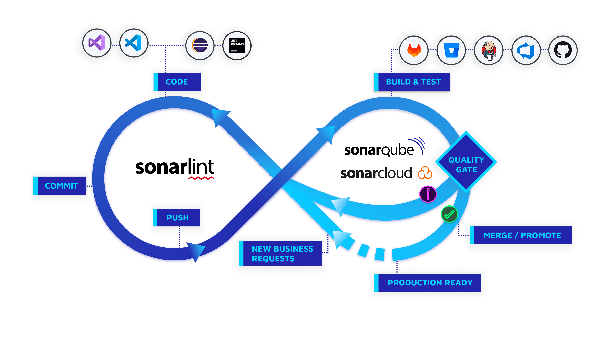

## Introduction

[SonarQube](https://www.sonarsource.com/products/sonarqube/) is a self-managed, automatic code review tool that systematically helps you deliver *Clean Code*.
The tool analyses 30+ different programming languages and integrates into your CI pipeline and DevOps platform to ensure that your code meets high-quality standards.

Fig.1. Developing with Sonar

The Sonar solution performs checks at every stage of the development process:

- SonarLint provides immediate feedback in your IDE as you write code so you can find and fix issues before a commit.
- SonarQube’s PR analysis fits into your CI/CD workflows with SonarQube’s PR analysis and use of quality gates.
- Quality gates keep code with issues from being released to production, a key tool in helping you incorporate the Clean as You Code methodology.
- The Clean as You Code approach helps you focus on submitting new, clean code for production, knowing that your existing code will be improved over time.

with jacoco

code coverage

## Links

## References

1. [SonarQube Latest Documentation](https://docs.sonarsource.com/sonarqube/latest/)