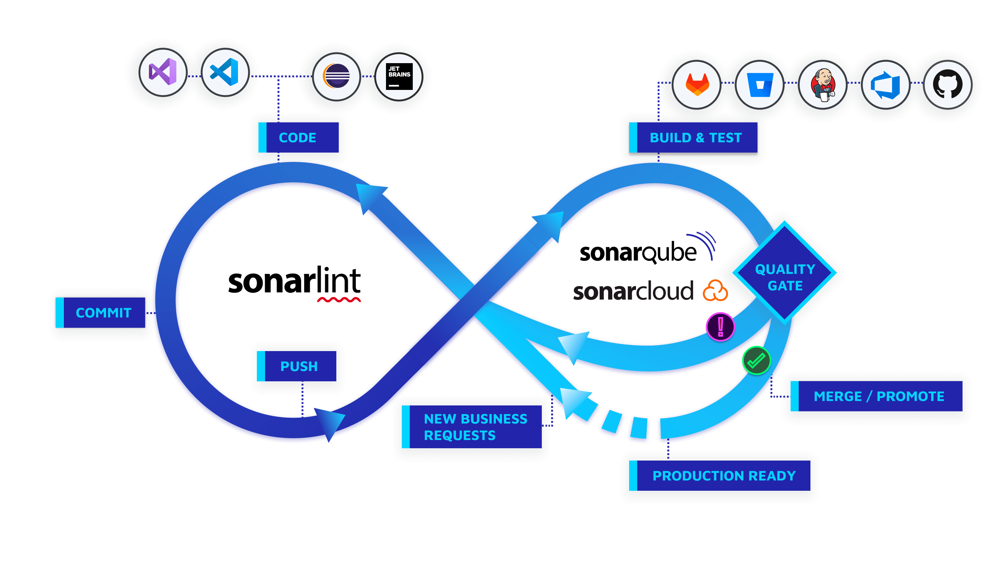

## Introduction

[SonarQube](https://www.sonarsource.com/products/sonarqube/) 是一个自托管的自动化代码审查工具，系统性地帮助你交付 **Clean Code**。
该工具分析 30 多种编程语言，并集成到 CI 流水线和 DevOps 平台，确保代码符合高质量标准。

Fig.1. Developing with Sonar

Sonar 解决方案在开发过程的每个阶段执行检查：

- SonarLint 在你编写代码时在 IDE 中提供即时反馈，以便在提交前发现并修复问题。
- SonarQube 的 PR 分析通过质量门（quality gates）融入 CI/CD 工作流。
- 质量门阻止有问题的代码发布到生产环境，是帮助你融入"Clean as You Code"方法论的关键工具。
- "Clean as You Code"方法帮助你专注于提交新的干净代码到生产环境，同时相信现有代码将随着时间的推移得到改进。

与 jacoco 集成

代码覆盖率

## Links

## References

1. [SonarQube Latest Documentation](https://docs.sonarsource.com/sonarqube/latest/)