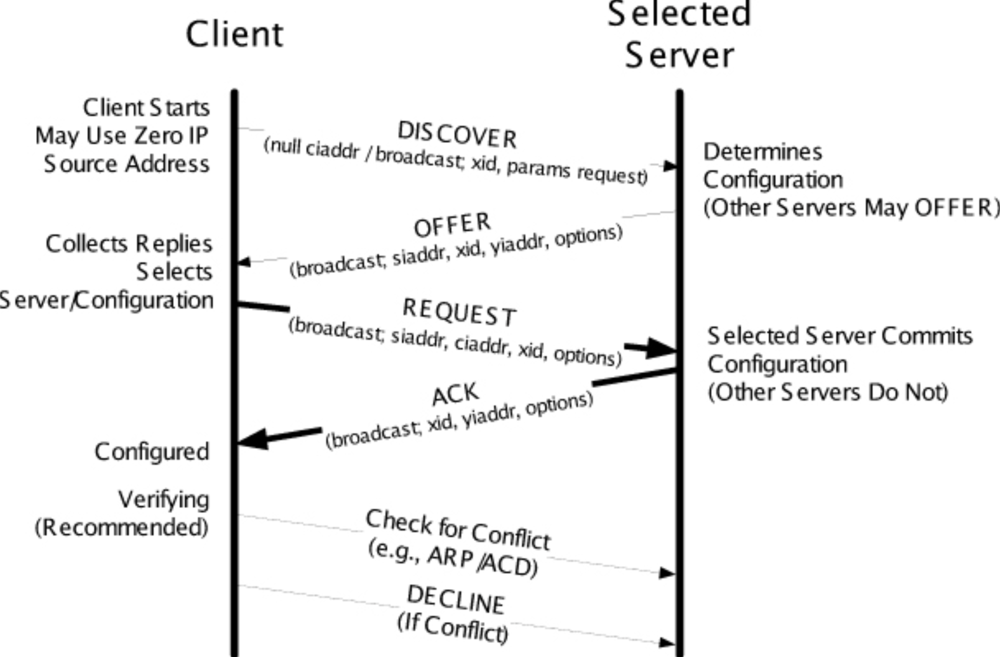

## Introduction

*Dynamic Host Configuration Protocol*

DHCP comprises two major parts: address management and delivery of configuration data. 
Address management handles the dynamic allocation of IP addresses and provides address leases to clients. 
Configuration data delivery includes the DHCP protocol’s message formats and state machines. 
A DHCP server can be configured to provide three levels of address allocation: automatic allocation, dynamic allocation, and manual allocation. 
The differences among the three have to do with whether the addresses assigned are based on the identity of the client and whether such addresses are subject to being revoked or changed. 
The most commonly used method is dynamic allocation, whereby a client is given a revocable IP address from a pool (usually a predefined range) of addresses configured at the server. 
In automatic allocation, the same method is used but the address is never revoked. 
In manual allocation, the DHCP protocol is used to convey the address, but the address is fixed for the requesting client (i.e., it is not part of an allocatable pool maintained by the server). 
In this last mode, DHCP acts like BOOTP. We shall focus on dynamic allocation, as it is the most interesting and common case.

Because of DHCP’s ability to automate the network-related aspects of connecting a host into a network, it is often referred to as a **plug-and-play** or **zeroconf** (zero-configuration) protocol.

## Address Pools and Leases

In dynamic allocation, a DHCP client requests the allocation of an IP address. 
The server responds with one address selected from a pool of available addresses. 
Typically, the pool is a contiguous range of IP addresses allocated specifically for DHCP’s use. 
The address given to the client is allocated for only a specific amount of time, called the lease duration. 
The client is permitted to use the IP address until the lease expires, although it may request extension of the lease as required. 
In most situations, clients are able to renew leases they wish to extend.

The lease duration is an important configuration parameter of a DHCP server. 
Lease durations can range from a few minutes to days or more (“infinite” is possible but not recommended for anything but simple networks).
Determining the best value to use for leases is a trade-off between the number of expected clients, the size of the address pool, and the desire for the stability of addresses. 
Longer lease durations tend to deplete the available address pool faster but provide greater stability in addresses and somewhat reduced network overhead (because there are fewer requests to renew leases). 
Shorter leases tend to keep the pool available for other clients, with a consequent potential decrease in stability and increase in network traffic load. 
Common defaults include 12 to 24 hours, depending on the particular DHCP server being used.
Clients begin trying to renew leases after half of the lease duration has passed.

When making a DHCP request, a client is able to provide information to the server. 
This information can include the name of the client, its requested lease duration, a copy of the address it is already using or last used, and other parameters. 
When the server receives such a request, it can make use of whatever information the client has provided (including the requesting MAC address) 
in addition to other exogenous information (e.g., the time of day, the interface on which the request was received) to determine what address and configuration information to provide in response. 
**In providing a lease to a client, a server stores the lease information in persistent memory, typically in nonvolatile memory or on disk.** 
If the DHCP server restarts and all goes well, leases are maintained intact.

Subnet

Lease

For a newly arriving host, the DHCP protocol is a four-step process.
The four steps are:

- DHCP server discovery.
  The first task of a newly arriving host is to find a DHCP server with which to interact.
- DHCP server offer(s).
  A DHCP server receiving a DHCP discover message responds to the client with a DHCP offer message that is broadcast to all nodes on the subnet, again using the IP broadcast address of 255.255.255.255.
- DHCP request. 
  The newly arriving client will choose from among one or more server offers and respond to its selected offer with a DHCP request message, echoing back the configuration parameters. 
- DHCP ACK. 
  The server responds to the DHCP request message with a DHCP ACK message, confirming the requested parameters.

DHCP NAK

DHCP RELEASE

DHCP INFORM

DHCP DECLINE

客户端监听68端口 服务端监听67端口

使用UDP广播

1. 客户端发起DHCP DISCOVER，UDP广播 （225.225.225.255:67/0.0.0.0:68）
2. 服务端 DHCP OFFER 还是广播发送
3. 客户端 DHCP REQUEST
4. 服务端 DHCP ACK

DHCP中继代理

## Links

- [Computer Network](/docs/CS/CN/CN.md)

## References

1. [RFC 2131 - Dynamic Host Configuration Protocol](https://www.rfc-editor.org/info/rfc2131)