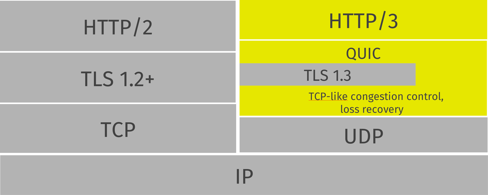

## Introduction

*Quick UDP Internet Connections*

> QUIC retains ordering within a single resource stream.


<div style="text-align: center;">



</div>

<p style="text-align: center;">
Fig.1. HTTP/3 over QUIC stack overview.
</p>

## Fast handshakes

0-RTT

QUIC encrypts and cryptographically authenticates both the transport data and the protocol itself, preventing middleboxes from inspecting or modifying the protocol header and future-proofing the protocol in the process.
QUIC also has versioning built in (yes, there is no versioning in TCP), which gives us the freedom to consider deep and wide changes as the future requires.
Versioning also allows us to consider alternative versions that we can build, tune, and deploy within our POPs, as we’ll now discuss.

We anticipated two major sources of computational cost for QUIC:

Acknowledgement processing: A large fraction of packets in a typical TCP connection carry only acknowledgements.
TCP acknowledgements are processed within the kernel, both at the sender and the receiver.
QUIC does these in user space, resulting in more data copies across the user-kernel boundary and more context switches.
Additionally, TCP acknowledgements are in plaintext, while QUIC acknowledgements are encrypted, increasing the cost of sending and receiving acknowledgements in QUIC.

Per-packet sender overhead: The kernel knows about TCP connections, and can remember and reuse state that is expected to remain unchanged for all packets sent in a connection.
For instance, the kernel needs to typically only look up the route for the destination address or apply firewall rules once at the start of the connection.
Since the kernel has no connection state for QUIC connections, these kernel operations are performed on every outgoing QUIC packet.

Since QUIC runs in user space, these costs are higher with QUIC than with TCP.
This is because every packet that is either sent or received by QUIC crosses the user-kernel boundary, which is known as a context switch.

This experiment showed a clear path forward for improving quicly’s efficiency: reducing acknowledgement frequency, coalescing packets with GSO, and using as large a packet size as possible.

## TLS

## Congestion Control

The signals QUIC provides for congestion control are generic and are designed to support different sender-side algorithms. 
A sender can unilaterally choose a different algorithm to use, such as CUBIC .

### ECN

If a path has been validated to support Explicit Congestion Notification (ECN) [RFC3168] [RFC8311], QUIC treats a Congestion Experienced (CE) codepoint in the IP header as a signal of congestion. 
This document specifies an endpoint's response when the peer-reported ECN-CE count increases; see Section 13.4.2 of [QUIC-TRANSPORT].


## Connection Migration

QUIC connections are not strictly bound to a single network path.
Connection migration uses connection identifiers to allow connections to transfer to a new network path.
Only clients are able to migrate in this version of QUIC now.
This design also allows connections to continue after changes in network topology or address mappings, such as might be caused by NAT rebinding.

The use of a connection ID allows connections to survive changes to endpoint addresses (IP address and port), such as those caused by an endpoint migrating to a new network.
This section describes the process by which an endpoint migrates to a new address.

The design of QUIC relies on endpoints retaining a stable address for the duration of the handshake.
Some situations that do not allow connection migration:

- An endpoint MUST NOT initiate connection migration before the handshake is confirmed, as defined in [QUIC-TLS](/docs/CS/CN/HTTP/QUIC.mdIC.md?id=TLS).
- An endpoint MUST NOT initiate connection migration if the peer sent the disable_active_migration transport parameter.

If the peer sent the `disable_active_migration` transport parameter, an endpoint also MUST NOT send packets (including probing packets) from a different local address to the address the peer used during the handshake,
unless the endpoint has acted on a `preferred_address` transport parameter from the peer.
If the peer violates this requirement, the endpoint MUST either drop the incoming packets on that path without generating a *Stateless Reset* or proceed with path validation and allow the peer to migrate.
Generating a *Stateless Reset* or closing the connection would allow third parties in the network to cause connections to close by spoofing or otherwise manipulating observed traffic.

Not all changes of peer address are intentional, or active, migrations.
The peer could experience NAT rebinding: a change of address due to a middlebox, usually a NAT, allocating a new outgoing port or even a new outgoing IP address for a flow.
An endpoint MUST perform path validation if it detects any change to a peer's address, unless it has previously validated that address.

When an endpoint has no validated path on which to send packets, it MAY discard connection state.
An endpoint capable of connection migration MAY wait for a new path to become available before discarding connection state.

This document limits migration of connections to new client addresses, except as described in Section 9.6.  Clients are responsible for initiating all migrations.
Servers do not send non-probing packets (see Section 9.1) toward a client address until they see a non-probing packet from that address.  If a client receives packets from an unknown server address, the client MUST discard these packets.

### Classification of Connection Migration

#### ACM and PCM

Active Connection Migration and Passive Connection Migration

#### VCM and HCM

Vertical Connection Migration and Horizontal Connection Migration

#### CCM and SCM

Client Connection Migration and Server Connection Migration

#### SPCM and MPCM

Single-path Connection Migration and Multi-path Connection Migration

### Connection Migration Strategy

- Failover Mode
- Standby Mode
- Aggregation Mode
- Load Balance Mode

Except for PCM, other connection migrations can be triggered by RTT, packet loss rate, timeout, ECN or application signals.

### Path Verification

Path validation is used by both peers during connection migration to verify reachability after a change of address.
In path validation, endpoints test reachability between a specific local address and a specific peer address, where an address is the 2-tuple of IP address and port.

Path validation tests that packets sent on a path to a peer are received by that peer.
Path validation is used to ensure that packets received from a migrating peer do not carry a spoofed source address.

The endpoint sends a PATH_CHALLENGE frame containing a random number to initialize path verification.
Each endpoint validates its peer's address during connection establishment. Therefore, a migrating endpoint can send to its peer knowing that the peer is willing to receive at the peer's current address.

Path verification MUST be performed for most connection migrations, unless the endpoints have verified the path, the reason is to verify the reachability and security of the path.
But in some special cases, the connection migration initiator should be allowed to send data packets directly without path confirmation from the peer.
The condition is to ensure that the packet received by connection migration responder does not carry a spoofed source address.

Endpoints can use PATH_CHALLENGE frames (type=0x1a) to check reachability to the peer and for path validation during connection migration.

### Probing a New Path

An endpoint MAY probe for peer reachability from a new local address using path validation prior to migrating the connection to the new local address.
Failure of path validation simply means that the new path is not usable for this connection.
**Failure to validate a path does not cause the connection to end unless there are no valid alternative paths available.**

PATH_CHALLENGE, PATH_RESPONSE, NEW_CONNECTION_ID, and PADDING frames are "probing frames", and all other frames are "non-probing frames".
A packet containing only probing frames is a "probing packet", and a packet containing any other frame is a "non-probing packet".

### Initiating Connection Migration

An endpoint can migrate a connection to a new local address by sending packets containing non-probing frames from that address.

Each endpoint validates its peer's address during connection establishment.
Therefore, a migrating endpoint can send to its peer knowing that the peer is willing to receive at the peer's current address.
Thus, an endpoint can migrate to a new local address without first validating the peer's address.

To establish reachability on the new path, an endpoint initiates path validation on the new path.
An endpoint MAY defer path validation until after a peer sends the next non-probing frame to its new address.

When migrating, the new path might not support the endpoint's current sending rate.
Therefore, the endpoint resets its congestion controller and RTT estimate.

The new path might not have the same [ECN capability]().

### Responding to Connection Migration

Receiving a packet from a new peer address containing a non-probing frame indicates that the peer has migrated to that address.

If the recipient permits the migration, it MUST send subsequent packets to the new peer address and MUST initiate path validation(Section 8.2) to verify the peer's ownership of the address if validation is not already underway.
If the recipient has no unused connection IDs from the peer, it will not be able to send anything on the new path until the peer provides one; see Section 9.5.

An endpoint only changes the address to which it sends packets in response to the highest-numbered non-probing packet.
This ensures that an endpoint does not send packets to an old peer address in the case that it receives reordered packets.

An endpoint MAY send data to an unvalidated peer address, but it MUST protect against potential attacks as described in Sections 9.3.1 and 9.3.2.
An endpoint MAY skip validation of a peer address if that address has been seen recently.
In particular, if an endpoint returns to a previously validated path after detecting some form of spurious migration, skipping address validation and restoring loss detection and congestion state can reduce the performance impact of the attack.

After changing the address to which it sends non-probing packets, an endpoint can abandon any path validation for other addresses.

Receiving a packet from a new peer address could be the result of a NAT rebinding at the peer.

After verifying a new client address, the server SHOULD send new address validation tokens (Section 8) to the client.

### Peer Address Spoofing

It is possible that a peer is spoofing its source address to cause an endpoint to send excessive amounts of data to an unwilling host.
If the endpoint sends significantly more data than the spoofing peer, connection migration might be used to amplify the volume of data that an attacker can generate toward a victim.

As described in Section 9.3, an endpoint is required to validate a peer's new address to confirm the peer's possession of the new address.
Until a peer's address is deemed valid, an endpoint limits the amount of data it sends to that address; see Section 8.
In the absence of this limit, an endpoint risks being used for a denial-of- service attack against an unsuspecting victim.

If an endpoint skips validation of a peer address as described above, it does not need to limit its sending rate.

### On-Path Address Spoofing

An on-path attacker could cause a spurious connection migration by copying and forwarding a packet with a spoofed address such that it arrives before the original packet.
The packet with the spoofed address will be seen to come from a migrating connection, and the original packet will be seen as a duplicate and dropped.
After a spurious migration, validation of the source address will fail because the entity at the source address does not have the necessary cryptographic keys to read or respond to the PATH_CHALLENGE frame that is sent to it even if it wanted to.

To protect the connection from failing due to such a spurious migration, an endpoint MUST revert to using the last validated peer address when validation of a new peer address fails.
Additionally, receipt of packets with higher packet numbers from the legitimate peer address will trigger another connection migration.
This will cause the validation of the address of the spurious migration to be abandoned, thus containing migrations initiated by the attacker injecting a single packet.

If an endpoint has no state about the last validated peer address, it MUST close the connection silently by discarding all connection state.
This results in new packets on the connection being handled generically.
For instance, an endpoint MAY send a Stateless Reset in response to any further incoming packets.

### Off-Path Packet Forwarding

```
  (Before connection migration)
   +--------------+   Non-probing Packet   +--------------+
   |    Client    |  ------------------->  |              |
   |(Source IP: 1)|  <-------------------  |              |
   +--------------+   Non-probing Packet   |              |
          |                                |              |
          |                                |              |
          |                                |              |
          v                                |              |
   +--------------+   Non-probing Packet   |              |
   |              |  ------------------->  |              |
   |              |  <-------------------  |              |
   |              |   Non-probing Packet   |              |
   |              |                        |              |
   |              |                        |    Server    |
   |              |     Probing Packet     |              |
   |              |    (PATH_CHALLENGE)    |              |
   |    Client    |  <-------------------  |              |
   |(Source IP: 2)|  ------------------->  |              |
   |              |     Probing Packet     |              |
   |              |     (PATH_RESPONSE)    |              |
   |              |                        |              |
   |              |     Probing Packet     |              |
   |              |    (PATH_CHALLENGE)    |              |
   |              |  ------------------->  |              |
   |              |  <-------------------  |              |
   |              |     Probing Packet     |              |
   |              |     (PATH_RESPONSE)    |              |
   +--------------+                        +--------------+
   (After connection migration)
```

The endpoint receives a packet containing the new peer address of the non-probing frame from the peer, indicating that the connection migration initiator has migrated to this address.

After the connection is migrated, the endpoints need to reset the congestion control parameters.

## Loss Detection and Congestion Control

## Bonus

### multplexing

If that’s the case, we might wonder why we would need multplexing at all? And by extension:
HTTP/2 and even HTTP/3, as multiplexing is one of the main features they have that HTTP/1.1 doesn’t.

- Firstly, some files that can be processed/rendered incrementally do profit from multiplexing.
  This is for example the case for progressive images.
- Secondly, as also discussed above, it can be useful if one of the files is much smaller than the others, as it will be downloaded earlier while not delaying the others by too much.
- Thirdly, multiplexing allows changing the order of responses and interrupting a low priority response for a higher priority one.

### Transport Congestion Control

QUIC and HTTP/3 will see similar challenges, as like HTTP/2, HTTP/3 will use a single underlying QUIC connection.
You might then say that a QUIC connection is conceptually a bit like multiple TCP connections, as each QUIC stream can be seen as one TCP connection, because loss detection is done on a per-stream basis.
Crucially however, QUIC’s congestion control is still done at the connection level, and not per-stream.
This means that even though the streams are conceptually independent, they all still impact QUIC’s singular, per-connection congestion controller, causing slowdowns if there is loss on any of the stream.
Put differently: the single HTTP/3+QUIC connection still won’t grow as fast as the 6 HTTP/1.1 connections, similar to how HTTP/2+TCP over one connection wasn’t faster.

[quicly](https://github.com/h2o/quicly)

## Links

- [Computer Network](/docs/CS/CN/CN.md)
- [HTTP](/docs/CS/CN/HTTP/HTTP.md)

## References

1. [QUIC](https://quicwg.org/)
2. [RFC 9000 - QUIC: A UDP-Based Multiplexed and Secure Transport](https://datatracker.ietf.org/doc/rfc9000/)
2. [RFC 9002 - QUIC Loss Detection and Congestion Control](https://datatracker.ietf.org/doc/rfc9002/)
3. [知乎专栏 QUIC](https://www.zhihu.com/column/c_1303002298995113984)
