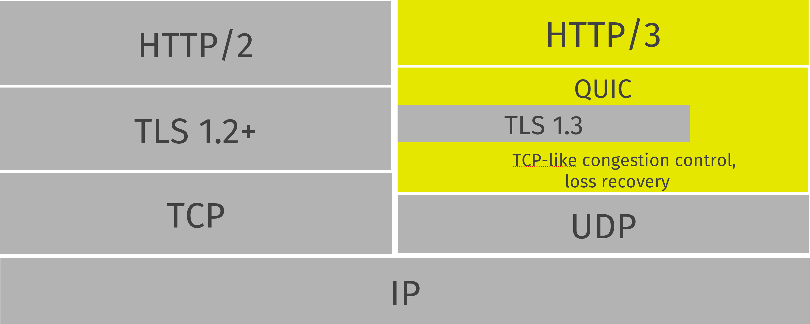

## 简介

*快速 UDP 互联网连接*（Quick UDP Internet Connections）

> QUIC 在单个资源流内保持有序性。

<div style="text-align: center;">



</div>

<p style="text-align: center;">
图 1：HTTP/3 over QUIC 协议栈概览。
</p>

## 快速握手

0-RTT

QUIC 加密和密码学认证传输数据和协议本身，防止中间盒检查或修改协议头部，并在过程中使协议面向未来。
QUIC 还内置了版本控制（是的，TCP 没有版本控制），这使我们能够根据未来需求自由考虑深度和广泛的更改。
版本控制还允许我们考虑可以构建、调优和部署在 POP 内的替代版本，我们接下来将讨论这一点。

我们预期 QUIC 有两个主要计算成本来源：

确认处理：典型 TCP 连接中的大部分数据包只携带确认信息。
TCP 确认在内核中处理，发送方和接收方都是如此。
QUIC 在用户空间执行这些操作，导致用户-内核边界上更多的数据拷贝和更多的上下文切换。
此外，TCP 确认是明文，而 QUIC 确认是加密的，增加了在 QUIC 中发送和接收确认的成本。

每数据包发送方开销：内核了解 TCP 连接，可以记住和重用在连接中所有数据包中预期保持不变的状态。
例如，内核通常只需要在连接开始时查找目标地址的路由或应用防火墙规则一次。
由于内核没有 QUIC 连接的状态，这些内核操作在每个发出的 QUIC 数据包上都会执行。

由于 QUIC 在用户空间运行，这些成本高于 TCP。
这是因为 QUIC 发送或接收的每个数据包都要跨越用户-内核边界，这被称为上下文切换。

这个实验展示了改进 quicly 效率的明确路径：降低确认频率，使用 GSO 合并数据包，并尽可能使用大数据包大小。

## TLS

## 拥塞控制

QUIC 提供的拥塞控制信号是通用的，设计为支持不同的发送方算法。
发送方可以单方面选择使用不同的算法，例如 CUBIC。

### ECN

如果路径已验证支持显式拥塞通知（ECN）[RFC3168]，QUIC 将 IP 头部的拥塞经历（CE）码点视为拥塞信号。
本文档规定了当对端报告的 ECN-CE 计数增加时端点的响应；参见 [QUIC-TRANSPORT] 的第 13.4.2 节。

## 连接迁移

QUIC 连接并不严格绑定到单个网络路径。
连接迁移使用连接标识符来允许连接转移到新的网络路径。
在此版本 QUIC 中，只有客户端能够迁移。
这种设计还允许连接在网络拓扑或地址映射发生变化后继续存在，例如 NAT 重新绑定可能导致的变更。

使用连接 ID 使得连接能够在端点地址（IP 地址和端口）发生变化时继续存活，例如由端点迁移到新网络引起的变更。
本节描述了端点迁移到新地址的过程。

QUIC 的设计依赖端点在握手期间保持稳定的地址。
某些不支持连接迁移的情况：

- 在握手确认之前，端点不得发起连接迁移，如 [QUIC-TLS](/docs/CS/CN/HTTP/QUIC.md?id=TLS) 所定义。
- 如果对端发送了 disable_active_migration 传输参数，端点不得发起连接迁移。

如果对端发送了 `disable_active_migration` 传输参数，端点也不得从不同的本地地址向对端在握手期间使用的地址发送数据包（包括探测数据包），
除非端点已根据来自对端的 `preferred_address` 传输参数采取行动。
如果对端违反此要求，端点必须要么丢弃该路径上的传入数据包而不生成*无状态重置*（Stateless Reset），要么继续进行路径验证并允许对端迁移。
生成*无状态重置*或关闭连接将允许网络中的第三方通过欺骗或操纵观察到的流量来导致连接关闭。

并非所有对端地址的变更都是故意的活跃迁移。
对端可能经历 NAT 重新绑定：由于中间盒（通常是 NAT）导致的地址变更，为一个流分配新的出站端口甚至新的出站 IP 地址。
如果端点检测到对端地址的任何变更，必须执行路径验证，除非已事先验证该地址。

当端点在发送数据包方面没有经过验证的路径时，它可以选择丢弃连接状态。
支持连接迁移的端点可以在丢弃连接状态之前等待新路径变为可用。

本文档将连接迁移限制到新的客户端地址，但第 9.6 节中描述的情况除外。客户端负责发起所有迁移。
服务器在从某个地址看到非探测数据包之前，不会向该客户端地址发送非探测数据包。
如果客户端从未知的服务器地址接收到数据包，客户端必须丢弃这些数据包。

### 连接迁移分类

#### ACM 和 PCM

主动连接迁移（Active Connection Migration）和被动连接迁移（Passive Connection Migration）

#### VCM 和 HCM

垂直连接迁移（Vertical Connection Migration）和水平连接迁移（Horizontal Connection Migration）

#### CCM 和 SCM

客户端连接迁移（Client Connection Migration）和服务器连接迁移（Server Connection Migration）

#### SPCM 和 MPCM

单路径连接迁移（Single-path Connection Migration）和多路径连接迁移（Multi-path Connection Migration）

### 连接迁移策略

- 故障转移模式（Failover Mode）
- 待机模式（Standby Mode）
- 聚合模式（Aggregation Mode）
- 负载均衡模式（Load Balance Mode）

除 PCM 外，其他连接迁移可以由 RTT、丢包率、超时、ECN 或应用信号触发。

### 路径验证

路径验证由两个对端在连接迁移期间使用，以验证地址变更后的可达性。
在路径验证中，端点测试特定本地地址和特定对端地址之间的可达性，其中地址是 IP 地址和端口的二元组。

路径验证测试发送到对端路径上的数据包是否被该对端接收。
路径验证用于确保从迁移对端接收的数据包不携带伪造的源地址。

端点发送包含随机数的 PATH_CHALLENGE 帧以初始化路径验证。
每个端点在连接建立期间验证其对端的地址。因此，迁移端点可以向其对端发送数据，知道对端愿意在其当前地址接收。

大多数连接迁移必须执行路径验证，除非端点已验证该路径，原因是验证路径的可达性和安全性。
但在某些特殊情况下，连接迁移发起方应被允许直接发送数据包，无需等待对端的路径确认。
条件是确保连接迁移响应方接收的数据包不携带伪造的源地址。

端点可以使用 PATH_CHALLENGE 帧（type=0x1a）来检查对端的可达性，并在连接迁移期间进行路径验证。

### 探测新路径

端点可以在将连接迁移到新的本地地址之前，使用路径验证从新的本地地址探测对端的可达性。
路径验证失败仅仅意味着新路径对此连接不可用。
**路径验证失败不会导致连接结束，除非没有可用的替代路径。**

PATH_CHALLENGE、PATH_RESPONSE、NEW_CONNECTION_ID 和 PADDING 帧是"探测帧"，所有其他帧是"非探测帧"。
仅包含探测帧的数据包是"探测数据包"，包含任何其他帧的数据包是"非探测数据包"。

### 发起连接迁移

端点可以通过从新地址发送包含非探测帧的数据包来将连接迁移到新的本地地址。

每个端点在连接建立期间验证其对端的地址。
因此，迁移端点可以向其对端发送数据，知道对端愿意在其当前地址接收。
因此，端点可以在没有首先验证对端地址的情况下迁移到新的本地地址。

为了在新路径上建立可达性，端点在新路径上发起路径验证。
端点可以将路径验证推迟到对端向其新地址发送下一个非探测帧之后。

迁移时，新路径可能不支持端点当前的发送速率。
因此，端点重置其拥塞控制器和 RTT 估计。

新路径可能不具有相同的 [ECN 能力]()。

### 响应连接迁移

从新的对端地址接收到包含非探测帧的数据包表明对端已迁移到该地址。

如果接收方允许迁移，它必须向新的对端地址发送后续数据包，并且如果验证尚未进行，必须发起路径验证（第 8.2 节）以验证对端的地址所有权。
如果接收方没有来自对端的未使用连接 ID，它将无法在新路径上发送任何内容，直到对端提供一个；参见第 9.5 节。

端点仅根据最高编号的非探测数据包更改其发送数据包所去的地址。
这确保在接收到重排序的数据包的情况下，端点不会向旧的对端地址发送数据包。

端点可以向未经验证的对端地址发送数据，但必须防范第 9.3.1 和 9.3.2 节所述的潜在攻击。
如果对端地址最近出现过，端点可以跳过对端地址的验证。
特别是，如果在检测到某种形式的虚假迁移后端点返回到先前验证的路径，跳过地址验证并恢复丢包检测和拥塞状态可以减少攻击对性能的影响。

更改发送非探测数据包所去的地址后，端点可以放弃对其他地址的任何路径验证。

从新的对端地址接收数据包可能是由对端的 NAT 重新绑定引起的。

验证新的客户端地址后，服务器应向客户端发送新的地址验证令牌（第 8 节）。

### 对端地址欺骗

对端可能伪造其源地址，以导致端点向不愿意的主机发送过多数据。
如果端点发送的数据量远多于欺骗方，连接迁移可能被用来放大攻击者可以向受害者生成的数据量。

如第 9.3 节所述，端点需要验证对端的新地址以确认对端拥有该新地址。
在对端地址被确认为有效之前，端点限制发送到该地址的数据量；参见第 8 节。
在没有此限制的情况下，端点可能被用于对不知情受害者的拒绝服务攻击。

如果端点按上述方式跳过对端地址的验证，则不需要限制其发送速率。

### 路径上地址欺骗

路径上的攻击者可以通过复制和转发带有伪造地址的数据包使其在原始数据包之前到达，从而引发虚假的连接迁移。
带有伪造地址的数据包将被视为来自迁移连接，原始数据包将被视为重复并被丢弃。
在虚假迁移之后，源地址的验证将失败，因为该源地址的实体即使想也没有必要的密钥来读取或响应发送给它的 PATH_CHALLENGE 帧。

要保护连接不因这种虚假迁移而失败，当新对端地址的验证失败时，端点必须恢复使用最后验证的对端地址。
此外，从合法对端地址接收具有更高数据包编号的数据包将触发另一次连接迁移。
这将导致虚假迁移地址的验证被放弃，从而遏制攻击者注入单个数据包所引发的迁移。

如果端点没有关于最后验证的对端地址的状态，必须通过丢弃所有连接状态来静默关闭连接。
这将导致连接上的新数据包被一般性处理。
例如，端点可以发送无状态重置（Stateless Reset）以响应任何进一步的传入数据包。

### 路径外数据包转发

```
  (在连接迁移之前)
   +--------------+   非探测数据包    +--------------+
   |    客户端     |  ------------------->  |              |
   |(源 IP: 1)   |  <-------------------  |              |
   +--------------+   非探测数据包    |              |
          |                                |              |
          |                                |              |
          |                                |              |
          v                                |              |
   +--------------+   非探测数据包    |              |
   |              |  ------------------->  |              |
   |              |  <-------------------  |              |
   |              |   非探测数据包    |              |
   |              |                        |              |
   |              |                        |    服务器     |
   |              |     探测数据包     |              |
   |              |    (PATH_CHALLENGE)    |              |
   |    客户端     |  <-------------------  |              |
   |(源 IP: 2)   |  ------------------->  |              |
   |              |     探测数据包     |              |
   |              |     (PATH_RESPONSE)    |              |
   |              |                        |              |
   |              |     探测数据包     |              |
   |              |    (PATH_CHALLENGE)    |              |
   |              |  ------------------->  |              |
   |              |  <-------------------  |              |
   |              |     探测数据包     |              |
   |              |     (PATH_RESPONSE)    |              |
   +--------------+                        +--------------+
  (连接迁移之后)
```

端点接收到包含来自对端的非探测帧的新对端地址的数据包，表明连接迁移发起方已迁移到此地址。

连接迁移后，端点需要重置拥塞控制参数。

## 丢包检测和拥塞控制

## 额外内容

### 多路复用

如果是这样，我们可能会想知道为什么一开始需要多路复用？进一步来说：
HTTP/2 甚至 HTTP/3，因为多路复用是它们相比 HTTP/1.1 拥有的主要特性之一。

- 首先，某些可以增量处理/渲染的文件确实受益于多路复用。
  例如渐进式图像就是这种情况。
- 其次，如上所述，如果某个文件比其他文件小得多，它会更早被下载，同时不会过多延迟其他文件。
- 第三，多路复用允许更改响应的顺序，并为更高优先级的响应中断低优先级的响应。

### 传输层拥塞控制

QUIC 和 HTTP/3 将面临类似的挑战，因为像 HTTP/2 一样，HTTP/3 将使用单个底层 QUIC 连接。
你可能会说 QUIC 连接在概念上有点像多个 TCP 连接，因为每个 QUIC 流可以被视为一个 TCP 连接，因为丢包检测是在每流基础上进行的。
然而，关键的是，QUIC 的拥塞控制仍然在连接级别进行，而不是逐流。
这意味着，即使流在概念上是独立的，它们都仍然影响 QUIC 的单一、每连接的拥塞控制器，如果任何流上发生丢包，都会导致减速。
换句话说，单一的 HTTP/3+QUIC 连接仍然不会像 6 个 HTTP/1.1 连接那样增长，类似于一个连接上的 HTTP/2+TCP 并不更快。

[quicly](https://github.com/h2o/quicly)

## 链接

- [计算机网络](/docs/CS/CN/CN.md)
- [HTTP](/docs/CS/CN/HTTP/HTTP.md)

## 参考文献

1. [QUIC](https://quicwg.org/)
2. [RFC 9000 - QUIC: A UDP-Based Multiplexed and Secure Transport](https://datatracker.ietf.org/doc/rfc9000/)
3. [RFC 9002 - QUIC Loss Detection and Congestion Control](https://datatracker.ietf.org/doc/rfc9002/)
4. [知乎专栏 QUIC](https://www.zhihu.com/column/c_1303002298995113984)
