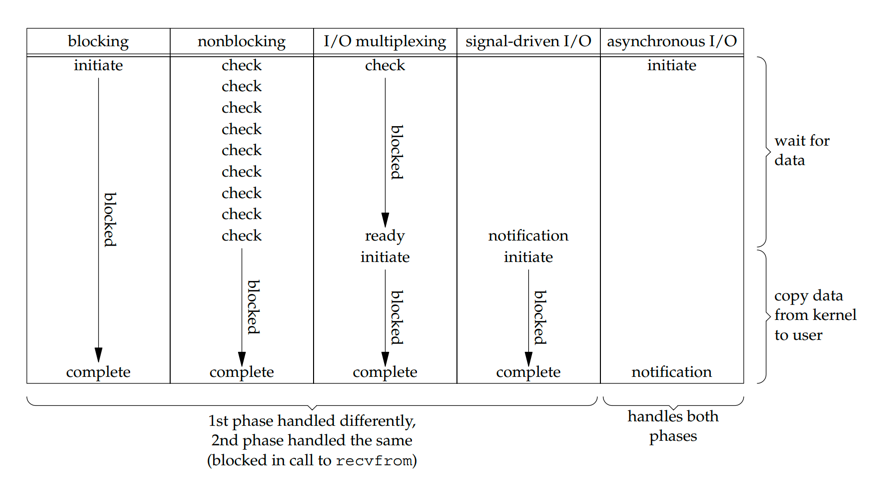

## 简介

I/O 多路复用通常用于网络应用中的以下场景：
- 当客户端处理多个描述符（通常是交互式输入和网络套接字）时，应使用 I/O 多路复用。
- 客户端同时处理多个套接字是可能的，但很少见。
- 如果 TCP 服务器同时处理监听套接字和已连接的套接字，通常使用 I/O 多路复用。
- 如果服务器同时处理 TCP 和 UDP，通常使用 I/O 多路复用。
- 如果服务器处理多个服务以及可能的多种协议，通常使用 I/O 多路复用。

I/O 多路复用不仅限于网络编程。许多非平凡的应用也需要这些技术。

## I/O 模型

在描述 select 和 poll 之前，我们需要退后一步，从更宏观的角度审视 Unix 下可用的五种 I/O 模型的基本区别：
- 阻塞 I/O（blocking I/O）
- 非阻塞 I/O（nonblocking I/O）
- I/O 多路复用（select 和 poll）
- 信号驱动 I/O（SIGIO）
- 异步 I/O（POSIX aio_ 函数）

图来自 UNP：

图 1：五种 I/O 模型对比

输入操作通常有两个不同的阶段：
1. 等待数据准备好
2. 将数据从内核复制到进程

对于套接字上的输入操作，第一步通常涉及等待数据到达网络。
当数据包到达时，它被复制到内核的缓冲区中。第二步是将这些数据从内核缓冲区复制到我们的应用程序缓冲区。

前四种模型的主要区别在于第一阶段，因为前四种模型的第二阶段是相同的：当数据从内核复制到调用者的缓冲区时，进程在 recvfrom 调用中被阻塞。
而异步 I/O 处理了两个阶段，与前四种模型不同。

> [!NOTE]
> 
> POSIX 对这两个术语的定义如下：
> - 同步 I/O 操作会导致请求进程阻塞，直到该 I/O 操作完成。
> - 异步 I/O 操作不会导致请求进程阻塞。

根据这些定义，前四种 I/O 模型——阻塞、非阻塞、I/O 多路复用和信号驱动 I/O——都是同步的，因为实际的 I/O 操作（recvfrom）会阻塞进程。
只有异步 I/O 模型匹配异步 I/O 的定义。

## select

> 参见 [Linux select](/docs/CS/OS/Linux/Calls.md?id=select)

poll 描述fd的方式和select不同
没有最大数量限制

## 链接
- [计算机网络](/docs/CS/CN/CN.md)
