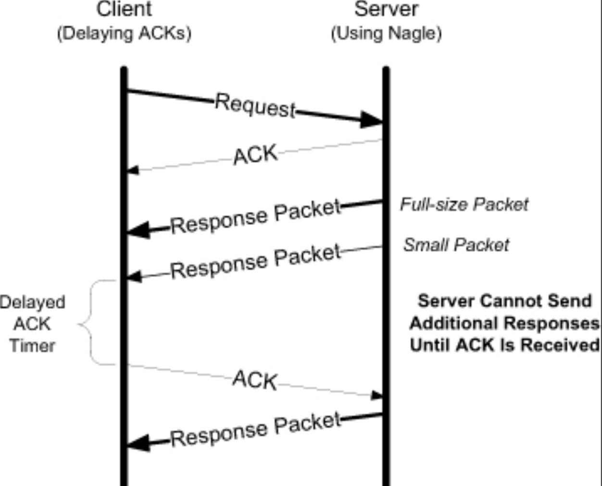

## Introduction

The Transmission Control Protocol (TCP) is intended for use as a highly reliable host-to-host protocol between hosts in packet-switched computer communication networks, and in interconnected systems of such networks.

```
                           Protocol Layering

                        +---------------------+
                        |     higher-level    |
                        +---------------------+
                        |        TCP          |
                        +---------------------+
                        |  internet protocol  |
                        +---------------------+
                        |communication network|
                        +---------------------+
```

> See [Linux TCP](/docs/CS/OS/Linux/TCP.md)

### Purpose

The primary purpose of the TCP is to provide reliable, securable logical circuit or connection service between pairs of processes.
It provides reliable delivery of data or reliable notification of failure.
To provide this service on top of a less reliable internet communication system requires facilities in the following areas:

- Basic Data Transfer
- Reliability
- Flow Control
- Multiplexing
- Connections
- Precedence and Security

### Connections

To identify the separate data streams that a TCP may handle, the TCP provides a port identifier.  Since port identifiers are selected  independently by each TCP they might not be unique.  To provide for  unique addresses within each TCP, we concatenate an internet address  identifying the TCP with a port identifier to create a [socket]() which will be unique throughout all networks connected together.

A connection is fully specified by the pair of sockets at the ends.  A  local socket may participate in many connections to different foreign  sockets.  A connection can be used to carry data in both directions, that is, it is `"full duplex"`.

The procedures to establish connections utilize the synchronize (SYN)  control flag and involves an exchange of three messages.  This  exchange has been termed a `three-way hand shake `.

### Relation to Other Protocols

The following diagram illustrates the place of the TCP in the protocol  hierarchy:

```
      
       +------+ +-----+ +-----+       +-----+  
       |Telnet| | FTP | |Voice|  ...  |     |  Application Level 
       +------+ +-----+ +-----+       +-----+  
             |   |         |             |   
            +-----+     +-----+       +-----+  
            | TCP |     | RTP |  ...  |     |  Host Level  
            +-----+     +-----+       +-----+  
               |           |             |   
            +-------------------------------+  
            |    Internet Protocol & ICMP   |  Gateway Level   
            +-------------------------------+  
                           |             
              +---------------------------+  
              |   Local Network Protocol  |    Network Level   
              +---------------------------+  

                         Protocol Relationships
```

## Header Format

```
    0                   1                   2                   3
    0 1 2 3 4 5 6 7 8 9 0 1 2 3 4 5 6 7 8 9 0 1 2 3 4 5 6 7 8 9 0 1
   +-+-+-+-+-+-+-+-+-+-+-+-+-+-+-+-+-+-+-+-+-+-+-+-+-+-+-+-+-+-+-+-+
   |          Source Port          |       Destination Port        |
   +-+-+-+-+-+-+-+-+-+-+-+-+-+-+-+-+-+-+-+-+-+-+-+-+-+-+-+-+-+-+-+-+
   |                        Sequence Number                        |
   +-+-+-+-+-+-+-+-+-+-+-+-+-+-+-+-+-+-+-+-+-+-+-+-+-+-+-+-+-+-+-+-+
   |                    Acknowledgment Number                      |
   +-+-+-+-+-+-+-+-+-+-+-+-+-+-+-+-+-+-+-+-+-+-+-+-+-+-+-+-+-+-+-+-+
   |  Data |           |U|A|P|R|S|F|                               |
   | Offset| Reserved  |R|C|S|S|Y|I|            Window             |
   |       |           |G|K|H|T|N|N|                               |
   +-+-+-+-+-+-+-+-+-+-+-+-+-+-+-+-+-+-+-+-+-+-+-+-+-+-+-+-+-+-+-+-+
   |           Checksum            |         Urgent Pointer        |
   +-+-+-+-+-+-+-+-+-+-+-+-+-+-+-+-+-+-+-+-+-+-+-+-+-+-+-+-+-+-+-+-+
   |                    Options                    |    Padding    |
   +-+-+-+-+-+-+-+-+-+-+-+-+-+-+-+-+-+-+-+-+-+-+-+-+-+-+-+-+-+-+-+-+
   |                             data                              |
   +-+-+-+-+-+-+-+-+-+-+-+-+-+-+-+-+-+-+-+-+-+-+-+-+-+-+-+-+-+-+-+-+

                            TCP Header Format

          Note that one tick mark represents one bit position.
```


| Name                  | Length   | Description                                                                                                                                                                                                        |  |
| ----------------------- | ---------- | -------------------------------------------------------------------------------------------------------------------------------------------------------------------------------------------------------------------- | -- |
| Source Port           | 16 bits  | The source port number.                                                                                                                                                                                            |  |
| Destination Port      | 16 bits  | The destination port number..                                                                                                                                                                                      |  |
| Sequence Number       | 32 bits  | The sequence number of the first data octet in this segment (except     when SYN is present). If SYN is present the sequence number is the     initial sequence number (ISN) and the first data octet is ISN+1.    |  |
| Acknowledgment Number | 32 bits  | If the ACK control bit is set this field contains the value of the     next sequence number the sender of the segment is expecting to     receive.  Once a connection is established this is always sent.          |  |
| Data Offset           | 4 bits   | The number of 32 bit words in the TCP Header.  This indicates where the data begins.  The TCP header (even one including options) is an     integral number of 32 bits long.                                       |  |
| Reserved              | 6 bits   |                                                                                                                                                                                                                    |  |
| Control Bits          | 6 bits   | URG:  Urgent Pointer field significant     ACK:  Acknowledgment field significant     PSH:  Push Function     RST:  Reset the connection     SYN:  Synchronize sequence numbers     FIN:  No more data from sender |  |
| Window                | 16 bits  | The number of data octets beginning with the one indicated in the     acknowledgment field which the sender of this segment is willing to     accept.                                                              |  |
| Checksum              | 16 bits  |                                                                                                                                                                                                                    |  |
| Urgent Pointer        | 16 bits  |                                                                                                                                                                                                                    |  |
| Options               | variable |                                                                                                                                                                                                                    |  |
| Padding               | variable | The TCP header padding is used to ensure that the TCP header ends     and data begins on a 32 bit boundary.  The padding is composed of     zeros.                                                                 |  |

### Options

The only options defined in the original TCP specification are the End of Option List (EOL), the No Operation (NOP), and the Maximum Segment Size (MSS) options.
Since then, several options have been defined. The entire list is maintained by the IANA [TPARAMS].

Every option begins with a 1-byte kind that specifies the type of option.
Options that are not understood are simply ignored, according to [RFC1122]. The options with a kind value of 0 and 1 occupy a single byte.
The other options have a len byte that follows the kind byte. The length is the total length, including the kind and len bytes.
The reason for the NOP option is to allow the sender to pad fields to a multiple of 4 bytes, if it needs to.
Remember that the TCP header’s length is always required to be a multiple of 32 bits because the TCP Header Length field uses that unit.
The EOL option indicates the end of the list and that no further processing of the options list is to be performed.

#### MSS Option

Maximum Segment Size

#### SACK Options

Selective Acknowledgment

#### Window Scale Option

Window Scale(WSCALE or WSOPT)

#### PAWS option

Timestamps Option and Protection against Wrapped Sequence Numbers

The Timestamps option (sometimes called the Timestamp option and written as TSOPT or TSopt) lets the sender place two 4-byte timestamp values in every segment.
The receiver reflects these values in the acknowledgment, allowing the sender to calculate an estimate of the connection’s RTT for each ACK received.
The main reason for wishing to calculate a good estimate of the connection’s RTT is to set the retransmission timeout, which tells TCP when it should try resending a segment that is likely lost.

## Connection Establishment and Termination

TCP is a unicast *connection-oriented* protocol. Before either end can send data to the other, a connection must be established between them.
A TCP connection is defined to be a 4-tuple consisting of two IP addresses and two port numbers. More precisely, it is a pair of *endpoints* or *sockets* where each endpoint is identified by an (IP address, port number) pair.
A connection typically goes through three phases: setup, data transfer (called established), and teardown (closing).


### Three-Way Handshake

The following scenario occurs when a TCP connection is established:

The server must be prepared to accept an incoming connection. This is normally done by calling socket, bind, and listen and is called a passive open.

1. The client issues an active open by calling connect.
   This causes the client TCP to send a ‘‘synchronize’’ (SYN) segment, which tells the server the client’s initial sequence number for the data that the client will send on the connection.
   Normally, there is no data sent with the SYN; it just contains an IP header, a TCP header, and possible TCP options (which we will talk about shortly).
2. The server must acknowledge (ACK) the client’s SYN and the server must also send its own SYN containing the initial sequence number for the data that the server will send on the connection.
   The server sends its SYN and the ACK of the client’s SYN in a single segment.
3. The client must acknowledge the server’s SYN.

The minimum number of packets required for this exchange is three; hence, this is called TCP’s *three-way handshake*.
Its main purposes are to let each end of the connection know that a connection is starting and the special details that are carried as options, and to exchange the ISNs.

Since a SYN occupies one byte of the sequence number space, the acknowledgment number in the ACK of each SYN is the initial sequence number plus one.
Similarly, the ACK of each FIN is the sequence number of the FIN plus one.

ISN based on the timestamp, see RFC1948

- syn queue
- accept queue
- fast open

#### Timeout of Connection Establishment


| Retry   | File Settings                             | Default Value |
| --------- | ------------------------------------------- | --------------- |
| SYN     | cat /proc/sys/net/ipv4/tcp_syn_retries    | 5             |
| SYN+ACK | cat /proc/sys/net/ipv4/tcp_synack_retries | 5             |

RFC1122 says the minimum retry MUST be at least 180secs.
Nevertheless this value is corresponding to 63secs of retransmission with the current initial RTO.

RTO(Retransmission Timeout) 1 + 2 <<< (n-1)

if RTO very large, the actual reties will < setting retries

```c
#define TCP_RTO_MAX	((unsigned)(120*HZ))
#define TCP_RTO_MIN	((unsigned)(HZ/5))
```

### Connection Termination

While it takes three segments to establish a connection, it takes four to terminate a connection.

1. One application calls close first, and we say that this end performs the active close.
   This end’s TCP sends a FIN segment, which means it is finished sending data.
2. The other end that receives the FIN performs the passive close. The received FIN is acknowledged by TCP.
   The receipt of the FIN is also passed to the application as an end-of-file (after any data that may have already been queued for the application to receive),
   since the receipt of the FIN means the application will not receive any additional data on the connection.
3. Sometime later, the application that received the end-of-file will close its socket. This causes its TCP to send a FIN.
4. The TCP on the system that receives this final FIN (the end that did the active close) acknowledges the FIN.

Since a FIN and an ACK are required in each direction, four segments are normally required.
We use the qualifier ‘‘normally’’ because in some scenarios, the FIN in Step 1 is sent with data.
Also, the segments in Steps 2 and 3 are both from the end performing the passive close and could be combined into one segment.

Between Steps 2 and 3 it is possible for data to flow from the end doing the passive close to the end doing the active close. This is called a *half-close*.

The sending of each FIN occurs when a socket is closed.
We indicated that the application calls close for this to happen, but realize that when a Unix process terminates,
either voluntarily (calling exit or having the main function return) or involuntarily (receiving a signal that terminates the process),
all open descriptors are closed, which will also cause a FIN to be sent on any TCP connection that is still open.

> [!NOTE]
>
> Either the client or the server—can perform the active close. Often the client performs the active close, but with some protocols (notably HTTP/1.0), the server performs the active close.

- fin retry
- fin_wait2 wait time
- time_wait limit

#### Half Close

shutdown

- SHUT_RD
- SHUT_WR
- SHUT_RDWR

### Simultaneous Open and Close

A simultaneous open requires the exchange of four segments, one more than the normal three-way handshake.

With a simultaneous close the same number of segments are exchanged as in the normal close. The only real difference is that the segment sequence is interleaved instead of sequential.

### Connection State

A connection progresses through a series of states during its lifetime.The states are:  LISTEN, SYN-SENT, SYN-RECEIVED, ESTABLISHED, FIN-WAIT-1, FIN-WAIT-2, CLOSE-WAIT, CLOSING, LAST-ACK, TIME-WAIT,
and the fictional state CLOSED.CLOSED is fictional because it represents the state when there is no TCB, and therefore, no connection.Briefly the meanings of the states are:

- LISTEN - represents waiting for a connection request from any remote TCP and port.
- SYN-SENT - represents waiting for a matching connection request after having sent a connection request.
- SYN-RECEIVED - represents waiting for a confirming connection request acknowledgment after having both received and sent a connection request.
- ESTABLISHED - represents an open connection, data received can be delivered to the user.  The normal state for the data transfer phase of the connection.
- FIN-WAIT-1 - represents waiting for a connection termination request from the remote TCP, or an acknowledgment of the connection termination request previously sent.
- FIN-WAIT-2 - represents waiting for a connection termination request from the remote TCP.
- CLOSE-WAIT - represents waiting for a connection termination request from the local user.
- CLOSING - represents waiting for a connection termination request acknowledgment from the remote TCP.
- LAST-ACK - represents waiting for an acknowledgment of the connection termination request previously sent to the remote TCP(which includes an acknowledgment of its connection termination request).
- TIME-WAIT - represents waiting for enough time to pass to be sure the remote TCP received the acknowledgment of its connection termination request.
- CLOSED - represents no connection state at all.


#### CLOSE_WAIT

too much CLOSE_WAIT
cause:

1. forget invoke close/shutdown to send FIN
2. backlog too large

#### FIN_WAIT_2

Only when the application performs this close (and its FIN is received) does the active closing TCP move from the FIN_WAIT_2 to the TIME_WAIT state.
This means that one end of the connection can remain in this state forever.
The other end is still in the CLOSE_WAIT state and can remain there forever, until the application decides to issue its close.


Many implementations prevent this infinite wait in the FIN_WAIT_2 state as follows:
If the application that does the active close does a complete close, not a half-close indicating that it expects to receive data, a **timer** is set.
If the connection is idle when the timer expires, TCP moves the connection into the CLOSED state.
In Linux, the variable `net.ipv4.tcp_fin_timeout` can be adjusted to control the number of seconds to which the timer is set. Its default value is 60s.
When a connection moves from the FIN_WAIT_1 state to the FIN_WAIT_2 state and the connection cannot receive any more data
(implying the process called close, instead of taking advantage of TCP’s half-close with shutdown), this timer is set to 10 minutes.
When this timer expires it is reset to 75 seconds, and when it expires the second time the connection is dropped.
The purpose of this timer is to avoid leaving a connection in the FIN_WAIT_2 state forever, if the other end never sends a FIN.

#### TIME_WAIT

The way in which a packet gets ‘‘lost’’ in a network is usually the result of routing anomalies.
This original packet is called a lost duplicate or a wandering duplicate. TCP must handle these duplicates.

There are two reasons for the TIME_WAIT state:

1. To implement TCP’s full-duplex connection termination reliably
2. To allow old duplicate segments to expire in the network

The first reason can be explained by assuming that the final ACK is lost. The server will resend its final FIN, so the client must maintain state information, allowing it to resend the final ACK.
If it did not maintain this information, it would respond with an RST (a different type of TCP segment), which would be interpreted by the server as an error.

The connection is closed and then sometime later, we establish another connection between the same IP addresses and ports.
This latter connection is called an incarnation of the previous connection since the IP addresses and ports are the same.
TCP must prevent old duplicates from a connection from reappearing at some later time and being misinterpreted as belonging to a new incarnation of the same connection.
To do this, TCP will not initiate a new incarnation of a connection that is currently in the TIME_WAIT state.

> There is an exception to this rule.
> Berkeley-derived implementations will initiate a new incarnation of a connection that is currently in the TIME_WAIT state if the arriving SYN has a sequence number that is ‘‘greater than’’ the ending sequence number from the previous incarnation.

The timer is set to 1 minute (Net/3 uses an MSL of 30 seconds) when the connection enters the TIME_WAIT state and when it expires, the TCP control block and Internet PCB are deleted, allowing that socket pair to be reused.

orphan connection(use close) FIN_WAIT2 timeout tcp_fin_timeout s

```shell
cat /proc/sys/net/ipv4/tcp_fin_timeout	#60
```

```c
#define TCP_TIMEWAIT_LEN (60*HZ)
```

tcp_tw_reuse - INTEGER

Enable reuse of TIME-WAIT sockets for new connections when it is safe from protocol viewpoint.
It should not be changed without advice/request of technical experts.
- 0 - disable
- 1 - global enable
- 2 - enable for loopback traffic only, default


### Reset Segments

#### Nonexistent Port

In the case of UDP, we saw that an ICMP Destination Unreachable (Port Unreachable) message is generated when a datagram arrives for a destination port that is not in use. TCP uses a reset segment instead.

#### Aborting a Connection

Aborting a connection provides two features to the application:

1. any queued data is thrown away and a reset segment is sent immediately
2. the receiver of the reset can tell that the other end did an abort instead of a normal close.

The API being used by the application must provide a way to generate the abort instead of a normal close.

#### Half-Open Connections

A TCP connection is said to be half-open if one end has closed or aborted the connection without the knowledge of the other end.
This can happen anytime one of the peers crashes. As long as there is no attempt to transfer data across a half-open connection, the end that is still up does not detect that the other end has crashed.

Another common cause of a half-open connection is when one host is powered off instead of shut down properly.

#### TWA

As mentioned previously, the TIME_WAIT state is intended to allow any datagrams lingering from a closed connection to be discarded.
During this period, the waiting TCP usually has little to do; it merely holds the state until the 2MSL timer expires.
If, however, it receives certain segments from the connection during this period, or more specifically an RST segment, it can become desynchronized. This is called **TIME-WAIT Assassination (TWA)**.

This is no problem for the server, but it causes the client to prematurely transition from TIME_WAIT to CLOSED.
Most systems avoid this problem by simply not reacting to reset segments while in the TIME_WAIT state.

The TCP mechanisms to protect against old duplicate segments, below if in TIME_WAIT:

**Unreliable:** TIME-WAIT state removes the hazard of old duplicates for "fast" or "long" connections, in which clock-driven ISN selection is unable to prevent overlap of the old and new sequence spaces. The TIME-WAIT delay allows all old duplicate segments time enough to die in the Internet before the connection is reopened.

TIME-WAIT state can be prematurely terminated ("assassinated") by an old duplicate data or ACK segment from the current or an earlier incarnation of the same connection.  We refer to this as "`TIME-WAIT Assassination`" (**TWA**).

```
       TCP A                                                TCP B

   1.  ESTABLISHED                                          ESTABLISHED

       (Close)
   2.  FIN-WAIT-1  --> <SEQ=100><ACK=300><CTL=FIN,ACK>  --> CLOSE-WAIT

   3.  FIN-WAIT-2  <-- <SEQ=300><ACK=101><CTL=ACK>      <-- CLOSE-WAIT

                                                            (Close)
   4.  TIME-WAIT   <-- <SEQ=300><ACK=101><CTL=FIN,ACK>  <-- LAST-ACK

   5.  TIME-WAIT   --> <SEQ=101><ACK=301><CTL=ACK>      --> CLOSED

  - - - - - - - - - - - - - - - - - - - - - - - - - - - -

   5.1. TIME-WAIT   <--  <SEQ=255><ACK=33> ... old duplicate

   5.2  TIME-WAIT   --> <SEQ=101><ACK=301><CTL=ACK>    -->  ????

   5.3  CLOSED      <-- <SEQ=301><CTL=RST>             <--  ????
      (prematurely)

                         TWA Example
```

If the connection is immediately reopened after a TWA event, the new incarnation will be exposed to old duplicate segments (except for the initial <SYN> segment, which is handled by the 3-way handshake).  There are three possible hazards that result:

- Old duplicate data may be accepted erroneously.
- The new connection may be de-synchronized, with the two ends in permanent disagreement on the state.  Following the spec of RFC-793, this desynchronization results in an infinite ACK loop.  (It might be reasonable to change this aspect of RFC- 793 and kill the connection instead.) This hazard results from acknowledging something that was not sent.  This may result from an old duplicate ACK or as a side-effect of hazard H1.
- The new connection may die. A duplicate segment (data or ACK) arriving in SYN-SENT state may kill the new connection after it has apparently opened successfully.

##### Fixes for TWA Hazards

We discuss three possible fixes to TCP to avoid these hazards.

- Ignore RST segments in TIME-WAIT state. If the 2 minute MSL is enforced, this fix avoids all three hazards.
  This is the simplest fix.  One could also argue that it is formally the correct thing to do; since allowing time for old duplicate segments to die is one of TIME-WAIT state's functions, 
  the state should not be truncated by a RST segment. [See Linux](/d)
- Use PAWS to avoid the hazards.
- Use 64-bit Sequence Numbers

TIME_WAIT数量超过`tcp_max_tw_buckets`后连接就不经过此状态而直接关闭

```shell
cat /proc/sys/net/ipv4/tcp_max_tw_buckets #5000
```

`tcp_tw_reuse`适用于发起连接的一方(Client use connect())，需结合`tcp_timestamps`使用, 1s后可复用（防止最后的ack丢失）
服务端若要复用，用于连接的socket(not listening socket)配置`SO_REUSEADDR`和`tcp_timestamps`使用，参考netty start

```shell
cat /proc/sys/net/ipv4/tcp_tw_reuse #3
cat /proc/sys/net/ipv4/tcp_timestamps #1 enable
```

see [RFC 6191 - Reducing the TIME-WAIT State Using TCP Timestamps](https://datatracker.ietf.org/doc/html/rfc6191)

```shell
net.ipv4.tcp_tw_recycle # 1 enable quick recycle TIME_WAIT sockets
```

### Connection Queue

New connections may be in one of two distinct states before they are made available to an application.

- The first case is connections that have not yet completed but for which a SYN has been received (these are in the SYN_RCVD state).
- The second case is connections that have already completed the three-way handshake and are in the ESTABLISHED state but have not yet been accepted by the application.

Internally, the operating system ordinarily has two distinct connection queues, one for each of these cases.

In modern Linux kernels this behavior has been changed to be the number of connections in the second case (ESTABLISHED connections).
The application can therefore limit the number of fully formed connections waiting for it to handle.
In Linux, then, the following rules apply:

1. When a connection request arrives (i.e., the SYN segment), the system-wide parameter `net.ipv4.tcp_max_syn_backlog` is checked (default 1024).
   If the number of connections in the SYN_RCVD state would exceed this threshold, the incoming connection is rejected.
2. Each listening endpoint has a fixed-length queue of connections that have been completely accepted by TCP (i.e., the three-way handshake is complete) but not yet accepted by the application.
   The application specifies a limit to this queue, commonly called the backlog. This backlog must be between 0 and a system-specific maximum called `net.core.somaxconn`, inclusive (default 128).
   Keep in mind that this backlog value specifies only the maximum number of queued connections for one listening endpoint, all of which have already been accepted by TCP and are waiting to be accepted by the application.
   This backlog has no effect whatsoever on the maximum number of established connections application.
   This backlog has no effect whatsoever on the maximum number of established connections allowed by the system, or on the number of clients that a concurrent server can handle concurrently.
3. If there is room on this listening endpoint’s queue for this new connection, the TCP module ACKs the SYN and completes the connection.
   The server application with the listening endpoint does not see this new connection until the third segment of the three-way handshake is received.
   Also, the client may think the server is ready to receive data when the client’s active open completes successfully, before the server application has been notified of the new connection.
   If this happens, the server’s TCP just queues the incoming data.
4. If there is not enough room on the queue for the new connection, the TCP delays responding to the SYN, to give the application a chance to catch up.
   Linux is somewhat unique in this behavior—it persists in not ignoring incoming connections if it possibly can.
   If the `net.ipv4.tcp_abort_on_overflow` system control variable is set, new incoming connections are reset with a reset segment.

#### syn queue

```shell
cat /proc/sys/net/ipv4/tcp_max_syn_backlog	#1024
```

```shell
 # get current syn queue size
 netstat -natp | grep SYN_RECV | wc -l
```

use [`hping3`] mock syn attack

**tcp_syncookies when syn queue is overflow**

```shell
cat /proc/sys/net/ipv4/tcp_syncookies	#1
```

check the syn sockets dropped

```shell
netstat -s|grep "SYNs to LISTEN"
```

**prevent syn attack**

1. expand syn queue and accept queue size
2. enable tcp_syncookies
3. reduce `tcp_synack_retries`to fast quit connection from SYN_RECV

#### accept queue

```shell
# -l show the listening socket
# -n no expain server name
# -t only tcp
ss -lnt
```


|        | in Listening              | non-listening             |
| -------- | --------------------------- | --------------------------- |
| Recv-Q | current accept queue size | recv & not read byte size |
| Send-Q | max accept queue size     | send & not ack byte size  |

use[`wrk`](https://github.com/wg/wrk) to test accept queue overflow

```shell
# -t thread number
# -c connection count
# -d continue time
wrk -t 6 -c 30000 -d 60s http://xxx.xxx.xxx.xxx 
```

if see `connection reset by peer`, might be accept queue overflow, default will be connection timeout

> If listening service is too slow to accept new connections, reset them.
> Default state is FALSE. It means that if overflow occurred due to a burst, connection will recover. E
> nable this option _only_ if you are really sure that listening daemon cannot be tuned to accept connections faster.
> Enabling this option can harm clients of your server.

```shell
# 0 dicard, 1 dicard and return RST
cat /proc/sys/net/ipv4/tcp_abort_on_overflow
```

```shell
netstat -s|grep overflowed
```

### Fast Open

TCP Fast Open allows to reduce latency and significantly improve user-experience.
However, naive firewalls and bad Intrusion Detection Systems got in our way
Bad Middleboxes and Firewalls respond badly to TCP Fast Open

- Suppress TCP options
- Drop packets
- Mark entire connection as “invalid”
- Blackhole the clients


The key component of TFO is the Fast Open Cookie (cookie), a message authentication code (MAC) tag generated by the server.  
The client requests a cookie in one regular TCP connection, then uses it for future TCP connections to exchange data during the 3WHS:

Requesting a Fast Open Cookie:

1. The client sends a SYN with a Fast Open option with an empty
   cookie field to request a cookie.
2. The server generates a cookie and sends it through the Fast Open
   option of a SYN-ACK packet.
3. The client caches the cookie for future TCP Fast Open connections
   (see below).

Requesting Fast Open Cookie in connection 1:

```
   TCP A (Client)                                      TCP B (Server)
   ______________                                      ______________
   CLOSED                                                      LISTEN

   #1 SYN-SENT       ----- <SYN,CookieOpt=NIL>  ---------->  SYN-RCVD

   #2 ESTABLISHED    <---- <SYN,ACK,CookieOpt=C> ----------  SYN-RCVD
```

Performing TCP Fast Open in connection 2:

```
   TCP A (Client)                                      TCP B (Server)
   ______________                                      ______________
   CLOSED                                                      LISTEN

   #1 SYN-SENT       ----- <SYN=x,CookieOpt=C,DATA_A> ---->  SYN-RCVD

   #2 ESTABLISHED    <---- <SYN=y,ACK=x+len(DATA_A)+1> ----  SYN-RCVD

   #3 ESTABLISHED    <---- <ACK=x+len(DATA_A)+1,DATA_B>----  SYN-RCVD

   #4 ESTABLISHED    ----- <ACK=y+1>--------------------> ESTABLISHED

   #5 ESTABLISHED    --- <ACK=y+len(DATA_B)+1>----------> ESTABLISHED
```

```
                                   +-+-+-+-+-+-+-+-+-+-+-+-+-+-+-+-+
                                   |      Kind     |    Length     |
   +-+-+-+-+-+-+-+-+-+-+-+-+-+-+-+-+-+-+-+-+-+-+-+-+-+-+-+-+-+-+-+-+
   |                                                               |
   ~                            Cookie                             ~
   |                                                               |
   +-+-+-+-+-+-+-+-+-+-+-+-+-+-+-+-+-+-+-+-+-+-+-+-+-+-+-+-+-+-+-+-+

   Kind            1 byte: value = 34
   Length          1 byte: range 6 to 18 (bytes); limited by
                           remaining space in the options field.
                           The number MUST be even.
   Cookie          0, or 4 to 16 bytes (Length - 2)
```

[TCP Fast Open](http://conferences.sigcomm.org/co-next/2011/papers/1569470463.pdf)

```shell
#linux
cat /proc/sys/net/ipv4/tcp_fastopen	#1
```

[Netty TPO](/docs/CS/Java/Netty/TPO.md)

### Attacks Involving TCP Connection Management

A SYN flood is a TCP DoS attack whereby one or more malicious clients generate a series of TCP connection attempts (SYN segments) and send them at a server, often with a “spoofed” (e.g., random) source IP address.
The server allocates some amount of connection resources to each partial connection.
Because the connections are never established, the server may start to deny service to future legitimate requests because its memory is exhausted holding state for many half-open connections.

One mechanism invented to deal with this issue is called SYN cookies [RFC4987].
The main insight with SYN cookies is that most of the information that would be stored for a connection when a SYN arrives could be encoded inside the Sequence Number field supplied with the SYN + ACK.
The target machine using SYN cookies need not allocate any storage for the incoming connection request—it allocates real memory only once the SYN + ACK segment has itself been acknowledged (and the initial sequence number is returned).
In that case, all the vital connection parameters can be recovered and the connection can be placed in the ESTABLISHED state.

Another type of degradation attack on TCP involves PMTUD. In this case, an attacker fabricates an ICMP PTB message containing a very small MTU value (e.g., 68 bytes).
This forces the victim TCP to attempt to fit its data into very small packets, greatly reducing its performance.

Another type of attack involves disrupting an existing TCP connection and possibly taking it over (called hijacking).
These forms of attacks usually involve a first step of “desynchronizing” the two TCP endpoints so that if they were to talk to each other, they would be using invalid sequence numbers.
They are particular examples of sequence number attacks [RFC1948].
They can be accomplished in at least two ways: by causing invalid state transitions during connection establishment (similar to [TWA](/docs/CS/CN/TCP.md?id=time-wait-assassination-twa)), and by generating extra data while in the ESTABLISHED state.

A collection of attacks generally called spoofing attacks involve TCP segments that have been specially tailored by an attacker to disrupt or alter the behavior of an existing TCP connection.
An attacker can generate a spoofed reset segment and send it to an existing TCP endpoint.
Provided the connection 4-tuple and checksum are correct, and the sequence number is in range, the reset generally results in a connection abort at either endpoint.
Other types of segments (SYNs, even ACKs) can also be spoofed (and combined with flooding attacks), causing myriad problems.
There are spoofing attacks that are not part of the TCP protocol yet can affect TCP’s operation. For example, ICMP can be used to modify PMTUD behavior.
It can also be used to indicate that a port or host is not available, and this often causes a TCP connection to be terminated.
Many of these attacks are described in [RFC5927], which also suggests a number of ways of improving robustness against spoofed ICMP messages.

## Timeout and Retransmission

The TCP protocol provides a reliable data delivery service between two applications using an underlying network layer (IP) that may lose, duplicate, or reorder packets.
In order to provide an error-free exchange of data, TCP resends data it believes has been lost.
To decide what data it needs to resend, TCP depends on a continuous flow of acknowledgments from receiver to sender.
When data segments or acknowledgments are lost, TCP initiates a retransmission of the data that has not been acknowledged.
TCP has two separate mechanisms for accomplishing retransmission, one based on time and one based on the structure of the acknowledgments.
The second approach is usually much more efficient than the first.

Because TCP only acknowledges bytes up to the first missing byte in the stream, TCP is said to provide cumulative acknowledgments.

### Retransmission Timeout

TCP sets a timer when it sends data, and if the data is not acknowledged when the timer expires, a timeout or timer-based retransmission of data occurs.
The timeout occurs after an interval called the retransmission timeout (RTO).

This doubling of time between successive retransmissions is called a binary exponential backoff, and we saw it during a failed TCP connection establishment attempt.

Threshold R1 indicates the number of tries TCP will make (or the amount of time it will wait) to resend a segment before passing “negative advice” to the IP layer (e.g., causing it to reevaluate the IP route it is using).
Threshold R2 (larger than R1) dictates the point at which TCP should abandon the connection. These thresholds are suggested to be at least three retransmissions and 100s, respectively.
For connection establishment (sending SYN segments), these values may be different from those for data segments, and the R2 value for SYN segments is required to be at least 3 minutes.

In Linux, the R1 and R2 values for regular data segments are available to be changed by applications or can be changed using the system-wide configuration variables `net.ipv4.tcp_retries1` and `net.ipv4.tcp_retries2`, respectively.
These are measured in the number of retransmissions, and not in units of time. The default value for tcp_retries2 is 15, which corresponds roughly to 13–30 minutes, depending on the connection’s RTO. The default value for net.ipv4.tcp_retries1 is 3.
For SYN segments, see [Timeout of Connection Establishment](/docs/CS/CN/TCP.md?id=timeout-of-connection-establishment).

> From [ip-sysctl.txt](https://www.kernel.org/doc/Documentation/networking/ip-sysctl.txt)
>
> tcp_retries1 - INTEGER
>
> This value influences the time, after which TCP decides, that something is wrong due to unacknowledged RTO retransmissions, and reports this suspicion to the network layer.
> See tcp_retries2 for more details.
> RFC 1122 recommends at least 3 retransmissions, which is the default.
>
> tcp_retries2 - INTEGER
>
> This value influences the timeout of an alive TCP connection, when RTO retransmissions remain unacknowledged.
> Given a value of N, a hypothetical TCP connection following exponential backoff with an initial RTO of TCP_RTO_MIN would retransmit N times before killing the connection at the (N+1)th RTO.
>
> The default value of 15 yields a hypothetical timeout of **924.6 seconds** and is a lower bound for the effective timeout.
> TCP will effectively time out at the first RTO which exceeds the hypothetical timeout.
> RFC 1122 recommends at least 100 seconds for the timeout, which corresponds to a value of at least 8.

### Fast Retransmit

It has another way of initiating a retransmission called fast retransmission or fast retransmit, which usually happens without any delay.
Fast retransmit is based on inferring losses by noticing when TCP’s cumulative acknowledgment fails to advance in the ACKs received over time,
or when ACKs carrying selective acknowledgment information (SACKs) indicate that out-of-order segments are present at the receiver.
Generally speaking, when the sender believes that the receiver might be missing some data, a choice needs to be made between sending new (unsent) data and retransmitting.

The duplicate ACKs sent immediately when out-of-order data arrives are not delayed.
The reason is to let the sender know that a segment was received out of order, and to indicate what sequence number is expected (i.e., where the hole is).
When SACK is used, these duplicate ACKs typically contain SACK blocks as well, which can provide information about more than one hole.

The expected packet could be either missing or merely delayed.
Because we generally do not know which one, TCP waits for a small number of duplicate ACKs (called the duplicate ACK threshold or dupthresh) to be received before concluding that a packet has been lost and initiating a fast retransmit.
Traditionally, dupthresh has been a constant (with value 3), but some nonstandard implementations (including Linux) alter this value based on the current measured level of reordering.

A TCP sender observing at least dupthresh duplicate ACKs retransmits one or more packets that appear to be missing without waiting for a retransmission timer to expire.
It may also send additional data that has not yet been sent. This is the essence of the fast retransmit algorithm.
Packet loss inferred by the presence of duplicate ACKs is assumed to be related to network congestion, and [congestion control](/docs/CS/CN/TCP.md?id=Congestion-Control) procedures are invoked along with fast retransmit.
Without SACK, no more than one segment is typically retransmitted until an acceptable ACK is received.
With SACK, ACKs contain additional information allowing the sender to fill more than one hole in the receiver per RTT.

### Spurious Timeouts

Under a number of circumstances, TCP may initiate a retransmission even when no data has been lost.
Such undesirable retransmissions are called *spurious retransmissions* and are caused by *spurious timeouts* (timeouts firing too early) and other reasons such as packet reordering, packet duplication, or lost ACKs.

### Packet Reordering and Duplication

We wish TCP to be able to distinguish between packets that are reordered or duplicated and those that are lost.

#### Reordering

Packet reordering can occur in an IP network because IP provides no guarantee that relative ordering between packets is maintained during delivery.

Reordering may take place in the forward path or the reverse path of a TCP connection (or in some cases both). The reordering of data segments has a somewhat different effect on TCP as does reordering of ACK packets.

If reordering takes place in the reverse (ACK) direction, it causes the sending TCP to receive some ACKs that move the window significantly forward followed by some evidently old redundant ACKs that are discarded.
This can lead to an unwanted burstiness (instantaneous high-speed sending) behavior in the sending pattern of TCP and also trouble in taking advantage of available network bandwidth, because of the behavior of TCP’s congestion control.

If reordering occurs in the forward direction, TCP may have trouble distinguishing this condition from loss.
Both loss and reordering result in the receiver receiving out-of-order packets that create holes between the next expected packet and the other packets received so far.
When reordering is moderate (e.g., two adjacent packets switch order), the situation can be handled fairly quickly.
When reorderings are more severe, TCP can be tricked into believing that data has been lost even though it has not.
This can result in spurious retransmissions, primarily from the fast retransmit algorithm.

#### Duplication

Although rare, the IP protocol may deliver a single packet more than one time.
This can happen, for example, when a link-layer network protocol performs a retransmission and creates two copies of the same packet.
When duplicates are created, TCP can become confused in some of the ways we have seen already.

The effect of packet 3 being duplicated is to produce a series of duplicate ACKs from the receiver.
This is enough to trigger a spurious fast retransmit, as the non-SACK sender may mistakenly believe that packets 5 and 6 have arrived earlier.
With SACK (and DSACK, in particular) this is more easily diagnosed at the sender. With DSACK, each of the duplicate ACKs for A3 contains DSACK information that segment 3 has already been received.
Furthermore, none of them contains an indication of any out-of-order data, meaning the arriving packets (or their ACKs) must have been duplicates. TCP can often suppress spurious retransmissions in such cases.

### Repacketization

When TCP times out and retransmits, it does not have to retransmit the identical segment.
Instead, TCP is allowed to perform repacketization, sending a bigger segment, which can increase performance. (Naturally, this bigger segment cannot exceed the MSS announced by the receiver and should not exceed the path MTU.)
This is allowed in the protocol because TCP identifies the data being sent and acknowledged by its byte number, not its segment (or packet) number.

### Attacks Involving TCP Retransmission

There is a class of DoS attack called low-rate DoS attacks [KK03].
In such an attack, an attacker sends bursts of traffic to a gateway or host, causing the victim system to experience a retransmission timeout.
Given an ability to predict when the victim TCP will attempt to retransmit, the attacker generates a burst of traffic at each retransmission attempt.
As a consequence, the victim TCP perceives congestion in the network, throttles its sending rate to near zero, keeps backing off its RTO according to Karn’s algorithm, and effectively receives very little network throughput.
The proposed mechanism to deal with this type of attack is to add randomization to the RTO, making it difficult for the attacker to guess the precise times when a retransmission will take place.

A related but distinct form of DoS attack involves slowing a victim TCP’s segments down so that the RTT estimate is too high.
Doing so causes the victim TCP to be less aggressive in retransmitting its own packets when they are lost.
The opposite attack is also possible: an attacker forges ACKs when data has been transmitted but has not actually arrived at the receiver yet.
In this case, the attacker can cause the victim TCP to believe that the connection RTT is significantly smaller than it really is, leading to an overaggressive TCP that creates numerous unwanted retransmissions.

## Data Flow and Window Management

### Delayed Acknowledgments

In many cases, TCP does not provide an ACK for every incoming packet. This is possible because of TCP’s cumulative ACK field.
Using a cumulative ACK allows TCP to intentionally delay sending an ACK for some amount of time, in the hope that it can combine the ACK it needs to send with some data the local application wishes to send in the other direction.
This is a form of piggybacking that is used most often in conjunction with bulk data transfers.
Obviously a TCP cannot delay ACKs indefinitely; otherwise its peer could conclude that data has been lost and initiate an unnecessary retransmission.

```shell
#linux
cat /proc/sys/net/ipv4/tcp_sack	#1
```

> [!Note]
>
> The Host Requirements RFC [RFC1122] states that TCP should implement a delayed ACK but the delay must be less than 500ms. Many implementations use a maximum of 200ms.

Delaying ACKs causes less traffic to be carried over the network than when ACKs are not delayed because fewer ACKs are used.
A ratio of 2 to 1 is fairly common for bulk transfers. The use of delayed ACKs and the maximum amount of time TCP is allowed to wait before sending an ACK can be configured, depending on the host operating system.
Linux uses a dynamic adjustment algorithm whereby it can change between ACKing every segment (called “quickack” mode) and conventional delayed ACK mode.

### Nagle Algorithm

The Nagle algorithm says that when a TCP connection has outstanding data that has not yet been acknowledged, small segments (those smaller than the SMSS) cannot be sent until all outstanding data is acknowledged.
Instead, small amounts of data are collected by TCP and sent in a single segment when an acknowledgment arrives.
This procedure effectively forces TCP into stop-and-wait behavior—it stops sending until an ACK is received for any outstanding data.
The beauty of this algorithm is that it is *self-clocking*: the faster the ACKs come back, the faster the data is sent.
On a comparatively high-delay WAN, where reducing the number of tinygrams is desirable, fewer segments are sent per unit time. Said another way, the RTT controls the packet sending rate.
This is the trade-off the Nagle algorithm makes: fewer and larger packets are used, but the required delay is higher.

If we consider what happens when the delayed ACK and Nagle algorithms are used together, we can construct an undesirable scenario.
Consider a client using delayed ACKs that sends a request to a server, and the server responds with an amount of data that does not quite fit inside a single packet.

The interaction between the Nagle algorithm and delayed ACKs



Here we see that the client, after receiving two packets from the server, withholds an ACK, hoping that additional data headed toward the server can be piggybacked.
Generally, TCP is required to provide an ACK for two received packets only if they are full-size, and they are not here.
At the server side, because the Nagle algorithm is operating, no additional packets are permitted to be sent to the client until an ACK is returned because at most one “small” packet is allowed to be outstanding.
The combination of delayed ACKs and the Nagle algorithm leads to a form of deadlock (each side waiting for the other) [MMSV99][MM01].
Fortunately, this deadlock is not permanent and is broken when the delayed ACK timer fires, which forces the client to provide an ACK even if the client has no additional data to send.
However, the entire data transfer becomes idle during this deadlock period, which is usually not desirable.
The Nagle algorithm can be disabled in such circumstances, as we saw with ssh.

#### TCP_NODELAY

If set, disable the Nagle algorithm. This means that segments are always sent as soon as possible, even if there is only a small amount of data.
When not set, data is buffered until there is a sufficient amount to send out, thereby avoiding the frequent sending of small packets, which results in poor utilization of the network.
This option is overridden by TCP_CORK; however, setting this option forces an explicit flush of pending output, even if TCP_CORK is currently set.
As currently implemented, there is a 200 millisecond ceiling on the time for which output is corked by *TCP_CORK*.

[Nagle's algorithm](https://en.wikipedia.org/wiki/Nagle's_algorithm) is a means of improving the efficiency of TCP/IP networks by reducing the number of packets that need to be sent over the network.

What Nagle's algorithm does is says:

- if there is unacked data sent, and if the write buffer in the kernel is smaller than the MTU, then wait a little to see if the application writes more data.
- If the write buffer reaches the MTU size then the data will be transmitted. If the in flight data is acked then the data will also be transmitted, even if it is smaller than the MTU.

Where MSS is the maximum segment size, the largest segment that can be sent on this connection, and the window size is the currently acceptable window of unacknowledged data, this can be written in pseudocode as

```
if there is new data to send then
    if the window size ≥ MSS and available data is ≥ MSS then
        send complete MSS segment now
    else
        if there is unconfirmed data still in the pipe then
            enqueue data in the buffer until an acknowledge is received
        else
            send data immediately
        end if
    end if
end if
```

> [!NOTE]
>
> The user-level solution is to avoid write–write–read sequences on sockets. Write–read–write–read is fine. Write–write–write is fine. But write–write–read is a killer.
> So, if you can, buffer up your little writes to TCP and send them all at once. Using the standard UNIX I/O package and flushing write before each read usually works.

The TCP delayed ack feature is again an attempt to minimize the number of small packets sent.
The way it works is a TCP packet can ack multiple data packets at once.
Therefore a TCP stack implementing the delayed ack feature may wait up to some amount of time before acking packets in the hope that it will be able to ack more packets at once.
On Linux this can cause up to a 40 ms delay when acking packets.
Again, this is usually a good thing since it decreases the number of packets that have to be sent (which is usually the limiting factor in network performance).

```shell
cat /boot/config-4.18.0-193.el8.x86_64 |grep 'CONFIG_HZ='
CONFIG_HZ=1000
```

40 ~ 200 ms

TCP_QUICKACK

An application that is very latency sensitive, particularly if it doesn't transmit a lot of data, can safely use TCP_NODELAY.

### Flow Control and Window Management

TCP implements flow control by including a window advertisement on every ACK it sends. Such window advertisements signal the peer TCP how much buffer space is left at the endpoint that sent the window advertisement ACK.
The maximum window advertisement is 65,535 bytes unless the Window Scale TCP option is used. In that case, the maximum window advertisement can be much larger (about 1GB).

#### Sliding Windows

Each endpoint of a TCP connection is capable of sending and receiving data.
The amount of data sent or received on a connection is maintained by a set of *window structures*. For each active connection, each TCP endpoint maintains a *send window structure* and a *receive window structure*.

##### sender-side

TCP maintains its window structures in terms of bytes (not packets).
The Window Size field contains a byte offset relative to the ACK number.
The sender computes its usable window, which is how much data it can send immediately. The usable window is the offered window minus the amount of data already sent but not yet acknowledged.

Over time this sliding window moves to the right, as the receiver acknowledges data. The relative motion of the two ends of the window increases or decreases the size of the window.
Three terms are used to describe the movement of the right and left edges of the window:

1. The window closes as the left edge advances to the right. This happens when data that has been sent is acknowledged and the window size gets smaller.
2. The window opens when the right edge moves to the right, allowing more data to be sent. This happens when the receiving process on the other end reads acknowledged data, freeing up space in its TCP receive buffer.
3. The window shrinks when the right edge moves to the left. The Host Requirements RFC [RFC1122] strongly discourages this, but TCP must be able to cope with it.

Because every TCP segment contains both an ACK number and a window advertisement, a TCP sender adjusts the window structure based on both values whenever an incoming segment arrives.
The left edge of the window cannot move to the left, because this edge is controlled by the ACK number received from the other end that is cumulative and never goes backward.
When the ACK number advances the window but the window size does not change (a common case), the window is said to advance or “slide” forward.
If the ACK number advances but the window advertisement grows smaller with other arriving ACKs, the left edge of the window moves closer to the right edge.
If the left edge reaches the right edge, it is called a zero window. This stops the sender from transmitting any data.
If this happens, the sending TCP begins to [probe the peer’s window]() to look for an increase in the offered window.

##### receiver-side

The receiver also keeps a window structure, which is somewhat simpler than the sender’s.
The receiver window structure keeps track of what data has already been received and ACKed, as well as the maximum sequence number it is willing to receive.
The TCP receiver depends on this structure to ensure the correctness of the data it receives.
In particular, it wishes to avoid storing duplicate bytes it has already received and ACKed, and it also wishes to avoid storing bytes that it should not have received (any bytes beyond the sender’s right window edge).

This structure also contains a left and right window edge like the sender’s window, but the in-window bytes need not be differentiated as they are in the sender’s window structure.
For the receiver, any bytes received with sequence numbers less than the left window edge are discarded as duplicates, and any bytes received with sequence numbers beyond the right window edge are discarded as out of scope.
Bytes arriving with any sequence number in the receive window range are accepted.
Note that the ACK number generated at the receiver may be advanced only when segments fill in directly at the left window edge because of TCP’s cumulative ACK structure.
With selective ACKs, other in-window segments can be acknowledged using the TCP SACK option, but ultimately the ACK number itself is advanced only when data contiguous to the left window edge is received.

#### Window Scale

see [RFC 1323 - TCP Extensions for High Performance](https://datatracker.ietf.org/doc/rfc1323/).

**Window Size Limit:**

The TCP header uses a 16 bit field to report the receive window size to the sender.  Therefore, the largest window that can be used is 2**16 = 65K bytes.

```
TCP Window Scale Option (WSopt):

         Kind: 3 Length: 3 bytes

                +---------+---------+---------+
                | Kind=3  |Length=3 |shift.cnt|
                +---------+---------+---------+
```

The window field (SEG.WND) in the header of every incoming segment, with the exception of SYN segments, is left-shifted by Snd.Wind.Scale bits before updating SND.WND:
`SND.WND = SEG.WND << Snd.Wind.Scale`

The window field (SEG.WND) of every outgoing segment, with the exception of SYN segments, is right-shifted by Rcv.Wind.Scale bits:
`SEG.WND = RCV.WND >> Rcv.Wind.Scale`

**Recovery from Losses:**

**Round-Trip Measurement:**

TCP implements reliable data delivery by retransmitting segments that are not acknowledged within some retransmission timeout (RTO) interval.

New TCP option, `"Timestamps"`, and then defines a mechanism using this option that allows nearly every segment, including retransmissions, to be timed at negligible computational cost.  We use the mnemonic RTTM(`Round Trip Time Measurement)` for this mechanism, to distinguish it from other uses of the `Timestamps` option.

##### PAWS

We call PAWS(`Protect Against Wrapped Sequence numbers`), to extend TCP reliability to transfer rates well beyond the foreseeable upper limit of network bandwidths.

The PAWS algorithm requires the following processing to be performed on all incoming segments for a synchronized connection:

- If there is a Timestamps option in the arriving segment and SEG.TSval < TS.Recent and if TS.Recent is valid (see later discussion), then treat the arriving segment as not acceptable:
  - Send an acknowledgement in reply as specified in RFC-793 page 69 and drop the segment.
  - Note: it is necessary to send an ACK segment in order to retain TCP's mechanisms for detecting and recovering from half-open connections.  For example, see Figure 10 of RFC-793.
- If the segment is outside the window, reject it (normal TCP processing)
- If an arriving segment satisfies: SEG.SEQ <= Last.ACK.sent (see Section 3.4), then record its timestamp in TS.Recent.
- If an arriving segment is in-sequence (i.e., at the left window edge), then accept it normally.
- Otherwise, treat the segment as a normal in-window, out-of-sequence TCP segment (e.g., queue it for later delivery to the user).

#### Zero Windows and the TCP Persist Timer

TCP implements flow control by having the receiver specify the amount of data it is willing to accept from the sender: the receiver’s advertised window.
When the receiver’s advertised window goes to zero, the sender is effectively stopped from transmitting data until the window becomes nonzero.
When the receiver once again has space available, it provides a window update to the sender to indicate that data is permitted to flow once again.
Because such updates do not generally contain data (they are a form of “pure ACK”), they are not reliably delivered by TCP.
TCP must therefore handle the case where such window updates that would open the window are lost.

If an acknowledgment (containing a window update) is lost, we could end up with both sides waiting for the other:
the receiver waiting to receive data (because it provided the sender with a nonzero window and expects to see incoming data) and the sender waiting to receive the window update allowing it to send.
To prevent this form of deadlock from occurring, the sender uses a persist timer to query the receiver periodically, to find out if the window size has increased.
The persist timer triggers the transmission of window probes.
Window probes are segments that force the receiver to provide an ACK, which also necessarily contains a Window Size field.
The Host Requirements RFC [RFC1122] suggests that the first probe should happen after one RTO and subsequent problems should occur at exponentially spaced intervals.

Window probes contain a single byte of data and are therefore reliably delivered (retransmitted) by TCP if lost, thereby eliminating the potential deadlock condition caused by lost window updates.
The probes are sent whenever the TCP persist timer expires, and the byte included may or may not be accepted by the receiver, depending on how much buffer space it has available.
As with the [TCP retransmission timer](/docs/CS/CN/TCP.md?id=Retransmission-Timeout), the normal exponential backoff can be used when calculating the timeout for the persist timer.
An important difference, however, is that a normal TCP never gives up sending window probes, whereas it may eventually give up trying to perform retransmissions.

There are numerous points that we can summarize:

1. The sender does not have to transmit a full window’s worth of data.
2. A single segment from the receiver acknowledges data and slides the window to the right at the same time. This is because the window advertisement is relative to the ACK number in the same segment.
3. The size of the window can decrease, but the right edge of the window does not move left, so as to avoid window shrinkage.
4. The receiver does not have to wait for the window to fill before sending an ACK.

#### Silly Window Syndrome

Window-based flow control schemes, especially those that do not use fixed-size segments (such as TCP), can fall victim to a condition known as the silly window syndrome (SWS).
When it occurs, small data segments are exchanged across the connection instead of full-size segments [RFC0813].
This leads to undesirable inefficiency because each segment has relatively high overhead—a small number of data bytes relative to the number of bytes in the headers.

SWS can be caused by either end of a TCP connection:
the receiver can advertise small windows (instead of waiting until a larger window can be advertised), and the sender can transmit small data segments (instead of waiting for additional data to send a larger segment).
Correct avoidance of silly window syndrome requires a TCP to implement rules specifically for this purpose, whether operating as a sender or a receiver. TCP never knows ahead of time how a peer TCP will behave.
The following rules are applied:

1. When operating as a receiver, small windows are not advertised.
   The receive algorithm specified by [RFC1122] is to not send a segment advertising a larger window than is currently being advertised (which can be 0) until the window can be increased by
   either one full-size segment (i.e., the receive MSS) or by one-half of the receiver’s buffer space, whichever is smaller.
   Note that there are two cases where this rule can come into play: when buffer space has become available because of an application consuming data from the network, and when TCP must respond to a window probe.
2. When sending, small segments are not sent and the Nagle algorithm governs when to send. Senders avoid SWS by not transmitting a segment unless at least one of the following conditions is true:
   1. (a) A full-size (send MSS bytes) segment can be sent.
   2. (b) TCP can send at least one-half of the maximum-size window that the other end has ever advertised on this connection.
   3. (c) TCP can send everything it has to send and either (i) an ACK is not currently expected (i.e., we have no outstanding unacknowledged data) or (ii) the Nagle algorithm is disabled for this connection.

Condition (a) is the most straightforward and directly avoids the high-overhead segment problem.
Condition (b) deals with hosts that always advertise tiny windows, perhaps smaller than the segment size.
Condition (c) prevents TCP from sending small segments when there is unacknowledged data waiting to be ACKed and the Nagle algorithm is enabled.
If the sending application is doing small writes (e.g., smaller than the segment size), condition (c) avoids silly window syndrome.

These three conditions also let us answer the following question:
If the Nagle algorithm prevents us from sending small segments while there is outstanding unacknowledged data, how small is small?
From condition (a) we see that “small” means that the number of bytes is less than the SMSS (i.e., the largest packet size that does not exceed the PMTU or the receiver’s MSS).
Condition (b) comes into play only with older, primitive hosts or when a small advertised window is used because of a limited receive buffer size.”

### Buffers and Auto-Tuning

The size of the receiver’s window is limited by the size of the receiver’s buffer.
Historically, applications that failed to specify their receive buffers would be allocated a relatively small buffer that would cause throughput performance to suffer over network paths with high bandwidth and high delay.
In more recent operating systems, auto-tuning sets the buffer size allocated automatically in an efficient way, causing such concerns to largely be a thing of the past.

```shell
> sysctl -a |grep mem
net.core.wmem_default = 212992
net.core.wmem_max = 212992
net.ipv4.tcp_wmem = 4096        16384   4194304

net.core.rmem_default = 212992
net.core.rmem_max = 212992
net.ipv4.tcp_rmem = 4096        87380   6291456
```

### Attacks Involving Window Management

The window management procedures for TCP have been the subject of various attacks, primarily forms of resource exhaustion.
In essence, advertising a small window slows a TCP transfer, tying up resources such as memory for a potentially long time. This has been used as a form of attack on bad traffic (i.e., worms).

## Congestion Control

If a router receives more data per unit time than it can send out, it must store that data. If this situation persists, eventually the storage will run out and the router will be forced to drop some of the data.
When a router is forced to discard data because it cannot handle the arriving traffic rate, is called *congestion*.
The router is said to be congested when it is in this state, and even a single connection can drive one or more routers into congestion.
Left unaddressed, congestion can cause the performance of a network to be reduced so badly that it becomes unusable.
In the very worst cases, it is said to be in a state of congestion collapse. To either avoid or at least react effectively to mitigate this situation, each TCP implements congestion control procedures.

> [!TIP]
>
> TCP congestion control is often referred to as an ***additive-increase***, ***multiplicative-decrease(AIMD)*** form of congestion control.


### Detection of Congestion

In TCP, an assumption is made that a lost packet is an indicator of congestion, and that some response (i.e., slowing down in some way) is required.
We shall see that TCP has been this way since the late 1980s. Other methods for detecting congestion, including measuring delay and network-supported Explicit Congestion Notification (ECN),
allow TCP to learn about congestion even before it has become so bad as to cause dropped packets.

> [!Note]
>
> In today’s wired networks, packet loss is caused primarily by congestion in routers or switches. With wireless networks, transmission and reception errors become a significant cause of packet loss.
> Determining whether loss is due to congestion or transmission errors has been an active research topic since the mid-1990s when wireless networks started to attain widespread use.

#### Slowing Down a TCP Sender

One detail we need to address right away is just how to slow down a TCP sender.
We saw that the Window Size field in the TCP header is used to signal a sender to adjust its window based on the availability of buffer space at the receiver.
We can go a step further and arrange for the sender to slow down if either the receiver is too slow or the network is too slow.
This is accomplished by introducing a window control variable at the sender that is based on an estimate of the network’s capacity and ensuring that the sender’s window size never exceeds the minimum of the two.
In effect, a sending TCP then sends at a rate equal to what the receiver or the network can handle, whichever is less.

The new value used to hold the estimate of the network’s available capacity is called the congestion window, written more compactly as simply cwnd.
The sender’s actual (usable) window W is then written as the minimum of the receiver’s advertised window awnd and the congestion window:

$$
W = min(cwnd, awnd)
$$

With this relationship, the TCP sender is not permitted to have more than W unacknowledged packets or bytes outstanding in the network.
The total amount of data a sender has introduced into the network for which it has not yet received an acknowledgment is sometimes called the flight size, which is always less than or equal to W.
In general, W can be maintained in either packet or byte units.

When TCP does not make use of selective acknowledgment, the restriction on W means that the sender is not permitted to send a segment with a sequence number greater than the sum of the highest acknowledged sequence number and the value of W.
A SACK TCP sender treats W somewhat differently, using it as an overall limit to the flight size.

### Congestion Control Algorithms

Note that if acknowledgments arrive at a relatively slow rate (e.g., if the end-end path has high delay or contains a low-bandwidth link), then the congestion window will be increased at a relatively slow rate.
On the other hand, if acknowledgments arrive at a high rate, then the congestion window will be increased more quickly.
Because TCP uses acknowledgments to trigger (or clock) its increase in congestion window size, TCP is said to be self-clocking.

We now turn to the main two algorithms of TCP: slow start and congestion avoidance. These algorithms, based on the principles of packet conservation and ACK clocking.
These algorithms do not operate at the same time—TCP executes only one at any given time, but it may switch back and forth between the two.

Fast recovery is recommended, but not required, for TCP senders.

#### Slow Start

The slow start algorithm is executed when a new TCP connection is created or when a loss has been detected due to a retransmission timeout (RTO).
It may also be invoked after a sending TCP has gone idle for some time.
The purpose of slow start is to help TCP find a value for cwnd before probing for more available bandwidth using congestion avoidance and to establish the ACK clock.
Typically, a TCP begins a new connection in slow start, eventually drops a packet, and then settles into steady-state operation using the [congestion avoidance algorithm](/docs/CS/CN/TCP.md?id=Congestion-Avoidance).

To quote from [RFC5681]:

> Beginning transmission into a network with unknown conditions requires TCP to slowly probe the network to determine the available capacity, in order to avoid congesting the network with an inappropriately large burst of data.
> The slow start algorithm is used for this purpose at the beginning of a transfer, or after repairing loss detected by the retransmission timer.

Slow start operates by incrementing cwnd by min(N, SMSS) for each good ACK received, where N is the number of previously unacknowledged bytes ACKed by the received “good ACK.”
A good ACK is one that returns a higher ACK number than has been seen so far.

#### Congestion Avoidance

Slow start, just described, is used when initiating data flow across a connection or after a loss event invoked by a timeout. It increases cwnd fairly rapidly and helps to establish a value for ssthresh.
Once this is achieved, there is always the possibility that more network capacity may become available for a connection.
If such capacity were to be immediately used with large traffic bursts, other TCP connections with packets sharing the same queues in routers would likely experience significant packet drops,
leading to overall instability in the network as many connections simultaneously experience packet drops and react with retransmissions.

To address the problem of trying to find additional capacity that may become available, but to not do so too aggressively, TCP implements the congestion avoidance algorithm.
Once ssthresh is established and cwnd is at least at this level, a TCP runs the congestion avoidance algorithm, which seeks additional capacity by increasing cwnd by approximately one segment for each window’s worth of data that is moved from sender to receiver successfully.
This provides a much slower growth rate than slow start: approximately linear in terms of time, as opposed to slow start’s exponential growth.
More precisely, cwnd is usually updated as follows for each received nonduplicate ACK:

$$
cwndt+1 = cwndt + SMSS * SMSS/cwndt
$$

We generally think of congestion avoidance growing the window linearly with respect to time, whereas slow start grows it exponentially with respect to time.
This function is also called additive increase because a particular value (about one packet in this case) is added to cwnd for each successfully received window’s worth of data.

The assumption of the algorithm is that packet loss caused by bit errors is very small (much less than 1%), and therefore the loss of a packet signals congestion somewhere in the network between the source and destination.
If this assumption is false, which it sometimes is for wireless networks, TCP slows down even when no congestion is present.
In addition, many RTTs may be required for the value of cwnd to grow large, which is required for efficient use of networks with high capacity.

#### Fast Recovery

In fast recovery, the value of cwnd is increased by 1 MSS for every duplicate ACK received for the missing segment that caused TCP to enter the fast-recovery state.
Eventually, when an ACK arrives for the missing segment, TCP enters the congestion-avoidance state after deflating cwnd.
If a timeout event occurs, fast recovery transitions to the slow-start state after performing the same actions as in slow start and congestion avoidance:
The value of cwnd is set to 1 MSS, and the value of ssthresh is set to half the value of cwnd when the loss event occurred.

#### CUBIC

In high-speed networks with large BDPs (e.g., WANs of 1Gb/s or more), conventional TCP may not perform well because its window increase algorithm (the congestion avoidance algorithm, in particular) takes a long time to grow the window large enough to saturate the network path.
Said another way, TCP can fail to take advantage of fast networks even when no congestion is present. This issue arises primarily from the fixed additive increase behavior of congestion avoidance.

CUBIC has been the default congestion control algorithm for Linux kernels since 2.6.18. Since kernel version 2.6.13, however, Linux supports pluggable congestion avoidance modules [P07], allowing the user to pick which algorithm to use.
The variable `net.ipv4.tcp_congestion_control` contains the current default congestion control algorithm (default: cubic).
The variable `net.ipv4.tcp_available_congestion_control` contains the congestion control algorithms loaded on the system (in general, additional ones can be loaded as kernel modules).
The variable `net.ipv4.tcp_allowed_congestion_control` contains those algorithms permitted for use by applications (either selected specifically or by default).
The default supports CUBIC and Reno.

### TCP Friendliness

When multiple connections share a common bottleneck, those sessions with a smaller RTT are able to grab the available bandwidth at that link more quickly as it becomes free
(that is, open their congestion windows faster) and thus will enjoy higher throughput than those connections with larger RTTs.

While they do not always share bandwidth equally in such circumstances, they do at least react to the dynamics of other TCP connections as they come and go over time.
This is not guaranteed to be the case, however, when TCP competes for bandwidth with other (non-TCP) protocols, or when it competes with a TCP using some alternative set of controls on its congestion window.

To provide a guideline for protocol designers to avoid unfairly competing with TCP flows when operating cooperatively on the Internet,
researchers have developed an equation-based rate control limit that provides a bound of the bandwidth used by a conventional TCP connection operating in a particular environment.
This method is called TCP Friendly Rate Control (TFRC) [RFC5348][FHPW00].
It is designed to provide a sending rate limit based on a combination of connection parameters and with environmental factors such as RTT and packet drop rate.
It also gives a more stable bandwidth utilization profile than conventional TCP, so it is expected to be appropriate for streaming applications that use moderately large packets (e.g., video transfer).

### Active Queue Management and ECN

#### AQM

Routers that apply scheduling and buffer management policies other than FIFO/drop tail are usually said to be active, and the corresponding methods they use to manage their queues are called active queue management (AQM) mechanisms.
The authors of [RFC2309] provide a discussion of the potential benefits of AQM.

#### ECN

For TCP, this is described in [RFC3168] and extended with additional security in an experimental specification [RFC3540].
These RFCs describe Explicit Congestion Notification (ECN), which is a way for routers to mark packets (by ensuring both of the ECN bits in the IP header are set) to indicate the onset of congestion.

The ECN mechanism operates partially at the IP layer and so is potentially applicable to transport protocols other than TCP, although most of the work on ECN has been with TCP, and it is what we discuss here.
When an ECN-capable router experiencing persistent congestion receives an IP packet, it looks in the IP header for an ECN-Capable Transport (ECT) indication (currently defined as either of the two ECN bits in the IP header being set).
If set, the transport protocol responsible for sending the packet understands ECN. At this point, the router sets a Congestion Experienced indication in the IP header (by setting both ECN bits to 1) and forwards the datagram.
Routers are discouraged from setting a CE indication when congestion does not appear to be persistent (e.g., upon a single recent packet drop due to queue overrun) because the transport protocol is supposed to react given even a single CE indication.

The TCP receiver observing an incoming data packet with a CE set is obliged to return this indication to the sender (there is an experimental extension to add ECN to SYN + ACK segments as well [RFC5562]).
Because the receiver normally returns information to the sender by using (unreliable) ACK packets, there is a significant chance that the congestion indicator could be lost.
For this reason, TCP implements a small reliability-enhancing protocol for carrying the indication back to the sender.
Upon receiving an incoming packet with CE set, the TCP receiver sets the ECN-Echo bit field in each ACK packet it sends until receiving a CWR bit field set to 1 from the TCP sender in a subsequent data packet.
The CWR bit field being set indicates that the congestion window (i.e., sending rate) has been reduced.

A sending TCP receiving an ECN-Echo indicator in an ACK reacts the same way it would when detecting a single packet drop by adjusting cwnd, and it also arranges to set the CWR bit field in a subsequent data packet.
The prescribed congestion response of the fast retransmit/recovery algorithms is invoked (of course, without the packet retransmission), causing the TCP to slow down prior to suffering packet drops.
Note that the TCP should not overreach; in particular, it should not react more than once for the same window of data. Doing so would overly penalize an ECN TCP relative to others.

In Linux, ECN is enabled if the Boolean sysctl variable `net.ipv4.tcp_ecn` is nonzero. The default varies based on which Linux distribution is used, with off being most common.

## Keepalive

Under some circumstances, it is useful for a client or server to become aware of the termination or loss of connection with its peer.
In other circumstances, it is desirable to keep a minimal amount of data flowing over a connection, even if the applications do not have any to exchange.
TCP keepalive provides a capability useful for both cases. Keepalive is a method for TCP to probe its peer without affecting the content of the data stream. It is driven by a keepalive timer.
When the timer fires, a keepalive probe (keepalive for short) is sent, and the peer receiving the probe responds with an ACK.

Either end of a TCP connection may request keepalives, which are turned off by default, for their respective direction of the connection.
A keepalive can be set for one side, both sides, or neither side. There are several configurable parameters that control the operation of keepalives.
If there is no activity on the connection for some period of time (called the keepalive time), the side(s) with keepalive enabled sends a keepalive probe to its peer(s).
If no response is received, the probe is repeated periodically with a period set by the keepalive interval until a number of probes equal to the number keepalive probes is reached.
If this happens, the peer’s system is determined to be unreachable and the connection is terminated.

A keepalive probe is an empty (or 1-byte) segment with sequence number equal to one less than the largest ACK number seen from the peer so far.
Because this sequence number has already been ACKed by the receiving TCP, the arriving segment does no harm, but it elicits an ACK that is used to determine whether the connection is still operating.
Neither the probe nor its ACK contains any new data (it is “garbage” data), and neither is retransmitted by TCP if lost.
[RFC1122] dictates that because of this fact, the lack of response for a single keepalive probe should not be considered sufficient evidence that the connection has stopped operating.
This is the reason for the keepalive probes parameter setting mentioned previously. Note that some (mostly older) TCP implementations do not respond to keepalives lacking the “garbage” byte of data.

Anytime it is operating, a TCP using keepalives may find its peer in one of four states:

1. The peer host is still up and running and reachable. The peer’s TCP responds normally and the requestor knows that the other end is still up.
   The requestor’s TCP resets the keepalive timer for later (equal to the value of the keepalive time).
   If there is application traffic across the connection before the next timer expires, the timer is reset back to the value of keepalive time.
2. The peer’s host has crashed and is either down or in the process of rebooting.
   In either case, its TCP is not responding. The requestor does not receive a response to its probe, and it times out after a time specified by the keepalive interval.
   The requestor sends a total of keepalive probes of these probes, keepalive interval time apart, and if it does not receive a response, the requestor considers the peer’s host as down and terminates the connection.
3. The client’s host has crashed and rebooted. In this case, the server receives a response to its keepalive probe, but the response is a reset segment, causing the requestor to terminate the connection.
4. The peer’s host is up and running but is unreachable from the requestor for some reason (e.g., the network cannot deliver traffic and may or may not inform the peers of this fact using ICMP).
   This is effectively the same as state 2, because TCP cannot distinguish between the two. All TCP can tell is that no replies are received to its probes.

The requestor does not have to worry about the peer’s host being shut down gracefully and then rebooting (as opposed to crashing).
When the system is shut down by an operator, all application processes are terminated (i.e., the peer’s process), which causes the peer’s TCP to send a FIN on the connection.
Receiving the FIN would cause the requestor’s TCP to report an end-of-file to the requestor’s process, allowing the requestor to detect this scenario and exit.
In the first state the requestor’s application has no idea that keepalive probes are taking place (except that it chose to enable keepalives in the first place). Everything is handled at the TCP layer.
It is transparent to the application until one of states 2, 3, or 4 is determined. In these three cases, an error is returned to the requestor’s application by its TCP.
(Normally the requestor has issued a read from the network, waiting for data from the peer. If the keepalive feature returns an error, it is returned to the requestor as the return value from the read.)
In scenario 2 the error is something like “Connection timed out,” and in scenario 3 we expect “Connection reset by peer.
The fourth scenario may look as if the connection timed out, or may cause another error to be returned, depending on whether an ICMP error related to the connection is received and how it is processed.
We look at all four scenarios in the next section.

The values of the variables keepalive time, keepalive interval, and keepalive probes can usually be changed.
Some systems allow these changes on a per-connection basis, while others allow them to be set only system-wide (or both in some cases).
In Linux, these values are available as sysctl variables with the names `net.ipv4.tcp_keepalive_time`, `net.ipv4.tcp_keepalive_intvl`, and `net.ipv4.tcp_keepalive_probes`, respectively.
The defaults are 7200 (seconds, or 2 hours), 75 (seconds), and 9 (probes).

## Examples

### How to optimize TCP

1. for client set syn_retries
2. for server
   1. prevent syn attacks
   2. improve accept queue
3. transport optimizing
   1. expand tcp_window_scaling

socket的SO_SNDBUF/SO_RCVBUF会关闭缓存区动态调整功能

### max connections

1. 文件描述符限制
   系统级：当前系统可打开的最大数量，通过fs.file-max参数可修改
   用户级：指定用户可打开的最大数量，修改/etc/security/limits.conf
   进程级：单个进程可打开的最大数量，通过fs.nr_open参数可修改

2 占用资源限制

```shell
sysctl -a | grep rmem
net.ipv4.tcp_rmem = 4096 87380 8388608
net.core.rmem_default = 212992
net.core.rmem_max = 8388608
```

ss

slabtop

## Timers

TCP maintains seven timers for each connection. They are briefly described here, in the approximate order of their occurrence during the lifetime of a connection.

1. A [connection-establishment timer](/docs/CS/CN/TCP.md?id=timeout-of-connection-establishment) starts when a SYN is sent to establish a new connection. 
   If a response is not received within 75 seconds, the connection establishment is aborted.
2. A [retransmission timer](/docs/CS/CN/TCP.md?id=retransmission-timeout) is set when TCP sends data. If the data is not acknowledged by the other end when this timer expires, TCP retransmits the data.
3. A [delayed ACK timer](/docs/CS/CN/TCP.md?id=delayed-acknowledgments) is set when TCP receives data that must be acknowledged, but need not be acknowledged immediately.
   Instead, TCP waits up to 200 ms before sending the ACK. If, during this 200-ms time period, TCP has data to send on this connection, the pending acknowledgment is sent along with the data (called piggybacking).
4. A [persist timer](/docs/CS/CN/TCP.md?id=zero-windows-and-the-tcp-persist-timer) is set when the other end of a connection advertises a window of 0, stopping TCP from sending data. 
   Like the retransmission timer, the persist timer value is calculated dynamically, based on the round-trip time. The value of this is bounded by TCP to be between 5 and 60 seconds.
5. A [keepalive timer](/docs/CS/CN/TCP.md?id=Keepalive) can be set by the process using the SO_KEEPALIVE socket option.
6. A [FIN_WAIT_2 timer](/docs/CS/CN/TCP.md?id=fin_wait_2).
7. A [TIME_WAIT timer](/docs/CS/CN/TCP.md?id=time_wait), often called the 2MSL timer. 
   The timer is set to 1 minute (Net/3 uses an MSL of 30 seconds) when the connection enters the TIME_WAIT state and when it expires, the TCP control block and Internet PCB are deleted, allowing that socket pair to be reused.

TCP has two timer functions: one is called every 200 ms (the fast timer) and the other every 500 ms (the slow timer).
The delayed ACK timer is different from the other six: when the delayed ACK timer is set for a connection it means that a delayed ACK must be sent the next time the 200-ms timer expires (i.e., the elapsed time is between 0 and 200 ms).
The other six timers are decremented every 500 ms, and only when the counter reaches 0 does the corresponding action take place.

## Links

- [Computer Network](/docs/CS/CN/CN.md)

## References

1. [RFC 793 - Transmission Control Protocol](https://datatracker.ietf.org/doc/rfc793/)
2. [RFC 1122 - Requirements for Internet Hosts - Communication Layers](https://datatracker.ietf.org/doc/rfc1122/)
3. [RFC 1323 - TCP Extensions for High Performance](https://datatracker.ietf.org/doc/rfc1323/)
4. [RFC 1337 - TIME-WAIT Assassination Hazards in TCP](https://datatracker.ietf.org/doc/rfc1337/)
5. [RFC 2018 - TCP Selective Acknowledgment Options](https://datatracker.ietf.org/doc/rfc2018/)
6. [RFC 2525 - Known TCP Implementation Problems](https://datatracker.ietf.org/doc/rfc2525/)
7. [RFC 2581 - TCP Congestion Control](https://datatracker.ietf.org/doc/rfc2581/)
8. [RFC 3168 - The Addition of Explicit Congestion Notification (ECN) to IP](https://datatracker.ietf.org/doc/rfc3168/)
9. [RFC 6191 - Reducing the TIME-WAIT State Using TCP Timestamps](https://datatracker.ietf.org/doc/doc/rfc6191)
10. [RFC 6937 - Proportional Rate Reduction for TCP](https://datatracker.ietf.org/doc/doc/rfc6937)
11. [RFC 7413 - TCP Fast Open](https://datatracker.ietf.org/doc/rfc7413/)
