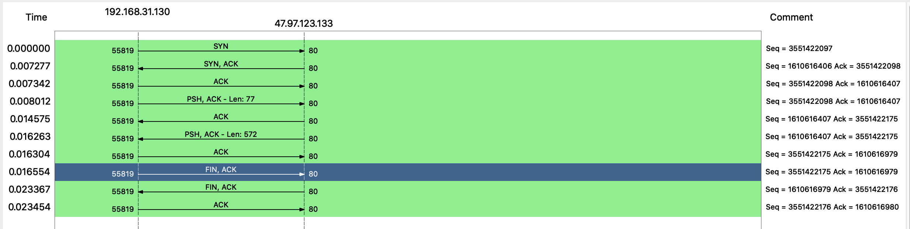
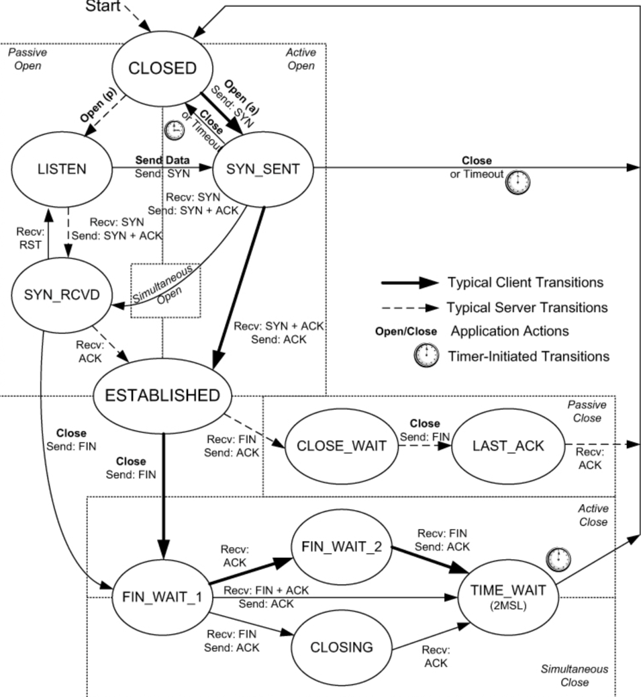
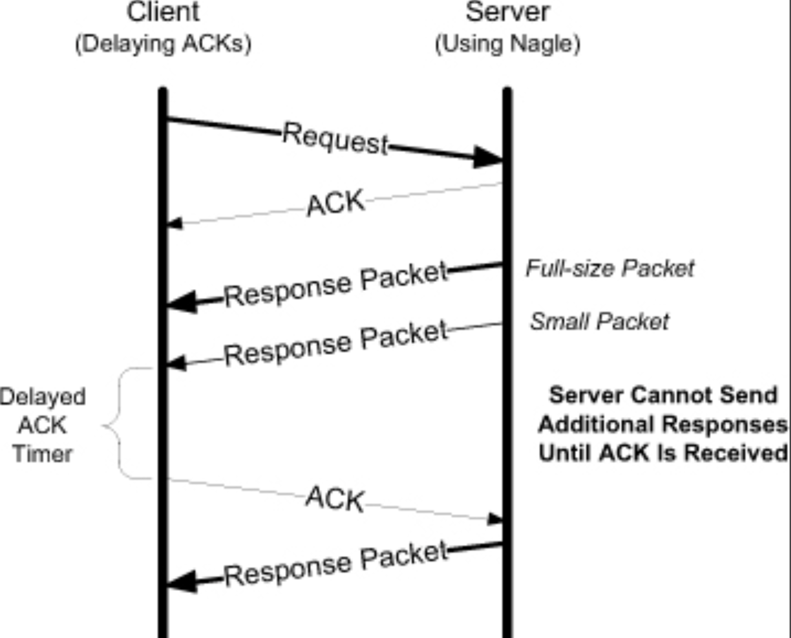
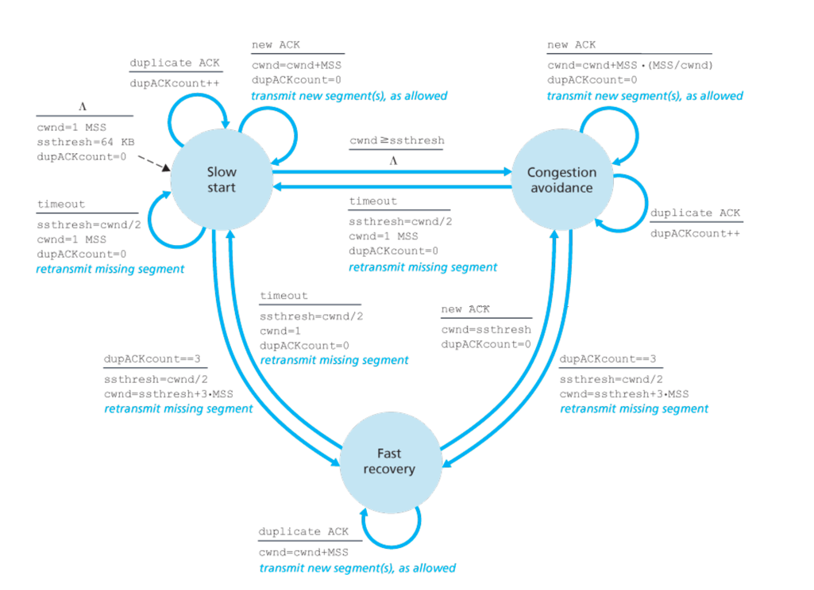

## 简介

TCP（传输控制协议）旨在用于分组交换计算机网络中主机之间的高可靠主机到主机协议，以及此类网络的互连系统中。

```
                           协议分层

                         +---------------------+
                         |      高层协议      |
                         +---------------------+
                         |        TCP          |
                         +---------------------+
                         |   互联网协议        |
                         +---------------------+
                         |  通信网络           |
                         +---------------------+
```

TCP 的原始规范是 [RFC793](https://www.rfc-editor.org/rfc/rfc793)，其中的一些错误在 [RFC1122](https://www.rfc-editor.org/rfc/rfc1122) 中被修正。拥塞控制（**RFC5681**、**RFC3782/RFC6582**、**RFC3517/RFC6657**、**RFC3390**、**RFC3168/RFC8311**）、重传超时（**RFC6298**、**RFC5682**、**RFC4015**）、连接管理（**RFC5482**）等特性在后续一系列的 RFC 文档中也进行了补充设计

> 参见 [Linux TCP](/docs/CS/OS/Linux/net/TCP/TCP.md)

### 目的

TCP 的主要目的是在成对进程之间提供可靠、可安全保护的逻辑电路或连接服务。
它提供数据的可靠交付或失败的可信通知。
在较不可靠的互联网通信系统之上提供此服务需要以下领域的设施：

- 基本数据传输（Basic Data Transfer）
- 可靠性（Reliability）
- 流控制（Flow Control）
- 多路复用（Multiplexing）
- 连接（Connections）
- 优先级和安全（Precedence and Security）

### 连接

为了标识 TCP 可能处理的独立数据流，TCP 提供了端口标识符。由于端口标识符由每个 TCP 独立选择，它们可能不是唯一的。
为了在每个 TCP 内提供唯一地址，我们将标识 TCP 的互联网地址与端口标识符连接起来，创建一个在所有互连网络中唯一的[套接字]()。

连接由两端的套接字对完全指定。一个本地套接字可以参与与不同远程套接字的多个连接。连接可用于在两个方向上承载数据，即它是"全双工"的。

建立连接的过程使用同步（SYN）控制标志，涉及三个消息的交换。这种交换被称为"三次握手"。

### 与其他协议的关系

下图说明了 TCP 在协议层次结构中的位置：

```
   
       +------+ +-----+ +-----+       +-----+  
       |Telnet| | FTP | |语音 |  ...  |     |  应用层
       +------+ +-----+ +-----+       +-----+  
             |   |         |             |   
            +-----+     +-----+       +-----+  
            | TCP |     | RTP |  ...  |     |  主机层
            +-----+     +-----+       +-----+  
               |           |             |   
            +-------------------------------+  
            |  Internet Protocol & ICMP   |  网关层
            +-------------------------------+  
                           |   
              +---------------------------+  
              |   本地网络协议            |  网络层
              +---------------------------+  

                     协议关系
```

## 头部格式

```
     0                   1                   2                   3
     0 1 2 3 4 5 6 7 8 9 0 1 2 3 4 5 6 7 8 9 0 1 2 3 4 5 6 7 8 9 0 1
    +-+-+-+-+-+-+-+-+-+-+-+-+-+-+-+-+-+-+-+-+-+-+-+-+-+-+-+-+-+-+-+-+
    |         源端口                |       目标端口                |
    +-+-+-+-+-+-+-+-+-+-+-+-+-+-+-+-+-+-+-+-+-+-+-+-+-+-+-+-+-+-+-+-+
    |                       序列号                                  |
    +-+-+-+-+-+-+-+-+-+-+-+-+-+-+-+-+-+-+-+-+-+-+-+-+-+-+-+-+-+-+-+-+
    |                    确认号                                     |
    +-+-+-+-+-+-+-+-+-+-+-+-+-+-+-+-+-+-+-+-+-+-+-+-+-+-+-+-+-+-+-+-+
    | 数据 |           |U|A|P|R|S|F|                               |
    | 偏移 |   保留     |R|C|S|S|Y|I|           窗口               |
    |      |           |G|K|H|T|N|N|                               |
    +-+-+-+-+-+-+-+-+-+-+-+-+-+-+-+-+-+-+-+-+-+-+-+-+-+-+-+-+-+-+-+-+
    |          校验和                |        紧急指针              |
    +-+-+-+-+-+-+-+-+-+-+-+-+-+-+-+-+-+-+-+-+-+-+-+-+-+-+-+-+-+-+-+-+
    |                   选项                      |    填充         |
    +-+-+-+-+-+-+-+-+-+-+-+-+-+-+-+-+-+-+-+-+-+-+-+-+-+-+-+-+-+-+-+-+
    |                              data                             |
    +-+-+-+-+-+-+-+-+-+-+-+-+-+-+-+-+-+-+-+-+-+-+-+-+-+-+-+-+-+-+-+-+

                        TCP 头部格式

          注意：一个刻度标记代表一个比特位。
```

| 名称 | 长度 | 描述 |
| ----------------------- | ---------- | -------------------------------------------------------------------------------------------------------------------------------------------------------------------------------------------------------------------- |
| 源端口（Source Port） | 16 位 | 源端口号。 |
| 目标端口（Destination Port） | 16 位 | 目标端口号。 |
| 序列号（Sequence Number） | 32 位 | 本段中第一个数据字节的序列号（当 SYN 存在时除外）。如果 SYN 存在，序列号是初始序列号（ISN），第一个数据字节为 ISN+1。 |
| 确认号（Acknowledgment Number） | 32 位 | 如果 ACK 控制位被设置，此字段包含本段发送方期望接收的下一个序列号。一旦建立连接，此字段始终发送。 |
| 数据偏移（Data Offset） | 4 位 | TCP 头部中 32 位字的数量。这指示数据的开始位置。TCP 头部（包括选项）是 32 位的整数倍。 |
| 保留（Reserved） | 6 位 | |
| 控制位（Control Bits） | 6 位 | URG: 紧急指针字段有效 ACK: 确认字段有效 PSH: 推送功能 RST: 重置连接 SYN: 同步序列号 FIN: 发送方无更多数据 |
| 窗口（Window） | 16 位 | 从确认字段指示的那个字节开始，本段发送方愿意接收的数据字节数。 |
| 校验和（Checksum） | 16 位 | |
| 紧急指针（Urgent Pointer） | 16 位 | |
| 选项（Options） | 可变 | |
| 填充（Padding） | 可变 | TCP 头部填充用于确保 TCP 头部结束和数据开始于 32 位边界。填充由零组成。 |

### 选项

原始 TCP 规范中定义的唯一选项是选项列表结束（EOL）、无操作（NOP）和最大段大小（MSS）。
自那以后，定义了多个选项。完整列表由 IANA [TPARAMS] 维护。

每个选项以一个指定选项类型的 1 字节 kind 值开始。
根据 [RFC1122]，不被理解的选项将被简单地忽略。kind 值为 0 和 1 的选项占用单个字节。
其他选项在 kind 字节之后有一个 len 字节。长度是总长度，包括 kind 和 len 字节。
NOP 选项的存在是为了允许发送方将字段填充到 4 字节的倍数（如果需要）。
记住 TCP 头部的长度始终需要是 32 位的倍数，因为 TCP 头部长度字段使用该单位。
EOL 选项指示列表的结束，不再执行选项列表的进一步处理。

#### MSS 选项

最大段大小（Maximum Segment Size）

#### SACK 选项

选择性确认（Selective Acknowledgment）

#### 窗口缩放选项

Window Scale (WSCALE 或 WSOPT)

#### PAWS 选项

时间戳选项和防止序列号回绕（Protection against Wrapped Sequence Numbers）

时间戳选项（有时称为 Timestamp 选项，写作 TSOPT 或 TSopt）允许发送方在每个段中放置两个 4 字节的时间戳值。
接收方在确认中反映这些值，允许发送方为每个接收到的 ACK 计算连接的 RTT 估计。
希望计算良好连接 RTT 估计的主要原因是设置重传超时，它告诉 TCP 何时应尝试重传可能丢失的段。

## 连接建立和终止

TCP 是一种单播*面向连接*的协议。在任一端可以向另一端发送数据之前，必须在它们之间建立连接。
TCP 连接定义为由两个 IP 地址和两个端口号组成的四元组。更准确地说，它是一对*端点*或*套接字*，其中每个端点由（IP 地址，端口号）对标识。
连接通常经历三个阶段：建立、数据传输（称为已建立）和拆除（关闭）。

<div style="text-align: center;">



</div>

<p style="text-align: center;">图 4：TCP 握手</p>

### 三次握手

服务器必须准备好接受传入连接。这通常通过调用 socket、bind 和 listen 完成，称为被动打开。
TCP 连接建立时发生以下场景：

1. 客户端通过调用 connect 发起主动打开。
   这导致客户端 TCP 发送一个"同步"（SYN）段，告诉服务器客户端将在连接上发送的数据的初始序列号。
   通常，SYN 不携带数据；它只包含 IP 头部、TCP 头部和可能的 TCP 选项（我们稍后将讨论）。
2. 服务器必须确认（ACK）客户端的 SYN，并且服务器还必须发送其自己的 SYN，包含服务器将在连接上发送的数据的初始序列号。
   服务器在一个段中发送其 SYN 和客户端 SYN 的 ACK。
3. 客户端必须确认服务器的 SYN。

此交换所需的最小数据包数为三个；因此，这称为 TCP 的*三次握手*。
**其主要目的是让连接的每一端知道连接正在启动以及作为选项携带的特殊细节，并交换 ISN。**

由于 SYN 占用序列号空间的一个字节，每个 SYN 的 ACK 中的确认号是初始序列号加一。
类似地，每个 FIN 的 ACK 是 FIN 的序列号加一。
ISN 基于时间戳，参见 RFC1948

- syn 队列
- accept 队列

#### 连接建立的超时

| 重试 | 文件设置 | 默认值 |
| --------- | ------------------------------------------- | --------------- |
| SYN | cat /proc/sys/net/ipv4/tcp_syn_retries | 6 |
| SYN+ACK | cat /proc/sys/net/ipv4/tcp_synack_retries | 5 |

RFC1122 说最小重试必须至少为 180 秒。
然而，此值对应于当前初始 RTO 为 63 秒的重传。

RTO（重传超时）1 + 2 <<< (n-1)

如果 RTO 非常大，实际重试次数将小于设置的重试次数

```c
#define TCP_RTO_MAX	((unsigned)(120*HZ))
#define TCP_RTO_MIN	((unsigned)(HZ/5))
```

```shell
iptables -I INPUT -p tcp --dport 80 -j DROP
```

TCP 可以通过 ICMP 端口不可达或 TCP RST 被拒绝。
捕获定义端口可能忽略 ICMP 数据报。

### 连接终止

建立连接需要三个段，而终止连接需要四个段。

1. 一个应用首先调用 close，我们说这一端执行主动关闭。
   此端的 TCP 发送一个 FIN 段，表示它已完成数据发送。
2. 接收 FIN 的另一端执行被动关闭。接收到的 FIN 由 TCP 确认。
   FIN 的接收也作为文件结束符传递给应用（在任何可能已排队等待应用接收的数据之后），
   因为收到 FIN 意味着应用将不会在连接上收到任何额外数据。
3. 稍后，收到文件结束符的应用将关闭其套接字。这导致其 TCP 发送一个 FIN。
4. 接收这最后一个 FIN 的系统上的 TCP（执行主动关闭的一端）确认该 FIN。

由于每个方向都需要一个 FIN 和一个 ACK，通常需要四个段。
我们使用"通常"这个限定词，因为在某些场景中，步骤 1 中的 FIN 与数据一起发送。
此外，步骤 2 和步骤 3 的段都来自执行被动关闭的一端，可以合并为一个段。

在步骤 2 和步骤 3 之间，数据可以从执行被动关闭的一端流向执行主动关闭的一端。这称为*半关闭*。

每个 FIN 在套接字关闭时发送。
我们指出应用调用 close 会导致此情况，但请注意，当 Unix 进程终止时，
无论是自愿（调用 exit 或主函数返回）还是非自愿（接收终止进程的信号），
所有打开的描述符都被关闭，这也会导致在任何仍打开的 TCP 连接上发送 FIN。

> [!NOTE]
>
> 客户端或服务器都可以执行主动关闭。通常客户端执行主动关闭，但对于某些协议（尤其是 HTTP/1.0），服务器执行主动关闭。

- fin 重试
- fin_wait2 等待时间
- time_wait 限制

#### 半关闭

shutdown

- SHUT_RD
- SHUT_WR
- SHUT_RDWR

### 同时打开和关闭

同时打开需要交换四个段，比正常的三次握手多一个。

对于同时关闭，交换的段数与正常关闭相同。唯一的真正区别是段序列是交错的而不是顺序的。

### 连接状态

连接在其生命周期中经历一系列状态。这些状态是：LISTEN、SYN-SENT、SYN-RECEIVED、ESTABLISHED、FIN-WAIT-1、FIN-WAIT-2、CLOSE-WAIT、CLOSING、LAST-ACK、TIME-WAIT，
以及虚拟状态 CLOSED。CLOSED 是虚拟的，因为它表示没有 TCB 时的状态，因此没有连接。简而言之，各状态的含义是：

- LISTEN - 表示等待来自任何远程 TCP 和端口的连接请求。
- SYN-SENT - 表示在发送连接请求后等待匹配的连接请求。
- SYN-RECEIVED - 表示在既接收又发送连接请求后等待确认的连接请求。
- ESTABLISHED - 表示打开的连接，接收的数据可以交付给用户。连接数据传输阶段的正常状态。
- FIN-WAIT-1 - 表示等待来自远程 TCP 的连接终止请求，或等待先前发送的连接终止请求的确认。
- FIN-WAIT-2 - 表示等待来自远程 TCP 的连接终止请求。
- CLOSE-WAIT - 表示等待来自本地用户的连接终止请求。
- CLOSING - 表示等待来自远程 TCP 的连接终止请求确认。
- LAST-ACK - 表示等待对先前发送给远程 TCP 的连接终止请求的确认（包括对其连接终止请求的确认）。
- TIME-WAIT - 表示等待足够的时间过去，以确保远程 TCP 收到其连接终止请求的确认。
- CLOSED - 表示完全没有连接状态。

<div style="text-align: center;">



</div>

<p style="text-align: center;">图 5：TCP 状态转换图</p>

#### CLOSE_WAIT

过多的 CLOSE_WAIT
原因：

1. 忘记调用 close/shutdown 发送 FIN
2. backlog 过大

#### FIN_WAIT_2

只有当应用执行此关闭（并且其 FIN 被接收）时，主动关闭的 TCP 才从 FIN_WAIT_2 状态移动到 TIME_WAIT 状态。
这意味着连接的一端可以永远处于此状态。
另一端仍处于 CLOSE_WAIT 状态，并且可以永远保持在那里，直到应用决定发出其关闭。

许多实现通过如下方式防止 FIN_WAIT_2 状态的无限等待：
如果执行主动关闭的应用执行完全关闭而不是半关闭（表明它期望接收数据），则设置一个**定时器**。
如果定时器到期时连接空闲，TCP 将连接移动到 CLOSED 状态。
在 Linux 中，变量 `net.ipv4.tcp_fin_timeout` 可以调整以控制定时器设置到的秒数。其默认值为 60 秒。
当连接从 FIN_WAIT_1 状态移动到 FIN_WAIT_2 状态且连接无法再接收数据时
（意味着进程调用了 close，而不是利用 TCP 的 shutdown 半关闭），此定时器设置为 10 分钟。
当此定时器到期时，它重置为 75 秒，第二次到期时连接被丢弃。
此定时器的目的是避免如果另一端从未发送 FIN，连接永远处于 FIN_WAIT_2 状态。

#### TIME_WAIT

数据包在网络上"丢失"的方式通常是路由异常的结果。
这个原始数据包称为丢失的副本或游荡的副本。TCP 必须处理这些副本。

TIME_WAIT 状态有两个原因：

1. 可靠地实现 TCP 的全双工连接终止
2. 允许旧的重复段在网络中过期

第一个原因可以通过假设最终的 ACK 丢失来解释。服务器将重新发送其最终的 FIN，因此客户端必须维护状态信息，允许它重新发送最终的 ACK。
如果它不维护此信息，它将响应一个 RST（一种不同类型的 TCP 段），这将被服务器解释为错误。

连接关闭后，稍后我们在相同的 IP 地址和端口之间建立另一个连接。
这后一个连接称为前一个连接的化身，因为 IP 地址和端口相同。
TCP 必须防止来自一个连接的旧副本在稍后某个时间重新出现并被误解为属于同一连接的新化身。
为此，TCP 不会发起当前处于 TIME_WAIT 状态的连接的新化身。

> 此规则有一个例外。
> 如果到达的 SYN 具有"大于"前一个化身的结束序列号的序列号，源自 Berkeley 的实现会发起当前处于 TIME_WAIT 状态的连接的新化身。

当连接进入 TIME_WAIT 状态时，定时器设置为 1 分钟（Net/3 使用 30 秒的 MSL），当它到期时，TCP 控制块和 Internet PCB 被删除，允许该套接字对被重用。

孤儿连接（使用 close）FIN_WAIT2 超时 tcp_fin_timeout 秒

```shell
cat /proc/sys/net/ipv4/tcp_fin_timeout	#60
```

```c
#define TCP_TIMEWAIT_LEN (60*HZ)
```

tcp_tw_reuse - 整数

当从协议视角看安全时，允许将 TIME-WAIT 套接字重用于新连接。
非技术专家建议/请求不应更改。

- 0 - 禁用
- 1 - 全局启用
- 2 - 仅对环回流量启用，默认

### 重置段

#### 不存在的端口

对于 UDP，我们看到当数据报到达一个未使用的目标端口时，会生成 ICMP 目标不可达（端口不可达）消息。TCP 使用重置段代替。

#### 中止连接

中止连接为应用提供两个特性：

1. 任何排队的数据被丢弃，并立即发送重置段
2. 重置的接收方可以判断另一端执行的是中止而不是正常关闭。

应用使用的 API 必须提供生成中止而不是正常关闭的方法。

#### 半开连接

如果一端在另一端不知情的情况下关闭或中止了连接，则称 TCP 连接为半开。
当任一对端崩溃时，可能发生这种情况。只要不尝试在半开连接上传输数据，仍然活跃的一端不会检测到另一端已崩溃。

半开连接的另一个常见原因是一台主机未正确关机而是直接断电。

#### TWA

如前所述，TIME_WAIT 状态旨在允许从关闭的连接中残留的任何数据报被丢弃。
在此期间，等待的 TCP 通常没什么可做的；它仅仅保持状态直到 2MSL 定时器过期。
然而，如果在此期间它从连接接收到某些段，更具体地说是 RST 段，它可能会失去同步。这称为**TIME-WAIT 刺杀（TWA）**。

这对服务器不是问题，但它会导致客户端过早地从 TIME_WAIT 转换到 CLOSED。
大多数系统通过简单地在 TIME_WAIT 状态下不响应重置段来避免此问题。

TCP 防止旧重复段的机制，如果在 TIME_WAIT 中：

**不可靠：** TIME-WAIT 状态消除了"快速"或"长"连接中旧副本的危害，其中时钟驱动的 ISN 选择无法防止旧序列空间和新序列空间的重叠。TIME-WAIT 延迟允许所有旧重复段在互联网中有足够的时间消亡，然后连接才被重新打开。

TIME-WAIT 状态可以被来自相同连接相同化身的旧重复数据或 ACK 段过早终止（"刺杀"）。我们称之为"`TIME-WAIT 刺杀`"（**TWA**）。

```
       TCP A                                                TCP B

   1.  ESTABLISHED                                          ESTABLISHED

       (关闭)
   2.  FIN-WAIT-1  --> <SEQ=100><ACK=300><CTL=FIN,ACK>  --> CLOSE-WAIT

   3.  FIN-WAIT-2  <-- <SEQ=300><ACK=101><CTL=ACK>      <-- CLOSE-WAIT

                                                             (关闭)
   4.  TIME-WAIT   <-- <SEQ=300><ACK=101><CTL=FIN,ACK>  <-- LAST-ACK

   5.  TIME-WAIT   --> <SEQ=101><ACK=301><CTL=ACK>      --> CLOSED

  - - - - - - - - - - - - - - - - - - - - - - - - - - - -

   5.1. TIME-WAIT   <--  <SEQ=255><ACK=33> ... old duplicate

   5.2  TIME-WAIT   --> <SEQ=101><ACK=301><CTL=ACK>    -->  ????

   5.3  CLOSED      <-- <SEQ=301><CTL=RST>             <--  ????
      (过早地)

                         TWA 示例
```

如果在 TWA 事件后立即重新打开连接，新化身将暴露于旧重复段（除了初始 <SYN> 段，它由三次握手处理）。这可能导致三种危害：

- 旧重复数据可能被错误地接受。
- 新连接可能失去同步，两端在状态上永久不一致。遵循 RFC-793 规范，这种失步会导致无限的 ACK 循环。（将此方面的 RFC-793 改为杀死连接可能是合理的。）这种危害来自确认未发送的内容。这可能是由旧重复 ACK 或作为危害 H1 的副作用引起的。
- 新连接可能死亡。在 SYN-SENT 状态下到达的重复段（数据或 ACK）可能会在连接看似成功打开后杀死它。

##### TWA 危害的修复

我们讨论三种可能的 TCP 修复方法来避免这些危害。

- 在 TIME-WAIT 状态下忽略 RST 段。如果强制实施 2 分钟 MSL，此修复避免了所有三种危害。
  这是最简单的修复。也可以争辩说这在形式上是正确的做法；因为允许旧重复段消亡是 TIME-WAIT 状态的功能之一，
  该状态不应被 RST 段截断。[参见 Linux](/d)
- 使用 PAWS 避免危害。
- 使用 64 位序列号。

TIME_WAIT数量超过`tcp_max_tw_buckets`后连接就不经过此状态而直接关闭

```shell
cat /proc/sys/net/ipv4/tcp_max_tw_buckets #5000
```

`tcp_tw_reuse`适用于发起连接的一方(Client use connect())，需结合`tcp_timestamps`使用, 1s后可复用（防止最后的ack丢失）
服务端若要复用，用于连接的socket(not listening socket)配置`SO_REUSEADDR`和`tcp_timestamps`使用，参考netty start

```shell
cat /proc/sys/net/ipv4/tcp_tw_reuse #3
cat /proc/sys/net/ipv4/tcp_timestamps #1 enable
```

参见 [RFC 6191 - Reducing the TIME-WAIT State Using TCP Timestamps](https://datatracker.ietf.org/doc/html/rfc6191)

```shell
net.ipv4.tcp_tw_recycle # 1 enable quick recycle TIME_WAIT sockets
```

### 连接队列

新连接在提供给应用之前可能处于两种不同状态之一。

- 第一种情况是尚未完成但已接收到 SYN 的连接（这些处于 SYN_RCVD 状态）。
- 第二种情况是已完成三次握手并处于 ESTABLISHED 状态但尚未被应用接受的连接。

在内部，操作系统通常有两个不同的连接队列，每种情况一个。

在现代 Linux 内核中，此行为已更改为第二种情况（ESTABLISHED 连接）的数量。
因此，应用可以限制等待它处理的完全形成的连接数量。
在 Linux 中，适用以下规则：

1. 当连接请求到达（即 SYN 段）时，检查系统范围参数 `net.ipv4.tcp_max_syn_backlog`（默认 1024）。
   如果 SYN_RCVD 状态下的连接数将超过此阈值，传入连接被拒绝。
2. 每个监听端点有一个固定长度的连接队列，这些连接已被 TCP 完全接受（即三次握手完成）但尚未被应用接受。
   应用为此队列指定一个限制，通常称为 backlog。此 backlog 必须在 0 和系统特定最大值 `net.core.somaxconn` 之间（包括，默认 128）。
   请记住，此 backlog 值仅指定一个监听端口的排队连接最大数量，所有这些连接已被 TCP 接受并等待应用接受。
   此 backlog 对应用可以处理的最大已建立连接数量完全没有影响。
   此 backlog 对系统允许的最大已建立连接数量，或并发服务器可以同时处理的客户端数量完全没有影响。
3. 如果此监听端口的队列中有空间容纳此新连接，TCP 模块 ACK 该 SYN 并完成连接。
   具有监听端口的服务器应用直到收到三次握手的第三个段时才看到此新连接。
   此外，当客户端的主动打开成功完成时，客户端可能认为服务器已准备好接收数据，而服务器应用尚未被通知新连接。
   如果发生这种情况，服务器的 TCP 只是排队传入数据。
4. 如果队列中没有足够的空间容纳新连接，TCP 延迟响应 SYN，以给应用追赶的机会。
   Linux 在此行为上有些独特——如果可能，它坚持不忽略传入连接。
   如果设置了 `net.ipv4.tcp_abort_on_overflow` 系统控制变量，新传入连接会收到一个重置段。

#### syn 队列

```shell
cat /proc/sys/net/ipv4/tcp_max_syn_backlog	#1024
```

```shell
 # 获取当前 syn 队列大小
 netstat -natp | grep SYN_RECV | wc -l
```

使用 [`hping3`] 模拟 syn 攻击

**tcp_syncookies 当 syn 队列溢出时**

```shell
cat /proc/sys/net/ipv4/tcp_syncookies	#1
```

检查丢弃的 syn 套接字

```shell
netstat -s|grep "SYNs to LISTEN"
```

**防止 syn 攻击**

1. 扩大 syn 队列和 accept 队列大小
2. 启用 tcp_syncookies
3. 减少 `tcp_synack_retries` 以快速退出 SYN_RECV 连接

#### accept 队列

```shell
# -l 显示监听套接字
# -n 不解释服务器名称
# -t 仅 tcp
ss -lnt
```

| | 监听中 | 非监听中 |
| -------- | --------------------------- | --------------------------- |
| Recv-Q | 当前 accept 队列大小 | 已接收未读取的字节数 |
| Send-Q | 最大 accept 队列大小 | 已发送未确认的字节数 |

使用 [`wrk`](https://github.com/wg/wrk) 测试 accept 队列溢出

```shell
# -t 线程数
# -c 连接数
# -d 持续时间
wrk -t 6 -c 30000 -d 60s http://xxx.xxx.xxx.xxx 
```

如果看到 `connection reset by peer`，可能是 accept 队列溢出，默认将是连接超时

> 如果监听服务太慢无法接受新连接，重置它们。
> 默认状态为 FALSE。这意味着如果溢出是由于突发引起的，连接将恢复。
> 仅在你确信监听守护进程无法被调优以更快接受连接时*才*启用此选项。
> 启用此选项可能会伤害你的服务器的客户端。

```shell
# 0 丢弃，1 丢弃并返回 RST
cat /proc/sys/net/ipv4/tcp_abort_on_overflow
```

```shell
netstat -s|grep overflowed
```

### 快速打开

TCP 快速打开（TFO）允许减少延迟并显著改善用户体验。
然而，天真的防火墙和不良的入侵检测系统阻碍了我们。
不良的中间盒和防火墙对 TCP 快速打开反应不佳。

- 抑制 TCP 选项
- 丢弃数据包
- 将整个连接标记为"无效"
- 黑洞客户端

TFO 的关键组件是快速打开 Cookie，一种由服务器生成的消息认证码（MAC）标签。
客户端在一个常规 TCP 连接中请求 Cookie，然后在未来的 TCP 连接中使用它在 3WHS 期间交换数据：

请求快速打开 Cookie：

1. 客户端发送带有空 Cookie 字段的 Fast Open 选项的 SYN 以请求 Cookie。
2. 服务器生成一个 Cookie，并通过 SYN-ACK 数据包的 Fast Open 选项发送它。
3. 客户端缓存 Cookie 以供未来的 TCP 快速打开连接使用（见下文）。

在连接 1 中请求快速打开 Cookie：

```
   TCP A (客户端)                                      TCP B (服务器)
   ______________                                      ______________
   CLOSED                                                      LISTEN

   #1 SYN-SENT       ----- <SYN,CookieOpt=NIL>  ---------->  SYN-RCVD

   #2 ESTABLISHED    <---- <SYN,ACK,CookieOpt=C> ----------  SYN-RCVD
```

在连接 2 中执行 TCP 快速打开：

```
   TCP A (客户端)                                      TCP B (服务器)
   ______________                                      ______________
   CLOSED                                                      LISTEN

   #1 SYN-SENT       ----- <SYN=x,CookieOpt=C,DATA_A> ---->  SYN-RCVD

   #2 ESTABLISHED    <---- <SYN=y,ACK=x+len(DATA_A)+1> ----  SYN-RCVD

   #3 ESTABLISHED    <---- <ACK=x+len(DATA_A)+1,DATA_B>----  SYN-RCVD

   #4 ESTABLISHED    ----- <ACK=y+1>--------------------> ESTABLISHED

   #5 ESTABLISHED    --- <ACK=y+len(DATA_B)+1>----------> ESTABLISHED
```

```
                                   +-+-+-+-+-+-+-+-+-+-+-+-+-+-+-+-+
                                   |      Kind     |    Length     |
   +-+-+-+-+-+-+-+-+-+-+-+-+-+-+-+-+-+-+-+-+-+-+-+-+-+-+-+-+-+-+-+-+
   |                                                               |
   ~                            Cookie                             ~
   |                                                               |
   +-+-+-+-+-+-+-+-+-+-+-+-+-+-+-+-+-+-+-+-+-+-+-+-+-+-+-+-+-+-+-+-+

   Kind            1 byte: value = 34
   Length          1 byte: range 6 to 18 (bytes); limited by
                           remaining space in the options field.
                           The number MUST be even.
   Cookie          0, or 4 to 16 bytes (Length - 2)
```

[TCP Fast Open](http://conferences.sigcomm.org/co-next/2011/papers/1569470463.pdf)

```shell
#linux
cat /proc/sys/net/ipv4/tcp_fastopen	#1
```

[Netty TPO](/docs/CS/Framework/Netty/TPO.md)

### 涉及 TCP 连接管理的攻击

SYN 洪水是一种 TCP DoS 攻击，其中一个或多个恶意客户端生成一系列 TCP 连接尝试（SYN 段）并将其发送到服务器，通常带有"伪造"（例如随机）源 IP 地址。
服务器为每个部分连接分配一定数量的连接资源。
由于连接从未建立，服务器可能开始拒绝未来的合法请求，因为其内存被许多半开连接的状态耗尽。

一种用来处理此问题的机制称为 SYN cookies [RFC4987]。
SYN cookies 的主要见解是，当 SYN 到达时，大部分将存储的连接信息可以编码在 SYN + ACK 提供的序列号字段中。
使用 SYN cookies 的目标机器无需为传入连接请求分配任何存储——它仅在 SYN + ACK 段本身被确认（且初始序列号被返回）时才分配实际内存。
在这种情况下，所有关键连接参数可以被恢复，连接可以置于 ESTABLISHED 状态。

另一种针对 TCP 的退化攻击涉及 PMTUD。在这种情况下，攻击者伪造包含非常小 MTU 值（例如 68 字节）的 ICMP PTB 消息。
这迫使受害 TCP 尝试将其数据适配到非常小的数据包中，大大降低其性能。

另一种类型的攻击涉及破坏现有 TCP 连接并可能接管它（称为劫持）。
这些形式的攻击通常涉及第一步"失同步"两个 TCP 端点，使得如果它们相互通信，将使用无效的序列号。
它们是序列号攻击 [RFC1948] 的特定示例。
它们可以通过至少两种方式实现：在连接建立期间导致无效状态转换（类似于 [TWA](/docs/CS/CN/TCP/TCP.md?id=time-wait-assassination-twa)），以及在 ESTABLISHED 状态下生成额外数据。

通常称为欺骗攻击的一类攻击涉及由攻击者专门定制以破坏或更改现有 TCP 连接行为的 TCP 段。
攻击者可以生成伪造的重置段并将其发送到现有 TCP 端点。
只要连接四元组和校验和正确，且序列号在范围内，重置通常会导致任一端点的连接中止。
其他类型的段（SYN，甚至 ACK）也可以被伪造（并结合洪泛攻击），导致无数问题。
有一些不属于 TCP 协议但仍可能影响 TCP 运行的欺骗攻击。例如，ICMP 可用于修改 PMTUD 行为。
它还可用于指示端口或主机不可用，这通常导致 TCP 连接终止。
这些攻击中的许多在 [RFC5927] 中描述，其中还建议了多种提高对伪造 ICMP 消息的鲁棒性的方法。

## 超时和重传

TCP 协议使用可能丢失、重复或重新排序数据包的底层网络层（IP），在两个应用之间提供可靠的数据交付服务。
为了提供无差错的数.据交换，TCP 重传它认为已丢失的数据。
为了决定需要重传哪些数据，TCP 依赖来自接收方到发送方的持续确认流。
当数据段或确认丢失时，TCP 发起对未确认数据的重传。
TCP 有两种独立的机制来实现重传，一种基于时间，一种基于确认的结构。
第二种方法通常比第一种高效得多。

由于 TCP 只确认流中第一个缺失字节之前的字节，TCP 被称为提供累积确认。

### 重传超时

TCP 在发送数据时设置一个定时器，如果数据在定时器到期时未被确认，则发生超时或基于定时器的数据重传。
超时发生在一个称为重传超时（RTO）的间隔之后。

连续重传之间的这种加倍称为二进制指数退避，我们在失败的 TCP 连接建立尝试中看到过。

阈值 R1 指示 TCP 在向 IP 层传递"负面建议"（例如导致其重新评估正在使用的 IP 路由）之前将尝试的次数（或等待的时间）。
阈值 R2（大于 R1）指示 TCP 应放弃连接的时间点。建议这些阈值分别至少为三次重传和 100 秒。
对于连接建立（发送 SYN 段），这些值可能不同于数据段，SYN 段的 R2 值要求至少为 3 分钟。

在 Linux 中，常规数据段的 R1 和 R2 值可以由应用更改，或分别使用系统范围配置变量 `net.ipv4.tcp_retries1` 和 `net.ipv4.tcp_retries2` 更改。
这些以重传次数衡量，而非时间单位。tcp_retries2 的默认值为 15，大致对应 13-30 分钟，取决于连接的 RTO。net.ipv4.tcp_retries1 的默认值为 3。
对于 SYN 段，参见[连接建立的超时](/docs/CS/CN/TCP/TCP.md?id=timeout-of-connection-establishment)。

> 来自 [ip-sysctl.txt](https://www.kernel.org/doc/Documentation/networking/ip-sysctl.txt)
>
> tcp_retries1 - 整数
>
> 此值影响 TCP 确定由于未确认的 RTO 重传而出问题的时间，并将此怀疑报告给网络层。
> 更多细节参见 tcp_retries2。
> RFC 1122 建议至少 3 次重传，这是默认值。
>
> tcp_retries2 - 整数
>
> 此值影响当 RTO 重传保持未确认时活动 TCP 连接的超时。
> 给定值 N，一个假设的 TCP 连接，使用指数退避且初始 RTO 为 TCP_RTO_MIN，将在杀死连接前在第 (N+1) 个 RTO 处重传 N 次。
>
> 默认值 15 产生假设超时 **924.6 秒**，是有效超时的下限。
> TCP 将在超过假设超时的第一个 RTO 处有效超时。
> RFC 1122 建议超时至少为 100 秒，对应至少为 8 的值。

### 快速重传

它还有另一种发起重传的方式，称为快速重传，通常没有任何延迟。
快速重传基于通过注意 TCP 的累积确认在随时间接收的 ACK 中未能推进，或携带选择性确认信息（SACK）的 ACK 指示接收方存在乱序段来推断丢失。
一般来说，当发送方认为接收方可能丢失了一些数据时，需要在发送新（未发送）数据和重传之间做出选择。

乱序数据到达时立即发送的重复 ACK 不被延迟。
原因是为了让发送方知道一个段被乱序接收，并指示期望什么序列号（即空洞在哪里）。
当使用 SACK 时，这些重复 ACK 通常也包含 SACK 块，可以提供关于多个空洞的信息。

预期的数据包可能丢失或仅仅延迟。
因为我们通常不知道是哪种情况，TCP 等待收到少量重复 ACK（称为重复 ACK 阈值或 dupthresh），然后才断定数据包已丢失并发起快速重传。
传统上，dupthresh 是一个常数（值为 3），但一些非标准实现（包括 Linux）根据当前测量的重排序水平更改此值。

观察到至少 dupthresh 个重复 ACK 的 TCP 发送方重传一个或多个看似丢失的数据包，而无需等待重传定时器到期。
它还可以发送尚未发送的额外数据。这就是快速重传算法的本质。
由重复 ACK 的存在推断的数据包丢失被认为与网络拥塞有关，并且在快速重传的同时调用[拥塞控制](/docs/CS/CN/TCP/TCP.md?id=拥塞控制)过程。
没有 SACK，通常不会重传超过一个段，直到收到可接受的 ACK。
有了 SACK，ACK 包含额外信息，允许发送方在每个 RTT 中填补接收方的多个空洞。

### 虚假超时

在许多情况下，即使没有数据丢失，TCP 也可能发起重传。
这种不希望的重传称为*虚假重传*，由*虚假超时*（触发过早的超时）和其他原因引起，如数据包重排序、数据包重复或 ACK 丢失。

### 数据包重排序和重复

我们希望 TCP 能够区分重排序或复制的数据包和丢失的数据包。

#### 重排序

IP 网络中可能发生数据包重排序，因为 IP 不保证数据包在交付期间维持相对顺序。

重排序可能发生在 TCP 连接的正向路径或反向路径上（或在某些情况下两者都有）。数据段的重排序与 ACK 数据包的重排序对 TCP 的影响有所不同。

如果重排序发生在反向（ACK）方向，它会导致发送 TCP 收到一些显著向前移动窗口的 ACK，随后是一些明显旧的冗余 ACK 被丢弃。
这可能导致 TCP 发送模式中不希望的突发性（瞬时高速发送）行为，并且由于 TCP 拥塞控制的行为，也可能在利用可用网络带宽方面造成问题。

如果重排序发生在正向方向，TCP 可能难以区分此状态与丢包。
丢失和重排序都会导致接收方接收乱序数据包，在下一个预期数据包和已接收的其他数据包之间产生空洞。
当重排序适度时（例如，两个相邻数据包交换顺序），情况可以相当快地处理。
当重排序更严重时，TCP 可能被欺骗认为数据已丢失，即使并没有。
这可能导致主要是来自快速重传算法的虚假重传。

#### 重复

虽然罕见，IP 协议可能多次交付单个数据包。
这可能在链路层网络协议执行重传并创建同一数据包的两个副本时发生。
当创建重复时，TCP 可能以我们已看到的某些方式变得混乱。

数据包 3 被复制的影响是从接收方产生一系列重复 ACK。
这足以触发虚假的快速重传，因为非 SACK 发送方可能错误地认为数据包 5 和 6 已提前到达。
有了 SACK（特别是 DSACK），发送方更容易诊断。使用 DSACK，A3 的每个重复 ACK 都包含 DSACK 信息，表明段 3 已被接收。
此外，它们中没有一个指示任何乱序数据，意味着到达的数据包（或其 ACK）必须是重复的。TCP 通常可以在这种情况下抑制虚假重传。

### 重新打包

当 TCP 超时并重传时，它不必重传相同的段。
相反，TCP 被允许执行重新打包，发送更大的段，这可以提高性能。（自然，这个更大的段不能超过接收方宣布的 MSS，也不应超过路径 MTU。）
协议允许这样做，因为 TCP 通过其字节号（而非其段或数据包号）来识别被发送和确认的数据。

### 涉及 TCP 重传的攻击

有一种称为低速率 DoS 攻击 [KK03] 的 DoS 攻击类别。
在这种攻击中，攻击者向网关或主机发送流量突发，导致受害系统经历重传超时。
如果能够预测受害 TCP 将尝试重传的时间，攻击者在每次重传尝试时生成流量突发。
结果，受害 TCP 感知到网络拥塞，将其发送速率限制到接近零，根据 Karn 算法持续退避其 RTO，并且实际上获得非常低的网络吞吐量。
处理此类攻击的建议机制是向 RTO 添加随机化，使攻击者难以猜测重传发生的确切时间。

一种相关但不同的 DoS 攻击形式涉及减慢受害 TCP 的段，使 RTT 估计过高。
这样做会导致受害 TCP 在其数据包丢失时不太积极地重传自己的数据包。
相反的攻击也是可能的：当数据已被发送但实际上尚未到达接收方时，攻击者伪造 ACK。
在这种情况下，攻击者可以导致受害 TCP 认为连接 RTT 明显小于实际值，导致过于激进的 TCP 产生大量不必要的重传。

## 数据流和窗口管理

### 延迟确认

在许多情况下，TCP 不为每个传入数据包提供 ACK。这是因为 TCP 的累积 ACK 字段是可能的。
使用累积 ACK 允许 TCP 有意延迟发送 ACK 一段时间，希望它能将需要发送的 ACK 与本地应用希望在另一个方向发送的一些数据结合起来。
这是一种捎带形式，最常用于批量数据传输。
显然，TCP 不能无限期延迟 ACK；否则其对端可能得出结论认为数据已丢失并启动不必要的重传。

```shell
#linux
cat /proc/sys/net/ipv4/tcp_sack	#1
```

> [!Note]
>
> 主机要求 RFC [RFC1122] 指出 TCP 应实现延迟 ACK，但延迟必须小于 500 毫秒。许多实现使用最大 200 毫秒。

延迟 ACK 导致的网络流量比不延迟 ACK 少，因为使用的 ACK 更少。
对于批量传输，2 比 1 的比例相当常见。延迟 ACK 的使用以及 TCP 在发送 ACK 前允许等待的最大时间可以配置，取决于主机操作系统。
Linux 使用动态调整算法，可以在每段 ACK（称为"quickack"模式）和传统延迟 ACK 模式之间切换。

### Nagle 算法

Nagle 算法指出，当 TCP 连接有待确认的未完成数据时，不能发送小段（小于 SMSS 的段），直到所有未完成数据被确认。
相反，少量数据由 TCP 收集并在确认到达时作为一个段发送。
此过程有效地强制 TCP 进入停止-等待行为——它停止发送，直到收到任何未完成数据的 ACK。
该算法的美妙之处在于它是*自时钟的*：ACK 返回得越快，数据发送得越快。
在相对高延迟的 WAN 上，减少微小段的数量是可取的，每单位时间发送的段更少。换句话说，RTT 控制数据包发送速率。
这是 Nagle 算法做出的权衡：使用更少但更大的数据包，但所需的延迟更高。

如果我们考虑延迟 ACK 和 Nagle 算法一起使用时发生的情况，我们可以构建一个不期望的场景。
考虑一个使用延迟 ACK 的客户端向服务器发送请求，服务器响应一定数量的数据，这些数据不完全适合单个数据包。

Nagle 算法和延迟 ACK 之间的交互

<div style="text-align: center;">



</div>

<p style="text-align: center;">图 5：Nagle 算法和延迟 ACK 之间的交互</p>

在这里我们看到，客户端在从服务器接收到两个数据包后，扣留 ACK，希望可以捎带发往服务器的额外数据。
通常，TCP 要求仅在接收到的两个数据包都是全尺寸时才提供 ACK，而这里不是。
在服务器端，由于 Nagle 算法在运行，在 ACK 返回之前不允许向客户端发送额外数据包，因为最多允许一个"小"数据包未完成。
延迟 ACK 和 Nagle 算法的组合导致一种死锁形式（每一方等待另一方）[MMSV99][MM01]。
幸运的是，这种死锁不是永久的，当延迟 ACK 定时器触发时被打破，这强制客户端即使没有额外数据要发送也提供 ACK。
然而，在此死锁期间整个数据传输变得空闲，这通常是不希望的。
在这种情况下可以禁用 Nagle 算法，正如我们在 ssh 中看到的。

#### TCP_NODELAY

如果设置，禁用 Nagle 算法。这意味着即使只有少量数据，段也会尽快发送。
当未设置时，数据被缓冲直到有足够数量要发送，从而避免频繁发送小数据包，这会导致网络利用率差。
此选项被 TCP_CORK 覆盖；然而，设置此选项强制显式刷新待处理输出，即使 TCP_CORK 当前已设置。
在当前实现中，*TCP_CORK* 导致的输出延塞有 200 毫秒的上限。

[Nagle 算法](https://en.wikipedia.org/wiki/Nagle's_algorithm)是一种通过减少需要在网络上发送的数据包数量来提高 TCP/IP 网络效率的方法。

Nagle 算法的作用是：

- 如果有未确认的数据已发送，并且内核中的写缓冲区小于 MTU，则稍等片刻，看看应用是否写入更多数据。
- 如果写缓冲区达到 MTU 大小，则数据将被传输。如果飞行中的数据被确认，则数据也将被传输，即使小于 MTU。

其中 MSS 是最大段大小，此连接上可以发送的最大段，窗口大小是当前可接受的未确认数据窗口，这可以写为伪代码：

```
if there is new data to send then
    if the window size ≥ MSS and available data is ≥ MSS then
        send complete MSS segment now
    else
        if there is unconfirmed data still in the pipe then
            enqueue data in the buffer until an acknowledge is received
        else
            send data immediately
        end if
    end if
end if
```

> [!NOTE]
>
> 用户级解决方案是避免在套接字上使用 write–write–read 序列。Write–read–write–read 没问题。Write–write–write 没问题。但 write–write–read 是致命的。
> 因此，如果可能，将你小的写入缓冲到 TCP 并一次性发送它们。使用标准 UNIX I/O 包并在每次读取前刷新写入通常有效。

TCP 延迟确认特性再次尝试最小化发送的小数据包数量。
其工作方式是，一个 TCP 数据包可以一次确认多个数据包。
因此，实现延迟确认特性的 TCP 栈可以在确认数据包之前等待一段时间，希望它能一次确认更多数据包。
在 Linux 上，这可能导致确认数据包时最多 40 毫秒的延迟。
同样，这通常是一件好事，因为它减少了必须发送的数据包数量（这通常是网络性能的限制因素）。

```shell
cat /boot/config-4.18.0-193.el8.x86_64 |grep 'CONFIG_HZ='
CONFIG_HZ=1000
```

40 ~ 200 ms

TCP_QUICKACK

对延迟非常敏感的应用，特别是如果不传输大量数据，可以安全地使用 TCP_NODELAY。

### 流控制和窗口管理

TCP 通过在其发送的每个 ACK 中包含窗口通告来实现流控制。这样的窗口通告向对端 TCP 信号发送窗口通告 ACK 的端点还剩多少缓冲区空间。
除非使用窗口缩放 TCP 选项，否则最大窗口通告为 65,535 字节。在使用窗口缩放选项时，最大窗口通告可以大得多（约 1GB）。

#### 滑动窗口

TCP 连接的每个端点都能发送和接收数据。
连接上发送或接收的数据量由一组*窗口结构*维护。
对于每个活动连接，每个 TCP 端点维护一个*发送窗口结构*和一个*接收窗口结构*。

> 窗口缩放选项仅在 TCP 握手中出现一次。

- 发送窗口（Sent Window）
- 接收窗口（Receive Window）
- 拥塞窗口（Congestion Window）

##### 发送方

TCP 以字节（而非数据包）为单位维护其窗口结构。
窗口大小字段包含相对于 ACK 号的字节偏移量。
发送方计算其可用窗口，即它可以立即发送多少数据。可用窗口是提供的窗口减去已发送但尚未确认的数据量。

随着时间的推移，这个滑动窗口随着接收方确认数据而向右移动。窗口左右边缘的相对运动增加或减少窗口的大小。
三个术语用于描述窗口左右边缘的移动：

1. 当左边缘向右前进时，窗口关闭。当已发送的数据被确认且窗口大小变小时发生。
2. 当右边缘向右移动时，窗口打开，允许发送更多数据。当另一端的接收进程读取已确认的数据，释放其 TCP 接收缓冲区中的空间时发生。
3. 当右边缘向左移动时，窗口收缩。主机要求 RFC [RFC1122] 强烈不鼓励这样做，但 TCP 必须能够处理它。

由于每个 TCP 段都包含 ACK 号和窗口通告，TCP 发送方在收到传入段时根据这两个值调整窗口结构。
窗口的左边缘不能向左移动，因为此边缘由从另一端接收的 ACK 号控制，该 ACK 号是累积的，从不后退。
当 ACK 号前进但窗口大小不变（常见情况）时，称窗口向前推进或"滑动"。
如果 ACK 号前进但窗口通告随着其他到达的 ACK 变得更小，窗口的左边缘更接近右边缘。
如果左边缘到达右边缘，称为零窗口。这阻止发送方传输任何数据。
如果发生这种情况，发送 TCP 开始[探测对端的窗口]()以寻找提供的窗口增加。

##### 接收方

接收方也维护一个窗口结构，比发送方的简单一些。
接收窗口结构跟踪哪些数据已被接收和确认，以及它愿意接收的最大序列号。
TCP 接收方依赖此结构来确保其接收数据的正确性。
特别是，它希望避免存储已接收和确认的重复字节，也希望避免存储不应接收的字节（任何超出发送方右窗口边缘的字节）。

此结构也像发送方窗口一样包含左右窗口边缘，但窗口内的字节不需要像发送方窗口结构中那样区分。
对于接收方，任何序列号小于左窗口边缘的字节被视为重复并丢弃，任何序列号超出右窗口边缘的字节被视为超出范围并丢弃。
在接收窗口范围内的任何序列号到达的字节都被接受。
注意，接收方生成的 ACK 号仅在段直接填充左窗口边缘时才可能前进，因为 TCP 的累积 ACK 结构。
使用选择性 ACK，其他窗口内的段可以使用 TCP SACK 选项确认，但最终 ACK 号本身仅在接收到与左窗口边缘连续的数据时才前进。

#### 窗口缩放

参见 [RFC 1323 - TCP Extensions for High Performance](https://datatracker.ietf.org/doc/rfc1323/).

**窗口大小限制：**

TCP 头部使用 16 位字段向发送方报告接收窗口大小。因此，可以使用的最大窗口是 2**16 = 65K 字节。

```
TCP Window Scale Option (WSopt):

         Kind: 3 Length: 3 bytes

                +---------+---------+---------+
                | Kind=3  |Length=3 |shift.cnt|
                +---------+---------+---------+
```

每个传入段（SYN 段除外）头部的窗口字段（SEG.WND）在更新 SND.WND 之前左移 Snd.Wind.Scale 位：
`SND.WND = SEG.WND << Snd.Wind.Scale`

每个传出段（SYN 段除外）头部的窗口字段（SEG.WND）右移 Rcv.Wind.Scale 位：
`SEG.WND = RCV.WND >> Rcv.Wind.Scale`

**从丢失中恢复：**

**往返测量：**

TCP 通过在某个重传超时（RTO）间隔内重传未确认的段来实现可靠数据交付。

新的 TCP 选项`"Timestamps"`，然后定义了一种使用此选项的机制，允许几乎每个段（包括重传）以可忽略的计算成本被计时。我们使用助记符 RTTM（往返时间测量）来表示此机制，以区别于`Timestamps`选项的其他用途。

##### PAWS

我们称 PAWS（防止序列号回绕），将 TCP 可靠性扩展到远超网络带宽可预见上限的传输速率。

PAWS 算法需要对同步连接的所有传入段执行以下处理：

- 如果到达的段中有时间戳选项且 SEG.TSval < TS.Recent 且 TS.Recent 有效（参见后续讨论），则将到达的段视为不可接受：
  - 按照 RFC-793 第 69 页的规定发送确认作为回复并丢弃该段。
  - 注意：有必要发送 ACK 段以保持 TCP 检测和恢复半开连接的机制。例如，参见 RFC-793 的图 10。
- 如果段超出窗口，拒绝它（正常 TCP 处理）
- 如果到达的段满足：SEG.SEQ <= Last.ACK.sent，则将其时间戳记录在 TS.Recent 中。
- 如果到达的段是顺序的（即在左窗口边缘），则正常接受它。
- 否则，将段视为正常的窗口内、乱序 TCP 段（例如，排队等待稍后交付给用户）。

#### 零窗口和 TCP 持久定时器

TCP 通过让接收方指定它愿意从发送方接收的数据量来实现流控制：接收方通告的窗口。
当接收方通告的窗口变为零时，发送方实际上停止传输数据，直到窗口变为非零。
当接收方再次有可用空间时，它向发送方提供窗口更新以指示允许再次传输数据。
由于此类更新通常不包含数据（它们是"纯 ACK"的一种形式），它们不被 TCP 可靠交付。
因此，TCP 必须处理此类本应打开窗口的窗口更新丢失的情况。

如果确认（包含窗口更新）丢失，我们可能最终双方都在等待对方：
接收方等待接收数据（因为它向发送方提供了非零窗口并期望看到传入数据），发送方等待接收允许其发送的窗口更新。
为防止这种形式的死锁发生，发送方使用持久定时器定期查询接收方，以发现窗口大小是否已增加。
持久定时器触发窗口探测的传输。
窗口探测是强制接收方提供 ACK 的段，该 ACK 也必然包含窗口大小字段。
主机要求 RFC [RFC1122] 建议第一次探测应在一个 RTO 后发生，后续探测应以指数间隔发生。

窗口探测包含一个字节的数据，因此如果丢失，TCP 会可靠交付（重传），从而消除了由丢失的窗口更新引起的潜在死锁条件。
每当 TCP 持久定时器到期时发送探测，包含的字节可能被接收方接受或拒绝，取决于其可用缓冲区空间。
与 [TCP 重传定时器](/docs/CS/CN/TCP/TCP.md?id=重传超时)一样，在计算持久定时器的超时时可以使用正常的指数退避。
然而，一个重要区别是，正常的 TCP 从不放弃发送窗口探测，而它可能最终放弃尝试执行重传。

有许多点我们可以总结：

1. 发送方不必传输整个窗口的数据。
2. 来自接收方的单个段同时确认数据并向右滑动窗口。这是因为窗口通告是相对于同一段中的 ACK 号的。
3. 窗口的大小可以减小，但窗口的右边缘不向左移动，以避免窗口收缩。
4. 接收方不必等待窗口填满才发送 ACK。

#### 愚蠢窗口综合症

基于窗口的流控制方案，尤其是那些不使用固定大小段的方案（如 TCP），可能受一种称为愚蠢窗口综合症（SWS）的条件影响。
当它发生时，小数据段在连接上交换，而不是全尺寸段 [RFC0813]。
这导致不期望的低效率，因为每个段都有相对较高的开销——相对于头部中的字节数，数据字节数很少。

SWS 可能由 TCP 连接的任一端引起：
接收方可以通告小窗口（而不是等到可以通告更大的窗口），发送方可以传输小数据段（而不是等待额外的数据发送更大的段）。
正确避免愚蠢窗口综合症要求 TCP 无论是作为发送方还是接收方都专门为此目的实现规则。TCP 无法提前知道对端 TCP 的行为。
应用以下规则：

1. 作为接收方时，不通告小窗口。
   [RFC1122] 指定的接收算法是，不通告比当前正在通告的窗口（可以是 0）更大的窗口，直到窗口可以增加
   至少一个全尺寸段（即接收 MSS）或接收方缓冲区空间的一半，取较小者。
   注意，此规则可能起作用的两种情况：当由于应用从网络消耗数据而出现缓冲区空间时，以及当 TCP 必须响应窗口探测时。
2. 作为发送方时，不发送小段，Nagle 算法控制何时发送。发送方通过在至少满足以下条件之一时才传输段来避免 SWS：
   1. (a) 可以发送全尺寸（发送 MSS 字节）段。
   2. (b) TCP 可以发送另一端曾在连接上通告的最大窗口的一半。
   3. (c) TCP 可以发送其拥有的所有数据，并且要么 (i) 当前不期望 ACK（即我们没有未确认数据），要么 (ii) Nagle 算法对此连接已禁用。

条件 (a) 是最直接的，直接避免了高开销段的问题。
条件 (b) 处理总是通告微小窗口（可能小于段大小）的主机。
条件 (c) 防止 TCP 在有未确认数据等待 ACK 且 Nagle 算法启用时发送小段。
如果发送应用正在执行小写入（例如小于段大小），条件 (c) 避免了愚蠢窗口综合症。

这三个条件也让我们回答以下问题：
如果 Nagle 算法阻止我们在有未确认数据时发送小段，什么算小？
从条件 (a) 我们看到，"小"意味着字节数少于 SMSS（即不超过路径 MTU 或接收方 MSS 的最大数据包大小）。
条件 (b) 仅对旧式或原始主机有效，或当由于有限的接收缓冲区大小而使用小的通告窗口时。

### 缓冲区和自动调优

接收方窗口的大小受接收方缓冲区大小的限制。
历史上，未能指定其接收缓冲区的应用将被分配一个相对较小的缓冲区，这将导致在高带宽和高延迟的网络路径上吞吐性能受损。
在较新的操作系统中，自动调优以高效方式自动设置缓冲区大小，使此类担忧很大程度上成为过去。

```shell
> sysctl -a |grep mem
net.core.wmem_default = 212992
net.core.wmem_max = 212992
net.ipv4.tcp_wmem = 4096        16384   4194304

net.core.rmem_default = 212992
net.core.rmem_max = 212992
net.ipv4.tcp_rmem = 4096        87380   6291456
```

### 涉及窗口管理的攻击

TCP 的窗口管理过程一直是各种攻击的主题，主要是资源耗尽的形式。
本质上，通告小窗口会减慢 TCP 传输，长时间占用内存等资源。
这已被用作针对不良流量（如蠕虫）的攻击形式。

## 拥塞控制

如果路由器接收的数据超过其每单位时间能发送的量，它必须存储该数据。
如果这种情况持续，最终存储将耗尽，路由器将被迫丢弃部分数据。
当路由器因无法处理到达的流量速率而被迫丢弃数据时，称为*拥塞*。
当路由器处于此状态时，称其拥塞，甚至单个连接就可以驱动一个或多个路由器进入拥塞。
如果不加以处理，拥塞可能导致网络性能严重降低，以至于变得不可用。
在最坏的情况下，称为拥塞崩溃状态。
为了要么避免要么至少有效应对以缓解这种情况，每个 TCP 实现拥塞控制过程。
挑战在于精确确定 TCP 何时以及如何减速，以及何时可以再次加速。

> [!TIP]
>
> TCP 拥塞控制通常被称为***加性增、乘性减（AIMD）***形式的拥塞控制。

<div style="text-align: center;">



</div>

<p style="text-align: center;">图 5：TCP 拥塞控制 FSM</p>

### 拥塞检测

TCP 中检测拥塞的方法：

- 丢失数据包是拥塞的指示
- 测量延迟
- 网络支持的显式拥塞通知（ECN）

> [!Note]
>
> 在当今的有线网络中，数据包丢失主要由路由器或交换机中的拥塞引起。
> 对于无线网络，传输和接收错误成为数据包丢失的重要原因。
> 确定丢包是由于拥塞还是传输错误自 1990 年代中期无线网络开始广泛使用以来一直是一个活跃的研究课题。

我们需要立即解决的一个细节是如何减慢 TCP 发送方。
我们看到 TCP 头部中的窗口大小字段用于根据接收方缓冲区空间的可用性向发送方发信号调整其窗口。
我们可以更进一步，如果接收方太慢或网络太慢，安排发送方减速。
这是通过引入发送方处基于网络容量估计的窗口控制变量，并确保发送方的窗口大小不超过两者的最小值来实现的。
实际上，发送 TCP 然后以等于接收方或网络能处理的较低速率发送。

用于保存网络可用容量估计的新值称为*拥塞窗口*，简写为 *cwnd*。
然后发送方的实际（可用）窗口 W 写为接收方通告窗口 awnd 和拥塞窗口的最小值：

$$
W = min(cwnd, awnd)
$$

通过此关系，TCP 发送方不允许在网络中有超过 W 个未确认的数据包或字节未完成。
发送方已引入网络但尚未收到确认的数据总量有时称为飞行大小，始终小于或等于 W。
通常，W 可以以数据包或字节单位维护。

> [!NOTE]
>
> 当 TCP 不使用选择性确认时，对 W 的限制意味着发送方不允许发送序列号大于最高确认序列号加 W 的段。
> SACK TCP 发送方对 W 的处理有些不同，将其用作飞行大小的整体限制。

此外，如前所述，我们不希望 W 太大或太小——我们希望将其设置为大约网络路径的**带宽-延迟乘积（BDP）**，也称为*最优窗口大小*。

这是可以在传输到接收方途中存储在网络中的数据量。
它等于 RTT 乘以从发送方到接收方路径上最低容量（"瓶颈"）链路的容量。
通常，发送策略是通过安排网络中至少有 BDP 大小的数据量来保持网络忙碌。
然而，使用显著超过 BDP 的未完成限制通常是不希望的，因为它可能导致不必要的延迟。
在互联网上，确定连接的 BDP 可能具有挑战性，因为路由、延迟和统计复用（即容量共享）的水平随时间变化。

虽然处理 TCP 发送方的拥塞是我们的主要兴趣领域，但也已经做了处理由于 ACK 引起的反向路径上拥塞情况的工作。
在 [RFC5690](https://datatracker.ietf.org/doc/rfc5690/) 中，引入了一种方法通知 TCP 接收方它应使用的 ACK 比率（即它在发送 ACK 之前应接收多少个数据包）。

### 拥塞控制算法

注意，如果确认以相对较低的速率到达（例如，如果端到端路径具有高延迟或包含低带宽链路），则拥塞窗口将以相对较低的速率增加。
另一方面，如果确认以高速率到达，拥塞窗口将更快地增加。
因为 TCP 使用确认来触发（或时钟）其拥塞窗口大小的增加，TCP 被称为*自时钟*的。

我们现在转向 TCP 的两个主要算法：慢启动和拥塞避免。这些算法基于数据包守恒和 ACK 时钟的原则。
**这些算法不同时运行——TCP 在任意给定时间只执行其中一个，但可能在两者之间来回切换。**

快速恢复是推荐的，但不是 TCP 发送方必需的。

在高带宽、大 BDP 的网络中（例如 1Gb/s 或更高的 WAN），传统 TCP 可能表现不佳，因为其窗口增加算法（特别是拥塞避免算法）需要很长时间才能使窗口增长到足以饱和网络路径。
换句话说，即使没有拥塞存在，TCP 也可能无法利用快速网络。
此问题主要源于拥塞避免的固定加性增加行为。

#### 慢启动

慢启动算法在新 TCP 连接创建时或由于重传超时（RTO）检测到丢包时执行。
也可能在发送 TCP 空闲一段时间后被调用。
慢启动的目的是帮助 TCP 在使用拥塞避免探测更多可用带宽之前找到 cwnd 的值，并建立 ACK 时钟。
通常，TCP 在新连接上开始慢启动，最终丢弃一个数据包，然后使用[拥塞避免算法](/docs/CS/CN/TCP/TCP.md?id=拥塞避免)进入稳态操作。

> [!NOTE]
>
> 引用 [RFC5681](https://datatracker.ietf.org/doc/rfc5681/)：
>
> 开始传输进入具有未知条件的网络，需要 TCP 缓慢探测网络以确定可用容量，以避免用不适当的大数据突发拥塞网络。
> 慢启动算法用于传输开始时，或在修复重传定时器检测到的丢包后。

TCP 在慢启动开始时（SYN 交换后）发送特定数量的段，称为初始窗口（IW）。
IW 的值最初是一个 SMSS，尽管根据 [RFC5681](https://datatracker.ietf.org/doc/rfc5681/) 允许更大。
公式如下：
- IW = 2*(SMSS) 且不超过 2 个段（如果 SMSS > 2190 字节）
- IW = 3*(SMSS) 且不超过 3 个段（如果 2190 ≥ SMSS > 1095 字节）
- IW = 4*(SMSS) 且不超过 4 个段（其他情况）

在大多数情况下，SMSS 等于接收方 MSS 和路径 MTU 中的较小者（减去头部大小）。

慢启动通过为每个收到的好 ACK 将 cwnd 增加 min(N, SMSS) 来操作，其中 N 是收到的"好 ACK"新确认的先前未确认字节数。
好 ACK 是返回比迄今为止看到的更高 ACK 号的 ACK。

通常，假设无丢包且每个数据包都有一个 ACK，k 次往返交换后的 W 值为 W = $2^k$。
改写后，可以说需要 k = $log_2W$ 个 RTT 才能达到操作窗口 W。
这种增长看起来相当"快"（以指数函数增长），但仍然比 TCP 如果被允许立即发送等于接收方通告窗口的大小的数据包窗口要"慢"。
（记住 W 仍然永远不允许超过 awnd。）

#### 拥塞避免

慢启动用于在连接上启动数据流时或在超时调用的丢失事件后使用。
它相当快速地增加 cwnd，并有助于建立**慢启动阈值（ssthresh）**。
一旦实现这一点，总是有可能更多的网络容量可用于连接。
如果这种容量立即被大的流量突发使用，其他 TCP 连接的数据包共享路由器中相同队列可能会经历显著的数据包丢弃，
导致网络中整体不稳定，因为许多连接同时经历数据包丢弃并以重传响应。

为了解决试图找到可能变得可用的额外容量但不过于激进的问题，TCP 实现了拥塞避免算法。
一旦建立了 ssthresh 且 cwnd 至少达到此水平，TCP 运行拥塞避免算法，该算法通过对于每个成功从发送方移动到接收方的窗口数据，将 cwnd 增加大约一个段来寻求额外容量。
这提供了比慢启动慢得多的增长率：相对于慢启动的指数增长，大约是时间上的线性增长。
更准确地说，对于每个接收到的非重复 ACK，cwnd 通常如下更新：

$$
cwndt+1 = cwndt + SMSS * SMSS/cwndt
$$

我们通常认为拥塞避免随时间线性增长窗口，而慢启动随时间指数增长窗口。
此函数也称为加性增加，因为对于每个成功接收的窗口数据，将特定值（本例中大约是一个数据包）添加到 cwnd。

算法的假设是比特错误导致的数据包丢失非常小（远小于 1%），因此数据包丢失信号了源和目的地之间网络某处的拥塞。
如果此假设不成立（无线网络有时如此），即使在没有拥塞时 TCP 也会减速。
此外，可能需要许多 RTT 才能使 cwnd 增长到较大，这是高效使用高容量网络所需的。

我们之前提到 ssthresh。此阈值是 cwnd 值的限制，决定了哪个算法在运行，慢启动还是拥塞避免。
当 cwnd < ssthresh 时，使用慢启动；当 cwnd > ssthresh 时，使用拥塞避免。当它们相等时，可以使用任一算法。
慢启动和拥塞避免之间最重要的区别，正如我们所看到的，是每个算法在收到新 ACK 时如何修改 cwnd 的值。
使 TCP 有些棘手和有趣的是，ssthresh 的值不是固定的，而是随时间变化。其主要目的是记住上次无丢包时操作窗口的"最佳"估计。
换句话说，它保存了 TCP 对最佳窗口大小的最佳估计的下界。

Tahoe 通过在任何丢包时简单地将 cwnd 减少到其起始值（当时为 1 SMSS）来实现，强制连接慢启动直到 cwnd 增长到 ssthresh 值。

当使用拥塞避免算法时，每个到达的好 ACK 将 cwnd 增加 cwnd 的加性量 1/cwnd，并在丢包事件时将其减少乘性因子一半。
这称为*加性增加/乘性减少（AIMD）*拥塞控制。

#### 快速恢复

在快速恢复中，对于导致 TCP 进入快速恢复状态的缺失段的每个重复 ACK，cwnd 的值增加 1 MSS。
最终，当缺失段的 ACK 到达时，TCP 在缩小 cwnd 后进入拥塞避免状态。
如果发生超时事件，快速恢复在执行与慢启动和拥塞避免相同的操作后转换到慢启动状态：
cwnd 的值设置为 1 MSS，ssthresh 的值设置为丢包事件发生时 cwnd 值的一半。

Reno 快速恢复允许 cwnd 在恢复期间为收到的每个 ACK（暂时）增加 1 SMSS。
因此，拥塞窗口在一段时间内被膨胀，允许为收到的每个 ACK 发送一个额外的新数据包，直到看到好 ACK。

NewReno

快速恢复的一个问题是，当一个窗口数据中丢失多个数据包时，一旦一个数据包被恢复（即成功交付并确认），
发送方可能收到一个好 ACK，导致快速恢复中的临时窗口膨胀在丢失的所有数据包被重传之前被消除。
触发此行为的 ACK 称为部分 ACK。
通过减少其膨胀的拥塞窗口来响应部分 ACK 的 Reno TCP 可能会空闲，直到重传定时器触发。
要理解为什么会这样，回忆一下（非 SACK）TCP 依赖三个（或 dupthresh）重复 ACK 的信号来触发其快速重传过程。
如果网络中没有足够的数据包，无法在数据包丢失时触发此过程，最终导致重传定时器到期并调用慢启动过程，这极大地影响 TCP 吞吐性能。

为了解决 Reno 的此问题，开发了一种称为 NewReno [RFC3782] 的修改。
此过程通过跟踪最后一个传输数据窗口中的最高序列号来修改快速恢复。
仅当收到 ACK 号至少与恢复点一样大的 ACK 时，才移除快速恢复的膨胀。
这允许 TCP 在恢复期间为收到的每个 ACK 继续发送一个段，并减少重传超时的发生，特别是当单个数据窗口中丢失多个数据包时。
NewReno 是现代 TCP 的流行变体——它不受原始快速恢复问题的影响，并且实现起来比 SACK 简单得多。
然而，使用 SACK，TCP 在数据窗口中丢失多个数据包时可以比 NewReno 表现更好，但这需要仔细关注拥塞控制过程。

sack

在快速重传/恢复的情况下，当一个数据包丢失时，发送 TCP 仅传输它认为丢失的段，并且如果窗口 W 允许，还能够发送新数据。
由于在快速恢复期间窗口为每个到达的 ACK 膨胀，使用更大的窗口，TCP 通常能够在执行重传后发送一些额外数据。
使用 SACK TCP，发送方可以被告知多个缺失段，理论上能够立即全部发送，因为它们都在有效窗口中。
然而，这可能涉及一次性向网络发送太多数据，从而影响拥塞控制。
SACK TCP 出现以下问题：仅使用 cwnd 作为发送方滑动窗口的界限，以指示在恢复期间发送多少个（以及哪些）数据包是不够的。
相反，发送哪个数据包的选择需要与何时发送它们的选择解耦。换句话说，SACK TCP 强调需要将拥塞管理与数据包重传的选择和机制分离。
传统的（非 SACK）TCP 将这些混在一起。

实现这种解耦的一种方法是让 TCP 跟踪它已注入网络的数据量，与窗口的维护分离。
在 [RFC3517] 中，这称为 pipe 变量，飞行大小的估计。
重要的是，pipe 变量计数传输和重传的字节（或数据包，取决于实现），前提是它们已知未被丢失。
假设 awnd 较大，只要满足以下关系：cwnd - pipe ≥ SMSS，SACK TCP 被允许发送段。
换句话说，cwnd 仍然用于限制网络中可以未完成的数据量，但估计在网络中的数据量与窗口本身分开计数。
使用这种方法的 SACK TCP 与常规 TCP 的比较首次通过 [FF96] 中的一系列模拟详细探索。

前向确认（FACK）和速率减半

为了努力避免丢包后的初始暂停，但不违反以进入时设置为一半的拥塞窗口退出恢复的约定，[MM96] 中描述了前向确认（FACK）。
它包括两种算法，称为"过阻尼"和"斜坡下降"。
自从最初提出以来，作者更新了他们的方法，形成统一和改进的算法，称为速率减半，基于 Hoe [H96] 的早期工作。
为了确保尽可能有效地工作，他们通过添加边界参数进一步约束其行为，得到完整的算法称为带边界参数的速率减半（RHBP）[PSCRH]。

有限传输

在 [RFC3042] 中，作者提出了有限传输，一种对 TCP 的小修改，旨在帮助它在可用窗口较小时更好地执行。
回忆 Reno TCP 的经验，当使用小窗口操作时，网络中可能没有足够的数据包在丢包发生时触发快速重传/恢复算法，
因为这些算法通常需要在发起之前观察到三个重复 ACK。

使用有限传输，有未发送数据的 TCP 被允许为其收到的每对连续重复 ACK 发送一个新数据包。这样做有助于保持网络中至少最小数量的数据包——足以在数据包丢失时触发快速重传。
这对 TCP 有利，因为等待 RTO（可能是相对较长的时间——几百毫秒）可能大大降低吞吐性能。
根据 [RFC5681]，有限传输现在是推荐的 TCP 行为。
注意，速率减半是有限传输的一种形式。

TCP 中拥塞管理的问题之一是当 TCP 发送方停止发送一段时间时，要么因为它没有更多数据要发送，要么因为其他原因被阻止发送。
如果一切顺利，发送方从不暂停，它继续发送数据并接收来自对端的 ACK。
这种连续反馈使其能够保持对 cwnd 和 ssthresh 应设为何值的相当最新的估计（在一个 RTT 内）。

如果 TCP 发送方已经发送了一段时间，其 cwnd 可能已增长到相当大的大小。
如果它然后暂停一段时间但稍后恢复，大的 cwnd 可能允许发送方立即向网络注入不希望的大量数据包（即高速率突发）。
此外，如果暂停足够长，其最后的 cwnd 值可能不再适合路径和拥塞状态。

#### CWV

在 [RFC2861] 中，作者提出了一种实验性的拥塞窗口验证（CWV）机制。
本质上，发送方当前的 cwnd 值在不使用期间随时间衰减，而 ssthresh 在衰减开始之前保持其"记忆"。
要理解该方案，需要区分空闲发送方和应用限制的发送方。
空闲发送方已停止产生要发送进入网络的数据；已收到它迄今为止发送的所有数据的 ACK。
因此，连接真正静止——没有数据流动，所以也没有 ACK，除了偶尔的窗口更新。
应用限制的发送方确实有更多数据要发送但由于某种原因无法发送。
这可能是因为发送计算机忙于其他任务，或因为 TCP 下方的某些机制或协议层阻止发送数据。
这种情况导致允许的拥塞窗口利用不足，但连接并非完全静止。特别是，先前发送的数据的 ACK 可能仍在返回。

#### CUBIC

CUBIC 使用奇次多项式函数来控制窗口增加函数。
三次函数可以具有凸和凹部分，这意味着它们可以在某些部分（凹）增长更慢，在其他部分（凸）增长更快。
在 BIC 和 CUBIC 之前，几乎所有 TCP 文献都倡导凸窗口增长函数。
CUBIC 用于设置 cwnd 的特定窗口增长函数如下：

$$
W(t) = C(t-K)^3 + W_{max}
$$

CUBIC 自 Linux 内核 2.6.18 以来一直是默认的拥塞控制算法。
然而，自内核版本 2.6.13 以来，Linux 支持可插拔的拥塞避免模块 [P07]，允许用户选择使用哪个算法。
变量 `net.ipv4.tcp_congestion_control` 包含当前的默认拥塞控制算法（默认：cubic）。
变量 `net.ipv4.tcp_available_congestion_control` 包含系统上加载的拥塞控制算法（通常，额外的可以作为内核模块加载）。
变量 `net.ipv4.tcp_allowed_congestion_control` 包含允许应用使用的算法（要么特定选择，要么默认）。

```shell
cat /proc/sys/net/ipv4/tcp_congestion_control
#cubic

cat /proc/sys/net/ipv4/tcp_available_congestion_control 
#reno cubic

cat /proc/sys/net/ipv4/tcp_allowed_congestion_control 
#reno cubic
```

#### Vegas

Vegas 相对于共享同一路径的其他 Vegas TCP 是公平的，因为每个都推动网络仅保持最小量的数据。
然而，Vegas 和标准 TCP 流不共享路径平等。标准 TCP 发送方倾向于填充网络中的队列，而 Vegas 倾向于保持它们几乎为空。
因此，随着标准发送方注入更多数据包，Vegas 发送方看到增加的延迟并减速。最终，这导致对标准 TCP 的不公平偏向。
Linux 支持 Vegas 但默认未启用。对于 2.6.13 之前的内核，布尔 sysctl 变量 net.ipv4.tcp_vegas_cong_avoid 决定是否使用（默认 0）。
变量 net.ipv4.tcp_vegas_alpha（默认 2）和 net.ipv4.tcp_vegas_beta（默认 6）对应于前面描述的 alpha 和 beta，但以半包单位表示（即 6 对应 3 个数据包）。
变量 net.ipv4.tcp_vegas_gamma（默认 2）配置 Vegas 在慢启动期间应尝试保持多少半包未完成。
对于 2.6.13 之后的内核，Vegas 必须作为单独的内核模块加载，并通过将 net.ipv4.tcp_congestion_control 设置为 vegas 来启用。

[TCP Vegas: End to End Congestion Avoidance on a Global Internet](https://cseweb.ucsd.edu/~rbraud/jsac.pdf)

#### BBR

瓶颈链路带宽（Bottleneck link Bandwidth）

基于模型（based on model）

数据包丢失不等于拥塞（packet loss != congestion）

大缓冲区允许更长的延迟（large buffer allow delay longer）

BDP = RTT * BtlBW

### 共享拥塞状态

在许多情况下，后续连接可能从早期到同一主机的连接或当前到同一主机的其他活动连接中了解这些值。
这个想法涉及在同一个机器上的多个连接之间共享拥塞状态。早期在 [RFC2140] 中的一篇描述，题为"TCP Control Block Interdependence"，描述了如何实现这一点。
该工作指出了*时间共享*（新连接与现在 CLOSED 的其他连接共享信息）和*集合共享*（新连接与其他活动连接共享状态）之间的区别。

为了推广此想法并将其扩展到 TCP 以外的协议和应用，[RFC3124] 描述了**拥塞管理器**，
它为协议实现提供本地操作系统服务，以了解诸如路径丢包率、估计拥塞、RTT 等到目标主机的信息。

### TCP 友好性

当多个连接共享一个公共瓶颈时，具有较小 RTT 的会话能够在该链路空闲时更快地获取可用带宽（即更快地打开其拥塞窗口），因此将比较长 RTT 的连接获得更高的吞吐量。

虽然它们在这种环境下并不总是平等共享带宽，但它们至少会随着其他 TCP 连接随时间来来去去而对它们的动态做出反应。
然而，当 TCP 与其他（非 TCP）协议竞争带宽时，或当它与使用某些替代拥塞窗口控制集的 TCP 竞争时，这并不保证。

为了为协议设计者提供指南，以避免在互联网上合作操作时与 TCP 流不公平竞争，
研究人员开发了一种基于方程的速率控制限制，为在特定环境中运行的常规 TCP 连接使用的带宽提供了界限。
此方法称为 TCP 友好速率控制（TFRC）[RFC5348]()。
它旨在基于连接参数和环境因素（如 RTT 和数据包丢弃率）的组合提供发送速率限制。
它也比传统 TCP 提供更稳定的带宽利用曲线，因此预期适用于使用中等大小数据包的流式应用（例如视频传输）。

### 主动队列管理和 ECN

应用 FIFO/尾部丢弃以外的调度和缓冲区管理策略的路由器通常被称为活跃的，它们用于管理队列的相应方法称为主动队列管理（AQM）机制。
[RFC2309] 的作者讨论了 AQM 的潜在好处。

对于 TCP，这在 [RFC3168] 中描述，并在实验性规范 [RFC3540] 中通过额外安全性扩展。
这些 RFC 描述了显式拥塞通知（ECN），这是一种路由器标记数据包（通过确保 IP 头部中的两个 ECN 位都被设置）以指示拥塞开始的方式。

ECN 机制部分在 IP 层操作，因此可能适用于 TCP 以外的传输协议，尽管大多数关于 ECN 的工作都是针对 TCP 的，这也是我们在此讨论的。
当经历持久拥塞的 ECN 能力路由器接收到 IP 数据包时，它查看 IP 头部中的 *ECN-Capable Transport*（ECT）指示（当前定义为 IP 头部中两个 ECN 位中的任一个被设置）。
如果设置，负责发送数据包的传输协议理解 ECN。
此时，路由器在 IP 头部中设置拥塞经历指示（通过将两个 ECN 位都设置为 1）并转发数据报。
建议路由器不要在拥塞不持久时（例如，单个最近由于队列溢出导致的数据包丢弃）设置 CE 指示，因为传输协议应针对单个 CE 指示做出反应。

观察到带有 CE 设置的传入数据包的 TCP 接收方有义务将此指示返回给发送方（有一个实验性扩展将 ECN 添加到 SYN + ACK 段 [RFC5562]）。
由于接收方通常通过使用（不可靠的）ACK 数据包向发送方返回信息，拥塞指示器丢失的可能性很大。
为此，TCP 实现了一个小的可靠性增强协议，用于将指示携带回发送方。
在收到带有 CE 设置的数据包时，TCP 接收方在发送的每个 ACK 数据包中设置 ECN-Echo 位字段，直到从 TCP 发送方在后续数据包中收到 CWR 位字段设置为 1。
CWR 位字段设置指示拥塞窗口（即发送速率）已减少。

收到 ACK 中的 ECN-Echo 指示的发送 TCP 以与检测到单个数据包丢弃相同的方式响应——调整 cwnd，并安排设置后续数据包中的 CWR 位字段。
调用快速重传/恢复算法的规定拥塞响应（当然，没有数据包重传），导致 TCP 在遭受数据包丢弃之前减速。
注意，TCP 不应过度反应；特别是，它不应针对同一窗口数据反应多次。这样做会过度惩罚 ECN TCP。

在 Linux 中，如果布尔 sysctl 变量 `net.ipv4.tcp_ecn` 非零，则启用 ECN。默认值因使用的 Linux 发行版而异，关闭最为常见。

## Keepalive

在某些情况下，客户端或服务器了解其对端的终止或连接丢失是有用的。
在其他情况下，希望在连接上保持最小量的数据流动，即使应用没有要交换的数据。
TCP keepalive 提供了对这两种情况都有用的能力。

Keepalive 是 TCP 探测其对端而不影响数据流内容的方法。它由 keepalive 定时器驱动。
当定时器触发时，发送 keepalive 探测，接收探测的对端用 ACK 响应。

TCP 连接的任一端可以为其连接方向请求 keepalive，**默认情况下是关闭的**。
可以为一方、双方或任一方设置 keepalive。有几个可配置的参数控制 keepalive 的操作。
如果连接在一段时间内无活动（称为 keepalive 时间），启用了 keepalive 的一方会向其对端发送 keepalive 探测。
如果未收到响应，探测以 keepalive 间隔设置的周期重复，直到达到 keepalive 探测次数。
如果达到此次数，确定对端系统不可达，连接终止。

Keepalive 探测是一个空（或 1 字节）段，序列号等于迄今为止从对端看到的最大 ACK 号减一。
由于此序列号已被接收 TCP 确认，到达的段没有伤害，但会引发一个 ACK，用于确定连接是否仍在运行。
探测及其 ACK 都不包含任何新数据（它是"垃圾"数据），并且如果丢失，TCP 都不重传。
RFC1122 规定，由于此事实，单个 keepalive 探测的缺乏响应不应被视为连接已停止运行的充分证据。
这就是前面提到的 keepalive 探测参数设置的原因。注意，一些（主要是旧版）TCP 实现不响应缺少"垃圾"数据字节的 keepalive。

在操作时，使用 keepalive 的 TCP 可能发现其对端处于以下四种状态之一：

1. 对端主机仍在运行、可达。对端的 TCP 正常响应，请求方知道另一端仍在运行。
   请求方的 TCP 将 keepalive 定时器重置为稍后（等于 keepalive 时间的值）。
   如果在下次定时器到期之前连接上有应用流量，定时器重置回 keepalive 时间的值。
2. 对端主机已崩溃，要么停机要么在重启过程中。
   无论哪种情况，其 TCP 没有响应。请求方未收到对其探测的响应，并在 keepalive 间隔指定的时间后超时。
   请求方发送总共 keepalive 个探测，每次 keepalive 间隔时间间隔，如果未收到响应，请求方认为对端主机已停机并终止连接。
3. 客户端主机已崩溃并重启。在这种情况下，服务器收到对其 keepalive 探测的响应，但响应是一个重置段，导致请求方终止连接。
4. 对端主机正在运行但由于某种原因从请求方不可达（例如，网络无法交付流量，可能通知也可能不通知对端此事实使用 ICMP）。
   这实际上与状态 2 相同，因为 TCP 无法区分两者。TCP 能判断的就是没有收到对其探测的回复。

请求方不需要担心对端主机正常关闭然后重启（与崩溃相对）。
