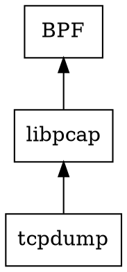

## 简介

[tcpdump](https://www.tcpdump.org/) 命令可用于捕获 Linux 系统上的网络流量。

*libpcap*，一个用于网络流量捕获的可移植 C/C++ 库。



tcpdump 在 ip_rcv 或 arp_rcv 之前工作

## 设备查找

pcap-npf.c 有它自己的 pcap_lookupdev()，出于兼容性原因，因为它实际上返回所有接口的名称，之间用 NUL 分隔；某些调用者可能依赖于此。

MS-DOS 有它自己的 pcap_lookupdev()，但这可能仅作为优化有用。

在所有其他情况下，我们只使用 pcap_findalldevs() 获取设备列表并从中选择。

```c
#if !defined(HAVE_PACKET32) && !defined(MSDOS)
/*
 * 返回系统上连接的网络接口的名称，如果找不到则返回 NULL。
 * 接口必须配置为 up；首选最低单元号；忽略回环。
 */
char *
pcap_lookupdev(char *errbuf)
{
   pcap_if_t *alldevs;
#ifdef _WIN32
  /*
   * Windows - 使用与旧 WinPcap 3.1 代码相同的大小。
   * XXX - 这可能比需要的要大。
   */
  #define IF_NAMESIZE 8192
#else
  /*
   * UN*X - 使用系统的接口名称大小。
   * XXX - 对于不是常规网络接口的捕获设备，这可能不够大。
   */
  /* 用于旧 BSD 系统，包括 bsdi3 */
  #ifndef IF_NAMESIZE
  #define IF_NAMESIZE IFNAMSIZ
  #endif
#endif
   static char device[IF_NAMESIZE + 1];
   char *ret;

   /*
    * 我们在"新 API"模式下禁用此功能，因为 1) 在 WinPcap/Npcap 中，
    * 它可能返回 UTF-16 字符串，出于向后兼容性原因，
    * 并且我们也禁用了使其工作的 hack，出于不超出字符串末尾的原因，
    * 以及 2) 我们希望其行为一致。
    *
    * 此外，它不是线程安全的，因此我们已将其标记为
    * 已弃用。
    */
   if (pcap_new_api) {
      snprintf(errbuf, PCAP_ERRBUF_SIZE,
          "pcap_lookupdev() is deprecated and is not supported in programs calling pcap_init()");
      return (NULL);
   }

   if (pcap_findalldevs(&alldevs, errbuf) == -1)
      return (NULL);

   if (alldevs == NULL || (alldevs->flags & PCAP_IF_LOOPBACK)) {
      /*
       * 列表中没有任何设备，或者列表中的第一个设备
       * 是回环设备，这意味着列表中没有非回环设备。
       * 这意味着我们无法返回任何设备。
       *
       * XXX - 为什么不返回回环设备？如果无法在其上捕获，
       * 它不会出现在列表中，如果它在列表中，
       * 则没有非回环设备，那么为什么不直接将其作为默认设备提供？
       */
      (void)pcap_strlcpy(errbuf, "no suitable device found",
          PCAP_ERRBUF_SIZE);
      ret = NULL;
   } else {
      /*
       * 返回列表中第一个设备的名称。
       */
      (void)pcap_strlcpy(device, alldevs->name, sizeof(device));
      ret = device;
   }

   pcap_freealldevs(alldevs);
   return (ret);
}
#endif /* !defined(HAVE_PACKET32) && !defined(MSDOS) */
```

## pcap

### pcap_findalldevs

```c
/*
 * 获取所有已启动且我们可以打开捕获源的列表。
 * 出错返回 -1，否则返回 0。
 * 通过 "alldevsp" 返回的列表可能为空，如果没有接口启动且可打开。
 */
int
pcap_findalldevs(pcap_if_t **alldevsp, char *errbuf)
{
   size_t i;
   pcap_if_list_t devlist;

   /*
    * 查找所有我们可以在其上捕获的本地网络接口。
    */
   devlist.beginning = NULL;
   if (pcap_platform_finddevs(&devlist, errbuf) == -1) {
      /*
       * 失败 - 释放我们在失败之前获得的所有条目。
       */
      if (devlist.beginning != NULL)
         pcap_freealldevs(devlist.beginning);
      *alldevsp = NULL;
      return (-1);
   }

   /*
    * 向每个非本地网络接口的捕获源类型询问它们有哪些接口。
    */
   for (i = 0; capture_source_types[i].findalldevs_op != NULL; i++) {
      if (capture_source_types[i].findalldevs_op(&devlist, errbuf) == -1) {
         /*
          * 发生错误；释放我们正在构建的列表。
          */
         if (devlist.beginning != NULL)
            pcap_freealldevs(devlist.beginning);
         *alldevsp = NULL;
         return (-1);
      }
   }

   /*
    * 返回所有设备列表的第一个条目。
    */
   *alldevsp = devlist.beginning;
   return (0);
}
```

```c
// net/packet/af_packet.c
static const struct net_proto_family packet_family_ops = {
       .family =      PF_PACKET,
       .create =      packet_create,
       .owner =      THIS_MODULE,
};
```

## 跟踪

```shell
strace tcpdump port 80
```

调用 [create socket](/docs/CS/OS/Linux/net/socket.md?id=create)

```shell
#define ETH_P_ALL	0x0003		/* 每个数据包（小心！！！） */

// Documentation/networking/filter.rst
socket(PF_PACKET, SOCK_RAW, htons(ETH_P_ALL))
```

### 创建

#### packet_create

设置 `po->prot_hook.func = packet_rcv;`

__register_prot_hook

```c
static int packet_create(struct net *net, struct socket *sock, int protocol,
                      int kern)
{
       struct sock *sk;
       struct packet_sock *po;
       __be16 proto = (__force __be16)protocol; /* weird, but documented */
       int err;

       if (!ns_capable(net->user_ns, CAP_NET_RAW))
              return -EPERM;
       if (sock->type != SOCK_DGRAM && sock->type != SOCK_RAW &&
           sock->type != SOCK_PACKET)
              return -ESOCKTNOSUPPORT;

       sock->state = SS_UNCONNECTED;

       err = -ENOBUFS;
       sk = sk_alloc(net, PF_PACKET, GFP_KERNEL, &packet_proto, kern);
   
       sock->ops = &packet_ops;
       if (sock->type == SOCK_PACKET)
              sock->ops = &packet_ops_spkt;

       sock_init_data(sock, sk);

       po = pkt_sk(sk);
       init_completion(&po->skb_completion);
       sk->sk_family = PF_PACKET;
       po->num = proto;
       po->xmit = dev_queue_xmit;

       err = packet_alloc_pending(po);
       if (err)
              goto out2;

       packet_cached_dev_reset(po);

       sk->sk_destruct = packet_sock_destruct;
       sk_refcnt_debug_inc(sk);

       /*
        *     附加一个协议块
        */

       spin_lock_init(&po->bind_lock);
       mutex_init(&po->pg_vec_lock);
       po->rollover = NULL;
       po->prot_hook.func = packet_rcv;

       if (sock->type == SOCK_PACKET)
              po->prot_hook.func = packet_rcv_spkt;

       po->prot_hook.af_packet_priv = sk;

       if (proto) {
              po->prot_hook.type = proto;
              __register_prot_hook(sk);
       }

       mutex_lock(&net->packet.sklist_lock);
       sk_add_node_tail_rcu(sk, &net->packet.sklist);
       mutex_unlock(&net->packet.sklist_lock);

       preempt_disable();
       sock_prot_inuse_add(net, &packet_proto, 1);
       preempt_enable();

       return 0;
out2:
       sk_free(sk);
out:
       return err;
}
```

__register_prot_hook 必须通过 register_prot_hook 调用，或从无法异步访问数据包套接字的上下文中调用（packet_create()）。

```c
//
static void __register_prot_hook(struct sock *sk)
{
       struct packet_sock *po = pkt_sk(sk);

       if (!po->running) {
              if (po->fanout)
                     __fanout_link(sk, po);
              else
                     dev_add_pack(&po->prot_hook);

              sock_hold(sk);
              po->running = 1;
       }
}
```

### 接收

#### packet_rcv

此函数进行延迟 skb 克隆，希望大多数数据包被 BPF 丢弃。
注意棘手部分：我们确实修改了共享的 skb！skb->data、skb->len 和 skb->cb 被修改。
之所以能工作，是因为（且直到）落入此处的数据包属于当前 CPU。输出数据包由 dev_queue_xmit_nit() 克隆，输入数据包由 net_bh 顺序处理，因此如果我们在退出时将 skb 恢复到原始状态，
我们不会伤害任何人。

```c
// 
static int packet_rcv(struct sk_buff *skb, struct net_device *dev,
                    struct packet_type *pt, struct net_device *orig_dev)
{
       struct sock *sk;
       struct sockaddr_ll *sll;
       struct packet_sock *po;
       u8 *skb_head = skb->data;
       int skb_len = skb->len;
       unsigned int snaplen, res;
       bool is_drop_n_account = false;

       if (skb->pkt_type == PACKET_LOOPBACK)
              goto drop;

       sk = pt->af_packet_priv;
       po = pkt_sk(sk);

       if (!net_eq(dev_net(dev), sock_net(sk)))
              goto drop;

       skb->dev = dev;

       if (dev_has_header(dev)) {
              /* 设备有显式的 ll header 概念，
               * 导出到更高层。
               *
               * 否则，设备隐藏其帧结构的细节，
               * 因此相应的数据包头永远不会交付给用户。
               */
              if (sk->sk_type != SOCK_DGRAM)
                     skb_push(skb, skb->data - skb_mac_header(skb));
              else if (skb->pkt_type == PACKET_OUTGOING) {
                     /* 特殊情况：传出数据包在头部有 ll header */
                     skb_pull(skb, skb_network_offset(skb));
              }
       }

       snaplen = skb->len;

       res = run_filter(skb, sk, snaplen); /** BPF 过滤器 */
       if (!res)
              goto drop_n_restore;
       if (snaplen > res)
              snaplen = res;

       if (atomic_read(&sk->sk_rmem_alloc) >= sk->sk_rcvbuf)
              goto drop_n_acct;

       if (skb_shared(skb)) {
              struct sk_buff *nskb = skb_clone(skb, GFP_ATOMIC);
              if (nskb == NULL)
                     goto drop_n_acct;

              if (skb_head != skb->data) {
                     skb->data = skb_head;
                     skb->len = skb_len;
              }
              consume_skb(skb);
              skb = nskb;
       }

       sock_skb_cb_check_size(sizeof(*PACKET_SKB_CB(skb)) + MAX_ADDR_LEN - 8);

       sll = &PACKET_SKB_CB(skb)->sa.ll;
       sll->sll_hatype = dev->type;
       sll->sll_pkttype = skb->pkt_type;
       if (unlikely(po->origdev))
              sll->sll_ifindex = orig_dev->ifindex;
       else
              sll->sll_ifindex = dev->ifindex;

       sll->sll_halen = dev_parse_header(skb, sll->sll_addr);

       /* sll->sll_family 和 sll->sll_protocol 在 packet_recvmsg() 中设置。
        * 使用它们的空间存储原始 skb 长度。
        */
       PACKET_SKB_CB(skb)->sa.origlen = skb->len;

       if (pskb_trim(skb, snaplen))
              goto drop_n_acct;

       skb_set_owner_r(skb, sk);
       skb->dev = NULL;
       skb_dst_drop(skb);

       /* 丢弃 conntrack 引用 */
       nf_reset_ct(skb);

       spin_lock(&sk->sk_receive_queue.lock);
       po->stats.stats1.tp_packets++;
       sock_skb_set_dropcount(sk, skb);
       __skb_queue_tail(&sk->sk_receive_queue, skb);
       spin_unlock(&sk->sk_receive_queue.lock);
       sk->sk_data_ready(sk);
       return 0;

drop_n_acct:
       is_drop_n_account = true;
       atomic_inc(&po->tp_drops);
       atomic_inc(&sk->sk_drops);

drop_n_restore:
       if (skb_head != skb->data && skb_shared(skb)) {
              skb->data = skb_head;
              skb->len = skb_len;
       }
drop:
       if (!is_drop_n_account)
              consume_skb(skb);
       else
              kfree_skb(skb);
       return 0;
}
```

#### packet_recvmsg

从接收队列中拉取数据包并将其交给用户。
必要时阻塞。

```c
// 
static int packet_recvmsg(struct socket *sock, struct msghdr *msg, size_t len,
                       int flags)
{
       struct sock *sk = sock->sk;
       struct sk_buff *skb;
       int copied, err;
       int vnet_hdr_len = 0;
       unsigned int origlen = 0;

       err = -EINVAL;
       if (flags & ~(MSG_PEEK|MSG_DONTWAIT|MSG_TRUNC|MSG_CMSG_COMPAT|MSG_ERRQUEUE))
              goto out;

#if 0
       /* 我们现在应返回什么错误？EUNATTACH？ */
       if (pkt_sk(sk)->ifindex < 0)
              return -ENODEV;
#endif

       if (flags & MSG_ERRQUEUE) {
              err = sock_recv_errqueue(sk, msg, len,
                                    SOL_PACKET, PACKET_TX_TIMESTAMP);
              goto out;
       }

       /*
        *     调用通用数据报接收器。这处理所有类型的
        *     可怕的竞争和重入问题，因此我们可以在协议层忘记它。
        *
        *     现在如果设备刚刚关闭，它将返回 ENETDOWN，
        *     但它将阻塞。
        */

       skb = skb_recv_datagram(sk, flags, flags & MSG_DONTWAIT, &err);

       /*
        *     发生错误，返回它。因为 skb_recv_datagram()
        *     处理阻塞，我们看不到也不担心阻塞重试。
        */

       if (skb == NULL)
              goto out;

       packet_rcv_try_clear_pressure(pkt_sk(sk));

       if (pkt_sk(sk)->has_vnet_hdr) {
              err = packet_rcv_vnet(msg, skb, &len);
              if (err)
                     goto out_free;
              vnet_hdr_len = sizeof(struct virtio_net_hdr);
       }

       /* 超出你给缓冲区的任何数据都会丢失。如果它让
        * 用户程序担心，它们可以询问设备的 MTU
        * 无论如何。
        */
       copied = skb->len;
       if (copied > len) {
              copied = len;
              msg->msg_flags |= MSG_TRUNC;
       }

       err = skb_copy_datagram_msg(skb, 0, msg, copied);
       if (err)
              goto out_free;

       if (sock->type != SOCK_PACKET) {
              struct sockaddr_ll *sll = &PACKET_SKB_CB(skb)->sa.ll;

              /* 原始长度存储在 sockaddr_ll 字段中 */
              origlen = PACKET_SKB_CB(skb)->sa.origlen;
              sll->sll_family = AF_PACKET;
              sll->sll_protocol = skb->protocol;
       }

       sock_recv_ts_and_drops(msg, sk, skb);

       if (msg->msg_name) {
              int copy_len;

              /* 如果地址长度字段有待填充，
               * 我们现在填充它。
               */
              if (sock->type == SOCK_PACKET) {
                     __sockaddr_check_size(sizeof(struct sockaddr_pkt));
                     msg->msg_namelen = sizeof(struct sockaddr_pkt);
                     copy_len = msg->msg_namelen;
              } else {
                     struct sockaddr_ll *sll = &PACKET_SKB_CB(skb)->sa.ll;

                     msg->msg_namelen = sll->sll_halen +
                            offsetof(struct sockaddr_ll, sll_addr);
                     copy_len = msg->msg_namelen;
                     if (msg->msg_namelen < sizeof(struct sockaddr_ll)) {
                            memset(msg->msg_name +
                                   offsetof(struct sockaddr_ll, sll_addr),
                                   0, sizeof(sll->sll_addr));
                            msg->msg_namelen = sizeof(struct sockaddr_ll);
                     }
              }
              memcpy(msg->msg_name, &PACKET_SKB_CB(skb)->sa, copy_len);
       }

       if (pkt_sk(sk)->auxdata) {
              struct tpacket_auxdata aux;

              aux.tp_status = TP_STATUS_USER;
              if (skb->ip_summed == CHECKSUM_PARTIAL)
                     aux.tp_status |= TP_STATUS_CSUMNOTREADY;
              else if (skb->pkt_type != PACKET_OUTGOING &&
                       (skb->ip_summed == CHECKSUM_COMPLETE ||
                        skb_csum_unnecessary(skb)))
                     aux.tp_status |= TP_STATUS_CSUM_VALID;

              aux.tp_len = origlen;
              aux.tp_snaplen = skb->len;
              aux.tp_mac = 0;
              aux.tp_net = skb_network_offset(skb);
              if (skb_vlan_tag_present(skb)) {
                     aux.tp_vlan_tci = skb_vlan_tag_get(skb);
                     aux.tp_vlan_tpid = ntohs(skb->vlan_proto);
                     aux.tp_status |= TP_STATUS_VLAN_VALID | TP_STATUS_VLAN_TPID_VALID;
              } else {
                     aux.tp_vlan_tci = 0;
                     aux.tp_vlan_tpid = 0;
              }
              put_cmsg(msg, SOL_PACKET, PACKET_AUXDATA, sizeof(aux), &aux);
       }

       /*
        *     释放或返回缓冲区。再次，
        *     这隐藏了我们所有的竞争和重入问题。
        */
       err = vnet_hdr_len + ((flags&MSG_TRUNC) ? skb->len : copied);

out_free:
       skb_free_datagram(sk, skb);
out:
       return err;
}
```

## 过滤器

### run_filter

## 总结

## 链接

- [BPF](/docs/CS/OS/Linux/Tools/BPF.md)
- [Xcap](/docs/CS/CN/Tools/Xcap.md)
- [WireShark](/docs/CS/CN/Tools/WireShark.md)
- [netfilter](/docs/CS/CN/Tools/netfilter.md)

## 参考文献

1. [TCPDUMP & LiBPCAP](https://www.tcpdump.org/index.html#documentation)
2. [Linux内核角度分析tcpdump原理](https://mp.weixin.qq.com/s?__biz=Mzg5MTU1ODgyMA==&mid=2247483799&idx=1&sn=d31ddd924b8809040c004c5f163cb61d&chksm=cfcacf5cf8bd464abdab4c3a9b571d6e52d0a8d0ee9d71191bbe8ed3c3dfb084e303b636afce&scene=178&cur_album_id=2086465918313775105#rd)
3. [The BSD Packet Filter: A New Architecture for User-level Packet Capture](https://www.tcpdump.org/papers/bpf-usenix93.pdf)
