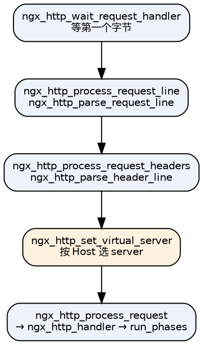

## Introduction

worker 进程在一个 `for` 循环里反复调用事件模块检测网络事件（见 [Event](/docs/CS/CN/nginx/event.md)）。当事件模块检测到监听套接字可读，就会 `accept` 建立 TCP 连接，并按 `nginx.conf` 的配置把它交给 HTTP 框架；HTTP 框架先接收并解析完整的请求行与请求头，然后把请求**分发**给具体的 HTTP 模块处理——最常见的分发依据是请求的 URI 与 `location` 配置的匹配结果。

处理结束时，模块大多要向客户端发送响应，此时会**自动依次调用所有 HTTP 过滤模块**，每个过滤模块按自己的配置决定行为（例如 gzip 模块看 `gzip on|off`）。如果处理模块在返回前设置了子请求（subrequest），HTTP 框架还会继续异步调用合适的模块处理它——`mirror`、`auth_request`、`SSI`、`addition` 都建立在这个能力之上。

本文按请求的生命周期展开：连接 → 解析 → 阶段 → 内容 → 过滤 → 结束 → 长连接。配置与 location 匹配见 [Configuration](/docs/CS/CN/nginx/config.md)，上游交互见 [Upstream](/docs/CS/CN/nginx/upstream.md)。

## 连接建立与请求解析

```c
// http/ngx_http_request.c
void
ngx_http_init_connection(ngx_connection_t *c)
{
    /* 按 listen 找到 addr_conf，暂定 default_server */
    port = c->listening->servers;
    if (port->naddrs > 1) { /* getsockname() 比对本地地址 */ }
    hc->conf_ctx = hc->addr_conf->default_server->ctx;

    rev = c->read;
    rev->handler = ngx_http_wait_request_handler;   /* 等客户端发第一个字节 */
    c->write->handler = ngx_http_empty_handler;

    if (rev->ready) {
        /* 已经有数据（deferred accept / 复用连接），直接跑一次 */
        ngx_post_event(rev, &ngx_posted_events);
    } else {
        ngx_add_timer(rev, cscf->client_header_timeout);
        ngx_handle_read_event(rev, 0);
    }
}
```

注意这里**不做 Host 匹配**，`server` 的选择要等请求头解析完（`ngx_http_set_virtual_server()`）才定下来。

解析链路：



`ngx_http_handler()` 决定从哪个阶段开始跑，这是"外部请求"与"内部重定向"的分水岭：

```c
if (!r->internal) {
    switch (r->headers_in.connection_type) {
    case 0:  r->keepalive = (r->http_version > NGX_HTTP_VERSION_10); break;
    case NGX_HTTP_CONNECTION_CLOSE:      r->keepalive = 0; break;
    case NGX_HTTP_CONNECTION_KEEP_ALIVE: r->keepalive = 1; break;
    }
    r->lingering_close = (r->headers_in.content_length_n > 0 || r->headers_in.chunked);
    r->phase_handler = 0;                       /* 从头开始：含 POST_READ */
} else {
    cmcf = ngx_http_get_module_main_conf(r, ngx_http_core_module);
    r->phase_handler = cmcf->phase_engine.server_rewrite_index;   /* 跳过 POST_READ */
}

r->write_event_handler = ngx_http_core_run_phases;
ngx_http_core_run_phases(r);
```

## 阶段机制

### 11 个阶段

```c
// http/ngx_http_core_module.h
typedef enum {
    NGX_HTTP_POST_READ_PHASE = 0,
    NGX_HTTP_SERVER_REWRITE_PHASE,
    NGX_HTTP_FIND_CONFIG_PHASE,
    NGX_HTTP_REWRITE_PHASE,
    NGX_HTTP_POST_REWRITE_PHASE,
    NGX_HTTP_PREACCESS_PHASE,
    NGX_HTTP_ACCESS_PHASE,
    NGX_HTTP_POST_ACCESS_PHASE,
    NGX_HTTP_PRECONTENT_PHASE,
    NGX_HTTP_CONTENT_PHASE,
    NGX_HTTP_LOG_PHASE
} ngx_http_phases;
```

| # | 阶段 | 典型挂载者 | 说明 |
| :-- | :-- | :-- | :-- |
| 0 | `POST_READ` | `realip` | 读到请求头之后立即执行，用来改写客户端地址 |
| 1 | `SERVER_REWRITE` | `rewrite` | server 级改写，早于 location 匹配 |
| 2 | `FIND_CONFIG` | 框架内置 | location 匹配，切换 `r->loc_conf` |
| 3 | `REWRITE` | `rewrite` | location 级改写 |
| 4 | `POST_REWRITE` | 框架内置 | 改写后跳回 FIND_CONFIG |
| 5 | `PREACCESS` | `limit_req`、`limit_conn`、`realip` | 限流，早于鉴权 |
| 6 | `ACCESS` | `access`、`auth_basic`、`auth_request` | 鉴权 |
| 7 | `POST_ACCESS` | 框架内置 | 处理 `satisfy any/all` |
| 8 | `PRECONTENT` | `try_files`、`mirror` | 内容生成前的最后机会 |
| 9 | `CONTENT` | `static`、`index`、`proxy`、`fastcgi` | 真正产生响应 |
| 10 | `LOG` | `access_log` | 请求结束时记录 |

> 易错点：`try_files` 和 `mirror` 在 **PRECONTENT**，不是 CONTENT。

### 从二维到一维：phase engine

配置期每个模块往 `cmcf->phases[阶段]` 这个数组里 push handler；解析完成后 `ngx_http_init_phase_handlers()` 把 11 个数组**展开成一维数组**，并给每个 handler 配一个 checker：

```c
struct ngx_http_phase_handler_s {
    ngx_http_phase_handler_pt  checker;
    ngx_http_handler_pt        handler;
    ngx_uint_t                 next;          /* 跳到哪个索引（跳过本阶段剩余 handler） */
};

typedef struct {
    ngx_http_phase_handler_t  *handlers;      /* 一维数组，末尾有 checker==NULL 的哨兵 */
    ngx_uint_t                 server_rewrite_index;
    ngx_uint_t                 location_rewrite_index;
} ngx_http_phase_engine_t;
```

运行时的循环短得惊人：

```c
void
ngx_http_core_run_phases(ngx_http_request_t *r)
{
    cmcf = ngx_http_get_module_main_conf(r, ngx_http_core_module);
    ph = cmcf->phase_engine.handlers;

    while (ph[r->phase_handler].checker) {
        rc = ph[r->phase_handler].checker(r, &ph[r->phase_handler]);
        if (rc == NGX_OK) return;      /* 交出控制权：异步等待或已完成 */
    }
}
```

> **checker 的返回值语义与 handler 完全不同**：`checker` 返回 `NGX_OK` = 交出控制权（退出循环），返回 `NGX_AGAIN` = 继续下一个 handler。这是理解阶段机制最容易搞反的地方。

### checker 语义表

| checker | handler 返回 | checker 行为 | 返回给 run_phases |
| :-- | :-- | :-- | :-- |
| generic（POST_READ / PREACCESS / PRECONTENT） | `NGX_OK` | `phase_handler = ph->next`（跳过本阶段剩余） | AGAIN |
| | `NGX_DECLINED` | `phase_handler++` | AGAIN |
| | `NGX_AGAIN` / `NGX_DONE` | 不动 | **OK**（交出控制权） |
| | 其它 | `finalize_request` | OK |
| rewrite | `NGX_DECLINED` | `phase_handler++` | AGAIN |
| | `NGX_OK` / `AGAIN` / `ERROR` / `HTTP_xxx` | **`finalize_request`** | OK |
| find_config | — | 匹配成功后 `phase_handler++` | AGAIN |
| access | `NGX_OK` + `satisfy all` | `phase_handler++` | AGAIN |
| | `NGX_OK` + `satisfy any` | `access_code=0`，跳到 `ph->next`（**跳过 post_access**） | AGAIN |
| | `403/401` + `satisfy any` | 记下 `access_code`，`phase_handler++` | AGAIN |
| post_access | — | `access_code` 非 0 → finalize；否则继续 | — |
| content | — | 见下 | — |

> ⚠️ **rewrite checker 里 `NGX_OK` 会导致 `finalize_request`**，不是"成功继续"。所以 rewrite 模块的 handler 要让流程继续必须返回 `NGX_DECLINED`。这是最常见的误读。

### 展开算法的两个跳转点

`server_rewrite_index` 与 `location_rewrite_index` 记录了两个"入口"，供内部重定向使用：

- 外部请求：`phase_handler = 0`
- 内部重定向（`ngx_http_internal_redirect`）：`phase_handler = server_rewrite_index` → 重新走 SERVER_REWRITE + FIND_CONFIG
- 命名 location（`ngx_http_named_location`）：`phase_handler = location_rewrite_index` → 从 REWRITE 开始，**不重新匹配 location**

另外展开时 handler 是**倒序写入**的（`j = nelts-1 → 0`），所以同一阶段内**后注册的模块先执行**；`ph->next` 指向下一阶段的第一个 handler。

### LOG 阶段的特殊性

LOG 阶段**不进 phase engine**（展开循环的上界是 `i < NGX_HTTP_LOG_PHASE`）。它在请求销毁时由框架直接同步调用：

```c
static void
ngx_http_log_request(ngx_http_request_t *r)
{
    cmcf = ngx_http_get_module_main_conf(r, ngx_http_core_module);
    log_handler = cmcf->phases[NGX_HTTP_LOG_PHASE].handlers.elts;
    n = cmcf->phases[NGX_HTTP_LOG_PHASE].handlers.nelts;

    for (i = 0; i < n; i++) {
        log_handler[i](r);      /* 没有 checker，返回值被忽略 */
    }
}
```

### CONTENT 阶段为什么特殊

```c
ngx_int_t
ngx_http_core_content_phase(ngx_http_request_t *r, ngx_http_phase_handler_t *ph)
{
    if (r->content_handler) {
        r->write_event_handler = ngx_http_request_empty_handler;
        ngx_http_finalize_request(r, r->content_handler(r));
        return NGX_OK;
    }

    rc = ph->handler(r);
    if (rc != NGX_DECLINED) { ngx_http_finalize_request(r, rc); return NGX_OK; }

    ph++;
    if (ph->checker) { r->phase_handler++; return NGX_AGAIN; }

    /* no content handler was found */
    if (r->uri.data[r->uri.len - 1] == '/') {
        /* 目录且没有 index → 403 */
        ngx_http_finalize_request(r, NGX_HTTP_FORBIDDEN);
        return NGX_OK;
    }
    ngx_http_finalize_request(r, NGX_HTTP_NOT_FOUND);      /* 404 */
    return NGX_OK;
}
```

要点：

- `clcf->handler` **只能有一个**。`proxy_pass`、`fastcgi_pass`、`grpc_pass` 等都是给 `clcf->handler` 赋值，同一个 location 里写两个会报 `is duplicate`；
- 一旦 location 有 content handler，CONTENT 阶段数组里的 `static` / `index` / `autoindex` **一个都不会跑**；
- 全跑完都是 `NGX_DECLINED` 的结果：`/` 结尾 → 403（无 index），否则 404。

## 过滤链

响应是分两步发出去的：先跑 header 过滤链，再跑 body 过滤链。

```c
ngx_int_t
ngx_http_send_header(ngx_http_request_t *r)
{
    if (r->header_sent) { /* "header already sent" */ return NGX_ERROR; }
    return ngx_http_top_header_filter(r);
}

ngx_int_t
ngx_http_output_filter(ngx_http_request_t *r, ngx_chain_t *in)
{
    rc = ngx_http_top_body_filter(r, in);
    if (rc == NGX_ERROR) { r->connection->error = 1; }
    return rc;
}
```

链表的构造是**编译期静态完成**的：每个过滤模块在自己的 `postconfiguration` 里"抢占链头"：

```c
static ngx_int_t
ngx_http_headers_filter_init(ngx_conf_t *cf)
{
    ngx_http_next_header_filter = ngx_http_top_header_filter;
    ngx_http_top_header_filter = ngx_http_headers_filter;

    ngx_http_next_body_filter = ngx_http_top_body_filter;
    ngx_http_top_body_filter = ngx_http_trailers_filter;
    return NGX_OK;
}
```

因为 `postconfiguration` 按 `ngx_modules[]` 顺序执行，而每个模块都插到链头，所以**执行顺序是模块数组顺序的逆序**。`auto/modules` 里显式排出的顺序（节选，从"最先执行"到"最后执行"）：

```
slice → not_modified → range_body → copy → headers → userid → gunzip
      → addition → sub → image → xslt → charset → ssi → postpone → gzip
      → range_header → v3 → v2 → chunked → header_filter → write_filter
```

链尾是 `ngx_http_write_filter`（body）与 `ngx_http_header_filter`（header），它们不保存 next 指针——因为它们是最先被初始化的。

> 一个容易忽略的细节：**header 链尾 `ngx_http_header_filter` 会直接调用 `ngx_http_write_filter`**，绕过整个 body 过滤链。所以响应头不会被 gzip / sub / charset 等 body filter 处理。

## 子请求与 posted requests

子请求（subrequest）是 nginx 内部"在自己的请求里再发一个请求"，用于 `mirror`、`auth_request`、`SSI`、`addition`、`slice`、`image_filter` 等。

子请求不是在当前调用栈里立即执行的，而是**入队延后执行**：

```c
void
ngx_http_run_posted_requests(ngx_connection_t *c)
{
    for ( ;; ) {
        if (c->destroyed) return;
        r = c->data;
        pr = r->main->posted_requests;
        if (pr == NULL) return;

        r->main->posted_requests = pr->next;
        r = pr->request;
        ngx_http_set_log_request(c->log, r);
        r->write_event_handler(r);          /* 继续这个请求的流程 */
    }
}
```

- 队列挂在**主请求**的 `posted_requests` 上（不是连接上），所有子请求共享；
- 尾插 FIFO，一趟循环跑到空为止（新入队的也会被处理）；
- `ngx_http_post_request()` 会去重：同一个 request 不会被重复入队。

这样设计避免了深层递归导致的栈溢出，也让子请求的调度完全受事件循环控制。

`ngx_http_finalize_request()` → `ngx_http_finalize_connection()` 的末尾会调用 `ngx_http_run_posted_requests()`，所以"主请求结束"不等于"连接结束"——可能还有子请求在跑。

## 响应发送与连接收尾

### 发送路径

```
ngx_http_send_header()  →  header 过滤链  →  ngx_http_header_filter  →  ngx_http_write_filter
ngx_http_output_filter() →  body 过滤链   →  ... → ngx_http_write_filter
                                                    ↓
                                    ngx_linux_sendfile_chain()  /  ngx_writev_chain()
```

`ngx_http_write_filter` 决定到底用 `sendfile` 还是 `writev`：缓冲区里如果有文件（`b->in_file`）就用 `sendfile`（零拷贝），否则用 `writev` 合并多个小缓冲（减少 syscall）。`postpone_output`（默认 1460 字节）会让 nginx 攒够一个 MSS 再发，配合 `tcp_nopush`（`TCP_CORK`）把响应头与首块数据塞进同一个报文。

### lingering close

如果客户端还在发请求体（如 POST 上传未读完）而 nginx 要关闭连接，直接 `close()` 会导致内核发 RST，客户端可能收不到完整响应。nginx 的处理是**延迟关闭**：

```nginx
lingering_close on;        # 默认 on
lingering_time 30s;        # 最多等这么久
lingering_timeout 5s;      # 单次读超时
```

nginx 会先把响应写完，然后继续读（并丢弃）客户端剩余数据，直到读完或超时，才真正关闭。日志里的 `499`（client closed request）往往与连接被客户端提前关闭有关。

### keepalive

```nginx
keepalive_timeout 75s;       # 空闲连接保留多久
keepalive_requests 1000;     # 单连接最多服务多少请求（1.19.10 起默认 1000，此前 100）
keepalive_time 1h;           # 单连接最长存活时间（1.19.10+）
```

`keepalive_requests` 达到上限后 nginx 会在响应里带上 `Connection: close`。定期轮换连接的好处是限制单连接的累积状态（内存池、变量缓存）与错误。

这层「连接复用」完全建立在 TCP 之上：空闲超时关闭、`Connection: close` 后的 FIN 挥手，都对应内核的连接状态机；`worker_connections` 与 `somaxconn` 一起决定到底能挂住多少这样的连接，见 [TCP](/docs/CS/OS/Linux/net/TCP/TCP.md)。

## HTTP/2

HTTP/2 由 `ngx_http_v2_module` 实现（1.9.5 起），启用方式在 1.25.1 之后改成了独立指令：

```nginx
server {
    listen 443 ssl;
    http2 on;                # 1.25.1 起取代旧的 "listen 443 ssl http2"
    # ...
}
```

关键行为：

- 一条 TCP 连接上并发多个 **stream**，每个 stream 是一个逻辑请求；
- 头部用 **HPACK** 压缩，二进制分帧；
- 并发上限 `http2_max_concurrent_streams`（默认 **128**）；
- 单连接服务满 `http2_max_requests`（默认 **1000**）个请求后，nginx 发 `GOAWAY` 并引导客户端换一条新连接——**这是正常设计，不是错误**；
- 其它默认值：`http2_chunk_size 8k`、`http2_idle_timeout 3m`、`http2_recv_timeout 30s`、`http2_body_preread_size 64k`、`http2_max_field_size 4k`、`http2_max_header_size 16k`；
- 因为所有 stream 共用一条 TCP，丢包时**所有 stream 一起被队头阻塞阻塞**——这正是 HTTP/3 的动机；
- nginx 的 HTTP/2 优先级调度比较简单，不要把依赖树当作可靠的行为。

## HTTP/3（QUIC）

```nginx
http {
    server {
        listen 443 quic reuseport;     # QUIC 走 UDP
        listen 443 ssl;                # 同一端口同时提供 TCP/TLS
        http3 on;

        ssl_protocols TLSv1.3;         # QUIC 强制 TLS 1.3
        add_header Alt-Svc 'h3=":443"; ma=86400';   # 通告客户端可用 HTTP/3
    }
}
```

- 需要 `--with-http_v3_module`（1.25.0 起，实验性质）与 OpenSSL 1.1.1+；0-RTT 需要 OpenSSL 3.5.1+（1.29.1 之前用 OpenSSL 时 0-RTT 不可用）；
- nginx 自带 QUIC 实现，不依赖第三方库；
- `quic_gso`、`quic_retry`、`quic_host_key`、`quic_active_connection_id_limit` 是常用调参项；
- `quic_bpf` 用于 `reuseport` 场景下的连接路由，解决 QUIC 连接迁移（Connection ID 路由）跨 worker 的问题；
- 客户端先走 HTTP/2，通过 `Alt-Svc` 发现 HTTP/3 后升级。

## 流量拷贝

将生产环境的流量拷贝到预上线环境或测试环境，这样做有很多好处：

- 可以验证功能是否正常，以及服务的性能；
- 用真实有效的流量请求去验证，又不用造数据，不影响线上正常访问；
- 这跟灰度发布还不太一样，镜像流量不会影响真实流量；
- 可以用来排查线上问题；
- 重构时，假如服务做了重构，这也是一种测试方式。

`ngx_http_mirror_module` 就是为此提供的（挂在 PRECONTENT 阶段，用子请求实现）：

```nginx
location / {
    mirror /mirror;
    proxy_pass http://backend;
}

location = /mirror {
    internal;
    proxy_pass http://test_backend$request_uri;
}
```

如果请求体被镜像，那么在创建子请求之前会先读取请求体，可以这样关闭读取：

```nginx
location / {
    mirror_request_body off;
}

location = /mirror {
    proxy_pass_request_body off;
    proxy_set_header Content-Length "";
    proxy_set_header X-Original-URI $request_uri;
}
```

注意：镜像子请求的响应**被丢弃**，因此它不会影响主请求的响应，但会消耗连接与上游资源——镜像目标挂掉或很慢时，会通过占用连接间接影响主流程，务必给镜像目标设置极短的超时。

## 状态码速查（nginx 特有）

| 状态码 | 含义 | 常见原因 |
| :-- | :-- | :-- |
| `444` | nginx 自定义：直接断开连接不发响应 | 常配合 `default_server` 拒绝非法 Host |
| `494` | 请求头过大 | `large_client_header_buffers` 不够 |
| `495` / `496` | 客户端证书错误 / 未提供证书 | HTTPS 双向认证 |
| `497` | HTTP 请求发到了 HTTPS 端口 | 可配 `error_page 497 https://$host$request_uri;` 跳转 |
| `499` | 客户端在响应完成前关闭连接 | 客户端超时、用户取消；**这是客户端行为，不是服务端错误** |
| `502` | 上游返回无效响应或连接失败 | 上游挂了、超时、RST |
| `504` | 上游读超时 | `proxy_read_timeout` 太小或上游慢 |

## Links

- [nginx](/docs/CS/CN/nginx/nginx.md)
- [Configuration](/docs/CS/CN/nginx/config.md)
- [Upstream](/docs/CS/CN/nginx/upstream.md)
- [Cache](/docs/CS/CN/nginx/cache.md)
- [Event](/docs/CS/CN/nginx/event.md)
- [ZeroCopy](/docs/CS/OS/Linux/ZeroCopy.md)

## References

1. [Module ngx_http_core_module](https://nginx.org/en/docs/http/ngx_http_core_module.html)
2. [Module ngx_http_v2_module](https://nginx.org/en/docs/http/ngx_http_v2_module.html)
3. [Module ngx_http_v3_module](https://nginx.org/en/docs/http/ngx_http_v3_module.html)
4. [Module ngx_http_mirror_module](https://nginx.org/en/docs/http/ngx_http_mirror_module.html)
5. [nginx 源码：src/http/ngx_http_request.c、ngx_http_core_module.c、ngx_http.c](https://nginx.org/download/nginx-1.31.6.tar.gz)
6. [HTTP/2 in NGINX](https://www.nginx.com/blog/http2-module-nginx/)
