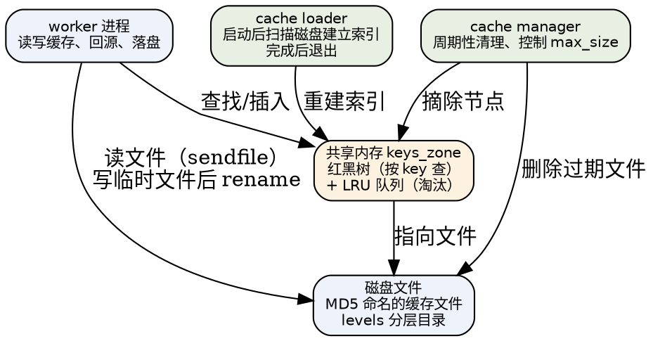
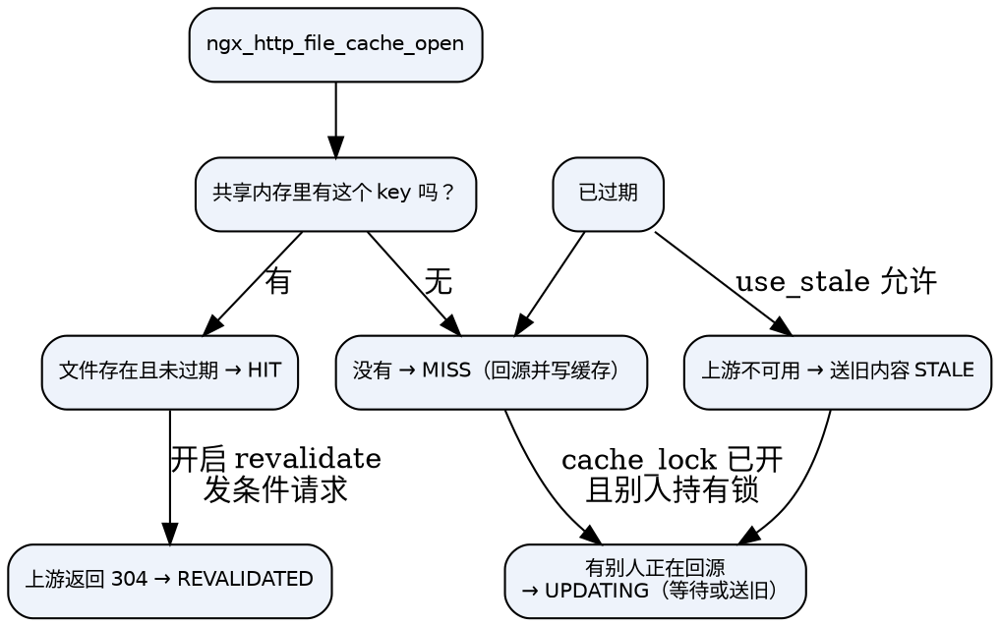

## Introduction

`proxy_cache` 把 nginx 变成一个"能挡在前面的缓存层"：上游返回的响应被写入本地磁盘，后续相同请求直接从本地发出，不必再打上游。它常被用来做静态资源加速、接口读缓存、以及上游故障时的兜底（`proxy_cache_use_stale`）。

理解 nginx 缓存要抓住一个关键分层：**文件内容在磁盘，索引在共享内存**。磁盘负责存字节，共享内存存"这个 key 在哪个文件、多大、什么时候过期、有没有人在更新它"。二者通过 MD5 key 关联，由两个辅助进程维护生命周期。

本文按"由浅入深"：先给可用配置，再讲状态机与数据布局，最后是击穿防护、过期策略与调优。上游侧的负载均衡与重试见 [Upstream](/docs/CS/CN/nginx/upstream.md)。

```nginx
http {
    proxy_cache_path /var/cache/nginx levels=1:2 keys_zone=mycache:100m
                     max_size=10g inactive=60m use_temp_path=off
                     loader_files=200 loader_sleep=50ms loader_threshold=300ms;

    server {
        location / {
            proxy_cache           mycache;
            proxy_cache_key       $scheme$proxy_host$request_uri;
            proxy_cache_valid     200 302 10m;
            proxy_cache_valid     404      1m;
            proxy_cache_valid     any      0;      # 其他状态码不缓存

            proxy_cache_lock      on;              # 防击穿
            proxy_cache_lock_age  5s;
            proxy_cache_use_stale error timeout updating http_502 http_503 http_504;
            proxy_cache_background_update on;      # stale-while-revalidate

            proxy_cache_min_uses  2;               # 同一 key 命中 2 次才缓存
            proxy_ignore_headers  Cache-Control Expires Set-Cookie;

            add_header X-Cache-Status $upstream_cache_status;
            proxy_pass http://backend;
        }
    }
}
```

## 三部分组成



## 状态机

一次请求在缓存侧的判定发生在 `ngx_http_upstream_cache()` 与 `ngx_http_file_cache_open()` 之间：



### 七个缓存状态

`$upstream_cache_status` 的取值定义在源码里只有 7 个：

| 值 | 含义 |
| :-- | :-- |
| `MISS` | 没找到缓存，回源并写入 |
| `HIT` | 命中且有效 |
| `EXPIRED` | 条目存在但已过期（上游给了新内容） |
| `STALE` | 条目过期，但因为上游不可用而送旧内容 |
| `UPDATING` | 条目过期且**正在被后台更新**，本次送旧内容 |
| `REVALIDATED` | 发条件请求后上游返回 304，刷新有效期 |
| `BYPASS` | 被 `proxy_cache_bypass` 明确跳过 |

> 源码里还有一个内部状态 `NGX_HTTP_CACHE_SCARCE`（编号 8），表示"暂时不写缓存"（例如 `min_uses` 未达标，或 slab 分配失败）。它**不会**出现在 `$upstream_cache_status` 里，只是把 `u->cacheable` 置 0。很多资料把它列成第 8 个取值，是错的。

## cache key 与文件布局

```c
// http/ngx_http_file_cache.c
ngx_crc32_init(c->crc32);
ngx_md5_init(&md5);
for (i = 0; i < c->keys.nelts; i++) {
    len += key[i].len;
    ngx_crc32_update(&c->crc32, key[i].data, key[i].len);
    ngx_md5_update(&md5, key[i].data, key[i].len);
}
ngx_md5_final(c->key, &md5);                    /* 16 字节 MD5 */
```

- key = **所有 `proxy_cache_key` 拼串后的 MD5**（16 字节）；
- 文件名 = MD5 的 **32 个十六进制小写字符**；
- `levels=1:2` 表示按 hex 串**从末尾**取字符插入目录分隔符：`/var/cache/nginx/a/bc/deadbeef...`；
- 每级只能取 `1` 或 `2`，最多 3 级；分级的作用是避免单个目录下文件过多（ext4 的 htree 其实够用，但 XFS / 网络文件系统仍受益）；
- 缓存文件的开头是一段**二进制头**（`ngx_http_file_cache_header_t`），包含版本、valid_sec、last_modified、etag、以及 `"\nKEY: <原始 key>"`，之后才是响应头与响应体。响应体在文件中的偏移记为 `body_start`，发送时 `b->file_pos = c->body_start` 直接 `sendfile`。

临时文件：

- `use_temp_path=on`（默认）：临时文件写在 `proxy_temp_path`，完成后 `rename()` 到缓存目录——**跨设备 rename 会退化成拷贝**，代价很高；
- `use_temp_path=off`（推荐）：临时文件直接建在缓存目录下，rename 变成同设备原子操作。

写缓存的落盘动作：

```c
rc = ngx_ext_rename_file(&tf->file.name, &c->file.name, &ext);   /* 临时文件 → 正式文件 */
if (rc == NGX_OK) { /* 取 uniq / fs_size */ }
c->node->count--;
c->node->uniq = uniq;
c->node->body_start = c->body_start;
cache->sh->size += fs_size - c->node->fs_size;
c->node->exists = 1;
c->node->updating = 0;
```

## 共享内存索引

`keys_zone=mycache:100m` 里的 100MB 只存索引，不存内容：

```c
// http/ngx_http_cache.h
typedef struct {
    ngx_rbtree_t       rbtree;        /* 按 key（MD5 前 8 字节）查找 */
    ngx_rbtree_node_t  sentinel;
    ngx_queue_t        queue;         /* LRU：队头最近使用，队尾最老 */
    ngx_atomic_t       cold;          /* 冷启动标记：需要 loader 重建 */
    ngx_atomic_t       loading;
    off_t              size;          /* 以 bsize（512B）为单位 */
    ngx_uint_t         count;
    ngx_uint_t         watermark;     /* slab 耗尽水位 */
} ngx_http_file_cache_sh_t;

typedef struct {
    ngx_rbtree_node_t  node;
    ngx_queue_t        queue;
    u_char             key[NGX_HTTP_CACHE_KEY_LEN - sizeof(ngx_rbtree_key_t)];
    unsigned           count:20;      /* 引用计数 */
    unsigned           uses:10;       /* 命中次数（min_uses 用） */
    unsigned           valid_msec:10;
    unsigned           error:10;
    unsigned           exists:1;      /* 文件是否已落盘 */
    unsigned           updating:1;    /* cache_lock 用 */
    unsigned           deleting:1;
    unsigned           purged:1;      /* 1.31 新增 */
    ngx_file_uniq_t    uniq;          /* 文件的 inode/uniq，校验文件未被替换 */
    time_t             expire;        /* inactive 到期时间 */
    time_t             valid_sec;     /* 上游给的 TTL 到期时间 */
    size_t             body_start;    /* 响应体在文件中的偏移 */
    off_t              fs_size;       /* 以 bsize 为单位 */
    ngx_msec_t         lock_time;     /* cache_lock_age 到期时间 */
} ngx_http_file_cache_node_t;
```

容量估算：一个节点约 100~150 字节（视 key 长度），**1 MB 大约能放 8000 个 key**。100MB → 约 80 万条。如果 key 数量超出 zone 容量，slab 分配失败，新的缓存条目会被丢弃（表现为缓存命中率上不去，error log 里出现 slab 分配失败）。

## 击穿防护：cache lock

> [!NOTE]
> 缓存击穿 = 某个热点 key 过期的瞬间，成千上万请求同时 MISS，全部打到上游。

```c
// http/ngx_http_file_cache.c
if (!c->node->updating || (ngx_msec_int_t) timer <= 0) {
    c->node->updating = 1;
    c->node->lock_time = now + c->lock_age;    /* 持锁者最多占用 lock_age */
    c->updating = 1;
}
if (c->updating) return NGX_DECLINED;          /* 拿到锁 → 自己去回源 */
if (c->lock_timeout == 0) return NGX_HTTP_CACHE_SCARCE;

c->waiting = 1;
if (c->wait_time == 0) {
    c->wait_time = now + c->lock_timeout;      /* 等待者最多等 lock_timeout */
    c->wait_event.handler = ngx_http_file_cache_lock_wait_handler;
}
ngx_add_timer(&c->wait_event, (timer > 500) ? 500 : timer);   /* 500ms 轮询 */
```

| 指令 | 默认 | 语义 |
| :-- | :-- | :-- |
| `proxy_cache_lock` | off | 同一 key 的并发 MISS 只有一个回源 |
| `proxy_cache_lock_timeout` | 5s | 等待者最多等多久，超时后自己也回源 |
| `proxy_cache_lock_age` | 5s | 持锁者最多"占用"多久，超时后下一个请求可抢锁（防回源请求挂死导致集体饿死） |

注意等待是 **500ms 轮询**（定时器 + 重新入队），不是事件通知，所以等待者的响应延迟是 0~500ms 的粒度。

## 过期与陈旧内容

nginx 有两个正交的"过期"维度：

| 维度 | 指令 | 含义 |
| :-- | :-- | :-- |
| 上游给的有效期 | `Cache-Control: max-age` / `Expires`，或 `proxy_cache_valid` 覆盖 | `valid_sec`：到点后条目变成 EXPIRED |
| 无人访问时限 | `inactive=`（默认 10 分钟） | `expire`：多久没人访问就淘汰，**不管上游给的有效期多长** |

`inactive` 与 `max_size` 由 cache manager 强制执行；`proxy_cache_valid` 只影响"是否还能直接命中"。

陈旧内容的三种用法：

1. **`proxy_cache_use_stale`**：上游出错时送旧内容。

   ```nginx
   proxy_cache_use_stale error timeout http_500 http_502 http_503 http_504 updating;
   ```
   它与 `proxy_next_upstream` 共用同一套 bitmask 值。

2. **`proxy_cache_background_update on`**（1.11.10+）：stale-while-revalidate。过期后本次直接送旧内容，同时克隆一个后台子请求去回源更新，**客户端不需要等**。必须同时启用 `use_stale updating`。

3. **`proxy_cache_revalidate on`**：过期后发条件请求（`If-Modified-Since` / `If-None-Match`），上游返回 304 就把状态置为 `REVALIDATED` 并刷新有效期，省掉全量传输。

   ```c
   /* 上游 304 + 状态为 EXPIRED + 开启 revalidate → REVALIDATED，重发缓存内容 */
   ```

其他相关指令：

| 指令 | 默认 | 作用 |
| :-- | :-- | :-- |
| `proxy_cache_min_uses` | 1 | 同一 key 命中 N 次后才写缓存（避免一次性请求污染缓存） |
| `proxy_cache_methods` | 强制含 GET/HEAD | 哪些方法参与缓存 |
| `proxy_cache_convert_head` | on | HEAD 转成 GET 缓存后只返回头 |
| `proxy_cache_max_range_offset` | 不限 | byte-range 请求超过偏移就不缓存 |
| `proxy_cache_bypass` | — | 命中也强制回源（如带 `nocache` cookie 时） |
| `proxy_no_cache` | — | 回源但不写缓存 |
| `proxy_ignore_headers` | — | 忽略上游的 `Cache-Control`/`Expires`/`Set-Cookie`/`X-Accel-Expires` |

> 上游响应里带了 `Set-Cookie` 时 nginx **默认不缓存**，这是安全设计。要缓存必须显式 `proxy_ignore_headers Set-Cookie;`——但请先确认这些响应里没有用户私有内容。

## loader 与 manager 进程

```c
// os/unix/ngx_process_cycle.c
static ngx_cache_manager_ctx_t  ngx_cache_manager_ctx = {
    ngx_cache_manager_process_handler, "cache manager process", 0
};
static ngx_cache_manager_ctx_t  ngx_cache_loader_ctx = {
    ngx_cache_loader_process_handler, "cache loader process", 60000   /* 启动 60s 后开始 */
};
```

### cache loader

启动时把磁盘上已有的缓存文件重新索引进共享内存（`cold` 标记为真时才做），**扫完就退出**：

- 用 `ngx_walk_tree` 遍历目录，跳过 `/temp`；
- 每扫 `loader_files`（默认 100）个文件，或耗时超过 `loader_threshold`（默认 200ms），就 `ngx_msleep(loader_sleep)`（默认 50ms）让出 CPU——这叫**分批加载**，避免启动时 IO 打满；
- 完成后 `cache->sh->cold = 0`。

> LRU 队列的顺序就是**目录遍历顺序**（每个文件插到队头），loader 并不会按文件 mtime 排序。所以"重启后缓存命中率一开始偏低"是正常现象：索引刚建好时队列顺序不代表真实热度。

### cache manager

周期性工作：先淘汰 `inactive` 到期的条目，再看 `max_size`（以及 `min_free` 磁盘余量）决定是否强制淘汰。

```c
next = (ngx_msec_t) ngx_http_file_cache_expire(cache) * 1000;
if (next == 0) { next = cache->manager_sleep; goto done; }
for ( ;; ) {
    if (size < cache->max_size && count < watermark) {          /* 容量够就退出 */
        if (!cache->min_free) break;
        free = ngx_fs_available(cache->path->name.data);
        if (free > cache->min_free) break;
    }
    wait = ngx_http_file_cache_forced_expire(cache);            /* 强制淘汰最老 */
    if (wait > 0) { next = wait * 1000; break; }
    if (++cache->files >= cache->manager_files) { next = cache->manager_sleep; break; }
    if (elapsed >= cache->manager_threshold)   { next = cache->manager_sleep; break; }
}
```

参数是 `manager_files`（默认 100）、`manager_sleep`（50ms）、`manager_threshold`（200ms），与 loader 对称。唤醒间隔由返回值动态决定，上限 1 小时。

> ⚠️ 网上流传的 `manager_interval` / `loader_interval` 指令**不存在**。cache manager 的周期是由上面这段代码动态算出来的，不是配置项。

`proxy_cache_path` 全部默认值：

```c
use_temp_path     = 1;
inactive          = 600;      /* 10 分钟 */
loader_files      = 100;
loader_sleep      = 50;
loader_threshold  = 200;
manager_files     = 100;
manager_sleep     = 50;
manager_threshold = 200;
max_size          = NGX_MAX_OFF_T_VALUE;   /* 不限 */
min_free          = 0;
```

## 调优

1. **`keys_zone` 按条目数算，不按磁盘容量算**。1MB ≈ 8000 条；100MB ≈ 80 万条。配小了会出现"磁盘没满但命中率上不去"。
2. **`use_temp_path=off`**，避免跨设备 rename 退化成拷贝。
3. **`proxy_cache_key` 要包含所有影响响应的维度**（host、scheme、URI、以及是否有压缩/语言/设备差异）。默认 `$scheme$proxy_host$request_uri` 不含 `Accept-Encoding`，通常没问题（nginx 会按 `Vary` 处理），但自定义 key 时要想清楚。
4. **`inactive` 要大于 `proxy_cache_valid`**，否则会出现"上游说能缓存 1 小时，但 10 分钟没人访问就被淘汰"的困惑。
5. **磁盘选择**：缓存是随机小文件读 + 顺序大块写，`XFS`/`ext4` 均可；用 SSD 时注意写放大，`max_size` 留足余量，并配 `min_free` 防止磁盘写满。
6. **热点 key 一定开 `proxy_cache_lock`**，同时配 `lock_age` 兜底。
7. **reload 会重建共享内存索引**：缓存文件还在磁盘上，但索引丢了 → 需要 loader 重新扫描。大缓存区 reload 后会有短暂的命中率下降与 IO 上升，这也是"不要频繁 reload"的理由之一。
8. **`open_file_cache` 不是缓存响应**，它缓存的是**文件描述符与 stat 结果**，两者别混。

## 陷阱

1. **`$upstream_cache_status` 一直是 `MISS`**：常见原因是上游带了 `Cache-Control: private/no-store` 或 `Set-Cookie`，或请求方法不在 `proxy_cache_methods`，或 `proxy_cache_bypass` 条件恒真。逐条排查。
2. **缓存"看起来生效了"但磁盘一直在涨**：`inactive` 与 `max_size` 只由 manager 周期性执行，短时写入速度远超清理速度是正常的；但如果长期只涨不跌，检查 `max_size` 是否真的生效（`proxy_cache_path` 与 `proxy_cache` 的 zone 名必须一致）。
3. **`BYPASS` 与 `EXPIRED` 的区别**：`BYPASS` 是被配置主动跳过（不会写缓存），`EXPIRED` 是正常过期回源（会写缓存）。看到大量 `BYPASS` 说明 `proxy_cache_bypass` 条件写错了。
4. **byte-range 请求默认只在偏移不超过 `proxy_cache_max_range_offset` 时才缓存**，超出后每个 range 请求都会回源。视频/大文件场景要留意。
5. **`proxy_cache_purge` 不是开源版指令**。需要主动清除缓存要用 `ngx_cache_purge` 第三方模块，或直接在磁盘上删除对应文件（同时索引会在下次访问时 MISS）。
6. **HTTPS / 大响应**：缓存写入是 nginx 进程自己做的，回源响应越大，写盘占用 worker 的时间越长；极端情况下配合 `aio`/独立磁盘会有帮助，但更根本的办法是让上游支持压缩或分片。

## Links

- [nginx](/docs/CS/CN/nginx/nginx.md)
- [Upstream](/docs/CS/CN/nginx/upstream.md) — 回源、重试与超时
- [Memory](/docs/CS/CN/nginx/memory.md) — 共享内存与 slab 分配器
- [HTTP](/docs/CS/CN/nginx/HTTP.md) — 子请求（后台更新依赖它）

## References

1. [Module ngx_http_proxy_module — proxy_cache](https://nginx.org/en/docs/http/ngx_http_proxy_module.html#proxy_cache)
2. [NGINX Content Caching](https://docs.nginx.com/nginx/admin-guide/content-cache/content-caching/)
3. [A Guide to Caching with NGINX](https://www.nginx.com/blog/nginx-caching-guide/)
4. [nginx 源码：src/http/ngx_http_file_cache.c、ngx_http_upstream.c](https://nginx.org/download/nginx-1.31.6.tar.gz)
