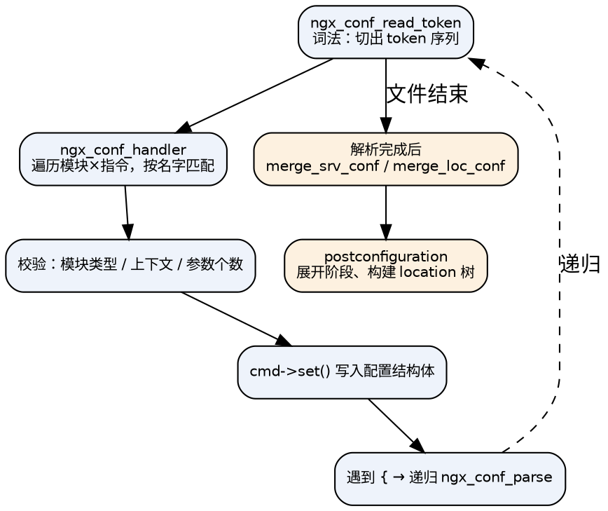

## Introduction

nginx 的配置看起来是"一门小语言"，但它的行为完全由源码里的三件事决定：**指令能写在哪（上下文）**、**父子块如何合并**、**运行时如何匹配（server_name 与 location）**。这三者各有明确的算法与优先级，理解了它们，90% 的"配置写了不生效"都能在动手前就想明白。

本文按"由浅入深"组织：先讲语言本身的规则，再讲匹配算法，最后落到变量与陷阱。主笔记见 [nginx](/docs/CS/CN/nginx/nginx.md)。

## 配置文件的结构

```nginx
user  nginx;                       # ← main 上下文
worker_processes  auto;
error_log  /var/log/nginx/error.log warn;
pid        /run/nginx.pid;

events {                           # ← events 块
    worker_connections  10240;
}

http {                             # ← http 块（七层）
    include       /etc/nginx/mime.types;
    default_type  application/octet-stream;

    upstream backend {             # ← upstream 块（上游组）
        server 127.0.0.1:8080;
    }

    server {                       # ← server 块（虚拟主机）
        listen 80;
        server_name example.com www.example.com;

        location /api/ {           # ← location 块（按 URI 分发）
            proxy_pass http://backend;
        }

        location = /healthz {      # ← 精确匹配
            return 200 "ok\n";
        }
    }
}
```

块之间不允许乱套：`location` 只能在 `server`（或另一个 `location`、或 `if in location`）里，`upstream` 只能在 `http` 里，`server` 可以在 `http`、`stream`、`mail` 里（分别属于不同模块，同名不同义）。

### 上下文（Context）

每条指令在源码里都声明了它能出现的位置，写错位置会直接启动失败：

```
nginx: [emerg] "proxy_pass" directive is not allowed here in /etc/nginx/nginx.conf:42
```

`ngx_command_t.type` 的位掩码分为两组：

```c
// core/ngx_conf_file.h
/* 位置：指令可以出现在哪些块 */
#define NGX_MAIN_CONF        0x02000000
#define NGX_ANY_CONF         0x1F000000
#define NGX_EVENT_CONF       0x04000000
#define NGX_HTTP_MAIN_CONF   0x08000000
#define NGX_HTTP_SRV_CONF    0x10000000
#define NGX_HTTP_LOC_CONF    0x20000000
#define NGX_HTTP_SIF_CONF    0x40000000    /* if in server */
#define NGX_HTTP_LIF_CONF    0x80000000    /* if in location */
#define NGX_HTTP_LMT_CONF    0x00000100    /* limit_except */

/* 参数个数 */
#define NGX_CONF_NOARGS      0x00000001    /* 0 个参数 */
#define NGX_CONF_TAKE1       0x00000002
#define NGX_CONF_TAKE2       0x00000004
...
#define NGX_CONF_TAKE7       0x00000080
#define NGX_CONF_1MORE       0x00000800    /* 至少 1 个 */
#define NGX_CONF_2MORE       0x00001000
#define NGX_CONF_FLAG        0x00000400    /* on|off */
#define NGX_CONF_ANY         0x00002000    /* 不检查 */
#define NGX_CONF_BLOCK       0x00000100    /* 带 {} 的块指令 */
```

以 `return` 为例，它同时接受 `server` / `if in server` / `location` / `if in location` 四种位置，参数 1~2 个：

```c
static ngx_command_t  ngx_http_rewrite_commands[] = {
    { ngx_string("return"),
      NGX_HTTP_SRV_CONF|NGX_HTTP_SIF_CONF|NGX_HTTP_LOC_CONF|NGX_HTTP_LIF_CONF
                       |NGX_CONF_TAKE12,
      ngx_http_rewrite_return,
      NGX_HTTP_LOC_CONF_OFFSET,
      0,
      NULL },
};
```

### 指令表

```c
struct ngx_command_s {
    ngx_str_t             name;
    ngx_uint_t            type;          /* 位置 + 参数个数 */
    char               *(*set)(ngx_conf_t *cf, ngx_command_t *cmd, void *conf);
    ngx_uint_t            conf;          /* 上下文偏移：main/srv/loc 哪一层 */
    ngx_uint_t            offset;        /* 该字段在配置结构体内的偏移 */
    void                 *post;          /* 后处理（枚举表、校验函数） */
};
```

`set` 是一批通用 setter：`ngx_conf_set_flag_slot`（on/off）、`ngx_conf_set_str_slot`、`ngx_conf_set_msec_slot`、`ngx_conf_set_num_slot`、`ngx_conf_set_enum_slot`，复杂指令则各写各的（如 `proxy_pass` 的 `ngx_http_proxy_pass`）。

## 解析流程



### 词法：`ngx_conf_read_token()`

- 空白（空格/制表/换行）都是分隔符，**一条指令可以跨行写**；
- `#` 只在 token 起始位置才是注释，出现在 token 内部就是普通字符（密码里带 `#` 要加引号）；
- 单引号、双引号都支持；`"abc"` 与 `'abc'` 等价；引号内的 `;` 和 `{` 不生效；
- `\` 转义：`\"`、`\'`、`\\`、`\t`、`\r`、`\n` 会被转换，**其他 `\x` 原样保留两个字符**（写正则时最容易踩）；
- `${var}` 中的 `{` 不会被当作块开始——这是 `$` 在词法阶段唯一的作用，变量本身**这一步不求值**；
- 返回值：`NGX_OK`（遇到 `;`）、`NGX_CONF_BLOCK_START`（`{`）、`NGX_CONF_BLOCK_DONE`（`}`）、`NGX_CONF_FILE_DONE`。

### 语义：`ngx_conf_handler()`

```c
// core/ngx_conf_file.c（简化）
for (i = 0; cf->cycle->modules[i]; i++) {          /* 线性扫描所有模块 */
    cmd = cf->cycle->modules[i]->commands;
    for ( ; cmd->name.len; cmd++) {                /* 再线性扫描该模块的指令 */
        if (name->len != cmd->name.len) continue;
        if (ngx_strcmp(name->data, cmd->name.data) != 0) continue;

        found = 1;

        if (module->type != NGX_CONF_MODULE && module->type != cf->module_type) continue;
        if (!(cmd->type & cf->cmd_type)) continue;   /* 上下文不匹配 */

        /* 参数个数校验（FLAG 要求恰好 1 个，1MORE 要求 ≥1 ...） */

        /* 算出配置结构体指针 */
        if (cmd->type & NGX_DIRECT_CONF) {
            conf = ((void **) cf->ctx)[module->index];
        } else if (cmd->type & NGX_MAIN_CONF) {
            conf = &(((void **) cf->ctx)[module->index]);
        } else if (cf->ctx) {
            confp = *(void **) ((char *) cf->ctx + cmd->conf);   /* main/srv/loc 三层之一 */
            if (confp) conf = confp[module->ctx_index];
        }

        rv = cmd->set(cf, cmd, conf);
    }
}
```

两点值得记住：

1. **指令查找是 O(模块数 × 指令数) 的线性扫描，没有 hash**。nginx 只接受这个开销，因为解析只在启动时发生一次。
2. `NGX_DIRECT_CONF` 与 `NGX_MAIN_CONF` 的差别是"给不给指针的指针"：`main` 层的配置结构体指针可能为空（需要 `set()` 自己创建），`DIRECT_CONF` 则保证已存在。

## 三层配置结构与合并

HTTP 的每个模块最多有三份配置结构体，挂在 `ngx_http_conf_ctx_t` 上：

```c
typedef struct {
    void    **main_conf;    /* 数组：每个 http 模块一份 */
    void    **srv_conf;     /* 数组：每个 server 一份 */
    void    **loc_conf;     /* 数组：每个 location 一份 */
} ngx_http_conf_ctx_t;
```

解析时 `cf->ctx` 指向当前块的三层数组；进入 `server` 块就新建一个 `ctx`（`srv_conf` 新分配、`loc_conf` 暂时为空），进入 `location` 再新建一层。解析完成后做**自顶向下合并**：

```
main_conf ──> srv_conf ──> loc_conf
              (merge_srv_conf)  (merge_loc_conf)
```

### 合并宏：只在"子级未设置"时继承

```c
// core/ngx_conf_file.h
#define ngx_conf_merge_value(conf, prev, default)                            \
    if (conf == NGX_CONF_UNSET) {                                            \
        conf = (prev == NGX_CONF_UNSET) ? default : prev;                    \
    }

#define ngx_conf_merge_str_value(conf, prev, default)                        \
    if (conf.data == NULL) {                                                 \
        if (prev.data) {                                                     \
            conf.len = prev.len;                                             \
            conf.data = prev.data;                                           \
        } else {                                                             \
            conf.len = sizeof(default) - 1;                                  \
            conf.data = (u_char *) default;                                  \
        }                                                                    \
    }
```

因此每个标量与字符串字段在 `create_loc_conf()` 里都必须先初始化成 `NGX_CONF_UNSET` / `NGX_CONF_UNSET_PTR` / `NGX_CONF_UNSET_UINT`，否则合并逻辑会认为"用户设过值"。这是写第三方模块时最常见的低级错误。

示例：`keepalive_timeout` 在 location 里没写，就继承 server，再没有就继承 http，最后才是默认值 75s。

### 数组型指令：跨层覆盖，不是合并

这是最容易踩的规则。以 `proxy_set_header` 为例：

```c
// http/modules/ngx_http_proxy_module.c
ngx_conf_merge_ptr_value(conf->headers_source, prev->headers_source, NULL);

if (conf->headers_source == prev->headers_source) {
    conf->headers = prev->headers;      /* 只有指针相同（即子级一行都没写）才继承 */
    conf->host_value = prev->host_value;
}
```

**同一层内**多条 `proxy_set_header` 是 `ngx_array_push` 追加；**跨层**则是：只要子级写过任意一条，`headers_source` 就是子级自己新建的数组，与父级指针不相等 → 父级全部丢弃。

```nginx
server {
    proxy_set_header X-Request-Id $request_id;
    proxy_set_header Host $host;

    location /a/ {
        proxy_set_header X-Tenant foo;    # 结果：只有 X-Tenant！Host 和 X-Request-Id 都丢了
        proxy_pass http://backend;
    }
}
```

正确做法：把公共头写进 `include` 文件，在每个需要的层里都 include 一遍。

`add_header` 曾是同样的"覆盖"语义，但 **1.29.3 起新增 `add_header_inherit off|on|merge;`**：

```nginx
http {
    add_header X-Frame-Options SAMEORIGIN;

    server {
        add_header_inherit merge;        # merge：子级项在前，父级项追加在后
        add_header X-Tenant foo;         # 两个头都会出现
    }
}
```

同理的还有 `proxy_set_body`? 不，这个是标量。常见数组/累积型指令：`add_header`、`add_trailer`、`proxy_set_header`、`fastcgi_param`、`uwsgi_param`、`scgi_param`、`grpc_set_header`、`more_set_headers`。

## server 匹配

一个连接进来时，nginx 分两步决定用哪个 `server`：

### 第一步：按 `listen` 选（连接建立时）

`ngx_http_init_connection()` 只根据**本地地址:端口**定位 `ngx_http_addr_conf_t`，如果同一个端口上配了多个地址（`listen 1.2.3.4:80` 与 `listen 80`），才用 `getsockname()` 区分。这一步**不看 Host**，只确定兜底用的 `default_server`。

`default_server` 的选取规则：显式写了 `listen ... default_server` 的那个；都没写就取**该地址上第一个** `server` 块。

### 第二步：按 `server_name` 选（请求头解析后）

`ngx_http_set_virtual_server()` → `ngx_http_find_virtual_server()` 用 `ngx_hash_find_combined()` 做查找，优先级被硬编码在这个函数里：

```c
// core/ngx_hash.c
void *
ngx_hash_find_combined(ngx_hash_combined_t *hash, ngx_uint_t key, u_char *name, size_t len)
{
    if (hash->hash.buckets) {                    /* ① 精确名 */
        value = ngx_hash_find(&hash->hash, key, name, len);
        if (value) return value;
    }
    if (len == 0) return NULL;
    if (hash->wc_head && hash->wc_head->hash.buckets) {   /* ② 后缀通配 *.example.com */
        value = ngx_hash_find_wc_head(hash->wc_head, name, len);
        if (value) return value;
    }
    if (hash->wc_tail && hash->wc_tail->hash.buckets) {   /* ③ 前缀通配 www.* */
        value = ngx_hash_find_wc_tail(hash->wc_tail, name, len);
        if (value) return value;
    }
    return NULL;
}
```

完整优先级：

1. **精确名**（`server_name example.com;`）
2. **后缀通配**（`*.example.com`，更长的后缀优先：`*.a.example.com` > `*.example.com`）
3. **前缀通配**（`www.*`）
4. **正则**（`~^www\d+\.example\.com$`，按配置顺序，第一个命中）
5. **default_server**（兜底）

两个容易误解的点：

- `*.example.com` 一定优先于 `www.*`，与配置书写顺序无关；
- 写 `server_name example.com;` 会**隐式注册 `*.example.com`**（通配符 hash 的低 2 位标记同时允许两者），所以访问 `foo.example.com` 也会落到这里。

匹配不上时的行为：函数返回 `NGX_DECLINED`，代码**不覆盖** `r->srv_conf`——于是沿用第一步定下的 `default_server`。所以"非法 Host 会落到 default_server"是通过"不修改"实现的。生产上建议显式配一个只返回 444 的 default server：

```nginx
server {
    listen 80 default_server;
    server_name _;
    return 444;               # 直接断开，不返回任何内容
}
```

## location 匹配

### 语法与优先级

```nginx
location = /exact      { }   # 精确匹配：命中即停，不再看正则
location ^~ /prefix    { }   # 前缀匹配，命中后**跳过正则**
location /prefix       { }   # 前缀匹配，记住"最长"的那个
location ~ \.php$      { }   # 大小写敏感正则，按配置顺序
location ~* \.(jpg|png)$ { } # 大小写不敏感正则
location @fallback     { }   # 命名 location，只能被内部跳转引用
location $is_mobile    { }   # 1.31.5 起：predicate location，按变量真假匹配
```

匹配过程（`ngx_http_core_find_location()`）：

1. 在**静态 location 树**里找最长前缀；
2. 若最长前缀命中且带 `^~`（`noregex`），直接采用，**跳过正则**；
3. 否则按配置顺序遍历正则 location，第一个命中的采用；
4. 都没命中就用最长前缀的结果；再没有就是 server 级 location。

### 静态 location 是一棵树，不是线性扫描

启动阶段 `ngx_http_init_locations()` 把 location 排序并切成四段（named / predicate / regex / 静态），静态段再交给 `ngx_http_init_static_location_trees()` 建树：

```c
// http/ngx_http.c
ngx_queue_sort(locations, ngx_http_cmp_locations);
/* ... 切成 named / predicate / regex / 静态 四段 ... */
if (ngx_http_join_exact_locations(cf, locations) != NGX_OK) { return NGX_ERROR; }
ngx_http_create_locations_list(locations, ngx_queue_head(locations));
pclcf->static_locations = ngx_http_create_locations_tree(cf, locations, 0);
```

树节点有三个孩子：

```c
typedef struct ngx_http_location_tree_node_s  ngx_http_location_tree_node_t;
struct ngx_http_location_tree_node_s {
    ngx_http_location_tree_node_t   *left;
    ngx_http_location_tree_node_t   *right;
    ngx_http_location_tree_node_t   *tree;      /* 包容的（更长前缀）子 location */
    ngx_http_core_loc_conf_t        *exact;     /* = 精确 */
    ngx_http_core_loc_conf_t        *inclusive; /* 普通前缀 */
    u_char                           auto_redirect;
    u_char                           len;
    u_char                           name[1];   /* 存的是去掉父前缀后的相对部分 */
};
```

构造要点：

- 先 `ngx_http_join_exact_locations()` 把 `location /foo` 与 `location = /foo` **合并成同一个节点**（`exact` 与 `inclusive` 并存）；两个都是 exact 或两个都是 inclusive 则报 `duplicate location`；
- 再用 `ngx_http_create_locations_tree()` 取**队列中点**建平衡 BST（不是按首字母分叉的 trie），`tree` 指针挂"以当前前缀开头的更长前缀"子树；
- 查找时 `ngx_http_core_find_static_location()` 逐段推进：`uri += n; len -= n;`。

查找函数的核心分支：

```c
for ( ;; ) {
    if (node == NULL) return rv;

    n = (len <= (size_t) node->len) ? len : node->len;
    rc = ngx_filename_cmp(uri, node->name, n);

    if (rc != 0) { node = (rc < 0) ? node->left : node->right; continue; }

    if (len > (size_t) node->len) {
        if (node->inclusive) {
            r->loc_conf = node->inclusive->loc_conf;
            rv = NGX_AGAIN;
            node = node->tree; uri += n; len -= n;   /* 进入子前缀继续找更长的 */
            continue;
        }
        node = node->right;
        continue;
    }

    if (len == (size_t) node->len) {
        if (node->exact) { r->loc_conf = node->exact->loc_conf; return NGX_OK; }  /* = 精确：立即返回 */
        r->loc_conf = node->inclusive->loc_conf;
        return NGX_AGAIN;
    }
    /* len < node->len：可能是 auto redirect（/dir → /dir/） */
    if (len + 1 == (size_t) node->len && node->auto_redirect) { rv = NGX_DONE; }
    node = node->left;
}
```

实践推论：

- 静态前缀匹配是 **O(log n)** 比较，但每次只比较节点名长度的字符数，非常快；正则才是线性扫描，所以**能用前缀就别用正则**。
- `= /foo` 命中会立即返回 `NGX_OK`，连正则都不会试。
- `^~` 只在**前缀已经匹配成功**时才生效，它不会让一个不匹配的 location 突然生效。
- **auto_redirect**：`location /dir/ { proxy_pass ...; }` 会自动给 `clcf->auto_redirect = 1`，于是访问 `/dir` 会收到 **301 → /dir/**（源码在 `ngx_http_core_find_config_phase()` 里对 `NGX_DONE` 的处理）。

### 嵌套与命名 location

- **嵌套 location**：前缀匹配命中后返回 `NGX_AGAIN`，递归进入子 location 继续找；正则命中后也会递归。
- **命名 location `@name`**：存在 `server` 级（`cscf->named_locations`），普通匹配**永远查不到它**，只有 `error_page`、`try_files`、`rewrite` 的内部跳转能引用：

  ```nginx
  error_page 404 = @fallback;
  location @fallback {
      proxy_pass http://backend;
  }
  ```

  跳转走 `ngx_http_named_location()`，它会把 `r->phase_handler` 直接设为 `location_rewrite_index`，即**从 REWRITE 阶段继续，不再重新匹配 location**。
- **predicate location**（1.31.5）：`location $is_mobile { }`，运行时求值变量，非空且非 `"0"` 则命中。它排在正则之后、命名之前。

### `limit_except` 与方法切换

`limit_except GET { ... }` 会为"非 GET/HEAD 方法"准备一份独立的 loc_conf，在 `ngx_http_update_location_config()` 里按需切换：

```c
if (r->method & clcf->limit_except) {
    r->loc_conf = clcf->limit_except_loc_conf;
    clcf = ngx_http_get_module_loc_conf(r, ngx_http_core_module);
}
```

## 变量

### 变量是什么

变量不是在请求里预先算好的一张 map，而是**一组带索引的懒求值 getter**：

```c
// http/ngx_http_variables.h
struct ngx_http_variable_s {
    ngx_str_t                     name;   /* 必须是第一个字段，用于建 hash */
    ngx_http_set_variable_pt      set_handler;
    ngx_http_get_variable_pt      get_handler;
    uintptr_t                     data;   /* 通常是 ngx_http_request_t 内的字段偏移 */
    ngx_uint_t                    flags;
    ngx_uint_t                    index;
};
```

绝大多数核心变量就是"结构体偏移 + 拷贝指针"，零分配：

```c
static ngx_int_t
ngx_http_variable_request(ngx_http_request_t *r, ngx_http_variable_value_t *v, uintptr_t data)
{
    ngx_str_t  *s = (ngx_str_t *) ((char *) r + data);   /* data 是 offsetof(...) */

    if (s->data) {
        v->len = s->len; v->valid = 1;
        v->no_cacheable = 0; v->not_found = 0;
        v->data = s->data;
    } else {
        v->not_found = 1;
    }
    return NGX_OK;
}
```

### flags

| flag | 含义 |
| :-- | :-- |
| `CHANGEABLE` | 允许重复定义（`map` / `geo` / `set` 都用这个，因为它们允许"先引用后定义"） |
| `NOCACHEABLE` | 求值后不缓存，每次读取都重新求值（`$uri`、`$args`） |
| `INDEXED` | 已被索引，运行期走 `r->variables[index]` 数组（快路径） |
| `NOHASH` | 不进变量 hash 表，配置里写它的名字会报 `unknown variable` |
| `WEAK` | 弱定义，允许后续模块"升级"（`set` 定义的变量） |
| `PREFIX` | 前缀变量（`$http_*`、`$arg_*`、`$cookie_*`、`$upstream_http_*`），线性最长匹配 |

### 三个 getter

| 函数 | 时机 | 行为 |
| :-- | :-- | :-- |
| `ngx_http_get_variable_index()` | 配置期 | 只分配索引，**不检查变量是否存在、不求值** |
| `ngx_http_get_indexed_variable()` | 运行期 | **强缓存**：`valid` 或 `not_found` 就直接返回 |
| `ngx_http_get_flushed_variable()` | 运行期 | 尊重 `NOCACHEABLE`：标记过的先失效再求值 |

结论：**变量默认缓存**，`$uri` 这类每次内部重定向都会变的才标了 `NOCACHEABLE`。反过来，`$request_uri`（未解析的原始 URI）是**可缓存**的，因为内部重定向不会改它。

### 前缀变量

`$http_*`、`$arg_*`、`$cookie_*`、`$sent_http_*`、`$upstream_http_*` 不是预先枚举的，而是启动时注册成 `PREFIX` 变量，运行期按名字最长匹配：

```nginx
if ($http_user_agent ~* "bot") { return 403; }     # 等价于 $http_<header 名>
if ($arg_debug = "1") { ... }                      # 查询参数 debug
add_header X-Upstream-Latency $upstream_http_x_latency;
```

## rewrite 与内部重定向

`rewrite` 指令的四个 flag 决定了后续流程：

| flag | 行为 |
| :-- | :-- |
| `last` | 停止当前 rewrite，重新走 `FIND_CONFIG`（重新匹配 location） |
| `break` | 停止 rewrite，**继续在当前 location 内**执行后续阶段 |
| `redirect` | 返回 302 给客户端 |
| `permanent` | 返回 301 给客户端 |

```nginx
location /old/ {
    rewrite ^/old/(.*)$ /new/$1 permanent;      # 301，客户端地址栏会变
}

location /api/ {
    rewrite ^/api/v1/(.*)$ /v2/$1 break;        # 内部改写，不重新匹配 location
    proxy_pass http://backend;
}
```

内部重定向（`ngx_http_internal_redirect`）会把 `r->loc_conf` 重置为 server 级，再从 `SERVER_REWRITE` 阶段重新跑一遍（`r->phase_handler = server_rewrite_index`），因此 **POST_REWRITE 阶段不再执行**（这就是老版本里 `rewrite` 死循环的来源，nginx 有 10 次内部重定向上限，超过报 500）。

`try_files` 挂在 `PRECONTENT` 阶段，最后一个参数如果是 URI 会触发内部重定向，如果是 `=404` 则返回错误码：

```nginx
location / {
    try_files $uri $uri/ /index.html;    # SPA 的标准写法
}

location /images/ {
    try_files $uri =404;                 # 找不到就 404，不要回退到动态处理
}
```

## 陷阱清单

> [!WARNING]
> 以下每一条都对应真实的线上事故形态。

1. **`if` 在 location 里会创建隐式嵌套 location**（"IfIsEvil"）。`if` 的块会被当成一个新的 location 来解析配置，导致 `proxy_pass`、`try_files`、`add_header` 的行为与直觉不符。用 `map` 生成变量 + `location` 分流的组合替代：

   ```nginx
   map $http_user_agent $is_bot { default 0; "~*bot" 1; }
   location / {
       if ($is_bot) { return 403; }     # 只做 return/rewrite 是安全的
       try_files $uri @backend;
   }
   ```
   安全的 `if` 用法只有两种：`return ...;` 与 `rewrite ... last;`。

2. **`root` vs `alias`**：`root` 是拼接（`root + 完整 URI`），`alias` 是替换（把 location 前缀换成 alias 路径）。

   ```nginx
   location /static/ { root /data; }         # /static/a.png → /data/static/a.png
   location /static/ { alias /data/www/; }   # /static/a.png → /data/www/a.png
   ```
   `alias` 路径末尾的 `/` 必须与 location 一致；`alias` 与 `try_files` 组合有历史缺陷，需要 `try_files` 时改用 `root`。

3. **`proxy_pass` 带不带 URI**：

   ```nginx
   location /api/ {
       proxy_pass http://backend;       # /api/x → /api/x（原样透传）
   }
   location /api/ {
       proxy_pass http://backend/;      # /api/x → /x（把 /api/ 替换成 /）
   }
   location /api/ {
       proxy_pass http://backend/v2/;   # /api/x → /v2/x
   }
   ```
   带变量时（如 `proxy_pass http://$host$uri;`）行为又不同——变量会导致运行时才解析上游地址，需要 `resolver`。

4. **数组型指令覆盖**（见上文）：`add_header`、`proxy_set_header` 跨层覆盖。

5. **`location` 正则的顺序敏感**：正则按配置顺序匹配，第一个命中即停。把 `/api/` 的正则写在通用正则前面。

6. **`server_name` 的隐式通配**：写了 `server_name example.com;` 之后，任意 `xxx.example.com` 都会命中它，可能导致"新加的子域 server 不生效"（其实是被精确的 server 抢了？不——精确优先，常见问题是反过来：子域配了但父域的隐式通配先命中是因为没有精确匹配条目）。排查用 `nginx -T` 看最终 server 列表。

7. **转义**：配置里的正则不需要额外转义 `\d`、`\s`；但 `map` 里的值、日志格式里的引号需要。`\1` 在 `location` 正则捕获里是捕获组，在 `rewrite` 里也是。

8. **单位与大小写**：`1m` 是 1 分钟还是 1 兆？——**时间单位与空间单位用的是同一套后缀**：`ms/s/m/h/d`（时间）、`k/m/g`（空间，只有 `k`/`m`/`g`）。`client_max_body_size 10m;` 是 10MB，`proxy_read_timeout 10m;` 是 10 分钟。字符串比较不区分大小写（`on`/`On`/`ON` 等价）。

## Links

- [nginx](/docs/CS/CN/nginx/nginx.md)
- [HTTP](/docs/CS/CN/nginx/HTTP.md) — 阶段机制与 location 切换后的执行流程
- [Upstream](/docs/CS/CN/nginx/upstream.md) — `proxy_pass` 之后发生的事
- [Memory](/docs/CS/CN/nginx/memory.md) — 配置结构体的内存池
- [njs](/docs/CS/CN/nginx/njs.md)

## References

1. [Module ngx_http_core_module](https://nginx.org/en/docs/http/ngx_http_core_module.html)
2. [Module ngx_http_rewrite_module](https://nginx.org/en/docs/http/ngx_http_rewrite_module.html)
3. [Alphabetical index of directives](https://nginx.org/en/docs/dirindex.html)
4. [If is Evil](https://www.nginx.com/resources/wiki/start/topics/depth/ifisevil/)
5. [nginx 源码：src/http/ngx_http.c、src/core/ngx_conf_file.c](https://nginx.org/download/nginx-1.31.6.tar.gz)
