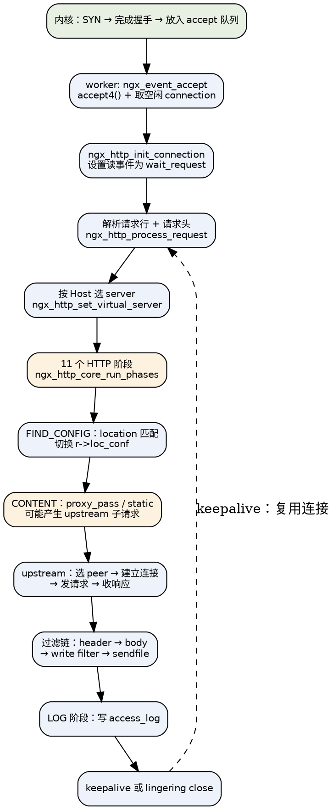
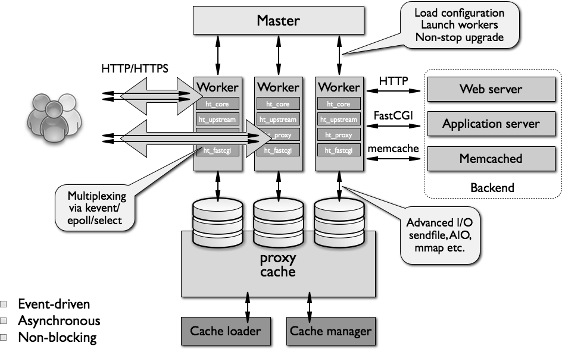

## Introduction

[nginx](https://nginx.org/en/)（`engine x`）是 Igor Sysoev 于 2002 年开始编写、2004 年开源的 HTTP 服务器与反向代理，最初是为了解决 C10K 问题：同样一台机器，Apache 的 `prefork` 模型在几千并发连接时内存与上下文切换开销就压垮了系统，而 nginx 用**一个单线程事件循环 + 少量进程**就能稳住数万长连接。今天它的角色早已超出 Web Server：反向代理、负载均衡、API 网关、静态资源与缓存层、TLS 终结点，以及通用的 TCP/UDP（`stream`）与邮件（`mail`）代理。

nginx 快的原因不是某一个魔法优化，而是一组彼此咬合的设计选择：

| 设计 | 带来的直接后果 |
| :-- | :-- |
| 事件驱动 + 非阻塞 I/O | 一个 worker 单线程同时维持数万连接，没有 per-connection 线程/进程开销 |
| 多进程（每核一个 worker） | 进程间不共享状态（除共享内存），无需锁就能吃满多核；一个 worker 崩溃不影响其他 |
| 连接与请求使用内存池 | 分配即追加、请求结束整池销毁，没有碎片整理与逐块 `free` |
| 零拷贝链路 | `sendfile`、`aio`、`directio`、`accept4`、`TCP_CORK` 全部按平台能力启用 |
| 模块化的流水线 | 阶段（phase）+ 过滤链（filter chain），第三方能力以模块挂载而非改核心 |

> 版本基线（2026-10 核对）：**stable 1.30.5 / mainline 1.31.6**。下文所有源码事实均取自 `nginx-1.31.6`。奇数版本是主线，偶数版本是稳定版；新特性先出现在主线，稳定版只收 bugfix。写笔记与做方案时务必先确认落地的那个版本号，因为 nginx 有大量"默认值悄悄改变"的历史（见 [常见坑](#常见坑)）。

生态与竞品：

| 项目 | 与 nginx 的关系 |
| :-- | :-- |
| [OpenResty](/docs/CS/CN/nginx/OpenResty.md) | nginx + LuaJIT + 大量 lua-nginx-module，把 nginx 变成可编程应用服务器 |
| Tengine | 淘宝 fork，增加了主动健康检查、动态模块等国内常用能力 |
| [Kong](/docs/CS/CN/nginx/Kong.md) | 基于 OpenResty 的 API 网关 |
| NGINX Plus | 官方商业版：主动健康检查、dashboard API、动态 upstream、session persistence 增强等 |
| [HAProxy](/docs/CS/CN/Tools/HAProxy.md) | 同为事件驱动代理，L4/L7 负载均衡更细，统计与可观测性更强 |
| Envoy / [Pingora](/docs/CS/CN/Pingora.md) | 云原生 / Rust 时代的新一代代理，xDS 动态配置、HTTP/2 上游为一等公民 |

各代代理的系统性对比（nginx / HAProxy / Envoy / Caddy / Pingora）单独成篇：[compare](/docs/CS/CN/nginx/compare.md)。

### 笔记导航

本目录按「由浅入深」分层组织，主笔记（本文）给出全貌，专题各管一块：

| 层 | 笔记 | 内容 |
| :-- | :-- | :-- |
| 机制 | [Event](/docs/CS/CN/nginx/event.md) | 事件循环、accept、惊群、定时器 |
| 机制 | [HTTP](/docs/CS/CN/nginx/HTTP.md) | 11 个阶段、过滤链、子请求 |
| 机制 | [Memory](/docs/CS/CN/nginx/memory.md) | 内存池、共享内存、slab |
| 机制 | [stream](/docs/CS/CN/nginx/stream.md) | 四层代理：7 阶段、ssl_preread、双向对拷 |
| 机制 | [HTTP/3](/docs/CS/CN/nginx/http3.md) | QUIC 传输、连接迁移与 eBPF、0-RTT |
| 机制 | [njs](/docs/CS/CN/nginx/njs.md) | 官方 JS 引擎：阶段挂载、对象模型、共享字典 |
| 配置 | [Configuration](/docs/CS/CN/nginx/config.md) | 配置体系、location 匹配、变量 |
| 配置 | [TLS](/docs/CS/CN/nginx/tls.md) | 握手、会话复用、证书、回源 TLS |
| 配置 | [Log](/docs/CS/CN/nginx/log.md) | 日志格式、缓冲、error_log、JSON |
| 数据面 | [Upstream](/docs/CS/CN/nginx/upstream.md) | 负载均衡算法、重试、长连接 |
| 数据面 | [Cache](/docs/CS/CN/nginx/cache.md) | 缓存状态机、击穿防护 |
| 协议 | [gRPC](/docs/CS/CN/nginx/grpc.md) | HTTP/2 上游、trailer、流式与重试语义 |
| 协议 | [mail](/docs/CS/CN/nginx/mail.md) | SMTP/POP3/IMAP 状态机与 auth_http |
| 工程 | [Module](/docs/CS/CN/nginx/module.md) | 模块骨架、四类写法、编译接入 |
| 工程 | [Practice](/docs/CS/CN/nginx/practice.md) | 优雅下线、灰度、容器化、Ingress |
| 工程 | [Troubleshooting](/docs/CS/CN/nginx/troubleshooting.md) | 状态码与日志关键字对照、故障剧本 |
| 工程 | [security](/docs/CS/CN/nginx/security.md) | 访问控制、认证、限流、签名 URL、WAF |
| 工程 | [Recipes](/docs/CS/CN/nginx/recipes.md) | 可抄配置集 |
| 工程 | [Benchmark](/docs/CS/CN/nginx/benchmark.md) | 8 组实测对照与压测方法论 |

### Quick Start

最小可用配置（把 nginx 当作反向代理跑起来只需要这些）：

```nginx
# main 上下文：进程与全局参数
user  nginx;
worker_processes  auto;              # 每核一个 worker
worker_rlimit_nofile  100000;        # 提高 fd 上限，别让 worker 撞 EMFILE

events {
    worker_connections  10240;       # 单个 worker 的最大连接数（含上游连接！）
    use  epoll;                      # Linux 上通常可省略，configure 阶段已择优
    multi_accept  on;                # 一次事件循环里尽可能多地 accept
}

http {
    include       mime.types;
    default_type  application/octet-stream;

    # 定义上游服务器组
    upstream backend {
        server 127.0.0.1:8080 weight=2 max_fails=3 fail_timeout=10s;
        server 127.0.0.1:8081                max_fails=3 fail_timeout=10s;
        keepalive 64;                        # 上游长连接池（1.29.7 起默认开启）
    }

    server {
        listen 80 reuseport;
        server_name example.com;

        location / {
            proxy_pass http://backend;
            proxy_http_version 1.1;          # 1.29.7 起已是默认值
            proxy_set_header Host $host;
            proxy_set_header X-Real-IP $remote_addr;
        }
    }
}
```

运维动作全部通过**信号**完成，nginx 没有"重启"这个概念：

```shell
nginx -t                 # 只做语法检查（-q 静默），CI 里必跑
nginx -s reload          # SIGHUP：新配置生效，旧 worker 处理完现存请求后退出
nginx -s quit            # SIGQUIT：优雅退出，拒绝新连接但处理完存量
nginx -s stop            # SIGTERM：立即退出
nginx -s reopen          # SIGUSR1：重开日志文件（配合 logrotate）
kill -USR2 $(cat /run/nginx.pid)   # 热升级：换成新二进制而不中断服务
```

### 请求生命周期

理解 nginx 最快的方式是把一次请求从头到尾走一遍。下图是主干路径，每个节点都能展开成一整篇笔记：



这条链路上有四个"分叉点"最值得投入时间，它们各自对应一篇专题笔记：

1. **连接是怎么被 accept 的**（惊群、accept mutex、`SO_REUSEPORT`、`EPOLLEXCLUSIVE`）→ [Event](/docs/CS/CN/nginx/event.md)
2. **配置是怎么决定行为的**（server/location 匹配、变量、继承与合并）→ [Configuration](/docs/CS/CN/nginx/config.md)
3. **请求是怎么被分发到模块的**（11 个阶段、content handler、过滤链）→ [HTTP](/docs/CS/CN/nginx/HTTP.md)
4. **上游是怎么选的**（负载均衡、重试、长连接、缓存）→ [Upstream](/docs/CS/CN/nginx/upstream.md) 与 [Cache](/docs/CS/CN/nginx/cache.md)

支撑这一切的内存管理（内存池、共享内存、slab）单独在 [Memory](/docs/CS/CN/nginx/memory.md) 里。

## Architecture

源码包结构（`src/`）：

| 目录 | 内容 |
| :-- | :-- |
| `core` | 基础数据结构（`ngx_queue_t` / `ngx_rbtree_t` / `ngx_radix_tree_t` / `ngx_hash_t`）、内存池、buf/chain、配置解析、`ngx_cycle_t` |
| `event` | 事件循环抽象与各平台实现（`modules/ngx_epoll_module.c`、`ngx_kqueue_module.c` …）、`accept`、定时器、线程池 |
| `http` | HTTP 框架（`ngx_http_request.c` / `ngx_http_core_module.c`）、`modules/` 下是所有官方 HTTP 模块、上游与缓存 |
| `stream` | 四层（TCP/UDP）代理框架 |
| `mail` | 邮件代理（SMTP/POP3/IMAP） |
| `os` | 平台适配层，`os/unix/` 与 `os/win32/` |
| `misc` | 少量杂项（如 `ngx_cpp_test_module`） |

<div style="text-align: center;">



</div>

<p style="text-align: center;">
Fig.1. nginx's architecture.
</p>

### 进程模型

nginx 启动时是**一个 master + N 个 worker**，另外按需拉起两个辅助进程：

| 进程 | 数量 | 职责 |
| :-- | :-- | :-- |
| master | 1 | 读配置、bind 端口、**不处理任何业务**；负责 fork/监控 worker、接收信号、reload 与热升级 |
| worker | `worker_processes`（建议 `auto`，即 CPU 核数） | 全部实际工作：accept 连接、读写磁盘、与上游通信。单线程事件循环 |
| cache manager | 0 或 1 | 周期性清理磁盘缓存，使其不超过 `max_size` |
| cache loader | 0 或 1 | 启动时把磁盘上已有的缓存索引载入共享内存，**载入完就退出** |

设计上的几个关键取舍：

- **为什么不多线程？** 单线程事件循环意味着处理请求的代码天然不需要加锁，也不会有线程上下文切换；代价是**任何一个 worker 内的阻塞操作都会卡住这个 worker 上的所有连接**（这也是 `aio threads` 线程池存在的原因）。
- **为什么一核一个 worker？** 让调度器的 CPU 亲和性自然生效，配合 `worker_cpu_affinity auto` 可进一步绑定；连接到达的分发由内核（`SO_REUSEPORT` / `EPOLLEXCLUSIVE`）或 nginx 自己的 accept mutex 完成。
- **进程间怎么共享状态？** 只通过共享内存（cache、limit_req/conn、upstream zone、ssl session cache），访问用 `ngx_shmtx_t`（自旋 + 可选 `sem_t`）；共享内存内的分配走 slab，见 [Memory](/docs/CS/CN/nginx/memory.md)。

#### 连接数上限

`worker_connections` 是**每个 worker 的连接对象总数**，而"连接"不只是客户端连接：

- 纯静态服务：1 个客户端连接 = 1 个 connection；
- 反向代理：1 个客户端连接 = **2 个**（下游 + 上游）；
- HTTP/2 到下游：1 个 TCP 连接可以承载 N 个并发 stream（受 `http2_max_concurrent_streams` 限制，默认 128），但仍是 1 个 connection。

所以估算公式是：

```
最大并发请求 ≈ worker_processes × worker_connections ÷ 2      # 反向代理场景
```

同时必须保证 `worker_rlimit_nofile` ≥ `worker_connections × 2`（还有日志文件、上游连接、临时文件），否则会看到 `accept4() failed (24: Too many open files)`，且 nginx 会主动暂停 accept 一段时间（见 [Event](/docs/CS/CN/nginx/event.md)）。

这套多进程模型正是内核进程机制的落地：master 通过 [fork](/docs/CS/OS/Linux/proc/process.md?id=fork)（`kernel_clone`/`copy_process`）创建 worker，通过[信号](/docs/CS/OS/Linux/proc/signal.md)（`SIGHUP` reload、`SIGQUIT` 优雅退出、`SIGUSR2` 热升级）管理 worker 生命周期，平滑升级依赖 [exec](/docs/CS/OS/Linux/proc/process.md?id=exec) 替换进程映像；worker 间用共享内存 + mutex 共享状态，并依赖 accept mutex 规避 [惊群](/docs/CS/OS/Linux/proc/thundering_herd.md)。完整对照表见 [Processes 知识地图 × Nginx](/docs/CS/OS/Linux/proc/README.md)。

### master 主循环

master 阻塞在 `sigsuspend()` 上，被信号唤醒后依次检查一组全局标志位并做出反应：

```c
// os/unix/ngx_process_cycle.c（节选）
void
ngx_master_process_cycle(ngx_cycle_t *cycle)
{
    sigemptyset(&set);
    sigaddset(&set, SIGCHLD);
    sigaddset(&set, SIGALRM);
    sigaddset(&set, SIGIO);
    sigaddset(&set, SIGINT);
    sigaddset(&set, ngx_signal_value(NGX_RECONFIGURE_SIGNAL));   /* SIGHUP  */
    sigaddset(&set, ngx_signal_value(NGX_REOPEN_SIGNAL));        /* SIGUSR1 */
    sigaddset(&set, ngx_signal_value(NGX_NOACCEPT_SIGNAL));      /* SIGWINCH */
    sigaddset(&set, ngx_signal_value(NGX_TERMINATE_SIGNAL));     /* SIGTERM */
    sigaddset(&set, ngx_signal_value(NGX_SHUTDOWN_SIGNAL));      /* SIGQUIT */
    sigaddset(&set, ngx_signal_value(NGX_CHANGEBIN_SIGNAL));     /* SIGUSR2 */

    if (sigprocmask(SIG_BLOCK, &set, NULL) == -1) { /* ... */ }

    ngx_start_worker_processes(cycle, ccf->worker_processes, NGX_PROCESS_RESPAWN);
    ngx_start_cache_manager_processes(cycle, 0);

    for ( ;; ) {
        if (delay) {                    /* TERM 时先 SIGTERM，1s 后升级为 SIGKILL */
            if (ngx_sigalrm) { sigio = 0; delay *= 2; ngx_sigalrm = 0; }
            itv.it_value.tv_sec = delay / 1000;
            itv.it_value.tv_usec = (delay % 1000) * 1000;
            setitimer(ITIMER_REAL, &itv, NULL);
        }

        sigsuspend(&set);               /* 阻塞，直到信号到达 */
        ngx_time_update();

        if (ngx_reap)      { ngx_reap = 0; live = ngx_reap_children(cycle); }
        if (ngx_terminate) { /* 先 TERM，delay > 1000ms 后 SIGKILL */ }
        if (ngx_quit)      { /* 通知 worker 优雅退出，并关闭监听套接字 */ }
        if (ngx_reconfigure) { /* 见下节 reload */ }
        if (ngx_change_binary) { ngx_new_binary = ngx_exec_new_binary(cycle, ngx_argv); }
        /* ... */
    }
}
```

注意 master 用 `sigprocmask` 把这些信号全部 **block**，只在 `sigsuspend` 期间放开——这是标准的"信号同步化"写法，避免信号在任意指令边界上打断逻辑。

### worker 与 spawn

`ngx_spawn_process()` 是 nginx 里唯一的进程创建入口，几个容易被忽略的细节：

- 先用 `socketpair(AF_UNIX, SOCK_STREAM)` 建一条 master↔worker 的**通道（channel）**，用于传 channel 命令（打开/关闭通道、QUIT、TERM、REOPEN）；
- channel 的 master 端设置 `FIOASYNC` + `F_SETOWN`，让 master 收到 `SIGIO` 时知道有数据可读；worker 端设置 `FD_CLOEXEC`，保证热升级 `exec` 后不会泄漏；
- `respawn` 参数决定这个 worker 是否自动重启：`NGX_PROCESS_RESPAWN`（常态）/ `NGX_PROCESS_JUST_RESPAWN`（reload 出来的新 worker，将来不再被重复创建）/ `NGX_PROCESS_NORESPAWN`（cache loader，跑完就退出）/ `NGX_PROCESS_DETACHED`。

```c
// os/unix/ngx_process_cycle.c
static void
ngx_start_worker_processes(ngx_cycle_t *cycle, ngx_int_t n, ngx_int_t type)
{
    ngx_channel_t  ch;
    ngx_memzero(&ch, sizeof(ngx_channel_t));
    ch.command = NGX_CMD_OPEN_CHANNEL;

    for (i = 0; i < n; i++) {
        ngx_spawn_process(cycle, ngx_worker_process_cycle, (void *) (intptr_t) i,
                          "worker process", type);

        ch.pid = ngx_processes[ngx_process_slot].pid;
        ch.slot = ngx_process_slot;
        ch.fd = ngx_processes[ngx_process_slot].channel[0];
        ngx_pass_open_channel(cycle, &ch);   /* 把新 worker 的 slot 广播给已有 worker */
    }
}
```

worker 自己的循环极其简单：**处理事件 → 检查退出标志 → 重复**：

```c
static void
ngx_worker_process_cycle(ngx_cycle_t *cycle, void *data)
{
    ngx_worker_process_init(cycle, worker);
    ngx_setproctitle("worker process");

    for ( ;; ) {
        if (ngx_exiting && ngx_event_no_timers_left() == NGX_OK) {
            ngx_worker_process_exit(cycle);          /* 优雅退出：定时器都跑完才走 */
        }

        ngx_process_events_and_timers(cycle);        /* 核心：epoll_wait + 处理事件 */

        if (ngx_terminate) { ngx_worker_process_exit(cycle); }

        if (ngx_quit) {
            ngx_quit = 0;
            if (!ngx_exiting) {
                ngx_exiting = 1;
                ngx_set_shutdown_timer(cycle);       /* worker_shutdown_timeout */
                ngx_close_listening_sockets(cycle);
                ngx_close_idle_connections(cycle);
            }
        }

        if (ngx_reopen) { ngx_reopen = 0; ngx_reopen_files(cycle, -1); }
    }
}
```

`ngx_process_events_and_timers()` 是整台机器的心跳，细节在 [Event](/docs/CS/CN/nginx/event.md)：

```c
void
ngx_process_events_and_timers(ngx_cycle_t *cycle)
{
    if (ngx_use_accept_mutex) {
        if (ngx_accept_disabled > 0) {
            ngx_accept_disabled--;                   /* 本 worker 连接快满了，让出 accept */

        } else if (ngx_trylock_accept_mutex(cycle) == NGX_ERROR) {
            return;

        } else if (ngx_accept_mutex_held) {
            flags |= NGX_POST_EVENTS;                /* 持锁：accept 事件先入队列延后处理 */

        } else if (timer == NGX_TIMER_INFINITE || timer > ngx_accept_mutex_delay) {
            timer = ngx_accept_mutex_delay;          /* 未持锁：最多等 500ms 再试抢锁 */
        }
    }

    delta = ngx_current_msec;
    (void) ngx_process_events(cycle, timer, flags);  /* epoll_wait */
    delta = ngx_current_msec - delta;

    ngx_event_process_posted(cycle, &ngx_posted_accept_events);   /* 先处理 accept */
    if (ngx_accept_mutex_held) { ngx_shmtx_unlock(&ngx_accept_mutex); }

    if (delta) { ngx_event_expire_timers(); }        /* 时间跨毫秒才检查定时器 */

    ngx_event_process_posted(cycle, &ngx_posted_events);          /* 再处理普通事件 */
}
```

### Reload：不中断服务的配置替换

`nginx -s reload`（SIGHUP）做的事，比"重新读一遍配置"要精细得多：

1. master 调 `ngx_init_cycle()` 构造一个**新的 cycle**（新配置、新连接池、新共享内存）；
2. **监听套接字被继承而非重建**：新 cycle 里的每个 `ngx_listening_t` 会在旧 cycle 中找同类型、同端口的条目，找到就把 `fd` 直接搬过来：

   ```c
   // core/ngx_cycle.c
   if (ngx_cmp_sockaddr(nls[n].sockaddr, nls[n].socklen,
                        ls[i].sockaddr, ls[i].socklen, 1) == NGX_OK)
   {
       nls[n].fd = ls[i].fd;          /* ★ 复用旧 fd：不 close、不重新 bind */
       nls[n].previous = &ls[i];      /* 记住旧条目，用于摘掉旧 accept 事件 */
       ls[i].remain = 1;
       if (ls[i].backlog != nls[n].backlog) { nls[n].listen = 1; }  /* 只有 backlog 变了才重新 listen() */
   }
   ```

   这就是为什么 reload 期间**不会出现端口空窗期**，也不会丢 SYN（对比那些先 close 再 bind 的实现）。
3. 用 `NGX_PROCESS_JUST_RESPAWN` 拉起新 worker，发 `SHUTDOWN` 信号给旧 worker；旧 worker 停止 accept、处理完存量请求后退出；
4. 如果新配置有语法错误，`ngx_init_cycle()` 返回 NULL，master 回滚继续使用旧 cycle——**reload 失败是安全的**。

两个实践要点：

- 旧 worker 的退出时机取决于它手上的连接。如果有长连接（WebSocket、SSE、长轮询）一直不释放，旧 worker 就会一直存在，表现为 `ps` 里 worker 数量翻倍甚至更多。用 `worker_shutdown_timeout 30s;` 给一个硬上限（默认 0，即不限）。
- reload 会重建共享内存区（limit_req/conn 的计数、cache 索引），因此**限流计数与缓存命中率会重置**。

### 热升级：换二进制而不掉连接

```shell
kill -USR2 $(cat /run/nginx.pid)     # 1. master fork+exec 新二进制，pid 文件改名 .oldbin
                                     #    此时新旧两套 master+worker 同时存在
kill -WINCH $(cat /run/nginx.pid.oldbin)   # 2. 旧 master 让其 worker 优雅退出
kill -QUIT  $(cat /run/nginx.pid.oldbin)   # 3. 确认新版本没问题后，退出旧 master
# 回滚：kill -HUP 旧 master（重新拉起旧 worker）+ kill -QUIT 新 master
```

关键机制是**监听 fd 通过环境变量传递**：旧 master 在 `ngx_exec_new_binary()` 里把所有监听 fd 拼成 `NGINX="6;7;8;"` 形式塞进环境变量，新进程启动时 `ngx_add_inherited_sockets()` 解析它并标记 `ls->inherited = 1`，于是 `ngx_open_listening_sockets()` 跳过 `socket/bind/listen`，直接用现成的 fd。这也是为什么热升级期间新旧进程能同时监听同一个端口。

### 信号表

信号处理函数统一是 `ngx_signal_handler()`，它只负责给全局标志位置 1，真正的动作在 master 主循环里执行。表定义在 `os/unix/ngx_process.c`：

| 信号 | `nginx -s` | master 收到 | worker 收到 |
| :-- | :-- | :-- | :-- |
| `SIGHUP` | `reload` | `ngx_reconfigure`：重新加载配置 | 忽略 |
| `SIGUSR1` | `reopen` | `ngx_reopen`：重开日志文件 | `ngx_reopen`：重开日志文件 |
| `SIGWINCH` | — | `ngx_noaccept`：停止接受新连接（热升级第 2 步） | 调试模式下视为 QUIT |
| `SIGTERM` | `stop` | `ngx_terminate`：立即退出 | 立即退出 |
| `SIGINT` | — | 同 `SIGTERM` | 立即退出 |
| `SIGQUIT` | `quit` | `ngx_quit`：优雅退出 | 优雅退出 |
| `SIGUSR2` | — | `ngx_change_binary`：热升级 | 忽略 |
| `SIGCHLD` | — | `ngx_reap`：回收子进程 | — |
| `SIGALRM` | — | `ngx_sigalrm`：延时退出计时 | `timer_resolution` 的心跳 |
| `SIGIO` | — | `ngx_sigio` | 忽略 |
| `SIGSYS`、`SIGPIPE` | — | 安装为 `SIG_IGN` | 同 |

> **TERM 与 QUIT 的区别是面试与事故现场的高频考点**：`TERM` 会让 worker 立刻 `ngx_worker_process_exit()`，正在处理的请求被中断（客户端看到 502 或连接重置）；`QUIT` 先关监听、再等所有活动连接自然结束。kill 掉 nginx 之前请想清楚用哪个。

## Configuration 概览

nginx 的配置是**声明式的、块嵌套的**，指令能否写在某个块里、以及父子块如何合并，都有严格规则：

```nginx
# main 上下文
user www-data;
worker_processes auto;

events { ... }            # 连接与事件
stream { ... }            # 四层代理（TCP/UDP）
http {                    # 七层
    server {              # 虚拟主机（按 listen + server_name 选中）
        location /api/ {  # 按 URI 匹配，决定由谁处理
            proxy_pass http://backend;
        }
    }
    upstream backend { ... }   # 上游服务器组
}
```

- 指令的合法位置叫**上下文**（context），比如 `proxy_pass` 只能出现在 `location`、`if in location`、`limit_except`；写错位置的报错是 `xxx directive is not allowed here`。
- 配置解析是**线性扫描**所有模块的所有指令（`ngx_conf_handler()` 两层 for 循环，没有 hash），所以解析只在启动时发生一次，慢也无所谓。
- 同一指令在父子块同时出现时，**是否合并取决于指令的实现**：标量指令（`keepalive_timeout`、`client_max_body_size`）在子块未设置时继承父块；**数组型指令（`proxy_set_header`、`add_header`）是覆盖不是合并**——这是最常见的配置事故，详见 [Configuration](/docs/CS/CN/nginx/config.md)。

## HTTP 概览

一个 HTTP 请求在 nginx 内部要穿过 **11 个阶段**，每个阶段可以挂载若干模块的 handler，模块通过返回值告诉框架"继续/接管/等待"：

| # | 阶段 | 典型挂载者 |
| :-- | :-- | :-- |
| 0 | `POST_READ` | `realip`（取真实客户端 IP） |
| 1 | `SERVER_REWRITE` | `rewrite`（server 级改写） |
| 2 | `FIND_CONFIG` | 框架内置：location 匹配 |
| 3 | `REWRITE` | `rewrite`（location 级改写） |
| 4 | `POST_REWRITE` | 框架内置：改写后回到 FIND_CONFIG |
| 5 | `PREACCESS` | `limit_req`、`limit_conn`、`realip` |
| 6 | `ACCESS` | `access`、`auth_basic`、`auth_request` |
| 7 | `POST_ACCESS` | 框架内置：处理 `satisfy any/all` |
| 8 | `PRECONTENT` | `try_files`、`mirror` |
| 9 | `CONTENT` | `static`、`index`、`proxy`、`fastcgi`… |
| 10 | `LOG` | `access_log` |

阶段机制、content handler 的唯一性、过滤链与子请求的实现都在 [HTTP](/docs/CS/CN/nginx/HTTP.md)。

## Upstream 与负载均衡

`upstream` 块定义一组上游服务器，nginx 在它们之间做选择、失败重试与健康度维护：

```nginx
upstream backend {
    # 默认：平滑加权轮询（smooth weighted round-robin）
    server 10.0.0.1:8080 weight=3 max_fails=3 fail_timeout=10s;
    server 10.0.0.2:8080          max_fails=3 fail_timeout=10s;
    server 10.0.0.3:8080 backup;   # 仅在主组全部不可用时启用

    # 可选算法（互斥）
    # ip_hash;                     # 按客户端 IP 前 3 段（IPv4）哈希，做会话保持
    # hash $request_uri consistent;# 一致性哈希（ketama），缓存友好
    # least_conn;                  # 选 conns/weight 最小的
    # random two least_conn;       # 二选一（power of two choices）
    # least_time header;           # 1.31.0 起开源版可用

    keepalive 64;                  # 上游长连接池，1.29.7 起默认开启（默认 32）
    keepalive_requests 1000;
    keepalive_timeout 60s;
}
```

几个必须知道的事实（源码核实，1.31.6）：

- 默认算法不是简单的 `i % n`，而是**平滑加权轮询**：每轮给候选 peer 累加 `effective_weight`，取 `current_weight` 最大者，选中后减去本轮 `total`；失败的 peer 会被 `effective_weight -= weight / max_fails` 降权，并缓慢恢复。
- `max_fails/fail_timeout` 的默认值是 **1 / 10s**，而且这是**被动健康检查**——nginx 开源版没有主动探活，节点"故障"只能在真实请求失败时才能发现。需要主动健康检查要用 NGINX Plus、Tengine 或第三方模块。
- `backup` 只在算法声明支持时才生效：默认轮询与 `least_conn` 支持，`ip_hash` / `hash` / `random` 不支持。
- 重试默认只对 `error|timeout` 生效，且 **POST 默认不重试**（`non_idempotent`），避免重复下单。

完整的算法源码、重试状态机、长连接池与超时矩阵见 [Upstream](/docs/CS/CN/nginx/upstream.md)。

## Cache

反向代理场景下缓存是 nginx 最常用的能力之一，它由三部分构成：磁盘文件 + 共享内存索引 + 两个辅助进程。

```nginx
proxy_cache_path /var/cache/nginx levels=1:2 keys_zone=mycache:100m
                 max_size=10g inactive=60m use_temp_path=off;

server {
    location / {
        proxy_cache mycache;
        proxy_cache_key $scheme$proxy_host$request_uri;
        proxy_cache_valid 200 302 10m;
        proxy_cache_valid 404      1m;
        proxy_cache_lock on;                  # 防缓存击穿
        proxy_cache_use_stale error timeout updating;
        proxy_cache_background_update on;     # stale-while-revalidate
        add_header X-Cache-Status $upstream_cache_status;
        proxy_pass http://backend;
    }
}
```

要点：

- `keys_zone` 是**共享内存索引**（不是缓存内容本身），1 MB 大约能放 8000 个 key，按缓存条目数估算而不是按磁盘容量；
- cache key 默认是 `$scheme$proxy_host$request_uri` 的 MD5，文件名即这 32 个十六进制字符，按 `levels` 分层落目录；
- `inactive` 是"多久没人访问就淘汰"，与 `proxy_cache_valid`（上游给的 TTL）是两个正交的维度，二者取更严格的那个；
- `$upstream_cache_status` 只有 7 个取值：`MISS / BYPASS / EXPIRED / STALE / UPDATING / REVALIDATED / HIT`。

原理、锁、后台更新与 loader/manager 进程的分批参数见 [Cache](/docs/CS/CN/nginx/cache.md)。

## 限流与限速

nginx 的限流发生在 `PREACCESS` 阶段，两个模块分工明确：

```nginx
http {
    # 漏桶：按请求速率限流（每 IP 每秒 10 个请求，允许突发 20）
    limit_req_zone $binary_remote_addr zone=req_limit:10m rate=10r/s;

    # 连接数：每 IP 同时最多 20 个连接
    limit_conn_zone $binary_remote_addr zone=conn_limit:10m;

    server {
        location /api/ {
            limit_req  zone=req_limit burst=20 nodelay;
            limit_conn zone=conn_limit 20;
            limit_req_status 429;
            limit_conn_status 429;
        }
        location /download/ {
            limit_rate 1m;             # 每连接带宽限速
            limit_rate_after 10m;      # 先免费送 10MB 再限速
        }
    }
}
```

`limit_req` 的核心是漏桶水位 `excess`（单位 0.001 个请求）：

```c
// http/modules/ngx_http_limit_req_module.c
excess = lr->excess - ctx->rate * ms / 1000 + 1000;   /* 旧水位 - 漏掉的量 + 本次注入 1 个请求 */
if (excess < 0) excess = 0;
if ((ngx_uint_t) excess > limit->burst) return NGX_BUSY;  /* 超限 → 拒绝 */
```

即：**`rate` 决定漏桶的出口速率，`burst` 决定桶的容量**。`burst` 内的请求默认排队延迟处理（`delay=0`），加 `nodelay` 后立即放行但记账；`delay=N`（1.15.7+）表示前 N 个突发请求立即放行、超出的才排队。`$binary_remote_addr` 比 `$remote_addr` 省内存（4/16 字节定长 vs 字符串），zone 里用红黑树查找 + LRU 队列淘汰。

## TLS / HTTP2 / HTTP3

```nginx
server {
    listen 443 ssl;
    listen 443 quic reuseport;        # HTTP/3（QUIC），需 --with-http_v3_module
    http2 on;                         # 1.25.1 起取代 listen ... ssl http2 写法
    http3 on;

    ssl_certificate     /etc/nginx/certs/fullchain.pem;
    ssl_certificate_key /etc/nginx/certs/privkey.pem;
    ssl_protocols TLSv1.2 TLSv1.3;
    ssl_session_cache shared:SSL:50m;   # 跨 worker 复用 session，务必用 shared
    ssl_session_timeout 1d;
    ssl_session_tickets on;

    ssl_stapling on;                    # OCSP stapling，减少客户端握手往返
    ssl_stapling_verify on;

    add_header Alt-Svc 'h3=":443"; ma=86400';   # 向客户端通告 HTTP/3 可用
}
```

实践要点：

- `ssl_session_cache` 不写 `shared:` 就是每个 worker 各自缓存，命中率随 worker 数下降；
- TLS 握手是 CPU 密集操作，`ssl_session_cache` + `keepalive` + `ssl_session_tickets` 是降低握手成本的三件套；
- HTTP/2 是**单连接多路复用**，一个 TCP 连接上并发 N 个 stream（默认上限 128），因此它把队头阻塞问题从应用层下移到了 TCP 层——丢包时所有 stream 一起卡住，这正是 HTTP/3（QUIC）要解决的；
- HTTP/2 上 nginx 会在服务完 `http2_max_requests`（默认 1000）个请求后发 `GOAWAY` 并换一条新连接，这是有意为之的设计（限制单连接的累积错误），不要当成故障；
- HTTP/3 侧 nginx 自带 QUIC 实现（1.25.0 起实验性，需 `--with-http_v3_module`），`quic_bpf` 用于 `reuseport` 场景下的连接路由。

## 可观测性

```nginx
log_format main '$remote_addr - $remote_user [$time_local] "$request" '
                '$status $body_bytes_sent "$http_referer" '
                '"$http_user_agent" "$http_x_forwarded_for" '
                'rt=$request_time urt="$upstream_response_time" '
                'upstream=$upstream_addr cache=$upstream_cache_status';

access_log /var/log/nginx/access.log main buffer=64k flush=5s;

server {
    location = /nginx_status {
        stub_status;               # 需 ngx_http_stub_status_module
        allow 127.0.0.1;
        deny all;
    }
}
```

三个时间变量必须分清：

- `$request_time`：从收到客户端第一个字节到写完响应，**包含**读请求体与客户端慢速接收的时间；
- `$upstream_response_time`：与上游交互的时间（多次重试用逗号分隔），这是判断"慢在哪一侧"的关键；
- `$upstream_connect_time`：与上游建连耗时（含 TLS 握手）。

排障时的标准动作：`error_log ... debug;` + `debug_connection <client_ip>;`（需编译时 `--with-debug`），或者用 [strace](/docs/CS/OS/Linux/Tools/strace.md) 看系统调用。

## 性能调优清单

**进程与连接**

- `worker_processes auto;` + `worker_cpu_affinity auto;`
- `worker_rlimit_nofile` 抬高，并同步系统 `ulimit -n` 与 `fs.file-max`
- `worker_connections` 按上文公式估算，别只看客户端数
- `worker_shutdown_timeout 30s;`（reload 时防止旧 worker 被长连接拖住）

**accept 路径**

- Linux 4.5+ 且多 worker：默认走 `EPOLLEXCLUSIVE`，不需要额外配置
- 想要每个 worker 独立监听队列：`listen ... reuseport;`（注意 reload 时旧 socket 关闭可能丢少量 SYN）
- `accept_mutex` 自 1.11.3 起默认 **off**，只有在 EPOLLEXCLUSIVE 不可用或特殊场景下才需要打开
- 高并发新连接：`multi_accept on;`
- 系统侧：`net.core.somaxconn`（默认 128 常常是瓶颈，nginx 的 `listen ... backlog=` 默认 511 会被它截断）

**传输**

- 静态文件：`sendfile on; tcp_nopush on; tcp_nodelay on;`（`nopush` 与 `nodelay` 并不矛盾，前者管响应头+首块一起发，后者管后续小块不再攒）
- 大文件：`sendfile_max_chunk 2m;`（防止单个大连接独占 worker）、`aio threads;` + `directio 8m;`
- 文件描述符缓存：`open_file_cache max=10000 inactive=30s;`
- 响应体缓冲：`output_buffers`、`postpone_output`（默认 1460，凑一个 MSS）

**上游**

- `proxy_http_version 1.1;`（1.29.7 起默认）+ upstream `keepalive`
- `proxy_buffering on;`（默认开）让 nginx 尽快把上游响应收完、释放上游连接
- 客户端慢：`proxy_request_buffering on;`（默认开）先把请求体收完再发给上游，避免上游被慢客户端拖住

**内核参数配合**

```shell
# /etc/sysctl.conf（常见起点，按业务调整）
net.core.somaxconn = 65535
net.ipv4.ip_local_port_range = 1024 65535     # 反代场景上游端口消耗大
net.ipv4.tcp_max_syn_backlog = 65535
net.ipv4.tcp_tw_reuse = 1
net.ipv4.tcp_fin_timeout = 15
fs.file-max = 1000000
```

## 常见坑

> [!WARNING]
> 下面每一条都是"配置看起来没问题，但行为与直觉不符"的类型，排查时优先怀疑它们。

1. **数组型指令跨层是覆盖，不是合并。** 在 `server` 里写了 `add_header X-A 1;`，又在 `location` 里写 `add_header X-B 2;`，最终响应里只有 `X-B`。`proxy_set_header` 同理（这是"上游收不到 Host 头"的经典原因）。1.29.3 起可以用 `add_header_inherit merge;` 改成合并。
2. **`if` 在 location 里会创建隐式嵌套 location**（"if is evil"），导致 `proxy_pass`、`try_files` 行为异常。能用 `map`、`location`、`return` 表达的逻辑都不要用 `if`。
3. **`root` 与 `alias` 的语义不同**：`root` 是拼接（`root + URI`），`alias` 是替换（把 location 前缀换成 alias）。`alias` 与 `try_files` 组合有历史 bug，需要 `try_files` 时用 `root`。
4. **`proxy_pass` 结尾带不带 URI 完全不同**：`proxy_pass http://backend;` 原样透传 URI；`proxy_pass http://backend/;` 会把 location 前缀替换成 `/`。
5. **`accept_mutex` 默认值变过。** 大量中文资料仍写"nginx 默认开启 accept mutex 解决惊群"——1.11.3 起默认是 `off`，因为内核的 `EPOLLEXCLUSIVE` 更优雅。
6. **upstream keepalive 默认开关变过。** 1.29.7 起 upstream `keepalive` 默认启用（默认池 32），`proxy_http_version` 默认 1.1 且不再发送 `Connection` 头。老配置显式写 `proxy_set_header Connection "";` 在 1.29.7 之后是多余甚至有害的。
7. **开源版没有主动健康检查。** `max_fails/fail_timeout` 是被动的，只有真实请求失败才会标记节点不可用。
8. **`limit_req` 的 `burst` 与 `nodelay` 一起用等于"允许突发但按速率放行"**；不加 `nodelay` 时突发请求会被排队，客户端看到的是延迟而非 503。
9. **reload 会重置共享内存里的限流计数与缓存索引**，压测或线上观察指标时要注意时间窗口。
10. **长连接会拖住 reload 的旧 worker**，表现为内存持续增长、worker 数量不收敛：`worker_shutdown_timeout` 是唯一的硬约束。
11. **`worker_connections` 不够时不是 OOM，而是 `EMFILE`** —— nginx 会打印 `accept4() failed (24: Too many open files)` 并暂停 accept，客户端表现为连接超时。
12. **HTTP/2 的 GOAWAY 不是错误**：`http2_max_requests` 达到后正常换连接。
13. **`$request_uri` 是可缓存变量，`$uri` 才是不可缓存的**（内部重定向会改后者），日志里取错会得到改写前/后的 URI。

## Struct

nginx 自带一整套侵入式数据结构，全部位于 `src/core/`，它们共同的特点是**把链表/树节点直接嵌进宿主结构体**，不额外分配内存。

### queue

双向循环链表，`ngx_queue_t` 只有 `prev`/`next`，用它时必须自己算宿主结构体偏移（`ngx_queue_data(q, type, link)`）：

```c
typedef struct ngx_queue_s  ngx_queue_t;

struct ngx_queue_s {
    ngx_queue_t  *prev;
    ngx_queue_t  *next;
};

#define ngx_queue_init(q)  (q)->prev = q; (q)->next = q

#define ngx_queue_insert_head(h, x)                                          \
    (x)->next = (h)->next;                                                   \
    (x)->next->prev = x;                                                     \
    (x)->prev = h;                                                           \
    (h)->next = x

#define ngx_queue_insert_tail(h, x)                                          \
    (x)->prev = (h)->prev;                                                   \
    (x)->prev->next = x;                                                     \
    (x)->next = h;                                                           \
    (h)->prev = x
```

注意 `ngx_queue_insert_head(h, x)` 的语义其实是"插到 `h` 之后"——因为 nginx 的队列**头节点是哨兵**，`head` 宏取的是 `(h)->next`，`last` 取的是 `(h)->prev`。典型用法：`ngx_posted_events`、`ngx_posted_accept_events`、缓存的 LRU 队列、upstream 空闲连接池。

### rbtree

`ngx_rbtree_t` 是红黑树，nginx 用它做三类事情：

- **定时器**：`ngx_event_timer_rbtree`，key 是绝对毫秒时间戳，`ngx_event_find_timer()` 取最左节点算出 epoll 超时；
- **缓存索引**：`proxy_cache` 的每个 zone 在共享内存里维护一棵按 cache key 排序的红黑树；
- **限流**：`limit_req` / `limit_conn` 的 zone 里按 key 查找节点；
- **resolver / geo / 文件缓存** 等也都有各自的红黑树。

```c
// core/ngx_rbtree.h
struct ngx_rbtree_node_s {
    ngx_rbtree_key_t       key;
    ngx_rbtree_node_t     *left;
    ngx_rbtree_node_t     *right;
    ngx_rbtree_node_t     *parent;
    u_char                 color;
    u_char                 data;
};

typedef struct {
    ngx_rbtree_node_t     *root;
    ngx_rbtree_node_t     *sentinel;
    ngx_rbtree_insert_pt   insert;      /* 插入策略：值相同怎么办 */
} ngx_rbtree_t;
```

`insert` 是函数指针，定时器用 `ngx_rbtree_insert_timer_value`（相同 key 挂到右侧），缓存用 `ngx_rbtree_insert_value`。这也是"侵入式 + 策略注入"的典型样例。

### radix tree

压缩前缀树，主要给 `geo` 模块做 IP 段匹配：

```c
// core/ngx_radix_tree.h
struct ngx_radix_node_s {
    ngx_radix_node_t  *right;
    ngx_radix_node_t  *left;
    ngx_radix_node_t  *parent;
    uintptr_t          value;
};

typedef struct {
    ngx_radix_node_t  *root;
    ngx_pool_t        *pool;
    ngx_radix_node_t  *free;      /* 回收的节点链表 */
    char              *start;
    size_t             size;
} ngx_radix_tree_t;
```

按 bit 逐位下沉（0 → left，1 → right），32 次比较即可定位 IPv4；`free` 链表复用删除的节点，避免频繁分配。

### 其他

- `ngx_hash_t`：**只读**哈希表，启动时一次性构建（`ngx_hash_init`），运行期无锁查找，用于 `server_name`、`mime.types`、变量表；
- `ngx_array_t` / `ngx_list_t`：配置期动态数组与链表，运行期只读；
- `ngx_buf_t` / `ngx_chain_t`：缓冲区与缓冲区链，是所有 I/O 的货币单位（`ngx_chain_t` 用 `ngx_free_chain` 做复用）；
- `ngx_pool_t`、`ngx_slab_pool_t`：见 [Memory](/docs/CS/CN/nginx/memory.md)。

## Module

nginx 的一切功能都是模块，`ngx_modules[]` 数组在 `configure` 阶段生成（`objs/ngx_modules.c`），**数组顺序就是模块优先级**：同一阶段内后注册的模块先执行（因为阶段展开是倒序填充的）。

```c
struct ngx_module_s {
    ngx_uint_t            ctx_index;     /* 同类模块内的索引 */
    ngx_uint_t            index;         /* 全局索引 */

    char                 *name;

    ngx_uint_t            version;
    const char           *signature;     /* 二进制兼容校验 */

    void                 *ctx;           /* 模块类型上下文（core/http/event/...） */
    ngx_command_t        *commands;      /* 指令表 */
    ngx_uint_t            type;          /* NGX_CORE_MODULE / NGX_HTTP_MODULE / ... */

    ngx_int_t           (*init_master)(ngx_log_t *log);
    ngx_int_t           (*init_module)(ngx_cycle_t *cycle);
    ngx_int_t           (*init_process)(ngx_cycle_t *cycle);
    ngx_int_t           (*init_thread)(ngx_cycle_t *cycle);
    void                (*exit_thread)(ngx_cycle_t *cycle);
    void                (*exit_process)(ngx_cycle_t *cycle);
    void                (*exit_master)(ngx_cycle_t *cycle);
};
```

模块类型的上下文各不相同：

```c
// core 模块：只有名字 + 创建/初始化配置
typedef struct {
    ngx_str_t             name;
    void               *(*create_conf)(ngx_cycle_t *cycle);
    char               *(*init_conf)(ngx_cycle_t *cycle, void *conf);
} ngx_core_module_t;

// http 模块：三层 conf 的创建与合并钩子 + 配置前后回调
typedef struct {
    ngx_int_t   (*preconfiguration)(ngx_conf_t *cf);
    ngx_int_t   (*postconfiguration)(ngx_conf_t *cf);

    void       *(*create_main_conf)(ngx_conf_t *cf);
    char       *(*init_main_conf)(ngx_conf_t *cf, void *conf);

    void       *(*create_srv_conf)(ngx_conf_t *cf);
    char       *(*merge_srv_conf)(ngx_conf_t *cf, void *prev, void *conf);

    void       *(*create_loc_conf)(ngx_conf_t *cf);
    char       *(*merge_loc_conf)(ngx_conf_t *cf, void *prev, void *conf);
} ngx_http_module_t;

// event 模块：一组事件动作
typedef struct {
    ngx_str_t            *name;
    void               *(*create_conf)(ngx_cycle_t *cycle);
    char               *(*init_conf)(ngx_cycle_t *cycle, void *conf);
    ngx_event_actions_t   actions;
} ngx_event_module_t;
```

生命周期回调的调用时机：

| 回调 | 时机 | 典型用途 |
| :-- | :-- | :-- |
| `preconfiguration` | 解析 http 块**之前** | 注册变量（`ngx_http_add_variable`） |
| `postconfiguration` | 解析完成**之后** | 往阶段挂 handler、抢占过滤链 |
| `init_module` | master 中，cycle 就绪后（reload 时会再跑一次） | 初始化共享内存里的全局状态 |
| `init_process` | 每个 worker fork 之后 | 打开资源、初始化每进程状态 |
| `exit_process` / `exit_master` | 进程退出时 | 清理 |

## Configuration Parsing

配置解析由 `ngx_conf_parse()` 驱动，它是**递归**的（遇到块就递归下去）：

```c
// core/ngx_conf_file.c（简化）
char *
ngx_conf_parse(ngx_conf_t *cf, ngx_str_t *filename)
{
    for ( ;; ) {
        rc = ngx_conf_read_token(cf);        /* 词法：读出一个 token 序列 */

        if (rc == NGX_CONF_BLOCK_START) {    /* 遇到 '{' */
            if (ngx_conf_parse(cf, NULL) != NGX_CONF_OK) { goto failed; }   /* 递归 */
            continue;
        }

        rc = ngx_conf_handler(cf, rc);       /* 语义：找模块指令并执行它的 set() */
    }
}
```

- `ngx_conf_read_token()` 处理引号（单双引号皆可）、`#` 注释（只在 token 起始位置生效）、`\` 转义、以及 `${var}` 里 `{` 的特殊豁免；
- `ngx_conf_handler()` 用两层循环匹配指令名，**校验模块类型、上下文（`cmd->type & cf->cmd_type`）、参数个数**，最后算出配置结构体指针并调用 `cmd->set()`；
- 找不到指令报 `unknown directive`，找到了但上下文不对报 `is not allowed here`；
- 指令的 `set()` 回调只是把值写进配置结构体，真正的"合并"发生在解析完成后的 `merge_srv_conf` / `merge_loc_conf`。

细节与继承/合并规则见 [Configuration](/docs/CS/CN/nginx/config.md)。

## Debug

### 编译期

```shell
./configure --with-debug --with-http_ssl_module --with-http_v2_module --with-stream
vim objs/Makefile        # 把 -O 改成 -O0，方便 gdb 单步
make && make install
```

### 运行期

```shell
nginx -t                 # 配置语法检查
nginx -T                 # 打印合并后的完整配置（排"配置没生效"的第一手段）

# gdb 调试 worker（master 不处理业务，必须跟子进程）
gdb /usr/local/nginx/sbin/nginx
(gdb) set follow-fork-mode child
(gdb) set detach-on-fork off
(gdb) b ngx_event_accept
(gdb) r
```

打开 coredump：

```nginx
worker_rlimit_core 500m;
working_directory /tmp;
```

```shell
ulimit -c unlimited      # systemd 下还需 LimitCORE=infinity
gdb /usr/sbin/nginx <core file>
```

## Links

- [Event](/docs/CS/CN/nginx/event.md) — 事件循环、accept、惊群、定时器
- [HTTP](/docs/CS/CN/nginx/HTTP.md) — 11 个阶段、过滤链、子请求
- [Configuration](/docs/CS/CN/nginx/config.md) — 配置体系、location 匹配、变量
- [Upstream](/docs/CS/CN/nginx/upstream.md) — 负载均衡算法、重试、长连接
- [Cache](/docs/CS/CN/nginx/cache.md) — 缓存子系统与击穿防护
- [Memory](/docs/CS/CN/nginx/memory.md) — 内存池、共享内存、slab

## References

1. [nginx documentation](https://nginx.org/en/docs/)
2. [nginx 源码（1.31.6）](https://nginx.org/download/nginx-1.31.6.tar.gz)
3. [Inside NGINX: How We Designed for Performance & Scale](https://www.nginx.com/blog/inside-nginx-how-we-designed-for-performance-scale/)
4. [The Architecture of Open Source Applications — nginx](https://www.aosabook.org/en/nginx.html)
5. [Nginx 教程](https://dunwu.github.io/nginx-tutorial/#/README)
6. [NGINX Tuning For Performance](https://www.nginx.com/blog/tuning-nginx/)
