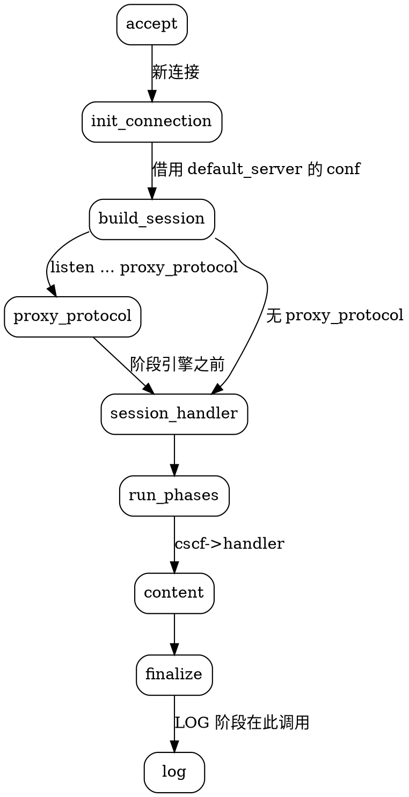

## Introduction

nginx 里其实住着**两套并列的框架**：`http{}` 处理七层，`stream{}` 处理四层。很多人只用过前者，把 stream 当成「http 的简化版」，于是一上手就找 `location`、找 `$request`、找 `proxy_set_header`，然后发现全都不存在。

`stream{}` 的正确心智模型是：**它不认识任何应用层协议**。拿到一个连接，读到的都是裸字节；它既不解析 HTTP，也不解析 MySQL 协议，只负责把两个 socket 粘起来对拷。正因为看不懂内容，它才快、才通用，也才需要 `ssl_preread` 这种「只偷看 ClientHello 明文、不解密」的技巧来做分流。

本文按由浅入深组织：先给能跑起来的配置，再讲会话模型与 7 个阶段，然后是 `ssl_preread` 与 `proxy_pass` 的实现，最后是与 http 的系统性差异和陷阱清单。事实基于 **nginx 1.31.6** 源码（`src/stream/` 共 23 个模块）。

> [!NOTE]
> 一个常见误解：stream 与 http 共享 upstream 代码。源码里**不是**——`src/stream/ngx_stream_upstream*.c` 不 include 任何 `ngx_http*` 头文件，结构体和函数全部另写了一份，只共用 core 层的 `ngx_connection_t`、`ngx_peer_connection_t`、resolver。

### Quick Start

stream 默认**不编译**，需要 `--with-stream`。一个把 3306 透传给 MySQL 的最小配置：

```conf
stream {
    upstream mysql_backend {
        server 10.0.0.11:3306 max_fails=3 fail_timeout=30s;
        server 10.0.0.12:3306 backup;
    }

    server {
        listen 3306;
        proxy_pass mysql_backend;
        proxy_connect_timeout 5s;
        proxy_timeout 1h;
    }
}
```

`stream{}` 与 `http{}` **同级**，都直接写在 main 上下文，互不影响。

### 什么时候该用 stream

| 场景 | 用哪个 | 原因 |
| :-- | :-- | :-- |
| HTTP/HTTPS 反代、需要改头、缓存、限流 | `http{}` | 只有 http 有头、URI、location |
| 透传 TLS（不想在 nginx 终止证书） | `stream{}` | 证书留在后端，nginx 只搬字节 |
| 按 SNI 把 443 分给不同后端 | `stream{}` + `ssl_preread` | 见 [ssl_preread 一节](#ssl-preread不解密的-sni-分流) |
| MySQL / Redis / SSH / 自定义 TCP | `stream{}` | http 看不懂这些协议 |
| UDP（DNS、QUIC 之外的 UDP 服务） | `stream{}` | http 不支持 UDP |
| 需要 `grpc_pass` | `http{}` | gRPC 是 HTTP/2 |

## 会话模型：没有 request，只有 session

http 里一切围绕 `ngx_http_request_t`；stream 里对应物是 `ngx_stream_session_t`（`src/stream/ngx_stream.h:261`）：

```c
struct ngx_stream_session_s {
    uint32_t                       signature;         /* "STRM" */
    ngx_connection_t              *connection;
    off_t                          received;
    time_t                         start_sec;
    ngx_msec_t                     start_msec;
    ngx_log_handler_pt             log_handler;
    void                         **ctx;
    void                         **main_conf;
    void                         **srv_conf;
    ngx_stream_virtual_names_t    *virtual_names;
    ngx_stream_upstream_t         *upstream;
    ngx_array_t                   *upstream_states;
    ngx_stream_variable_value_t   *variables;
    ngx_int_t                      phase_handler;
    ngx_uint_t                     status;
    ...
};
```

对比 http 的 `ngx_http_request_t`，差异是结构性的：

- **没有 request / headers / uri / method / args**——不解析应用层协议
- **只有两级配置**：`ngx_stream_conf_ctx_t` 只有 `main_conf` 和 `srv_conf`，**没有 `loc_conf`**。这是「stream 没有 location」的根本原因，不是「还没实现」
- 模块上下文 `ngx_stream_module_t` 也只有 `create_main_conf / init_main_conf / create_srv_conf / merge_srv_conf`，没有 loc 那两个
- **状态码是独立一套**（`ngx_stream.h:29`）：`OK=200 / BAD_REQUEST=400 / FORBIDDEN=403 / INTERNAL_SERVER_ERROR=500 / BAD_GATEWAY=502 / SERVICE_UNAVAILABLE=503`。**没有 404、没有 3xx**——四层世界里没有「资源不存在」和「重定向」

## 7 个阶段

```c
/* src/stream/ngx_stream.h:84 */
typedef enum {
    NGX_STREAM_POST_ACCEPT_PHASE = 0,
    NGX_STREAM_PREACCESS_PHASE,
    NGX_STREAM_ACCESS_PHASE,
    NGX_STREAM_SSL_PHASE,
    NGX_STREAM_PREREAD_PHASE,
    NGX_STREAM_CONTENT_PHASE,
    NGX_STREAM_LOG_PHASE
} ngx_stream_phases;
```

实际挂载情况（对 `src/stream/*.c` 全量 grep 的结果）：

| 阶段 | 挂载的模块 | 位置 |
| :-- | :-- | :-- |
| POST_ACCEPT | realip | `ngx_stream_realip_module.c:340` |
| PREACCESS | limit_conn、set | `ngx_stream_limit_conn_module.c:729`、`ngx_stream_set_module.c:129` |
| ACCESS | access（allow/deny） | `ngx_stream_access_module.c:445` |
| SSL | ssl（TLS 终止） | `ngx_stream_ssl_module.c:1726` |
| PREREAD | ssl_preread（只读不解密） | `ngx_stream_ssl_preread_module.c:707` |
| CONTENT | **无注册数组**，只有 `cscf->handler` | `ngx_stream_core_module.c:441` |
| LOG | log | `ngx_stream_log_module.c:1657` |

两个容易搞错的点：

1. **PROXY protocol 不在任何阶段**。它在 `ngx_stream_init_connection()` 里、进入阶段引擎**之前**由 `ngx_stream_proxy_protocol_handler()` 单独处理（`ngx_stream_handler.c:183`）。
2. **CONTENT 阶段没有 handler 数组**。`ngx_stream_init_phases()` 只初始化 6 个数组，CONTENT 直接放一个固定 checker。

### 阶段引擎：比 http 简化，但仍用 checker

```c
/* src/stream/ngx_stream_core_module.c:168 */
void
ngx_stream_core_run_phases(ngx_stream_session_t *s)
{
    ngx_int_t                     rc;
    ngx_stream_phase_handler_t   *ph;
    ngx_stream_core_main_conf_t  *cmcf;

    cmcf = ngx_stream_get_module_main_conf(s, ngx_stream_core_module);
    ph = cmcf->phase_engine.handlers;

    while (ph[s->phase_handler].checker) {
        rc = ph[s->phase_handler].checker(s, &ph[s->phase_handler]);
        if (rc == NGX_OK) {
            return;
        }
    }
}
```

http 有 6~7 个 checker，stream 只有 3 个：`ngx_stream_core_generic_phase`、`ngx_stream_core_preread_phase`、`ngx_stream_core_content_phase`。generic checker 的返回值语义：

| 返回值 | 行为 |
| :-- | :-- |
| `NGX_OK` | 跳到 `ph->next`，跳过本阶段剩余 handler |
| `NGX_DECLINED` | `phase_handler++`，继续下一个 |
| `NGX_AGAIN` / `NGX_DONE` | 返回 `NGX_OK` 让 run_phases 退出，挂事件等 I/O |
| 其它（含 `NGX_ERROR`） | `finalize_session`，记 500 |

和 http 一样，**同一阶段内是逆序遍历**的（后注册的模块先执行）：

```c
/* src/stream/ngx_stream.c:377 */
        for (j = cmcf->phases[i].handlers.nelts - 1; j >= 0; j--) {
            ph->checker = checker;
            ph->handler = h[j];
            ph->next = n;
            ph++;
        }
```

### CONTENT 阶段：唯一 handler，没有回退

http 的 content phase 会先试 `r->content_handler`，失败再退回首字节 handler 链（static/index/autoindex…）。stream 的 content phase 只有一个函数指针：

```c
/* src/stream/ngx_stream_core_module.c:440 */
    cscf = ngx_stream_get_module_srv_conf(s, ngx_stream_core_module);
    ...
    if (cscf->handler == NULL) {
        ngx_log_debug0(NGX_LOG_DEBUG_STREAM, c->log, 0, "no handler for server");
        ngx_stream_finalize_session(s, NGX_STREAM_INTERNAL_SERVER_ERROR);
        return NGX_OK;
    }

    cscf->handler(s);
```

`cscf->handler` 只有三个赋值来源：`proxy_pass`（`ngx_stream_proxy_module.c:2768`）、`pass`（`ngx_stream_pass_module.c:282`）、`return`（`ngx_stream_return_module.c:215`）。因为是同一个字段，**同一 `server{}` 里写两个会互相覆盖**（各指令自身重复才报 `"is duplicate"`）。

### finalize：返回值直接就是状态码

```c
/* src/stream/ngx_stream_handler.c:300 */
void
ngx_stream_finalize_session(ngx_stream_session_t *s, ngx_uint_t rc)
{
    s->status = rc;
    ngx_stream_log_session(s);
    ngx_stream_close_connection(s->connection);
}
```

`rc` 既是控制流返回值，也直接写进 `s->status`，被 `$status` 按 `"%03ui"` 打印。所以 `finalize(s, NGX_STREAM_OK)` 在日志里就是 **200**。另外 **LOG 阶段不走 phase engine**——是 `ngx_stream_log_session()` 直接遍历数组调用。

## 连接建立流程

`ls->handler = ngx_stream_init_connection`（`ngx_stream.c:1000`），完整链路：



关键点：session 建立时**先用 `default_server` 的配置**，之后若 SNI 匹配成功，再由 `ngx_stream_find_virtual_server()` 把 `s->srv_conf` 整体换掉。所以四层也能做「虚拟主机」，只是匹配依据不是 Host 头而是 SNI（1.25.5 起）。

## ssl_preread：不解密的 SNI 分流

`ssl_preread` 是 stream 最有价值的能力：**只读 ClientHello 的明文部分，不握手、不解密、不终止 TLS**，从中提取 SNI 用于分流。

它**默认不编译**，需要 `--with-stream_ssl_preread_module`。启用后产出三个变量：

- `$ssl_preread_protocol` —— TLS 版本（1.15.2 起）
- `$ssl_preread_server_name` —— SNI
- `$ssl_preread_alpn_protocols` —— ALPN（1.13.10 起）

解析是纯状态机（`sw_start → sw_header → sw_version → … → sw_sni_*`），只挑 SNI(ext 0)、ALPN(ext 16)、supported_versions(ext 43) 三个扩展。见到 `supported_versions` 就把版本直接写成 TLSv1.3。

### 用法一：map + proxy_pass 变量

```conf
stream {
    map $ssl_preread_server_name $backend {
        a.example.com   backend_a;
        b.example.com   backend_b;
        default         backend_default;
    }

    upstream backend_a { server 10.0.1.10:443; }
    upstream backend_b { server 10.0.2.10:443; }
    upstream backend_default { server 10.0.3.10:443; }

    server {
        listen 443;
        ssl_preread on;
        proxy_pass $backend;
    }
}
```

成立的原因是一个**时序保证**：PREREAD 阶段（ssl_preread）必然在 CONTENT 阶段（proxy_pass 求值）之前，所以变量到 CONTENT 时一定已经有值。

### 用法二：server_name 虚拟服务器（1.25.5 起）

```conf
stream {
    server {
        listen 443;
        ssl_preread on;
        server_name a.example.com;
        proxy_pass backend_a;
    }
    server {
        listen 443;
        ssl_preread on;
        server_name b.example.com;
        proxy_pass backend_b;
    }
}
```

`ssl_preread` 解析出 SNI 后会自动调用 `ngx_stream_find_virtual_server()`，命中就把 `s->srv_conf` 整体替换成匹配的 `server{}`（连 `error_log` 一起切），连 map 都不需要。1.25.5 之前同端口多 server 是另一种语义，写配置时要留意版本。

### 缓冲区与超时

`preread_buffer_size` 和 `preread_timeout` 是 **core 模块的指令**（不是 ssl_preread 的），默认 **16 KB / 30 s**（`ngx_stream_core_module.c:858`）。写满会报 `"preread buffer full"` 并按 400 结束。

> [!WARNING]
> `ssl_preread` 只能看到 ClientHello 里的明文。如果客户端开启了 **ECH**（Encrypted Client Hello），SNI 是加密的，`$ssl_preread_server_name` 会拿不到值——这时只能退回按 IP/端口分流。

## proxy_pass：双向字节流对拷

stream 的 `proxy_pass` 与 http 的**完全不是一回事**：它是把下游连接和上游连接做双向拼接，不改内容、不加头、不解析协议。

### 两个 buffer 与主循环

方向选择（`ngx_stream_proxy_module.c:1962`）：

```c
    if (from_upstream) {
        src = pc;  dst = c;
        b = &u->upstream_buf;
        limit_rate = u->download_rate;
        packets = &u->responses;
    } else {
        src = c;   dst = pc;
        b = &u->downstream_buf;
        limit_rate = u->upload_rate;
        packets = &u->requests;
    }
```

循环体每次做四件事：先把 `out` 链写出去 → 按 `limit_rate` 算限速 → `src->recv()` 收一段 → 挂到 `out` 链并 `continue`。两个方向各有独立 handler（`ngx_stream_proxy_downstream_handler` / `ngx_stream_proxy_upstream_handler`），都汇到 `ngx_stream_proxy_process()`。

注意这是**用户态的双向 `recv` / `send`**：数据必须从内核 socket 缓冲区复制到用户态 buffer，再写回另一个 socket。所以四层代理拿不到静态文件那种 `sendfile` 零拷贝收益——后者是数据在内核内部直接从页缓存搬到 socket 缓冲区，不经用户态，见 [ZeroCopy](/docs/CS/OS/Linux/ZeroCopy.md)。这也是 nginx 的四层代理在大流量下 CPU 偏高的根本原因。

`ssl_preread` 读到的数据**不会丢**：`ngx_stream_proxy_init_upstream()` 会把 `c->buffer` 整段挂到 `u->upstream_out` 头部，先发给上游。这是「先偷看再转发」能无缝衔接的关键。

### 参数默认值

| 指令 | 默认值 | 说明 |
| :-- | :-- | :-- |
| `proxy_connect_timeout` | 60s | 与上游建连超时 |
| `proxy_timeout` | **10m** | 两个方向任意一侧空闲超过它就断开 |
| `proxy_buffer_size` | 16k | 单方向 buffer |
| `proxy_next_upstream` | **on** | 注意是 `FLAG`，只有 on/off |
| `proxy_next_upstream_tries` | 0（不限） | |
| `proxy_next_upstream_timeout` | 0（不限） | |
| `proxy_upload_rate` / `proxy_download_rate` | 0（不限） | **支持变量** |
| `proxy_requests` / `proxy_responses` | 0 / 不限 | UDP 语义下才有用 |
| `proxy_socket_keepalive` | off | |
| `proxy_half_close` | off | |

已废弃：`proxy_downstream_buffer` / `proxy_upstream_buffer`，都指向 `buffer_size` 并挂了 deprecated。

> [!WARNING]
> stream 的 `proxy_next_upstream` **只有 on/off**，不能像 http 那样写 `error timeout http_500`。因为四层看不懂响应内容，压根没有「上游返回 5xx」这个概念。

### PROXY protocol：两个方向要分清

| 写法 | 属于 | 方向 |
| :-- | :-- | :-- |
| `listen ... proxy_protocol;` | core 模块 | **接收**来自下游（前面 L4 设备）的 PROXY 头 |
| `proxy_protocol on|off|v2;` | proxy 模块 | **发给**上游的 PROXY 头 |

`proxy_protocol_timeout`（默认 30s）属于前者。v2 支持是 **1.31.4** 加的：

```c
/* src/stream/ngx_stream_proxy_module.c:1047 */
    if (u->proxy_protocol == 2) {
        p = ngx_proxy_protocol_v2_write(c, buf, buf + sizeof(buf), NULL);
    } else {
        p = ngx_proxy_protocol_write(c, buf, buf + sizeof(buf));
    }
```

## upstream：独立实现，能力少于 http

### 算法支持对照

| 算法 | http | stream | 说明 |
| :-- | :--: | :--: | :-- |
| round_robin（默认） | ✅ | ✅ | 内置，无指令 |
| `hash key [consistent]` | ✅ | ✅ | |
| `least_conn` | ✅ | ✅ | |
| `random [two [method]]` | ✅ | ✅ | |
| `least_time` | ✅ | ✅ | **stream 也有**，1.31.0 加入 |
| `ip_hash` | ✅ | ❌ | stream 无此模块 |
| upstream `keepalive` | ✅ | ❌ | stream 无长连接池 |
| `sticky` | ✅ | ❌ | 全目录 grep 零命中 |
| `zone` | ✅ | ✅ | 共享内存，支持 DNS 动态解析 |
| `health_check` | ❌（Plus） | ❌ | 开源版都没有 |

`server` 参数默认值与 http 一致：`weight=1`、`max_conns=0`、`max_fails=1`、`fail_timeout=10`。

### 重试：触发点只有三个

http 能按响应状态决定是否换机器，stream 不能。源码里只有三处触发重试：connect 超时、connect 失败、`ngx_tcp_nodelay` 失败。耗尽后：

```c
/* src/stream/ngx_stream_proxy_module.c:2266 */
    if (u->peer.tries == 0
        || !pscf->next_upstream
        || (timeout && ngx_current_msec - u->peer.start_time >= timeout))
    {
        ngx_stream_proxy_finalize(s, NGX_STREAM_BAD_GATEWAY);
        return;
    }
```

即 **502**。

更值得注意的一条：**TCP 场景下连接正常断开不会累计 `max_fails`**。`ngx_stream_proxy_finalize()` 在正常结束时传的 state 是 0，只有 UDP 且读写出错才置 `NGX_PEER_FAILED`。所以 `max_fails/fail_timeout` 在这里主要对「连不上」生效——如果你的后端是「能连上但立刻断开」，stream 侧的被动健康检查基本帮不上忙。

## 模块清单与变量

`src/stream/` 共 23 个模块，默认编译的有：`stream`、`core`、`log`、`proxy`、`upstream`、`write_filter`、`limit_conn`、`access`、`geo`、`map`、`split_clients`、`return`、`pass`、`set`，以及 `upstream_hash/least_conn/least_time/random/zone`。

需要显式 `--with-*` 的四个：`stream_ssl_module`、`stream_realip_module`、`stream_geoip_module`、`stream_ssl_preread_module`。

与 http 同名模块的差异：

| 模块 | 差异 |
| :-- | :-- |
| **log** | **没有内建 `combined` 格式**，且 `access_log` **必须显式给格式名**，否则 EMERG `"log format is not specified"`。不配 `access_log` 就完全没有日志 |
| **limit_conn** | 超限返回 **503**；独有 `$limit_conn_status`（PASSED/REJECTED/REJECTED_DRY_RUN）与 `limit_conn_dry_run` |
| **access** | 拒绝返回 **403** |
| **realip** | 只有 `set_real_ip_from`，**没有 `real_ip_header`**（四层只有 PROXY protocol 一种来源） |
| **return** | 只能 `return <string>`，不能像 http 那样 `return 301 url` |

### 变量是两套，不要混用

stream 有自己的 `ngx_stream_variables.c`、`ngx_stream_add_variable()`、`NGX_STREAM_VAR_*` 标志。http 的变量在 stream 里**一律不可用**，反之亦然。

stream 常用变量：

- 连接：`$remote_addr`、`$remote_port`、`$server_addr`、`$server_port`、`$connection`
- 流量：`$bytes_sent`、`$bytes_received`、`$session_time`、`$status`、`$protocol`（`TCP`/`UDP`）
- 上游：`$upstream_addr`、`$upstream_bytes_sent/received`、`$upstream_connect_time`、`$upstream_first_byte_time`、`$upstream_session_time`
- preread：`$ssl_preread_protocol`、`$ssl_preread_server_name`、`$ssl_preread_alpn_protocols`
- PROXY protocol：`$proxy_protocol_addr`、`$proxy_protocol_port`、`$proxy_protocol_server_addr/port`

**照抄 http 的 log_format 会失败的变量**：`$request`、`$uri`、`$http_*`、`$sent_http_*`、`$body_bytes_sent`、`$request_time`（用 `$session_time`）、`$upstream_response_time`（用 `$upstream_session_time`）、`$upstream_status`（stream 没有）。

一个可用的 stream 日志配置：

```conf
stream {
    log_format basic '$remote_addr [$time_local] $protocol $status '
                     '$bytes_sent $bytes_received $session_time '
                     '"$upstream_addr" $ssl_preread_server_name';

    access_log /var/log/nginx/stream.log basic buffer=32k flush=5s;

    server { ... }
}
```

## 陷阱清单

1. **同一端口不能同时给 http 和 stream**。配置期**没有任何跨模块检查**（两者都往同一个 `listening` 数组 push），只在 `bind()` 时撞 `EADDRINUSE`。更坑的是 **`nginx -t` 也不报**——`ngx_open_listening_sockets()` 里 `if (err != NGX_EADDRINUSE || !ngx_test_config)` 把这条日志吞了，要等真正启动才炸。
2. **别用 `reuseport` 绕开上面这条**。双方都加 `reuseport` 确实能 bind 成功，但内核会把新连接**随机**分给其中一个 listener，一部分 HTTPS 请求会被 stream 收走，行为完全不可控。
3. **同端口多个 `server{}` 不会报 duplicate**。只有「同一个 server 块重复 listen 同一地址」才报 `"a duplicate listen"`；不同 server 块是 virtual servers（1.25.5+）。
4. **同一 server 里 `proxy_pass` / `pass` / `return` 会互相覆盖**，因为它们写的是同一个 `cscf->handler` 字段。
5. **`preread_buffer_size` 是 core 的指令**，不在 ssl_preread 模块里。
6. **stream 的 `access_log` 必须带格式名**，这是与 http 最容易撞的行为差异。
7. **stream 没有 location、没有 rewrite**（`grep location src/stream/*.c` 零命中），别指望 `if`、`try_files`。
8. **`1.31.6` 源码树里没有 `zone_sync` 模块**，网上有些文章提到的流状态同步是 NGINX Plus 的能力。
9. **UDP 的 `proxy_responses` 语义特殊**：设为 0 表示「不等响应」，常用于单向日志上报类协议；默认不限。

## Links

- [nginx](/docs/CS/CN/nginx/nginx.md)
- [Upstream](/docs/CS/CN/nginx/upstream.md) — 七层的负载均衡与重试（算法可以对照看）
- [Configuration](/docs/CS/CN/nginx/config.md) — http 侧的配置体系
- [TLS](/docs/CS/CN/nginx/tls.md) — 真正的 TLS 终止与 `ssl_preread` 的边界
- [Log](/docs/CS/CN/nginx/log.md) — 日志格式与缓冲
- [HTTP/3](/docs/CS/CN/nginx/http3.md)

## References

- <https://nginx.org/en/docs/stream/ngx_stream_core_module.html>
- <https://nginx.org/en/docs/stream/ngx_stream_proxy_module.html>
- <https://nginx.org/en/docs/stream/ngx_stream_ssl_preread_module.html>
- <https://nginx.org/en/docs/stream/ngx_stream_upstream_module.html>
