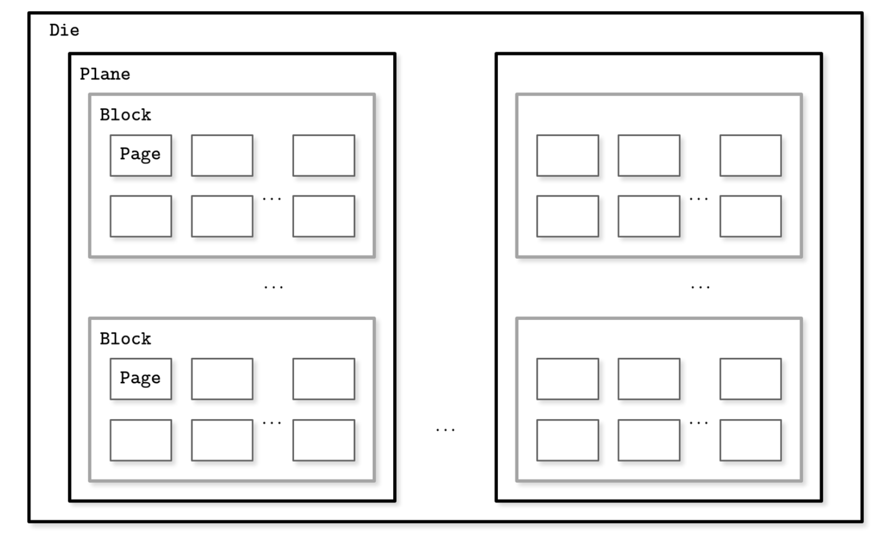

## Introduction

Computer Organization and Architecture comprehensively covers processor and computer design fundamentals.

- Basic Computer Instructions
- Instruction Design and Format
- Computer Arithmetic
- Microprogrammed Control
- Memory Organization


SouthBridge
NorthBridge

## Number System

Ints are not Integers, Floats are not Reals.

IEEE Standard 754 Floating Point Numbers

IEEE 754 has 3 basic components:

1. **The Sign of Mantissa**
   This is as simple as the name. 0 represents a positive number while 1 represents a negative number.
2. **The Biased exponent**
   The exponent field needs to represent both positive and negative exponents. A bias is added to the actual exponent in order to get the stored exponent.
3. **The Normalised Mantissa**
   The mantissa is part of a number in scientific notation or a floating-point number, consisting of its significant digits.
   Here we have only 2 digits, i.e. O and 1. So a normalised mantissa is one with only one 1 to the left of the decimal.
   IEEE 754 numbers are divided into two based on the above three components: single precision and double precision.


## ISA

Instruction Set Architectures

Computer Instructions

RISC

CISC

## Pipelining

Instruction is executed in 5 phases:

- Instruction Fetch
- Instruction Decode
- Operand Fetch
- Execute
- Operand Store

### Speedup Ratio

If i operations are performed with this pipeline, the time taken is i+(n-1) cycles.
Without pipelining, the system would require n*i cycles.
The speedup ratio is therefore

```tex
S = \sum_{i+(n-1)}{n*i}=\sum_{1+\sum_i{n-1}}{n}cycles
```

In the limit, when i=1 the value of S is 1, and when i=,the speedup is n.

### Data Hazard

Data dependency arises when the outcome of the current operation is dependent on the result of a previous instruction that has not yet been executed to completion.
Data hazards arise because of the need to preserve the order of the execution of instructions.

Control Hazard

Structure Hazard

### Branches


#### The Delayed Branch

#### Branch Prediction


#### Dynamic Branch Prediction

## Disk

On spinning disks, seeks increase costs of random reads because they require disk rotation and mechanical head movements to position the read/write head to the desired location.
However, once the expensive part is done, reading or writing contiguous bytes (i.e., sequential operations) is relatively cheap.

The smallest transfer unit of a spinning drive is a sector, so when some operation is performed, at least an entire sector can be read or written. Sector sizes typically range from 512 bytes to 4 Kb.

Head positioning is the most expensive part of an operation on the HDD. This is one of the reasons we often hear about the positive effects of sequential I/O: reading and writing contiguous memory segments from disk.


磁道 扇区 通常扇区512Byte

### Solid State Drives

Solid state drives (SSDs) do not have moving parts: there’s no disk that spins, or head that has to be positioned for the read. 
A typical SSD is built of memory cells, connected into strings (typically 32 to 64 cells per string), 
strings are combined into arrays, arrays are combined into pages, and pages are combined into blocks.

Depending on the exact technology used, a cell can hold one or multiple bits of data. 
Pages vary in size between devices, but typically their sizes range from 2 to 16 Kb. Blocks typically contain 64 to 512 pages. 
Blocks are organized into planes and, finally, planes are placed on a die. SSDs can have one or more dies. Figure 1 shows this hierarchy.


<div style="text-align: center;">



</div>

<p style="text-align: center;">
Fig.1. SSD organization schematics
</p>


The smallest unit that can be written (programmed) or read is a page. However, we can only make changes to the empty memory cells (i.e., to ones that have been erased before the write). 
The smallest erase entity is not a page, but a block that holds multiple pages, which is why it is often called an erase block. Pages in an empty block have to be written sequentially.

The part of a flash memory controller responsible for mapping page IDs to their physical locations, tracking empty, written, and discarded pages, is called the Flash Translation Layer (FTL). 
It is also responsible for garbage collection, during which FTL finds blocks it can safely erase. Some blocks might still contain live pages. 
In this case, it relocates live pages from these blocks to new locations and remaps page IDs to point there. 
After this, it erases the now-unused blocks, making them available for writes.

Since in both device types (HDDs and SSDs) we are addressing chunks of memory rather than individual bytes (i.e., accessing data block-wise), most operating systems have a block device abstraction. 
It hides an internal disk structure and buffers I/O operations internally, so when we’re reading a single word from a block device, the whole block containing it is read. 
This is a constraint we cannot ignore and should always take into account when working with disk-resident data structures.

In SSDs, we don’t have a strong emphasis on random versus sequential I/O, as in HDDs, because the difference in latencies between random and sequential reads is not as large. There is still some difference caused by prefetching, reading contiguous pages, and internal parallelism.

Even though garbage collection is usually a background operation, its effects may negatively impact write performance, especially in cases of random and unaligned write workloads.

Writing only full blocks, and combining subsequent writes to the same block, can help to reduce the number of required I/O operations. 

## Cache

L1

```shell
cat /sys/devices/system/cpu/cpu0/cache/index0/size 
cat /sys/devices/system/cpu/cpu0/cache/index1/size
```

L2

```shell
cat /sys/devices/system/cpu/cpu0/cache/index2/size 
```

L3

```shell
cat /sys/devices/system/cpu/cpu0/cache/index3/size 
```

Instruction Cache and Data Cache

flush cache to memory and execute code

## Links

- [Operating Systems](/docs/CS/OS/OS.md)
- [Data Structures and Algorithms](/docs/CS/Algorithms/Algorithms.md)
- [Computer Network](/docs/CS/CN/CN.md)


## References


