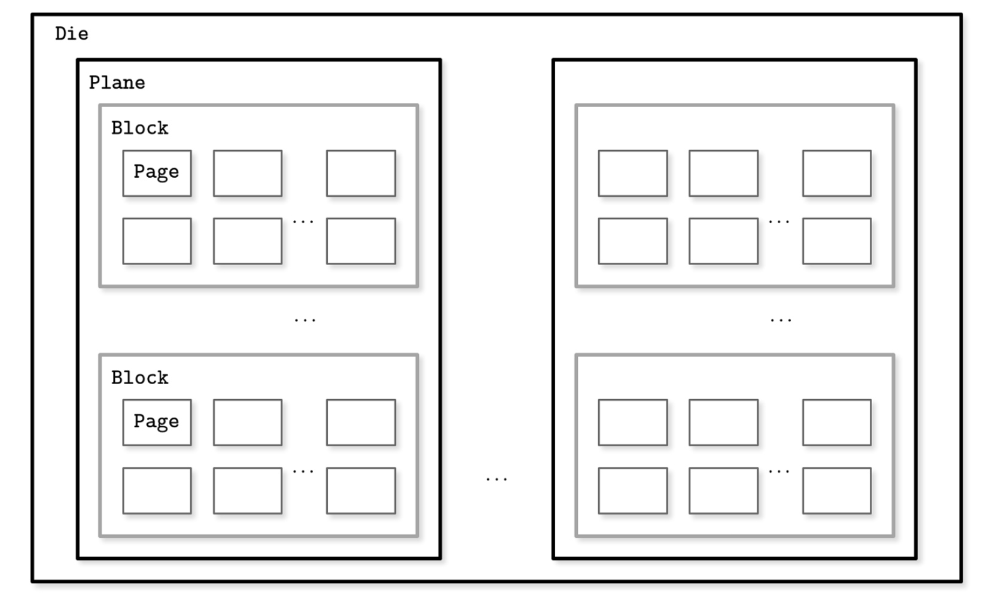

## Introduction

计算机组成与架构全面涵盖了处理器和计算机设计的基础知识。

- 基本计算机指令
- 指令设计与格式
- 计算机算术
- 微程序控制
- 内存组织

SouthBridge
NorthBridge

## Number System

整数不是整数（Ints are not Integers），浮点数不是实数（Floats are not Reals）。

IEEE 754 浮点数标准

IEEE 754 有三个基本组成部分：

1. **尾数的符号**
   名称即含义。0 表示正数，1 表示负数。
2. **有偏指数**
   指数字段需要表示正指数和负指数。
   为了得到存储的指数，会在实际指数上加上一个偏置值。
3. **规格化尾数**
   尾数是科学记数法或浮点数的一部分，由有效数字组成。
   这里只有两个数字，即 0 和 1。
   因此规格化尾数是指十进制小数点左侧只有一个 1。
   IEEE 754 数字根据上述三个组成部分分为两类：单精度和双精度。

## ISA

指令集架构

计算机指令

RISC

CISC

## Pipelining

指令执行分为 5 个阶段：

- 取指（Instruction Fetch）
- 译码（Instruction Decode）
- 取操作数（Operand Fetch）
- 执行（Execute）
- 写回（Operand Store）

### Speedup Ratio

如果用该流水线执行 i 个操作，所需时间为 i+(n-1) 个周期。
没有流水线，系统需要 n*i 个周期。
因此加速比为：

```tex
S = \sum_{i+(n-1)}{n*i}=\sum_{1+\sum_i{n-1}}{n}cycles
```

极限情况下，当 i=1 时 S 的值为 1，当 i 趋近无穷时，加速比为 n。

### Data Hazard

当当前操作的结果依赖于尚未执行完成的先前指令的结果时，就会产生数据依赖。
数据冒险的产生是因为需要保持指令执行的顺序。

Control Hazard

Structure Hazard

### Branches

#### The Delayed Branch

#### Branch Prediction

#### Dynamic Branch Prediction

## Disk

在旋转磁盘上，寻道增加了随机读取的成本，因为需要磁盘旋转和机械臂移动来将读写头定位到目标位置。
然而，一旦昂贵的部分完成，读取或写入连续字节（即顺序操作）就相对便宜。

旋转驱动器的最小传输单元是扇区，因此执行某些操作时，至少可以读取或写入整个扇区。
扇区大小通常为 512 字节到 4 Kb。

磁头定位是 HDD 操作中最昂贵的部分。
这就是我们经常听到顺序 I/O 积极影响的原因之一：从磁盘读取和写入连续的内存段。

通常扇区 512Byte

### Solid State Drives

固态硬盘没有移动部件：没有旋转的磁盘，也没有需要定位读写的磁头。
典型的 SSD 由存储单元构建，连接成字符串（通常每串 32 到 64 个单元），
字符串组合成阵列，阵列组合成页，页组合成块。

根据使用的具体技术，一个单元可以保存一个或多个比特的数据。
不同设备的页大小不同，但通常范围从 2 到 16 Kb。
块通常包含 64 到 512 页。
块组织成平面，最后平面放置在 die 上。
SSD 可以有一个或多个 die。

<div style="text-align: center;">



</div>

<p style="text-align: center;">
Fig.1. SSD organization schematics
</p>

可以写入（编程）或读取的最小单元是页。
但是，我们只能对空的内存单元（即写入前已擦除的单元）进行更改。
最小的擦除实体不是页，而是包含多个页的块，这就是为什么它通常被称为擦除块。
空块中的页必须顺序写入。

闪存控制器中负责将页 ID 映射到物理位置、跟踪空页、已写入页和废弃页的部分称为闪存转换层（FTL）。
它还负责垃圾回收，在此期间 FTL 寻找可以安全擦除的块。
某些块可能仍包含有效页。
在这种情况下，它将有效页从这些块迁移到新位置，并重新映射页 ID。
之后，它擦除现在未使用的块，使其可供写入。

由于在两种设备类型（HDD 和 SSD）中，我们处理的是内存块而不是单个字节（即按块访问数据），大多数操作系统提供了块设备抽象。
它隐藏了内部磁盘结构并在内部缓冲 I/O 操作，因此当我们从块设备读取单个字时，包含它的整个块都会被读取。
这是我们在处理磁盘驻留数据结构时无法忽视且应始终考虑的约束。

在 SSD 中，不像 HDD 那样强调随机与顺序 I/O 的差异，因为随机读取和顺序读取之间的延迟差异不那么显著。
由于预取、读取连续页和内部并行性，仍然存在一些差异。

尽管垃圾回收通常是后台操作，但其影响可能对写入性能产生负面影响，特别是在随机和非对齐写入工作负载的情况下。

只写入完整块，并将对同一块的后续写入合并，有助于减少所需的 I/O 操作次数。

## Cache

L1

```shell
cat /sys/devices/system/cpu/cpu0/cache/index0/size 
cat /sys/devices/system/cpu/cpu0/cache/index1/size
```

L2

```shell
cat /sys/devices/system/cpu/cpu0/cache/index2/size 
```

L3

```shell
cat /sys/devices/system/cpu/cpu0/cache/index3/size 
```

Instruction Cache and Data Cache

将缓存刷新到内存并执行代码

## Links

- [Operating Systems](/docs/CS/OS/OS.md)
- [Data Structures and Algorithms](/docs/CS/Algorithms/Algorithms.md)
- [Computer Network](/docs/CS/CN/CN.md)


## References


