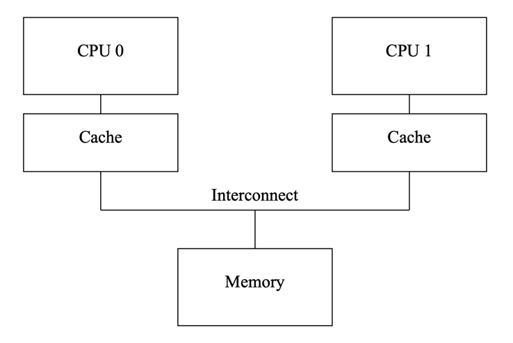
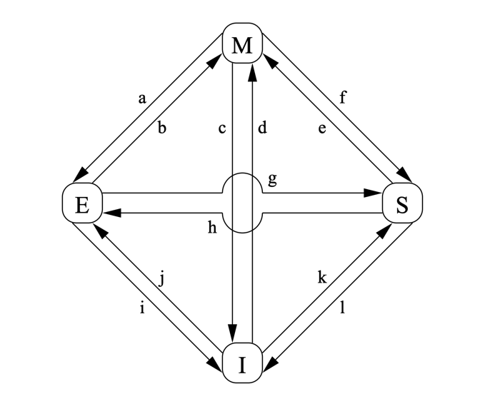

## Introduction

## Cache Structure

Fig.1. Modern Computer System Cache Structure.

Data flows among the CPUs’ caches and memory in fixed-length blocks called “cache lines”, which are normally a power of two in size, ranging from 16 to 256 bytes.
When a given data item is first accessed by a given CPU, it will be absent from that CPU’s cache, meaning that a “cache miss” (or, more specifically, a “startup” or “warmup” cache miss) has occurred.
The cache miss means that the CPU will have to wait (or be “stalled”) for hundreds of cycles while the item is fetched from memory.
However, the item will be loaded into that CPU’s cache, so that subsequent accesses will find it in the cache and therefore run at full speed.

After some time, the CPU’s cache will fill, and subsequent misses will likely need to eject an item from the cache in order to make room for the newly fetched item.
Such a cache miss is termed a “capacity miss”, because it is caused by the cache’s limited capacity.
However, most caches can be forced to eject an old item to make room for a new item even when they are not yet full.
This is due to the fact that large caches are implemented as hardware hash tables with fixedsize hash buckets (or “sets”, as CPU designers call them) and no chaining, as shown in Figure 2.

- L1
  - L1d cache
  - L1i cache
- L2
- L3

## Cache-Coherence Protocols

Cache-coherency protocols manage cache-line states so as to prevent inconsistent or lost data.
These protocols can be quite complex, with many tens of states,2 but for our purposes we need only concern ourselves with the four-state MESI cache-coherence protocol.

### MESI

MESI stands for “modified”, “exclusive”, “shared”, and “invalid”, the four states a given cache line can take on using this protocol.
Caches using this protocol therefore maintain a two-bit state “tag” on each cache line in addition to that line’s physical address and data.

Many of the transitions described in the previous section require communication among the CPUs.
If the CPUs are on a single shared bus, the following messages suffice:

- **Read:**
  The “read” message contains the physical address of the cache line to be read.
- **Read Response:**
  The “read response” message contains the data requested by an earlier “read” message.
  This “read response” message might be supplied either by memory or by one of the other caches.
  For example, if one of the caches has the desired data in “modified” state, that cache must supply the “read response” message.
- **Invalidate:**
  The “invalidate” message contains the physical address of the cache line to be invalidated.
  All other caches must remove the corresponding data from their caches and respond.
- **Invalidate Acknowledge:**
  A CPU receiving an “invalidate” message must respond with an “invalidate acknowledge” message after removing the specified data from its cache.
- **Read Invalidate:**
  The “read invalidate” message contains the physical address of the cache line to be read, while at the same time directing other caches to remove the data.
  Hence, it is a combination of a “read” and an “invalidate”, as indicated by its name.
  A “read invalidate” message requires both a “read response” and a set of “invalidate acknowledge” messages in reply.
- **Writeback:**
  The “writeback” message contains both the address and the data to be written back to memory (and perhaps “snooped” into other CPUs’ caches along the way).
  This message permits caches to eject lines in the “modified” state as needed to make room for other data.

Fig.2. MESI Cache-Coherency State Diagram.

The transition arcs in this figure are as follows:

- **Transition (a):**
  A cache line is written back to memory, but the CPU retains it in its cache and further retains the right to modify it.
  This transition requires a “writeback” message.
- **Transition (b):**
  The CPU writes to the cache line that it already had exclusive access to. This transition does not require any messages to be sent or received.
- **Transition (c):**
  The CPU receives a “read invalidate” message for a cache line that it has modified.
  The CPU must invalidate its local copy, then respond with both a “read response” and an “invalidate acknowledge” message, both sending the data to the requesting CPU and indicating that it no longer has a local copy
- **Transition (d):**
  The CPU does an atomic readmodify-write operation on a data item that was not present in its cache.
  It transmits a “read invalidate”, receiving the data via a “read response”. The CPU can complete the transition once it has also received a full set of “invalidate acknowledge” responses.
- **Transition (e):**
  The CPU does an atomic readmodify-write operation on a data item that was previously read-only in its cache.
  It must transmit “invalidate” messages, and must wait for a full set of “invalidate acknowledge” responses before completing the transition.
- **Transition (f):**
  Some other CPU reads the cache line, and it is supplied from this CPU’s cache, which retains a read-only copy, possibly also writing it back to memory.
  This transition is initiated by the reception of a “read” message, and this CPU responds with a “read response” message containing the requested data.
- **Transition (g):**
  Some other CPU reads a data item in this cache line, and it is supplied either from this CPU’s cache or from memory. In either case, this CPU retains a read-only copy.
  This transition is initiated by the reception of a “read” message, and this CPU responds with a “read response” message containing the requested data.
- **Transition (h):**
  This CPU realizes that it will soon need to write to some data item in this cache line, and thus transmits an “invalidate” message.
  The CPU cannot complete the transition until it receives a full set of “invalidate acknowledge” responses.
  Alternatively, all other CPUs eject this cache line from their caches via “writeback” messages (presumably to make room for other cache lines), so that this CPU is the last CPU caching it.
- **Transition (i):**
  Some other CPU does an atomic read-modify-write operation on a data item in a cache line held only in this CPU’s cache, so this CPU invalidates it from its cache.
  This transition is initiated by the reception of a “read invalidate” message, and this CPU responds with both a “read response” and an “invalidate acknowledge” message.
- **Transition (j):**
  This CPU does a store to a data item in a cache line that was not in its cache, and thus transmits a “read invalidate” message.
  The CPU cannot complete the transition until it receives the “read response” and a full set of “invalidate acknowledge” messages.
  The cache line will presumably transition to “modified” state via transition (b) as soon as the actual store completes.
- **Transition (k):**
  This CPU loads a data item in a cache line that was not in its cache. The CPU transmits a “read” message, and completes the transition upon receiving the corresponding “read response”.
- **Transition (l):**
  Some other CPU does a store to a data item in this cache line, but holds this cache line in read-only state due to its being held in other CPUs’ caches (such as the current CPU’s cache).
  This transition is initiated by the reception of an “invalidate” message, and this CPU responds with an “invalidate acknowledge” message.

## Store Buffers

## Invalidate Queues

## Memory Barrier

Because reordering memory references allows much better performance, and so memory barriers are needed to force ordering in things like synchronization primitives whose correct operation depends on ordered memory references.

Many CPU architectures therefore provide weaker memory-barrier instructions that do only one or the other of these two.
Roughly speaking, a “read memory barrier” marks only the invalidate queue and a “write memory barrier” marks only the store buffer. while a full-fledged memory barrier does both.

The effect of this is that a read memory barrier orders only loads on the CPU that executes it, so that all loads preceding the read memory barrier will appear to have completed before any load following the read memory barrier.
Similarly, a write memory barrier orders only stores, again on the CPU that executes it, and again so that all stores preceding the write memory barrier will appear to have completed before any store following the write memory barrier.
A full-fledged memory barrier orders both loads and stores, but again only on the CPU executing the memory barrier.

## Links

- [Cache](/docs/CS/Cache.md)

## References

1. [Memory Barriers: a Hardware View for Software Hackers](http://www.rdrop.com/users/paulmck/scalability/paper/whymb.2010.06.07c.pdf)
