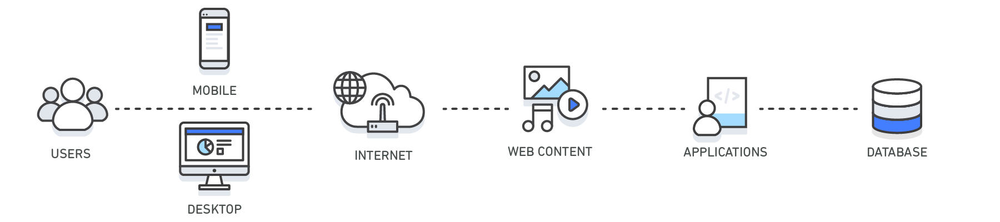

## Introduction

In computing, a cache is a high-speed data storage layer which stores a subset of data, typically transient in nature, so that future requests for that data are served up faster than is possible by accessing the data’s primary storage location.
Caching allows you to efficiently reuse previously retrieved or computed data.

The data in a cache is generally stored in fast access hardware such as RAM (Random-access memory) and may also be used in correlation with a software component.
A cache's primary purpose is to increase data retrieval performance by reducing the need to access the underlying slower storage layer.
Trading off capacity for speed, a cache typically stores a subset of data transiently, in contrast to databases whose data is usually complete and durable.

Caches can be applied and leveraged throughout various layers of technology including Operating Systems, Networking layers including Content Delivery Networks (CDN) and DNS, web applications, and Databases.
You can use caching to significantly reduce latency and improve IOPS for many read-heavy application workloads, such as Q&A portals, gaming, media sharing, and social networking.
Cached information can include the results of database queries, computationally intensive calculations, API requests/responses and web artifacts such as HTML, JavaScript, and image files.
Compute-intensive workloads that manipulate data sets, such as recommendation engines and high-performance computing simulations also benefit from an In-Memory data layer acting as a cache.
In these applications, very large data sets must be accessed in real-time across clusters of machines that can span hundreds of nodes.
Due to the speed of the underlying hardware, manipulating this data in a disk-based store is a significant bottleneck for these applications.

When implementing a cache layer, it’s important to understand the validity of the data being cached.
A successful cache results in a high hit rate which means the data was present when fetched. A cache miss occurs when the data fetched was not present in the cache.
Controls such as TTLs (Time to live) can be applied to expire the data accordingly.
Another consideration may be whether or not the cache environment needs to be Highly Available, which can be satisfied by In-Memory engines such as Redis.
In some cases, an In-Memory layer can be used as a standalone data storage layer in contrast to caching data from a primary location.
In this scenario, it’s important to define an appropriate RTO (Recovery Time Objective--the time it takes to recover from an outage) and
RPO (Recovery Point Objective--the last point or transaction captured in the recovery) on the data resident in the In-Memory engine to determine whether or not this is suitable.
Design strategies and characteristics of different In-Memory engines can be applied to meet most RTO and RPO requirements.

| Layer        | Client-Side                                                           | DNS                                                                              | Web                                                                           | App                                                | Database                                               |
| ------------ | --------------------------------------------------------------------- | -------------------------------------------------------------------------------- | ----------------------------------------------------------------------------- | -------------------------------------------------- | ------------------------------------------------------ |
| Use Case     | Accelerate retrieval of web content from websites (browser or device) | Domain to IP ResolutionAccelerate retrieval of web content from web/app servers. | Manage Web Sessions (server side)                                             | Accelerate application performance and data access | Reduce latency associated with database query requests |
| Technologies | HTTP Cache Headers, Browsers                                          | DNS Servers                                                                      | HTTP Cache Headers, CDNs, Reverse Proxies, Web Accelerators, Key/Value Stores | Key/Value data stores, Local caches                | Database buffers, Key/Value data stores                |

### Benefits of Caching

- Improve Application Performance
  Because memory is orders of magnitude faster than disk (magnetic or SSD), reading data from in-memory cache is extremely fast (sub-millisecond).
  This significantly faster data access improves the overall performance of the application.
- Reduce Database Cost
  A single cache instance can provide hundreds of thousands of IOPS (Input/output operations per second), potentially replacing a number of database instances, thus driving the total cost down.
  This is especially significant if the primary database charges per throughput. In those cases the price savings could be dozens of percentage points.
- Reduce the Load on the Backend
  By redirecting significant parts of the read load from the backend database to the in-memory layer, caching can reduce the load on your database, and protect it from slower performance under load, or even from crashing at times of spikes.
- Predictable Performance
  A common challenge in modern applications is dealing with times of spikes in application usage. Examples include social apps during the Super Bowl or election day, eCommerce websites during Black Friday, etc.
  Increased load on the database results in higher latencies to get data, making the overall application performance unpredictable. By utilizing a high throughput in-memory cache this issue can be mitigated.
- Eliminate Database Hotspots
  In many applications, it is likely that a small subset of data, such as a celebrity profile or popular product, will be accessed more frequently than the rest.
  This can result in hot spots in your database and may require overprovisioning of database resources based on the throughput requirements for the most frequently used data.
  Storing common keys in an in-memory cache mitigates the need to overprovision while providing fast and predictable performance for the most commonly accessed data.
- Increase Read Throughput (IOPS)
  In addition to lower latency, in-memory systems also offer much higher request rates (IOPS) relative to a comparable disk-based database.
  A single instance used as a distributed side-cache can serve hundreds of thousands of requests per second.

## Caching patterns

When you are caching data from your database, there are caching patterns for Redis and Memcached that you can implement, including proactive and reactive approaches.
The patterns you choose to implement should be directly related to your caching and application objectives.

Two common approaches are cache-aside or lazy loading (a reactive approach) and write-through (a proactive approach).
A cache-aside cache is updated after the data is requested. A write-through cache is updated immediately when the primary database is updated.
With both approaches, the application is essentially managing what data is being cached and for how long.

A proper caching strategy includes effective use of both write-through and lazy loading of your data and setting an appropriate expiration for the data to keep it relevant and lean.

### Cache-Aside (Lazy Loading)

A cache-aside cache is the most common caching strategy available. The fundamental data retrieval logic can be summarized as follows:

1. When your application needs to read data from the database, it checks the cache first to determine whether the data is available.
2. If the data is available (a cache hit), the cached data is returned, and the response is issued to the caller.
3. If the data isn’t available (a cache miss), the database is queried for the data.
   The cache is then populated with the data that is retrieved from the database, and the data is returned to the caller.

This approach has a couple of advantages:

- The cache contains only data that the application actually requests,whichhelpskeepthecache size cost-effective.
- Implementing this approach is straightforward and produces immediate performance gains, whether you use an application framework that encapsulates lazy caching or your own custom application logic.

A disadvantage when using cache-aside as the only caching pattern is that because the data is loaded into the cache only after a cache miss, some overhead is added to the initial response time because additional roundtrips to the cache and database are needed.

### Write-Through

A write-through cache reverses the order of how the cache is populated. Instead of lazy-loading the data in the cache after a cache miss, the cache is proactively updated immediately following the primary database update. The fundamental data retrieval logic can be summarized as follows:

1. The application, batch, or backend process updates the primary database.
2. Immediately afterward, the data is also updated in the cache.

The write-through pattern is almost always implemented along with lazy loading. If the application gets a cache miss because the data is not present or has expired, the lazy loading pattern is performed to update the cache.
The write-through approach has a couple of advantages:

- Because the cache is up-to-date with the primary database,there is a much greater likelihood that the data will be found in the cache.
  This, in turn, results in better overall application performance and user experience.
- The performance of your database is optimal because fewer database reads are performed.

A disadvantage of the write-through approach is that infrequently-requested data is also written to the cache, resulting in a larger and more expensive cache.

## Cache Validity

You can control the freshness of your cached data by applying a time to live (TTL) or expiration to your cached keys.
After the set time has passed, the key is deleted from the cache, and access to the origin data store is required along with reaching the updated data.

Two principles can help you determine the appropriate TTLs to apply and the types of caching patterns to implement.
First, it’s important that you understand the rate of change of the underlying data.
Second, it’s important that you evaluate the risk of outdated data being returned back to your application instead of its updated counterpart.

For example, it might make sense to keep static or reference data (that is, data that is seldom updated) valid for longer periods of time with write-throughs to the cache when the underlying data gets updated.
With dynamic data that changes often, you might want to apply lower TTLs that expire the data at a rate of change that matches that of the primary database.
This lowers the risk of returning outdated data while still providing a buffer to offload database requests.

It’s also important to recognize that, even if you are only caching data for minutes or seconds versus longer durations, appropriately applying TTLs to your cached keys can result in a huge performance boost and an overall better user experience with your application.

Another best practice when applying TTLs to your cache keys is to add some time jitter to your TTLs.
This reduces the possibility of heavy database load occurring when your cached data expires.
Take, for example, the scenario of caching product information.
If all your product data expires at the same time and your application is under heavy load, then your backend database has to fulfill all the product requests.
Depending on the load, that could generate too much pressure on your database, resulting in poor performance.
By adding slight jitter to your TTLs, a randomly-generated time value (for example, TTL = your initial TTL value in seconds + jitter) would reduce the pressure on your backend database and also reduce the CPU use on your cache engine as a result of deleting expired keys.

### Evictions

Evictions occur when cache memory is overfilled or is greater than the maxmemory setting for the cache, causing the engine selecting keys to evict in order to manage its memory. The keys that are chosen are based on the eviction policy you select.

By default, Amazon ElastiCache for Redis sets the volatile-lru eviction policy to your Redis cluster.
When this policy is selected, the least recently used keys that have an expiration (TTL) value set are evicted.
Other eviction policies are available and can be applied in the configurable maxmemory-policy parameter.
The following table summarizes eviction policies:

| Eviction Policy | Description                                                                            |
| --------------- | -------------------------------------------------------------------------------------- |
| allkeys-lru     | The cache evicts the least recently used (LRU) keys regardless of TTL set.             |
| allkeys-lfu     | The cache evicts the least frequently used (LFU) keys regardless of TTL set.           |
| volatile-lru    | The cache evicts the least recently used (LRU) keys from those that have a TTL set.    |
| volatile-lfu    | The cache evicts the least frequently used (LFU) keys from those that have a TTL set.  |
| volatile-ttl    | The cache evicts the keys with the shortest TTL set.                                   |
| volatile-random | The cache randomly evicts keys with a TTL set.                                         |
| allkeys-random  | The cache randomly evicts keys regardless of TTL set.                                  |
| no-eviction     | The cache doesn’t evict keys at all. This blocks future writes until memory frees up. |

A good strategy in selecting an appropriate eviction policy is to consider the data stored in your cluster and the outcome of keys being evicted.
Generally, least recently used (LRU)-based policies are more common for basic caching use cases.
However, depending on your objectives, you might want to use a TTL or random-based eviction policy that better suits your requirements.

Also, if you are experiencing evictions with your cluster, it is usually a sign that you should scale up (that is, use a node with a larger memory footprint) or scale out (that is, add more nodes to your cluster) to accommodate the additional data.
An exception to this rule is if you are purposefully relying on the cache engine to manage your keys by means of eviction, also referred to an LRU cache.

## CPU Caching

[CPU Caching](/docs/CS/CO/Cache.md)

## Memory Caching

Memory caching (often simply referred to as caching) is a technique in which computer applications temporarily store data in a computer’s main memory (i.e., random access memory, or RAM) to enable fast retrievals of that data.
The RAM that is used for the temporary storage is known as the cache.
Since accessing RAM is significantly faster than accessing other media like hard disk drives or networks, caching helps applications run faster due to faster access to data.
Caching is especially efficient when the application exhibits a common pattern in which it repeatedly accesses data that was previously accessed.
Caching is also useful to store data calculations that are otherwise time-consuming to compute. By storing the calculations in a cache, the system saves time by avoiding the repetition of the calculation.

## Content Delivery Network (CDN)

When your web traffic is geo-dispersed, it’s not always feasible and certainly not cost effective to replicate your entire infrastructure across the globe.
A CDN provides you the ability to utilize its global network of edge locations to deliver a cached copy of web content such as videos, webpages, images and so on to your customers.
To reduce response time, the CDN utilizes the nearest edge location to the customer or originating request location in order to reduce the response time.
Throughput is dramatically increased given that the web assets are delivered from cache. For dynamic data, many CDNs can be configured to retrieve data from the origin servers.

## Domain Name System (DNS) Caching

Every domain request made on the internet essentially queries DNS cache servers in order to resolve the IP address associated with the domain name.
DNS caching can occur on many levels including on the OS, via ISPs and DNS servers.

## Web Caching

When delivering web content to your viewers, much of the latency involved with retrieving web assets such as images, html documents, video, etc. can be greatly reduced by caching those artifacts and eliminating disk reads and server load.
Various web caching techniques can be employed both on the server and on the client side.
Server side web caching typically involves utilizing a web proxy which retains web responses from the web servers it sits in front of, effectively reducing their load and latency.
Client side web caching can include browser based caching which retains a cached version of the previously visited web content.

## Database Cache

A database cache supplements your primary database by removing unnecessary pressure on it, typically in the form of frequently-accessed read data.
The cache itself can live in several areas, including in your database, in the application, or as a standalone layer.
The following are the three most common types of database caches:

- Database-integrated caches
  Some databases, such as Amazon Aurora, offer an integrated cache that is managed within the database engine and has built-in write-through capabilities.
  The database updates its cache automatically when the underlying data changes. Nothing in the application tier is required to use this cache.
  The downside of integrated caches is their size and capabilities. Integrated caches are typically limited to the available memory that is allocated to the cache by the database instance and can’t be used for other purposes, such as sharing data with other instances.
- Local caches
  A local cache stores your frequently-used data within your application.
  This makes data retrieval faster than with other caching architectures because it removes network traffic that is associated with retrieving data.
  A major disadvantage is that among your applications, each node has its own resident cache working in a disconnected manner.
  The information that is stored in an individual cache node (whether it’s cached database rows, web content, or session data) can’t be shared with other local caches.
  This creates challenges in a distributed environment where information sharing is critical to support scalable dynamic environments.
  Because most applications use multiple application servers, coordinating the values across them becomes a major challenge if each server has its own cache.
  In addition, when outages occur, the data in the local cache is lost and must be rehydrated, which effectively negates the cache.
  The majority of these disadvantages are mitigated with remote caches.
- Remote caches
  A remote cache (or side cache) is a separate instance (or separate instances) dedicated for storing the cached data in-memory.
  Remote caches are stored on dedicated servers and are typically built on key/ value NoSQL stores, such as Redis and Memcached.
  They provide hundreds of thousands of requests (and up to a million) per second per cache node.
  The average latency of a request to a remote cache is on the sub-millisecond timescale, which, in the order of magnitude, is faster than a request to a disk-based database.
  At these speeds, local caches are seldom necessary.
  Remote caches are ideal for distributed environments because they work as a connected cluster that all your disparate systems can utilize.
  However, when network latency is a concern, you can apply a two-tier caching strategy that uses a local and remote cache together.
  It’s typically used only when needed because of the complexity it adds.
  With remote caches, the orchestration between caching the data and managing the validity of the data is managed by your applications and/or processes that use it.
  The cache itself is not directly connected to the database but is used adjacently to it.

### Relational Database Caching Techniques

#### Cache ResultSet

The basic paradigm when you query data from a relational database includes executing SQL statements and iterating over the returned ResultSet object cursor to retrieve the database rows.
There are several techniques you can apply when you want to cache the returned data.
However, it’s best to choose a method that simplifies your data access pattern and/or optimizes the architectural goals that you have for your application.

Iterating over the ResultSet cursor lets you retrieve the fields and values from the database rows. From that point, the application can choose where and how to use that data.

Cache a serialized ResultSet object that contains the fetched database row.

- Advantage:Whendataretrievallogicisabstracted(forexample,asinaDataAccessObjectorDAO layer), the consuming code expects only a ResultSet object and does not need to be made aware of its origination.
  A ResultSet object can be iterated over, regardless of whether it originated from the database or was deserialized from the cache, which greatly reduces integration logic.
  This pattern can be applied to any relational database.
- Disadvantage:DataretrievalstillrequiresextractingvaluesfromtheResultSetobjectcursoranddoes not further simplify data access; it only reduces data retrieval latency.

Note: When you cache the row, it’s important that it’s serializable. The following example uses a CachedRowSet implementation for this purpose. When you are using Redis, this is stored as a byte array value.

The following code converts the CachedRowSet object into a byte array and then stores that byte array as a Redis byte array value. The actual SQL statement is stored as the key and converted into bytes.

One advantage of storing the SQL statement as the key is that it enables a transparent caching abstraction layer that hides the implementation details.
The other added benefit is that you don’t need to create any additional mappings between a custom key ID and the executed SQL statement.
At the time of setting data in the Redis, you are applying the expiry time, which is specified in milliseconds.
For lazy caching/cache aside, you would initially query the cache before executing the query against the database. To hide the implementation details, use the DAO pattern and expose a generic method for your application to retrieve the data.

Assuming that your application framework can’t be used to abstract your caching implementation, how do you best cache the returned database data?

For all other caching techniques that we’ll review, you should establish a naming convention for your Redis keys.
A good naming convention is one that is easily predictable to applications and developers. A hierarchical structure separated by colons is a common naming convention for keys, such as object:type:id.

#### Select Fields

Cache a subset of a fetched database row into a custom structure that can be consumed by your applications.

- Advantage: This approach is easy to implement.
  You essentially store specific retrieved fields and values into a structure such as JSON or XML and then SET that structure into a Redis string.
  The format you choose should be something that conforms to your application’s data access pattern.
- Disadvantage: Your application is using different types of objects when querying for particular data (for example, Redis string and database results).
  In addition, you are required to parse through the entire structure to retrieve the individual attributes associated with it.

##### Aggregate Structures

Cache the fetched database row into a specific data structure that can simplify the application’s data access.

- Advantage: When converting the ResultSet object into a format that simplifies access, such as a Redis Hash, your application is able to use that data more effectively.
  This technique simplifies your data access pattern by reducing the need to iterate over a ResultSet object or by parsing a structure like a JSON object stored in a string.
  In addition, working with aggregate data structures, such as Redis Lists, Sets, and Hashes provides various attribute level commands associated with setting and getting data, and eliminating the overhead associated with processing the data before being able to leverage it.
- Disadvantage: Your application is using different types of objects when querying for particular data (for example, Redis Hash and database results).

Unlike JSON, the added benefit of storing your data as a hash in Redis is that you can query for individual attributes within it.
Say that for a given request you only want to respond with specific attributes associated with the customer Hash, such as the customer name and address.
This flexibility is supported in Redis, along with various other features, such as adding and deleting individual attributes in a map.

#### Cache Serialized Application Object Entities

Cache a subset of a fetched database row into a custom structure that can be consumed by your applications.

- Pro: Use application objects in their native application state with simple serializing and deserializing techniques. This can rapidly accelerate application performance by minimizing data transformation logic.
- Con: Advanced application development use case.

## Cache Issues

Cache Penetration, Cache Breakdown, Cache Avalanche

### Cache Penetration

Cache penetration refers to querying a certain non-existent data, because the cache is written when it hits, and in fault-tolerant consideration, if the data can not be found from the storage layer,
it will not write to the cache, which will lead to the non-existent data every request to the storage layer to query, losing the meaning of the cache.

When traffic is high, DB may hang up. If someone attacks our application frequently by using nonexistent keys, this is a vulnerability.

Solution

- Intercept through a Bloom filter.
- Empty results are cached, but the expiration time is very short, not more than 5 minutes.

### Cache Avalanche

Cache avalanche refers to an avalanche in which the same expiration time is used to set the cache, which causes the cache to fail at the same time at a certain time, and all requests are forwarded to DB.
DB is under excessive instantaneous pressure.

Solution

- Synchronization or queuing is used to ensure that the cache is written in a single thread, thus avoiding the large number of concurrent requests falling on the underlying storage system when failures occur.
- Add a random value to the cache’s expiration time, such as 1-5 minutes.

### Cache Breakdown

For some keys with expiration time, if these keys may be accessed concurrently at some point in time, it is a very “hot” data.

When the cache expires at a certain point, there are a lot of concurrent requests for this key just at this point.
These requests find that cache expiration usually loads data from the back end and sets it back to the cache.
At this time, large concurrent requests may overwhelm the back-end DB instantaneously.

Solution

- [Circular Breaker](/docs/CS/CircuitBreaker.md)

Avoid too many requests accessing DataBases.

**Prevent Beforehand:**

Using random expire timestamps(or never expire).

Using cluster cache servers.

httpClient retry 3

## Links

## Reference

1. [Wiki - Cache (computing)](https://en.wikipedia.org/wiki/Cache_(computing))
2. [A Guide To Caching in Spring](https://www.baeldung.com/spring-cache-tutorial)
3. [缓存那些事 - 美团技术团队](https://tech.meituan.com/2017/03/17/cache-about.html)
4. [Thundering Herds & Promises](https://instagram-engineering.com/thundering-herds-promises-82191c8af57d)
