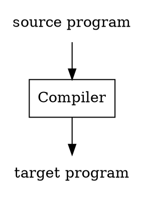
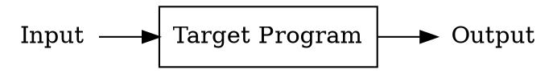
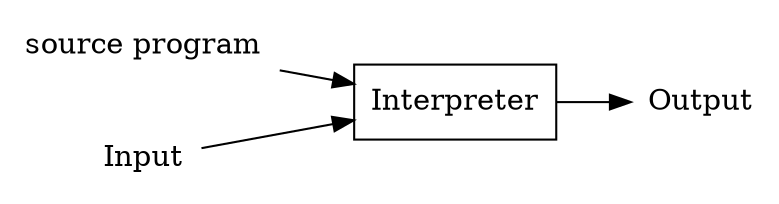
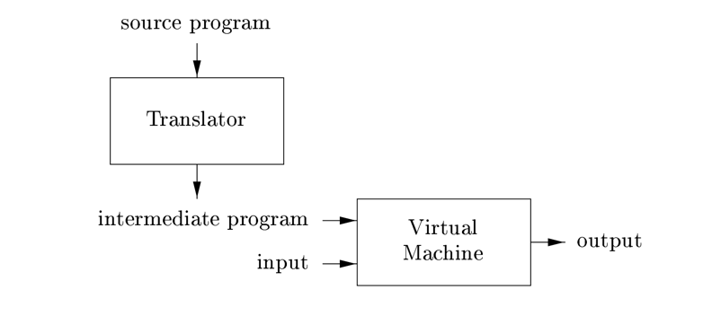
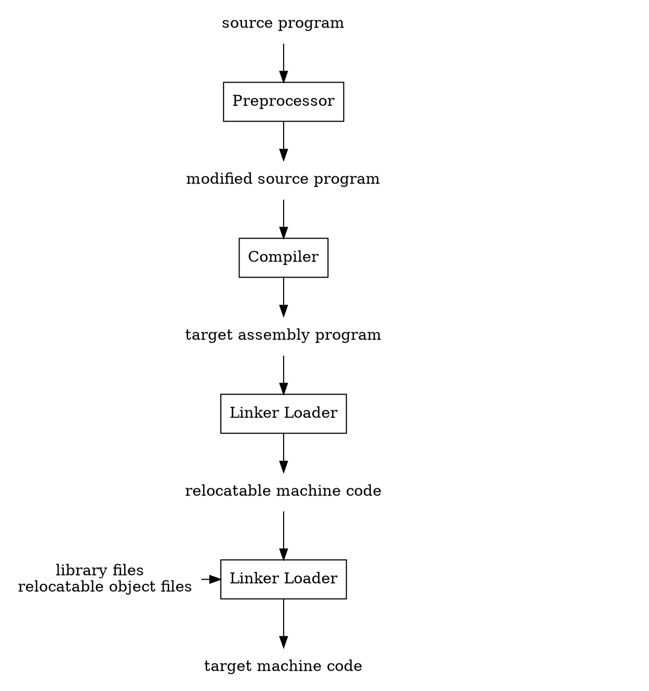

## Introduction

Programming languages are notations for describing computations to people and to machines.
The world as we know it depends on programming languages, because all the software running on all the computers was written in some programming language.
But, before a program can be run, it first must be translated into a form in which it can be executed by a computer.

The software systems that do this translation are called *compilers*.

Simply stated, a compiler is a program that can read a program in one language(the source language) and translate it into an equivalent program in another language(the target language) see Figure 1.
An important role of the compiler is to report any errors in the source program that it detects during the translation process.

Fig.1. A compiler.

If the target program is an executable machine-language program, it can then be called by the user to process inputs and produce outputs; see Figure 2.

Fig.2. Running the target program.

An interpreter is another common kind of language processor.
Instead of producing a target program as a translation, an interpreter appears to directly execute the operations specified in the source program on inputs supplied by the user,
as shown in Figure 3.

Fig.3. An interpreter.

The machine-language target program produced by a compiler is usually much faster than an interpreter at mapping inputs to outputs .
An interpreter, however, can usually give better error diagnostics than a compiler, because it executes the source program statement by statement.

Java language processors combine compilation and interpretation, as shown in Fig. 1.4.
A Java source program may First be compiled into an intermediate form called bytecodes.
The bytecodes are then interpreted by a virtual machine.
A benefit of this arrangement is that bytecodes compiled on one machine can be interpreted on another machine, perhaps across a network.
In order to achieve faster processing of inputs to outputs, some Java compilers, called just-in-time compilers,
translate the bytecodes into machine language immediately before they run the intermediate program to process the input.

Fig.4. A hybrid compiler.

In addition to a compiler, several other programs may be required to create an executable target program, as shown in Figure 5.
A source program may be divided into modules stored in separate files.
The task of collecting the source program is sometimes entrusted to a separate program, called a *preprocessor*.
The preprocessor may also expand shorthands, called macros, into source language statements.

The modified source program is then fed to a compiler.
The compiler may produce an assembly-language program as its output, because assembly language is easier to produce as output and is easier to debug.
The assembly language is then processed by a program called an *assembler* that produces relocatable machine code as its output.

Large programs are often compiled in pieces, so the relocatable machine code may have to be linked together with other relocatable object files and library files into the code that actually runs on the machine.
The *linker* resolves external memory addresses, where the code in one file may refer to a location in another file.
The *loader* then puts together all of the executable object files into memory for execution.

Fig.5. A language-processing system.

## IR

1. HIR
2. LIR
3. MIR

Basic Block

Control Flow Graph

## Links

## References

1. [Compilers: Principles, Techniques, and Tools]()
