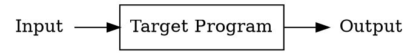
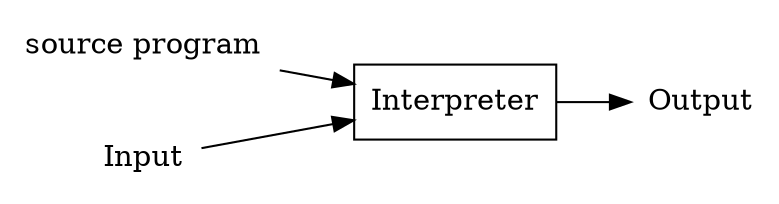
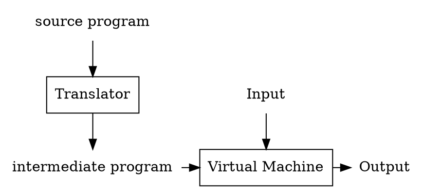
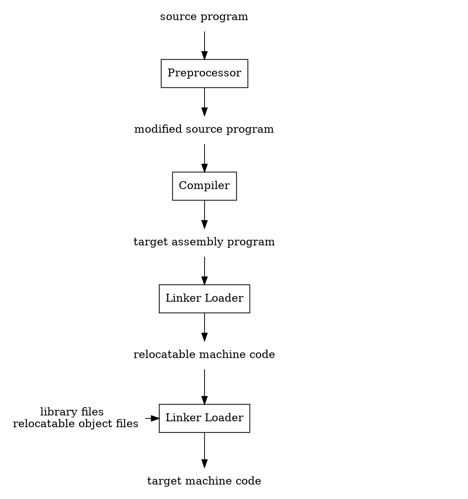
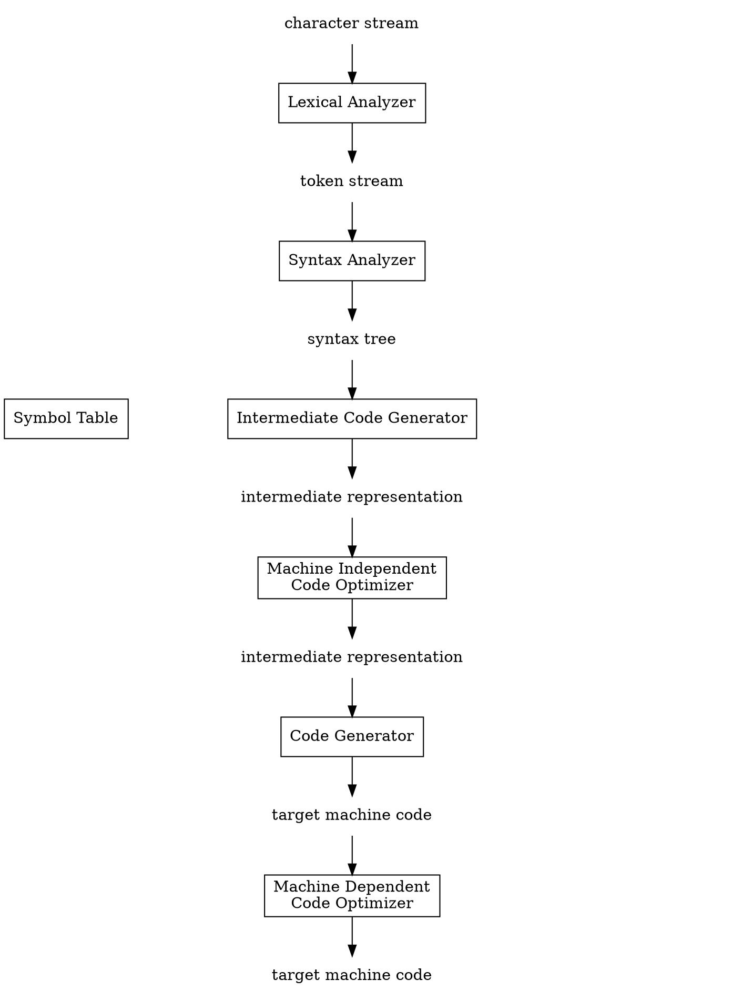

## Introduction

Programming languages are notations for describing computations to people and to machines.
The world as we know it depends on programming languages, because all the software running on all the computers was written in some programming language.
But, before a program can be run, it first must be translated into a form in which it can be executed by a computer.

The software systems that do this translation are called *compilers*.

## Language Processors

Simply stated, a compiler is a program that can read a program in one language(the source language) and translate it into an equivalent program in another language(the target language) see Figure 1.
An important role of the compiler is to report any errors in the source program that it detects during the translation process.

<div style="text-align: center;">

```dot
span
```

</div>

<p style="text-align: center;">
Fig.1. A compiler.
</p>

If the target program is an executable machine-language program, it can then be called by the user to process inputs and produce outputs; see Figure 2.

span



</div>

<p style="text-align: center;">
Fig.2. Running the target program.
</p>

An interpreter is another common kind of language processor.
Instead of producing a target program as a translation, an interpreter appears to directly execute the operations specified in the source program on inputs supplied by the user,
as shown in Figure 3.

<div style="text-align: center;">



</div>

<p style="text-align: center;">
Fig.3. An interpreter.
</p>

The machine-language target program produced by a compiler is usually much faster than an interpreter at mapping inputs to outputs .
An interpreter, however, can usually give better error diagnostics than a compiler, because it executes the source program statement by statement.

Java language processors combine compilation and interpretation, as shown in Figure 4.
A Java source program may First be compiled into an intermediate form called bytecodes.
The bytecodes are then interpreted by a virtual machine.
A benefit of this arrangement is that bytecodes compiled on one machine can be interpreted on another machine, perhaps across a network.
In order to achieve faster processing of inputs to outputs, some Java compilers, called just-in-time compilers,
translate the bytecodes into machine language immediately before they run the intermediate program to process the input.

<div style="text-align: center;">



</div>

<p style="text-align: center;">
Fig.4. A hybrid compiler.
</p>

In addition to a compiler, several other programs may be required to create an executable target program, as shown in Figure 5.
A source program may be divided into modules stored in separate files.
The task of collecting the source program is sometimes entrusted to a separate program, called a *preprocessor*.
The preprocessor may also expand shorthands, called macros, into source language statements.

The modified source program is then fed to a compiler.
The compiler may produce an assembly-language program as its output, because assembly language is easier to produce as output and is easier to debug.
The assembly language is then processed by a program called an *assembler* that produces relocatable machine code as its output.

Large programs are often compiled in pieces, so the relocatable machine code may have to be linked together with other relocatable object files and library files into the code that actually runs on the machine.
The *linker* resolves external memory addresses, where the code in one file may refer to a location in another file.
The *loader* then puts together all of the executable object files into memory for execution.

<div style="text-align: center;">



</div>

<p style="text-align: center;">
Fig.5. A language-processing system.
</p>

## The Structure of a Compiler

Up to this point we have treated a compiler as a single box that maps a source program into a semantically equivalent target program.
If we open up this box a little, we see that there are two parts to this mapping: analysis and synthesis.

The *analysis* part breaks up the source program into constituent pieces and imposes a grammatical structure on them.
It then uses this structure to create an intermediate representation of the source program.
If the analysis part detects that the source program is either syntactically ill formed or semantically unsound, then it must provide informative messages, so the user can take corrective action.
The analysis part also collects information about the source program and stores it in a data structure called a symbol table, which is passed along with the intermediate representation to the synthesis part.

The *synthesis* part constructs the desired target program from the intermediate representation and the information in the symbol table.
The analysis part is often called the front end of the compiler; the synthesis part is the back end.

If we examine the compilation process in more detail, we see that it operates
as a sequence of phases each of which transforms one representation of the source program to another.
A typical decomposition of a compiler into phases is shown in Figure 6.
In practice, several phases may be grouped together, and the intermediate representations between the grouped phases need not be constructed explicitly The symbol table, which stores information about the
entire source program, is used by all phases of the compiler.

<div style="text-align: center;">



</div>

<p style="text-align: center;">
Fig.6. Phases of a compiler.
</p>

Some compilers have a machine-independent optimization phase between the front end and the back end.
The purpose of this optimization phase is to perform transformations on the intermediate representation,
so that the back end can produce a better target program than it would have otherwise produced from an unoptimized intermediate representation.
Since optimization is optional, one or the other of the two optimization phases shown in Figure 6 may be missing.

### Lexical Analysis

The first phase of a compiler is called *lexical analysis* or *scanning*.
The lexical analyzer reads the stream of characters making up the source program and groups the characters into meaningful sequences called lexemes For each lexeme,
the lexical analyzer produces as output a token of the form that it passes on to the subsequent phase, syntax analysis.

```
<token-name attribute-value>
```

In the token, the first component token-name is an abstract symbol that is used during syntax analysis, and the second component attribute-value points to an entry in the symbol table for this token.
Information from the symbol-table entry is needed for semantic analysis and code generation.

### Syntax Analysis

The second phase of the compiler is *syntax analysis* or *parsing*.
The parser uses the first components of the tokens produced by the lexical analyzer to create a tree-like intermediate representation that depicts the grammatical structure of the token stream.
A typical representation is a syntax tree in which each interior node represents an operation and the children of the node represent the arguments of the operation.

### Semantic Analysis

The semantic analyzer uses the syntax tree and the information in the symbol table to check the source program for semantic consistency with the language definition.
It also gathers type information and saves it in either the syntax tree or the symbol table, for subsequent use during intermediate-code generation.

An important part of semantic analysis is *type checking*, where the compiler checks that each operator has matching operands.
For example, many programming language definitions require an array index to be an integer; the compiler must report an error if a oating-point number is used to index an array

The language specification may permit some type conversions called *coercions*.
For example, a binary arithmetic operator may be applied to either a pair of integers or to a pair of oating-point numbers.
If the operator is applied to a oating-point number and an integer, the compiler may convert or coerce the integer into a oating-point number.

### Intermediate Code Generation

In the process of translating a source program into target code, a compiler may construct one or more intermediate representations, which can haveavariety of forms.
Syntax trees are a form of intermediate representation; they are commonly used during syntax and semantic analysis.

After syntax and semantic analysis of the source program, many compilers generate an explicit low-level or machine-like intermediate representation, which we can think of as a program for an abstract machine.
This intermediate representation should have two important properties: it should be easy to produce and it should be easy to translate into the target machine.

### Code Optimization

The machine-independent code-optimization phase attempts to improve the intermediate code so that better target code will result.
Usually better means faster, but other objectives may be desired, such as shorter code, or target code that consumes less power.
For example, a straightforward algorithm generates the intermediate code (1.3), using an instruction for each operator in the tree representation that comes from the semantic analyzer.

A simple intermediate code generation algorithm followed by code optimization is a reasonable way to generate good target code.
The optimizer can deduce that the conversion of 60 from integer to oating point can be done once and for all at compile time, so the inttooat operation can be eliminated by replacing the integer 60 by the oating-point number 60.0.
Moreover, t3 is used only once to transmit its value to id1 so the optimizer can transform (1.3) into the shorter sequence.

```
t1 id3 60.0
id1 id2 t1 (1.4)
```

There is a great variation in the amount of code optimization dierent compilers perform.
In those that do the most, the so-called \optimizing compilers," a significant amount of time is spent on this phase.
There are simple optimizations that significantly improve the running time of the target program without slowing down compilation too much.

### Code Generation

The code generator takes as input an intermediate representation of the source program and maps it into the target language.
If the target language is machine code, registers or memory locations are selected for each of the variables used by the program.
Then, the intermediate instructions are translated into sequences of machine instructions that perform the same task.
A crucial aspect of code generation is the judicious assignment of registers to hold variables.

### Symbol-Table Management

An essential function of a compiler is to record the variable names used in the source program and collect information about various attributes of each name.
These attributes may provide information about the storage allocated for a name, its type, its scope (where in the program its value may be used), and in the case of procedure names,
such things as the number and types of its arguments, the method of passing each argument (for example, by value or by reference), and the type returned.

The symbol table is a data structure containing a record for each variable name, with elds for the attributes of the name.
The data structure should be designed to allow the compiler to nd the record for each name quickly and to store or retrieve data from that record quickly.

## Lexical Analysis

## Syntax Analysis

## Lexical Analysis

## Intermediate-Code Generation

1. HIR
2. LIR
3. MIR

Basic Block

## Run-Time Environments

A compiler must accurately implement the abstractions embodied in the sourcelanguage definition.
These abstractions typically include such as names, scopes, bindings, data types, operators, procedures, parameters, and ow-of-control constructs.
The compiler must cooperate with the operating system and other systems software to support these abstractions on the target machine.

To do so, the compiler creates and manages a run-time environment in which it assumes its target programs are being executed.
This environment deals with a variety of issues such as the layout and allocation of storage locations for the objects named in the source program, the mechanisms used by the target program to access variables,
the linkages between procedures, the mechanisms for passing parameters, and the interfaces to the operating system, input/output devices, and other programs.

### Storage Organization

From the perspective of the compiler writer, the executing target program runs in its own logical address space in which each program value has a location.
The management and organization of this logical address space is shared between the compiler, operating system, and target machine.
The operating system maps the logical addresses into physical addresses, which are usually spread throughout memory.

Control Flow Graph

## Instruction-Level Parallelism

## Links

## References

1. [Compilers: Principles, Techniques, and Tools]()
