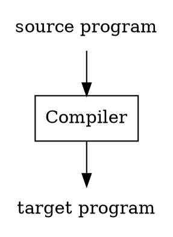
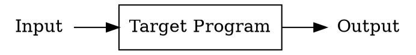
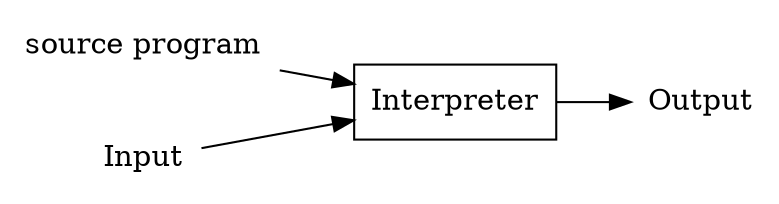
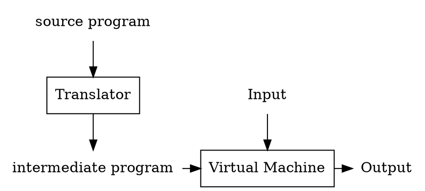
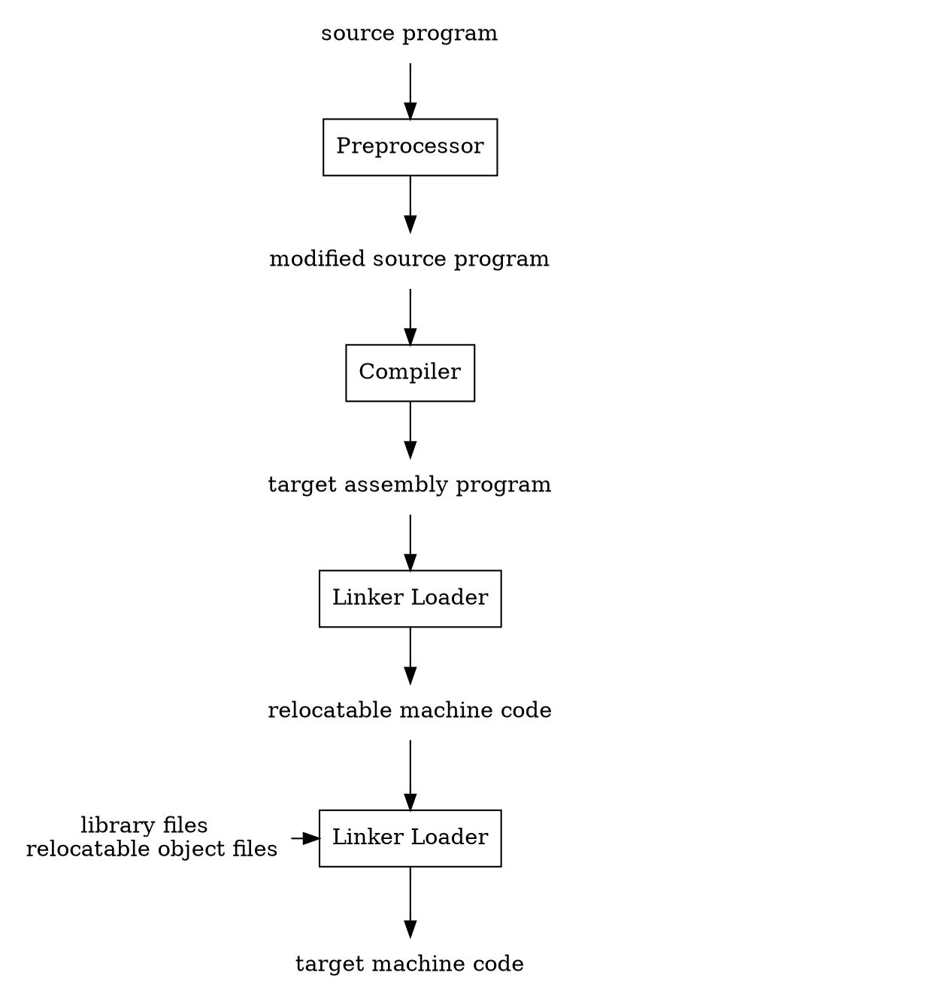
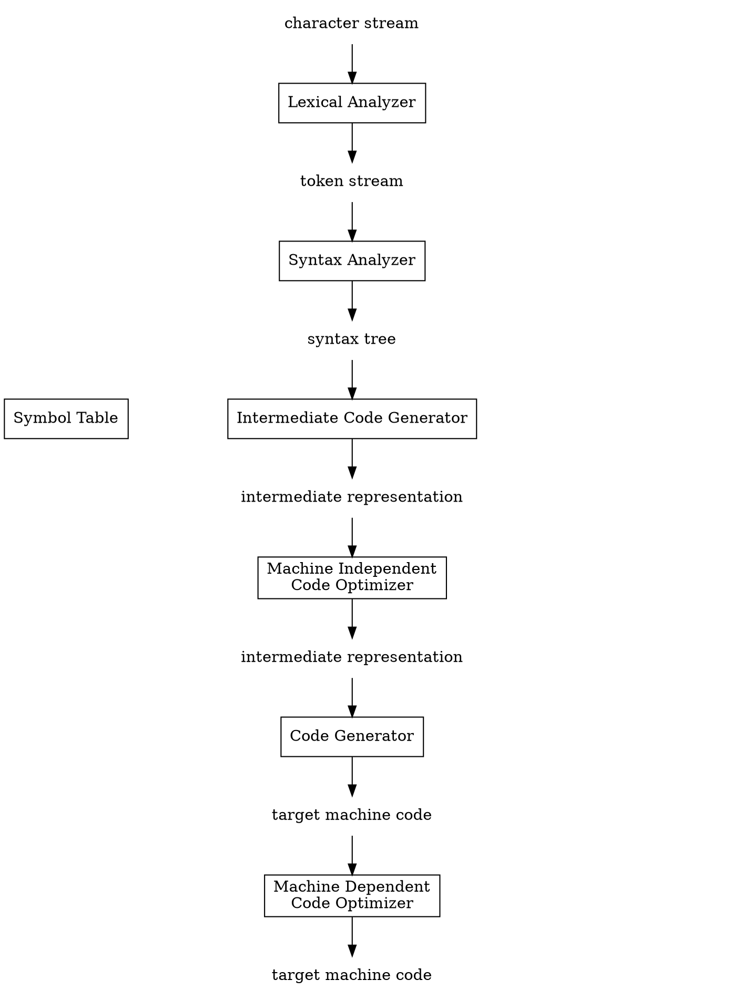

## Introduction

编程语言是向人类和机器描述计算的符号系统。
我们所知的世界依赖于编程语言，因为所有计算机上运行的所有软件都是用某种编程语言编写的。
但是，在程序运行之前，必须将其翻译成计算机可以执行的形式。

执行此翻译的软件系统称为*编译器*。

## Language Processors

简单地说，编译器是一种程序，可以读取一种语言（源语言）的程序，并将其翻译成另一种语言（目标语言）的等价程序，见图 1。
编译器的一个重要角色是报告在翻译过程中检测到的源程序中的任何错误。

<div style="text-align: center;">


```dot
digraph g{
    source[label="source program", shape=none]
    Compiler[label="Compiler", shape=box]
    target[label="target program", shape=none]
    source->Compiler->target
}
```

</div>

<p style="text-align: center;">
Fig.1. A compiler.
</p>

如果目标程序是可执行的机器语言程序，用户就可以调用它来处理输入并产生输出，见图 2。

<div style="text-align: center;">


```dot
digraph g{
    rankdir="LR"
    Input[label="Input", shape=none]
    target[label="Target Program", shape=box]
    Output[label="Output", shape=none]
    Input->target->Output
}
```

</div>

<p style="text-align: center;">
Fig.2. Running the target program.
</p>

解释器是另一种常见的语言处理器。
解释器不生成目标程序作为翻译结果，而是直接执行源程序中指定的操作，对用户提供的输入进行处理，
如图 3 所示。

<div style="text-align: center;">


```dot
digraph g{
    rankdir="LR"
    source[label="source program", shape=none]
    Input[label="Input", shape=none]
    Interpreter[label="Interpreter", shape=box]
    Output[label="Output", shape=none]
    source->Interpreter
    Input->Interpreter
    Interpreter ->Output
}
```

</div>

<p style="text-align: center;">
Fig.3. An interpreter.
</p>

编译器产生的机器语言目标程序在将输入映射到输出时通常比解释器快得多。
然而，解释器通常比编译器提供更好的错误诊断，因为它逐条执行源程序语句。

Java 语言处理器结合了编译和解释，如图 4 所示。
Java 源程序首先被编译成一种称为字节码的中间形式。
然后虚拟机解释字节码。
这种安排的一个好处是，在一台机器上编译的字节码可以在另一台机器上解释，可能跨越网络。
为了更快速地将输入处理为输出，一些称为即时编译器的 Java 编译器在运行中间程序处理输入之前，将字节码翻译为机器语言。

<div style="text-align: center;">


```dot
digraph g{
    source[label="source program", shape=none]
    Translator[label="Translator", shape=box]
  
    IR[label="intermediate program", shape=none]
    VM[label="Virtual Machine", shape=box]
    Output[label="Output", shape=none]
    {rank="same";IR;VM;Output;}
  
    source->Translator->IR -> VM -> Output
    Input[label="Input", shape=none]
    Input -> VM
 
}
```

</div>

<p style="text-align: center;">
Fig.4. A hybrid compiler.
</p>

除了编译器，可能还需要其他几个程序来创建可执行的目标程序，如图 5 所示。
源程序可能被分成多个模块，存储在多个文件中。
收集源程序的任务有时委托给一个称为*预处理器*的单独程序。
预处理器还可以将简写形式（称为宏）扩展为源语言语句。

修改后的源程序然后输入给编译器。
编译器可能产生汇编语言程序作为输出，因为汇编语言更容易作为输出产生，也更容易调试。
汇编语言然后由称为*汇编器*的程序处理，输出可重定位的机器码。

大型程序通常分块编译，因此可重定位的机器码可能需要与其他可重定位目标文件和库文件链接在一起，形成在机器上实际运行的代码。
*链接器*解析外部内存地址（一个文件中的代码可能引用另一个文件中的位置）。
*加载器*然后将所有可执行目标文件组合到内存中以供执行。

<div style="text-align: center;">


```dot
digraph g{
    source[label="source program", shape=none]
    Preprocessor[label="Preprocessor", shape=box]
    modified[label="modified source program", shape=none]
    Compiler[label="Compiler", shape=box]
    assamble[label="target assembly program", shape=none]
    Assembler[label="Linker Loader", shape=box]
    relocate[label="relocatable machine code", shape=none]
    library[label="library files \n relocatable object files", shape=none]
    xx[label="library files \n relocatable object files", style="invis"]
    Linker[label="Linker Loader", shape=box]
    target[label="target machine code", shape=none]
    source-> Preprocessor -> modified -> Compiler -> assamble -> Assembler -> relocate -> Linker -> target
    library -> Linker
    Linker -> xx[ style="invis"]
    {rank="same";library;Linker;xx;}
}
```

</div>

<p style="text-align: center;">
Fig.5. A language-processing system.
</p>

## The Structure of a Compiler

到目前为止，我们将编译器视为一个将源程序映射到语义等价的目标程序的单一盒子。
如果打开这个盒子，我们会发现这个映射有两个部分：分析和综合。

*分析*部分将源程序分解为组成部分，并对其施加语法结构。
然后使用这种结构创建源程序的中间表示。
如果分析部分检测到源程序在语法上不正确或语义上不合理，则必须提供信息性消息，以便用户采取纠正措施。
分析部分还收集有关源程序的信息，并将其存储在称为符号表的数据结构中，该结构与中间表示一起传递给综合部分。

*综合*部分根据中间表示和符号表中的信息构建所需的目标程序。
分析部分通常称为编译器的前端；综合部分称为后端。

如果更详细地检查编译过程，我们会发现它作为一系列阶段运行，每个阶段将源程序的一种表示转换为另一种。
图 6 显示了编译器的典型阶段分解。
在实践中，多个阶段可能组合在一起，组合阶段之间的中间表示不需要显式构建。
存储整个源程序信息的符号表被编译器的所有阶段使用。

将源代码转换为机器码的过程涉及多个阶段或步骤，统称为编译器的阶段。编译器的典型阶段如下：


<div style="text-align: center;">


```dot
digraph g{
    character[label="character stream", shape=none]
    LA[label="Lexical Analyzer", shape=box]
    token[label="token stream", shape=none]
    SA[label="Syntax Analyzer", shape=box]
    syntax[label="syntax tree", shape=none]
    ICG[label="Intermediate Code Generator", shape=box]
    IR[label="intermediate representation", shape=none]
    MICO[label="Machine Independent\nCode Optimizer", shape=box]
    ir2[label="intermediate representation", shape=none]
    CG[label="Code Generator", shape=box]
    target[label="target machine code", shape=none]
    MDCO[label="Machine Dependent\nCode Optimizer", shape=box]
    target2[label="target machine code", shape=none]
    character-> LA -> token -> SA -> syntax -> ICG -> IR -> MICO -> ir2 -> CG -> target -> MDCO -> target2
  
    ST[label="Symbol Table", shape=box]
    xx[style="invis", shape=box]
    bb[style="invis", shape=box, label="xxxxx      xxxxxxxxx      xxx"]
    ST -> xx[style="invis"]
    xx -> ICG[style="invis"]
    {rank="same";ST;xx;ICG;bb;}
}
```

</div>

<p style="text-align: center;">
Fig.6. Phases of a compiler.
</p>

In summary, the phases of a compiler are: lexical analysis, syntax analysis, semantic analysis, intermediate code generation, optimization, and code generation.

Symbol Table – It is a data structure being used and maintained by the compiler, consisting of all the identifier’s names along with their types. It helps the compiler to function smoothly by finding the identifiers quickly.


一些编译器在前端和后端之间有一个机器无关的优化阶段。
这个优化阶段的目的是对中间表示执行转换，
以便后端能够生成比未优化的中间表示更好的目标程序。
由于优化是可选的，图 6 中显示的两个优化阶段中的一个或另一个可能不存在。

源程序的分析主要分为三个阶段：

- 线性分析 -
  涉及扫描阶段，其中字符流从左到右读取，然后分组为具有集体含义的各种 token。
- 层次分析 -
  在此分析阶段，根据集体含义，token 按层次分类到嵌套组中。
- 语义分析 -
  此阶段用于检查源程序的组成部分是否有意义。


### Lexical Analysis

编译器的第一个阶段称为*词法分析*或*扫描*。
词法分析器读取组成源程序的字符流，并将字符分组为有意义的序列，称为词素（lexeme）。
对于每个词素，词法分析器生成一个 token 形式的输出，传递给后续阶段——语法分析。

```
<token-name attribute-value>
```

在 token 中，第一个组件 token-name 是语法分析过程中使用的抽象符号，第二个组件 attribute-value 指向该 token 在符号表中的条目。
符号表条目中的信息在语义分析和代码生成中需要用到。

### Syntax Analysis

编译器的第二阶段是*语法分析*或*解析*。
解析器使用词法分析器生成的 token 的第一个组件来创建树状的中间表示，描绘 token 流的语法结构。
典型的表示是语法树，其中每个内部节点代表一个操作，节点的子节点代表该操作的参数。

### Semantic Analysis

语义分析器使用语法树和符号表中的信息来检查源程序与语言定义的语义一致性。
它还收集类型信息并将其保存在语法树或符号表中，供后续中间代码生成使用。

语义分析的一个重要部分是*类型检查*，编译器检查每个操作符是否有匹配的操作数。
例如，许多编程语言定义要求数组索引为整数；如果使用浮点数索引数组，编译器必须报告错误。

语言规范可能允许一些称为*强制转换*的类型转换。
例如，二元算术运算符可以应用于一对整数或一对浮点数。
如果该运算符应用于浮点数和整数，编译器可能会将整数转换或强制转换为浮点数。

### Intermediate Code Generation

在将源程序转换为目标代码的过程中，编译器可能构建一个或多个中间表示，这些表示可以有多种形式。
语法树是中间表示的一种形式；它们通常在语法和语义分析期间使用。

在对源程序进行语法和语义分析之后，许多编译器会生成显式的低级或类似机器的中间表示，我们可以将其视为抽象机器的程序。
这种中间表示应具有两个重要属性：容易生成，且容易翻译为目标机器代码。

### Code Optimization

机器无关的代码优化阶段试图改进中间代码，以产生更好的目标代码。
通常"更好"意味着更快，但也可能追求其他目标，如更短的代码或消耗更少电力的目标代码。
例如，直接在语义分析器的树表示上为每个操作符生成一条指令。

简单的中间代码生成算法后跟代码优化是生成好的目标代码的合理方式。
优化器可以推断出 60 从整数到浮点的转换可以在编译时一次性完成，因此可以通过将整数 60 替换为浮点数 60.0 来消除 int-to-float 操作。
此外，t3 仅用于将值传递给 id1，因此优化器可以将 (1.3) 转换为更短的序列。

不同编译器执行的代码优化程度差异很大。
在那些进行最多优化的编译器中（所谓的"优化编译器"），大量时间花在这个阶段。
有些简单的优化可以显著改善目标程序的运行时间，同时不会过多减慢编译速度。

### Code Generation

代码生成器将源程序的中间表示作为输入，并将其映射为目标语言。
如果目标语言是机器码，则为程序使用的每个变量选择寄存器或内存位置。
然后，中间指令被翻译为执行相同任务的机器指令序列。
代码生成的一个关键方面是合理分配寄存器来保存变量。

### Symbol-Table Management

编译器的一个基本功能是记录源程序中使用的变量名，并收集关于每个名称的各种属性信息。
这些属性可能提供关于为名称分配的存储、其类型、其作用域（程序中其值可以使用的位置），以及对于过程名而言，
如其参数的数量和类型、每个参数的传递方式（例如，按值或按引用）以及返回类型等信息。

符号表是一种数据结构，包含每个变量名的记录，其中包含该名称属性的字段。
该数据结构应设计为允许编译器快速找到每个名称的记录，并快速从该记录中存储或检索数据。

## 三段式编译器

传统编译器采用三段式设计


```
┏━━━━━━━━━━━┓     ┏━━━━━━━━━━━━━━━━━━━━━━━ Compiler ━━━━━━━━━━━━━━━━━━━━┓    ┏━━━━━━━━━━━┓
┃  source   ┃     ┃    ┏━━━━━━━━━━━┓ IR ┏━━━━━━━━━━━┓ IR ┏━━━━━━━━━━━┓  ┃    ┃  target   ┃
┃           ┣━━━━━╋━━━>┃ front end ┣━━━>┃ optimizer ┣━━━>┃ back end  ┣━━╋━━━>┃           ┃       
┃  program  ┃     ┃    ┗━━━━━━━━━━━┛    ┗━━━━━━━━━━━┛    ┗━━━━━━━━━━━┛  ┃    ┃  program  ┃
┗━━━━━━━━━━━┛     ┗━━━━━━━━━━━━━━━━━━━━━━━━━━━━━━━━━━━━━━━━━━━━━━━━━━━━━┛    ┗━━━━━━━━━━━┛
```

编译器前端 优化器 编译器后端

编译器的IR可能有多个 会进行多次优化 如识别冗余代码 识别内存逃逸等

## Lexical Analysis

## Syntax Analysis

## Lexical Analysis

## Intermediate-Code Generation

1. HIR
2. LIR
3. MIR

Basic Block

## Run-Time Environments

编译器必须准确实现源语言定义中体现的抽象。
这些抽象通常包括名称、作用域、绑定、数据类型、操作符、过程、参数和控制流构造等。
编译器必须与操作系统和其他系统软件协作，在目标机器上支持这些抽象。

为此，编译器创建并管理一个运行时环境，假定其目标程序在此环境中执行。
这个环境处理各种问题，如源程序中命名的对象的存储布局和分配、目标程序访问变量的机制、
过程之间的链接、参数传递机制，以及与操作系统、输入/输出设备和其他程序的接口。

### Storage Organization

从编译器编写者的角度来看，执行的目标程序在其自己的逻辑地址空间中运行，其中每个程序值都有一个位置。
此逻辑地址空间的管理和组织由编译器、操作系统和目标机器共同承担。
操作系统将逻辑地址映射到物理地址，物理地址通常分布在内存各处。

控制流图

## Instruction-Level Parallelism

指令级并行


## Compilers

GCC


LLVM = clang + lllvm


## Links

## References

1. [Compilers: Principles, Techniques, and Tools]()
