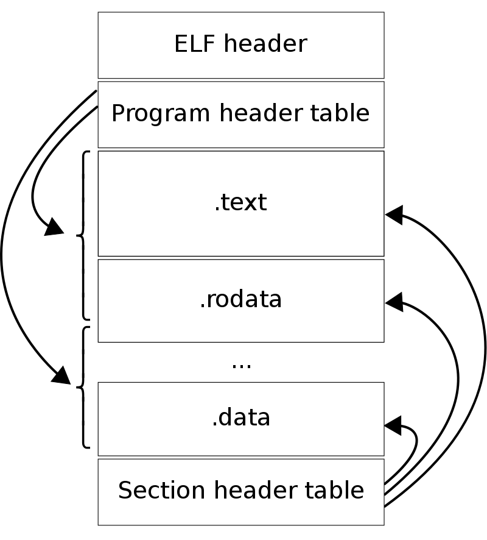

## Introduction


- 本地编译
- Cross Compile

交叉工具链命名规则
`[arch] [-os] [-9(gnu)eabi]`


## build


### Install

安装与alias


## Architecture


- Preprocessing
- Compilation
- Assembly
- Linking

```shell
gcc -E hello.c -o hello.i
gcc -S hello.i -o hello.s
gcc -c hello.s -o hello.o
```


## ELF


| ELF type           | Description | Examples        |
| ------------------ | ----------- | --------------- |
| Relocatable File   |             | .o, .obj        |
| Executable File    |             | /bin/bash, .exe |
| Shared Object File |             | .so, DLL        |
| Core Dump File     |             | core dump       |

use file

```shell
file /bin/ls
```

ELF is short for Executable and Linkable Format.
It’s a format used for storing binaries, libraries, and core dumps on disks in Linux and Unix-based systems.

The Executable and Linking Format was originally developed and published by UNIX System Laboratories (USL) as part of the Application Binary Interface (ABI).
The Tool Interface Standards committee(TIS) has selected the evolving ELF standard as a portable object file format that works on 32-bit Intel Architecture environments for a variety of operating systems.

The ELF standard is intended to streamline software development by providing developers with a set of binary interface definitions that extend across multiple operating environments.
This should reduce the number of different interface implementations, thereby reducing the need for recoding and recompiling code.

The ELF file is divided into two parts. The first part is the ELF header, while the second is the file data.

Further, the file data is made up of the Program header table, Section header table, and Data.

Particularly, the ELF header is always available in the ELF file, while the Section header table is important during link time to create an executable. On the other hand, the Program header table is useful during runtime to help load the executable into memory.


<div style="text-align: center;">



</div>

<p style="text-align: center;">
Fig.1. The Structure of the ELF File.
</p>


```shell
size xx.o

```

有许多工具可以完成对ELF文件的探索查看，如readelf、objdump

use objdump

```shell
objdump -s -d xx.o
```


```shell
readelf -a xx.o
```


You may use __builtin_expect to provide the compiler with branch prediction information.

`long __builtin_expect (long exp, long c)`


```c
#include <stdio.h>
#define likely(x) __builtin_expect(!!(x), 1)
#define unlikely(x)  __builtin_expect(!!(x), 0)

int main(int argc, char *argv[])
{
 int n;
 n = atoi(argv[1]);

 if (likely(n == 10)){
  n = n + 2;
 } else {
  n = n - 2;
 }
 printf("%d\n", n);
 return 0;
}
```
change 
```makefile
.PHONY: likely
likely:
	gcc -O2 likely.c -o likely
	objdump -d -S  likely > likely.txt

.PHONY: unlikely
unlikely:
	gcc -O2 unlikely.c -o unlikely
	objdump -d -S  unlikely > unlikely.txt
	
```

## Issues

Ubuntu 多个版本gcc

链接gcc


## References

1. [Executable and Linkable Format (ELF)](http://flint.cs.yale.edu/cs422/doc/ELF_Format.pdf)
2. [GNU Binutils](https://www.gnu.org/software/binutils/)
