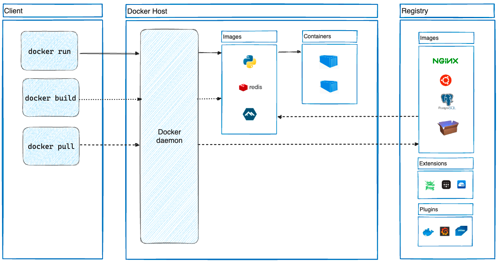

## Introduction

A Docker container image is a lightweight, standalone, executable package of software that includes everything needed to run an application: code, runtime, system tools, system libraries and settings.

**Container images** become containers at runtime and in the case of **Docker containers** – images become containers when they run on Docker Engine.<br/> 
Available for both Linux and Windows-based applications, containerized software will always run the same, regardless of the infrastructure.
Containers isolate software from its environment and ensure that it works uniformly despite differences for instance between development and staging.

Docker runs Linux software on most systems. 
Docker for Mac and Docker for Windows integrate with common virtual machine (VM) technology to create portability with Windows and macOS. 
But Docker can run native Windows applications on modern Windows server machines.

Docker containers that run on Docker Engine:

* **Standard:** Docker created the industry standard for containers, so they could be portable anywhere
* **Lightweight:** Containers share the machine’s OS system kernel and therefore do not require an OS per application, driving higher server efficiencies and reducing server and licensing costs
* **Secure:** Applications are safer in containers and Docker provides the strongest default isolation capabilities in the industry


### Moby

Moby is an open framework created by Docker to assemble specialized container systems without reinventing the wheel. 
It provides a “lego set” of dozens of standard components and a framework for assembling them into custom platforms.

> [A new upstream project to break up Docker into independent components](https://github.com/moby/moby/pull/32691)

## Installing Docker

Install Docker Desktop:

<!-- tabs:start -->

##### **Ubuntu**

```shell
# Add Docker's official GPG key:
sudo apt-get update
sudo apt-get install ca-certificates curl gnupg
sudo install -m 0755 -d /etc/apt/keyrings
curl -fsSL https://download.docker.com/linux/ubuntu/gpg | sudo gpg --dearmor -o /etc/apt/keyrings/docker.gpg
sudo chmod a+r /etc/apt/keyrings/docker.gpg

# Add the repository to Apt sources:
echo \
  "deb [arch="$(dpkg --print-architecture)" signed-by=/etc/apt/keyrings/docker.gpg] https://download.docker.com/linux/ubuntu \
  "$(. /etc/os-release && echo "$VERSION_CODENAME")" stable" | \
  sudo tee /etc/apt/sources.list.d/docker.list > /dev/null
sudo apt-get update

sudo apt-get install docker-ce docker-ce-cli containerd.io docker-buildx-plugin docker-compose-plugin
```

##### **Fedora**

```shell
# Uninstall old versions
sudo dnf remove docker \
                  docker-client \
                  docker-client-latest \
                  docker-common \
                  docker-latest \
                  docker-latest-logrotate \
                  docker-logrotate \
                  docker-selinux \
                  docker-engine-selinux \
                  docker-engine

sudo dnf -y install dnf-plugins-core
sudo dnf config-manager --add-repo https://download.docker.com/linux/fedora/docker-ce.repo

sudo dnf install docker-ce docker-ce-cli containerd.io docker-buildx-plugin docker-compose-plugin

sudo systemctl start docker
```

##### **Mac**

```shell
brew install --cask docker
brew install docker

#rm files if has installed docker
brew uninstall  docker
brew uninstall  --cask docker
rm -rf /usr/local/bin/docker
rm -rf /usr/local/etc/bash_completion.d/docker
rm -rf /usr/local/share/zsh/site-functions/_docker
rm -rf /usr/local/share/fish/vendor_completions.d/docker.fish
```

<!-- tabs:end -->

After installed done, open Docker Desktop and set registry-mirrors:

```json
{
  "registry-mirrors": [
    "https://docker.mirrors.ustc.edu.cn",
    "https://registry.docker-cn.com",
    "http://hub-mirror.c.163.com",
    "https://mirror.ccs.tencentyun.com"
  ]
}
```


Docker builds containers using 10 major system features.
The specific features are as follows:
- PID namespace— Process identifiers and capabilities
- UTS namespace— Host and domain name
- MNT namespace— Filesystem access and structure
- IPC namespace— Process communication over shared memory
- NET namespace— Network access and structure
- USR namespace— User names and identifiers
- chroot syscall—Controls the location of the filesystem root
- cgroups— Resource protection
- CAP drop— Operating system feature restrictions
- Security modules— Mandatory access controls
         

## Architecture


Docker uses a client-server architecture.
The Docker client talks to the Docker daemon, which does the heavy lifting of building, running, and distributing your Docker containers.
The Docker client and daemon can run on the same system, or you can connect a Docker client to a remote Docker daemon.
The Docker client and daemon communicate using a REST API, over UNIX sockets or a network interface.
Another Docker client is Docker Compose, that lets you work with applications consisting of a set of containers.


<div style="text-align: center;">



</div>

<p style="text-align: center;">
Fig.1. Docker architecture
</p>

- Docker client
- Docker daemon
- Registry
- Graph
- Driver
- libcontainer
- Container


By default all files created inside a container are stored on a writable container layer. 
This means that:

- The data doesn't persist when that container no longer exists, and it can be difficult to get the data out of the container if another process needs it.
- A container's writable layer is tightly coupled to the host machine where the container is running. You can't easily move the data somewhere else.
- Writing into a container's writable layer requires a storage driver to manage the filesystem. The storage driver provides a union filesystem, using the Linux kernel.
  This extra abstraction reduces performance as compared to using data volumes, which write directly to the host filesystem.

Docker has two options for containers to store files on the host machine, so that the files are persisted even after the container stops: volumes, and bind mounts.<br/>
Docker also supports containers storing files in-memory on the host machine. Such files are not persisted.


No matter which type of mount you choose to use, the data looks the same from within the container. 
It is exposed as either a directory or an individual file in the container's filesystem.

An easy way to visualize the difference among volumes, bind mounts, and `tmpfs` mounts is to think about where the data lives on the Docker host.

- Volumes are stored in a part of the host filesystem which is managed by Docker (/var/lib/docker/volumes/ on Linux).
  Non-Docker processes should not modify this part of the filesystem. Volumes are the best way to persist data in Docker.
- Bind mounts may be stored anywhere on the host system. They may even be important system files or directories. 
  Non-Docker processes on the Docker host or a Docker container can modify them at any time.
- `tmpfs` mounts are stored in the host system's memory only, and are never written to the host system's filesystem.


## Docker Images


## Dockerfile

A Docker Dockerfile contains a set of instructions for how to build a Docker image. 
The Docker build command executes the Dockerfile and builds a Docker image from it.

A Docker image typically consists of:

- A base Docker image on top of which to build your own Docker image.
- A set of tools and applications to be installed in the Docker image.
- A set of files to be copied into the Docker image (e.g configuration files).
- Possibly a network (TCP / UDP) port (or more) to be opened for traffic in the firewall. 
- etc.


A Dockerfile consists of a set of instructions. 
Each instruction consists of a command followed by arguments to that command, similar to command line executables.

A Docker image consists of layers. Each layer adds something to the final Docker image. Each layer is actually a separate Docker image.
The Dockerfile FROM command specifies the base image of your Docker images.


The CMD command specifies the command line command to execute when a Docker container is started up which is based on the Docker image built from this Dockerfile.

The Dockerfile COPY command copies one or more files from the Docker host (the computer building the Docker image from the Dockerfile) into the Docker image. 
The COPY command can copy both a file or a directory from the Docker host to the Docker image.

The Dockerfile ADD instruction works in the same way as the COPY instruction with a few minor differences:

- The ADD instruction can copy and extract TAR files from the Docker host to the Docker image.
- The ADD instruction can download files via HTTP and copy them into the Docker image.

The Dockerfile ENV command can set an environment variable inside the Docker image.


The Dockerfile RUN command can execute command line executables within the Docker image.

The Dockerfile EXPOSE instruction opens up network ports in the Docker container to the outside world.


The Dockerfile HEALTHCHECK instruction can execute a health check command line command at regular intervals, 
to monitor the health of the application running inside the Docker container.


## Docker Network

Libnetwork

drivers:
- bridge
- host
- null
- remote
- overlay


## Docker Volume


Issues

low Buffered IO isolation level

Sometimes Docker daemon accident

container killed because of OOM

Disable OOM_kill cause Host server down

## Links

- [Container](/docs/CS/Container/Container.md)
- [Kubernetes](/docs/CS/Container/K8s.md)

## References

1. [Moby](https://github.com/moby/moby)


