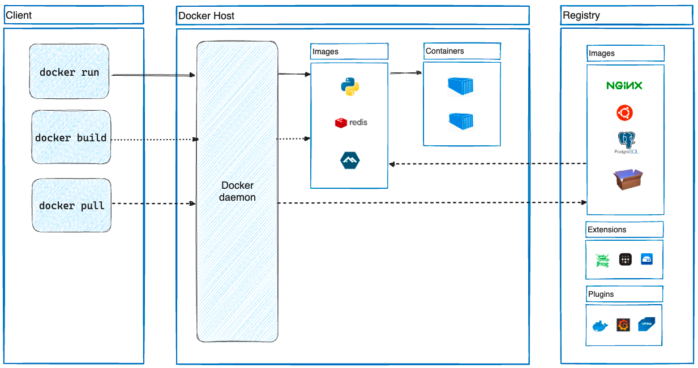

## Introduction


像Cloud Foundry这样的PaaS项目，最核心的组件就是一套应用的打包和分发机制
Docker项目与Cloud Foundry的容器在大部分功能和实现原理上都是一样的

使用PaaS，用户就必须为每种语言、每种框架，甚至每个版本的应用维护一个打好的包。
这个打包过程，没有任何章法可循，更麻烦的是，明明在本地运行得好好的应用，却需要做很多修改和配置工作才能在PaaS里运行起来。
而这些修改和配置，并没有什么经验可以借鉴，基本上得靠不断试错，直到你摸清楚了本地应用和远端PaaS匹配的“脾气”才能够搞定

Docker项目给PaaS世界带来的“降维打击”，其实是提供了一种非常便利的打包机制
这种机制直接打包了应用运行所需要的整个操作系统，从而保证了本地环境和云端环境的高度一致，避免了用户通过“试错”来匹配两种不同运行环境之间差异的痛苦过程

A Docker container image is a lightweight, standalone, executable package of software that includes everything needed to run an application: code, runtime, system tools, system libraries and settings.

> 2013年3月15日 PyCon Solomon Hykes的演讲 [The future of Linux Containers](https://www.youtube.com/watch?v=wW9CAH9nSLs)

**Container images** become containers at runtime and in the case of **Docker containers** – images become containers when they run on Docker Engine.<br/> 
Available for both Linux and Windows-based applications, containerized software will always run the same, regardless of the infrastructure.
Containers isolate software from its environment and ensure that it works uniformly despite differences for instance between development and staging.

Docker runs Linux software on most systems. 
Docker for Mac and Docker for Windows integrate with common virtual machine (VM) technology to create portability with Windows and macOS. 
But Docker can run native Windows applications on modern Windows server machines.

Docker containers that run on Docker Engine:

* **Standard:** Docker created the industry standard for containers, so they could be portable anywhere
* **Lightweight:** Containers share the machine’s OS system kernel and therefore do not require an OS per application, driving higher server efficiencies and reducing server and licensing costs
* **Secure:** Applications are safer in containers and Docker provides the strongest default isolation capabilities in the industry

> 目前使用Docker基本上有两个选择： **Docker Desktop** 和 **Docker Engine**
>
> - Docker Desktop是专门针对个人使用而设计的，支持Mac和Windows快速安装，具有直观的图形界面，还集成了许多周边工具，方便易用
> - Docker Engine则和Docker Desktop正好相反，完全免费，但只能在Linux上运行，只能使用命令行操作


### Moby

Moby is an open framework created by Docker to assemble specialized container systems without reinventing the wheel. 
It provides a “lego set” of dozens of standard components and a framework for assembling them into custom platforms.

> [A new upstream project to break up Docker into independent components](https://github.com/moby/moby/pull/32691)

## Installing Docker

Install Docker Desktop:

> IDEA和VS Code的Docker插件非常实用


<!-- tabs:start -->


##### **Ubuntu**

```shell
sudo apt install -y docker.io

```

##### **Fedora**

```shell
# Uninstall old versions
sudo dnf remove docker \
                  docker-client \
                  docker-client-latest \
                  docker-common \
                  docker-latest \
                  docker-latest-logrotate \
                  docker-logrotate \
                  docker-selinux \
                  docker-engine-selinux \
                  docker-engine

sudo dnf -y install dnf-plugins-core
sudo dnf config-manager --add-repo https://download.docker.com/linux/fedora/docker-ce.repo

sudo dnf install docker-ce docker-ce-cli containerd.io docker-buildx-plugin docker-compose-plugin

sudo systemctl start docker
```

##### **Mac**

ARM mac 最好使用ARM 版本 Homebrew来安装 Docker


```shell
brew install --cask docker
brew install docker

#rm files if has installed docker
brew uninstall  docker
brew uninstall  --cask docker
rm -rf /usr/local/bin/docker
rm -rf /usr/local/etc/bash_completion.d/docker
rm -rf /usr/local/share/zsh/site-functions/_docker
rm -rf /usr/local/share/fish/vendor_completions.d/docker.fish
```

<!-- tabs:end -->


第一个 `service docker start` 是启动Docker的后台服务，第二个 `usermod -aG` 是把当前的用户加入Docker的用户组。这是因为操作Docker必须要有root权限，而直接使用root用户不够安全， 加入Docker用户组是一个比较好的选择，这也是Docker官方推荐的做法

```plain
sudo service docker start         #启动docker服务
# 重新登录后生效
sudo usermod -aG docker ${USER}   #当前用户加入docker组
```

After installed done, open Docker Desktop and set registry-mirrors:

```json
{
  "registry-mirrors": [
    "https://docker.mirrors.ustc.edu.cn",
    "https://registry.docker-cn.com",
    "http://hub-mirror.c.163.com",
    "https://mirror.ccs.tencentyun.com"
  ]
}
```


Docker开启监听2375端口

<!-- tabs:start -->

##### **Mac**

```shell
docker run -it -d --name=socat \
  -p 2375:2375 \
  -v /var/run/docker.sock:/var/run/docker.sock \
  alpine/socat \
  TCP4-LISTEN:2375,fork,reuseaddr UNIX-CONNECT:/var/run/docker.sock
```

##### **Windows**

Windows较为复杂 `netstat -ano | findstr :2375` 发现没有进程
[Port 2375 not listening](https://github.com/docker/for-win/issues/3546)
```
netsh interface ipv4 show excludedportrange protocol=tcp
```


停止winnat服务
```shell
net stop winnat
dism.exe /Online /Disable-Feature:Microsoft-Hyper-V
```


```shell
netsh int ipv4 add excludedportrange protocol=tcp startport=2375 numberofports=1
```

reset后重启
```shell
netsh int ip reset
```

<!-- tabs:end -->


Docker builds containers using 10 major system features.
The specific features are as follows:
- PID namespace— Process identifiers and capabilities
- UTS namespace— Host and domain name
- MNT namespace— Filesystem access and structure
- IPC namespace— Process communication over shared memory
- NET namespace— Network access and structure
- USR namespace— User names and identifiers
- chroot syscall—Controls the location of the filesystem root
- cgroups— Resource protection
- CAP drop— Operating system feature restrictions
- Security modules— Mandatory access controls
         

## Under Hood
Docker 底层技术主要包括 Namespaces、Cgroups 和 rootfs，三者都是内核机制：

| 机制 | 作用 | 内核笔记 |
| :-- | :-- | :-- |
| Namespace | 访问隔离：PID/NET/MNT/IPC/UTS/USER 等视图隔离 | [namespace](/docs/CS/OS/Linux/namespace.md?id=容器如何使用-namespace) |
| Cgroups | 资源限额：CPU/MEM/IO 配额与记账 | [cgroup](/docs/CS/OS/Linux/cgroup.md?id=cpu-限制如何落到调度器) |
| rootfs（overlayfs） | 文件系统隔离与分层镜像 | [LXC](/docs/CS/OS/Linux/LXC.md)（clone + pivot_root 伪代码） |

一条 `docker run` 在内核层面发生的事：`clone(CLONE_NEW*)` 创建隔离视图 → `pivot_root` 切换 rootfs → 把 PID 写入 `cgroup.procs` 纳入限额 → `exec` 入口程序，完整路径见 [namespace 的容器组装](/docs/CS/OS/Linux/namespace.md?id=容器如何使用-namespace)。网络的 veth/bridge/NAT 细节见 [Docker 网络](/docs/CS/Container/Docker/net.md)。

## Architecture


Docker uses a client-server architecture.
The Docker client talks to the Docker daemon, which does the heavy lifting of building, running, and distributing your Docker containers.
The Docker client and daemon can run on the same system, or you can connect a Docker client to a remote Docker daemon.
The Docker client and daemon communicate using a REST API, over UNIX sockets or a network interface.
Another Docker client is Docker Compose, that lets you work with applications consisting of a set of containers.


<div style="text-align: center;">



</div>

<p style="text-align: center;">
Fig.1. Docker architecture
</p>

- Docker client
- Docker daemon
- Registry
- Graph
- Driver
- libcontainer
- Container


By default all files created inside a container are stored on a writable container layer. 
This means that:

- The data doesn't persist when that container no longer exists, and it can be difficult to get the data out of the container if another process needs it.
- A container's writable layer is tightly coupled to the host machine where the container is running. You can't easily move the data somewhere else.
- Writing into a container's writable layer requires a storage driver to manage the filesystem. The storage driver provides a union filesystem, using the Linux kernel.
  This extra abstraction reduces performance as compared to using data volumes, which write directly to the host filesystem.

Docker has two options for containers to store files on the host machine, so that the files are persisted even after the container stops: volumes, and bind mounts.<br/>
Docker also supports containers storing files in-memory on the host machine. Such files are not persisted.


No matter which type of mount you choose to use, the data looks the same from within the container. 
It is exposed as either a directory or an individual file in the container's filesystem.

An easy way to visualize the difference among volumes, bind mounts, and `tmpfs` mounts is to think about where the data lives on the Docker host.

- Volumes are stored in a part of the host filesystem which is managed by Docker (/var/lib/docker/volumes/ on Linux).
  Non-Docker processes should not modify this part of the filesystem. Volumes are the best way to persist data in Docker.
- Bind mounts may be stored anywhere on the host system. They may even be important system files or directories. 
  Non-Docker processes on the Docker host or a Docker container can modify them at any time.
- `tmpfs` mounts are stored in the host system's memory only, and are never written to the host system's filesystem.


## Docker Images


Docker 可以将 个基础系统锐像可以披多个锐像共用。这里可以代入调用和级存的概念。保证每个容器体积小，速度快，性能忧

采用了分层设计，启动容器后，镜像永远是只读属性。只不过在最上层加 层读写层（容器层），如果要对底层镜像的文件进行更改，读写层会复制 份镜像中的只读层进行写操作，这就是 Copy On Write

```shell
docker images

# 需要先修改为规范的镜像
docker tag name:version username/name:version

docker push username/name:version
```


## Dockerfile

A Docker Dockerfile contains a set of instructions for how to build a Docker image. 
The Docker build command executes the Dockerfile and builds a Docker image from it.

A Docker image typically consists of:

- A base Docker image on top of which to build your own Docker image.
- A set of tools and applications to be installed in the Docker image.
- A set of files to be copied into the Docker image (e.g configuration files).
- Possibly a network (TCP / UDP) port (or more) to be opened for traffic in the firewall. 
- etc.


A Dockerfile consists of a set of instructions. 
Each instruction consists of a command followed by arguments to that command, similar to command line executables.

A Docker image consists of layers. Each layer adds something to the final Docker image. Each layer is actually a separate Docker image.
The Dockerfile FROM command specifies the base image of your Docker images.


The CMD command specifies the command line command to execute when a Docker container is started up which is based on the Docker image built from this Dockerfile.

The Dockerfile COPY command copies one or more files from the Docker host (the computer building the Docker image from the Dockerfile) into the Docker image. 
The COPY command can copy both a file or a directory from the Docker host to the Docker image.

The Dockerfile ADD instruction works in the same way as the COPY instruction with a few minor differences:

- The ADD instruction can copy and extract TAR files from the Docker host to the Docker image.
- The ADD instruction can download files via HTTP and copy them into the Docker image.

The Dockerfile ENV command can set an environment variable inside the Docker image.


The Dockerfile RUN command can execute command line executables within the Docker image.

The Dockerfile EXPOSE instruction opens up network ports in the Docker container to the outside world.


The Dockerfile HEALTHCHECK instruction can execute a health check command line command at regular intervals, 
to monitor the health of the application running inside the Docker container.


## Docker Network

Libnetwork

drivers:
- bridge
- host
- null
- remote
- overlay


## Docker Volume

运行在由Linux Namespace和Cgroups构成的隔离环境里；而它运行所需要的各种文件，比如python，app.py，以及整个操作系统文件，则由多个联合挂载在一起的rootfs层提供。
这些rootfs层的最下层，是来自Docker镜像的只读层。
在只读层之上，是Docker自己添加的Init层，用来存放被临时修改过的/etc/hosts等文件。
而rootfs的最上层是一个可读写层，它以Copy-on-Write的方式存放任何对只读层的修改，容器声明的Volume的挂载点，也出现在这一层

Issues

low Buffered IO isolation level

Sometimes Docker daemon accident

container killed because of OOM

Disable OOM_kill cause Host server down


## Docker Compose


[Docker Compose](https://docs.docker.com/compose/)将所管理的容器分为三层， 分别是工程（project），服务（service）以及容器（containner）
docker-compose并没有解决负载均衡的问题。因此需要借助其他工具实现服务发现及负载均衡


每个目录下有且仅有一个docker-compose.yml文件用于描述Docker配置


## Tools

拿到一个已经跑起来的容器或一个现成的镜像，最常见的需求是"反推"出它是怎么启动的、Dockerfile 长什么样。

### runlike

[runlike](https://github.com/lavie/runlike) 用于从**运行中的容器**反推出它的 `docker run` 命令。
容器往往不是手工起的，而是 compose、k8s 或前任同事留下的，没有启动命令时，runlike 可以还原出端口、挂载、环境变量、restart 策略等完整启动参数。

```shell
# 用完即弃的别名方式，无需安装
alias runlike="docker run --rm -v /var/run/docker.sock:/var/run/docker.sock \
  assaflavie/runlike"

# 或 pip 安装
pip install runlike
```

```shell
# 输出可直接复制执行的 docker run 命令
runlike <container_name_or_id>

# -p 将参数拆成多行，可读性更好
runlike -p <container_name_or_id>

# 只输出命令而不执行
runlike --no-name <container>
```

本质上 runlike 就是把 `docker inspect` 的输出（HostConfig、Config、NetworkSettings 等）解析后拼装回 CLI 参数，因此它只能还原 Docker 记录下来的信息，无法还原构建时的意图。

### Whaler / Dedockify

[Whaler](https://github.com/P3GLEG/Whaler) 是一个 Go 程序，用于从**镜像**中还原 Dockerfile 及各层信息。
镜像的每一层 metadata 里本来就带有 `created_by`（对应构建时执行的指令），Whaler 把这些元数据逆序解析，重建出 Dockerfile。它还会顺带：

- 搜索各层中潜在的密钥/敏感文件（审计利器）
- 提取 `ADD`/`COPY` 指令加入的文件
- 展示端口、运行用户、环境变量等信息

```shell
# 最简单的方式：以镜像方式运行，会自动 pull 目标镜像
alias whaler="docker run -t --rm -v /var/run/docker.sock:/var/run/docker.sock:ro \
  pegleg/whaler"

whaler -sV=1.36 nginx:latest

# -x 将各层导出到当前目录，-v 打印全部细节
whaler -x -v nginx:latest

# 源码编译
go get -u github.com/P3GLEG/Whaler && cd $GOPATH/src/github.com/P3GLEG/Whaler && go build .
```

输出示例（还原出的 Dockerfile + 层信息）：

```plain
FROM ubuntu:20.04
RUN apt-get update && apt-get install -y nginx
COPY ./index.html /var/www/html/
ENV NGINX_PORT=80
EXPOSE 80
```

配套的还有 [Dedockify](https://github.com/mrhavens/Dedockify)，思路相同、更轻量：

```shell
docker run --rm \
  -v /var/run/docker.sock:/var/run/docker.sock \
  mrhavens/dedockify <image_id>
```

注意还原出的 Dockerfile 是"近似等价"的：`MAINTAINER`/`LABEL` 可能丢失，构建期用到的 build args、build context 里的临时文件无法恢复。它适合审计、学习和排查"这个镜像里到底装了什么"，而不是官方构建脚本。

### 对比

| 工具 | 作用对象 | 输出 | 典型场景 |
| ---- | -------- | ---- | -------- |
| runlike | 运行中的容器 | `docker run` 命令 | 容器迁移、重建 compose 配置 |
| Whaler / Dedockify | 镜像 | Dockerfile + 层信息 | 镜像审计、学习他人构建方式 |
| docker history | 镜像 | 层指令列表（`--no-trunc` 可看全） | 快速粗查，不想拉工具时 |
| dive | 镜像 | 交互式逐层浏览文件系统 | 分析镜像体积、寻找可精简层 |

`docker history --no-trunc <image>` 是不依赖任何第三方工具的"穷人版 whaler"，先看它往往就够了。

### dfimage

[dfimage](https://github.com/stephensek/rancher-tools/tree/master/dfimage) 也是同类工具，从镜像元数据反推 Dockerfile：

```shell
alias dfimage="docker run --rm -v /var/run/docker.sock:/var/run/docker.sock \
  alpine/dfimage"
dfimage -sV=1.36 <image>
```

### 安全提示

这类工具都以 `docker.sock` 挂载运行，等价于给容器 root 级权限访问 Docker daemon，只应在可信环境使用。反推出来的配置里可能包含敏感的环境变量和密钥，注意脱敏。

## Tuning

Docker 性能高度依赖于 Linux 内核的 cgroup v2、调度器和 I/O 子系统

### 瓶颈识别

#### 指标收集

现代 Docker 环境需要全面的监控栈，包括用于实时指标的 `docker stats`、用于详细容器分析的 cAdvisor、用于深度系统内省的 sysdig、用于底层分析的 perf 以及用于历史趋势分析的 sar


#### 瓶颈定位

性能调查遵循结构化工作流程。从症状观察开始：当应用变慢时，检查延迟直方图和百分位分布，以了解延迟的严重程度和分布。

层级诊断从应用分析器（如 Go 的 pprof 或 Java 的 VisualVM）开始，经过 `docker inspect HostConfig` 检查容器资源限制，到利用 `top` 或 `htop` 进行主机级分析，最终到使用 `perf record` 生成火焰图的内核级调查。

主机级分析与内核级分析之间隔着一层换算：`top` 里那个吃 CPU 的进程要先把自己的容器身份认出来（`docker inspect -f '{{.State.Pid}}'` 正向查，`cat /proc/PID/cgroup` 反向查），之后 `perf -p`、读取容器的 `/proc/PID/{stack,fd,mountinfo}`、`nsenter` 才有着落，见 [容器定位](/docs/CS/Container/locate.md)。


### 优化

#### CPU优化

CPU 优化平衡利用率与公平性，确保容器获得适当的处理时间，同时避免邻居无法被调度

#### 内存优化

内存调优防止泄漏，减少碎片化，并避免令人畏惧的 OOM（Out-of-Memory）杀手（即内存耗尽时终止进程）


#### I/O优化

I/O 常常成为无声的瓶颈，尽管 CPU 和内存充足，却限制了吞吐量。通过存储驱动程序选择和队列调优解锁性能。


## Links

- [Container](/docs/CS/Container/Container.md)
- [Kubernetes](/docs/CS/Container/k8s/K8s.md)
- [Docker 网络](/docs/CS/Container/Docker/net.md)
- [containerd 运行时](/docs/CS/Container/k8s/containerd.md)
- [容器定位](/docs/CS/Container/locate.md)
- [容器知识地图](/docs/CS/Container/README.md)

## References

1. [Moby](https://github.com/moby/moby)


