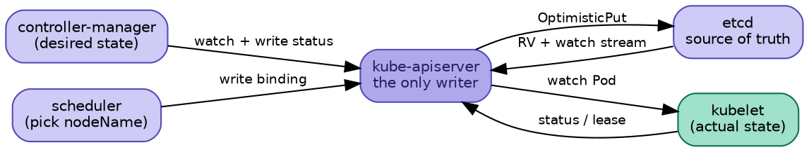

## Introduction

Kubernetes 的架构一旦抓住一句话就清楚了：它不是一个"编排系统"，而是**一个带乐观并发的版本化键值存储，外加一组围绕它独立运行的自治控制回路**。

这个判断不是措辞游戏，它直接决定了后面所有链路的形状。三条推论：

| 推论 | 直接后果 |
|---|---|
| 没有编排中心，只有 apiserver 这一个写入口 | 所有写请求集中在一处，可审计、可限流、可准入拦截 |
| 组件之间**从不直接通信**，只通过 apiserver 上的对象间接协作 | 组件可随意重启、升级、多版本并存，互不影响 |
| 每个组件的运行逻辑都是"读最新状态 → 对比期望 → 补差异 → 写回" | 天然幂等，丢事件、重复事件、崩溃重启都不致命 |

第三条最能说明问题：整个系统里没有任何一处 RPC 是"scheduler 通知 kubelet 去起这个 Pod"。scheduler 只往 etcd 里写一个 `nodeName` 字段，kubelet 通过 watch 自己发现，自己执行。两个组件之间没有连接。

本文负责把四条主链路串起来，各链路的实现细节分述于组件笔记：[apiserver](/docs/CS/Container/k8s/apiserver.md)、[client-go](/docs/CS/Container/k8s/client-go.md)、[scheduler](/docs/CS/Container/k8s/scheduler.md)、[kubelet](/docs/CS/Container/k8s/kubelet.md)。

> [!NOTE]
> 本文全部结论基于 **Kubernetes v1.36.4** 源码实读（tag `v1.36.4`），各处已标注文件路径与行号。凡与旧版本认知冲突的地方，统一收在文末「v1.36 反直觉清单」。

## 全局视图

四条链路在同一个模型上跑，这也是为什么它们能被独立替换：



组件分工：

| 组件 | 在链路中的角色 | 有状态吗 |
|---|---|---|
| kube-apiserver | **唯一**能写 etcd 的组件，三层 delegation | 无状态 |
| etcd | 事实来源，提供 RV 与 watch 语义 | 强一致 |
| kube-controller-manager | 跑若干独立的 reconcile 回路 | 无状态 |
| kube-scheduler | 唯一职责：给 Pod 挑一个 nodeName | 无状态 |
| kubelet | 数据面执行者，本身也是一组 mini controller | 有本地状态 |

kubelet 的"mini controller"身份值得单独说一句：它内部并行跑着 status manager、probe manager、eviction manager、volume manager 等独立循环，只是这些循环不写 etcd，而是写本地状态和节点的 status 子资源。

## 链路一：写请求到账

用户提交一个 Pod，从 HTTP 到 etcd 落盘要穿过两道结构：外层三层 delegation 套娃，内层 filter chain。

三层 delegation 是 aggregator → kubeAPIServer → apiextensions，每层各自跑一遍完整 filter chain，找不到路由就往下抛。CRD 请求在 apiextensions 层被吃掉，内置资源在 kubeAPIServer 层被吃掉。

filter chain 的精确顺序在 `DefaultBuildHandlerChain`（`staging/src/k8s.io/apiserver/pkg/server/config.go:1036`）。注意代码是**自内向外包裹**（行号递增 = 越包越外），所以实际执行顺序是行号**由大到小**。九个主要 filter 如下：

| 执行序 | Filter | 源码行 | 要点 |
|---|---|---|---|
| 1 | `WithAuditInit` | `:1116` | 最外层，保证连 panic 的请求也能留下审计记录 |
| 2 | `WithPanicRecovery` | `:1115` | 必须在 RequestInfo 之外才能拿到 ns/resource 去写日志 |
| 3 | `WithRequestInfo` | `:1112` | 解析出 verb / namespace / resource，后续一切依赖它 |
| 4 | `WithRequestReceivedTimestamp` | `:1113` | 记录收到时刻，后面的 deadline 以它为起点算 |
| 5 | `WithRequestDeadline` / `WithTimeoutForNonLongRunningRequests` | `:1090` `:1088` | 长跑请求（watch/exec）豁免超时 |
| 6 | `WithAuthentication` | `:1077` | 失败即走 `failedHandler`，返回 401，不再往下走 |
| 7 | `WithAudit` | `:1064` | 请求级三段审计（Request / Response / Panic） |
| 8 | `WithConstrainedImpersonation` | `:1056` | 1.36 起默认开启；关闭时回落到旧的 `WithImpersonation` |
| 9 | `WithPriorityAndFairness` | `:1048` | 默认开启；`FlowControl == nil` 时降级为 `WithMaxInFlightLimit` |
| 10 | `WithAuthorization` | `:1040` | **最内层**，RBAC / Node / Webhook 联合判定 |

> [!TIP]
> **APF 排在 Authorization 之前**，这是很多人记反的地方。原因很直接：给请求分流只需要 user（来自认证）和 RequestInfo（来自上一层），完全不需要鉴权结果。换句话说，被拒的请求也曾经占用过队列席位——这是刻意的，否则任意用户都能用非法请求挤爆排队。

进入 REST handler 之后是 `decode → managedFields 合并 → mutating admission → BeforeCreate 策略校验 → 存储`。落库由 etcd 事务完成，详见 [apiserver](/docs/CS/Container/k8s/apiserver.md?id=写链路)。

这条链路还有一个**反向的孪生兄弟**：删除。它走的入口相同、admission 相同、最后同样落到 etcd 事务，但语义完全不对称——一次 `DELETE` 通常不删任何东西，只写一个 `metadata.deletionTimestamp`，然后由 GC controller 与 kubelet 接力完成。完整过程见 [删除与级联](/docs/CS/Container/k8s/Deletion.md)。

## 链路二：控制回路

这条链路是整套架构的灵魂，**所有控制器都跑同一个模板**：

```
apiserver watch/list
  → Reflector        ListAndWatch，WatchList 优先于分页 LIST
  → 队列             v1.36 起默认为 RealFIFO
  → Indexer 缓存     本地全量副本，带 namespace 索引
  → handler          回调业务代码
  → WorkQueue        dirty + processing 双集合
  → reconcile worker 读最新状态 → 对比 → 写回 apiserver（闭环）
```

关键在于**队列里只有 `namespace/name` 这样一个字符串，没有对象**。worker 取出 key 之后必须重新从 lister 读最新状态。这一点决定了整套系统的容错性质：丢失中间事件完全无害，只要最后一次事件被看到，系统就收敛到正确状态。

详细的去重机制、RealFIFO 与 DeltaFIFO 的差异、resync 的真实语义见 [client-go](/docs/CS/Container/k8s/client-go.md?id=informer)。

## 链路三：调度

scheduler 的职责窄到只有一件事：给 Pod 挑一个 nodeName。主循环严格单 goroutine 串行 `ScheduleOne`，但绑定步骤被丢到独立 goroutine：

```
NextPod(activeQ.pop)  →  scheduleOnePod
                           frameworkForPod     按 spec.schedulerName 选 profile
                           UpdateSnapshot      固定本轮调度视图
                           Filter             PreFilter → Filter（并行 16）→ Extender
                           PostFilter         无可行节点时才走抢占
                           AssumePod          先占位
                           Reserve / Permit
                      →  go runBindingCycle   异步绑定
```

**为什么必须先 AssumePod 再异步绑定**：`assume` 立刻把 Pod 写进 scheduler cache，下一个调度周期马上就能看到这份资源占用，从而使主循环不被绑定请求的 API 往返串行阻塞。绑定失败时再显式回收。

调度框架把这条流程切成 PreEnqueue / PreFilter / Filter / PostFilter / PreScore / Score / Reserve / Permit / PreBind / Bind / PostBind 若干扩展点的有序执行，每个环节都可以用插件替换或增删。完整清单与默认值见 [scheduler](/docs/CS/Container/k8s/scheduler.md)。

## 链路四：kubelet 落地

kubelet 侧先把三种来源（apiserver watch、静态文件、HTTP）收拢成一条容量为 50 的事件通道，再由 `syncLoopIteration` 分发。它的 select 实际有**七路**，不止常见的四路：

| 事件源 | 处理 |
|---|---|
| configCh | HandlePodAdditions / Updates / Removes / Reconcile |
| plegCh | 容器生命周期事件 → HandlePodSyncs |
| syncCh | 1s 定时全量兜底 |
| liveness / readiness / startup manager | probe 失败直接触发对应 sync |
| containerManager.Updates() | 设备分配变更 |
| housekeepingCh | 2s 清理孤儿 |

每个 Pod 有独立的 podWorker，状态机是三态而非两态：`SyncPod → TerminatingPod → TerminatedPod`。真正的容器操作在 `SyncPod` 九步里，从 `computePodActions` 算出差异开始，到 `CreateContainer` / `StartContainer` 结束。详见 [kubelet](/docs/CS/Container/k8s/kubelet.md)。

> [!NOTE]
> v1.36 的一个重要变化：**CNI 已完全移出 kubelet 代码树**。kubelet 不再直接调用任何 CNI 插件，只能通过 CRI 回报的 `NetworkReady` condition 间接感知网络是否就绪。同理，dockershim 已彻底不存在，只剩 CRI 一条运行路径。

## 三个贯穿全局的契约

### ResourceVersion：乐观并发的载体

RV 就是 **etcd 事务响应的 `Header.Revision`**，不是什么独立维护的版本计数器。这个事实解释了很多现象：

- 更新走 `GuaranteedUpdate` + `Compare(ModRevision == 原值)`，冲突即重试，**全程无锁**
- watch 是 RV 单调序列上的流式回放，断连后可从任意历史 RV 续接
- `""` 和 `"0"` 都表示"从当前最新开始"

因为没有锁，` kubectl apply ` 并发冲突时看到的是 409 Conflict 而不是谁阻塞了谁——这是刻意的取舍：无死锁、低延迟，代价是热对象上会有重试开销。

还有一个容易忽略的分工：RV 由 etcd 分配，但**读请求大多不经过 etcd**。apiserver 为每个 group-resource 维护一个 watch cache，把 N 个 informer 收敛成 1 条到 etcd 的 watch，客户端的 List/Watch 优先由内存服务。缓存与 RV 的交互细节——滑动窗口、`410 Gone` 的两种来源、`504` 与 `429` 的分野、流式 list——见 [watch cache 读路径底座](/docs/CS/Container/k8s/WatchCache.md)。

### OwnerReference：所有权驱动的级联

对象之间不是靠调用关系关联，而是靠 `metadata.ownerReferences` 声明所有权。GC controller 据此做级联删除，`Finalizer` 则提供删除前的钩子，让外部系统有机会清理集群外的资源。

后果是：删除一个对象等于删除一棵树，而这棵树的形状是**运行时动态计算**出来的，不是硬编码的。这也解释了为什么删除有时会卡住——某个 finalizer 没被清掉。

### 水平触发：为什么崩溃不可怕

控制器只接受"当前应该是什么样"，不处理"刚才发生了什么"：

| | 边沿触发 | 水平触发（K8s） |
|---|---|---|
| 丢事件 | 状态永久错误 | 下次 resync 自动纠正 |
| 重复事件 | 可能重复执行副作用 | reconcile 幂等，无害 |
| 组件重启 | 需要外部补偿或重放 | 从缓存重建，自动收敛 |

代价是调试困难：错误不再能靠单次事件路径复现，得理解整个收敛过程。

## 设计取舍

| 取舍 | 换来什么 | 付出什么 |
|---|---|---|
| 一切过 apiserver，组件不互调 | 强解耦、可独立升级、天然可审计 | 写放大，etcd 成为唯一瓶颈 |
| 用 etcd RV 做乐观并发而非分布式锁 | 无锁、无死锁、延迟可预测 | 热 key 上冲突重试开销大 |
| 本地缓存 + 队列而非直连 etcd | 保护 apiserver，读请求不落盘 | 存在最终一致窗口 |
| 水平触发 + 幂等 reconcile | 崩溃与丢消息自愈 | 时序难以精确复现，调试成本高 |
| spec / status 分离 | 期望与实际各自独立写入、便于权限分离 | 两者间的短暂不一致必须被容忍 |

上面四条链路讲的都是"把东西建出来"。反向的两条——**删除**与**驱逐**——复杂度更高，因为它们是**有状态**的：中间态会被持久化，任何一个参与者掉线都会留下残局。这两条单独成篇：[删除与级联](/docs/CS/Container/k8s/Deletion.md)、[驱逐](/docs/CS/Container/k8s/Eviction.md)。

## v1.36 反直觉清单

以下每条都回源码核实过，且与常见认知相反。这几条最容易在版本升级时踩坑：

| 常见认知 | v1.36.4 实际 |
|---|---|
| Informer 用 DeltaFIFO | 默认已换成 **RealFIFO**，`InOrderInformers` 为 GA 且 LockToDefault，不可关闭；同一 key 的事件不再合并 |
| WatchListClient 默认关闭 | 自 1.35 起默认 true（仍为 Beta） |
| Evented PLEG 已经 GA | 仍是 Alpha、默认 false，feature spec 从 1.26 起没再改过 |
| scheduler cache 有 30s TTL 清 assumed pod | TTL 已移除，改为显式 ForgetPod + snapshot 兜底 |
| Bind 已改用 Update | 仍走 legacy `binding` 子资源 |
| leader election 可以用 configmap 锁 | 只剩 `leases`，其余锁类型直接返回 error |
| cAdvisor 已被移除 | 仍在依赖中，只是降级为 CRI stats 的 fallback |
| `pkg/scheduler/internal/` | 已重命名为 `pkg/scheduler/backend/` |

## Links

- [K8s](/docs/CS/Container/k8s/K8s.md)
- [apiserver](/docs/CS/Container/k8s/apiserver.md)
- [client-go](/docs/CS/Container/k8s/client-go.md)
- [scheduler](/docs/CS/Container/k8s/scheduler.md)
- [kubelet](/docs/CS/Container/k8s/kubelet.md)
- [controller-manager](/docs/CS/Container/k8s/controller-manager.md)

## References

1. [Kubernetes v1.36.4 source](https://github.com/kubernetes/kubernetes/tree/v1.36.4)
2. [Kubernetes API Conventions](https://github.com/kubernetes/community/blob/master/contributors/devel/sig-architecture/api-conventions.md)
3. [Controllers](https://kubernetes.io/docs/concepts/architecture/controller/)
4. [Cluster Architecture](https://kubernetes.io/docs/concepts/architecture/)
