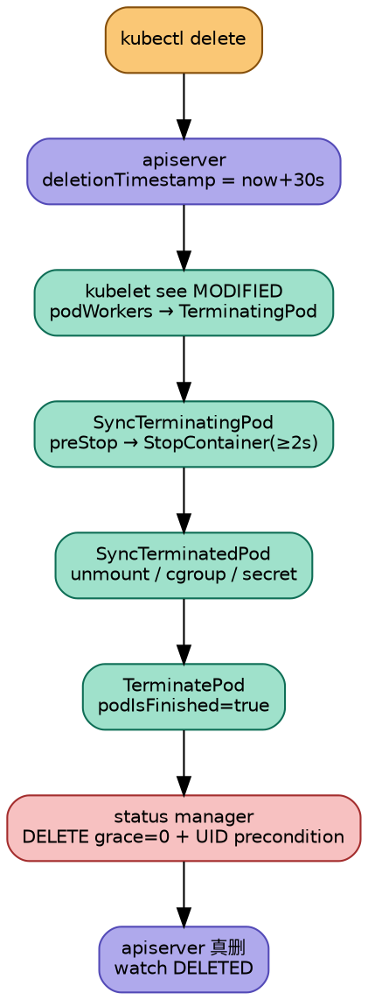

## Introduction

创建 Pod 的那条链路看起来像一个动作：`POST` 一下，Pod 就有了。删除却完全不是——**`DELETE` 一次调用并不会让对象消失**，它只是把对象推入一个"待删除"的中间态，然后由 apiserver、垃圾回收控制器、kubelet 三方接力，才能让对象真正从 etcd 里消失。

这就是为什么 Kubernetes 里"删"总是比"建"慢、也总是更容易出问题。一个 Pod 卡在 `Terminating` 可能卡在三个阶段中的任意一个：

| 卡在哪 | 谁负责解锁 | 典型症状 |
|---|---|---|
| apiserver 已打时间戳，等 finalizer 清空 | 某个外部控制器 / admission | 对象上有 `metadata.finalizers` 非空 |
| 等 GC 删完依赖 | garbage collector | 对象上有 `foregroundDeletion` |
| 等 kubelet 停容器 | kubelet + CRI runtime | Pod 已从 inode 分配但容器还在跑 |

理解这条链路的关键，是先接受一个反直觉的事实：**Kubernetes 的删除是一个"标记 + 通知 + 等待确认"的分布式协议，而不是一个操作**。对象上的 `metadata.deletionTimestamp` 是那个标记，`metadata.finalizers` 是等待名单，而真正执行删除动作的永远是最后一个摘掉 finalizer 的组件。

> [!NOTE]
> 本文全部结论基于 **Kubernetes v1.36.4** 源码实读，各处标注文件路径与行号。v1.36 有几处推翻常见认知的改动，统一收在文末「v1.36 反直觉清单」。

本文分成三段讲：apiserver 如何把删除变成两阶段（对应 [apiserver](/docs/CS/Container/k8s/apiserver.md) 的写链路镜像）、GC 如何级联（对应 [垃圾回收](/docs/CS/Container/k8s/GC.md) 的运行时行为）、kubelet 如何真正停容器并触发最终删除（对应 [kubelet](/docs/CS/Container/k8s/kubelet.md) 的三态机）。

## 第一段：apiserver 把一次删除拆成两次写

### BeforeDelete：删除语义的核心

删除的整个判定逻辑压缩在一个函数里 —— `rest.BeforeDelete`（`staging/src/k8s.io/apiserver/pkg/registry/rest/delete.go:75`）。它在一个 DELETE 请求里**被调用两次**：

1. `store.go:1159` —— 作用在刚从 etcd 读出来的对象上
2. `store.go:1066` —— 作用在 `GuaranteedUpdate` 事务内重新读的对象上

第二次是必要的：第一次读完之后对象可能已经被别人改过了，必须在事务里重判。

判定入口是 `delete.go:108`：

```go
if objectMeta.GetDeletionTimestamp() != nil {   // 已经在删除中 → 走二次删除分支
```

这个 `!= nil` 把一次 DELETE 分成截然不同的两条路径。

### 第一次删除：只打时间戳，不删东西

```go
// staging/src/k8s.io/apiserver/pkg/registry/rest/delete.go:163-165
requestedDeletionTimestamp := metav1.NewTime(metav1Now().Add(time.Second * time.Duration(*options.GracePeriodSeconds)))
objectMeta.SetDeletionTimestamp(&requestedDeletionTimestamp)
objectMeta.SetDeletionGracePeriodSeconds(options.GracePeriodSeconds)
```

注意这里 **`deletionTimestamp` 是 `now + grace`，一个未来时间**，不是 `now`。这个细节后面会咬人。同时 `generation` 会 +1（`delete.go:170-172`）。

写完这些，函数返回 `(graceful=true, gracefulPending=false)`。`Store.Delete` 据此走 `updateForGracefulDeletionAndFinalizers`（`store.go:1182-1183`），最终：

- 有 finalizer → 落一次 UPDATE，对象继续存在于 etcd
- 无 finalizer 且 grace > 0 → 落一次 UPDATE，**不删**，返回 HTTP **200 + 完整 Pod 对象**
- 无 finalizer 且 grace == 0 → 真的删

所以对有 grace period 的 Pod 做 DELETE，拿到的不是 202 也不是 204，而是 **200 加一个带着 `deletionTimestamp` 的 Pod**。这是因为 Pod 的 store 配了 `ReturnDeletedObject: true`（`pkg/registry/core/pod/storage/storage.go:89`）。

> [!TIP]
> **202 Accepted 的条件极窄**：只有 `!wasDeleted && OrphanDependents != nil && !*OrphanDependents` 才返回 202（`handlers/delete.go:188-190`）。日常删 Pod 不会遇到。

### 第二次删除：宽限期被压成 0

当对象已经有 `deletionTimestamp` 时，`BeforeDelete` 走另一套逻辑。最重要的一条规则在 `delete.go:123-128`：**grace period 只能缩短，不能延长**。

```go
if period >= *objectMeta.GetDeletionGracePeriodSeconds() {
    return false, true, nil    // 想延长 → 拒绝，标记 gracefulPending
}
```

想缩短时，代码会把 `deletionTimestamp` 回退旧的 grace、再前进新的 grace（`delete.go:131-133`）。如果算出来的新时间戳已经早于当前时刻，就直接取 `now`（`delete.go:135-136`）。

这条路径就是 kubelet 在容器停完之后发 `DELETE?gracePeriodSeconds=0` 时走的：宽限期被压成 0，`store.go:1114` 判定 `lastGraceful == 0`，于是走到 `store.go:1215` 真正调 etcd 删除。

### Finalizer：唯一的删除 veto 权

finalizer 的权威定义注释在 `staging/src/k8s.io/apimachinery/pkg/apis/meta/v1/types.go:263-279`，三句话讲清了全部语义：

- **对象从 registry 消失前，`finalizers` 必须为空**
- **一旦 `deletionTimestamp` 非空，这个列表只能被删项，不能被加项**
- **处理顺序不保证**（注释明确说强制顺序会引入死锁风险）

第二条由代码强制：`api/validation/objectmeta.go:315-318` 在 `deletionTimestamp != nil` 时调 `ValidateNoNewFinalizers`，试图新增就返回 403 Forbidden。

至于 `deletionTimestamp` 本身是不可变字段，有两道防线：`rest/update.go:139-145` 强制回填旧值，`objectmeta.go:334-335` 额外做 immutability 校验。也就是说**没有任何 API 调用能把一个对象从"正在删除"改回正常态**——删除一旦开始就不可逆。

那么，谁有资格摘 finalizer？答案是**任何对该对象有 update 权限且知道该 finalizer 名字的客户端**。Kubernetes 没有 central finalizer registry，这只是个约定：`protect.foo.io/my-lock` 意味着"我还没处理完，别删"。

### 最终删除的触发点在 UPDATE 里

这一点很容易看漏：当最后一个 finalizer 被摘掉时的那次 `PUT`，会顺带把对象删掉。

判定在 `store.go:573-594` 的 `ShouldDeleteDuringUpdate`：

```go
if len(newMeta.GetFinalizers()) > 0 { return false }                    // 还有 finalizer
if oldMeta.GetDeletionTimestamp() == nil { return false }               // 没在删除流程里
return oldMeta.GetDeletionGracePeriodSeconds() == nil || *oldMeta.GetDeletionGracePeriodSeconds() == 0
```

满足条件时 `Store.Update` 会返回哨兵错误 `errEmptiedFinalizers`（`store.go:882`），随后转调 `deleteWithoutFinalizers`（`store.go:596-620`）。

**所以"清空 finalizers 的那个 PUT 请求"就是真正的删除请求**，这在排查时很有用：如果你用 `kubectl patch` 摘掉最后一个 finalizer，那个 patch 请求本身就已经把对象删掉了，返回给你的 200 里带着最终对象。

## 第二段：GC 如何处理级联

### 谁写了 `foregroundDeletion`——不是 GC

这是本条链路最大的认知纠正。**GC controller 从不添加 finalizer**，整个包里只有 `removeFinalizer`（`pkg/controller/garbagecollector/operations.go:104`）。

写 finalizer 的是 apiserver，在 `Store.Delete` 里：

```
store.go:1180   deletionFinalizersForGarbageCollection(...)
store.go:1182   若 needsUpdate → updateForGracefulDeletionAndFinalizers
store.go:1082   事务内重新计算 finalizer 列表
store.go:1083   existingAccessor.SetFinalizers(newFinalizers)
```

具体增删逻辑在 `store.go:984-1013`：先把 `orphan` 和 `foregroundDeletion` 从列表里剔掉，再按 `DeleteOptions` 决定要不要重新加回来。

所以当你执行 `kubectl delete deployment foo --cascade=foreground` 时，发生了这些事：

1. apiserver 的 `shouldDeleteDependents`（`store.go:954-955`）看见 `PropagationPolicy == Foreground` → true
2. apiserver 写 `foregroundDeletion` finalizer + `deletionTimestamp`
3. GC informer 看到这个变化，才开始干活
4. 依赖删完后，**GC 摘掉 finalizer**（`garbagecollector.go:668`），apiserver 随即真删

GC 在这里扮演的角色是"先把活干完，再去销假"，而不是"锁住对象"。

### 三种级联模式

| 模式 | finalizer | 处理入口 | 位置 |
|---|---|---|---|
| **Background**（默认） | 无 | `attemptToDeleteItem` 的 default 分支 | `garbagecollector.go:646-648` |
| **Foreground** | `foregroundDeletion` | `processDeletingDependentsItem` | `garbagecollector.go:664-680` |
| **Orphan** | `orphan` | `orphanDependents` | `garbagecollector.go:683-719` |

**Background 才是默认**。`store.go:646-648` 的 default 分支明确 fallthrough 到 `DeletePropagationBackground`，而绝大多数资源（含 Pod）压根没实现 `DefaultGarbageCollectionPolicy`，零值就是 background。

值得记的例外（这些资源的策略是写死在 strategy 里的）：

| 资源 | 默认策略 | 位置 |
|---|---|---|
| Deployment / ReplicaSet / StatefulSet / DaemonSet | `DeleteDependents`（即 background） | 各自的 `strategy.go` |
| **ReplicationController（core/v1）** | **OrphanDependents** | `pkg/registry/core/replicationcontroller/strategy.go:61-72` |
| **Job（batch/v1）** | **OrphanDependents** | `pkg/registry/batch/job/strategy.go:62` |
| Event | `Unsupported`（永不加 GC finalizer） | `pkg/registry/core/event/strategy.go:47-49` |

> [!WARNING]
> `rest.DeleteDependents` 这个常量名有严重的历史包袱——它**不是** foreground。`store.go:973` 的默认返回值 false 意味着"不加 finalizer，直接删，让 GC 后台收尾"，即 background。别被名字骗了。

### Foreground 到底"阻塞"在哪里

常见说法是"foreground deletion 会阻塞直到依赖删除完成"。这个描述会引起误解——**没有任何 goroutine 卡住**。

看 `processDeletingDependentsItem`（`garbagecollector.go:664-680`）：

```go
blockingDependents := item.blockingDependents()
if len(blockingDependents) == 0 {
    return gc.removeFinalizer(logger, item, metav1.FinalizerDeleteDependents)
}
for _, dep := range blockingDependents {
    if !dep.isDeletingDependents() { gc.attemptToDelete.Add(dep) }
}
return nil    // ← 立即返回，worker 马上处理下一个 item
```

它把 blocking dependents 丢回队列就返回了。worker 不被占用。

真正的"阻塞"是**对象在 etcd 里的状态**：`deletionTimestamp + finalizers=[foregroundDeletion]`。因为 apiserver 拒绝在 finalizer 非空时删除对象，这个对象就停在原地。

解除条件是 `blockingDependents()` 返回空，而它（`graph.go:191-202`）**只统计 `BlockOwnerDeletion=true` 的依赖**。这是关键：

> **只有 `blockOwnerDeletion: true` 的 ownerReference 才会阻塞 foreground 级联删除。** 那些"软引用"（比如很多 controller 只标记 `blockOwnerDeletion: false`）不计入。

解除靠事件重入：依赖被真删 → informer 推 delete event → `graph_builder.go:870-878` 检查这些依赖的 owner 是否处于 `isDeletingDependents()` → 是则把 owner 重新塞进 `attemptToDelete` → owner 再次执行 `processDeletingDependentsItem`，这次 blocking 为空 → 摘 finalizer。

**这个顺序天然是自底向上的叶子优先**，没有任何拓扑排序代码。

### 图是怎么维护的

GC 最特别的一点是它的 informer 是**动态跟随 discovery 变化**的：

- `GarbageCollector.Sync`（`garbagecollector.go:190-264`）每 30s（`ResourceResyncTime` 与 `syncPeriod` 均来自 `cmd/kube-controller-manager/app/core.go:735-748`）调 `GetDeletableResources` 重新发现资源类型
- 有变化就重建 informer：`graph_builder.go:242-288` 的 `syncMonitors` 做增量 diff，新增的建 monitor，消失的 `close(monitor.stopCh)`
- 这是 GC 能自动处理 CRD 创建的新资源类型的原因——不需要重启

另一个反直觉点：**GC 的 informer 完全关闭了 resync**，`ResourceResyncTime = 0`（`garbagecollector.go:51`）。它只依赖 watch 事件，不做周期性全量重放。

图本身是**单线程写**的：`processGraphChanges` 是唯一写入者（`graph.go:58-62` 注释），但读是并发的，所以 `uidToNode` 被包成了带 `RWMutex` 的 `concurrentUIDToNode`（`graph.go:239-261`）。

worker 并发数默认 20（`garbagecollector/config/v1alpha1/defaults.go:38-40` 的 `ConcurrentGCSyncs`），但 `Run` 里每个 i 起**两个** goroutine（`garbagecollector.go:172-179`），所以实际是 40 个。

## 第三段：kubelet 如何真正停掉容器

### 三态机，而不是两态

kubelet 侧的每个 Pod 都有一个专属 goroutine `podWorkerLoop`（`pod_workers.go:1245`），它的状态是**从时间戳推导**出来的（`pod_workers.go:436-444`）：

```go
func (s *podSyncStatus) WorkType() PodWorkerState {
	if s.IsTerminated()           { return TerminatedPod }   // terminatedAt 非零
	if s.IsTerminationRequested() { return TerminatingPod }  // terminatingAt 非零
	return SyncPod
}
```

三个状态常量在 `pod_workers.go:110-119`。

**一旦进入 Terminating，就再也回不到 SyncPod**。`UpdatePod` 对此有专门的防护（`pod_workers.go:921-939`）：任何外部传入的 update，无论原本是什么 `UpdateType`，都会被降级成"kill 请求 + 状态覆盖"。理由写在注释里——`syncPod` 一旦重跑就可能把容器重新拉起来，所以终止必须不可逆。

还有一处设计很妙：`pendingUpdate` 会被**直接覆盖**而不是排队（`pod_workers.go:989`），配合 buffered=1 的 channel 和非阻塞 send（`:995-998`）。中间态允许丢失，但 `terminatingAt`、`gracePeriod` 这类单调量存在 `podSyncStatus` 里而非随 update 走。这是刻意选择的语义：**worker 看到的永远是最新意图，不必重放历史**。

### SyncPod 已经不处理删除了

这一点相对旧版本是架构性变化。`pkg/kubelet/kuberuntime/kuberuntime_manager.go` **全文没有 `DeletionTimestamp`**——旧版本里"`SyncPod` 检测到 `DeletionTimestamp` 就走 kill 分支"的设计已经完全移除，职责移交给了 `podWorkerLoop` 的 `WorkType == TerminatingPod` 分支。

现在的执行顺序（`Kubelet.SyncTerminatingPod`，`kubelet.go:2289`）：

1. `SetPodStatus` —— 先上报"正在终止"（`:2315`）
2. `probeManager.StopLivenessAndStartup` —— **在 kill 之前**停探针，避免探针触发重启（`:2323`）
3. `kl.killPod` —— 真正杀容器（`:2326`）
4. 复查 CRI：重新 `GetPod` 看还有没有 running container，有就报 `"CRI violation"`（`:2385`）
5. `UnprepareDynamicResources` —— 释放 DRA 资源，必须在容器停后、写终态前（`:2391-2395`）
6. 再次 `SetPodStatus` 写带 exit code 的终态（`:2402`）

### preStop 是占用宽限期的

`kuberuntime_container.go:894-896`：

```go
if containerSpec.Lifecycle != nil && containerSpec.Lifecycle.PreStop != nil && gracePeriod > 0 {
    gracePeriod = gracePeriod - m.executePreStopHook(ctx, pod, containerID, containerSpec, gracePeriod)
}
```

preStop 拿到的就是当前剩余的 grace period 作为上限，跑完之后**从预算里扣除实际耗时**，剩下的才给 `StopContainer`。

hook 超时就发生在 `executePreStopHook` 内部（`kuberuntime_container.go:799-806`）的一个 `select` 里。注意 hook 超时后**那个 goroutine 不会被 kill**，`killContainer` 也不等它——它会自己跑完，但已经不影响容器下线。

### 容器是并行杀的，且 force delete 不是立即的

`kuberuntime_container.go:944-957`：所有容器各起一个 goroutine，共享同一份完整 grace period。所以 Pod 的整体耗时 ≈ max(单个容器)，不是累加。唯一例外是有 sidecar（restartable init container）时会启用串行化（`:936-943`）。

关于 force delete（`--grace-period=0 --force`），有**三道逐级夹取**：

| 层 | 位置 | 效果 |
|---|---|---|
| apiserver 负数归一化 | `pod/strategy.go:188-190` | `-1 → 1` |
| podWorkers 下界 | `pod_workers.go:1036-1038` | `<1 → 1` |
| killContainer 地板 | `kuberuntime_container.go:906-907` | `<2 → **2**` |

最后一道的常量 `minimumGracePeriodInSeconds = 2`（`kuberuntime_manager.go:84`）。

> [!WARNING]
> **`--force` 不等于立即 SIGKILL。** 容器至少拿到 2 秒。而且因为 grace 被夹成 1 而非 0，`gracePeriod > 0` 的条件仍成立，**preStop hook 依然会执行**（上限约 1 秒）。这与"force delete 跳过一切钩子"的流行说法直接冲突。

至于 SIGTERM → SIGKILL 这两个信号，kubelet **只传一个 timeout 给 runtime**（`kuberuntime_container.go:913` 的 `StopContainer(ctx, id, gracePeriod)`），信号级别的转换完全由 containerd / CRI-O 内部完成。

### grace period 到底谁优先

`pod_workers.go:1009-1040` 的 `calculateEffectiveGracePeriod`，优先级顺序：

1. **`pod.DeletionGracePeriodSeconds`**（apiserver 写的）——注释原文 `this value is bedrock truth - the apiserver owns telling us this value`
2. kubelet 内部 override（eviction / nodeshutdown）
3. `pod.Spec.TerminationGracePeriodSeconds` —— 兜底
4. 下界永远是 1

而且它取的是**历史最小值**：一旦 `status.gracePeriod` 被设定，只有更小的值能替换。这保证了 "grace period can only decrease"。

同样的优先级也体现在 `setTerminationGracePeriod`（`kuberuntime_container.go:1440-1459`），`pod.DeletionGracePeriodSeconds != nil` 时直接 return。

顺带一提：**v1.36 仍然不支持 per-container termination grace period**。`Container` struct 里只有 `StopSignal`，没有 `TerminationGracePeriodSeconds`。唯一更细粒度的是**探针级**（`Probe.TerminationGracePeriodSeconds`），且只在 `reasonStartupProbe` / `reasonLivenessProbe` 时生效，不影响正常删除路径。

### 第二次 DELETE 在 status manager，不在 podWorkers

这是本次核实最意外的一条。网上常见说法是 "podWorkers 发第二次删除"，**在 v1.36 不成立** —— `pod_workers.go` 和 `kubelet_pods.go` 里都搜不到删除调用。

真实位置是 `pkg/kubelet/status/status_manager.go:1210-1223`：

```go
if m.canBeDeleted(logger, pod, status.status, status.podIsFinished) {
    deleteOptions := metav1.DeleteOptions{
        GracePeriodSeconds: new(int64),                              // ← 指向 0 的指针
        Preconditions: metav1.NewUIDPreconditions(string(pod.UID)),  // ← 防止误删同名新 Pod
    }
    err = m.kubeClient.CoreV1().Pods(pod.Namespace).Delete(ctx, pod.Name, deleteOptions)
}
```

注意写法是 `new(int64)` 而不是 `ptr.To[int64](0)`——这也是按字面 pattern 搜不到的原因之一。

触发条件 `canBeDeleted`（`:1241-1258`）要求**四条同时满足**：

1. `pod.DeletionTimestamp != nil`
2. 非 mirror pod（static pod 走另一条路：`pod/mirror_client.go:134`）
3. `pod.Status.Phase` 已经是 Succeeded/Failed
4. `podIsFinished == true`

第 4 条来自 `SyncTerminatedPod` 最后一步的 `kl.statusManager.TerminatePod`（`kubelet.go:2521`），它会把 phase 强推到 Failed（`status_manager.go:688-704`）并标记 `podIsFinished=true`。

**完整闭环**：



### 没有人倒计时 grace period

这是第二份反直觉结论。kubelet **从不基于 `deletionTimestamp` 做任何时间运算**（在 `pkg/kubelet` 下搜 `DeletionTimestamp` 相关的 `Add`/`Sub`/`Since`/`Until` 零命中）。

它做的是：每次 sync 都取 `pod.DeletionGracePeriodSeconds` 的**完整值**（遵守历史最小值约束），原封不动传给 CRI。真正的秒级计时在 runtime 内部。

由此得到一个可直接观测的推论：

> 由于 apiserver 写的是 `now + grace`，而 kubelet 观测到它时已经过去了一点时间，随后又拿**完整的 grace** 去调 runtime —— **Pod 实际消失的时间必然晚于 `deletionTimestamp`**，差值约为 watch 传播 + sync 循环 + PLEG cache 延迟，通常秒级到十几秒。

这也顺带解释了为什么"Pod 卡 Terminating"的兜底**不可能**在 kubelet 里按时间戳判断。唯一的软超时在 `killPodNow`（`pod_workers.go:1709-1713`）里，是 `1.5 × grace` 且最小 10 秒，而且**只用于驱逐路径**。

> 那条"只用于驱逐路径"的分支，指的正是 **kubelet 节点压力驱逐**（`pkg/kubelet/eviction/`）——它不走 apiserver，而是本地调 `killPodNow`。这条路径与上面的控制器驱逐是两套完全不同的机制，详见 [驱逐](/docs/CS/Container/k8s/Eviction.md)。

**结论：一个 Pod 卡在 Terminating 且节点 Ready 时，kubelet 是唯一的解除者。** PodGC 帮不上忙。

### PodGC 只兜底四类异常

`pkg/controller/podgc/gc_controller.go:117-134` 的四个 panel：

| Panel | 条件 | 阈值 |
|---|---|---|
| `gcTerminated` | phase 终态 | 超过 `terminatedPodThreshold`，默认 **12500** |
| `gcTerminating` | `DeletionTimestamp != nil` **且** Node NotReady **且** 有 `node.kubernetes.io/out-of-service` taint | 无 |
| `gcOrphaned` | Pod 绑了 node，但 node 已不存在 | `quarantineTime` = **40s** |
| `gcUnscheduledTerminating` | `DeletionTimestamp != nil` 且 `Spec.NodeName` 为空 | 无 |

注意 `gcTerminating` 在 v1.36 **已经不再基于 grace 超时**——历史上的"terminating 超时回收"行为已移除，现在只针对被标记 out-of-service 的节点。检查周期 `gcCheckPeriod = 20s`。

## 为什么 namespace 特别容易卡

namespace 的删除之所以成为经典难题，是因为它把上面所有机制叠在了一起，而且它的 finalizer 形式还不一样。

**`kubernetes` finalizer 写在 `spec.finalizers` 而非 `metadata.finalizers`**，由 apiserver 在创建时强制注入（`pkg/registry/core/namespace/strategy.go:62-86`），并且更新时被强行继承旧值（`strategy.go:89-91`）——**用户无法通过 update 摘掉它**。摘除只能走 `Finalize` 子资源。

namespace controller 的主循环（`namespaced_resources_deleter.go:98-156`）每轮做这几件事：

1. 把 `status.phase` 置 `NamespaceTerminating`
2. **重新做一次 discovery**（`ServerPreferredNamespacedResources`，`:512`）——不缓存资源列表，所以新装的 CRD 也能被覆盖到
3. `deleteAllContent` 遍历所有 GVR，**统一用 `DeletePropagationBackground`**（`:324-325`，注释说明是不希望 GC 插入 orphan finalizer）
4. 有残留就返回 `ResourcesRemainingError{estimate}`
5. 只有残留为 0 才摘 finalizer

卡住时的诊断手段非常直接——看 namespace 的 conditions（`status_condition_utils.go:47-53` 定义了五个）：

```bash
kubectl get namespace foo -o yaml
```

有效的两个是：

- `NamespaceContentRemaining` —— message 形如 `"pods. has 3 resource instances"`
- `NamespaceFinalizersRemaining` —— message 形如 `"kubernetes.io/pvc-protection in 2 resource instances"`

后者会**直接点名是哪个 finalizer 卡住了**，这是排查 namespace 删除问题最快的一条命令。

> 这里出现的 `kubernetes.io/pvc-protection` 属于三个「卷保护控制器」之一（另两个守护 `kubernetes.io/pv-protection` 与 `kubernetes.io/vac-protection`）。它们唯一的职责就是「还有人在用就别删」，判定依据与源码位置见 [持久化存储](/docs/CS/Container/k8s/Storage.md)。

重试逻辑（`namespace_controller.go:157-160`）：有 `ResourcesRemainingError` 时按 `Estimate/2 + 1` 秒重排队列，而 `finalizerEstimateSeconds` 硬编码为 15（`:212`），所以默认是 **8 秒重试一次**，无限循环直到解开。

> [!NOTE]
> `OrderedNamespaceDeletion` 在 1.34 起已 GA 且 LockToDefault（`kube_features.go:1748-1751`），v1.36 无法关闭。效果是**必须先清完 pods 才碰其他资源**（`namespaced_resources_deleter.go:531-563`）。所以现在 namespace 卡住时，通常就是在等 pods。

## v1.36 反直觉清单

以下每条都回源码核实过，且与常见认知相反：

| 常见认知 | v1.36.4 实际 | 证据 |
|---|---|---|
| `--force` 会立即 SIGKILL、跳过 preStop | 至少给容器 **2 秒**，preStop 仍会执行约 1 秒 | `kuberuntime_container.go:906`；`kuberuntime_manager.go:84` |
| kubelet 在 podWorkers 里发第二次删除 | 在 **status manager**，需要 phase 终态 + `podIsFinished` | `status_manager.go:1210-1223` |
| kubelet 按 `deletionTimestamp` 倒计时 grace | **无人倒计时**，每次都用完整 grace 调 runtime | `pod_workers.go:1009`；`pkg/kubelet` 下无时间运算 |
| `SyncPod` 检测 `DeletionTimestamp` 走 kill | `kuberuntime_manager.go` 全文无此字段，职责已移交 podWorkerLoop | 全文件搜索无匹配 |
| PodGC 会兜底回收卡住的 Terminating Pod | 只对 **out-of-service + NotReady** 节点生效 | `gc_controller.go:148` |
| GC controller 添加 finalizer | **GC 只摘不写**，写的是 apiserver | 整个 garbagecollector 包无 `addFinalizer` |
| Foreground 删除会阻塞 goroutine | 无 goroutine 阻塞，阻塞的是**对象状态** | `garbagecollector.go:679` 立即 return |
| `rest.DeleteDependents` 是 foreground | 它是 **background**，常量名有历史包袱 | `store.go:646-648` |
| 所有依赖都会阻塞 foreground | **只有 `blockOwnerDeletion: true` 的**统计在内 | `graph.go:191-202` |
| `kubectl delete` 默认 background | 对，但 **RC/Job(batch/v1) 默认 orphan** | `replicationcontroller/strategy.go:61-72` |
| namespace finalizer 在 `metadata.finalizers` | 在 **`spec.finalizers`**，且用户改不掉 | `namespace/strategy.go:62-91` |
| 存在 `implicitRefs` / `managePodLoop` / `StartPodTermination` | 全部**已移除**，Now single goroutine `podWorkerLoop` | 全仓 grep 零命中 |
| per-container terminationGracePeriod 可用了 | 仍是 Pod 级；只有**探针级**例外 | `types.go:4198`；Container 无该字段 |

## 排障速查

| 现象 | 先看这里 | 命令 |
|---|---|---|
| 对象卡 Terminating，有 `foregroundDeletion` | 它的 blocking dependents（只看 `blockOwnerDeletion: true`）谁没删完 | `kubectl get <res> -o json \| jq .metadata.finalizers` |
| 对象卡 Terminating，有自定义 finalizer | 谁负责摘它——通常是某个 operator 已挂 | 同上 |
| namespace 卡 Terminating | `NamespaceFinalizersRemaining` 的 message 会点名 finalizer | `kubectl get ns <name> -o yaml` |
| Pod 卡 Terminating，节点正常 | kubelet 日志搜 `KillPod` / `SyncTerminatingPod`，或 CRI runtime 侧 | `crictl ps` 看容器是否还在 |
| CRD 卡 Terminating | CRD 的 `Terminating` condition：`InstanceDeletionFailed` / `NeverEstablished` | `kubectl get crd <name> -o yaml` |

CRD 删除有个独立的坑（`staging/src/k8s.io/apiextensions-apiserver/pkg/controller/finalizer/crd_finalizer.go`）：

- finalizer 是 `customresourcecleanup.apiextensions.k8s.io`
- 只有 CRD **`Established`** 过才会真正删 CR（`:154-155`）；从未 Established 的直接跳过，残留 CR 会变成孤儿
- 删完 CR 后会 **poll 最多 1 分钟**确认归零（`:237`），超时就卡住

## Links

- [K8s 架构与四条主链路](/docs/CS/Container/k8s/Architecture.md)
- [apiserver](/docs/CS/Container/k8s/apiserver.md)
- [垃圾回收](/docs/CS/Container/k8s/GC.md)
- [kubelet](/docs/CS/Container/k8s/kubelet.md)
- [ReplicaSet Controller](/docs/CS/Container/k8s/ReplicaSetController.md)
- [常见问题排查](/docs/CS/Container/k8s/Issues.md)

## References

1. [Kubernetes v1.36.4 source](https://github.com/kubernetes/kubernetes/tree/v1.36.4)
2. [Owners and Dependents](https://kubernetes.io/docs/concepts/overview/working-with-objects/owners-dependents/)
3. [Using Finalizers](https://kubernetes.io/blog/2021/05/14/using-finalizers-to-control-deletion/)
4. [Pod Lifecycle — Termination of Pods](https://kubernetes.io/docs/concepts/workloads/pods/pod-lifecycle/#pod-termination)
5. [Garbage Collection](https://kubernetes.io/docs/concepts/architecture/garbage-collection/)
