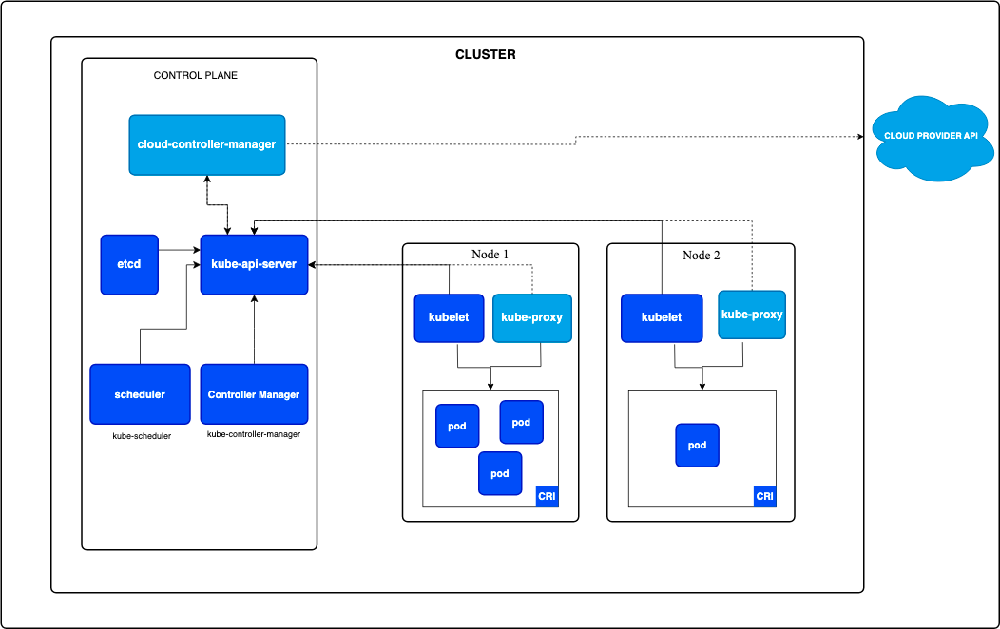

## Introduction

[Kubernetes](https://kubernetes.io/), also known as K8s, is an open-source system for automating deployment, scaling, and management of [containerized](/docs/CS/Container/Container.md) applications.

> Kubernetes来源于Google内部的[Borg](/docs/CS/Distributed/Borg.md) 和 Omega集群管理系统

Kubernetes has the following characteristics:

- It is made of a manager and a set of nodes
- It has a scheduler to place containers in a cluster
- It has an API server and a persistence layer with etcd
- It has a controller to reconcile states
- It is deployed on VMs or bare-metal machines, in public clouds, or on-premise
- It is written in Go

Kubernetes is a mature and feature-rich solution for managing containerized applications. It is not the only container orchestrator, and there are four others:

- Docker Swarm
- Apache Mesos
- Nomad from HashiCorp
- Rancher

At a high level, there is nothing different between Kubernetes and other clustering systems. 
A central manager exposes an API, a scheduler places the workloads on a set of nodes, and the state of the cluster is stored in a persistent layer.
In Kubernetes, however, the persistence layer is implemented with etcd instead of Zookeeper for Mesos.

## Installing K8s


```shell
swapoff -a

# Add vm.swappiness = 0
sudo vim /etc/sysctl.d/k8s.conf
sudo sysctl -p /etc/sysctl.d/k8s.conf
```

[Install Tools](https://kubernetes.io/docs/tasks/tools/)

Windows上WSL和虚拟机不适用 在`minikube start`报错 不支持双重虚拟化

安装minikube 依赖Docker 需要确认镜像是否可以下载

```shell
minikube status
```

### Installing kubeadm, kubelet and kubectl

You will install these packages on all of your machines:

- kubeadm: the command to bootstrap the cluster.
- kubelet: the component that runs on all of the machines in your cluster and does things like starting pods and containers.
- kubectl: the command line util to talk to your cluster.

<!-- tabs:start -->

##### **CentOS**

```shell
# Set SELinux in permissive mode (effectively disabling it)
sudo setenforce 0
sudo sed -i 's/^SELINUX=enforcing$/SELINUX=permissive/' /etc/selinux/config

# This overwrites any existing configuration in /etc/yum.repos.d/kubernetes.repo
cat <<EOF > /etc/yum.repos.d/kubernetes.repo
[kubernetes]
name=Kubernetes
baseurl=https://mirrors.aliyun.com/kubernetes/yum/repos/kubernetes-el7-x86_64/
enabled=1
gpgcheck=1
repo_gpgcheck=1
gpgkey=https://mirrors.aliyun.com/kubernetes/yum/doc/yum-key.gpg https://mirrors.aliyun.com/kubernetes/yum/doc/rpm-package-key.gpg
exclude=kube*
EOF

# Only for CentOS7
cat <<EOF >  /etc/sysctl.d/k8s.conf
net.bridge.bridge-nf-call-ip6tables = 1
net.bridge.bridge-nf-call-iptables = 1
EOF
sysctl --system

sudo yum install -y kubelet kubeadm kubectl --disableexcludes=kubernetes
sudo systemctl enable --now kubelet
```

##### **Ubuntu**

```shell
sudo apt-get update
# apt-transport-https may be a dummy package; if so, you can skip that package
sudo apt-get install -y apt-transport-https ca-certificates curl gpg

curl -fsSL https://pkgs.k8s.io/core:/stable:/v1.28/deb/Release.key | sudo gpg --dearmor -o /etc/apt/keyrings/kubernetes-apt-keyring.gpg

# This overwrites any existing configuration in /etc/apt/sources.list.d/kubernetes.list
echo 'deb [signed-by=/etc/apt/keyrings/kubernetes-apt-keyring.gpg] https://pkgs.k8s.io/core:/stable:/v1.28/deb/ /' | sudo tee /etc/apt/sources.list.d/kubernetes.list

sudo apt-get update
sudo apt-get install -y kubelet kubeadm kubectl
sudo apt-mark hold kubelet kubeadm kubectl
```


##### **Mac**

Mac下通常使用Docker Desktop的k8s

遇到Kubernetes一直在starting的情况

> [`Docker Desktop for Mac` 开启并使用 `Kubernetes`](https://github.com/maguowei/k8s-docker-desktop-for-mac?tab=readme-ov-file#docker-desktop-for-mac-%E5%BC%80%E5%90%AF%E5%B9%B6%E4%BD%BF%E7%94%A8-kubernetes)


<!-- tabs:end -->

### Build

早期K8s支持使用Bazel构建

由于使用Bazel方式构建的二进制文件维护复杂度较高 同时Go语言将编译过程的中间结果缓存下来实现类似增量编译 在K8s 1.21版本移除Bazel方式

<!-- tabs:start -->


##### **Local Env**

```shell
make all

# 单独构建某个组件
make WHAT=cmd/kubectl
```

构建函数入口
kube::golang::build_binaries

##### **Container Env**


容器环境构建

```shell
# 构建所有平台
make release

# 构建当前平台
make quick-release
```

调用到build/release.sh脚本

```go

# Set up the context directory for the kube-build image and build it.
function kube::build::build_image() {
  mkdir -p "${LOCAL_OUTPUT_BUILD_CONTEXT}"
  # Make sure the context directory owned by the right user for syncing sources to container.
  chown -R ${USER_ID}:${GROUP_ID} "${LOCAL_OUTPUT_BUILD_CONTEXT}"

  cp /etc/localtime "${LOCAL_OUTPUT_BUILD_CONTEXT}/"

  cp build/build-image/Dockerfile "${LOCAL_OUTPUT_BUILD_CONTEXT}/Dockerfile"
  cp build/build-image/rsyncd.sh "${LOCAL_OUTPUT_BUILD_CONTEXT}/"
  dd if=/dev/urandom bs=512 count=1 2>/dev/null | LC_ALL=C tr -dc 'A-Za-z0-9' | dd bs=32 count=1 2>/dev/null > "${LOCAL_OUTPUT_BUILD_CONTEXT}/rsyncd.password"
  chmod go= "${LOCAL_OUTPUT_BUILD_CONTEXT}/rsyncd.password"

  kube::build::update_dockerfile
  kube::build::set_proxy
  kube::build::docker_build "${KUBE_BUILD_IMAGE}" "${LOCAL_OUTPUT_BUILD_CONTEXT}" 'false'

  # Clean up old versions of everything
  kube::build::docker_delete_old_containers "${KUBE_BUILD_CONTAINER_NAME_BASE}" "${KUBE_BUILD_CONTAINER_NAME}"
  kube::build::docker_delete_old_containers "${KUBE_RSYNC_CONTAINER_NAME_BASE}" "${KUBE_RSYNC_CONTAINER_NAME}"
  kube::build::docker_delete_old_containers "${KUBE_DATA_CONTAINER_NAME_BASE}" "${KUBE_DATA_CONTAINER_NAME}"
  kube::build::docker_delete_old_images "${KUBE_BUILD_IMAGE_REPO}" "${KUBE_BUILD_IMAGE_TAG_BASE}" "${KUBE_BUILD_IMAGE_TAG}"

  kube::build::ensure_data_container
  kube::build::sync_to_container
}
```


<!-- tabs:end -->


## Architecture

K8s借鉴了Borg的架构设计理念 如Scheduler调度器、Pod资源对象管理等

<div style="text-align: center;">



</div>

<p style="text-align: center;">
Fig.1. Kubernetes cluster architecture
</p>


K8s架构分为Control Plane 和 Worker Node两部分

Control Plane基于[etcd](/docs/CS/Framework/etcd/etcd.md) 做分布式键值存储 一个具有数据副本的最小可运行集群必须至少有3个etcd节点 生产环境建议创建5个节点
Etcd集群存储Kubernetes系统集群的状态和元数据，其中包括所有Kubernetes资源对象信息、集群节点信息等
Kubernetes将所有数据存储至Etcd集群中前缀为`/registry`的目录下

Control Plane主要包含以下组件

- [scheduler](/docs/CS/Container/k8s/scheduler.md)
- [apiServer](/docs/CS/Container/k8s/apiserver.md)
- [controller-manager](/docs/CS/Container/k8s/controller-manager.md)

工作节点主要包含以下组件:

- [kubelet](/docs/CS/Container/k8s/kubelet.md) 是在每个节点上运行的主要 “节点代理” 用于接收、处理、上报kube-apiserver下发的任务
- [kube-proxy](/docs/CS/Container/k8s/kube-proxy.md)
- Container-Runtime 负责提供容器的基础管理服务 接收 `kubelet` 的指令


除此之外, Kubernetes官方提供了命令行工具（CLI），用户可以通过[kubectl]()以命令行交互的方式与Kubernetes API Server进行通信，通信协议使用HTTP/JSON

Kubernetes系统使用client-go作为Go语言的官方编程式交互客户端库，提供对Kubernetes API Server服务的交互访问 k8s其它组件与apiserver的通信也是基于client-go实现


 


在Kubernetes中 service是分布式集群架构的核心
一个Service有以下特征

- 唯一指定名称
- 一个虚拟IP地址和端口号
- 能够提供某种远程服务能力
- 能将客户端对服务访问请求转发到一组容器应用中

在Service中每个服务进程都有独立的Endpoint

每个进程都将被包装到相应的Pod中 成为Pod中的一个容器 为了建立Pod和Service的关系 每个Pod都被打上了一个Label 然后给相应的Service定义Label Selector

Pod运行在称为Node的环境(可以是物理机器 或者是虚拟机) 每个Node可以有多个Pod 每个Pod里都有Pause的容器


在集群管理上 机器被划分为Master和其它Node Master运行着一些进程 kube-apiserver kube-controller-manager


Deployment


Master

Kubernetes runs your workload by placing containers into Pods to run on Nodes. 
A node may be a virtual or physical machine, depending on the cluster.
Each node is managed by the control plane and contains the services necessary to run Pods.

Typically you have several nodes in a cluster; in a learning or resource-limited environment, you might have only one node.

The components on a node include the kubelet, a container runtime, and the kube-proxy.


Pod gang scheduling

base on infra container


Kubernetes supports container runtimes such as containerd, CRI-O, and any other implementation of the Kubernetes CRI (Container Runtime Interface).


apiserver模块在Kubernetes中扮演了非常重要的角色。它是Kubernetes集群中所有API的主要接口，负责处理和转发集群内部和外部的API请求。


### project layout

根据 Standard Go Project Layout 方案 来看一下Kubernetes Project Layout 的设计


| 目录         | 说明       |
|------------|----------|
| cmd        | 可执行文件入口  |
| pkg        | 核心库代码    |
| vendor     |          |
| api        |          |
| build      |          |
| test       |          |
| docs       |          |
| hack       |          |
| third_party |          |
| plugin     |          |
| staging    | 核心库暂存目录 该目录下的核心包多以软连接的方式链接到 vendor/k8s.io 目录 |
| translations |          |
| CHANGELOG  |          |


K8s各组件的代码入口 `main` 结构风格非常一致


## Definition

在整个Kubernetes体系架构中，资源是Kubernetes最重要的概念，可以说Kubernetes的生态系统都围绕着资源运作。Kubernetes系统虽然有相当复杂和众多的功能，但它本质上是一个资源控制系统——注册、管理、调度资源并维护资源的状态

而对资源的操作都是基于API完成的 K8s通过`kube-apiserver` 提供RESTful风格的API 实现对资源的管理

在Kubernetes庞大而复杂的系统中，只有资源是远远不够的，Kubernetes将资源再次分组和版本化，形成Group、Version、Resource
Kubernetes系统支持多个Group，每个Group支持多个Version，每个Version支持多个Resource，其中部分资源同时会拥有自己的SubResource

在定义一个Deployment YAML文件的时候 第一行的 `apiVersion:apps/v1` 中 apps表示group, v1表示版本


每一个资源都至少有两个版本，分别是外部版本（External Version）和内部版本（Internal Version）。外部版本用于对外暴露给用户请求的接口所使用的资源对象。内部版本不对外暴露，仅在Kubernetes API Server内部使用


所有资源类型都有一个具体的表示 称为Kind 又称Object Scheme, Kind分为以下几种

- Object
- List
- Simple


```go
type GroupVersionKind struct {
	Group   string
	Version string
	Kind    string
}
```


```go
type GroupVersionResource struct {
	Group    string
	Version  string
	Resource string
}
```


Scheme defines methods for serializing and deserializing API objects, a type registry for converting group, version, and kind information to and from Go schemas, and mappings between Go schemas of different versions. A scheme is the foundation for a versioned API and versioned configuration over time.


// schemas, and mappings between Go schemas of different versions. A scheme is the foundation for a versioned API and versioned configuration over time.

// foundation for a versioned API and versioned configuration over time.


```go
type Scheme struct {
	// versionMap allows one to figure out the go type of an object with
	// the given version and name.
	gvkToType map[schema.GroupVersionKind]reflect.Type

	// typeToGroupVersion allows one to find metadata for a given go object.
	// The reflect.Type we index by should *not* be a pointer.
	typeToGVK map[reflect.Type][]schema.GroupVersionKind

	// unversionedTypes are transformed without conversion in ConvertToVersion.
	unversionedTypes map[reflect.Type]schema.GroupVersionKind

	// unversionedKinds are the names of kinds that can be created in the context of any group
	// or version
	// TODO: resolve the status of unversioned types.
	unversionedKinds map[string]reflect.Type

	// Map from version and resource to the corresponding func to convert
	// resource field labels in that version to internal version.
	fieldLabelConversionFuncs map[string]map[string]FieldLabelConversionFunc

	// defaulterFuncs is an array of interfaces to be called with an object to provide defaulting
	// the provided object must be a pointer.
	defaulterFuncs map[reflect.Type]func(interface{})

	// converter stores all registered conversion functions. It also has
	// default coverting behavior.
	converter *conversion.Converter
}
```


NewScheme creates a new Scheme. This scheme is pluggable by default.

```go
func NewScheme() *Scheme {
	s := &Scheme{
		gvkToType:                 map[schema.GroupVersionKind]reflect.Type{},
		typeToGVK:                 map[reflect.Type][]schema.GroupVersionKind{},
		unversionedTypes:          map[reflect.Type]schema.GroupVersionKind{},
		unversionedKinds:          map[string]reflect.Type{},
		fieldLabelConversionFuncs: map[string]map[string]FieldLabelConversionFunc{},
		defaulterFuncs:            map[reflect.Type]func(interface{}){},
	}
	s.converter = conversion.NewConverter(s.nameFunc)

	s.AddConversionFuncs(DefaultEmbeddedConversions()...)

	// Enable map[string][]string conversions by default
	if err := s.AddConversionFuncs(DefaultStringConversions...); err != nil {
		panic(err)
	}
	if err := s.RegisterInputDefaults(&map[string][]string{}, JSONKeyMapper, conversion.AllowDifferentFieldTypeNames|conversion.IgnoreMissingFields); err != nil {
		panic(err)
	}
	if err := s.RegisterInputDefaults(&url.Values{}, JSONKeyMapper, conversion.AllowDifferentFieldTypeNames|conversion.IgnoreMissingFields); err != nil {
		panic(err)
	}
	return s
}

```


kubernetes内部资源定义
有组：pkg\apis\<group>\
无组：pkg\apis\core\types.go
外部版本

有组：staging\src\k8s.io\api\<group>\<version>\<resource file>
无组：staging\src\k8s.io\api\core\v1

资源操作方法接口
staging\src\k8s.io\apiserver\pkg\registry\rest\rest.go
资源操作方法
staging\src\k8s.io\apiserver\pkg\registry\generic\registry\store.go
定义控制器
kubernetes\pkg\controller\


### CRI-O

CRI-O is an implementation of the Kubernetes CRI (Container Runtime Interface) to enable using OCI (Open Container Initiative) compatible runtimes.
It is a lightweight alternative to using [Docker](/docs/CS/Container/Docker.md) as the runtime for kubernetes. 
It allows Kubernetes to use any OCI-compliant runtime as the container runtime for running pods. 
Today it supports runc and Kata Containers as the container runtimes but any OCI-conformant runtime can be plugged in principle.

CRI-O supports OCI container images and can pull from any container registry. 
It is a lightweight alternative to using Docker, Moby or rkt as the runtime for Kubernetes.


### Pod

PodSpec is a description of a pod

```go
type PodSpec struct {
	Volumes []Volume
	// List of initialization containers belonging to the pod.
	InitContainers []Container
	// List of containers belonging to the pod.
	Containers []Container
	// +optional
	RestartPolicy RestartPolicy
	// Optional duration in seconds the pod needs to terminate gracefully. May be decreased in delete request.
	// Value must be non-negative integer. The value zero indicates delete immediately.
	// If this value is nil, the default grace period will be used instead.
	// The grace period is the duration in seconds after the processes running in the pod are sent
	// a termination signal and the time when the processes are forcibly halted with a kill signal.
	// Set this value longer than the expected cleanup time for your process.
	// +optional
	TerminationGracePeriodSeconds *int64
	// Optional duration in seconds relative to the StartTime that the pod may be active on a node
	// before the system actively tries to terminate the pod; value must be positive integer
	// +optional
	ActiveDeadlineSeconds *int64
	// Set DNS policy for the pod.
	// Defaults to "ClusterFirst".
	// Valid values are 'ClusterFirstWithHostNet', 'ClusterFirst', 'Default' or 'None'.
	// DNS parameters given in DNSConfig will be merged with the policy selected with DNSPolicy.
	// To have DNS options set along with hostNetwork, you have to specify DNS policy
	// explicitly to 'ClusterFirstWithHostNet'.
	// +optional
	DNSPolicy DNSPolicy
	// NodeSelector is a selector which must be true for the pod to fit on a node
	// +optional
	NodeSelector map[string]string

	// ServiceAccountName is the name of the ServiceAccount to use to run this pod
	// The pod will be allowed to use secrets referenced by the ServiceAccount
	ServiceAccountName string
	// AutomountServiceAccountToken indicates whether a service account token should be automatically mounted.
	// +optional
	AutomountServiceAccountToken *bool

	// NodeName is a request to schedule this pod onto a specific node.  If it is non-empty,
	// the scheduler simply schedules this pod onto that node, assuming that it fits resource
	// requirements.
	// +optional
	NodeName string
	// SecurityContext holds pod-level security attributes and common container settings.
	// Optional: Defaults to empty.  See type description for default values of each field.
	// +optional
	SecurityContext *PodSecurityContext
	// ImagePullSecrets is an optional list of references to secrets in the same namespace to use for pulling any of the images used by this PodSpec.
	// If specified, these secrets will be passed to individual puller implementations for them to use.  For example,
	// in the case of docker, only DockerConfig type secrets are honored.
	// +optional
	ImagePullSecrets []LocalObjectReference
	// Specifies the hostname of the Pod.
	// If not specified, the pod's hostname will be set to a system-defined value.
	// +optional
	Hostname string
	// If specified, the fully qualified Pod hostname will be "<hostname>.<subdomain>.<pod namespace>.svc.<cluster domain>".
	// If not specified, the pod will not have a domainname at all.
	// +optional
	Subdomain string
	// If specified, the pod's scheduling constraints
	// +optional
	Affinity *Affinity
	// If specified, the pod will be dispatched by specified scheduler.
	// If not specified, the pod will be dispatched by default scheduler.
	// +optional
	SchedulerName string
	// If specified, the pod's tolerations.
	// +optional
	Tolerations []Toleration
	// HostAliases is an optional list of hosts and IPs that will be injected into the pod's hosts
	// file if specified. This is only valid for non-hostNetwork pods.
	// +optional
	HostAliases []HostAlias
	// If specified, indicates the pod's priority. "SYSTEM" is a special keyword
	// which indicates the highest priority. Any other name must be defined by
	// creating a PriorityClass object with that name.
	// If not specified, the pod priority will be default or zero if there is no
	// default.
	// +optional
	PriorityClassName string
	// The priority value. Various system components use this field to find the
	// priority of the pod. When Priority Admission Controller is enabled, it
	// prevents users from setting this field. The admission controller populates
	// this field from PriorityClassName.
	// The higher the value, the higher the priority.
	// +optional
	Priority *int32
	// Specifies the DNS parameters of a pod.
	// Parameters specified here will be merged to the generated DNS
	// configuration based on DNSPolicy.
	// +optional
	DNSConfig *PodDNSConfig
}
```


Podz中主要包括3类容器: Init容器、普通容器、临时容器 分别对应InitContainers、Containers、EphemeralContainers


Init容器是一种特殊的容器 在普通容器启动之前按顺序执行 上一个Init容器执行成功并结束之后 下一个Init容器才会开始执行 如果任何一个Init容器执行失败 则认为该Pod失败


makeMounts determines the mount points for the given container.

```go
func makeMounts(pod *v1.Pod, podDir string, container *v1.Container, hostName, hostDomain, podIP string, podVolumes kubecontainer.VolumeMap, mounter mountutil.Interface) ([]kubecontainer.Mount, func(), error) {
	// Kubernetes only mounts on /etc/hosts if:
	// - container is not an infrastructure (pause) container
	// - container is not already mounting on /etc/hosts
	// - OS is not Windows
	// Kubernetes will not mount /etc/hosts if:
	// - when the Pod sandbox is being created, its IP is still unknown. Hence, PodIP will not have been set.
	mountEtcHostsFile := len(podIP) > 0 && runtime.GOOS != "windows"
	glog.V(3).Infof("container: %v/%v/%v podIP: %q creating hosts mount: %v", pod.Namespace, pod.Name, container.Name, podIP, mountEtcHostsFile)
	mounts := []kubecontainer.Mount{}
	var cleanupAction func() = nil
	for i, mount := range container.VolumeMounts {
		// do not mount /etc/hosts if container is already mounting on the path
		mountEtcHostsFile = mountEtcHostsFile && (mount.MountPath != etcHostsPath)
		vol, ok := podVolumes[mount.Name]
		if !ok || vol.Mounter == nil {
			glog.Errorf("Mount cannot be satisfied for container %q, because the volume is missing or the volume mounter is nil: %+v", container.Name, mount)
			return nil, cleanupAction, fmt.Errorf("cannot find volume %q to mount into container %q", mount.Name, container.Name)
		}

		relabelVolume := false
		// If the volume supports SELinux and it has not been
		// relabeled already and it is not a read-only volume,
		// relabel it and mark it as labeled
		if vol.Mounter.GetAttributes().Managed && vol.Mounter.GetAttributes().SupportsSELinux && !vol.SELinuxLabeled {
			vol.SELinuxLabeled = true
			relabelVolume = true
		}
		hostPath, err := volume.GetPath(vol.Mounter)
		if err != nil {
			return nil, cleanupAction, err
		}
		if mount.SubPath != "" {
			if !utilfeature.DefaultFeatureGate.Enabled(features.VolumeSubpath) {
				return nil, cleanupAction, fmt.Errorf("volume subpaths are disabled")
			}

			if filepath.IsAbs(mount.SubPath) {
				return nil, cleanupAction, fmt.Errorf("error SubPath `%s` must not be an absolute path", mount.SubPath)
			}

			err = volumevalidation.ValidatePathNoBacksteps(mount.SubPath)
			if err != nil {
				return nil, cleanupAction, fmt.Errorf("unable to provision SubPath `%s`: %v", mount.SubPath, err)
			}

			fileinfo, err := os.Lstat(hostPath)
			if err != nil {
				return nil, cleanupAction, err
			}
			perm := fileinfo.Mode()

			volumePath, err := filepath.EvalSymlinks(hostPath)
			if err != nil {
				return nil, cleanupAction, err
			}
			hostPath = filepath.Join(volumePath, mount.SubPath)

			if subPathExists, err := utilfile.FileOrSymlinkExists(hostPath); err != nil {
				glog.Errorf("Could not determine if subPath %s exists; will not attempt to change its permissions", hostPath)
			} else if !subPathExists {
				// Create the sub path now because if it's auto-created later when referenced, it may have an
				// incorrect ownership and mode. For example, the sub path directory must have at least g+rwx
				// when the pod specifies an fsGroup, and if the directory is not created here, Docker will
				// later auto-create it with the incorrect mode 0750
				// Make extra care not to escape the volume!
				if err := mounter.SafeMakeDir(hostPath, volumePath, perm); err != nil {
					glog.Errorf("failed to mkdir %q: %v", hostPath, err)
					return nil, cleanupAction, err
				}
			}
			hostPath, cleanupAction, err = mounter.PrepareSafeSubpath(mountutil.Subpath{
				VolumeMountIndex: i,
				Path:             hostPath,
				VolumeName:       vol.InnerVolumeSpecName,
				VolumePath:       volumePath,
				PodDir:           podDir,
				ContainerName:    container.Name,
			})
			if err != nil {
				// Don't pass detailed error back to the user because it could give information about host filesystem
				glog.Errorf("failed to prepare subPath for volumeMount %q of container %q: %v", mount.Name, container.Name, err)
				return nil, cleanupAction, fmt.Errorf("failed to prepare subPath for volumeMount %q of container %q", mount.Name, container.Name)
			}
		}

		// Docker Volume Mounts fail on Windows if it is not of the form C:/
		containerPath := mount.MountPath
		if runtime.GOOS == "windows" {
			if (strings.HasPrefix(hostPath, "/") || strings.HasPrefix(hostPath, "\\")) && !strings.Contains(hostPath, ":") {
				hostPath = "c:" + hostPath
			}
		}
		if !filepath.IsAbs(containerPath) {
			containerPath = makeAbsolutePath(runtime.GOOS, containerPath)
		}

		propagation, err := translateMountPropagation(mount.MountPropagation)
		if err != nil {
			return nil, cleanupAction, err
		}
		glog.V(5).Infof("Pod %q container %q mount %q has propagation %q", format.Pod(pod), container.Name, mount.Name, propagation)

		mustMountRO := vol.Mounter.GetAttributes().ReadOnly && utilfeature.DefaultFeatureGate.Enabled(features.ReadOnlyAPIDataVolumes)

		mounts = append(mounts, kubecontainer.Mount{
			Name:           mount.Name,
			ContainerPath:  containerPath,
			HostPath:       hostPath,
			ReadOnly:       mount.ReadOnly || mustMountRO,
			SELinuxRelabel: relabelVolume,
			Propagation:    propagation,
		})
	}
	if mountEtcHostsFile {
		hostAliases := pod.Spec.HostAliases
		hostsMount, err := makeHostsMount(podDir, podIP, hostName, hostDomain, hostAliases, pod.Spec.HostNetwork)
		if err != nil {
			return nil, cleanupAction, err
		}
		mounts = append(mounts, *hostsMount)
	}
	return mounts, cleanupAction, nil
}
```


PodRequestsAndLimits returns a dictionary of all defined resources summed up for all containers of the pod.

```go
func PodRequestsAndLimits(pod *api.Pod) (reqs map[api.ResourceName]resource.Quantity, limits map[api.ResourceName]resource.Quantity, err error) {
	reqs, limits = map[api.ResourceName]resource.Quantity{}, map[api.ResourceName]resource.Quantity{}
	for _, container := range pod.Spec.Containers {
		for name, quantity := range container.Resources.Requests {
			if value, ok := reqs[name]; !ok {
				reqs[name] = *quantity.Copy()
			} else {
				value.Add(quantity)
				reqs[name] = value
			}
		}
		for name, quantity := range container.Resources.Limits {
			if value, ok := limits[name]; !ok {
				limits[name] = *quantity.Copy()
			} else {
				value.Add(quantity)
				limits[name] = value
			}
		}
	}
	// init containers define the minimum of any resource
	for _, container := range pod.Spec.InitContainers {
		for name, quantity := range container.Resources.Requests {
			value, ok := reqs[name]
			if !ok {
				reqs[name] = *quantity.Copy()
				continue
			}
			if quantity.Cmp(value) > 0 {
				reqs[name] = *quantity.Copy()
			}
		}
		for name, quantity := range container.Resources.Limits {
			value, ok := limits[name]
			if !ok {
				limits[name] = *quantity.Copy()
				continue
			}
			if quantity.Cmp(value) > 0 {
				limits[name] = *quantity.Copy()
			}
		}
	}
	return
}
```


GetPodQOS returns the QoS class of a pod.
A pod is besteffort if none of its containers have specified any requests or limits.
A pod is guaranteed only when requests and limits are specified for all the containers and they are equal.
A pod is burstable if limits and requests do not match across all containers.


```go
func GetPodQOS(pod *core.Pod) core.PodQOSClass {
	requests := core.ResourceList{}
	limits := core.ResourceList{}
	zeroQuantity := resource.MustParse("0")
	isGuaranteed := true
	for _, container := range pod.Spec.Containers {
		// process requests
		for name, quantity := range container.Resources.Requests {
			if !isSupportedQoSComputeResource(name) {
				continue
			}
			if quantity.Cmp(zeroQuantity) == 1 {
				delta := quantity.Copy()
				if _, exists := requests[name]; !exists {
					requests[name] = *delta
				} else {
					delta.Add(requests[name])
					requests[name] = *delta
				}
			}
		}
		// process limits
		qosLimitsFound := sets.NewString()
		for name, quantity := range container.Resources.Limits {
			if !isSupportedQoSComputeResource(name) {
				continue
			}
			if quantity.Cmp(zeroQuantity) == 1 {
				qosLimitsFound.Insert(string(name))
				delta := quantity.Copy()
				if _, exists := limits[name]; !exists {
					limits[name] = *delta
				} else {
					delta.Add(limits[name])
					limits[name] = *delta
				}
			}
		}

		if !qosLimitsFound.HasAll(string(core.ResourceMemory), string(core.ResourceCPU)) {
			isGuaranteed = false
		}
	}
	if len(requests) == 0 && len(limits) == 0 {
		return core.PodQOSBestEffort
	}
	// Check is requests match limits for all resources.
	if isGuaranteed {
		for name, req := range requests {
			if lim, exists := limits[name]; !exists || lim.Cmp(req) != 0 {
				isGuaranteed = false
				break
			}
		}
	}
	if isGuaranteed &&
		len(requests) == len(limits) {
		return core.PodQOSGuaranteed
	}
	return core.PodQOSBurstable
}
```

rankMemoryPressure orders the input pods for eviction in response to memory pressure.
It ranks by whether or not the pod's usage exceeds its requests, then by priority, and finally by memory usage above requests.

```go
func rankMemoryPressure(pods []*v1.Pod, stats statsFunc) {
	orderedBy(exceedMemoryRequests(stats), priority, memory(stats)).Sort(pods)
}
```

exceedMemoryRequests compares whether or not pods' memory usage exceeds their requests

```go
func exceedMemoryRequests(stats statsFunc) cmpFunc {
	return func(p1, p2 *v1.Pod) int {
		p1Stats, p1Found := stats(p1)
		p2Stats, p2Found := stats(p2)
		if !p1Found || !p2Found {
			// prioritize evicting the pod for which no stats were found
			return cmpBool(!p1Found, !p2Found)
		}

		p1Usage, p1Err := podMemoryUsage(p1Stats)
		p2Usage, p2Err := podMemoryUsage(p2Stats)
		if p1Err != nil || p2Err != nil {
			// prioritize evicting the pod which had an error getting stats
			return cmpBool(p1Err != nil, p2Err != nil)
		}

		p1Memory := p1Usage[v1.ResourceMemory]
		p2Memory := p2Usage[v1.ResourceMemory]
		p1ExceedsRequests := p1Memory.Cmp(podRequest(p1, v1.ResourceMemory)) == 1
		p2ExceedsRequests := p2Memory.Cmp(podRequest(p2, v1.ResourceMemory)) == 1
		// prioritize evicting the pod which exceeds its requests
		return cmpBool(p1ExceedsRequests, p2ExceedsRequests)
	}
}
```


#### syncPod

syncPod is the transaction script for the sync of a single pod.

The workflow is:
* If the pod is being created, record pod worker start latency
* Call generateAPIPodStatus to prepare an v1.PodStatus for the pod
* If the pod is being seen as running for the first time, record pod
  start latency
* Update the status of the pod in the status manager
* Kill the pod if it should not be running
* Create a mirror pod if the pod is a static pod, and does not
  already have a mirror pod
* Create the data directories for the pod if they do not exist
* Wait for volumes to attach/mount
* Fetch the pull secrets for the pod
* Call the container runtime's SyncPod callback
* Update the traffic shaping for the pod's ingress and egress limits


If any step of this workflow errors, the error is returned, and is repeated on the next syncPod call.
This operation writes all events that are dispatched in order to provide the most accurate information possible about an error situation to aid debugging.
Callers should not throw an event if this operation returns an error.

```go
func (kl *Kubelet) syncPod(o syncPodOptions) error {
	// pull out the required options
	pod := o.pod
	mirrorPod := o.mirrorPod
	podStatus := o.podStatus
	updateType := o.updateType

	// if we want to kill a pod, do it now!
	if updateType == kubetypes.SyncPodKill {
		killPodOptions := o.killPodOptions
		if killPodOptions == nil || killPodOptions.PodStatusFunc == nil {
			return fmt.Errorf("kill pod options are required if update type is kill")
		}
		apiPodStatus := killPodOptions.PodStatusFunc(pod, podStatus)
		kl.statusManager.SetPodStatus(pod, apiPodStatus)
		// we kill the pod with the specified grace period since this is a termination
		if err := kl.killPod(pod, nil, podStatus, killPodOptions.PodTerminationGracePeriodSecondsOverride); err != nil {
			kl.recorder.Eventf(pod, v1.EventTypeWarning, events.FailedToKillPod, "error killing pod: %v", err)
			// there was an error killing the pod, so we return that error directly
			utilruntime.HandleError(err)
			return err
		}
		return nil
	}

	// Latency measurements for the main workflow are relative to the
	// first time the pod was seen by the API server.
	var firstSeenTime time.Time
	if firstSeenTimeStr, ok := pod.Annotations[kubetypes.ConfigFirstSeenAnnotationKey]; ok {
		firstSeenTime = kubetypes.ConvertToTimestamp(firstSeenTimeStr).Get()
	}

	// Record pod worker start latency if being created
	// TODO: make pod workers record their own latencies
	if updateType == kubetypes.SyncPodCreate {
		if !firstSeenTime.IsZero() {
			// This is the first time we are syncing the pod. Record the latency
			// since kubelet first saw the pod if firstSeenTime is set.
			metrics.PodWorkerStartLatency.Observe(metrics.SinceInMicroseconds(firstSeenTime))
		} else {
			glog.V(3).Infof("First seen time not recorded for pod %q", pod.UID)
		}
	}

	// Generate final API pod status with pod and status manager status
	apiPodStatus := kl.generateAPIPodStatus(pod, podStatus)
	// The pod IP may be changed in generateAPIPodStatus if the pod is using host network. (See #24576)
	// TODO(random-liu): After writing pod spec into container labels, check whether pod is using host network, and
	// set pod IP to hostIP directly in runtime.GetPodStatus
	podStatus.IP = apiPodStatus.PodIP

	// Record the time it takes for the pod to become running.
	existingStatus, ok := kl.statusManager.GetPodStatus(pod.UID)
	if !ok || existingStatus.Phase == v1.PodPending && apiPodStatus.Phase == v1.PodRunning &&
		!firstSeenTime.IsZero() {
		metrics.PodStartLatency.Observe(metrics.SinceInMicroseconds(firstSeenTime))
	}

	runnable := kl.canRunPod(pod)
	if !runnable.Admit {
		// Pod is not runnable; update the Pod and Container statuses to why.
		apiPodStatus.Reason = runnable.Reason
		apiPodStatus.Message = runnable.Message
		// Waiting containers are not creating.
		const waitingReason = "Blocked"
		for _, cs := range apiPodStatus.InitContainerStatuses {
			if cs.State.Waiting != nil {
				cs.State.Waiting.Reason = waitingReason
			}
		}
		for _, cs := range apiPodStatus.ContainerStatuses {
			if cs.State.Waiting != nil {
				cs.State.Waiting.Reason = waitingReason
			}
		}
	}

	// Update status in the status manager
	kl.statusManager.SetPodStatus(pod, apiPodStatus)

	// Kill pod if it should not be running
	if !runnable.Admit || pod.DeletionTimestamp != nil || apiPodStatus.Phase == v1.PodFailed {
		var syncErr error
		if err := kl.killPod(pod, nil, podStatus, nil); err != nil {
			kl.recorder.Eventf(pod, v1.EventTypeWarning, events.FailedToKillPod, "error killing pod: %v", err)
			syncErr = fmt.Errorf("error killing pod: %v", err)
			utilruntime.HandleError(syncErr)
		} else {
			if !runnable.Admit {
				// There was no error killing the pod, but the pod cannot be run.
				// Return an error to signal that the sync loop should back off.
				syncErr = fmt.Errorf("pod cannot be run: %s", runnable.Message)
			}
		}
		return syncErr
	}

	// If the network plugin is not ready, only start the pod if it uses the host network
	if rs := kl.runtimeState.networkErrors(); len(rs) != 0 && !kubecontainer.IsHostNetworkPod(pod) {
		kl.recorder.Eventf(pod, v1.EventTypeWarning, events.NetworkNotReady, "network is not ready: %v", rs)
		return fmt.Errorf("network is not ready: %v", rs)
	}

	// Create Cgroups for the pod and apply resource parameters
	// to them if cgroups-per-qos flag is enabled.
	pcm := kl.containerManager.NewPodContainerManager()
	// If pod has already been terminated then we need not create
	// or update the pod's cgroup
	if !kl.podIsTerminated(pod) {
		// When the kubelet is restarted with the cgroups-per-qos
		// flag enabled, all the pod's running containers
		// should be killed intermittently and brought back up
		// under the qos cgroup hierarchy.
		// Check if this is the pod's first sync
		firstSync := true
		for _, containerStatus := range apiPodStatus.ContainerStatuses {
			if containerStatus.State.Running != nil {
				firstSync = false
				break
			}
		}
		// Don't kill containers in pod if pod's cgroups already
		// exists or the pod is running for the first time
		podKilled := false
		if !pcm.Exists(pod) && !firstSync {
			if err := kl.killPod(pod, nil, podStatus, nil); err == nil {
				podKilled = true
			}
		}
		// Create and Update pod's Cgroups
		// Don't create cgroups for run once pod if it was killed above
		// The current policy is not to restart the run once pods when
		// the kubelet is restarted with the new flag as run once pods are
		// expected to run only once and if the kubelet is restarted then
		// they are not expected to run again.
		// We don't create and apply updates to cgroup if its a run once pod and was killed above
		if !(podKilled && pod.Spec.RestartPolicy == v1.RestartPolicyNever) {
			if !pcm.Exists(pod) {
				if err := kl.containerManager.UpdateQOSCgroups(); err != nil {
					glog.V(2).Infof("Failed to update QoS cgroups while syncing pod: %v", err)
				}
				if err := pcm.EnsureExists(pod); err != nil {
					kl.recorder.Eventf(pod, v1.EventTypeWarning, events.FailedToCreatePodContainer, "unable to ensure pod container exists: %v", err)
					return fmt.Errorf("failed to ensure that the pod: %v cgroups exist and are correctly applied: %v", pod.UID, err)
				}
			}
		}
	}

	// Create Mirror Pod for Static Pod if it doesn't already exist
	if kubepod.IsStaticPod(pod) {
		podFullName := kubecontainer.GetPodFullName(pod)
		deleted := false
		if mirrorPod != nil {
			if mirrorPod.DeletionTimestamp != nil || !kl.podManager.IsMirrorPodOf(mirrorPod, pod) {
				// The mirror pod is semantically different from the static pod. Remove
				// it. The mirror pod will get recreated later.
				glog.Warningf("Deleting mirror pod %q because it is outdated", format.Pod(mirrorPod))
				if err := kl.podManager.DeleteMirrorPod(podFullName); err != nil {
					glog.Errorf("Failed deleting mirror pod %q: %v", format.Pod(mirrorPod), err)
				} else {
					deleted = true
				}
			}
		}
		if mirrorPod == nil || deleted {
			node, err := kl.GetNode()
			if err != nil || node.DeletionTimestamp != nil {
				glog.V(4).Infof("No need to create a mirror pod, since node %q has been removed from the cluster", kl.nodeName)
			} else {
				glog.V(4).Infof("Creating a mirror pod for static pod %q", format.Pod(pod))
				if err := kl.podManager.CreateMirrorPod(pod); err != nil {
					glog.Errorf("Failed creating a mirror pod for %q: %v", format.Pod(pod), err)
				}
			}
		}
	}

	// Make data directories for the pod
	if err := kl.makePodDataDirs(pod); err != nil {
		kl.recorder.Eventf(pod, v1.EventTypeWarning, events.FailedToMakePodDataDirectories, "error making pod data directories: %v", err)
		glog.Errorf("Unable to make pod data directories for pod %q: %v", format.Pod(pod), err)
		return err
	}

	// Volume manager will not mount volumes for terminated pods
	if !kl.podIsTerminated(pod) {
		// Wait for volumes to attach/mount
		if err := kl.volumeManager.WaitForAttachAndMount(pod); err != nil {
			kl.recorder.Eventf(pod, v1.EventTypeWarning, events.FailedMountVolume, "Unable to mount volumes for pod %q: %v", format.Pod(pod), err)
			glog.Errorf("Unable to mount volumes for pod %q: %v; skipping pod", format.Pod(pod), err)
			return err
		}
	}

	// Fetch the pull secrets for the pod
	pullSecrets := kl.getPullSecretsForPod(pod)

	// Call the container runtime's SyncPod callback
	result := kl.containerRuntime.SyncPod(pod, apiPodStatus, podStatus, pullSecrets, kl.backOff)
	kl.reasonCache.Update(pod.UID, result)
	if err := result.Error(); err != nil {
		// Do not record an event here, as we keep all event logging for sync pod failures
		// local to container runtime so we get better errors
		return err
	}

	return nil
}
```


### container


```go
// Container represents a single container that is expected to be run on the host.
type Container struct {
	// Required: This must be a DNS_LABEL.  Each container in a pod must
	// have a unique name.
	Name string
	// Required.
	Image string
	// Optional: The docker image's entrypoint is used if this is not provided; cannot be updated.
	// Variable references $(VAR_NAME) are expanded using the container's environment.  If a variable
	// cannot be resolved, the reference in the input string will be unchanged.  The $(VAR_NAME) syntax
	// can be escaped with a double $$, ie: $$(VAR_NAME).  Escaped references will never be expanded,
	// regardless of whether the variable exists or not.
	// +optional
	Command []string
	// Optional: The docker image's cmd is used if this is not provided; cannot be updated.
	// Variable references $(VAR_NAME) are expanded using the container's environment.  If a variable
	// cannot be resolved, the reference in the input string will be unchanged.  The $(VAR_NAME) syntax
	// can be escaped with a double $$, ie: $$(VAR_NAME).  Escaped references will never be expanded,
	// regardless of whether the variable exists or not.
	// +optional
	Args []string
	// Optional: Defaults to Docker's default.
	// +optional
	WorkingDir string
	// +optional
	Ports []ContainerPort
	// List of sources to populate environment variables in the container.
	// The keys defined within a source must be a C_IDENTIFIER. All invalid keys
	// will be reported as an event when the container is starting. When a key exists in multiple
	// sources, the value associated with the last source will take precedence.
	// Values defined by an Env with a duplicate key will take precedence.
	// Cannot be updated.
	// +optional
	EnvFrom []EnvFromSource
	// +optional
	Env []EnvVar
	// Compute resource requirements.
	// +optional
	Resources ResourceRequirements
	// +optional
	VolumeMounts []VolumeMount
	// volumeDevices is the list of block devices to be used by the container.
	// This is an alpha feature and may change in the future.
	// +optional
	VolumeDevices []VolumeDevice
	// +optional
	LivenessProbe *Probe
	// +optional
	ReadinessProbe *Probe
	// +optional
	Lifecycle *Lifecycle
	// Required.
	// +optional
	TerminationMessagePath string
	// +optional
	TerminationMessagePolicy TerminationMessagePolicy
	// Required: Policy for pulling images for this container
	ImagePullPolicy PullPolicy
	// Optional: SecurityContext defines the security options the container should be run with.
	// If set, the fields of SecurityContext override the equivalent fields of PodSecurityContext.
	// +optional
	SecurityContext *SecurityContext

	// Variables for interactive containers, these have very specialized use-cases (e.g. debugging)
	// and shouldn't be used for general purpose containers.
	// +optional
	Stdin bool
	// +optional
	StdinOnce bool
	// +optional
	TTY bool
}
```


shouldPullImage returns whether we should pull an image according to the presence and pull policy of the image.

```go
func shouldPullImage(container *v1.Container, imagePresent bool) bool {
	if container.ImagePullPolicy == v1.PullNever {
		return false
	}

	if container.ImagePullPolicy == v1.PullAlways ||
		(container.ImagePullPolicy == v1.PullIfNotPresent && (!imagePresent)) {
		return true
	}

	return false
}
```

#### CreateContainer

CreateContainer creates a new container in the given PodSandbox
Docker cannot store the log to an arbitrary location (yet), so we create ansymlink at LogPath, linking to the actual path of the log.

```go
func (ds *dockerService) CreateContainer(podSandboxID string, config *runtimeapi.ContainerConfig, sandboxConfig *runtimeapi.PodSandboxConfig) (string, error) {
	if config == nil {
		return "", fmt.Errorf("container config is nil")
	}
	if sandboxConfig == nil {
		return "", fmt.Errorf("sandbox config is nil for container %q", config.Metadata.Name)
	}

	labels := makeLabels(config.GetLabels(), config.GetAnnotations())
	// Apply a the container type label.
	labels[containerTypeLabelKey] = containerTypeLabelContainer
	// Write the container log path in the labels.
	labels[containerLogPathLabelKey] = filepath.Join(sandboxConfig.LogDirectory, config.LogPath)
	// Write the sandbox ID in the labels.
	labels[sandboxIDLabelKey] = podSandboxID

	apiVersion, err := ds.getDockerAPIVersion()
	if err != nil {
		return "", fmt.Errorf("unable to get the docker API version: %v", err)
	}
	securityOptSep := getSecurityOptSeparator(apiVersion)

	image := ""
	if iSpec := config.GetImage(); iSpec != nil {
		image = iSpec.Image
	}
	createConfig := dockertypes.ContainerCreateConfig{
		Name: makeContainerName(sandboxConfig, config),
		Config: &dockercontainer.Config{
			// TODO: set User.
			Entrypoint: dockerstrslice.StrSlice(config.Command),
			Cmd:        dockerstrslice.StrSlice(config.Args),
			Env:        generateEnvList(config.GetEnvs()),
			Image:      image,
			WorkingDir: config.WorkingDir,
			Labels:     labels,
			// Interactive containers:
			OpenStdin: config.Stdin,
			StdinOnce: config.StdinOnce,
			Tty:       config.Tty,
			// Disable Docker's health check until we officially support it
			// (https://github.com/kubernetes/kubernetes/issues/25829).
			Healthcheck: &dockercontainer.HealthConfig{
				Test: []string{"NONE"},
			},
		},
		HostConfig: &dockercontainer.HostConfig{
			Binds: generateMountBindings(config.GetMounts()),
		},
	}

	hc := createConfig.HostConfig
	ds.updateCreateConfig(&createConfig, config, sandboxConfig, podSandboxID, securityOptSep, apiVersion)
	// Set devices for container.
	devices := make([]dockercontainer.DeviceMapping, len(config.Devices))
	for i, device := range config.Devices {
		devices[i] = dockercontainer.DeviceMapping{
			PathOnHost:        device.HostPath,
			PathInContainer:   device.ContainerPath,
			CgroupPermissions: device.Permissions,
		}
	}
	hc.Resources.Devices = devices

	securityOpts, err := ds.getSecurityOpts(config.GetLinux().GetSecurityContext().GetSeccompProfilePath(), securityOptSep)
	if err != nil {
		return "", fmt.Errorf("failed to generate security options for container %q: %v", config.Metadata.Name, err)
	}

	hc.SecurityOpt = append(hc.SecurityOpt, securityOpts...)

	createResp, err := ds.client.CreateContainer(createConfig)
	if err != nil {
		createResp, err = recoverFromCreationConflictIfNeeded(ds.client, createConfig, err)
	}

	if createResp != nil {
		return createResp.ID, err
	}
	return "", err
}
```


#### StartContainer

```go
func (ds *dockerService) StartContainer(containerID string) error {
	err := ds.client.StartContainer(containerID)

	// Create container log symlink for all containers (including failed ones).
	if linkError := ds.createContainerLogSymlink(containerID); linkError != nil {
		// Do not stop the container if we failed to create symlink because:
		//   1. This is not a critical failure.
		//   2. We don't have enough information to properly stop container here.
		// Kubelet will surface this error to user via an event.
		return linkError
	}

	if err != nil {
		err = transformStartContainerError(err)
		return fmt.Errorf("failed to start container %q: %v", containerID, err)
	}

	return nil
}
```

startContainer starts a container and returns a message indicates why it is failed on error.
It starts the container through the following steps:
* pull the image
* create the container
* start the container
* run the post start lifecycle hooks (if applicable)

```go
func (m *kubeGenericRuntimeManager) startContainer(podSandboxID string, podSandboxConfig *runtimeapi.PodSandboxConfig, container *v1.Container, pod *v1.Pod, podStatus *kubecontainer.PodStatus, pullSecrets []v1.Secret, podIP string) (string, error) {
	// Step 1: pull the image.
	imageRef, msg, err := m.imagePuller.EnsureImageExists(pod, container, pullSecrets)
	if err != nil {
		m.recordContainerEvent(pod, container, "", v1.EventTypeWarning, events.FailedToCreateContainer, "Error: %v", grpc.ErrorDesc(err))
		return msg, err
	}

	// Step 2: create the container.
	ref, err := kubecontainer.GenerateContainerRef(pod, container)
	if err != nil {
		glog.Errorf("Can't make a ref to pod %q, container %v: %v", format.Pod(pod), container.Name, err)
	}
	glog.V(4).Infof("Generating ref for container %s: %#v", container.Name, ref)

	// For a new container, the RestartCount should be 0
	restartCount := 0
	containerStatus := podStatus.FindContainerStatusByName(container.Name)
	if containerStatus != nil {
		restartCount = containerStatus.RestartCount + 1
	}

	containerConfig, cleanupAction, err := m.generateContainerConfig(container, pod, restartCount, podIP, imageRef)
	if cleanupAction != nil {
		defer cleanupAction()
	}
	if err != nil {
		m.recordContainerEvent(pod, container, "", v1.EventTypeWarning, events.FailedToCreateContainer, "Error: %v", grpc.ErrorDesc(err))
		return grpc.ErrorDesc(err), ErrCreateContainerConfig
	}

	containerID, err := m.runtimeService.CreateContainer(podSandboxID, containerConfig, podSandboxConfig)
	if err != nil {
		m.recordContainerEvent(pod, container, containerID, v1.EventTypeWarning, events.FailedToCreateContainer, "Error: %v", grpc.ErrorDesc(err))
		return grpc.ErrorDesc(err), ErrCreateContainer
	}
	err = m.internalLifecycle.PreStartContainer(pod, container, containerID)
	if err != nil {
		m.recorder.Eventf(ref, v1.EventTypeWarning, events.FailedToStartContainer, "Internal PreStartContainer hook failed: %v", err)
		return "Internal PreStartContainer hook failed", err
	}
	m.recordContainerEvent(pod, container, containerID, v1.EventTypeNormal, events.CreatedContainer, "Created container")

	if ref != nil {
		m.containerRefManager.SetRef(kubecontainer.ContainerID{
			Type: m.runtimeName,
			ID:   containerID,
		}, ref)
	}

	// Step 3: start the container.
	err = m.runtimeService.StartContainer(containerID)
	if err != nil {
		m.recordContainerEvent(pod, container, containerID, v1.EventTypeWarning, events.FailedToStartContainer, "Error: %v", grpc.ErrorDesc(err))
		return grpc.ErrorDesc(err), kubecontainer.ErrRunContainer
	}
	m.recordContainerEvent(pod, container, containerID, v1.EventTypeNormal, events.StartedContainer, "Started container")

	// Symlink container logs to the legacy container log location for cluster logging
	// support.
	// TODO(random-liu): Remove this after cluster logging supports CRI container log path.
	containerMeta := containerConfig.GetMetadata()
	sandboxMeta := podSandboxConfig.GetMetadata()
	legacySymlink := legacyLogSymlink(containerID, containerMeta.Name, sandboxMeta.Name,
		sandboxMeta.Namespace)
	containerLog := filepath.Join(podSandboxConfig.LogDirectory, containerConfig.LogPath)
	if err := m.osInterface.Symlink(containerLog, legacySymlink); err != nil {
		glog.Errorf("Failed to create legacy symbolic link %q to container %q log %q: %v",
			legacySymlink, containerID, containerLog, err)
	}

	// Step 4: execute the post start hook.
	if container.Lifecycle != nil && container.Lifecycle.PostStart != nil {
		kubeContainerID := kubecontainer.ContainerID{
			Type: m.runtimeName,
			ID:   containerID,
		}
		msg, handlerErr := m.runner.Run(kubeContainerID, pod, container, container.Lifecycle.PostStart)
		if handlerErr != nil {
			m.recordContainerEvent(pod, container, kubeContainerID.ID, v1.EventTypeWarning, events.FailedPostStartHook, msg)
			if err := m.killContainer(pod, kubeContainerID, container.Name, "FailedPostStartHook", nil); err != nil {
				glog.Errorf("Failed to kill container %q(id=%q) in pod %q: %v, %v",
					container.Name, kubeContainerID.String(), format.Pod(pod), ErrPostStartHook, err)
			}
			return msg, ErrPostStartHook
		}
	}

	return "", nil
}
```


```go
func (ds *dockerService) createContainerLogSymlink(containerID string) error {
	path, realPath, err := ds.getContainerLogPath(containerID)
	if err != nil {
		return fmt.Errorf("failed to get container %q log path: %v", containerID, err)
	}

	if path == "" {
		glog.V(5).Infof("Container %s log path isn't specified, will not create the symlink", containerID)
		return nil
	}

	if realPath != "" {
		// Only create the symlink when container log path is specified and log file exists.
		// Delete possibly existing file first
		if err = ds.os.Remove(path); err == nil {
			glog.Warningf("Deleted previously existing symlink file: %q", path)
		}
		if err = ds.os.Symlink(realPath, path); err != nil {
			return fmt.Errorf("failed to create symbolic link %q to the container log file %q for container %q: %v",
				path, realPath, containerID, err)
		}
	} else {
		supported, err := ds.IsCRISupportedLogDriver()
		if err != nil {
			glog.Warningf("Failed to check supported logging driver by CRI: %v", err)
			return nil
		}

		if supported {
			glog.Warningf("Cannot create symbolic link because container log file doesn't exist!")
		} else {
			glog.V(5).Infof("Unsupported logging driver by CRI")
		}
	}

	return nil
}
```


### probes


启动

存活

就绪


### Service

ServiceSpec describes the attributes that a user creates on a service

```go
type ServiceSpec struct {
	// Type determines how the Service is exposed. Defaults to ClusterIP. Valid
	// options are ExternalName, ClusterIP, NodePort, and LoadBalancer.
	// "ExternalName" maps to the specified externalName.
	// "ClusterIP" allocates a cluster-internal IP address for load-balancing to
	// endpoints. Endpoints are determined by the selector or if that is not
	// specified, by manual construction of an Endpoints object. If clusterIP is
	// "None", no virtual IP is allocated and the endpoints are published as a
	// set of endpoints rather than a stable IP.
	// "NodePort" builds on ClusterIP and allocates a port on every node which
	// routes to the clusterIP.
	// "LoadBalancer" builds on NodePort and creates an
	// external load-balancer (if supported in the current cloud) which routes
	// to the clusterIP.
	// More info: https://kubernetes.io/docs/concepts/services-networking/service/
	// +optional
	Type ServiceType

	// Required: The list of ports that are exposed by this service.
	Ports []ServicePort

	// Route service traffic to pods with label keys and values matching this
	// selector. If empty or not present, the service is assumed to have an
	// external process managing its endpoints, which Kubernetes will not
	// modify. Only applies to types ClusterIP, NodePort, and LoadBalancer.
	// Ignored if type is ExternalName.
	// More info: https://kubernetes.io/docs/concepts/services-networking/service/
	Selector map[string]string

	// ClusterIP is the IP address of the service and is usually assigned
	// randomly by the master. If an address is specified manually and is not in
	// use by others, it will be allocated to the service; otherwise, creation
	// of the service will fail. This field can not be changed through updates.
	// Valid values are "None", empty string (""), or a valid IP address. "None"
	// can be specified for headless services when proxying is not required.
	// Only applies to types ClusterIP, NodePort, and LoadBalancer. Ignored if
	// type is ExternalName.
	// More info: https://kubernetes.io/docs/concepts/services-networking/service/#virtual-ips-and-service-proxies
	// +optional
	ClusterIP string

	// ExternalName is the external reference that kubedns or equivalent will
	// return as a CNAME record for this service. No proxying will be involved.
	// Must be a valid RFC-1123 hostname (https://tools.ietf.org/html/rfc1123)
	// and requires Type to be ExternalName.
	ExternalName string

	// ExternalIPs are used by external load balancers, or can be set by
	// users to handle external traffic that arrives at a node.
	// +optional
	ExternalIPs []string

	// Only applies to Service Type: LoadBalancer
	// LoadBalancer will get created with the IP specified in this field.
	// This feature depends on whether the underlying cloud-provider supports specifying
	// the loadBalancerIP when a load balancer is created.
	// This field will be ignored if the cloud-provider does not support the feature.
	// +optional
	LoadBalancerIP string

	// Optional: Supports "ClientIP" and "None".  Used to maintain session affinity.
	// +optional
	SessionAffinity ServiceAffinity

	// sessionAffinityConfig contains the configurations of session affinity.
	// +optional
	SessionAffinityConfig *SessionAffinityConfig

	// Optional: If specified and supported by the platform, this will restrict traffic through the cloud-provider
	// load-balancer will be restricted to the specified client IPs. This field will be ignored if the
	// cloud-provider does not support the feature."
	// +optional
	LoadBalancerSourceRanges []string

	// externalTrafficPolicy denotes if this Service desires to route external
	// traffic to node-local or cluster-wide endpoints. "Local" preserves the
	// client source IP and avoids a second hop for LoadBalancer and Nodeport
	// type services, but risks potentially imbalanced traffic spreading.
	// "Cluster" obscures the client source IP and may cause a second hop to
	// another node, but should have good overall load-spreading.
	// +optional
	ExternalTrafficPolicy ServiceExternalTrafficPolicyType

	// healthCheckNodePort specifies the healthcheck nodePort for the service.
	// If not specified, HealthCheckNodePort is created by the service api
	// backend with the allocated nodePort. Will use user-specified nodePort value
	// if specified by the client. Only effects when Type is set to LoadBalancer
	// and ExternalTrafficPolicy is set to Local.
	// +optional
	HealthCheckNodePort int32

	// publishNotReadyAddresses, when set to true, indicates that DNS implementations
	// must publish the notReadyAddresses of subsets for the Endpoints associated with
	// the Service. The default value is false.
	// The primary use case for setting this field is to use a StatefulSet's Headless Service
	// to propagate SRV records for its Pods without respect to their readiness for purpose
	// of peer discovery.
	// This field will replace the service.alpha.kubernetes.io/tolerate-unready-endpoints
	// when that annotation is deprecated and all clients have been converted to use this
	// field.
	// +optional
	PublishNotReadyAddresses bool
}
```


### Ingress

IngressSpec describes the Ingress the user wishes to exist.

```go
type IngressSpec struct {
	// A default backend capable of servicing requests that don't match any
	// rule. At least one of 'backend' or 'rules' must be specified. This field
	// is optional to allow the loadbalancer controller or defaulting logic to
	// specify a global default.
	// +optional
	Backend *IngressBackend

	// TLS configuration. Currently the Ingress only supports a single TLS
	// port, 443. If multiple members of this list specify different hosts, they
	// will be multiplexed on the same port according to the hostname specified
	// through the SNI TLS extension, if the ingress controller fulfilling the
	// ingress supports SNI.
	// +optional
	TLS []IngressTLS

	// A list of host rules used to configure the Ingress. If unspecified, or
	// no rule matches, all traffic is sent to the default backend.
	// +optional
	Rules []IngressRule
	// TODO: Add the ability to specify load-balancer IP through claims
}
```


## Network Management

## Resource Management

## Scheduling

## Storage Management


## Summary

K8s 改变了传统的应用部署发布的方式，给容器化的应用服务提供了灵活方便的容器编排、容器调度和简单的服务发现机制，但缺少了更丰富和更细粒度的服务治理能力


## Links

- [Docker](/docs/CS/Container/Docker.md)


## References

1. [Kubernetes 中文社区](https://www.kubernetes.org.cn/docs)
1. [Kubernetes源码笔记](https://wqyin.cn/gitbooks/kubeSourceCodeNote/)
1. [Kubernetes源码剖析](https://blog.tianfeiyu.com/source-code-reading-notes/)