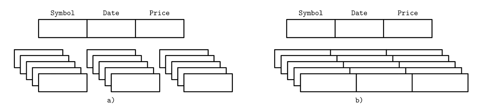
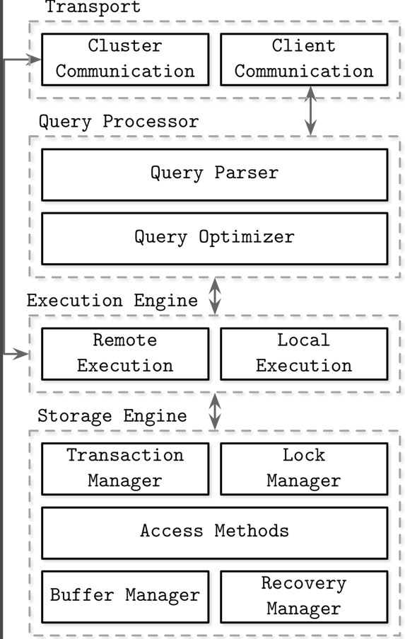
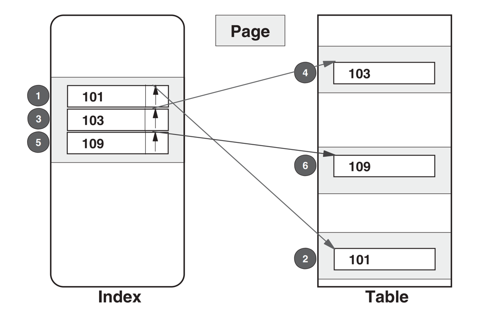
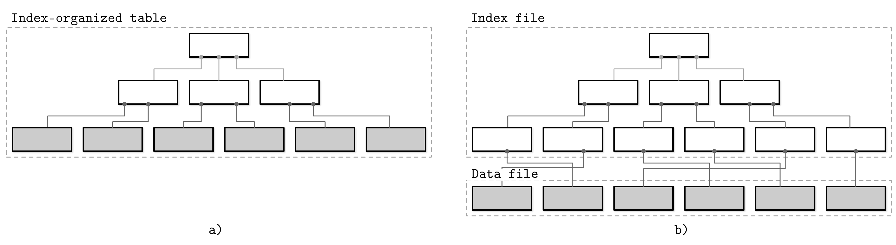
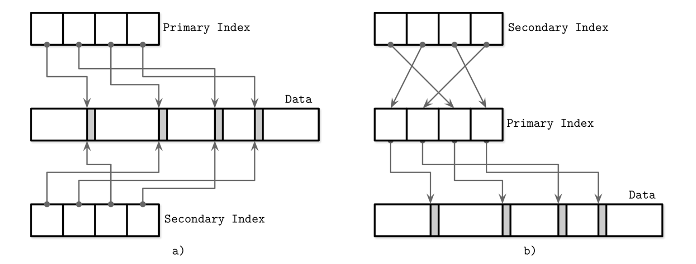

## Introduction

Database management systems can serve different purposes: some are used primarily for temporary hot data, some serve as a long-lived cold storage, some allow complex analytical queries, some only allow accessing values by the key, some are optimized to store time-series data, and some store large blobs efficiently. 


> Knowledge Base of Relational and NoSQL Database Management Systems in [DB-Engines](https://db-engines.com/en/ranking)


Every database system has strengths and weaknesses. To reduce the risk of an expensive migration, you can invest some time before you decide on a specific database to build confidence in its ability to meet your application’s needs.

To compare databases, it’s helpful to understand the use case in great detail and define the current and anticipated variables, such as:
- Schema and record sizes
- Number of clients
- Types of queries and access patterns
- Rates of the read and write queries
- Expected changes in any of these variables


### Memory- Versus Disk-Based

Database systems store data in memory and on disk. In-memory database management systems (sometimes called main memory DBMS) store data primarily in memory and use the disk for recovery and logging. 
Disk-based DBMS hold most of the data on disk and use memory for caching disk contents or as a temporary storage. 
Both types of systems use the disk to a certain extent, but main memory databases store their contents almost exclusively in RAM.

Main memory database systems are different from their disk-based counterparts not only in terms of a primary storage medium, but also in which data structures, organization, and optimization techniques they use.

Databases using memory as a primary data store do this mainly because of performance, comparatively low access costs, and access granularity. 
Programming for main memory is also significantly simpler than doing so for the disk. 
Operating systems abstract memory management and allow us to think in terms of allocating and freeing arbitrarily sized memory chunks.
On disk, we have to manage data references, serialization formats, freed memory, and fragmentation manually.

The main limiting factors on the growth of in-memory databases are RAM volatility (in other words, lack of durability) and costs. 
Since RAM contents are not persistent, software errors, crashes, hardware failures, and power outages can result in data loss. 
There are ways to ensure durability, such as uninterrupted power supplies and battery-backed RAM, but they require additional hardware resources and operational expertise. In practice, it all comes down to the fact that disks are easier to maintain and have significantly lower prices.

The situation is likely to change as the availability and popularity of Non-Volatile Memory (NVM) technologies grow. 
NVM storage reduces or completely eliminates (depending on the exact technology) asymmetry between read and write latencies, further improves read and write performance, and allows byte-addressable access.


In-memory database systems maintain backups on disk to provide durability and prevent loss of the volatile data. Some databases store data exclusively in memory, without any durability guarantees, but we do not discuss them in the scope of this book.

Before the operation can be considered complete, its results have to be written to a sequential log file. 
To avoid replaying complete log contents during startup or after a crash, in-memory stores maintain a backup copy. 
The backup copy is maintained as a sorted disk-based structure, and modifications to this structure are often asynchronous (decoupled from client requests) and applied in batches to reduce the number of I/O operations. 
During recovery, database contents can be restored from the backup and logs.

Log records are usually applied to backup in batches. After the batch of log records is processed, backup holds a database snapshot for a specific point in time, and log contents up to this point can be discarded. 
This process is called checkpointing. 
It reduces recovery times by keeping the disk-resident database most up-to-date with log entries without requiring clients to block until the backup is updated.

Disk-based databases use specialized storage structures, optimized for disk access. In memory, pointers can be followed comparatively quickly, and random memory access is significantly faster than the random disk access.
Disk-based storage structures often have a form of wide and short trees, while memory-based implementations can choose from a larger pool of data structures and perform optimizations that would otherwise be impossible or difficult to implement on disk. 
Similarly, handling variable-size data on disk requires special attention, while in memory it’s often a matter of referencing the value with a pointer.

For some use cases, it is reasonable to assume that an entire dataset is going to fit in memory.
Some datasets are bounded by their real-world representations, such as student records for schools, customer records for corporations, or inventory in an online store. Each record takes up not more than a few Kb, and their number is limited.

### Column- Versus Row-Oriented


One of the ways to classify databases is by how the data is stored on disk: row- or column-wise. 
Tables can be partitioned either horizontally (storing values belonging to the same row together), or vertically (storing values belonging to the same column together). 
Figure 2 depicts this distinction: (a) shows the values partitioned column-wise, and (b) shows the values partitioned row-wise.


<div style="text-align: center;">



</div>

<p style="text-align: center;">
Fig.1. Data layout in column- and row-oriented stores
</p>

Row-oriented database management systems store data in records or rows. Their layout is quite close to the tabular data representation, where every row has the same set of fields.
Since row-oriented stores are most useful in scenarios when we have to access data by row, storing entire rows together improves spatial locality.

Column-oriented database management systems partition data vertically (i.e., by column) instead of storing it in rows. Here, values for the same column are stored contiguously on disk.
Column-oriented stores are a good fit for analytical workloads that compute aggregates, such as finding trends, computing average values, etc. Processing complex aggregates can be used in cases when logical records have multiple fields, but some of them have different importance and are often consumed together.
Storing values that have the same data type together (e.g., numbers with other numbers, strings with other strings) offers a better compression ratio.

#### Wide Column Stores

Column-oriented databases should not be mixed up with wide column stores, such as BigTable or HBase, where data is represented as a multidimensional map, columns are grouped into column families (usually storing data of the same type), and inside each column family, data is stored row-wise. This layout is best for storing data retrieved by a key or a sequence of keys.


## Architecture

Database management systems use a client/server model, where database system instances (nodes) take the role of servers, and application instances take the role of clients.

Databases are modular systems and consist of multiple parts: a transport layer accepting requests, a query processor determining the most efficient way to run queries, an execution engine carrying out the operations, and a storage engine.


<div style="text-align: center;">



</div>

<p style="text-align: center;">
Fig.1. Architecture of a database management system
</p>


Client requests arrive through the transport subsystem. Requests come in the form of queries, most often expressed in some query language.
The transport subsystem is also responsible for communication with other nodes in the database cluster.

Upon receipt, the transport subsystem hands the query over to a query processor, which parses, interprets, and validates it.
Later, access control checks are performed, as they can be done fully only after the query is interpreted.

The parsed query is passed to the query optimizer, which first eliminates impossible and redundant parts of the query, 
and then attempts to find the most efficient way to execute it based on internal statistics (index cardinality, approximate intersection size, etc.) and data placement (which nodes in the cluster hold the data and the costs associated with its transfer).
The optimizer handles both relational operations required for query resolution, usually presented as a dependency tree, and optimizations, such as index ordering, cardinality estimation, and choosing access methods.

The query is usually presented in the form of an execution plan (or query plan): a sequence of operations that have to be carried out for its results to be considered complete.
Since the same query can be satisfied using different execution plans that can vary in efficiency, the optimizer picks the best available plan.

The execution plan is handled by the execution engine, which collects the results of the execution of local and remote operations. Remote execution can involve writing and reading data to and from other nodes in the cluster, and replication.

Local queries (coming directly from clients or from other nodes) are executed by the storage engine.

###  storage engine


The storage engine (or database engine) is a software component of a database management system responsible for storing, retrieving, and managing data in memory and on disk, designed to capture a persistent, long-term memory of each node. While databases can respond to complex queries, storage engines look at the data more granularly and offer a simple data manipulation API, allowing users to create, update, delete, and retrieve records. One way to look at this is that database management systems are applications built on top of storage engines, offering a schema, a query language, indexing, transactions, and many other useful features.

For flexibility, both keys and values can be arbitrary sequences of bytes with no prescribed form. Their sorting and representation semantics are defined in higher-level subsystems. For example, you can use int32 (32-bit integer) as a key in one of the tables, and ascii (ASCII string) in the other; from the storage engine perspective both keys are just serialized entries.

Storage engines such as BerkeleyDB, LevelDB and its descendant RocksDB, LMDB and its descendant libmdbx, Sophia, HaloDB, and many others were developed independently from the database management systems they’re now embedded into. Using pluggable storage engines has enabled database developers to bootstrap database systems using existing storage engines, and concentrate on the other subsystems.

At the same time, clear separation between database system components opens up an opportunity to switch between different engines, potentially better suited for particular use cases. 


The storage engine has several components with dedicated responsibilities:
- Transaction manager<br>
  This manager schedules transactions and ensures they cannot leave the database in a logically inconsistent state.
- Lock manager<br>
  This manager locks on the database objects for the running transactions, ensuring that concurrent operations do not violate physical data integrity.
- Access methods (storage structures)<br>
  These manage access and organizing data on disk. Access methods include heap files and storage structures such as B-Trees or LSM Trees.
- Buffer manager<br>
  This manager caches data pages in memory.
-  Recovery manager<br>
   This manager maintains the operation log and restoring the system state in case of a failure.

Together, transaction and lock managers are responsible for concurrency control: they guarantee logical and physical data integrity while ensuring that concurrent operations are executed as efficiently as possible.


A storage engine is based on some data structure. However, these structures do not describe the semantics of caching, recovery, transactionality, and other things that storage engines add on top of them.

Storage structures have three common variables: they use *buffering* (or avoid using it), use *immutable* (or mutable) files, and store values in *order* (or out of order). 

- **Buffering**<br>
  This defines whether or not the storage structure chooses to collect a certain amount of data in memory before putting it on disk. <br>
  Of course, every on-disk structure has to use buffering to some degree, since the smallest unit of data transfer to and from the disk is a block, and it is desirable to write full blocks. <br>
  Here, we’re talking about avoidable buffering, something storage engine implementers choose to do. <br>
  One of the first optimizations we discuss in this book is adding in-memory buffers to B-Tree nodes to amortize I/O costs.
  However, this is not the only way we can apply buffering. <br>
  For example, two-component LSM Trees, despite their similarities with B-Trees, use buffering in an entirely different way, and combine buffering with immutability.
- **Mutability** (or immutability)<br>
  This defines whether or not the storage structure reads parts of the file, updates them, and writes the updated results at the same location in the file. <br>
  Immutable structures are append-only: once written, file contents are not modified. Instead, modifications are appended to the end of the file. 
  There are other ways to implement immutability. <br>
  One of them is copy-on-write, where the modified page, holding the updated version of the record, is written to the new location in the file, instead of its original location. <br>
  Often the distinction between LSM and B-Trees is drawn as immutable against in-place update storage, but there are structures (for example, “Bw-Trees”) that are inspired by B-Trees but are immutable.
- **Ordering**<br>
  This is defined as whether or not the data records are stored in the key order in the pages on disk.
   In other words, the keys that sort closely are stored in contiguous segments on disk. <br>
  Ordering often defines whether or not we can efficiently scan the range of records, not only locate the individual data records. <br>
  Storing data out of order (most often, in insertion order) opens up for some write-time optimizations. 
  For example, Bitcask and WiscKey store data records directly in append-only files.


We separated storage structures in two groups: mutable and immutable ones, and identified immutability as one of the core concepts influencing their design and implementation. Most of the mutable storage structures use an in-place update mechanism. During insert, delete, or update operations, data records are updated directly in their locations in the target file.

Storage engines often allow multiple versions of the same data record to be present in the database; for example, when using multiversion concurrency control (see “Multiversion Concurrency Control”) or slotted page organization (see “Slotted Pages”). For the sake of simplicity, for now we assume that each key is associated only with one data record, which has a unique location.

One of the most popular storage structures is a B-Tree. Many open source database systems are B-Tree based, and over the years they’ve proven to cover the majority of use cases.


### optimizer


One of the long-standing advantages of relational databases has been that data is requested with little or no thought for the way in which the data is to be accessed.
This decision is made by a component of the DBMS called the optimizer. 
These have varied widely across different relational systems and probably always will, but they all try to access the data in the most effective way possible, using statistics stored by the system collected on the data.


Before an SQL statement can be executed, the optimizer must first decide how to access the data; which index, if any, should be used; how the index should be used; should assisted random read be used; and so forth. 
All of this information is embodied in the access path.


<div style="text-align: center;">



</div>

<p style="text-align: center;">
Fig.2. Traditional index scan.
</p>

Index Slices and Matching Columns
Thus a thin slice of the index, depicted in Figure 3.1, will be sequentially scanned,
and for each index row having a value between 100 and 110, the corresponding
row will be accessed from the table using a synchronous read unless the page
is already in the buffer pool. The cost of the access path is clearly going to
depend on the thickness of the slice, which in turn will depend on the range
predicate; a thicker slice will, of course, require more index pages to be read
sequentially and more index rows will have to be processed. The real increase
in cost though is going to come from an increase in the number of synchronous
reads to the table at a cost of perhaps 10 ms per page. Similarly, a thinner slice
will certainly reduce the index costs, but again the major saving will be due to
fewer synchronous reads to the table. The size of the index slice may be very
important for this reason.

The term index slice is not one that is used by any of the relational database
systems; these all use their own terminology, but we feel that an index slice
is a much more descriptive term and one that we can use regardless of DBMS.
Another way that is often used to describe an index slice is to define the number of
matching columns used in the processing of the index. In our example (having
a value between 100 and 110), we have only a single matching column. 
This single matching column in fact defines the thickness of our slice. If there had
been a second column, both in the WHERE clause and in the index, such that the
two columns together were able to define an even thinner slice of the index, we
would have two matching columns. Less index processing would be required,
but of even greater importance, fewer synchronous reads to the table would
be required.


#### Index Screening and Screening Columns

Sometimes a column may indeed be in both the WHERE clause and in the index, suffice it to say at this time that not all columns in the index are able to define the index slice.
Such columns, however, may still be able to reduce the number of synchronous reads to the table and so play the more important part.
We will call these columns screening columns, as indeed do some relational database systems, because this is exactly what they do. 
They avoid the necessity of accessing the table rows because they are able to determine that it is not necessary to do so by their very presence in the index.

Examine index columns from leading to trailing
1. In the WHERE clause, does a column have at least one simple enough predicate referring to it?
   If yes, the column is an M column.
   If not, this column and the remaining columns are not M columns.
2. If the predicate is a range predicate, the remaining columns are not M columns.
3. Any column after the last M column is an S column if there is a simple enough predicate referring to that column.

#### Access Path Terminology

Unfortunately, the terminology used to describe access paths is far from standardized—even the term access path itself, another term that is often used being the execution plan.
We will use access path when referring to the way the data is actually accessed; we will use execution plan when referring to the output provided by the DBMS by means of an `EXPLAIN` facility (described below). 
This is a subtle distinction, and it is really of no consequence if the terms are used interchangeably.

The execution plan is handled by the execution engine, which collects the results of the execution of local and remote operations. Remote execution can involve writing and reading data to and from other nodes in the cluster, and replication.

Matching predicates are sometimes called range delimiting predicates. 
If a predicate is simple enough for an optimizer in the sense that it is a matching predicate when a suitable index is available, it is called indexable or sargable. 
The opposite term is nonindexable or nonsargable.

SQL Server uses the term table lookup for an access path that uses an index but also reads table rows. This is the opposite of index only. 
The obvious way to eliminate the table accesses is to add the missing columns to the index. 
Many SQL Server books call an index a covering index when it makes an index-only access path possible for a SELECT call. 
SELECT statements that use a covering index are sometimes called covering SELECTs.


### Transaction manager
Local queries (coming directly from clients or from other nodes) are executed by the storage engine.
The storage engine has several components with dedicated responsibilities:


This manager schedules transactions and ensures they cannot leave the database in a logically inconsistent state.

Lock manager

This manager locks on the database objects for the running transactions, ensuring that concurrent operations do not violate physical data integrity.

Access methods (storage structures)

These manage access and organizing data on disk. Access methods include heap files and storage structures such as B-Trees or LSM Trees.

Buffer manager

This manager caches data pages in memory (see “Buffer Management”).

Recovery manager

This manager maintains the operation log and restoring the system state in case of a failure (see “Recovery”).

Together, transaction and lock managers are responsible for concurrency control (see “Concurrency Control”):
they guarantee logical and physical data integrity while ensuring that concurrent operations are executed as efficiently as possible.

Storage data layer

Cache Layer

Transport Layer

Execute Layer

Log Layer

Authority Layer

Tolerance

concurrency

A version of the tree that would be better suited for disk implementation has to exhibit the following properties:

- High fanout to improve locality of the neighboring keys.
- Low height to reduce the number of seeks during traversal.

> [!TIP]
>
> Fanout and height are inversely correlated: the higher the fanout, the lower the height.
> If fanout is high, each node can hold more children, reducing the number of nodes and, subsequently, reducing height.

#### Buffer Management

Most databases are built using a two-level memory hierarchy: slower persistent storage (disk) and faster main memory (RAM). To reduce the number of accesses to persistent storage, pages are cached in memory. When the page is requested again by the storage layer, its cached copy is returned.

Cached pages available in memory can be reused under the assumption that no other process has modified the data on disk. This approach is sometimes referenced as virtual disk [BAYER72]. A virtual disk read accesses physical storage only if no copy of the page is already available in memory. A more common name for the same concept is page cache or buffer pool. The page cache is responsible for caching pages read from disk in memory. In case of a database system crash or unorderly shutdown, cached contents are lost.

The problem of caching pages is not limited in scope to databases. Operating systems have the concept of a page cache, too. Operating systems utilize unused memory segments to transparently cache disk contents to improve performance of I/O syscalls.

Uncached pages are said to be paged in when they’re loaded from disk. If any changes are made to the cached page, it is said to be dirty, until these changes are flushed back on disk.

Since the memory region where cached pages are held is usually substantially smaller than an entire dataset, the page cache eventually fills up and, in order to page in a new page, one of the cached pages has to be evicted.

The primary functions of a page cache can be summarized as:

- It keeps cached page contents in memory.
- It allows modifications to on-disk pages to be buffered together and performed against their cached versions.
- When a requested page isn’t present in memory and there’s enough space available for it, it is paged in by the page cache, and its cached version is returned.
- If an already cached page is requested, its cached version is returned.
- If there’s not enough space available for the new page, some other page is evicted and its contents are flushed to disk.

> [!NOTE]
> Many database systems open files using O_DIRECT flag. This flag allows I/O system calls to bypass the kernel page cache, access the disk directly, and use database-specific buffer management. This is sometimes frowned upon by the operating systems folks.
> Linus Torvalds has criticized usage of O_DIRECT since it’s not asynchronous and has no readahead or other means for instructing the kernel about access patterns. However, until operating systems start offering better mechanisms, O_DIRECT is still going to be useful.
> We can gain some control over how the kernel evicts pages from its cache is by using fadvise, but this only allows us to ask the kernel to consider our opinion and does not guarantee it will actually happen. To avoid syscalls when performing I/O, we can use memory mapping, but then we lose control over caching.

##### Caching Semantics

All changes made to buffers are kept in memory until they are eventually written back to disk. As no other process is allowed to make changes to the backing file, this synchronization is a one-way process: from memory to disk, and not vice versa. The page cache allows the database to have more control over memory management and disk accesses. You can think of it as an application-specific equivalent of the kernel page cache: it accesses the block device directly, implements similar functionality, and serves a similar purpose. It abstracts disk accesses and decouples logical write operations from the physical ones.

Caching pages helps to keep the tree partially in memory without making additional changes to the algorithm and materializing objects in memory. All we have to do is replace disk accesses by the calls to the page cache.

When the storage engine accesses (in other words, requests) the page, we first check if its contents are already cached, in which case the cached page contents are returned. If the page contents are not yet cached, the cache translates the logical page address or page number to its physical address, loads its contents in memory, and returns its cached version to the storage engine. Once returned, the buffer with cached page contents is said to be referenced, and the storage engine has to hand it back to the page cache or dereference it once it’s done. The page cache can be instructed to avoid evicting pages by pinning them.

If the page is modified (for example, a cell was appended to it), it is marked as dirty. A dirty flag set on the page indicates that its contents are out of sync with the disk and have to be flushed for durability.


##### Cache Eviction

Keeping caches populated is good: we can serve more reads without going to persistent storage, and more same-page writes can be buffered together. However, the page cache has a limited capacity and, sooner or later, to serve the new contents, old pages have to be evicted. If page contents are in sync with the disk (i.e., were already flushed or were never modified) and the page is not pinned or referenced, it can be evicted right away. Dirty pages have to be flushed before they can be evicted. Referenced pages should not be evicted while some other thread is using them.

Since triggering a flush on every eviction might be bad for performance, some databases use a separate background process that cycles through the dirty pages that are likely to be evicted, updating their disk versions. For example, PostgreSQL has a background flush writer that does just that.

Another important property to keep in mind is durability: if the database has crashed, all data that was not flushed is lost. To make sure that all changes are persisted, flushes are coordinated by the checkpoint process. The checkpoint process controls the write-ahead log (WAL) and page cache, and ensures that they work in lockstep. Only log records associated with operations applied to cached pages that were flushed can be discarded from the WAL. Dirty pages cannot be evicted until this process completes.


This means there is always a trade-off between several objectives:
- Postpone flushes to reduce the number of disk accesses
- Preemptively flush pages to allow quick eviction
- Pick pages for eviction and flush in the optimal order
- Keep cache size within its memory bounds
- Avoid losing the data as it is not persisted to the primary storage


##### Locking Pages in Cache

Having to perform disk I/O on each read or write is impractical: subsequent reads may request the same page, just as subsequent writes may modify the same page. Since B-Tree gets “narrower” toward the top, higher-level nodes (ones that are closer to the root) are hit for most of the reads. Splits and merges also eventually propagate to the higher-level nodes. This means there’s always at least a part of a tree that can significantly benefit from being cached.

We can “lock” pages that have a high probability of being used in the nearest time. Locking pages in the cache is called pinning. Pinned pages are kept in memory for a longer time, which helps to reduce the number of disk accesses and improve performance.


Since each lower B-Tree node level has exponentially more nodes than the higher one, and higher-level nodes represent just a small fraction of the tree, this part of the tree can reside in memory permanently, and other parts can be paged in on demand. 
This means that, in order to perform a query, we won’t have to make h disk accesses (as discussed in “B-Tree Lookup Complexity”, h is the height of the tree), but only hit the disk for the lower levels, for which pages are not cached.

Operations performed against a subtree may result in structural changes that contradict each other—for example, multiple delete operations causing merges followed by writes causing splits, or vice versa. 
Likewise for structural changes that propagate from different subtrees (structural changes occurring close to each other in time, in different parts of the tree, propagating up). 
These operations can be buffered together by applying changes only in memory, which can reduce the number of disk writes and amortize the operation costs, since only one write can be performed instead of multiple writes.


> The page cache also allows the storage engine to have fine-grained control over prefetching and eviction. It can be instructed to load pages ahead of time, before they are accessed. For example, when the leaf nodes are traversed in a range scan, the next leaves can be preloaded. Similarly, if a maintenance process loads the page, it can be evicted immediately after the process finishes, since it’s unlikely to be useful for the in-flight queries. Some databases, for example, PostgreSQL, use a circular buffer (in other words, FIFO page replacement policy) for large sequential scans.


## store

Database systems do use files for storing the data, but instead of relying on filesystem hierarchies of directories and files for locating records, they compose files using implementation-specific formats. The main reasons to use specialized file organization over flat files are:

- Storage efficiency<br>
   Files are organized in a way that minimizes storage overhead per stored data record.
- Access efficiency<br>
   Records can be located in the smallest possible number of steps.
- Update efficiency<br>
   Record updates are performed in a way that minimizes the number of changes on disk.

Database systems store data records, consisting of multiple fields, in tables, where each table is usually represented as a separate file. Each record in the table can be looked up using a search key. To locate a record, database systems use indexes: auxiliary data structures that allow it to efficiently locate data records without scanning an entire table on every access. Indexes are built using a subset of fields identifying the record.

A database system usually separates data files and index files: data files store data records, while index files store record metadata and use it to locate records in data files. 
Index files are typically smaller than the data files. 
Files are partitioned into pages, which typically have the size of a single or multiple disk blocks.
Pages can be organized as sequences of records or as a slotted pages.

New records (insertions) and updates to the existing records are represented by key/value pairs. 
Most modern storage systems do not delete data from pages explicitly. Instead, they use deletion markers (also called tombstones), which contain deletion metadata, such as a key and a timestamp. 
Space occupied by the records shadowed by their updates or deletion markers is reclaimed during garbage collection, which reads the pages, writes the live (i.e., nonshadowed) records to the new place, and discards the shadowed ones.

### Data Files

Data files (sometimes called *primary files*) can be implemented as *index-organized tables* (IOT), *heap-organized tables* (heap files), or *hash-organized tables* (hashed files).

- Records in heap files are not required to follow any particular order, and most of the time they are placed in a write order. This way, no additional work or file reorganization is required when new pages are appended. Heap files require additional index structures, pointing to the locations where data records are stored, to make them searchable.
- In hashed files, records are stored in buckets, and the hash value of the key determines which bucket a record belongs to. Records in the bucket can be stored in append order or sorted by key to improve lookup speed.
- Index-organized tables (IOTs) store data records in the index itself. Since records are stored in key order, range scans in IOTs can be implemented by sequentially scanning its contents.<br>
  Storing data records in the index allows us to reduce the number of disk seeks by at least one, since after traversing the index and locating the searched key, we do not have to address a separate file to find the associated data record.

When records are stored in a separate file, index files hold data entries, uniquely identifying data records and containing enough information to locate them in the data file. For example, we can store file offsets (sometimes called row locators), locations of data records in the data file, or bucket IDs in the case of hash files. In index-organized tables, data entries hold actual data records.

### Index Files

An index is a structure that organizes data records on disk in a way that facilitates efficient retrieval operations. Index files are organized as specialized structures that map keys to locations in data files where the records identified by these keys (in the case of heap files) or primary keys (in the case of index-organized tables) are stored.

An index on a primary (data) file is called the primary index. However, in most cases we can also assume that the primary index is built over a primary key or a set of keys identified as primary. All other indexes are called secondary.

Secondary indexes can point directly to the data record, or simply store its primary key. A pointer to a data record can hold an offset to a heap file or an index-organized table. Multiple secondary indexes can point to the same record, allowing a single data record to be identified by different fields and located through different indexes. While primary index files hold a unique entry per search key, secondary indexes may hold several entries per search key.

If the order of data records follows the search key order, this index is called clustered (also known as clustering). Data records in the clustered case are usually stored in the same file or in a clustered file, where the key order is preserved. If the data is stored in a separate file, and its order does not follow the key order, the index is called nonclustered (sometimes called unclustered).

Figure 3 shows the difference between the two approaches:
- a) Two indexes reference data entries directly from secondary index files.
- b) A secondary index goes through the indirection layer of a primary index to locate the data entries.


<div style="text-align: center;">



</div>

<p style="text-align: center;">
Fig.3. Storing data records in an index file versus storing offsets to the data file (index segments shown in white; segments holding data records shown in gray).
</p>

> [!TIP]
> Index-organized tables store information in index order and are clustered by definition. <br>
> Primary indexes are most often clustered. Secondary indexes are nonclustered by definition, since they’re used to facilitate access by keys other than the primary one. <br>
> Clustered indexes can be both index-organized or have separate index and data files.

Many database systems have an inherent and explicit primary key, a set of columns that uniquely identify the database record. In cases when the primary key is not specified, the storage engine can create an implicit primary key (for example, MySQL InnoDB adds a new auto-increment column and fills in its values automatically).


#### Primary Index as an Indirection

By referencing data directly, we can reduce the number of disk seeks, but have to pay a cost of updating the pointers whenever the record is updated or relocated during a maintenance process. Using indirection in the form of a primary index allows us to reduce the cost of pointer updates, but has a higher cost on a read path.

Updating just a couple of indexes might work if the workload mostly consists of reads, but this approach does not work well for write-heavy workloads with multiple indexes. To reduce the costs of pointer updates, instead of payload offsets, some implementations use primary keys for indirection. For example, MySQL InnoDB uses a primary index and performs two lookups: one in the secondary index, and one in a primary index when performing a query.
This adds an overhead of a primary index lookup instead of following the offset directly from the secondary index.

Figure 6 shows how the two approaches are different:

- a) Two indexes reference data entries directly from secondary index files.
- b) A secondary index goes through the indirection layer of a primary index to locate the data entries.


<div style="text-align: center;">



</div>

<p style="text-align: center;">
Fig.6. Referencing data tuples directly (a) versus using a primary index as indirection (b).
</p>

It is also possible to use a hybrid approach and store both data file offsets and primary keys. First, you check if the data offset is still valid and pay the extra cost of going through the primary key index if it has changed, updating the index file after finding a new offset.


## OLAP

Table. Comparing characteristics of transaction processing versus analytic systems


| Property             | Transaction processing systems (OLTP)             | Analytic systems (OLAP)                   |
| ---------------------- | --------------------------------------------------- | ------------------------------------------- |
| Main read pattern    | Small number of records per query, fetched by key | Aggregate over large number of records    |
| Main write pattern   | Random-access, low-latency writes from user input | Bulk import (ETL) or event stream         |
| Primarily used by    | End user/customer, via web application            | Internal analyst, for decision support    |
| What data represents | Latest state of data (current point in time)      | History of events that happened over time |
| Dataset size         | Gigabytes to terabytes                            | Terabytes to petabytes                    |

At first, the same databases were used for both transaction processing and analytic queries.
SQL turned out to be quite flexible in this regard: it works well for OLTPtype queries as well as OLAP-type queries. 
Nevertheless, in the late 1980s and early 1990s, there was a trend for companies to stop using their OLTP systems for analytics purposes, and to run the analytics on a separate database instead. 
This separate database was called a *data warehouse*

### Data Warehousing

An enterprise may have dozens of different transaction processing systems: systems powering the customer-facing website, controlling point of sale (checkout) systems in physical stores, 
tracking inventory in warehouses, planning routes for vehicles, managing suppliers, administering employees, etc. 
Each of these systems is complex and needs a team of people to maintain it, so the systems end up operating mostly autonomously from each other.
These OLTP systems are usually expected to be highly available and to process transactions with low latency, since they are often critical to the operation of the business. 
Database administrators therefore closely guard their OLTP databases. 
They are usually reluctant to let business analysts run ad hoc analytic queries on an OLTP database, since those queries are often expensive, scanning large parts of the dataset, which can harm the performance of concurrently executing transactions.

A data warehouse, by contrast, is a separate database that analysts can query to their hearts’ content, without affecting OLTP operations. 
The data warehouse contains a read-only copy of the data in all the various OLTP systems in the company.
Data is extracted from OLTP databases (using either a periodic data dump or a continuous stream of updates), transformed into an analysis-friendly schema, cleaned up, and then loaded into the data warehouse. 
This process of getting data into the warehouse is known as Extract–Transform–Load (ETL).

A big advantage of using a separate data warehouse, rather than querying OLTP systems directly for analytics, is that the data warehouse can be optimized for analytic access patterns. 
It turns out that the indexing algorithms work well for OLTP, but are not very good at answering analytic queries.

The data model of a data warehouse is most commonly relational, because SQL is generally a good fit for analytic queries.
There are many graphical data analysis tools that generate SQL queries, visualize the results, and allow analysts to explore the data(through operations such as drill-down and slicing and dicing).
On the surface, a data warehouse and a relational OLTP database look similar, because they both have a SQL query interface. 
However, the internals of the systems can look quite different, because they are optimized for very different query patterns.
Many database vendors now focus on supporting either transaction processing or analytics workloads, but not both.
Some databases, such as Microsoft SQL Server and SAP HANA, have support for transaction processing and data warehousing in the same product. However, they are increasingly becoming two separate storage and query engines, which happen to be accessible through a common SQL interface.

## Transaction

### Recovery

A *write-ahead log* (WAL for short, also known as a commit log) is an append-only auxiliary disk-resident structure used for crash and transaction recovery. The page cache allows buffering changes to page contents in memory. Until the cached contents are flushed back to disk, the only disk-resident copy preserving the operation history is stored in the WAL. Many database systems use append-only write-ahead logs; for example, PostgreSQL and MySQL.

The main functionality of a write-ahead log can be summarized as:

- Allow the page cache to buffer updates to disk-resident pages while ensuring durability semantics in the larger context of a database system.
- Persist all operations on disk until the cached copies of pages affected by these operations are synchronized on disk. Every operation that modifies the database state has to be logged on disk before the contents of the associated pages can be modified.
- Allow lost in-memory changes to be reconstructed from the operation log in case of a crash.


In addition to this functionality, the write-ahead log plays an important role in transaction processing. It is hard to overstate the importance of the WAL as it ensures that data makes it to the persistent storage and is available in case of a crash, as uncommitted data is replayed from the log and the pre-crash database state is fully restored.


The write-ahead log is append-only and its written contents are immutable, so all writes to the log are sequential. Since the WAL is an immutable, append-only data structure, readers can safely access its contents up to the latest write threshold while the writer continues appending data to the log tail.

The WAL consists of log records. Every record has a unique, monotonically increasing log sequence number (LSN). Usually, the LSN is represented by an internal counter or a timestamp. Since log records do not necessarily occupy an entire disk block, their contents are cached in the log buffer and are flushed on disk in a force operation. Forces happen as the log buffers fill up, and can be requested by the transaction manager or a page cache. All log records have to be flushed on disk in LSN order.

Besides individual operation records, the WAL holds records indicating transaction completion. A transaction can’t be considered committed until the log is forced up to the LSN of its commit record.

To make sure the system can continue functioning correctly after a crash during rollback or recovery, some systems use compensation log records (CLR) during undo and store them in the log.

The WAL is usually coupled with a primary storage structure by the interface that allows trimming it whenever a checkpoint is reached. Logging is one of the most critical correctness aspects of the database, which is somewhat tricky to get right: even the slightest disagreements between log trimming and ensuring that the data has made it to the primary storage structure may cause data loss.

Checkpoints are a way for a log to know that log records up to a certain mark are fully persisted and aren’t required anymore, which significantly reduces the amount of work required during the database startup. A process that forces all dirty pages to be flushed on disk is generally called a sync checkpoint, as it fully synchronizes the primary storage structure.

Flushing the entire contents on disk is rather impractical and would require pausing all running operations until the checkpoint is done, so most database systems implement fuzzy checkpoints. In this case, the last_checkpoint pointer stored in the log header contains the information about the last successful checkpoint. A fuzzy checkpoint begins with a special begin_checkpoint log record specifying its start, and ends with end_checkpoint log record, containing information about the dirty pages, and the contents of a transaction table. Until all the pages specified by this record are flushed, the checkpoint is considered to be incomplete. Pages are flushed asynchronously and, once this is done, the last_checkpoint record is updated with the LSN of the begin_checkpoint record and, in case of a crash, the recovery process will start from there.

#### Operation Versus Data Log

Some database systems, for example System R [CHAMBERLIN81], use shadow paging: a copy-on-write technique ensuring data durability and transaction atomicity. New contents are placed into the new unpublished shadow page and made visible with a pointer flip, from the old page to the one holding updated contents.

Any state change can be represented by a before-image and an after-image or by corresponding redo and undo operations. Applying a redo operation to a before-image produces an after-image. Similarly, applying an undo operation to an after-image produces a before-image.

We can use a physical log (that stores complete page state or byte-wise changes to it) or a logical log (that stores operations that have to be performed against the current state) to move records or pages from one state to the other, both backward and forward in time. It is important to track the exact state of the pages that physical and logical log records can be applied to.

Physical logging records before and after images, requiring entire pages affected by the operation to be logged. A logical log specifies which operations have to be applied to the page, such as "insert a data record X for key Y", and a corresponding undo operation, such as "remove the value associated with Y".

In practice, many database systems use a combination of these two approaches, using logical logging to perform an undo (for concurrency and performance) and physical logging to perform a redo (to improve recovery time).

#### Steal and Force Policies

To determine when the changes made in memory have to be flushed on disk, database management systems define steal/no-steal and force/no-force policies.
These policies are mostly applicable to the page cache, but they’re better discussed in the context of recovery, since they have a significant impact on which recovery approaches can be used in combination with them.

A recovery method that allows flushing a page modified by the transaction even before the transaction has committed is called a steal policy. 
A no-steal policy does not allow flushing any uncommitted transaction contents on disk. 
To steal a dirty page here means flushing its in-memory contents to disk and loading a different page from disk in its place.

A force policy requires all pages modified by the transactions to be flushed on disk before the transaction commits. 
On the other hand, a no-force policy allows a transaction to commit even if some pages modified during this transaction were not yet flushed on disk. 
To force a dirty page here means to flush it on disk before the commit.

Steal and force policies are important to understand, since they have implications for transaction undo and redo.
Undo rolls back updates to forced pages for committed transactions, while redo applies changes performed by committed transactions on disk.

Using the no-steal policy allows implementing recovery using only redo entries: old copy is contained in the page on disk and modification is stored in the log. 
With no-force, we potentially can buffer several updates to pages by deferring them. Since page contents have to be cached in memory for that time, a larger page cache may be needed.

When the force policy is used, crash recovery doesn’t need any additional work to reconstruct the results of committed transactions, since pages modified by these transactions are already flushed. 
A major drawback of using this approach is that transactions take longer to commit due to the necessary I/O.

More generally, until the transaction commits, we need to have enough information to undo its results. 
If any pages touched by the transaction are flushed, we need to keep undo information in the log until it commits to be able to roll it back. 
Otherwise, we have to keep redo records in the log until it commits. In both cases, transaction cannot commit until either undo or redo records are written to the logfile.


### Concurrency Control

#### Why is concurrency control needed?

If transactions are executed *serially*, i.e., sequentially with no overlap in time, no transaction concurrency exists. However, if concurrent transactions with interleaving operations are allowed in an uncontrolled manner, some unexpected, undesirable results may occur, such as:

1. The lost update problem: A second transaction writes a second value of a data-item (datum) on top of a first value written by a first concurrent transaction, and the first value is lost to other transactions running concurrently which need, by their precedence, to read the first value. The transactions that have read the wrong value end with incorrect results.
2. The dirty read problem: Transactions read a value written by a transaction that has been later aborted. This value disappears from the database upon abort, and should not have been read by any transaction ("dirty read"). The reading transactions end with incorrect results.
3. The incorrect summary problem: While one transaction takes a summary over the values of all the instances of a repeated data-item, a second transaction updates some instances of that data-item. The resulting summary does not reflect a correct result for any (usually needed for correctness) precedence order between the two transactions (if one is executed before the other), but rather some random result, depending on the timing of the updates, and whether certain update results have been included in the summary or not.

Most high-performance transactional systems need to run transactions concurrently to meet their performance requirements. Thus, without concurrency control such systems can neither provide correct results nor maintain their databases consistently.

#### Concurrency control mechanisms

#### Categories

The main categories of concurrency control mechanisms are:

- **[Optimistic](https://en.wikipedia.org/wiki/Optimistic_concurrency_control)** - Delay the checking of whether a transaction meets the isolation and other integrity rules (e.g., [serializability](https://en.wikipedia.org/wiki/Serializability) and [recoverability](https://en.wikipedia.org/wiki/Serializability#Correctness_-_recoverability)) until its end, without blocking any of its (read, write) operations ("...and be optimistic about the rules being met..."), and then abort a transaction to prevent the violation, if the desired rules are to be violated upon its commit. An aborted transaction is immediately restarted and re-executed, which incurs an obvious overhead (versus executing it to the end only once). If not too many transactions are aborted, then being optimistic is usually a good strategy.
- **Pessimistic** - Block an operation of a transaction, if it may cause violation of the rules, until the possibility of violation disappears. Blocking operations is typically involved with performance reduction.
- **Semi-optimistic** - Block operations in some situations, if they may cause violation of some rules, and do not block in other situations while delaying rules checking (if needed) to transaction's end, as done with optimistic.

Different categories provide different performance, i.e., different average transaction completion rates (*throughput*), depending on transaction types mix, computing level of parallelism, and other factors. If selection and knowledge about trade-offs are available, then category and method should be chosen to provide the highest performance.

The mutual blocking between two transactions (where each one blocks the other) or more results in a [deadlock](https://en.wikipedia.org/wiki/Deadlock), where the transactions involved are stalled and cannot reach completion. Most non-optimistic mechanisms (with blocking) are prone to deadlocks which are resolved by an intentional abort of a stalled transaction (which releases the other transactions in that deadlock), and its immediate restart and re-execution. The likelihood of a deadlock is typically low.

Blocking, deadlocks, and aborts all result in performance reduction, and hence the trade-offs between the categories.

#### Methods

Many methods for concurrency control exist. Most of them can be implemented within either main category above. The major methods,[[1\]](https://en.wikipedia.org/wiki/Concurrency_control#cite_note-Bern2009-1) which have each many variants, and in some cases may overlap or be combined, are:

1. Locking (e.g., **[Two-phase locking](https://en.wikipedia.org/wiki/Two-phase_locking)** - 2PL) - Controlling access to data by [locks](https://en.wikipedia.org/wiki/Lock_(computer_science)) assigned to the data. Access of a transaction to a data item (database object) locked by another transaction may be blocked (depending on lock type and access operation type) until lock release.
2. **Serialization [graph checking](https://en.wikipedia.org/wiki/Serializability#Testing_conflict_serializability)** (also called Serializability, or Conflict, or Precedence graph checking) - Checking for [cycles](https://en.wikipedia.org/wiki/Cycle_(graph_theory)) in the schedule's [graph](https://en.wikipedia.org/wiki/Directed_graph) and breaking them by aborts.
3. **[Timestamp ordering](https://en.wikipedia.org/wiki/Timestamp-based_concurrency_control)** (TO) - Assigning timestamps to transactions, and controlling or checking access to data by timestamp order.
4. **[Commitment ordering](https://en.wikipedia.org/wiki/Commitment_ordering)** (or Commit ordering; CO) - Controlling or checking transactions' chronological order of commit events to be compatible with their respective [precedence order](https://en.wikipedia.org/wiki/Serializability#Testing_conflict_serializability).

Other major concurrency control types that are utilized in conjunction with the methods above include:

- **[Multiversion concurrency control](https://en.wikipedia.org/wiki/Multiversion_concurrency_control)** (MVCC) - Increasing concurrency and performance by generating a new version of a database object each time the object is written, and allowing transactions' read operations of several last relevant versions (of each object) depending on scheduling method.
- **[Index concurrency control](https://en.wikipedia.org/wiki/Index_locking)** - Synchronizing access operations to [indexes](https://en.wikipedia.org/wiki/Index_(database)), rather than to user data. Specialized methods provide substantial performance gains.
- **Private workspace model** (**Deferred update**) - Each transaction maintains a private workspace for its accessed data, and its changed data become visible outside the transaction only upon its commit (e.g., [Weikum and Vossen 2001](https://en.wikipedia.org/wiki/Concurrency_control#Weikum01)). This model provides a different concurrency control behavior with benefits in many cases.

The most common mechanism type in database systems since their early days in the 1970s has been *[Strong strict Two-phase locking](https://en.wikipedia.org/wiki/Two-phase_locking)* (SS2PL; also called *Rigorous scheduling* or *Rigorous 2PL*) which is a special case (variant) of both [Two-phase locking](https://en.wikipedia.org/wiki/Two-phase_locking) (2PL) and [Commitment ordering](https://en.wikipedia.org/wiki/Commitment_ordering) (CO). It is pessimistic. In spite of its long name (for historical reasons) the idea of the **SS2PL** mechanism is simple: "Release all locks applied by a transaction only after the transaction has ended." SS2PL (or Rigorousness) is also the name of the set of all schedules that can be generated by this mechanism, i.e., these are SS2PL (or Rigorous) schedules, have the SS2PL (or Rigorousness) property.

#### Optimistic concurrency control

**Optimistic concurrency control** (**OCC**) is a [concurrency control](https://en.wikipedia.org/wiki/Concurrency_control) method applied to transactional systems such as [relational database management systems](https://en.wikipedia.org/wiki/Relational_database_management_systems) and [software transactional memory](https://en.wikipedia.org/wiki/Software_transactional_memory). OCC assumes that multiple transactions can frequently complete without interfering with each other. While running, transactions use data resources without acquiring locks on those resources. Before committing, each transaction verifies that no other transaction has modified the data it has read. If the check reveals conflicting modifications, the committing transaction rolls back and can be restarted.[[1\]](https://en.wikipedia.org/wiki/Optimistic_concurrency_control#cite_note-1) Optimistic concurrency control was first proposed by [H. T. Kung](https://en.wikipedia.org/wiki/H._T._Kung) and John T. Robinson.[[2\]](https://en.wikipedia.org/wiki/Optimistic_concurrency_control#cite_note-KungRobinson1981-2)

OCC is generally used in environments with low [data contention](https://en.wikipedia.org/wiki/Block_contention). When conflicts are rare, transactions can complete without the expense of managing locks and without having transactions wait for other transactions' locks to clear, leading to higher throughput than other concurrency control methods. However, if contention for data resources is frequent, the cost of repeatedly restarting transactions hurts performance significantly, in which case other [concurrency control](https://en.wikipedia.org/wiki/Concurrency_control) methods may be better suited. However, locking-based ("pessimistic") methods also can deliver poor performance because locking can drastically limit effective concurrency even when deadlocks are avoided.

##### Phases of optimistic concurrency control

Optimistic concurrency control transactions involve these phases:

- **Begin**: Record a timestamp marking the transaction's beginning.
- **Modify**: Read database values, and tentatively write changes.
- **Validate**: Check whether other transactions have modified data that this transaction has used (read or written). This includes transactions that completed after this transaction's start time, and optionally, transactions that are still active at validation time.
- **Commit/Rollback**: If there is no conflict, make all changes take effect. If there is a conflict, resolve it, typically by aborting the transaction, although other resolution schemes are possible. Care must be taken to avoid a [time-of-check to time-of-use](https://en.wikipedia.org/wiki/Time-of-check_to_time-of-use) bug, particularly if this phase and the previous one are not performed as a single [atomic](https://en.wikipedia.org/wiki/Linearizability) operation.

### Two-phase locking

In [databases](https://en.wikipedia.org/wiki/Database) and [transaction processing](https://en.wikipedia.org/wiki/Transaction_processing), **two-phase locking** (**2PL**) is a [concurrency control](https://en.wikipedia.org/wiki/Concurrency_control) method that guarantees [serializability](https://en.wikipedia.org/wiki/Serializability).[[1\]](https://en.wikipedia.org/wiki/Two-phase_locking#cite_note-Bern1987-1)[[2\]](https://en.wikipedia.org/wiki/Two-phase_locking#cite_note-Weikum2001-2) It is also the name of the resulting set of [database transaction](https://en.wikipedia.org/wiki/Database_transaction) [schedules](https://en.wikipedia.org/wiki/Schedule_(computer_science)) (histories). The protocol utilizes [locks](https://en.wikipedia.org/wiki/Lock_(computer_science)), applied by a transaction to data, which may block (interpreted as signals to stop) other transactions from accessing the same data during the transaction's life.

By the 2PL protocol, locks are applied and removed in two phases:

1. Expanding phase: locks are acquired and no locks are released.
2. Shrinking phase: locks are released and no locks are acquired.

Two types of locks are utilized by the basic protocol: *Shared* and *Exclusive* locks. Refinements of the basic protocol may utilize more lock types. Using locks that block processes, 2PL may be subject to [deadlocks](https://en.wikipedia.org/wiki/Deadlock) that result from the mutual blocking of two or more transactions.

## Replication

When thinking about replication we need to make a decision on two different categories of configurations:

* Algorithm for performing replication
  * Leader-Follower Replication
  * Multi Leader Replication
  * Leaderless Replication
* Process in which replication is performed
  * Synchronous Replication
  * Asynchronous Replication
  * Combination of both synchronous & asynchronous replication

## Shard

[Shard](/docs/CS/DB/Shard.md)

[Granularity of Locks and Degrees of Consistency in a Shared DataBase](http://jimgray.azurewebsites.net/papers/granularity%20of%20locks%20and%20degrees%20of%20consistency%20rj%201654.pdf)

Atomic Commitment Protocl(ACP)

## DBs

Document databases reverted back to the hierarchical model in one aspect: storing nested records (one-to-many relationships) within their parent record rather than in a separate table.

When it comes to representing many-to-one and many-to-many relationships, relational and document databases are not fundamentally different:
in both cases, the related item is referenced by a unique identifier, which is called a foreign key in the relational model and a document reference in the document model.
That identifier is resolved at read time by using a join or follow-up queries.

The main arguments in favor of the document data model are schema flexibility, better performance due to locality, and that for some applications it is closer to the data structures used by the application.
The relational model counters by providing better support for joins, and many-to-one and many-to-many relationships.

If the data in your application has a document-like structure (i.e., a tree of one-tomany relationships, where typically the entire tree is loaded at once), then it’s probably a good idea to use a document model.
The relational technique of shredding—splitting a document-like structure into multiple tables can lead to cumbersome schemas and unnecessarily complicated application code.
The document model has limitations: for example, you cannot refer directly to a nested item within a document, but instead you need to say something like “the second item in the list of positions for user 251” (much like an access path in the hierarchical model).
However, as long as documents are not too deeply nested, that is not usually a problem.

Document databases are called schema-on-read (the structure of the data is implicit, and only interpreted when the data is read), in contrast with schema-on-write (the traditional approach of relational databases, where the schema is explicit and the database ensures all written data conforms to it).
Schema-on-read is similar to dynamic (runtime) type checking in programming lanuages, whereas schema-on-write is similar to static (compile-time) type checking.

The difference between the approaches is particularly noticeable in situations where an application wants to change the format of its data.
For example, say you are currently storing each user’s full name in one field, and you instead want to store the first name and last name separately.
In a document database, you would just start writing new documents with the new fields and have code in the application that handles the case when old documents are read.
For example:

```
if (user && user.name && !user.first_name) {
// Documents written before Dec 8, 2013 don't have first_name
user.first_name = user.name.split(" ")[0];
}
```

On the other hand, in a “statically typed” database schema, you would typically perform a migration along the lines of:

```sql
ALTER TABLE users ADD COLUMN first_name text;
UPDATE users SET first_name = split_part(name, ' ', 1); -- PostgreSQL
UPDATE users SET first_name = substring_index(name, ' ', 1); -- MySQL
```

Schema changes have a bad reputation of being slow and requiring downtime.
This reputation is not entirely deserved: most relational database systems execute the ALTER TABLE statement in a few milliseconds.
MySQL is a notable exception—it copies the entire table on ALTER TABLE, which can mean minutes or even hours of downtime when altering a large table—although various tools exist to work around this limitation.

Running the UPDATE statement on a large table is likely to be slow on any database, since every row needs to be rewritten.
If that is not acceptable, the application can leave first_name set to its default of NULL and fill it in at read time, like it would with a document database.

The schema-on-read approach is advantageous if the items in the collection don’t all have the same structure for some reason (i.e., the data is heterogeneous)—for example, because:

- There are many different types of objects, and it is not practical to put each type of object in its own table.
- The structure of the data is determined by external systems over which you have no control and which may change at any time.

In situations like these, a schema may hurt more than it helps, and schemaless documents can be a much more natural data model. But in cases where all records are expected to have the same structure, schemas are a useful mechanism for documenting and enforcing that structure.

A document is usually stored as a single continuous string, encoded as JSON, XML, or a binary variant thereof (such as MongoDB’s BSON).
If your application often needs to access the entire document (for example, to render it on a web page), there is a performance advantage to this storage locality.
If data is split across multiple tables, multiple index lookups are required to retrieve it all, which may require more disk seeks and take more time.

The locality advantage only applies if you need large parts of the document at the same time.
The database typically needs to load the entire document, even if you access only a small portion of it, which can be wasteful on large documents.
On updates to a document, the entire document usually needs to be rewritten—only modifications that don’t change the encoded size of a document can easily be performed in place.
For these reasons, it is generally recommended that you keep documents fairly small and avoid writes that increase the size of a document.
These performance limitations significantly reduce the set of situations in which document databases are useful.

New nonrelational “NoSQL” datastores have diverged in two main directions:

1. Document databases target use cases where data comes in self-contained documents and relationships between one document and another are rare.
2. Graph databases go in the opposite direction, targeting use cases where anything is potentially related to everything.

### Inmemory DB

The data structures discussed so far in this chapter have all been answers to the limitations of disks. Compared to main memory, disks are awkward to deal with.
With both magnetic disks and SSDs, data on disk needs to be laid out carefully if you want good performance on reads and writes.
However, we tolerate this awkwardness because disks have two significant advantages: they are durable (their contents are not lost if the power is turned off), and they have a lower cost per gigabyte than RAM.
As RAM becomes cheaper, the cost-per-gigabyte argument is eroded.
Many datasets are simply not that big, so it’s quite feasible to keep them entirely in memory, potenially distributed across several machines.
This has led to the development of *inmemory databases*.
Some in-memory key-value stores, such as Memcached, are intended for caching use only, where it’s acceptable for data to be lost if a machine is restarted.
But other inmemory databases aim for durability, which can be achieved with special hardware(such as battery-powered RAM), by writing a log of changes to disk, by writing periodic snapshots to disk, or by replicating the in-memory state to other machines.
When an in-memory database is restarted, it needs to reload its state, either from disk or over the network from a replica (unless special hardware is used).
Despite writing to disk, it’s still an in-memory database, because the disk is merely used as an append-only log for durability, and reads are served entirely from memory.
Writing to disk also has operational advantages: files on disk can easily be backed up, inspected, and analyzed by external utilities.

Products such as VoltDB, MemSQL, and Oracle TimesTen are in-memory databases with a relational model, and the vendors claim that they can offer big performance improvements by removing all the overheads associated with managing on-disk data structures.
RAMCloud is an open source, in-memory key-value store with durability (using a log-structured approach for the data in memory as well as the data on disk).
Redis and Couchbase provide weak durability by writing to disk asynchronously.

Counterintuitively, the performance advantage of in-memory databases is not due to the fact that they don’t need to read from disk.
Even a disk-based storage engine may never need to read from disk if you have enough memory, because the operating system caches recently used disk blocks in memory anyway.
Rather, they can be faster because they can avoid the overheads of encoding in-memory data structures in a form that can be written to disk.

Besides performance, another interesting area for in-memory databases is providing data models that are difficult to implement with disk-based indexes.
For example, Redis offers a database-like interface to various data structures such as priority queues and sets.
Because it keeps all data in memory, its implementation is comparatively simple.
Recent research indicates that an in-memory database architecture could be extended to support datasets larger than the available memory, without bringing back the over heads of a disk-centric architecture.

The so-called anti-caching approach works by evicting the least recently used data from memory to disk when there is not enough memory, and loading it back into memory when it is accessed again in the future.
This is similar to what operating systems do with virtual memory and swap files, but the database can manage memory more efficiently than the OS, as it can work at the granularity of individual records rather than entire memory pages.
This approach still requires indexes to fit entirely in memory, though (like the Bitcask example at the beginning of the chapter).

Further changes to storage engine design will probably be needed if non-volatile memory (NVM) technologies become more widely adopted.
At present, this is a new area of research, but it is worth keeping an eye on in the future.

### MySQL

[MySQL Server](/docs/CS/DB/MySQL/MySQL.md), the world's most popular open source database, and MySQL Cluster, a real-time, open source transactional database.

### Redis

[Redis](/docs/CS/DB/Redis/Redis.md) is an open source (BSD licensed), in-memory data structure store, used as a database, cache, and message broker.

### LevelDB

[LevelDB](/docs/CS/DB/LevelDB/LevelDB.md) is a fast key-value storage library written at Google that provides an ordered mapping from string keys to string values.
LevelDB is a widely used key-value store based on [LSMtrees](/docs/CS/Algorithms/LSM.md) that is inspired by [BigTable](/docs/CS/Distributed/Bigtable.md).
LevelDB supports range queries, snapshots, and other features that are useful in modern applications.

## Indexes

[Indexes](/docs/CS/DB/Index.md)

A *primary key* uniquely identifies one row in a relational table, or one document in a document database, or one vertex in a graph database.
Other records in the database can refer to that row/document/vertex by its primary key (or ID), and the index is used to resolve such references.

It is also very common to have *secondary indexes*.
In relational databases, you can create several secondary indexes on the same table using the CREATE INDEX command, and they are often crucial for performing joins efficiently.
A secondary index can easily be constructed from a key-value index.
The main difference is that keys are not unique; i.e., there might be many rows (documents, vertices) with the same key.
This can be solved in two ways: either by making each value in the index a list of matching row identifiers (like a postings list in a full-text index) or by making each key unique by appending a row identifier to it.
Either way, both B-trees and log-structured indexes can be used as secondary indexes.

### Storing values within the index

The key in an index is the thing that queries search for, but the value can be one of two things: it could be the actual row (document, vertex) in question, or it could be a reference to the row stored elsewhere.
In the latter case, the place where rows are stored is known as a heap file, and it stores data in no particular order (it may be append-only, or it may keep track of deleted rows in order to overwrite them with new data later).
The heap file approach is common because it avoids duplicating data when multiple secondary indexes are present: each index just references a location in the heap file, and the actual data is kept in one place.

When updating a value without changing the key, the heap file approach can be quite efficient: the record can be overwritten in place, provided that the new value is not larger than the old value.
The situation is more complicated if the new value is larger, as it probably needs to be moved to a new location in the heap where there is enough space.
In that case, either all indexes need to be updated to point at the new heap location of the record, or a forwarding pointer is left behind in the old heap location.

In some situations, the extra hop from the index to the heap file is too much of a performance penalty for reads, so it can be desirable to store the indexed row directly within an index.
This is known as a clustered index.
For example, in MySQL’s InnoDB storage engine, the primary key of a table is always a clustered index, and secondary indexes refer to the primary key (rather than a heap file location).
In SQL Server, you can specify one clustered index per table.
A compromise between a clustered index (storing all row data within the index) and a nonclustered index (storing only references to the data within the index) is known as a covering index or index with included columns, which stores some of a table’s columns within the index.
This allows some queries to be answered by using the index alone (in which case, the index is said to cover the query).

As with any kind of duplication of data, clustered and covering indexes can speed up reads, but they require additional storage and can add overhead on writes.
Databases also need to go to additional effort to enforce transactional guarantees, because applications should not see inconsistencies due to the duplication.

### Multi-column indexes

The indexes discussed so far only map a single key to a value.
That is not sufficient if we need to query multiple columns of a table (or multiple fields in a document) simultaneously.
The most common type of multi-column index is called a concatenated index, which simply combines several fields into one key by appending one column to another (the index definition specifies in which order the fields are concatenated).
This is like an old-fashioned paper phone book, which provides an index from (lastname, firstname) to phone number.
Due to the sort order, the index can be used to find all the people with a particular last name, or all the people with a particular lastnamefirstname combination.
However, the index is useless if you want to find all the people with a particular first name.
Multi-dimensional indexes are a more general way of querying several columns at once, which is particularly important for geospatial data.
For example, a restaurantsearch website may have a database containing the latitude and longitude of each restaurant.
When a user is looking at the restaurants on a map, the website needs to search for all the restaurants within the rectangular map area that the user is currently viewing.
This requires a two-dimensional range query like the following:

```
SELECT * FROM restaurants WHERE latitude > 51.4946 AND latitude < 51.5079 AND longitude > -0.1162 AND longitude < -0.1004;
```

A standard B-tree or LSM-tree index is not able to answer that kind of query efficiently: it can give you either all the restaurants in a range of latitudes (but at any longitude), or all the restaurants in a range of longitudes (but anywhere between the North and South poles), but not both simultaneously.

One option is to translate a two-dimensional location into a single number using a space-filling curve, and then to use a regular B-tree index.
More commonly, specialized spatial indexes such as R-trees are used.
For example, PostGIS implements geospatial indexes as R-trees using PostgreSQL’s Generalized Search Tree indexing facility.
We don’t have space to describe R-trees in detail here, but there is plenty of literature on them.

An interesting idea is that multi-dimensional indexes are not just for geographic locations.
For example, on an ecommerce website you could use a three-dimensional index on the dimensions (red, green, blue) to search for products in a certain range of colors, or in a database of weather observations you could have a two-dimensional index on (date, temperature) in order to efficiently search for all the observations during the year 2013 where the temperature was between 25 and 30.
With a onedimensional index, you would have to either scan over all the records from 2013 (regardless of temperature) and then filter them by temperature, or vice versa.
A 2D index could narrow down by timestamp and temperature simultaneously.
This technique is used by HyperDex.

### Full-text search and fuzzy indexes

All the indexes discussed so far assume that you have exact data and allow you to query for exact values of a key, or a range of values of a key with a sort order.
What they don’t allow you to do is search for similar keys, such as misspelled words.
Such fuzzy querying requires different techniques.

For example, full-text search engines commonly allow a search for one word to be expanded to include synonyms of the word, to ignore grammatical variations of words, and to search for occurrences of words near each other in the same document, and support various other features that depend on linguistic analysis of the text.
To cope with typos in documents or queries, Lucene is able to search text for words within a certain edit distance (an edit distance of 1 means that one letter has been added, removed, or replaced).

As mentioned in “Making an LSM-tree out of SSTables” on page 78, Lucene uses a SSTable-like structure for its term dictionary.
This structure requires a small inmemory index that tells queries at which offset in the sorted file they need to look for a key.
In LevelDB, this in-memory index is a sparse collection of some of the keys, but in Lucene, the in-memory index is a finite state automaton over the characters in the keys, similar to a trie.
This automaton can be transformed into a Levenshtein automaton, which supports efficient search for words within a given edit distance.

Other fuzzy search techniques go in the direction of document classification and machine learning. See an information retrieval textbook for more detail.

## Links

## References

1. [NoSQL Database Systems - A Survey and Decision Guidance](https://www.baqend.com/files/nosql-survey.pdf)
