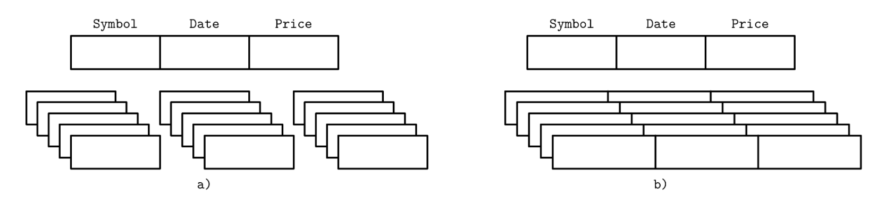
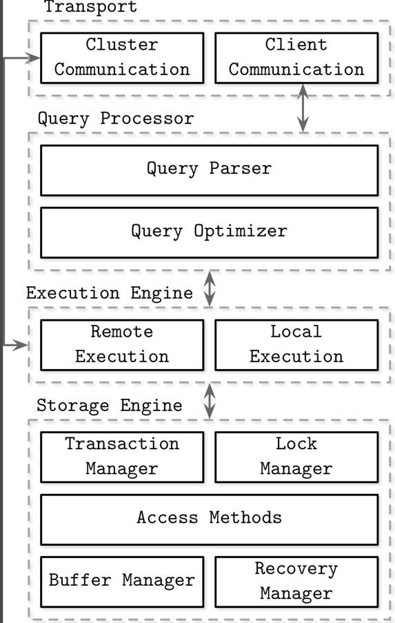
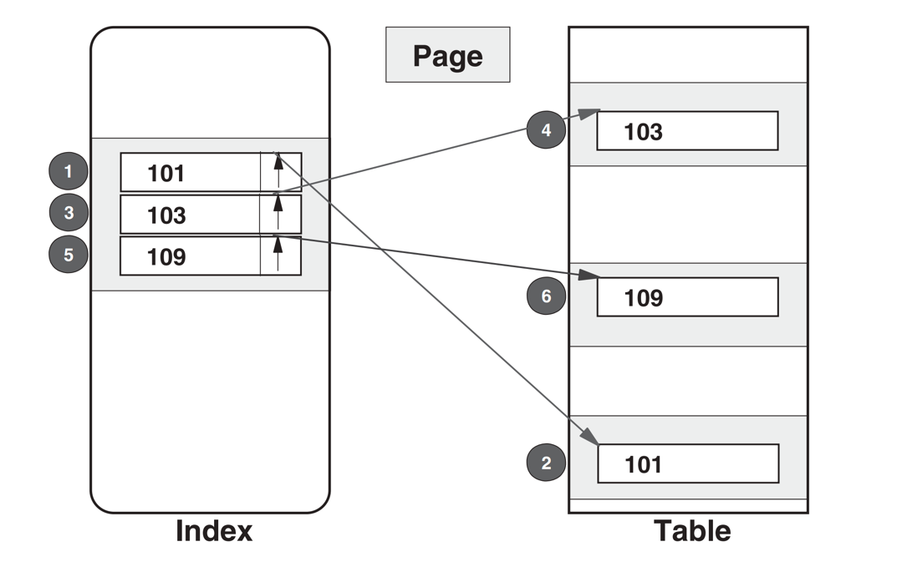
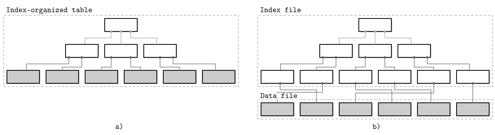
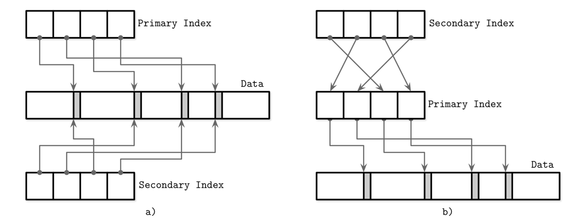

## Introduction

数据库管理系统可用于不同的目的：有些主要用于临时热数据，有些作为长期冷存储，有些允许复杂的分析查询，有些仅允许通过键访问值，有些针对存储时间序列数据进行了优化，还有一些高效地存储大型 blob。

> Knowledge Base of Relational and NoSQL Database Management Systems in [DB-Engines](https://db-engines.com/en/ranking)

每个数据库系统都有其优势和劣势。
为了降低昂贵迁移的风险，在决定使用特定数据库之前，你可以投入一些时间来建立对其满足应用程序需求能力的信心。

要比较数据库，深入了解使用场景并定义当前和预期的变量（例如）会有所帮助：
- Schema 和记录大小
- 客户端数量
- 查询类型和访问模式
- 读写查询的速率
- 这些变量的预期变化

类型：
- 基于磁盘：B-Tree 或 LSM Tree
- 基于内存：hashtable 或 skiplist
- 存储布局：行式或列式
- 编码：protobuf 或 Thrift

### Memory- Versus Disk-Based

数据库系统在内存和磁盘上存储数据。
内存数据库管理系统（有时称为主存 DBMS）主要将数据存储在内存中，并使用磁盘进行恢复和日志记录。
基于磁盘的 DBMS 将大部分数据保存在磁盘上，并使用内存来缓存磁盘内容或作为临时存储。
两种类型的系统都在一定程度上使用磁盘，但主存数据库几乎完全将内容存储在 RAM 中。

主存数据库系统与其基于磁盘的对应物不仅在主存储介质上有所不同，而且在使用的数据结构、组织和优化技术上也不同。

使用内存作为主要数据存储的数据库主要是出于性能、相对较低的访问成本和访问粒度的考虑。
为主存编程也明显比为磁盘编程更简单。
操作系统抽象了内存管理，允许我们考虑分配和释放任意大小的内存块。
在磁盘上，我们必须手动管理数据引用、序列化格式、释放内存和碎片化。

限制内存数据库增长的主要因素是 RAM 的易失性（换句话说，缺乏持久性）和成本。
由于 RAM 内容不是持久的，软件错误、崩溃、硬件故障和断电可能导致数据丢失。
有一些方法可以确保持久性，例如不间断电源和电池备份 RAM，但它们需要额外的硬件资源和运维专业知识。
在实践中，这一切都归结为磁盘更易于维护且价格显著更低。

随着非易失性内存（NVM）技术的可用性和普及度的增长，这种情况可能会改变。
NVM 存储减少或完全消除了读写延迟之间的不对称性（取决于具体技术），进一步提高了读写性能，并允许字节可寻址访问。

内存数据库系统在磁盘上维护备份以提供持久性并防止易失性数据丢失。
某些数据库仅将数据存储在内存中，没有任何持久性保证，但我们不在本书的范围内讨论它们。

在操作被认为是完成之前，其结果必须写入顺序日志文件。
为了避免在启动或崩溃后重放完整的日志内容，内存存储维护一个备份副本。
备份副本作为基于磁盘的有序结构维护，对此结构的修改通常是异步的（与客户端请求解耦），并批量应用以减少 I/O 操作的数量。
在恢复期间，可以从备份和日志中恢复数据库内容。

日志记录通常批量应用于备份。
处理完一批日志记录后，备份保存特定时间点的数据库快照，并且该点之前的日志内容可以被丢弃。
这个过程称为 checkpointing。
它通过保持磁盘驻留数据库与日志条目的最新状态来减少恢复时间，而无需客户端等待备份更新完成。

基于磁盘的数据库使用专为磁盘访问优化的专用存储结构。
在内存中，可以相对快速地跟随指针，随机内存访问显著快于随机磁盘访问。
基于磁盘的存储结构通常采用宽而矮的树形式，而基于内存的实现可以从更大的数据结构池中选择，并执行在磁盘上不可能或难以实现的优化。
类似地，处理可变大小数据在磁盘上需要特别注意，而在内存中通常只需用指针引用该值即可。

对于某些用例，假设整个数据集可以放入内存是合理的。
某些数据集受其现实世界表示的约束，例如学校的学生记录、公司的客户记录或在线商店的库存。
每条记录占用不超过几 KB，且数量有限。

### Column- Versus Row-Oriented

对数据库进行分类的一种方法是根据数据在磁盘上的存储方式：行式或列式。
表可以水平分区（将属于同一行的值存储在一起），也可以垂直分区（将属于同一列的值存储在一起）。
图 2 展示了这种区别：(a) 显示了按列分区的值，(b) 显示了按行分区的值。

<div style="text-align: center;">



</div>

<p style="text-align: center;">
Fig.1. 列式和行式存储中的数据布局
</p>

面向行的数据库管理系统以记录或行的形式存储数据。
它们的布局非常接近表格数据表示，其中每行具有相同的字段集。
由于面向行的存储在我们需要按行访问数据时最为有用，将整行存储在一起提高了空间局部性。

面向列的数据库管理系统垂直分区数据（即按列），而不是按行存储。
在这里，同一列的值在磁盘上连续存储。
面向列的存储非常适合计算聚合的分析工作负载，例如查找趋势、计算平均值等。
处理复杂聚合可用于逻辑记录有多个字段但某些字段具有不同重要性且经常一起消费的情况。
将相同数据类型的值存储在一起（例如数字和数字、字符串和字符串）提供了更好的压缩比。

#### Wide Column Stores

不应将面向列的数据库与宽列存储（如 BigTable 或 HBase）混淆，后者的数据表示为多维映射，列被分组为列族（通常存储相同类型的数据），在每个列族内部，数据按行存储。
这种布局最适合于通过键或键序列检索数据的场景。

## Architecture

数据库管理系统使用客户端/服务器模型，其中数据库系统实例（节点）充当服务器角色，应用程序实例充当客户端角色。

数据库是模块化系统，由多个部分组成：接受请求的传输层、确定最有效查询执行方式的查询处理器、执行操作的执行引擎以及存储引擎。

<div style="text-align: center;">



</div>

<p style="text-align: center;">
Fig.1. 数据库管理系统的架构
</p>

客户端请求通过传输子系统到达。
请求以查询的形式出现，最常见的是用某种查询语言表达。
传输子系统还负责与数据库集群中其他节点的通信。

收到请求后，传输子系统将查询交给查询处理器，由后者解析、解释和验证。
随后执行访问控制检查，因为这些检查只有在查询被解释后才能完全完成。

解析后的查询传递给查询优化器，优化器首先消除查询中不可能和冗余的部分，
然后尝试根据内部统计信息（索引基数、近似交集大小等）和数据分布（集群中哪些节点持有数据及其传输的相关成本）找到最有效的执行方式。
优化器处理查询解析所需的关系操作（通常表示为依赖树）以及优化，如索引排序、基数估计和选择访问方法。

查询通常以执行计划（或查询计划）的形式呈现：必须执行的一系列操作，以便其结果被认为是完整的。
由于相同的查询可以通过不同的执行计划来满足，而这些计划的效率可能不同，优化器会选择最佳可用计划。

执行计划由执行引擎处理，该引擎收集本地和远程操作的执行结果。
远程执行可能涉及向集群中其他节点写入和读取数据以及复制。

本地查询（直接来自客户端或其他节点）由存储引擎执行。

### 存储引擎

存储引擎（或数据库引擎）是数据库管理系统的一个软件组件，负责在内存和磁盘上存储、检索和管理数据，旨在捕获每个节点的持久、长期记忆。
虽然数据库可以响应复杂查询，但存储引擎更细粒度地查看数据，并提供简单的数据操作 API，允许用户创建、更新、删除和检索记录。
一种理解方式是，数据库管理系统是构建在存储引擎之上的应用程序，提供了模式、查询语言、索引、事务和许多其他有用的功能。

为了灵活性，键和值都可以是任意字节序列，没有规定形式。
它们的排序和表示语义在更高级的子系统中定义。
例如，你可以在一个表中使用 int32（32 位整数）作为键，在另一个表中使用 ascii（ASCII 字符串）；从存储引擎的角度来看，两个键都只是序列化的条目。

像 BerkeleyDB、LevelDB 及其后代 RocksDB、LMDB 及其后代 libmdbx、Sophia、HaloDB 等许多存储引擎都是独立于它们现在嵌入到的数据库管理系统而开发的。
使用可插拔的存储引擎使数据库开发人员能够利用现有的存储引擎快速启动数据库系统，并专注于其他子系统。

同时，数据库系统组件之间的清晰划分开辟了在不同引擎之间切换的机会，这些引擎可能更适合特定的用例。

存储引擎有几个具有专门职责的组件：
- 事务管理器<br>
  该管理器调度事务，并确保它们不会使数据库处于逻辑上不一致的状态。
- 锁管理器<br>
  该管理器为正在运行的事务锁定数据库对象，确保并发操作不会违反物理数据完整性。
- 访问方法（存储结构）<br>
  这些方法管理对磁盘上数据的访问和组织。访问方法包括堆文件和存储结构，如 B-Tree 或 LSM Tree。
- 缓冲管理器<br>
  该管理器在内存中缓存数据页面。
- 恢复管理器<br>
  该管理器维护操作日志，并在发生故障时恢复系统状态。

事务管理器和锁管理器共同负责并发控制：它们保证逻辑和物理数据完整性，同时确保并发操作尽可能高效地执行。

存储引擎基于某种数据结构。
然而，这些结构并不描述缓存、恢复、事务性以及存储引擎在其之上添加的其他内容的语义。

存储结构有三个常见变量：它们使用（或不使用）*缓冲*、使用*不可变*（或可变）文件，以及按*顺序*（或无序）存储值。

- **缓冲**<br>
  定义存储结构是否选择在内存中收集一定量的数据，然后再将其放入磁盘。
  当然，每种磁盘结构都必须在某种程度上使用缓冲，因为与磁盘之间数据传输的最小单位是一个块，并且最好写入完整的块。
  这里，我们讨论的是可避免的缓冲，即存储引擎实现者选择做的事情。
  我们在本书中讨论的最早的优化之一是在 B-Tree 节点中添加内存缓冲以摊销 I/O 成本。
  然而，这不是应用缓冲的唯一方式。
  例如，双组件 LSM Tree 尽管与 B-Tree 有相似之处，但以完全不同的方式使用缓冲，并将缓冲与不可变性结合起来。
- **可变性**（或不可变性）<br>
  定义存储结构是否读取文件的部分内容、更新它们，并将更新后的结果写回文件中的相同位置。
  不可变结构是只追加的：一旦写入，文件内容不会被修改，而是将修改追加到文件末尾。
  实现不可变性还有其他方法。
  其中之一是写时复制，其中保存记录更新版本的修改页面被写入文件中的新位置，而不是其原始位置。
  通常，LSM 和 B-Tree 之间的区别被描述为不可变存储与原地更新存储之间的区别，但也存在一些受 B-Tree 启发但不可变的结构（例如 "Bw-Trees"）。
- **排序**<br>
  定义为数据记录是否按键顺序存储在磁盘的页面中。
  换句话说，排序相近的键存储在磁盘的连续段中。
  排序通常定义了我们是否能高效地扫描记录范围，而不仅仅是定位单个数据记录。
  无序存储数据（最常见的是按插入顺序）为某些写入时优化提供了可能性。
  例如，Bitcask 和 WiscKey 将数据记录直接存储在只追加文件中。

我们将存储结构分为两组：可变和不可变，并将不可变性确定为影响其设计和实现的核心概念之一。
大多数可变存储结构使用原地更新机制。
在插入、删除或更新操作期间，数据记录直接在目标文件中的位置进行更新。

存储引擎通常允许同一数据记录的多个版本存在于数据库中；例如，使用多版本并发控制（参见 "Multiversion Concurrency Control"）或槽位页面组织（参见 "Slotted Pages"）时。
为了简单起见，现在我们假设每个键只与一个数据记录关联，该记录具有唯一位置。

最流行的存储结构之一是 B-Tree。
许多开源数据库系统基于 B-Tree，多年来它们已被证明覆盖了大多数用例。

不可变数据结构常用于函数式编程语言，并因其安全特性而越来越受欢迎：一旦创建，不可变结构不会改变，其所有引用可以并发访问，其完整性由无法修改的事实保证。

在高层次上，数据在存储结构内部和外部的处理方式存在严格区别。
在内部，不可变文件可以保存多个副本，较新的副本覆盖较旧的副本，而可变文件通常只保存最新的值。
访问时，处理不可变文件，协调冗余副本，并将最新版本返回给客户端。

我们使用 B-Tree 作为可变结构的典型示例，使用日志结构合并树（LSM Tree）作为不可变结构的示例。
不可变 LSM Tree 使用只追加存储和合并协调，而 B-Tree 定位磁盘上的数据记录并在文件中的原始偏移量处更新页面。

原地更新存储结构针对读取性能进行了优化：在磁盘上定位数据后，可以将记录返回给客户端。
这是以牺牲写入性能为代价的：要原地更新数据记录，首先必须在磁盘上定位它。
另一方面，只追加存储针对写入性能进行了优化。
写入不必在磁盘上定位记录以覆盖它们。
然而，这是以牺牲读取为代价的，因为读取必须检索多个数据记录版本并进行协调。

数据库社区的一大争议是 B-Tree 还是 LSM Tree 具有更低的写放大。
了解两种情况下写放大的来源至关重要。
在 B-Tree 中，写放大来自回写操作以及后续对同一节点的更新。
在 LSM Tree 中，写放大是由压缩过程中数据从一个文件迁移到另一个文件引起的。
直接比较两者可能会导致错误的结论。

总之，以不可变方式在磁盘上存储数据时，我们面临三个问题：

- 读放大<br>
  由于需要访问多个表来检索数据。
- 写放大<br>
  由压缩过程持续重写引起。
- 空间放大<br>
  由于存储与同一键关联的多个记录。

### 优化器

关系数据库的长期优势之一是请求数据时很少或根本不考虑数据访问方式。
这个决定由称为优化器的 DBMS 组件做出。
不同关系系统的优化器差异很大，并且可能永远如此，但它们都试图使用系统收集的数据统计信息，以最有效的方式访问数据。

在执行 SQL 语句之前，优化器必须首先决定如何访问数据；应该使用哪个索引（如果有的话）；如何使用索引；是否应使用辅助随机读取；等等。
所有这些信息都体现在访问路径中。

<div style="text-align: center;">



</div>

<p style="text-align: center;">
Fig.2. 传统索引扫描。
</p>

索引切片和匹配列
因此，如图 3.1 所示的薄索引切片将被顺序扫描，
对于每个值在 100 到 110 之间的索引行，将使用同步读取从表中访问相应的行（除非该页面已经在缓冲池中）。
访问路径的成本显然取决于切片的厚度，而切片厚度又取决于范围谓词；更厚的切片当然需要顺序读取更多的索引页面，并且必须处理更多的索引行。
然而，成本的实际增加将来自对表的同步读取数量的增加，每页成本约为 10 毫秒。
类似地，更薄的切片肯定会降低索引成本，但主要的节省还是来自对表的更少同步读取。
因此，索引切片的大小可能非常重要。

术语"index slice"并不是任何关系数据库系统使用的术语；它们都使用自己的术语，但我们认为 index slice 是一个更具描述性的术语，且不依赖于具体 DBMS。
另一种描述索引切片的常用方法是定义索引处理中使用的匹配列数。
在我们的示例中（值在 100 到 110 之间），我们只有一个匹配列。
这个单一的匹配列实际上定义了切片的厚度。
如果存在第二列，同时出现在 WHERE 子句和索引中，使得这两列能够共同定义更薄的索引切片，那么我们将有两个匹配列。
则需要更少的索引处理，但更重要的是，需要对表进行更少的同步读取。

#### Index Screening and Screening Columns

有时一列可能同时出现在 WHERE 子句和索引中，但并非索引中的所有列都能定义索引切片。
然而，这些列可能仍然能够减少对表的同步读取次数，从而发挥更重要的作用。
我们将这些列称为筛选列（screening columns），一些关系数据库系统也确实如此称呼，因为它们正是发挥了这个作用。
它们避免了访问表行的必要性，因为它们能够通过自身在索引中的存在来确定无需这样做。

从前导列到末尾列检查索引列
1. 在 WHERE 子句中，是否有列引用了至少一个足够简单的谓词？
   如果是，则该列是 M 列。
   如果不是，则该列及后续列不是 M 列。
2. 如果谓词是范围谓词，则后续列不是 M 列。
3. 最后一个 M 列之后的任何列，如果有足够简单的谓词引用该列，则为 S 列。

#### Access Path Terminology

不幸的是，用于描述访问路径的术语远未标准化——即使是 access path 本身这个术语也常常被其他术语如执行计划所替代。
我们在指代实际访问数据的方式时将使用 access path；在指代 DBMS 通过 `EXPLAIN` 工具（如下所述）提供的输出时使用执行计划。
这是一个微妙的区别，如果这些术语互换使用实际上也无大碍。

执行计划由执行引擎处理，该引擎收集本地和远程操作的执行结果。
远程执行可能涉及向集群中其他节点写入和读取数据以及复制。

匹配谓词有时称为范围界定谓词。
如果一个谓词对优化器来说足够简单，即在有合适索引可用时是一个匹配谓词，则称为 indexable 或 sargable。
相反术语是 nonindexable 或 nonsargable。

SQL Server 对使用索引但也读取表行的访问路径使用术语 table lookup。
这与 index only 相反。
消除表访问的明显方法是将缺失的列添加到索引中。
许多 SQL Server 书籍将使得 SELECT 调用的 index-only 访问路径成为可能的索引称为覆盖索引。
使用覆盖索引的 SELECT 语句有时称为覆盖 SELECT。

### Transaction manager
本地查询（直接来自客户端或其他节点）由存储引擎执行。
存储引擎有几个具有专门职责的组件：

该管理器调度事务，并确保它们不会使数据库处于逻辑上不一致的状态。

Lock manager

该管理器为正在运行的事务锁定数据库对象，确保并发操作不会违反物理数据完整性。

Access methods (storage structures)

这些方法管理对磁盘上数据的访问和组织。访问方法包括堆文件和存储结构，如 B-Tree 或 LSM Tree。

Buffer manager

该管理器在内存中缓存数据页面（参见 "Buffer Management"）。

Recovery manager

该管理器维护操作日志，并在发生故障时恢复系统状态（参见 "Recovery"）。

事务管理器和锁管理器共同负责并发控制（参见 "Concurrency Control"）：
它们保证逻辑和物理数据完整性，同时确保并发操作尽可能高效地执行。

Storage data layer

Cache Layer

Transport Layer

Execute Layer

Log Layer

Authority Layer

Tolerance

concurrency

适合磁盘实现的树版本需要具备以下特性：

- 高扇出以改善相邻键的局部性。
- 低高度以减少遍历过程中的寻道次数。

> [!TIP]
>
> 扇出和高度呈负相关：扇出越高，高度越低。
> 如果扇出很高，每个节点可以容纳更多子节点，从而减少节点数量，进而降低高度。

#### Buffer Management

大多数数据库使用两层内存层次结构构建：较慢的持久存储（磁盘）和较快的主内存（RAM）。
为了减少对持久存储的访问次数，页面被缓存在内存中。
当存储层再次请求该页面时，返回其缓存副本。

内存中可用的缓存页面可以在假设没有其他进程修改磁盘上数据的情况下重用。
这种方法有时被称为虚拟磁盘 [BAYER72]。
虚拟磁盘读取仅当内存中没有可用的页面副本时才访问物理存储。
同一概念更常见的名称是页面缓存或缓冲池。
页面缓存负责将从磁盘读取的页面缓存在内存中。
如果数据库系统崩溃或非正常关闭，缓存内容将丢失。

页面缓存的问题不仅限于数据库范畴。
操作系统也有页面缓存的概念。
操作系统利用未使用的内存段透明地缓存磁盘内容，以提高 I/O 系统调用的性能。

未缓存的页面被称为调入（paged in），即从磁盘加载。
如果对缓存页面进行了任何修改，则该页面被称为脏页，直到这些修改被刷新回磁盘。

由于存储缓存页面的内存区域通常远小于整个数据集，页面缓存最终会填满，为了调入新页面，必须驱逐某个缓存页面。

页面缓存的主要功能可以总结为：

- 它将缓存页面内容保存在内存中。
- 它允许对磁盘页面的修改被缓冲在一起，并针对其缓存版本执行。
- 当请求的页面不在内存中且空间足够时，页面缓存将其调入，并返回其缓存版本。
- 如果请求的页面已被缓存，则返回其缓存版本。
- 如果没有足够的空间容纳新页面，则驱逐其他页面并将其内容刷新到磁盘。

> [!NOTE]
> 许多数据库系统使用 O_DIRECT 标志打开文件。
> 此标志允许 I/O 系统调用绕过内核页面缓存，直接访问磁盘，并使用数据库特定的缓冲管理。
> 操作系统相关人员有时对此不以为然。
> Linus Torvalds 曾批评 O_DIRECT 的使用，因为它不是异步的，并且没有预读或其他用于指示内核访问模式的方法。
> 然而，在操作系统提供更好的机制之前，O_DIRECT 仍然是有用的。
> 我们可以通过使用 fadvise 对内核如何从其缓存中驱逐页面获得一些控制，但这只允许我们请求内核考虑我们的意见，并不能保证它真的会发生。
> 为了避免在执行 I/O 时进行系统调用，我们可以使用内存映射，但这样我们就失去了对缓存的控制。

##### Caching Semantics

对缓冲区的所有更改都保留在内存中，直到最终写回磁盘。
由于不允许其他进程对后备文件进行更改，这种同步是单向的：从内存到磁盘，而不是相反。
页面缓存允许数据库对内存管理和磁盘访问拥有更多控制。
你可以将其视为内核页面缓存的应用程序级等价物：它直接访问块设备，实现类似的功能，并服务于类似的目的。
它抽象了磁盘访问，并将逻辑写操作与物理写操作解耦。

缓存页面有助于使树部分保留在内存中，而无需对算法进行额外更改或在内存中物化对象。
我们所要做的是将磁盘访问替换为对页面缓存的调用。

当存储引擎访问（即请求）页面时，我们首先检查其内容是否已被缓存，如果是，则返回缓存的页面内容。
如果页面内容尚未缓存，缓存将逻辑页面地址或页号转换为其物理地址，将其内容加载到内存中，并将其缓存版本返回给存储引擎。
返回后，持有缓存页面内容的缓冲区被称为被引用，存储引擎必须在完成后将其交还给页面缓存或解除引用。
可以通过固定页面来指示页面缓存避免驱逐它。

如果页面被修改（例如，向其追加了一个单元格），则将其标记为脏。
页面上设置的脏标志表示其内容与磁盘不同步，必须为持久性而刷新。

##### Cache Eviction

保持缓存填充良好是有益的：我们可以提供更多读取而无需访问持久存储，并且更多同页写入可以缓冲在一起。
然而，页面缓存容量有限，迟早为了提供新内容，必须驱逐旧页面。
如果页面内容与磁盘同步（即已刷新或从未修改），且页面未被固定或引用，则可以立即驱逐。
脏页在驱逐前必须刷新。
如果其他线程正在使用引用页面，则不应将其驱逐。

由于每次驱逐都触发刷新可能对性能不利，一些数据库使用单独的后台进程，循环遍历可能被驱逐的脏页，更新其磁盘版本。
例如，PostgreSQL 有一个后台刷新写入器就是做这个的。

另一个需要牢记的重要特性是持久性：如果数据库崩溃，所有未刷新的数据都将丢失。
为了确保所有更改都已持久化，刷新由检查点进程协调。
检查点进程控制写前日志（WAL）和页面缓存，并确保它们同步工作。
只有与已刷新的缓存页面关联的操作的日志记录才能从 WAL 中丢弃。
在此过程完成之前，脏页不能被驱逐。

这意味着始终需要在多个目标之间进行权衡：
- 推迟刷新以减少磁盘访问次数
- 预先刷新页面以允许快速驱逐
- 选择要驱逐的页面并以最佳顺序刷新
- 保持缓存大小在其内存限制内
- 避免数据丢失，因为数据尚未持久化到主存储

##### Locking Pages in Cache

每次读取或写入都执行磁盘 I/O 是不切实际的：后续读取可能请求同一页面，就像后续写入可能修改同一页面一样。
由于 B-Tree 越靠近顶部越"窄"，较高层级的节点（更接近根节点的）在大多数读取中会被命中。
分裂和合并最终也会传播到较高层级的节点。
这意味着树中总有一部分可以显著受益于缓存。

我们可以"锁定"在最近时间内很可能被使用的页面。
锁定页面在缓存中称为固定（pinning）。
固定页面在内存中保留更长时间，有助于减少磁盘访问次数并提高性能。

由于 B-Tree 的每个较低节点级别拥有的节点数量呈指数级多于较高级别，而较高级别的节点仅代表树的很小一部分，树的这一部分可以永久驻留在内存中，其他部分可以按需调入。
这意味着，为了执行查询，我们不必进行 h 次磁盘访问（如 "B-Tree Lookup Complexity" 中所讨论的，h 是树的高度），而只需对较低级别（页面未被缓存的那些）进行磁盘访问。

对子树执行的操作可能导致相互矛盾的结构更改——例如，多次删除操作导致合并，随后写入导致分裂，反之亦然。
同样的情况也适用于从不同子树传播的结构更改（在树的不同部分，时间上接近发生的结构更改向上传播）。
这些操作可以通过仅在内存中应用更改来缓冲在一起，这可以减少磁盘写入次数并摊销操作成本，因为可以执行一次写入而不是多次写入。

> 页面缓存还允许存储引擎对预取和驱逐进行细粒度控制。
> 可以指示它在页面被访问之前提前加载它们。
> 例如，当在范围扫描中遍历叶节点时，可以预加载下一个叶节点。
> 类似地，如果维护进程加载了页面，可以在该进程完成后立即驱逐它，因为它不太可能对正在进行的查询有用。
> 某些数据库，例如 PostgreSQL，对大型顺序扫描使用循环缓冲区（即 FIFO 页面替换策略）。

## store

数据库系统确实使用文件存储数据，但它们不是依赖文件系统的目录和文件层次结构来定位记录，而是使用实现特定的格式来组织文件。
使用专门的文件组织方式而非平面文件的主要原因是：

- 存储效率<br>
  文件以最小化每个存储数据记录的存储开销的方式组织。
- 访问效率<br>
  记录可以在最少的步骤数内定位。
- 更新效率<br>
  记录更新的执行方式最小化磁盘上的更改数量。

数据库系统将由多个字段组成的数据记录存储在表中，每个表通常表示为一个单独的文件。
表中的每条记录可以使用搜索键进行查找。
为了定位记录，数据库系统使用索引：辅助数据结构，允许在不扫描整个表的情况下高效定位数据记录。
索引使用标识记录的部分字段构建。

数据库系统通常将数据文件和索引文件分开：数据文件存储数据记录，而索引文件存储记录元数据并使用它在数据文件中定位记录。
索引文件通常比数据文件小。
文件被分区为页面，页面大小通常为一个或多个磁盘块的大小。
页面可以组织为记录序列或槽位页面。

新记录（插入）和对现有记录的更新由键/值对表示。
大多数现代存储系统不会显式地从页面中删除数据。
相反，它们使用删除标记（也称为 tombstones），其中包含删除元数据，如键和时间戳。
被更新或删除标记覆盖的记录所占用的空间在垃圾回收期间被回收，垃圾回收读取页面，将存活（即未被覆盖的）记录写入新位置，并丢弃被覆盖的记录。

### Data Files

数据文件（有时称为*主文件*）可以实现为*索引组织表*（IOT）、*堆组织表*（堆文件）或*哈希组织表*（哈希文件）。

- 堆文件中的记录不需要遵循任何特定顺序，大多数情况下按写入顺序放置。
  这样，当追加新页面时，不需要额外的工作或文件重组。
  堆文件需要额外的索引结构，指向存储数据记录的位置，以使其可搜索。
- 在哈希文件中，记录存储在桶中，键的哈希值决定记录属于哪个桶。
  桶中的记录可以按追加顺序存储或按键排序以提高查找速度。
- 索引组织表（IOT）将数据记录存储在索引本身中。
  由于记录按键顺序存储，IOT 中的范围扫描可以通过顺序扫描其内容来实现。<br>
  将数据记录存储在索引中允许我们通过至少减少一次磁盘寻道来减少磁盘寻道次数，因为在遍历索引并定位搜索键之后，我们无需访问单独的文件来找到关联的数据记录。

当记录存储在单独的文件中时，索引文件保存数据条目，唯一标识数据记录并包含足够的信息以在数据文件中定位它们。
例如，我们可以存储文件偏移量（有时称为行定位器）、数据文件中数据记录的位置，或者在哈希文件的情况下存储桶 ID。
在索引组织表中，数据条目保存实际的数据记录。

### Index Files

索引是一种在磁盘上组织数据记录的结构，以促进高效的检索操作。
索引文件被组织为专门的结构，将键映射到数据文件中的位置，其中存储了由这些键标识的记录（在堆文件的情况下）或主键（在索引组织表的情况下）。

主（数据）文件上的索引称为主索引。
然而，在大多数情况下，我们也可以假设主索引是建立在主键或标识为主键的键集上的。
所有其他索引称为二级索引。

二级索引可以直接指向数据记录，或者简单地存储其主键。
指向数据记录的指针可以持有堆文件或索引组织表的偏移量。
多个二级索引可以指向同一记录，允许单个数据记录通过不同字段标识并通过不同索引定位。
虽然主索引文件每个搜索键持有一个唯一条目，但二级索引每个搜索键可能持有多个条目。

如果数据记录的顺序遵循搜索键的顺序，则该索引称为聚簇索引。
在聚簇情况下，数据记录通常存储在同一个文件或聚簇文件中，其中键顺序得以保持。
如果数据存储在单独的文件中，且其顺序不遵循键顺序，则该索引称为非聚簇索引。

图 3 显示了两种方法之间的区别：
- a) 两个索引直接从二级索引文件引用数据条目。
- b) 二级索引通过主索引的间接层来定位数据条目。

<div style="text-align: center;">



</div>

<p style="text-align: center;">
Fig.3. 在索引文件中存储数据记录与存储指向数据文件的偏移量（白色显示索引段；灰色显示包含数据记录的段）。
</p>

> [!TIP]
> 索引组织表按索引顺序存储信息，并且根据定义是聚簇的。
> 主索引通常是聚簇的。
> 二级索引根据定义是非聚簇的，因为它们用于通过主键以外的键进行访问。
> 聚簇索引可以是索引组织的，也可以具有单独的索引和数据文件。

许多数据库系统具有固有的显式主键，即唯一标识数据库记录的一组列。
当未指定主键时，存储引擎可以创建隐式主键（例如，MySQL InnoDB 添加一个新的自增列并自动填充其值）。

#### Primary Index as an Indirection

通过直接引用数据，我们可以减少磁盘寻道次数，但必须在记录更新或在维护过程中被重定位时付出更新指针的代价。
使用主索引形式的间接引用可以降低指针更新的成本，但在读取路径上成本更高。

如果工作负载主要由读取组成，仅更新几个索引可能可行，但对于具有多个索引的写重负载，这种方法效果不佳。
为了降低指针更新的成本，一些实现使用主键进行间接引用，而不是使用有效负载偏移量。
例如，MySQL InnoDB 使用主索引，并在执行查询时执行两次查找：一次在二级索引中，一次在主索引中。
这增加了主索引查找的开销，而不是直接从二级索引跟随偏移量。

图 6 显示了两种方法的区别：

- a) 两个索引直接从二级索引文件引用数据条目。
- b) 二级索引通过主索引的间接层来定位数据条目。

<div style="text-align: center;">



</div>

<p style="text-align: center;">
Fig.6. 直接引用数据元组 (a) 与使用主索引作为间接引用 (b)。
</p>

也可以使用混合方法，同时存储数据文件偏移量和主键。
首先检查数据偏移量是否仍然有效，如果已更改则通过主键索引进行额外查找，在找到新偏移量后更新索引文件。

## OLAP

OLAP（在线分析处理）是一种用于在数据仓库、数据湖或其他数据存储库中对大量数据进行高速复杂查询或多维分析的技术。
OLAP 用于商业智能（BI）、决策支持以及各种业务预测和报告应用。

表. 事务处理系统与分析系统特性对比

| 属性 | 事务处理系统（OLTP） | 分析系统（OLAP） |
| ----- | ----- | ----- |
| 主要读取模式 | 每次查询少量记录，按键获取 | 聚合大量记录 |
| 主要写入模式 | 用户输入的随机访问、低延迟写入 | 批量导入（ETL）或事件流 |
| 主要使用者 | 最终用户/客户，通过 Web 应用程序 | 内部分析师，用于决策支持 |
| 数据表示 | 数据的最新状态（当前时间点） | 随时间发生的事件历史 |
| 数据集大小 | GB 到 TB | TB 到 PB |

MOLAP vs. ROLAP vs. HOLAP

直接与多维 OLAP 立方体一起工作的 OLAP 称为多维 OLAP 或 MOLAP。
同样，对于大多数用途而言，MOLAP 是最快且最实用的多维数据分析类型。

ROLAP（关系型 OLAP）是直接对关系表上的数据进行操作的多维数据分析，无需先将数据重组为立方体。
当能够直接处理大量数据比性能和灵活性更重要时，ROLAP 是最佳选择。

HOLAP（混合型 OLAP）试图在单个 OLAP 架构内创建关系型和多维数据库之间的最佳分工。
关系表包含较大量的数据，而 OLAP 立方体用于聚合和推测性处理。
HOLAP 需要支持 MOLAP 和 ROLAP 的 OLAP 服务器。

最初，同一数据库同时用于事务处理和分析查询。
SQL 在这方面表现得相当灵活：它既适用于 OLTP 类型的查询，也适用于 OLAP 类型的查询。
然而，在 1980 年代末和 1990 年代初，企业倾向于停止使用 OLTP 系统进行分析目的，而是在单独的数据库上运行分析。
这个单独的数据库被称为*数据仓库*。

### Data Warehousing

一个企业可能有数十个不同的事务处理系统：为面向客户的网站提供动力的系统、控制实体店销售点（收银）系统、
跟踪仓库库存、规划车辆路线、管理供应商、管理人员等等。
每个系统都很复杂，需要一个团队来维护，因此这些系统最终大多是彼此独立运行的。
这些 OLTP 系统通常要求高可用性并以低延迟处理事务，因为它们通常对业务运营至关重要。
因此，数据库管理员会严密保护他们的 OLTP 数据库。
他们通常不乐意让业务分析师在 OLTP 数据库上运行临时分析查询，因为这些查询通常很昂贵，扫描数据集的大部分内容，可能损害并发执行事务的性能。

相比之下，数据仓库是一个单独的数据库，分析师可以随心所欲地查询，而不会影响 OLTP 操作。
数据仓库包含公司所有各种 OLTP 系统中数据的只读副本。
数据从 OLTP 数据库中提取（使用定期数据转储或持续更新流），转换为分析友好的模式，进行清理，然后加载到数据仓库中。
将数据导入仓库的过程称为提取-转换-加载（ETL）。

使用单独的数据仓库而不是直接查询 OLTP 系统进行分析的一大优势是可以针对分析访问模式优化数据仓库。
事实证明，索引算法对 OLTP 效果很好，但不擅长回答分析查询。

数据仓库的数据模型最常见的是关系型的，因为 SQL 通常非常适合分析查询。
有许多图形化数据分析工具可以生成 SQL 查询、可视化结果，并允许分析师探索数据（通过下钻、切片和切块等操作）。
表面上看，数据仓库和关系型 OLTP 数据库看起来相似，因为它们都有 SQL 查询接口。
然而，系统的内部结构可能看起来截然不同，因为它们针对非常不同的查询模式进行了优化。
许多数据库供应商现在专注于支持事务处理或分析工作负载，而非两者兼顾。
有些数据库，例如 Microsoft SQL Server 和 SAP HANA，在同一产品中支持事务处理和数据仓库。
然而，它们正日益成为两个独立的存储和查询引擎，恰好通过共同的 SQL 接口访问。

## Transaction

### Recovery

*写前日志*（简称 WAL，也称为提交日志）是一种只追加的辅助磁盘驻留结构，用于崩溃和事务恢复。
页面缓存允许在内存中缓冲对页面内容的更改。
在缓存内容刷新回磁盘之前，磁盘上唯一保存操作历史的副本存储在 WAL 中。
许多数据库系统使用只追加的写前日志；例如 PostgreSQL 和 MySQL。

写前日志的主要功能可以总结为：

- 允许页面缓存缓冲对磁盘驻留页面的更新，同时在数据库系统的更大上下文中确保持久性语义。
- 将所有操作持久化到磁盘，直到受这些操作影响的页面的缓存副本在磁盘上同步为止。
  每个修改数据库状态的操作在修改相关页面内容之前，必须先记录到磁盘。
- 允许在崩溃时从操作日志重建丢失的内存中更改。

除了此功能外，写前日志在事务处理中也扮演着重要角色。
WAL 的重要性怎么强调也不为过，因为它确保数据到达持久存储并在崩溃时可用，因为未提交的数据可以从日志中重放，崩溃前的数据库状态可以完全恢复。

写前日志是只追加的，其写入内容是不可变的，因此对日志的所有写入都是顺序的。
由于 WAL 是一种不可变的、只追加的数据结构，读取者可以安全地访问其内容直到最新的写入阈值，而写入者继续向日志尾部追加数据。

WAL 由日志记录组成。
每条记录都有一个唯一的、单调递增的日志序列号（LSN）。
通常，LSN 由内部计数器或时间戳表示。
由于日志记录不一定占用整个磁盘块，其内容在日志缓冲区中缓存，并在强制操作中刷新到磁盘。
强制操作在日志缓冲区填满时发生，并且可以由事务管理器或页面缓存请求。
所有日志记录必须按 LSN 顺序刷新到磁盘。

除了单个操作记录外，WAL 还保存指示事务完成的记录。
事务在日志被强制到达其提交记录的 LSN 之前，不能被视为已提交。

为了确保系统在回滚或恢复期间发生崩溃后仍能继续正常运行，一些系统在撤销期间使用补偿日志记录（CLR）并将其存储在日志中。

WAL 通常通过允许在到达检查点时修剪日志的接口与主存储结构耦合。
日志记录是数据库最关键的正确性方面之一，这有点棘手：日志修剪与确保数据已到达主存储结构之间的哪怕是微小的不一致都可能导致数据丢失。

检查点是日志知道截至某个标记的日志记录已完全持久化且不再需要的方式，这显著减少了数据库启动期间所需的工作量。
强制将所有脏页刷新到磁盘的过程通常称为同步检查点，因为它完全同步了主存储结构。

将全部内容刷新到磁盘相当不切实际，并且需要暂停所有正在运行的操作直到检查点完成，因此大多数数据库系统实现了模糊检查点。
在这种情况下，存储在日志头部中的 last_checkpoint 指针包含关于最后一次成功检查点的信息。
模糊检查点以指定其开始的特殊 begin_checkpoint 日志记录开始，以包含有关脏页信息和事务表内容的 end_checkpoint 日志记录结束。
直到该记录指定的所有页面都被刷新，检查点才被认为是完整的。
页面被异步刷新，完成后，last_checkpoint 记录更新为 begin_checkpoint 记录的 LSN，并且在发生崩溃的情况下，恢复过程将从那里开始。

#### Operation Versus Data Log

某些数据库系统，例如 System R [CHAMBERLIN81]，使用影子分页：一种写时复制技术，确保数据持久性和事务原子性。
新内容被放入未发布的影子页面中，并通过指针翻转（从旧页面翻转到持有更新内容的页面）使其可见。

任何状态变化都可以用前像和后像或相应的 redo 和 undo 操作来表示。
对前像应用 redo 操作产生后像。
类似地，对后像应用 undo 操作产生前像。

我们可以使用物理日志（存储完整的页面状态或对其的字节级更改）或逻辑日志（存储必须针对当前状态执行的操作）来在时间上向前或向后移动记录或页面。
跟踪物理和逻辑日志记录可以应用的页面的确切状态非常重要。

物理日志记录操作的前后像，要求记录受操作影响的所有页面。
逻辑日志指定必须应用于页面的操作，例如"为键 Y 插入数据记录 X"，以及相应的撤销操作，例如"删除与 Y 关联的值"。

在实践中，许多数据库系统结合使用这两种方法，使用逻辑日志执行撤销（为了并发性和性能）和物理日志执行重做（以改善恢复时间）。

#### Steal and Force Policies

为了确定何时必须将内存中的更改刷新到磁盘上，数据库管理系统定义了 steal/no-steal 和 force/no-force 策略。
这些策略主要适用于页面缓存，但最好在恢复的上下文中讨论，因为它们对可以与之结合使用的恢复方法有重要影响。

允许在事务提交之前刷新由该事务修改的页面的恢复方法称为 steal 策略。
no-steal 策略不允许将任何未提交的事务内容刷新到磁盘。
这里的 steal 脏页意味着将其内存中内容刷新到磁盘，并从磁盘加载不同的页面到其位置。

force 策略要求在事务提交之前，将所有由该事务修改的页面刷新到磁盘。
另一方面，no-force 策略允许事务提交，即使在该事务期间修改的一些页面尚未刷新到磁盘。
这里的 force 脏页意味着在提交之前将其刷新到磁盘。

理解 steal 和 force 策略很重要，因为它们对事务的撤销和重做有影响。
撤销回滚对已提交事务的强制页面的更新，而重做则将已提交事务执行的更改应用到磁盘。

使用 no-steal 策略允许仅使用重做条目实现恢复：旧副本包含在磁盘上的页面中，修改存储在日志中。
使用 no-force，我们可以通过延迟来缓冲对页面的多次更新。
由于页面内容需要在此期间缓存在内存中，可能需要更大的页面缓存。

当使用 force 策略时，崩溃恢复不需要额外工作来重建已提交事务的结果，因为这些事务修改的页面已经被刷新。
使用这种方法的一个主要缺点是事务需要更长的提交时间，因为需要必要的 I/O。

更一般地，在事务提交之前，我们需要有足够的信息来撤销其结果。
如果事务触及的任何页面已被刷新，我们需要在日志中保留撤销信息直到其提交才能回滚。
否则，我们必须在日志中保留重做记录直到其提交。
在这两种情况下，事务在撤销或重做记录写入日志文件之前无法提交。

### Concurrency Control

#### Why is concurrency control needed?

如果事务是*串行*执行的，即按顺序执行且时间上无重叠，则不存在事务并发。
然而，如果允许具有交错操作的并发事务不受控制地运行，可能会出现一些意外的不良结果，例如：

1. 丢失更新问题：第二个事务将数据项的第二个值写入第一个并发事务写入的第一个值之上，第一个值对需要按其优先顺序读取第一个值的其他并发事务丢失。
   读取了错误值的事务最终得到不正确的结果。
2. 脏读问题：事务读取了后来被中止的事务写入的值。
   该值在中止时从数据库中消失，任何事务都不应读取它（"脏读"）。
   读取事务最终得到不正确的结果。
3. 不正确的汇总问题：当一个事务对所有实例重复的数据项的值进行汇总时，第二个事务更新了该数据项的某些实例。
   得到的汇总结果不能反映两个事务之间的任何（通常正确性所需的）优先顺序的正确结果，而是一些取决于更新时机以及某些更新结果是否已包含在汇总中的随机结果。

大多数高性能事务系统需要并发运行事务以满足其性能要求。
因此，如果没有并发控制，这些系统既无法提供正确的结果，也无法一致地维护其数据库。

#### Concurrency control mechanisms

#### Categories

并发控制机制的主要类别包括：

- **[Optimistic](https://en.wikipedia.org/wiki/Optimistic_concurrency_control)** - 延迟检查事务是否满足隔离性和其他完整性规则（例如，[serializability](https://en.wikipedia.org/wiki/Serializability) 和 [recoverability](https://en.wikipedia.org/wiki/Serializability#Correctness_-_recoverability)）到其结束时，不阻塞其任何（读、写）操作（"乐观地认为规则会被满足..."），然后在如果提交时将要违反所需规则时中止事务以防止违规。
   中止的事务立即重新启动并重新执行，这会产生明显的开销（相对于只执行到结束一次）。
   如果没有太多事务被中止，那么乐观策略通常是一个好策略。
- **Pessimistic** - 如果某个操作可能导致违反规则，则阻塞该事务的操作，直到违反的可能性消失。
   阻塞操作通常涉及性能降低。
- **Semi-optimistic** - 在某些情况下如果操作可能导致违反某些规则则阻塞操作，在其他情况下不阻塞，同时延迟规则检查（如果需要）到事务结束时，如乐观方法所做的那样。

不同类别提供不同的性能，即不同的平均事务完成率（*吞吐量*），取决于事务类型组合、计算并行度和其他因素。
如果存在选择且了解权衡，则应选择能够提供最高性能的类别和方法。

两个事务之间的相互阻塞（每个事务阻塞另一个）或多个事务之间的阻塞会导致[死锁](https://en.wikipedia.org/wiki/Deadlock)，涉及的事务停滞不前，无法完成。
大多数非乐观机制（带有阻塞的）容易发生死锁，通过有意中止停滞事务（释放死锁中的其他事务）并立即重新启动和重新执行来解决。
死锁的可能性通常较低。

阻塞、死锁和中止都会导致性能降低，因此需要在不同类别之间进行权衡。

#### Methods

存在许多并发控制方法。
大多数可以在上述任一主要类别内实现。
主要的方法，每个都有许多变体，并且在某些情况下可能重叠或组合，包括：

1. 锁（例如，**[Two-phase locking](https://en.wikipedia.org/wiki/Two-phase_locking)** - 2PL）- 通过分配给数据的[锁](https://en.wikipedia.org/wiki/Lock_(computer_science))控制对数据的访问。
   事务对被另一事务锁定的数据项（数据库对象）的访问可能被阻塞（取决于锁类型和访问操作类型），直到锁释放。
2. **[Serialization graph checking](https://en.wikipedia.org/wiki/Serializability#Testing_conflict_serializability)**（也称为 Serializability、Conflict 或 Precedence graph checking）- 检查调度[图](https://en.wikipedia.org/wiki/Directed_graph)中的[环](https://en.wikipedia.org/wiki/Cycle_(graph_theory))并通过中止来打破它们。
3. **[Timestamp ordering](https://en.wikipedia.org/wiki/Timestamp-based_concurrency_control)**（TO）- 为事务分配时间戳，并通过时间戳顺序控制或检查对数据的访问。
4. **[Commitment ordering](https://en.wikipedia.org/wiki/Commitment_ordering)**（或 Commit ordering; CO）- 控制或检查事务提交事件的 chronological 顺序与它们各自的[优先顺序](https://en.wikipedia.org/wiki/Serializability#Testing_conflict_serializability)兼容。

与上述方法结合使用的其他主要并发控制类型包括：

- **[Multiversion concurrency control](https://en.wikipedia.org/wiki/Multiversion_concurrency_control)**（MVCC）- 通过每次写入对象时生成该数据库对象的新版本，并允许事务读取每个对象的最后几个相关版本（取决于调度方法）来提高并发性和性能。
- **[Index concurrency control](https://en.wikipedia.org/wiki/Index_locking)** - 同步对[索引](https://en.wikipedia.org/wiki/Index_(database))的访问操作，而不是对用户数据的操作。
   专门的方法可提供显著的性能提升。
- **Private workspace model**（**Deferred update**）- 每个事务为其访问的数据维护一个私有工作空间，其更改后的数据仅在事务提交时才对外部可见（例如，[Weikum and Vossen 2001](https://en.wikipedia.org/wiki/Concurrency_control#Weikum01)）。
   这种模型在多种情况下提供了不同的并发控制行为和优势。

自 1970 年代早期以来，数据库系统中最常见的机制类型是 *[Strong strict Two-phase locking](https://en.wikipedia.org/wiki/Two-phase_locking)*（SS2PL；也称为 *Rigorous scheduling* 或 *Rigorous 2PL*），它是 [Two-phase locking](https://en.wikipedia.org/wiki/Two-phase_locking)（2PL）和 [Commitment ordering](https://en.wikipedia.org/wiki/Commitment_ordering)（CO）的特殊情况（变体）。
它是悲观的。
尽管名字很长（出于历史原因），**SS2PL** 机制的思想很简单："只有在事务结束后才释放该事务应用的所有锁。"
SS2PL（或 Rigorousness）也是此机制可以生成的所有调度集合的名称，即这些是 SS2PL（或 Rigorous）调度，具有 SS2PL（或 Rigorousness）属性。

#### Optimistic concurrency control

**Optimistic concurrency control**（**OCC**）是一种应用于事务系统的[并发控制](https://en.wikipedia.org/wiki/Concurrency_control)方法，例如[关系数据库管理系统](https://en.wikipedia.org/wiki/Relational_database_management_systems)和[软件事务内存](https://en.wikipedia.org/wiki/Software_transactional_memory)。
OCC 假设多个事务可以经常完成而不会相互干扰。
在运行时，事务使用数据资源时不获取对这些资源的锁。
在提交之前，每个事务验证没有其他事务修改了它已读取的数据。
如果检查发现冲突的修改，提交的事务将回滚并可以重新启动。[[1\]](https://en.wikipedia.org/wiki/Optimistic_concurrency_control#cite_note-1)
乐观并发控制最初由 H. T. Kung 和 John T. Robinson 提出。[[2\]](https://en.wikipedia.org/wiki/Optimistic_concurrency_control#cite_note-KungRobinson1981-2)

OCC 通常用于低[数据争用](https://en.wikipedia.org/wiki/Block_contention)的环境。
当冲突很少时，事务可以完成而无需管理锁的开销，也无需等待其他事务的锁释放，从而比其他并发控制方法具有更高的吞吐量。
然而，如果数据资源的争用频繁，重复重启事务的成本会显著损害性能，在这种情况下，其他[并发控制](https://en.wikipedia.org/wiki/Concurrency_control)方法可能更合适。
然而，基于锁的（"悲观"）方法也可能表现不佳，因为锁即使在避免死锁的情况下也会极大地限制有效并发性。

##### Phases of optimistic concurrency control

乐观并发控制事务涉及以下阶段：

- **Begin**：记录标记事务开始的时间戳。
- **Modify**：读取数据库值，并暂定写入更改。
- **Validate**：检查其他事务是否修改了此事务已使用（读取或写入）的数据。
  这包括在此事务开始时间之后完成的事务，以及可选地，在验证时仍然活跃的事务。
- **Commit/Rollback**：如果没有冲突，使所有更改生效。
  如果存在冲突，则解决它，通常通过中止事务，但其他解决方案也是可能的。
  必须小心避免[检查时间到使用时间](https://en.wikipedia.org/wiki/Time-of-check_to_time-of-use)的 bug，特别是如果此阶段和前一阶段不是作为单个[原子](https://en.wikipedia.org/wiki/Linearizability)操作执行的话。

### Two-phase locking

在[数据库](https://en.wikipedia.org/wiki/Database)和[事务处理](https://en.wikipedia.org/wiki/Transaction_processing)中，**两阶段锁**（**2PL**）是一种保证[可串行化](https://en.wikipedia.org/wiki/Serializability)的[并发控制](https://en.wikipedia.org/wiki/Concurrency_control)方法。[[1\]](https://en.wikipedia.org/wiki/Two-phase_locking#cite_note-Bern1987-1)[[2\]](https://en.wikipedia.org/wiki/Two-phase_locking#cite_note-Weikum2001-2)
它也是由此产生的[数据库事务](https://en.wikipedia.org/wiki/Database_transaction)[调度](https://en.wikipedia.org/wiki/Schedule_(computer_science))集合的名称。
该协议利用事务应用于数据的[锁](https://en.wikipedia.org/wiki/Lock_(computer_science))，这些锁可能会阻塞（解释为停止信号）其他事务在事务生命周期内访问同一数据。

根据 2PL 协议，锁在两个阶段中应用和释放：

1. 扩展阶段：获取锁，不释放任何锁。
2. 收缩阶段：释放锁，不获取任何锁。

基本协议使用两种类型的锁：*共享*锁和*排他*锁。
基本协议的优化可能使用更多的锁类型。
使用阻塞进程的锁，2PL 可能遭受由两个或多个事务相互阻塞导致的[死锁](https://en.wikipedia.org/wiki/Deadlock)。

## Replication

在考虑复制时，我们需要在两种不同类别的配置上做出决定：

* 执行复制的算法
  * 主从复制
  * 多主复制
  * 无主复制
* 执行复制的过程
  * 同步复制
  * 异步复制
  * 同步和异步复制的组合

## Shard

[Shard](/docs/CS/DB/Shard.md)

[Granularity of Locks and Degrees of Consistency in a Shared DataBase](http://jimgray.azurewebsites.net/papers/granularity%20of%20locks%20and%20degrees%20of%20consistency%20rj%201654.pdf)

Atomic Commitment Protocol(ACP)

## DBs

文档数据库在一个方面回到了层次模型：将嵌套记录（一对多关系）存储在其父记录中，而不是存储在单独的表中。

在表示多对一和多对多关系时，关系数据库和文档数据库并无根本不同：
在这两种情况下，相关项通过唯一标识符引用，这在关系模型中称为外键，在文档模型中称为文档引用。
该标识符在读取时通过使用 join 或后续查询来解析。

支持文档数据模型的主要论据是模式灵活性、由于局部性而带来的更好性能，以及对某些应用程序来说更接近应用程序使用的数据结构。
关系模型通过提供更好的 join 支持以及多对一和多对多关系来回应。

如果你应用程序中的数据具有类似文档的结构（即一对多关系的树，通常一次加载整个树），那么使用文档模型可能是个好主意。
关系式的切分技术（将类似文档的结构拆分为多个表）可能导致繁琐的模式和不必要的复杂应用程序代码。
文档模型有局限性：例如，你无法直接引用文档中的嵌套项，而必须说类似"用户 251 的职位列表中的第二项"这样的话（很像层次模型中的访问路径）。
然而，只要文档嵌套不是太深，这通常不是问题。

文档数据库被称为 schema-on-read（数据的结构是隐式的，仅在读取数据时解释），与 schema-on-write（关系数据库的传统方法，其中模式是显式的，数据库确保所有写入的数据都符合它）形成对比。
Schema-on-read 类似于编程语言中的动态（运行时）类型检查，而 schema-on-write 类似于静态（编译时）类型检查。

这两种方法的区别在应用程序想要更改其数据格式时尤为明显。
例如，假设你当前将每个用户的全名存储在一个字段中，而现在你想将名字和姓氏分开存储。
在文档数据库中，你只需开始用新字段写入新文档，并在应用程序中编写代码来处理读取旧文档时的情况。
例如：

```
if (user && user.name && !user.first_name) {
// Documents written before Dec 8, 2013 don't have first_name
user.first_name = user.name.split(" ")[0];
}
```

另一方面，在"静态类型"的数据库模式中，你通常会执行如下迁移：

```sql
ALTER TABLE users ADD COLUMN first_name text;
UPDATE users SET first_name = split_part(name, ' ', 1); -- PostgreSQL
UPDATE users SET first_name = substring_index(name, ' ', 1); -- MySQL
```

Schema 变更因缓慢和需要停机而名声不佳。
这种名声并不完全应得：大多数关系数据库系统在几毫秒内执行 ALTER TABLE 语句。
MySQL 是一个显著的例外——它在 ALTER TABLE 时复制整个表，这在修改大表时可能意味着几分钟甚至几小时的停机时间——尽管存在各种工具来绕过此限制。

在任何数据库上对大型表运行 UPDATE 语句都可能很慢，因为需要重写每一行。
如果这不可接受，应用程序可以将 first_name 保留为默认的 NULL，并在读取时填充它，就像在文档数据库中那样。

如果集合中的项目由于某种原因并非都具有相同的结构（即数据是异构的），则 schema-on-read 方法是有利的——例如，因为：

- 有许多不同类型的对象，将每种对象类型放在自己的表中不切实际。
- 数据的结构由你无法控制的外部系统决定，并且可能随时更改。

在这种情况下，schema 可能弊大于利，而无 schema 的文档可能是一种更自然的数据模型。
但在所有记录预期具有相同结构的情况下，schema 是记录和强制该结构的有用机制。

文档通常作为单个连续字符串存储，编码为 JSON、XML 或其二进制变体（例如 MongoDB 的 BSON）。
如果你的应用程序经常需要访问整个文档（例如，在网页上渲染它），这种存储局部性具有性能优势。
如果数据分布在多个表中，则需要多次索引查找来检索所有数据，这可能需要更多的磁盘寻道和更多时间。

局部性优势仅在你同时需要文档的大部分内容时适用。
即使只访问文档的一小部分，数据库通常也需要加载整个文档，这在大型文档上可能很浪费。
在更新文档时，通常需要重写整个文档——只有不改变文档编码大小的修改才能容易地原地执行。
由于这些原因，通常建议保持文档较小，并避免增加文档大小的写入。
这些性能限制显著减少了文档数据库有用的情况集。

新的非关系型"NoSQL"数据存储分化为两个主要方向：

1. 文档数据库针对数据以自包含文档形式出现且文档之间关系很少的用例。
2. 图数据库走向相反方向，针对任何东西都可能与任何东西相关的用例。

### Inmemory DB

到目前为止本章讨论的数据结构都是针对磁盘限制的解决方案。
与主内存相比，磁盘处理起来很尴尬。
无论是磁盘还是 SSD，要获得良好的读写性能，都需要仔细布局磁盘上的数据。
然而，我们容忍这种尴尬是因为磁盘有两个显著优势：它们是持久的（断电时内容不会丢失），并且每 GB 的成本低于 RAM。
随着 RAM 变得更便宜，每 GB 成本的论点正在被削弱。
许多数据集并不那么大，因此将它们完全保存在内存中是相当可行的，可能分布在多台机器上。
这导致了*内存数据库*的发展。
一些内存键值存储，如 Memcached，仅用于缓存目的，机器重启时数据丢失是可以接受的。
但其他内存数据库旨在实现持久性，可以通过特殊硬件（如电池供电的 RAM）、将更改日志写入磁盘、将定期快照写入磁盘或将内存状态复制到其他机器来实现。
当内存数据库重新启动时，它需要从磁盘或通过网络从副本重新加载其状态（除非使用特殊硬件）。
尽管会写入磁盘，但它仍然是内存数据库，因为磁盘仅用作持久性的只追加日志，而读取完全从内存提供。
写入磁盘还具有操作上的优势：磁盘上的文件可以轻松地由外部工具备份、检查和分析。

像 VoltDB、MemSQL 和 Oracle TimesTen 这样的产品是具有关系模型的内存数据库，供应商声称它们可以通过消除与管理磁盘数据结构相关的所有开销来提供巨大的性能提升。
RAMCloud 是一个开源的内存键值存储，具有持久性（对内存中的数据和磁盘上的数据都使用日志结构方法）。
Redis 和 Couchbase 通过异步写入磁盘提供弱持久性。

反直觉的是，内存数据库的性能优势并非因为它们不需要从磁盘读取。
即使是基于磁盘的存储引擎，如果你有足够的内存，也可能永远不需要从磁盘读取，因为操作系统会在内存中缓存最近使用的磁盘块。
相反，它们可以更快，是因为它们可以避免将以内存数据结构编码为可写入磁盘的形式的开销。

除了性能，内存数据库的另一个有趣领域是提供难以使用基于磁盘的索引实现的数据模型。
例如，Redis 为各种数据结构（如优先级队列和集合）提供类似数据库的接口。
因为它将所有数据保存在内存中，其实现相对简单。
最近的研究表明，内存数据库架构可以扩展到支持大于可用内存的数据集，而无需恢复以磁盘为中心的架构的开销。

所谓的反缓存方法通过在内存不足时将最近最少使用的数据从内存驱逐到磁盘，并在将来再次访问时将其加载回内存。
这类似于操作系统使用虚拟内存和交换文件的做法，但数据库可以比 OS 更高效地管理内存，因为它可以以单个记录而不是整个内存页面的粒度工作。
不过，这种方法仍然要求索引完全适合内存（就像本章开头的 Bitcask 示例一样）。

如果非易失性内存（NVM）技术得到更广泛的应用，存储引擎设计可能需要进一步更改。
目前，这是一个新的研究领域，但值得在未来关注。

### MySQL

[MySQL Server](/docs/CS/DB/MySQL/MySQL.md)，世界上最流行的开源数据库，以及 MySQL Cluster，一个实时的开源事务型数据库。

### Redis

[Redis](/docs/CS/DB/Redis/Redis.md) 是一个开源（BSD 许可）的内存数据结构存储，用作数据库、缓存和消息代理。

### LevelDB

[LevelDB](/docs/CS/DB/LevelDB/LevelDB.md) 是 Google 开发的一个快速键值存储库，提供从字符串键到字符串值的有序映射。
LevelDB 是一个基于 [LSMtrees](/docs/CS/Algorithms/tree/LSM.md) 的广泛使用的键值存储，其灵感来源于 [BigTable](/docs/CS/Distributed/Bigtable.md)。
LevelDB 支持范围查询、快照以及其他在现代应用程序中有用的特性。

### Column Store

### Document Store

### Graph

图数据库是一种专门用于存储和查询图形数据的数据库。它们在处理复杂关系和连接方面表现出色，适用于社交网络、推荐系统、知识图谱等应用场景

| 对比 | 图数据库 | 关系型数据库 |
|--------|-------|--------|
| 理论基础 | 图论 | 关系模型 |
| 数据存储方式 | 顶点 | 二维表 |
| 关系存储方式 | 边 | 主键、外键 |
| 关系查询方式 | 图查询语言 | 表连接 |
| 关系查询速度 | 快 | 慢 |

#### Neo4j

Neo4j 是目前最流行的属性图数据库，具有"无索引邻接"的特性，即每个顶点维护着指向其邻接顶点的直接引用。
这使得图导航操作的代价与图的大小无关，仅与图的遍历范围成正比。Neo4j 支持 Cypher 查询语言，适用于需要高效图遍历和查询的场景。

#### JanusGraph

JanusGraph 是一个开源的分布式图数据库，支持多种存储后端，如 Cassandra、HBase 和 BerkeleyDB。
它借助第三方分布式索引库 ElasticSearch、Solr 和 Lucene 实现快速检索功能。JanusGraph 适用于需要分布式存储和高可用性的场景。

#### Dgraph

Dgraph 是一个分布式图数据库，使用 Go 语言开发，支持 GraphQL 查询语言。
它对图的多跳遍历进行了深度优化，适用于需要高性能图查询的场景。

#### NebulaGraph

NebulaGraph 是一款开源的分布式图数据库，擅长处理超大规模数据集，同时保持毫秒级查询延时。
它采用原生分布式结构，使用 Raft 协议保证数据一致性，支持 openCypher 查询语言。NebulaGraph 适用于需要处理大规模数据和高并发查询的场景

## Indexes

[Indexes](/docs/CS/DB/Index.md)

*主键*唯一标识关系表中的一行、文档数据库中的一个文档或图数据库中的一个顶点。
数据库中的其他记录可以通过其主键（或 ID）引用该行/文档/顶点，并使用索引来解析此类引用。

*二级索引*也是非常常见的。
在关系数据库中，你可以使用 CREATE INDEX 命令在同一张表上创建多个二级索引，它们对于高效执行 join 通常至关重要。
二级索引可以很容易地从键值索引构建。
主要区别在于键不是唯一的；也就是说，可能存在多行（文档、顶点）具有相同的键。
这可以通过两种方式解决：要么使索引中的每个值成为匹配行标识符的列表（如全文索引中的 posting list），要么通过向键附加行标识符使每个键唯一。
无论哪种方式，B-tree 和日志结构索引都可以用作二级索引。

### Storing values within the index

索引中的键是查询搜索的内容，但值可以是两种之一：它可以是实际的行（文档、顶点），也可以是对存储在其他地方的行的引用。
在后一种情况下，行存储的位置称为堆文件，它不按特定顺序存储数据（可能只追加，或者可能跟踪已删除的行以便稍后用新数据覆盖它们）。
堆文件方法很常见，因为它避免了在存在多个二级索引时重复数据：每个索引仅引用堆文件中的一个位置，而实际数据保存在一个地方。

当更新值而不更改键时，堆文件方法可以非常高效：只要新值不大于旧值，就可以原地覆盖记录。
如果新值更大，情况就更复杂了，因为它可能需要移动到堆中有足够空间的新位置。
在这种情况下，要么需要更新所有索引以指向记录的新堆位置，要么在旧堆位置留下一个转发指针。

在某些情况下，从索引到堆文件的额外跳转对读取来说性能损失太大，因此可能需要将索引行直接存储在索引中。
这称为聚簇索引。
例如，在 MySQL 的 InnoDB 存储引擎中，表的主键始终是聚簇索引，二级索引引用主键（而不是堆文件位置）。
在 SQL Server 中，你可以为每个表指定一个聚簇索引。
聚簇索引（将所有行数据存储在索引中）和非聚簇索引（仅将数据的引用存储在索引中）之间的折衷称为覆盖索引或包含列的索引，它将某些表列存储在索引中。
这使得某些查询可以仅通过索引来回答（在这种情况下，称索引覆盖了查询）。

与任何类型的数据重复一样，聚簇索引和覆盖索引可以加速读取，但它们需要额外的存储空间并增加写入开销。
数据库还需要付出额外的努力来强制执行事务保证，因为应用程序不应因重复而看到不一致。

### Multi-column indexes

到目前为止讨论的索引仅将单个键映射到一个值。
如果我们需要同时查询表的多个列（或文档中的多个字段），这是不够的。
最常见的多列索引类型称为连接索引，它通过将一列追加到另一列来简单地将多个字段组合成一个键（索引定义指定字段的连接顺序）。
这就像老式的纸质电话簿，提供了从（姓氏、名字）到电话号码的索引。
由于排序顺序，该索引可用于查找所有具有特定姓氏的人，或所有具有特定姓氏和名字组合的人。
但是，如果你想查找所有具有特定名字的人，该索引就没用了。
多维索引是一种更通用的同时查询多个列的方式，这对地理空间数据尤其重要。
例如，餐厅搜索网站可能有一个包含每家餐厅纬度和经度的数据库。
当用户在查看地图上的餐厅时，网站需要搜索用户当前查看的矩形地图区域内的所有餐厅。
这需要一个像这样的二维范围查询：

```
SELECT * FROM restaurants WHERE latitude > 51.4946 AND latitude < 51.5079 AND longitude > -0.1162 AND longitude < -0.1004;
```

标准的 B-tree 或 LSM-tree 索引无法高效回答这种查询：它可以给你在某个纬度范围内的所有餐厅（但任何经度），或者所有在某个经度范围内的餐厅（但位于北极和南极之间的任何地方），但不能同时满足两者。

一种选择是使用空间填充曲线将二维位置转换为单个数字，然后使用常规 B-tree 索引。
更常见的是使用专门的时空索引，如 R-tree。
例如，PostGIS 使用 PostgreSQL 的 Generalized Search Tree 索引工具将地理空间索引实现为 R-tree。
我们无法在这里详细描述 R-tree，但有大量关于它们的文献。

一个有趣的想法是多维索引不仅仅用于地理位置。
例如，在电子商务网站上，你可以使用 (red, green, blue) 维度的三维索引来搜索特定颜色范围内的产品，或者在天气观测数据库中，你可以在 (date, temperature) 上使用二维索引来有效搜索 2013 年期间温度在 25 到 30 之间的所有观测记录。
使用一维索引，你必须扫描 2013 年的所有记录（无论温度如何），然后按温度过滤，或者反过来。
二维索引可以同时按时间戳和温度缩小范围。
这项技术被 HyperDex 使用。

### Full-text search and fuzzy indexes

到目前为止讨论的所有索引都假设你有精确数据，并允许你查询键的精确值或排序后的键值范围。
它们不允许你搜索类似的键，例如拼写错误的单词。
这种模糊查询需要不同的技术。

例如，全文搜索引擎通常允许搜索一个单词，将其扩展为包含该单词的同义词，忽略单词的语法变体，搜索同一文档中彼此邻近出现的单词，并支持依赖于文本语言分析的各种其他功能。
为了处理文档或查询中的拼写错误，Lucene 能够在一定编辑距离内搜索文本中的单词（编辑距离为 1 表示添加、删除或替换了一个字母）。

如 "Making an LSM-tree out of SSTables" 第 78 页所述，Lucene 使用类似 SSTable 的结构作为其术语词典。
这种结构需要一个小型的内存索引，告诉查询在排序文件中的哪个偏移量处查找键。
在 LevelDB 中，这个内存索引是某些键的稀疏集合，但在 Lucene 中，内存索引是键中字符上的有限状态自动机，类似于 trie。
这个自动机可以转换为 Levenshtein 自动机，支持在给定编辑距离内高效搜索单词。

其他模糊搜索技术朝着文档分类和机器学习的方向发展。
更多细节请参考信息检索教科书。

## Tuning

引自 [InfoQ 不敢把数据库运行在 K8s 上？容器化对数据库性能有影响吗?](https://www.infoq.cn/article/sh2tjyw1dki4zqpakujj):


- MySQL 需要特别关注临时文件，由于临时文件使用的是 BufferedIO，如果没有 Cgroup 限制，会很快触发 OS 大量的脏页刷脏，这个刷脏过程会占用存储设备的几乎所有通道，造成正常请求卡住，这种现象是比较经典的 Disk IO hang。
- PostgreSQL 是多进程模式，所以需要十分关注链接数和页表大小，虽然使用 Hugepage 方案可以降低页表的负担，
  但是 Hugepage 本身还是有比较多的副作用，利用 pgBouncer 之类的 proxy 做链接复用是一种更好的解法；当开启 full page 时，PostgreSQL 对 I/O 带宽的需求非常强烈，此时的瓶颈为 I/O 带宽；当 I/O 和链接数都不是瓶颈时，PostgreSQL 在更高的并发下瓶颈来自内部的锁实现机制。具体可以参考《Postgresql@k8s 性能优化记》[7]。
- MongoDB 整体表现比较稳定，主要的问题一般来自 Disk I/O 和链接数，WiredTiger 在 cache 到 I/O 的流控上做得比较出色，虽然有 I/O 争抢，但是 IO hang 的概率比较小，当然 OLTP 数据库的 workload 会比 MongoDB 更复杂一些，也更难达到一种均衡。
- Redis 的瓶颈主要在网络，所以需要特别关注应用和 Redis 服务之间的网络延迟，这部分延迟由网络链路决定，Redis 满载时 70%+ 的 CPU 消耗在网络栈上，所以为了解决网络性能的扩展性问题，Redis 6.0 版本引入了网络多线程功能，真正的 worker thread 还是单线程，这个功能在大幅提升 Redis 性能的同时也保持了 Redis 简单优雅的特性

数据库的演进

从最开始的单库

读写分离
- 数据的复制 从主库同步到从库 使用binlog做replication
- 数据源选择 在执行sql语句时需要解析sql 从而选择数据库 比如 Druid的SQL parser模块

垂直分库分表
- join查询需要去多个库查询后在代码层处理
- 分库就需要分布式事务支持 使用Seata或者 RocketMQ实现最终一致性

水平分库分表
- 唯一id的生成

数据库问题排查
线上问题 先确认是否是代码变动导致的 是否可以回滚降低影响
先止损 再考虑定位修复问题
慢查询
先看explain

## Links

## References

1. [NoSQL Database Systems - A Survey and Decision Guidance](https://www.baqend.com/files/nosql-survey.pdf)
1. [Database System Implementation Second Edition]()
1. [Database System Concepts Seven Edition]()
1. [Database Systems Design, Implementation, and Management]()
