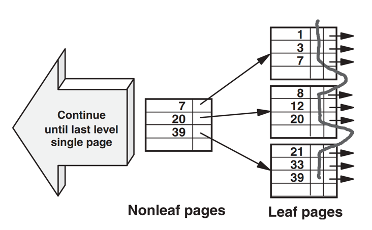

## Introduction

### Index and Table Pages

Index and table rows are grouped together in pages; these are often 4K in size, this being a rather convenient size to use for most purposes, but other page sizes may be used.
Fortunately, as far as index design is concerned, this is not an important consideration other than that the page size will determine the number of index and table rows in each page and the number of pages involved.
To cater for new rows being added to tables and indexes, a certain proportion of each page may be left free when they are loaded or reorganized. This will be considered later.

Buffer pools and I/O activity (discussed later) are based on pages; for example, an entire page will be read from disk into a buffer pool.
This means that several rows, not just one, are read into the buffer pool with a single I/O.
We will also see that several pages may be read into the pool by just one I/O.

### Index Rows

An index row is a useful concept when evaluating access paths. 
For a unique index, such as the primary key index CNO on table CUST, it is equivalent to an index entry in the leaf page (see Fig 1); the column values are copied from the table to the index, and a pointer to the table row added. 
Usually, the table page number forms a part of this pointer, something that should be kept in mind for a later time.
For a nonunique index, such as the index CITY on table CUST, the index rows for a particular index value should be visualized as individual index entries, each having the same CITY value, but followed by a different pointer value.
What is actually stored in a nonunique index is, in most cases, one CITY value followed by several pointers.

Fig.1. Very small index.

### Index Structure

The nonleaf pages always contain a (possibly truncated) key value, the highest key together with a pointer, to a page at the next lower level, as shown in Figure 1.
Several index levels may be built up in this way, until there is only a single page, called the root page, at the top of the index structure.
This type of index is called a B-tree index (a balanced tree index) because the same number of nonleaf pages are required to find each index row.

### Table Rows

Each index row shown in Figure 1 points to a corresponding row in the table; the pointer usually identifies the page in which the row resides together with some means of identifying its position within the page.
Each table row contains some control information to define the row and to enable the DBMS to handle insertions and deletions, together with the columns themselves.

The sequence in which the rows are positioned in the table, as a result of a table load or row inserts, may be defined so as to be the same as that of one of its indexes.
In this case, as the index rows are processed, one after another in key sequence, so the corresponding table rows will be processed, one after another in the same sequence.
Both index and table are then accessed in a sequential manner that, as we will see shortly, is a very efficient process.

Obviously, only one of the indexes can be defined to determine the sequence of the table rows in this way.
If the table is being accessed via any other index, as the index rows are processed, one after another in key sequence, the corresponding rows will not be held in the table in the same sequence.
For example, the first index row may point to page 17, the next index row to page 2, the next to page 85, and so forth.
Now, although the index is still being processed sequentially and efficiently, the table is being processed randomly and much less efficiently.

### Buffer Pools and Disk I/Os

One of the primary objectives of relational database management systems is to ensure that data from tables and indexes is readily available when required.
To enable this objective to be achieved as far as possible buffer pools, held in memory, are used to minimize disk activity. Each DBMS may have several pools according to the type, table or index, and the page size.
Each pool will be large enough to hold many pages, perhaps hundreds of thousands of them.
The buffer pool managers will attempt to ensure that frequently used data remains in the pool to avoid the necessity of additional reads from disk.
How effective this is will be extremely important with respect to the performance of SQL statements, and so will be equally important for the purposes of this book. We will return to this subject on many occasions where the need arises.
For now we must simply be aware of the relative costs involved in accessing index or table rows from pages that may or may not be stored in the buffer pools.

In summary then, the ideal place for an index or table page to be when it is requested is in the database buffer pool.
If it is not there, the next best place for it to be is in the disk server read cache.
If it is in neither of these, a slow read from disk will be necessary, perhaps involving a long wait for the device to become available.

- Detect SELECT statements that are too slow due to inadequate indexing: Worst input: Variable values leading to the longest elapsed time
- Design indexes that make all SELECT statements fast enough:  Table maintenance (INSERT, UPDATE, DELETE) must be fast enough as well

The SELECTs found in textbooks and course material were so unrealistically simple that the best index was usually obvious.
Experience with real applications has taught, however, that even harmless looking SELECTs, particularly joins, often have a huge number of reasonable indexing alternatives.
Estimating each alternative requires far too much effort, and measurements even more so.
On the other hand, even experienced database designers have made numerous mistakes when relying on intuition to design indexes.

## Links

- [DataBases](/docs/CS/DB/DB.md)

## References

1. [Relational database index design and the optimizers](https://book.douban.com/subject/2410000/)