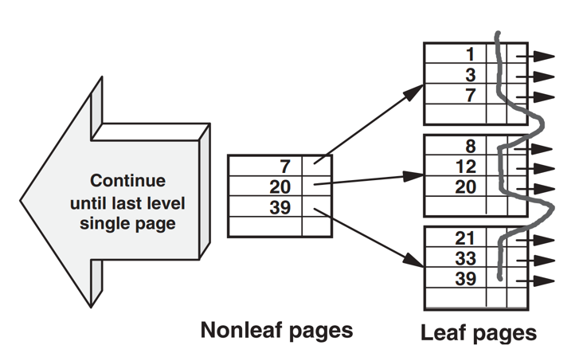

## Introduction

### Index and Table Pages

索引行和表行被分组到页面中；这些页面通常大小为 4K，这对大多数用途来说是一个相当方便的大小，但也可以使用其他页面大小。
幸运的是，就索引设计而言，这并不是一个重要考虑因素，除了页面大小将决定每页中索引行和表行的数量以及涉及的页面数量。
为了容纳新行被添加到表和索引中，每页在加载或重新组织时可能会保留一定比例的空闲空间。这一点将在后面讨论。

缓冲池和 I/O 活动（后面讨论）基于页面进行操作；例如，整个页面将从磁盘读入缓冲池。
这意味着单次 I/O 会将多行（而不仅仅是一行）读入缓冲池。
我们还将看到，单次 I/O 可以将多个页面读入缓冲池。

### Index Rows

索引行是评估访问路径时的一个有用概念。
对于唯一索引（例如表 CUST 上的主键索引 CNO），它相当于叶页面中的一个索引条目（见图 1）；列值从表复制到索引，并添加指向表行的指针。
通常，表页码构成此指针的一部分，这一点应在后续牢记。
对于非唯一索引（例如表 CUST 上的索引 CITY），特定索引值的索引行应被视为单个索引条目，每个条目具有相同的 CITY 值，但后跟不同的指针值。
实际上，在非唯一索引中存储的通常是一个 CITY 值后跟多个指针。

Fig.1. 微型索引。

### Index Structure

非叶页面始终包含一个（可能被截断的）键值、最高键以及指向下一级页面的指针，如图 1 所示。
通过这种方式可以构建多个索引层级，直到顶部只有一个页面，称为根页面。
这种类型的索引称为 B-tree 索引（平衡树索引），因为找到每个索引行所需的非叶页面数量相同。

### Table Rows

图 1 中显示的每个索引行指向表中相应的行；指针通常标识该行所在的页面，以及在该页面内定位该行位置的方式。
每个表行包含一些控制信息，用于定义该行并使 DBMS 能够处理插入和删除操作，以及列本身。

作为表加载或行插入的结果，表中行的排列顺序可以定义为与其中一个索引的顺序相同。
在这种情况下，当按键顺序逐行处理索引行时，相应的表行也将按键顺序逐行处理。
索引和表都以顺序方式访问，正如我们即将看到的，这是一个非常高效的过程。

显然，只有一个索引可以以这种方式定义表行的顺序。
如果通过任何其他索引访问表，当按键顺序逐行处理索引行时，相应的行在表中的存储顺序将不同。
例如，第一个索引行可能指向第 17 页，下一个索引行指向第 2 页，再下一个指向第 85 页，依此类推。
此时，虽然索引仍然是顺序高效处理的，但表却是随机处理的，效率要低得多。

### Buffer Pools and Disk I/Os

关系数据库管理系统的主要目标之一是确保表和索引中的数据在需要时随时可用。
为了实现这一目标，尽可能使用内存中的缓冲池来最小化磁盘活动。每个 DBMS 可能根据类型（表或索引）和页面大小拥有多个缓冲池。
每个池的大小足以容纳许多页面，可能有数十万个页面。
缓冲池管理器将努力确保常用数据保留在池中，以避免额外的磁盘读取。
这对于 SQL 语句的性能至关重要，因此对于本书的目的也同样重要。我们将在需要时多次回到这个主题。
现在，我们只需了解从可能存储在缓冲池中或可能未存储的页面访问索引或表行所涉及的相对成本。

总之，索引或表页面在请求时的理想位置是在数据库缓冲池中。
如果不在那里，次佳位置是在磁盘服务器读取缓存中。
如果两者都不在，则需要进行缓慢的磁盘读取，可能涉及长时间等待设备变为可用。

- 检测因索引不足而过慢的 SELECT 语句：最差输入：导致最长运行时间的变量值
- 设计使所有 SELECT 语句足够快的索引：表的维护（INSERT、UPDATE、DELETE）也必须足够快

教科书和教材中的 SELECT 语句过于简单，以至于最佳索引通常是显而易见的。
然而，实际应用的经验告诉我们，即使是看似无害的 SELECT 语句（特别是连接），通常也有大量合理的索引选择。
估算每种选择需要太多的工作，测量更是如此。
另一方面，即使是经验丰富的数据库设计师在依赖直觉设计索引时也犯过许多错误。

## Links

- [DataBases](/docs/CS/DB/DB.md)

## References

1. [Relational database index design and the optimizers](https://book.douban.com/subject/2410000/)
