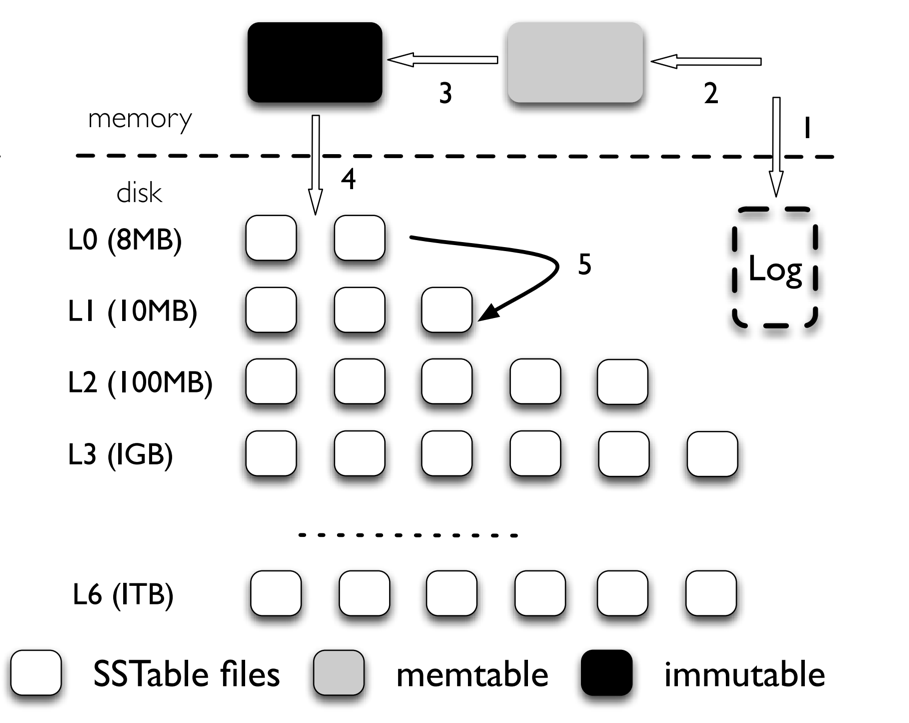

## Introduction

[LevelDB](https://github.com/google/leveldb) is a fast key-value storage library written at Google that provides an ordered mapping from string keys to string values.
LevelDB is a widely used key-value store based on [LSMtrees](/docs/CS/Algorithms/LSM.md) that is inspired by [BigTable](/docs/CS/Distributed/Bigtable.md).
LevelDB supports range queries, snapshots, and other features that are useful in modern applications.

## Architecture

<div style="text-align: center;">



</div>

<p style="text-align: center;">
Fig.1. LevelDB architecture. 
For LevelDB, inserting a key-value pair goes through many steps: (1) the log file; (2) the memtable; (3) the immutable memtable; (4) a SSTable in L0; (5) compacted to further levels.
</p>

The overall architecture of LevelDB is shown in Figure 1. The main data structures in LevelDB are an ondisk log file, two in-memory sorted skiplists (memtable
and immutable memtable), and seven levels (L0 to L6)
of on-disk Sorted String Table (SSTable) files. LevelDB
initially stores inserted key-value pairs in a log file and
the in-memory memtable. Once the memtable is full,
LevelDB switches to a new memtable and log file to
handle further inserts from the user. In the background,
the previous memtable is converted into an immutable
memtable, and a compaction thread then flushes it to the
disk, generating a new SSTable file (about 2 MB usually)
at level 0 (L0); the previous log file is discarded.
The size of all files in each level is limited, and increases by a factor of ten with the level number. For
example, the size limit of all files at L1 is 10 MB, while
the limit of L2 is 100 MB. To maintain the size limit,
once the total size of a level Li exceeds its limit, the
compaction thread will choose one file from Li, merge
sort with all the overlapped files of Li+1, and generate
new Li+1 SSTable files. The compaction thread continues until all levels are within their size limits. Also,
during compaction, LevelDB ensures that all files in a
particular level, except L0, do not overlap in their keyranges; keys in files of L0 can overlap with each other
since they are directly flushed from memtable.

To serve a lookup operation, LevelDB searches the
memtable first, immutable memtable next, and then files
L0 to L6 in order. The number of file searches required to
locate a random key is bounded by the maximum number
of levels, since keys do not overlap between files within
a single level, except in L0. Since files in L0 can contain overlapping keys, a lookup may search multiple files
at L0. To avoid a large lookup latency, LevelDB slows
down the foreground write traffic if the number of files
at L0 is bigger than eight, in order to wait for the compaction thread to compact some files from L0 to L1.

## Data Types

Keys and values are arbitrary byte arrays. The keys are ordered within the key value store according to a user-specified comparator function.

Slice

```cpp
// db_impl.cc
Status DB::Open(const Options& options, const std::string& dbname, DB** dbptr) {
  *dbptr = nullptr;

  DBImpl* impl = new DBImpl(options, dbname);
  impl->mutex_.Lock();
  VersionEdit edit;
  // Recover handles create_if_missing, error_if_exists
  bool save_manifest = false;
  Status s = impl->Recover(&edit, &save_manifest);
  if (s.ok() && impl->mem_ == nullptr) {
    // Create new log and a corresponding memtable.
    uint64_t new_log_number = impl->versions_->NewFileNumber();
    WritableFile* lfile;
    s = options.env->NewWritableFile(LogFileName(dbname, new_log_number),
                                     &lfile);
    if (s.ok()) {
      edit.SetLogNumber(new_log_number);
      impl->logfile_ = lfile;
      impl->logfile_number_ = new_log_number;
      impl->log_ = new log::Writer(lfile);
      impl->mem_ = new MemTable(impl->internal_comparator_);
      impl->mem_->Ref();
    }
  }
  if (s.ok() && save_manifest) {
    edit.SetPrevLogNumber(0);  // No older logs needed after recovery.
    edit.SetLogNumber(impl->logfile_number_);
    s = impl->versions_->LogAndApply(&edit, &impl->mutex_);
  }
  if (s.ok()) {
    impl->RemoveObsoleteFiles();
    impl->MaybeScheduleCompaction();
  }
  impl->mutex_.Unlock();
  if (s.ok()) {
    assert(impl->mem_ != nullptr);
    *dbptr = impl;
  } else {
    delete impl;
  }
  return s;
}
```

Get

```cpp

Status DBImpl::Get(const ReadOptions& options, const Slice& key,
                   std::string* value) {
  Status s;
  MutexLock l(&mutex_);
  SequenceNumber snapshot;
  if (options.snapshot != nullptr) {
    snapshot =
        static_cast<const SnapshotImpl*>(options.snapshot)->sequence_number();
  } else {
    snapshot = versions_->LastSequence();
  }

  MemTable* mem = mem_;
  MemTable* imm = imm_;
  Version* current = versions_->current();
  mem->Ref();
  if (imm != nullptr) imm->Ref();
  current->Ref();

  bool have_stat_update = false;
  Version::GetStats stats;

  // Unlock while reading from files and memtables
  {
    mutex_.Unlock();
    // First look in the memtable, then in the immutable memtable (if any).
    LookupKey lkey(key, snapshot);
    if (mem->Get(lkey, value, &s)) {
      // Done
    } else if (imm != nullptr && imm->Get(lkey, value, &s)) {
      // Done
    } else {
      s = current->Get(options, lkey, value, &stats);
      have_stat_update = true;
    }
    mutex_.Lock();
  }

  if (have_stat_update && current->UpdateStats(stats)) {
    MaybeScheduleCompaction();
  }
  mem->Unref();
  if (imm != nullptr) imm->Unref();
  current->Unref();
  return s;
}
```

> [!Note]
>
> Ref() Unref()

Put

```cpp
Status DB::Put(const WriteOptions& opt, const Slice& key, const Slice& value) {
  WriteBatch batch;
  batch.Put(key, value);
  return Write(opt, &batch);
}
```

write

```cpp
Status DBImpl::Write(const WriteOptions& options, WriteBatch* updates) {
  Writer w(&mutex_);
  w.batch = updates;
  w.sync = options.sync;
  w.done = false;

  MutexLock l(&mutex_);
  writers_.push_back(&w);
  while (!w.done && &w != writers_.front()) {
    w.cv.Wait();
  }
  if (w.done) {
    return w.status;
  }

  // May temporarily unlock and wait.
  Status status = MakeRoomForWrite(updates == nullptr);
  uint64_t last_sequence = versions_->LastSequence();
  Writer* last_writer = &w;
  if (status.ok() && updates != nullptr) {  // nullptr batch is for compactions
    WriteBatch* write_batch = BuildBatchGroup(&last_writer);
    WriteBatchInternal::SetSequence(write_batch, last_sequence + 1);
    last_sequence += WriteBatchInternal::Count(write_batch);

    // Add to log and apply to memtable.  We can release the lock
    // during this phase since &w is currently responsible for logging
    // and protects against concurrent loggers and concurrent writes
    // into mem_.
    {
      mutex_.Unlock();
      status = log_->AddRecord(WriteBatchInternal::Contents(write_batch));
      bool sync_error = false;
      if (status.ok() && options.sync) {
        status = logfile_->Sync();
        if (!status.ok()) {
          sync_error = true;
        }
      }
      if (status.ok()) {
        status = WriteBatchInternal::InsertInto(write_batch, mem_);
      }
      mutex_.Lock();
      if (sync_error) {
        // The state of the log file is indeterminate: the log record we
        // just added may or may not show up when the DB is re-opened.
        // So we force the DB into a mode where all future writes fail.
        RecordBackgroundError(status);
      }
    }
    if (write_batch == tmp_batch_) tmp_batch_->Clear();

    versions_->SetLastSequence(last_sequence);
  }

  while (true) {
    Writer* ready = writers_.front();
    writers_.pop_front();
    if (ready != &w) {
      ready->status = status;
      ready->done = true;
      ready->cv.Signal();
    }
    if (ready == last_writer) break;
  }

  // Notify new head of write queue
  if (!writers_.empty()) {
    writers_.front()->cv.Signal();
  }

  return status;
}
```

## Compress

Snappy

## MemTable

```cpp

void MemTable::Add(SequenceNumber s, ValueType type, const Slice& key,
                   const Slice& value) {
  // Format of an entry is concatenation of:
  //  key_size     : varint32 of internal_key.size()
  //  key bytes    : char[internal_key.size()]
  //  tag          : uint64((sequence << 8) | type)
  //  value_size   : varint32 of value.size()
  //  value bytes  : char[value.size()]
  size_t key_size = key.size();
  size_t val_size = value.size();
  size_t internal_key_size = key_size + 8;
  const size_t encoded_len = VarintLength(internal_key_size) +
                             internal_key_size + VarintLength(val_size) +
                             val_size;
  char* buf = arena_.Allocate(encoded_len);
  char* p = EncodeVarint32(buf, internal_key_size);
  std::memcpy(p, key.data(), key_size);
  p += key_size;
  EncodeFixed64(p, (s << 8) | type);
  p += 8;
  p = EncodeVarint32(p, val_size);
  std::memcpy(p, value.data(), val_size);
  assert(p + val_size == buf + encoded_len);
  table_.Insert(buf);
}

bool MemTable::Get(const LookupKey& key, std::string* value, Status* s) {
  Slice memkey = key.memtable_key();
  Table::Iterator iter(&table_);
  iter.Seek(memkey.data());
  if (iter.Valid()) {
    // entry format is:
    //    klength  varint32
    //    userkey  char[klength]
    //    tag      uint64
    //    vlength  varint32
    //    value    char[vlength]
    // Check that it belongs to same user key.  We do not check the
    // sequence number since the Seek() call above should have skipped
    // all entries with overly large sequence numbers.
    const char* entry = iter.key();
    uint32_t key_length;
    const char* key_ptr = GetVarint32Ptr(entry, entry + 5, &key_length);
    if (comparator_.comparator.user_comparator()->Compare(
            Slice(key_ptr, key_length - 8), key.user_key()) == 0) {
      // Correct user key
      const uint64_t tag = DecodeFixed64(key_ptr + key_length - 8);
      switch (static_cast<ValueType>(tag & 0xff)) {
        case kTypeValue: {
          Slice v = GetLengthPrefixedSlice(key_ptr + key_length);
          value->assign(v.data(), v.size());
          return true;
        }
        case kTypeDeletion:
          *s = Status::NotFound(Slice());
          return true;
      }
    }
  }
  return false;
}
```

MaxHeight = 12

Random() % 4 = 0


| Height | Probability         |
| -------- | --------------------- |
| 1      | $3/4$               |
| 2      | $3/4 * 1/4$         |
| 3      | $3/4 * (1/4)^(4-2)$ |
| n      | $3/4 * (1/4)^(n-2)$ |

```cpp
enum { kMaxHeight = 12 };


template <typename Key, class Comparator>
int SkipList<Key, Comparator>::RandomHeight() {
  // Increase height with probability 1 in kBranching
  static const unsigned int kBranching = 4;
  int height = 1;
  while (height < kMaxHeight && rnd_.OneIn(kBranching)) {
    height++;
  }
  return height;
}
```

Build Table

```cpp

Status BuildTable(const std::string& dbname, Env* env, const Options& options,
                  TableCache* table_cache, Iterator* iter, FileMetaData* meta) {
  Status s;
  meta->file_size = 0;
  iter->SeekToFirst();

  std::string fname = TableFileName(dbname, meta->number);
  if (iter->Valid()) {
    WritableFile* file;
    s = env->NewWritableFile(fname, &file);
    if (!s.ok()) {
      return s;
    }

    TableBuilder* builder = new TableBuilder(options, file);
    meta->smallest.DecodeFrom(iter->key());
    Slice key;
    for (; iter->Valid(); iter->Next()) {
      key = iter->key();
      builder->Add(key, iter->value());
    }
    if (!key.empty()) {
      meta->largest.DecodeFrom(key);
    }

    // Finish and check for builder errors
    s = builder->Finish();
    if (s.ok()) {
      meta->file_size = builder->FileSize();
      assert(meta->file_size > 0);
    }
    delete builder;

    // Finish and check for file errors
    if (s.ok()) {
      s = file->Sync();
    }
    if (s.ok()) {
      s = file->Close();
    }
    delete file;
    file = nullptr;

    if (s.ok()) {
      // Verify that the table is usable
      Iterator* it = table_cache->NewIterator(ReadOptions(), meta->number,
                                              meta->file_size);
      s = it->status();
      delete it;
    }
  }

  // Check for input iterator errors
  if (!iter->status().ok()) {
    s = iter->status();
  }

  if (s.ok() && meta->file_size > 0) {
    // Keep it
  } else {
    env->RemoveFile(fname);
  }
  return s;
}
```

## LRU

## Links

- [RocksDB](/docs/CS/DB/RocksDB/RocksDB.md)

## References

1. []
